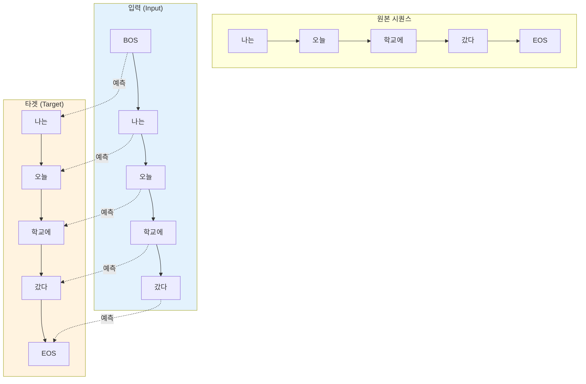
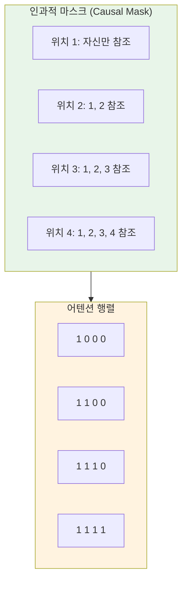
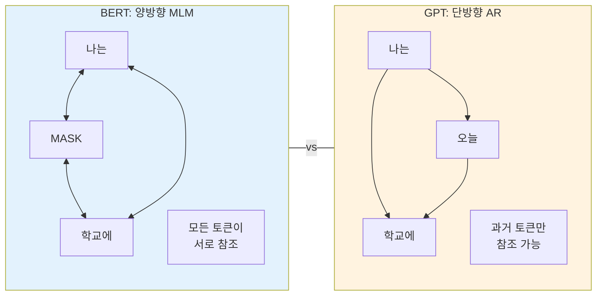
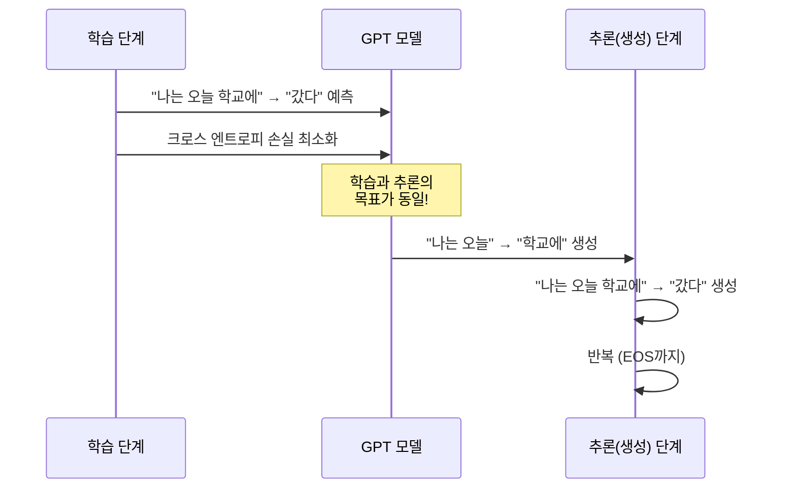

# 자기회귀 언어 모델링

> GPT의 핵심 원리, "다음 단어 맞추기"로 언어를 배우는 자기회귀 모델의 모든 것

## 개요

이 섹션에서는 GPT 계열 모델의 근간이 되는 **자기회귀(autoregressive) 언어 모델링**의 원리를 학습합니다. 이전 토큰들로부터 다음 토큰을 예측하는 방식이 어떻게 작동하는지, 그리고 미래 정보를 차단하는 **인과적 마스킹(Causal Masking)**이 왜 필요한지 이해합니다.

**선수 지식**: [어텐션 메커니즘](12-어텐션-메커니즘/01-01-어텐션의-직관적-이해.md)과 [트랜스포머 아키텍처](13-트랜스포머-아키텍처-심층-분석/01-01-트랜스포머-아키텍처-전체-조망.md)의 기본 구조, [BERT의 사전학습 방식](16-bert-양방향-사전학습-모델/02-02-bert의-아키텍처와-사전학습.md)

**학습 목표**:
- 자기회귀 모델의 수학적 정의와 직관적 의미를 설명할 수 있다
- 다음 토큰 예측(Next Token Prediction)의 학습 메커니즘을 이해한다
- 인과적 마스킹의 역할과 구현 방법을 PyTorch로 직접 구현할 수 있다
- BERT(양방향)와 GPT(단방향)의 근본적 차이를 비교 분석할 수 있다

## 왜 알아야 할까?

ChatGPT, Claude, Gemini — 우리가 매일 사용하는 대화형 AI의 핵심에는 하나의 단순한 원리가 있습니다. 바로 **"이전 맥락을 보고 다음 단어를 예측한다"**는 것이죠. 이 원리가 바로 자기회귀 언어 모델링입니다.

놀랍게도, "다음 단어 맞추기"라는 이 단순한 과제를 극한까지 스케일업한 것이 현대 LLM의 정체입니다. 자기회귀 모델링을 이해하지 못하면, GPT가 왜 텍스트를 한 토큰씩 생성하는지, 왜 "환각(hallucination)"이 발생하는지, 왜 프롬프트 엔지니어링이 중요한지를 근본적으로 이해할 수 없습니다.

이 섹션은 GPT 챕터의 첫 번째 문으로, 여기서 배운 자기회귀 원리가 이후 GPT 아키텍처, nanoGPT 구현, 그리고 최종적으로 LLM 활용까지 이어지는 모든 내용의 기반이 됩니다.

## 핵심 개념

### 개념 1: 자기회귀 모델이란?

> 💡 **비유**: 소설을 쓰는 작가를 상상해보세요. 작가는 이미 쓴 문장들을 다시 읽으며 다음 문장을 결정합니다. "어두운 밤, 한 남자가 골목에 들어섰다." 다음에 뭐가 올지는 앞의 맥락이 결정하죠. 자기회귀 모델도 정확히 이렇게 작동합니다 — 지금까지의 텍스트를 보고, 다음에 올 가장 자연스러운 토큰을 예측하는 겁니다.

**자기회귀(Autoregressive)**라는 이름 자체에 힌트가 있습니다. "자기(auto)" + "회귀(regressive)" — 자기 자신의 이전 출력을 입력으로 사용한다는 뜻이거든요. 시계열 분석에서 유래한 개념인데, NLP에서는 이전에 생성한 토큰들이 다음 토큰 예측의 조건이 됩니다.

수학적으로 표현하면, 전체 시퀀스의 확률을 조건부 확률의 곱으로 분해합니다:

$$P(x_1, x_2, ..., x_T) = \prod_{t=1}^{T} P(x_t \mid x_1, x_2, ..., x_{t-1})$$

- $x_t$: 시점 $t$에서의 토큰
- $P(x_t \mid x_1, ..., x_{t-1})$: 이전 모든 토큰이 주어졌을 때 $x_t$의 조건부 확률

이 분해는 확률의 체인 룰(chain rule)에 의해 **항상 성립**합니다. 핵심은 이 조건부 확률을 신경망으로 모델링한다는 것이죠.

> 📊 **그림 1**: 자기회귀 모델의 순차 예측 과정


각 스텝에서 모델은 지금까지의 모든 토큰을 입력으로 받아 다음 토큰의 확률 분포를 출력합니다. 그리고 그 분포에서 토큰을 선택(샘플링 또는 argmax)하면, 그것이 다시 다음 스텝의 입력에 추가됩니다. 이 과정이 종료 토큰(`<eos>`)이 나올 때까지 반복되죠.

```python
import torch
import torch.nn.functional as F

# 자기회귀 모델의 핵심: 조건부 확률 계산
# vocab_size = 10인 간단한 예시
vocab_size = 10
seq_len = 4

# 모델이 출력한 로짓(logits) — 각 위치에서 다음 토큰의 점수
logits = torch.randn(1, seq_len, vocab_size)  # (batch, seq_len, vocab_size)

# softmax로 확률 분포 변환
probs = F.softmax(logits, dim=-1)  # 각 위치에서 다음 토큰의 확률 분포

# 가장 확률 높은 토큰 선택 (greedy decoding)
next_tokens = torch.argmax(probs, dim=-1)  # (batch, seq_len)
```

### 개념 2: 다음 토큰 예측(Next Token Prediction)

> 💡 **비유**: 스마트폰 키보드의 자동완성 기능을 떠올려보세요. "오늘 날씨가"라고 입력하면 "좋다", "춥다", "덥다" 같은 후보가 뜨잖아요? 자기회귀 모델은 이 자동완성을 극도로 정교하게 수행하는 것입니다. 단, 전체 어휘(수만 개 토큰)에 대한 확률 분포를 한 번에 계산하죠.

다음 토큰 예측은 자기회귀 모델의 **학습 목표(training objective)**입니다. 모델에게 텍스트를 주고, 각 위치에서 다음에 올 토큰을 맞추도록 훈련하는 거죠.

> 📊 **그림 2**: 입력-타겟 시프트 패턴



핵심 트릭은 **입력-타겟 시프트(shift)**입니다. 같은 시퀀스를 한 칸 밀어서 입력과 타겟을 만들거든요:

- **입력**: `[BOS, 나는, 오늘, 학교에, 갔다]`
- **타겟**: `[나는, 오늘, 학교에, 갔다, EOS]`

이렇게 하면 하나의 시퀀스에서 동시에 여러 위치의 예측을 병렬로 학습할 수 있어요. BERT의 MLM이 랜덤하게 15%만 마스킹하는 것과 달리, 자기회귀 모델은 **모든 위치**에서 학습 신호를 얻습니다.

```run:python
import torch
import torch.nn.functional as F

# 입력-타겟 시프트 예시
# 토큰 ID로 인코딩된 시퀀스 (가상)
# 0=BOS, 1=나는, 2=오늘, 3=학교에, 4=갔다, 5=EOS
sequence = torch.tensor([0, 1, 2, 3, 4, 5])

# 입력: 마지막 토큰 제외
input_ids = sequence[:-1]   # [BOS, 나는, 오늘, 학교에, 갔다]

# 타겟: 첫 토큰 제외 (한 칸 시프트)
target_ids = sequence[1:]   # [나는, 오늘, 학교에, 갔다, EOS]

print(f"입력 (input):  {input_ids.tolist()}")
print(f"타겟 (target): {target_ids.tolist()}")
print(f"학습 위치 수:  {len(target_ids)}개 (모든 위치에서 학습!)")
```

```output
입력 (input):  [0, 1, 2, 3, 4]
타겟 (target): [1, 2, 3, 4, 5]
학습 위치 수:  5개 (모든 위치에서 학습!)
```

손실 함수는 **크로스 엔트로피(Cross-Entropy)**를 사용합니다. 모델이 예측한 확률 분포와 실제 다음 토큰 사이의 거리를 최소화하는 거죠:

$$\mathcal{L} = -\sum_{t=1}^{T} \log P_\theta(x_t \mid x_{<t})$$

이 식이 의미하는 바는 명확합니다 — 모델이 실제 다음 토큰에 높은 확률을 부여할수록 손실이 줄어듭니다. 결국 모델은 인간이 쓴 텍스트의 패턴을 점점 더 정확하게 학습하게 되죠.

### 개념 3: 인과적 마스킹(Causal Masking)

> 💡 **비유**: 시험에서 컨닝을 방지하는 칸막이를 생각해보세요. 학생이 자기 앞에 있는 문제만 볼 수 있고, 뒤에 있는 답을 엿볼 수 없도록 막아놓는 것이죠. 인과적 마스킹도 마찬가지입니다 — 각 토큰이 자기보다 미래에 있는 토큰을 "컨닝"하지 못하도록 어텐션을 차단합니다.

자기회귀 모델의 학습에서 한 가지 중요한 문제가 있습니다. 트랜스포머의 셀프 어텐션은 원래 **모든 위치**를 동시에 참조하거든요. 그런데 자기회귀 모델은 미래 토큰을 보면 안 됩니다 — 시험지의 답을 미리 보는 것과 같으니까요.

이 문제를 해결하는 것이 **인과적 마스킹(Causal Masking)**입니다. 하삼각 행렬(lower triangular matrix)을 만들어서, 각 위치가 자기 자신과 이전 위치만 어텐드할 수 있도록 강제합니다.

> 📊 **그림 3**: 인과적 마스킹의 어텐션 패턴



구현은 놀라울 정도로 간단합니다. `torch.tril`로 하삼각 행렬을 만들고, 0인 위치를 `-inf`로 채워 softmax 후 확률이 0이 되게 만들면 됩니다:

```run:python
import torch

seq_len = 5

# 하삼각 행렬로 인과적 마스크 생성
causal_mask = torch.tril(torch.ones(seq_len, seq_len))
print("인과적 마스크:")
print(causal_mask)
print()

# 어텐션 스코어에 마스크 적용
attn_scores = torch.randn(seq_len, seq_len)  # 임의의 어텐션 스코어
print("원본 어텐션 스코어 (일부):")
print(attn_scores[0, :3].tolist())
print()

# 미래 위치를 -inf로 마스킹
masked_scores = attn_scores.masked_fill(causal_mask == 0, float('-inf'))
print("마스킹 후 (1행, 미래 위치가 -inf):")
print(masked_scores[0].tolist())
```

```output
인과적 마스크:
tensor([[1., 0., 0., 0., 0.],
        [1., 1., 0., 0., 0.],
        [1., 1., 1., 0., 0.],
        [1., 1., 1., 1., 0.],
        [1., 1., 1., 1., 1.]])

원본 어텐션 스코어 (일부):
[0.4963, 0.7682, -0.1321]

마스킹 후 (1행, 미래 위치가 -inf):
[0.4963, -inf, -inf, -inf, -inf]
```

`-inf` 값은 softmax를 통과하면 정확히 0이 됩니다. $e^{-\infty} = 0$이니까요. 이렇게 하면 어텐션 가중치가 미래 토큰에는 절대 할당되지 않습니다.

> ⚠️ **흔한 오해**: "인과적 마스킹은 추론(inference) 때만 필요하다"고 생각하시는 분이 있는데, 아닙니다. **학습 때도 반드시 필요합니다.** 학습 시에는 전체 시퀀스를 한 번에 입력하므로, 마스킹 없이는 모델이 답을 미리 보고 학습하게 됩니다. 추론 때는 어차피 미래 토큰이 없어서 자연스럽게 인과성이 보장되지만, 학습에서의 마스킹이 핵심입니다.

### 개념 4: BERT(양방향) vs GPT(단방향) 비교

> 💡 **비유**: BERT는 빈칸 채우기 시험이고, GPT는 이어쓰기 시험입니다. "나는 __ 학교에 갔다"에서 빈칸을 맞추는 것(BERT)과, "나는 오늘"에 이어서 글을 계속 쓰는 것(GPT)은 근본적으로 다른 능력을 요구하죠.

[BERT](16-bert-양방향-사전학습-모델/02-02-bert의-아키텍처와-사전학습.md)와 GPT는 같은 트랜스포머 기반이지만, 사전학습 방식이 정반대입니다.

> 📊 **그림 4**: BERT vs GPT의 어텐션 패턴 비교



| 비교 항목 | BERT (양방향) | GPT (단방향) |
|-----------|--------------|-------------|
| **사전학습 목표** | 마스크 언어 모델링(MLM) | 다음 토큰 예측(NTP) |
| **어텐션 방향** | 양방향 (전체 문맥) | 단방향 (왼쪽 → 오른쪽) |
| **마스킹** | 랜덤 15% 토큰 마스킹 | 인과적 마스킹 (미래 차단) |
| **학습 효율** | 전체의 15%만 학습 신호 | 모든 위치에서 학습 신호 |
| **강점** | 이해(NLU): 분류, QA, NER | 생성(NLG): 텍스트 생성, 대화 |
| **트랜스포머 부분** | 인코더만 사용 | 디코더만 사용 |

```python
import torch
import torch.nn.functional as F

seq_len = 4

# === BERT 스타일: 양방향 어텐션 ===
# 모든 위치가 모든 위치를 참조 (마스크 없음)
bert_mask = torch.ones(seq_len, seq_len)
print("BERT 어텐션 마스크 (양방향):")
print(bert_mask)

# === GPT 스타일: 단방향 어텐션 ===
# 각 위치는 자신과 이전 위치만 참조
gpt_mask = torch.tril(torch.ones(seq_len, seq_len))
print("\nGPT 어텐션 마스크 (단방향):")
print(gpt_mask)
```

왜 GPT가 텍스트 생성에 유리한지 이제 명확합니다. GPT는 학습 과정 자체가 "이전 토큰들을 보고 다음 토큰 예측"이므로, 생성(generation) 과정과 학습 과정이 **완벽히 일치**합니다. 반면 BERT는 양방향 문맥을 보는 방식으로 학습하기 때문에, 왼쪽에서 오른쪽으로 한 토큰씩 생성하는 것에는 맞지 않습니다.

> 📊 **그림 5**: 사전학습과 추론의 관계



## 실습: 직접 해보기

자기회귀 언어 모델의 핵심 요소들을 직접 구현해봅시다. 간단한 자기회귀 모델을 만들어 학습하고, 텍스트를 생성해보겠습니다.

```run:python
import torch
import torch.nn as nn
import torch.nn.functional as F

# ========================================
# 미니 자기회귀 언어 모델
# ========================================

class MiniAutoRegressiveLM(nn.Module):
    """가장 간단한 형태의 자기회귀 언어 모델"""
    
    def __init__(self, vocab_size, d_model, max_len):
        super().__init__()
        self.token_emb = nn.Embedding(vocab_size, d_model)  # 토큰 임베딩
        self.pos_emb = nn.Embedding(max_len, d_model)       # 위치 임베딩
        self.head = nn.Linear(d_model, vocab_size)           # 출력 헤드
        
    def forward(self, x):
        B, T = x.shape
        # 토큰 + 위치 임베딩
        positions = torch.arange(T, device=x.device)
        h = self.token_emb(x) + self.pos_emb(positions)  # (B, T, d_model)
        logits = self.head(h)  # (B, T, vocab_size)
        return logits

# ========================================
# 인과적 마스킹이 적용된 어텐션 구현
# ========================================
def causal_self_attention(query, key, value):
    """인과적 셀프 어텐션 — GPT의 핵심 연산"""
    seq_len = query.size(-2)
    d_k = query.size(-1)
    
    # 어텐션 스코어 계산 + 스케일링
    scores = torch.matmul(query, key.transpose(-2, -1)) / (d_k ** 0.5)
    
    # 인과적 마스크 적용 — 미래를 볼 수 없게!
    causal_mask = torch.tril(torch.ones(seq_len, seq_len, device=scores.device))
    scores = scores.masked_fill(causal_mask == 0, float('-inf'))
    
    # softmax → -inf는 0이 됨
    attn_weights = F.softmax(scores, dim=-1)
    
    # 가중합
    output = torch.matmul(attn_weights, value)
    return output, attn_weights

# ========================================
# 데모: 인과적 어텐션의 가중치 확인
# ========================================
torch.manual_seed(42)
seq_len, d_model = 4, 8

# 임의의 Q, K, V
Q = torch.randn(1, seq_len, d_model)
K = torch.randn(1, seq_len, d_model)
V = torch.randn(1, seq_len, d_model)

output, weights = causal_self_attention(Q, K, V)

print("인과적 어텐션 가중치 (각 행의 합 = 1.0):")
for i in range(seq_len):
    row = weights[0, i].tolist()
    formatted = [f"{w:.3f}" for w in row]
    print(f"  위치 {i}: {formatted}")

print(f"\n위치 0은 자신만 참조: 가중치 합 = {weights[0, 0].sum():.1f}")
print(f"위치 3은 0~3 참조:   가중치 합 = {weights[0, 3].sum():.1f}")
```

```output
인과적 어텐션 가중치 (각 행의 합 = 1.0):
  위치 0: ['1.000', '0.000', '0.000', '0.000']
  위치 1: ['0.587', '0.413', '0.000', '0.000']
  위치 2: ['0.135', '0.589', '0.276', '0.000']
  위치 3: ['0.025', '0.587', '0.128', '0.260']

위치 0은 자신만 참조: 가중치 합 = 1.0
위치 3은 0~3 참조:   가중치 합 = 1.0
```

위치 0의 어텐션 가중치를 보세요 — `[1.000, 0.000, 0.000, 0.000]`입니다. 첫 번째 토큰은 자기 자신만 참조할 수 있죠. 반면 위치 3은 모든 이전 토큰을 참조하되, 각각 다른 가중치로 어텐드합니다. 이것이 바로 인과적 마스킹이 만들어내는 단방향 정보 흐름입니다.

## 더 깊이 알아보기

### 자기회귀 모델의 뿌리: 클로드 섀넌의 통신 이론

자기회귀 언어 모델링의 지적 뿌리는 1948년 **클로드 섀넌(Claude Shannon)**의 정보 이론으로 거슬러 올라갑니다. 섀넌은 그의 기념비적 논문 "A Mathematical Theory of Communication"에서 언어를 **확률적 과정(stochastic process)**으로 모델링하는 아이디어를 제시했어요.

섀넌은 실제로 영어 텍스트의 n-gram 통계를 분석하여 랜덤 텍스트를 생성하는 실험을 했습니다. 1차 근사(각 글자 독립), 2차 근사(이전 글자에 조건부), 3차 근사... 이렇게 조건의 범위를 늘릴수록 점점 자연스러운 텍스트가 나온다는 것을 보여줬죠. 현대의 GPT는 바로 이 아이디어를 극한까지 확장한 것입니다 — n-gram의 n을 수천~수만으로 늘리고, 확률 추정을 거대 신경망으로 대체한 것이죠.

### GPT-1: 자기회귀의 부활

흥미로운 역사적 사실이 있습니다. 2018년 GPT-1이 나오기 직전, NLP 커뮤니티에서는 ELMo(2018.2)와 BERT(2018.10)로 대표되는 **양방향 모델**이 대세였습니다. "양방향이 당연히 더 좋지 않나?"라는 것이 상식이었죠. 그런 상황에서 Alec Radford와 팀은 오히려 **단방향 자기회귀** 방식으로 사전학습을 했고, 12개 태스크 중 9개에서 SOTA를 달성합니다.

당시에는 BERT가 GPT-1을 뛰어넘으면서 자기회귀 접근법이 한풀 꺾이는 것처럼 보였습니다. 하지만 GPT-2, GPT-3를 거치며 **스케일링**이 자기회귀 모델의 진정한 힘을 끌어낸다는 것이 밝혀졌고, 결국 현대 LLM의 주류는 자기회귀 모델이 되었습니다. 역사의 아이러니라고 할 수 있죠.

## 흔한 오해와 팁

> ⚠️ **흔한 오해**: "자기회귀 모델은 왼쪽만 보니까 BERT보다 문맥 이해가 떨어진다." — 이 말은 절반만 맞습니다. 모델이 충분히 크면(GPT-3 이상), 왼쪽 문맥만으로도 사실상 양방향 못지않은 이해력을 보여줍니다. 모델 크기와 학습 데이터가 충분하면 단방향의 한계가 상당 부분 극복됩니다.

> 💡 **알고 계셨나요?**: GPT의 학습 효율이 BERT보다 높을 수 있습니다. BERT의 MLM은 입력의 15%만 마스킹하므로 전체 토큰의 15%에서만 학습 신호를 얻지만, GPT의 자기회귀 목표는 **모든 위치**에서 손실을 계산합니다. 같은 양의 데이터로 더 많은 학습 신호를 추출하는 셈이죠.

> 🔥 **실무 팁**: PyTorch 2.0 이상에서는 `torch.nn.functional.scaled_dot_product_attention`에 `is_causal=True`를 설정하면 인과적 마스킹이 자동 적용됩니다. 직접 마스크를 만들 필요가 없고, FlashAttention 같은 최적화도 자동으로 적용되어 메모리와 속도 모두 개선됩니다.

```python
# PyTorch 2.0+ 최적화된 인과적 어텐션
import torch.nn.functional as F

# is_causal=True만 설정하면 끝!
output = F.scaled_dot_product_attention(
    query, key, value,
    is_causal=True  # 인과적 마스킹 자동 적용 + FlashAttention 최적화
)
```

## 핵심 정리

| 개념 | 설명 |
|------|------|
| **자기회귀 모델** | 이전 토큰들을 조건으로 다음 토큰을 순차 예측하는 모델 |
| **다음 토큰 예측(NTP)** | GPT의 학습 목표. 크로스 엔트로피 손실로 최적화 |
| **입력-타겟 시프트** | 같은 시퀀스를 한 칸 밀어 입력과 타겟을 생성하는 기법 |
| **인과적 마스킹** | 하삼각 행렬로 미래 토큰 참조를 차단하는 어텐션 마스크 |
| **체인 룰 분해** | $P(x_{1:T}) = \prod P(x_t \mid x_{<t})$ — 자기회귀의 수학적 기반 |
| **BERT vs GPT** | 양방향 MLM(이해) vs 단방향 NTP(생성) — 같은 트랜스포머, 다른 목표 |

## 다음 섹션 미리보기

자기회귀 모델링의 원리를 이해했으니, 다음 섹션 [GPT 아키텍처 상세 분석](17-gpt-생성적-사전학습-모델/02-02-gpt-아키텍처-상세-분석.md)에서는 이 원리를 실제로 구현한 GPT의 구체적인 아키텍처를 파헤칩니다. 디코더 전용 트랜스포머의 레이어 구성, GPT-1과 GPT-2의 구조적 차이(Post-LN vs Pre-LN), 그리고 하나의 모델로 다양한 태스크를 처리하는 입력 변환 전략까지 살펴봅니다.

## 참고 자료

- [Improving Language Understanding by Generative Pre-Training (GPT-1 논문)](https://cdn.openai.com/research-covers/language-unsupervised/language_understanding_paper.pdf) - Radford et al., 2018. 자기회귀 사전학습의 효과를 최초로 입증한 논문
- [Language Models are Unsupervised Multitask Learners (GPT-2 논문)](https://cdn.openai.com/better-language-models/language_models_are_unsupervised_multitask_learners.pdf) - Radford et al., 2019. 스케일업으로 제로샷 멀티태스크가 가능함을 보여준 논문
- [Attention Is All You Need (트랜스포머 논문)](https://arxiv.org/abs/1706.03762) - Vaswani et al., 2017. 셀프 어텐션과 인과적 마스킹의 기반이 된 원조 논문
- [PyTorch scaled_dot_product_attention 문서](https://docs.pytorch.org/docs/stable/generated/torch.nn.functional.scaled_dot_product_attention.html) - `is_causal=True` 등 최신 PyTorch 어텐션 API 가이드

---
### 🔗 Related Sessions
- [self_attention](12-어텐션-메커니즘/05-05-셀프-어텐션으로의-확장.md) (prerequisite)
- [scaled_dot_product_attention](13-트랜스포머-아키텍처-심층-분석/02-02-스케일드-닷-프로덕트-어텐션.md) (prerequisite)
- [attention_mechanism](12-어텐션-메커니즘/01-01-어텐션의-직관적-이해.md) (prerequisite)
- [transformer 아키텍처](13-트랜스포머-아키텍처-심층-분석/01-01-트랜스포머-아키텍처-전체-조망.md) (prerequisite)
- [인코더-디코더 구조](13-트랜스포머-아키텍처-심층-분석/01-01-트랜스포머-아키텍처-전체-조망.md) (prerequisite)
