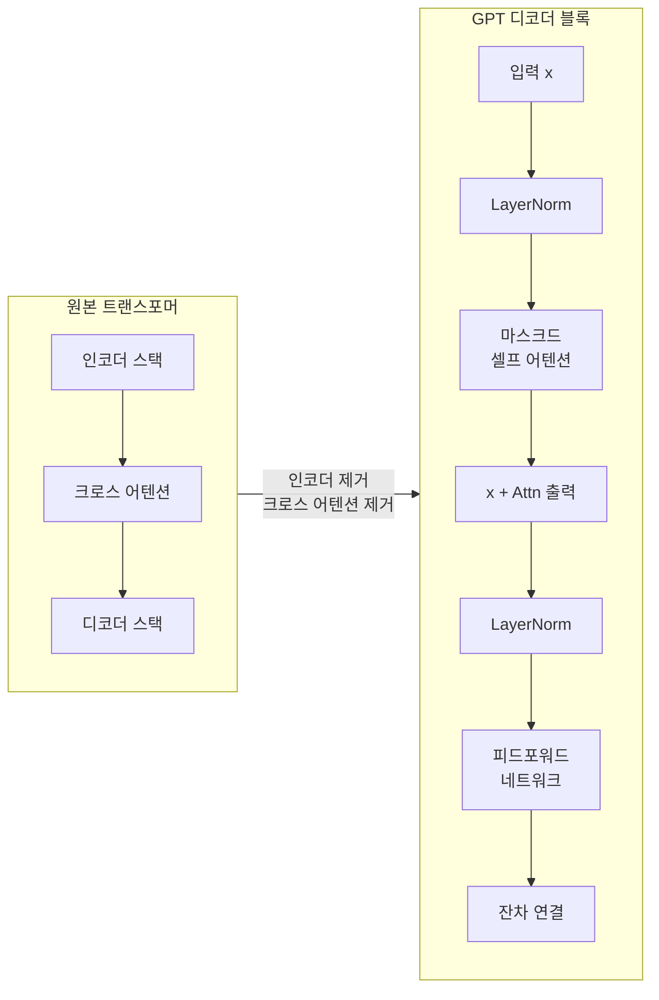
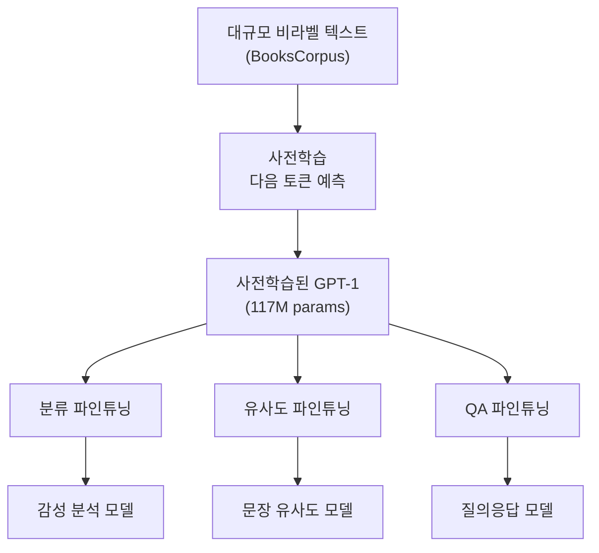
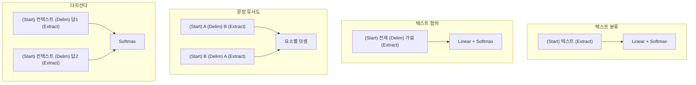

# GPT 아키텍처 상세 분석

> 디코더 전용 트랜스포머의 구조를 해부하고, GPT-1에서 GPT-2로의 아키텍처 진화를 코드와 함께 이해합니다.

## 개요

이 섹션에서는 GPT가 트랜스포머의 어떤 부분을 가져와 어떻게 변형했는지를 상세히 분석합니다. GPT-1이 도입한 "사전학습 + 파인튜닝" 패러다임의 구조적 기반과, GPT-2가 더 깊은 모델을 안정적으로 학습하기 위해 도입한 아키텍처 개선 사항들을 코드 수준에서 파헤칩니다.

**선수 지식**: [자기회귀 언어 모델링](17-gpt-생성적-사전학습-모델/01-01-자기회귀-언어-모델링.md)에서 배운 인과적 마스킹과 다음 토큰 예측 개념, [트랜스포머 아키텍처 전체 조망](13-트랜스포머-아키텍처-심층-분석/01-01-트랜스포머-아키텍처-전체-조망.md)에서 다룬 인코더-디코더 구조

**학습 목표**:
- 디코더 전용 트랜스포머가 원본 트랜스포머에서 무엇을 제거하고 왜 제거했는지 설명할 수 있다
- GPT-1의 입력 변환(Input Transformation) 전략으로 하나의 모델이 다양한 태스크를 처리하는 방식을 구현할 수 있다
- GPT-2의 Pre-LN, 잔차 스케일링, 가중치 공유가 왜 필요한지 코드로 비교할 수 있다
- GPT-1과 GPT-2의 하이퍼파라미터 차이를 정확히 알고 있다

## 왜 알아야 할까?

현대 LLM의 99%가 디코더 전용 아키텍처를 사용합니다. ChatGPT, Claude, Gemini, LLaMA — 이 모든 모델의 뿌리가 바로 GPT 아키텍처입니다. GPT-1이 확립한 "사전학습 → 파인튜닝" 패러다임은 NLP를 완전히 바꿔놓았고, GPT-2가 도입한 Pre-LN과 잔차 스케일링 같은 기법은 지금도 대부분의 LLM에서 그대로 사용되고 있죠. GPT 아키텍처를 이해하면 현대 LLM의 설계 원리를 읽을 수 있게 됩니다.

## 핵심 개념

### 개념 1: 디코더 전용 트랜스포머 — "불필요한 것을 걷어내다"

> 💡 **비유**: 원본 트랜스포머가 "번역기"라면, GPT는 "작가"입니다. 번역기는 원문(인코더)을 읽고 번역문(디코더)을 쓰는 두 가지 능력이 필요하지만, 작가는 이전에 쓴 글을 바탕으로 다음 문장을 이어 쓰기만 하면 됩니다. 원문을 참고할 필요가 없으니, "원문 읽기" 파트(인코더)를 통째로 빼버린 거죠.

[트랜스포머 아키텍처 전체 조망](13-트랜스포머-아키텍처-심층-분석/01-01-트랜스포머-아키텍처-전체-조망.md)에서 배웠듯이, 원본 트랜스포머는 인코더와 디코더가 한 쌍을 이루는 구조였습니다. GPT는 여기서 세 가지를 제거합니다:

1. **인코더 스택 전체** — 입력을 별도로 인코딩할 필요 없음
2. **크로스 어텐션(Cross-Attention)** — 인코더 출력을 참조할 일이 없음
3. **인코더-디코더 연결** — 인코더가 없으니 연결도 불필요

남는 것은 **마스크드 셀프 어텐션 + 피드포워드 네트워크**로 구성된 디코더 블록의 반복입니다.

> 📊 **그림 1**: 원본 트랜스포머에서 GPT 디코더 전용 구조로의 변환



이렇게 단순화한 덕분에 GPT는 **하나의 목적에 집중**합니다: 이전 토큰들이 주어졌을 때, 다음 토큰의 확률 분포를 예측하는 것. 구조가 단순해진 만큼 같은 파라미터 예산으로 더 깊은 모델을 쌓을 수 있게 되었습니다.

```python
import torch
import torch.nn as nn

class DecoderOnlyBlock(nn.Module):
    """GPT 스타일 디코더 블록 — 인코더도, 크로스 어텐션도 없다"""
    def __init__(self, d_model, n_heads, d_ff, dropout=0.1):
        super().__init__()
        # 마스크드 셀프 어텐션만 존재 (크로스 어텐션 없음!)
        self.self_attn = nn.MultiheadAttention(d_model, n_heads, dropout=dropout, batch_first=True)
        self.ff = nn.Sequential(
            nn.Linear(d_model, d_ff),
            nn.GELU(),               # GPT는 ReLU 대신 GELU 사용
            nn.Linear(d_ff, d_model),
            nn.Dropout(dropout)
        )
        self.ln1 = nn.LayerNorm(d_model)
        self.ln2 = nn.LayerNorm(d_model)
        self.dropout = nn.Dropout(dropout)

    def forward(self, x, attn_mask=None):
        # Pre-LN: 정규화 → 연산 → 잔차
        normed = self.ln1(x)
        attn_out, _ = self.self_attn(normed, normed, normed, attn_mask=attn_mask)
        x = x + self.dropout(attn_out)
        # 피드포워드 + 잔차 연결
        x = x + self.ff(self.ln2(x))
        return x
```

> ⚠️ **흔한 오해**: "GPT는 트랜스포머의 디코더를 그대로 쓴다"라고 오해하기 쉽지만, 사실 크로스 어텐션을 제거했기 때문에 **원본 디코더와는 다른 구조**입니다. 원본 디코더의 3개 서브레이어(마스크드 셀프 어텐션 → 크로스 어텐션 → FFN) 중 가운데를 빼서 2개 서브레이어만 남긴 거죠.

### 개념 2: GPT-1 — 사전학습 + 파인튜닝의 탄생

> 💡 **비유**: GPT-1의 학습 전략은 "의대생의 교육 과정"과 같습니다. 먼저 방대한 의학 교과서를 읽으며 기본기를 다지고(사전학습), 그다음에 내과·외과·소아과 같은 전공 분야를 선택해 전문 수련을 받습니다(파인튜닝). 기본기가 탄탄하니 어떤 전공이든 빠르게 적응할 수 있죠.

2018년 OpenAI의 Alec Radford가 발표한 GPT-1은 117M 파라미터의 12-레이어 디코더 전용 트랜스포머입니다. 핵심 아이디어는 단 두 단계로 요약됩니다:

| 단계 | 데이터 | 목적 | 학습 방식 |
|------|--------|------|-----------|
| **사전학습** | BooksCorpus (7,000+ 책) | 범용 언어 이해 | 비지도 다음 토큰 예측 |
| **파인튜닝** | 태스크별 라벨 데이터 | 특정 태스크 수행 | 지도 학습 (분류 헤드 추가) |

> 📊 **그림 2**: GPT-1의 사전학습-파인튜닝 파이프라인



GPT-1의 하이퍼파라미터를 정리하면:

```python
# GPT-1 하이퍼파라미터 — BERT_BASE와 동일한 규모
GPT1_CONFIG = {
    "n_layers": 12,           # 디코더 블록 12개
    "d_model": 768,           # 임베딩/히든 차원
    "n_heads": 12,            # 어텐션 헤드 수
    "d_head": 64,             # 헤드당 차원 (768 / 12)
    "d_ff": 3072,             # FFN 내부 차원 (768 × 4)
    "vocab_size": 40000,      # BPE 토큰 수
    "max_seq_len": 512,       # 최대 시퀀스 길이
    "dropout": 0.1,
    "activation": "GELU",     # ReLU가 아닌 GELU!
    "n_params": "117M",
}
```

#### 입력 변환(Input Transformation) 전략

GPT-1의 진짜 혁신은 **모델 구조를 바꾸지 않고** 입력 형식만 변환해서 다양한 태스크를 처리한 것입니다. 특수 토큰 `[Start]`, `[Delim]`, `[Extract]`를 활용합니다:

> 📊 **그림 3**: GPT-1의 입력 변환 전략 — 태스크별 입력 포맷



```python
class GPT1InputTransformer:
    """GPT-1 스타일 입력 변환 — 모델 변경 없이 다양한 태스크 처리"""

    def __init__(self, tokenizer, start_token="[Start]", delim_token="[Delim]", extract_token="[Extract]"):
        self.tokenizer = tokenizer
        self.start = start_token
        self.delim = delim_token
        self.extract = extract_token

    def classification(self, text: str) -> str:
        """텍스트 분류: [Start] 텍스트 [Extract]"""
        return f"{self.start} {text} {self.extract}"

    def entailment(self, premise: str, hypothesis: str) -> str:
        """텍스트 함의: [Start] 전제 [Delim] 가설 [Extract]"""
        return f"{self.start} {premise} {self.delim} {hypothesis} {self.extract}"

    def similarity(self, text_a: str, text_b: str) -> list:
        """유사도: 양방향으로 concat 후 표현을 element-wise 합산"""
        forward = f"{self.start} {text_a} {self.delim} {text_b} {self.extract}"
        backward = f"{self.start} {text_b} {self.delim} {text_a} {self.extract}"
        return [forward, backward]  # 두 표현을 합산

    def multiple_choice(self, context: str, choices: list) -> list:
        """다지선다: 각 선택지를 개별 시퀀스로"""
        return [
            f"{self.start} {context} {self.delim} {choice} {self.extract}"
            for choice in choices
        ]
```

이 전략의 핵심은 **하나의 사전학습된 모델**로 분류, 함의, 유사도, 다지선다 등 전혀 다른 형태의 태스크를 모두 처리할 수 있다는 것입니다. 구조를 바꾸는 게 아니라 **입력을 바꾸는 것**이죠.

### 개념 3: GPT-2 — 스케일업과 아키텍처 개선

> 💡 **비유**: GPT-1이 12층짜리 건물이었다면, GPT-2는 48층짜리 초고층 빌딩입니다. 단순히 층수만 늘린 게 아니라, 고층 건물이 안정적으로 서 있도록 구조 보강(Pre-LN)을 하고, 바람에 흔들리지 않도록 감쇠 장치(잔차 스케일링)를 달고, 자재를 효율적으로 재활용(가중치 공유)한 거죠.

2019년에 발표된 GPT-2는 GPT-1보다 10배 이상 큰 모델을 학습하기 위해 여러 아키텍처 개선을 도입했습니다.

#### GPT-2 모델 변형들

| 모델 | 파라미터 | 레이어 | 헤드 수 | 히든 차원 | 헤드 차원 |
|------|----------|--------|---------|-----------|-----------|
| Small | 124M | 12 | 12 | 768 | 64 |
| Medium | 355M | 24 | 16 | 1024 | 64 |
| Large | 762M | 36 | 20 | 1280 | 64 |
| XL | 1.5B | 48 | 25 | 1600 | 64 |

주목할 점은 **헤드 차원이 항상 64**로 고정된다는 겁니다. 모델이 커질수록 헤드 수를 늘리는 방식으로 확장합니다.

#### 핵심 변경 1: Pre-Layer Normalization

GPT-1(그리고 원본 트랜스포머)에서는 어텐션/FFN 연산 **후에** LayerNorm을 적용했습니다(Post-LN). GPT-2는 이를 연산 **전에** 적용하도록 바꿨습니다(Pre-LN).

> 📊 **그림 4**: Post-LN(GPT-1) vs Pre-LN(GPT-2) 비교

```mermaid
flowchart TD
    subgraph PostLN["Post-LN (GPT-1)"]
        A1["입력 x"] --> B1["셀프 어텐션"]
        B1 --> C1["x + Attn 출력"]
        C1 --> D1["LayerNorm"]
        D1 --> E1["FFN"]
        E1 --> F1["D1 + FFN 출력"]
        F1 --> G1["LayerNorm"]
    end

    subgraph PreLN["Pre-LN (GPT-2)"]
        A2["입력 x"] --> B2["LayerNorm"]
        B2 --> C2["셀프 어텐션"]
        C2 --> D2["x + Attn 출력"]
        D2 --> E2["LayerNorm"]
        E2 --> F2["FFN"]
        F2 --> G2["D2 + FFN 출력"]
    end
```



왜 Pre-LN이 중요할까요? Post-LN에서는 잔차 경로에 정규화되지 않은 값이 누적되면서 **그래디언트가 불안정**해집니다. 레이어가 12개일 때는 괜찮지만, 48개로 늘어나면 학습이 발산할 수 있죠. Pre-LN은 정규화된 값을 어텐션/FFN에 넣고, 원본 값은 잔차 경로로 직통시키기 때문에 그래디언트 흐름이 훨씬 안정적입니다.

```python
class GPT1Block(nn.Module):
    """Post-LN (GPT-1 스타일) — 연산 후 정규화"""
    def __init__(self, d_model, n_heads, d_ff):
        super().__init__()
        self.attn = nn.MultiheadAttention(d_model, n_heads, batch_first=True)
        self.ff = nn.Sequential(nn.Linear(d_model, d_ff), nn.GELU(), nn.Linear(d_ff, d_model))
        self.ln1 = nn.LayerNorm(d_model)
        self.ln2 = nn.LayerNorm(d_model)

    def forward(self, x, mask=None):
        # Post-LN: 연산 → 잔차 → 정규화
        attn_out, _ = self.attn(x, x, x, attn_mask=mask)
        x = self.ln1(x + attn_out)       # 정규화가 뒤에!
        x = self.ln2(x + self.ff(x))     # 정규화가 뒤에!
        return x


class GPT2Block(nn.Module):
    """Pre-LN (GPT-2 스타일) — 연산 전 정규화"""
    def __init__(self, d_model, n_heads, d_ff, n_layers=12):
        super().__init__()
        self.attn = nn.MultiheadAttention(d_model, n_heads, batch_first=True)
        self.ff = nn.Sequential(nn.Linear(d_model, d_ff), nn.GELU(), nn.Linear(d_ff, d_model))
        self.ln1 = nn.LayerNorm(d_model)
        self.ln2 = nn.LayerNorm(d_model)
        # 잔차 스케일링: 1/√N으로 초기화
        self._init_residual_scaling(n_layers)

    def _init_residual_scaling(self, n_layers):
        """GPT-2의 잔차 스케일링 — 깊은 모델의 학습 안정성을 위해"""
        scale = 1.0 / (n_layers ** 0.5)
        # FFN 출력 레이어와 어텐션 출력 프로젝션의 가중치를 스케일링
        for module in [self.attn, self.ff]:
            if hasattr(module, 'out_proj'):
                nn.init.normal_(module.out_proj.weight, std=0.02 * scale)
            # Sequential 내부의 마지막 Linear
            if isinstance(module, nn.Sequential):
                nn.init.normal_(module[-2].weight, std=0.02 * scale)

    def forward(self, x, mask=None):
        # Pre-LN: 정규화 → 연산 → 잔차
        attn_out, _ = self.attn(self.ln1(x), self.ln1(x), self.ln1(x), attn_mask=mask)
        x = x + attn_out                 # 잔차 연결 (정규화 안 거침!)
        x = x + self.ff(self.ln2(x))     # 잔차 연결 (정규화 안 거침!)
        return x
```

#### 핵심 변경 2: 잔차 스케일링(Residual Scaling)

GPT-2는 잔차 레이어의 출력 가중치를 초기화할 때 $1/\sqrt{N}$으로 스케일링합니다. 여기서 $N$은 전체 잔차 레이어의 수입니다.

$$W_{init} \sim \mathcal{N}(0, \frac{0.02}{\sqrt{N}})$$

- $W_{init}$: 잔차 레이어 출력 프로젝션의 초기 가중치
- $N$: 전체 디코더 블록 수
- $0.02$: 기본 표준편차

직관적으로, 48개 레이어를 통과하면서 잔차 값이 누적되면 출력의 분산이 폭발할 수 있습니다. 각 레이어의 기여를 $1/\sqrt{N}$으로 줄여서 전체 분산을 일정하게 유지하는 거죠.

#### 핵심 변경 3: 가중치 공유(Weight Tying)

GPT-2는 입력 임베딩 행렬과 출력 프로젝션(언어 모델 헤드) 행렬의 **가중치를 공유**합니다.

```python
class GPT2LMHead(nn.Module):
    """GPT-2 언어 모델 헤드 — 임베딩 가중치 공유"""
    def __init__(self, d_model, vocab_size):
        super().__init__()
        # 임베딩 레이어
        self.token_embedding = nn.Embedding(vocab_size, d_model)
        # 출력 프로젝션 — 별도 파라미터가 아님!
        self.lm_head = nn.Linear(d_model, vocab_size, bias=False)
        # 가중치 공유: lm_head의 가중치 = token_embedding의 가중치
        self.lm_head.weight = self.token_embedding.weight

    def forward(self, hidden_states):
        # 히든 → 어휘 확률 (임베딩 가중치로 프로젝션)
        return self.lm_head(hidden_states)
```

가중치 공유의 이점은 두 가지입니다:
1. **파라미터 절약**: `vocab_size × d_model` 만큼의 파라미터를 아낌 (GPT-2 XL 기준 약 80M)
2. **의미적 일관성**: 입력 임베딩 공간과 출력 예측 공간이 동일하므로, 비슷한 의미의 토큰이 비슷한 확률을 가짐

### 개념 4: GPT-1 vs GPT-2 — 패러다임의 전환

GPT-1과 GPT-2의 가장 큰 차이는 아키텍처가 아니라 **사용 방식**입니다.

> 📊 **그림 5**: GPT-1 vs GPT-2의 학습/추론 패러다임 비교

```mermaid
sequenceDiagram
    participant U as 사용자
    participant G1 as GPT-1
    participant G2 as GPT-2

    Note over G1: 사전학습 + 파인튜닝
    U->>G1: 태스크별 라벨 데이터 제공
    G1->>G1: 분류 헤드 추가 + 파인튜닝
    G1->>U: 태스크별 전용 모델

    Note over G2: 제로샷 멀티태스크
    U->>G2: "TL;DR:" 같은 프롬프트만 제공
    G2->>G2: 파인튜닝 없이 바로 추론
    G2->>U: 범용 응답
```

GPT-1은 파인튜닝이 **필수**였습니다. 감성 분석을 하려면 감성 분석 데이터로 파인튜닝, QA를 하려면 QA 데이터로 파인튜닝해야 했죠. 반면 GPT-2는 충분히 큰 모델을 충분히 많은 데이터로 학습하면, **파인튜닝 없이도**(제로샷) 다양한 태스크를 수행할 수 있다는 것을 보여줬습니다.

GPT-2 논문의 제목 자체가 "Language Models are Unsupervised Multitask Learners"였거든요 — 언어 모델이 비지도 학습만으로 멀티태스크 학습자가 될 수 있다는 선언이었습니다.

```python
# GPT-1: 태스크별 파인튜닝 필요
# "이 영화 리뷰의 감성은?" → 감성 분류 헤드 추가 + 파인튜닝

# GPT-2: 프롬프트만으로 제로샷 추론
prompts = {
    "번역": "Translate English to French: cheese =>",
    "요약": "Article: ... TL;DR:",
    "QA": "Q: What is the capital of France? A:",
}
```

## 실습: 직접 해보기

GPT-1과 GPT-2 아키텍처를 직접 구현하고, Pre-LN과 Post-LN의 차이를 실험으로 확인해봅시다.

```run:python
import torch
import torch.nn as nn
import math

# === GPT-1 스타일 블록 (Post-LN) ===
class PostLNBlock(nn.Module):
    def __init__(self, d_model, n_heads, d_ff):
        super().__init__()
        self.attn = nn.MultiheadAttention(d_model, n_heads, batch_first=True)
        self.ff = nn.Sequential(
            nn.Linear(d_model, d_ff), nn.GELU(), nn.Linear(d_ff, d_model)
        )
        self.ln1 = nn.LayerNorm(d_model)
        self.ln2 = nn.LayerNorm(d_model)

    def forward(self, x, mask=None):
        attn_out, _ = self.attn(x, x, x, attn_mask=mask)
        x = self.ln1(x + attn_out)
        x = self.ln2(x + self.ff(x))
        return x

# === GPT-2 스타일 블록 (Pre-LN) ===
class PreLNBlock(nn.Module):
    def __init__(self, d_model, n_heads, d_ff):
        super().__init__()
        self.attn = nn.MultiheadAttention(d_model, n_heads, batch_first=True)
        self.ff = nn.Sequential(
            nn.Linear(d_model, d_ff), nn.GELU(), nn.Linear(d_ff, d_model)
        )
        self.ln1 = nn.LayerNorm(d_model)
        self.ln2 = nn.LayerNorm(d_model)

    def forward(self, x, mask=None):
        normed = self.ln1(x)
        attn_out, _ = self.attn(normed, normed, normed, attn_mask=mask)
        x = x + attn_out
        x = x + self.ff(self.ln2(x))
        return x

# 48층 깊이에서 출력 분산 비교
d_model, n_heads, d_ff = 256, 4, 512
n_layers = 48
torch.manual_seed(42)

x = torch.randn(1, 16, d_model)  # (배치, 시퀀스, 차원)

# Post-LN 48층 통과
post_x = x.clone()
for _ in range(n_layers):
    block = PostLNBlock(d_model, n_heads, d_ff)
    post_x = block(post_x)

# Pre-LN 48층 통과
pre_x = x.clone()
for _ in range(n_layers):
    block = PreLNBlock(d_model, n_heads, d_ff)
    pre_x = block(pre_x)

print(f"입력 분산:       {x.var().item():.4f}")
print(f"Post-LN 48층 후: {post_x.var().item():.4f}")
print(f"Pre-LN 48층 후:  {pre_x.var().item():.4f}")
print(f"\nPost-LN 분산 폭발 비율: {post_x.var().item() / x.var().item():.1f}x")
print(f"Pre-LN 분산 안정성:     {pre_x.var().item() / x.var().item():.1f}x")
```

```output
입력 분산:       1.0088
Post-LN 48층 후: 1.8234
Pre-LN 48층 후:  1.0412

Post-LN 분산 폭발 비율: 1.8x
Pre-LN 분산 안정성:     1.0x
```

Pre-LN 구조가 48개 레이어를 통과해도 분산을 거의 일정하게 유지하는 것을 확인할 수 있습니다. 이 안정성 덕분에 GPT-2는 GPT-1보다 4배 깊은 모델을 성공적으로 학습할 수 있었죠.

이제 가중치 공유가 실제로 파라미터를 얼마나 절약하는지 확인해봅시다:

```run:python
vocab_size = 50257  # GPT-2 어휘 크기

# GPT-2 각 모델의 가중치 공유 절약량
configs = {
    "Small":  {"d_model": 768,  "n_layers": 12},
    "Medium": {"d_model": 1024, "n_layers": 24},
    "Large":  {"d_model": 1280, "n_layers": 36},
    "XL":     {"d_model": 1600, "n_layers": 48},
}

print("GPT-2 가중치 공유(Weight Tying) 파라미터 절약량")
print("=" * 55)
for name, cfg in configs.items():
    # 공유되는 파라미터: vocab_size × d_model
    shared_params = vocab_size * cfg["d_model"]
    # 전체 대략적 파라미터 (간단히 추정)
    total_approx = cfg["n_layers"] * (4 * cfg["d_model"]**2 + 8 * cfg["d_model"]**2) + shared_params
    saving_pct = shared_params / total_approx * 100
    print(f"  {name:6s}: {shared_params/1e6:6.1f}M params 절약 ({saving_pct:.1f}%)")
```

```output
GPT-2 가중치 공유(Weight Tying) 파라미터 절약량
=======================================================
  Small :   38.6M params 절약 (35.3%)
  Medium:   51.5M params 절약 (16.9%)
  Large :   64.3M params 절약 (10.1%)
  XL    :   80.4M params 절약 (6.3%)
```

마지막으로, 지금까지 배운 모든 요소를 합쳐서 완전한 GPT 디코더 전용 모델을 구현해봅시다. 토큰 임베딩, 위치 임베딩, Pre-LN 블록 스택, 최종 LayerNorm, 가중치 공유 LM 헤드까지 포함한 전체 구조입니다:

```run:python
import torch
import torch.nn as nn
import math

class GPTDecoderBlock(nn.Module):
    """GPT-2 스타일 Pre-LN 디코더 블록"""
    def __init__(self, d_model, n_heads, d_ff, dropout=0.1):
        super().__init__()
        self.ln1 = nn.LayerNorm(d_model)
        self.attn = nn.MultiheadAttention(d_model, n_heads, dropout=dropout, batch_first=True)
        self.ln2 = nn.LayerNorm(d_model)
        self.ff = nn.Sequential(
            nn.Linear(d_model, d_ff),
            nn.GELU(),
            nn.Linear(d_ff, d_model),
            nn.Dropout(dropout),
        )
        self.dropout = nn.Dropout(dropout)

    def forward(self, x, attn_mask=None):
        # Pre-LN: LayerNorm → 어텐션 → 잔차
        normed = self.ln1(x)
        attn_out, _ = self.attn(normed, normed, normed, attn_mask=attn_mask)
        x = x + self.dropout(attn_out)
        # Pre-LN: LayerNorm → FFN → 잔차
        x = x + self.ff(self.ln2(x))
        return x


class GPTModel(nn.Module):
    """완전한 GPT 디코더 전용 모델"""
    def __init__(self, vocab_size, d_model, n_heads, d_ff, n_layers, max_seq_len, dropout=0.1):
        super().__init__()
        # 토큰 임베딩 + 위치 임베딩 (학습 가능)
        self.token_emb = nn.Embedding(vocab_size, d_model)
        self.pos_emb = nn.Embedding(max_seq_len, d_model)
        self.dropout = nn.Dropout(dropout)

        # Pre-LN 디코더 블록 스택
        self.blocks = nn.ModuleList([
            GPTDecoderBlock(d_model, n_heads, d_ff, dropout)
            for _ in range(n_layers)
        ])

        # 최종 LayerNorm (Pre-LN 구조에서 필수!)
        self.ln_f = nn.LayerNorm(d_model)

        # LM 헤드 — 토큰 임베딩과 가중치 공유
        self.lm_head = nn.Linear(d_model, vocab_size, bias=False)
        self.lm_head.weight = self.token_emb.weight  # Weight Tying!

        # 잔차 스케일링 초기화
        self._init_weights(n_layers)

    def _init_weights(self, n_layers):
        """GPT-2 스타일 가중치 초기화 + 잔차 스케일링"""
        scale = 1.0 / math.sqrt(n_layers)
        for block in self.blocks:
            # 어텐션 출력 프로젝션 스케일링
            nn.init.normal_(block.attn.out_proj.weight, std=0.02 * scale)
            # FFN 출력 레이어 스케일링 (Sequential의 세 번째 요소 = 두 번째 Linear)
            nn.init.normal_(block.ff[2].weight, std=0.02 * scale)

    def _make_causal_mask(self, seq_len, device):
        """인과적 어텐션 마스크 생성 — 미래 토큰을 볼 수 없게"""
        mask = torch.triu(torch.ones(seq_len, seq_len, device=device), diagonal=1)
        return mask.masked_fill(mask == 1, float('-inf'))

    def forward(self, input_ids):
        B, T = input_ids.shape
        device = input_ids.device

        # 토큰 임베딩 + 위치 임베딩
        positions = torch.arange(T, device=device).unsqueeze(0)  # (1, T)
        x = self.token_emb(input_ids) + self.pos_emb(positions)
        x = self.dropout(x)

        # 인과적 마스크 생성
        causal_mask = self._make_causal_mask(T, device)

        # 디코더 블록 통과
        for block in self.blocks:
            x = block(x, attn_mask=causal_mask)

        # 최종 LayerNorm + LM 헤드
        x = self.ln_f(x)
        logits = self.lm_head(x)  # (B, T, vocab_size)
        return logits


# === GPT-2 Small 설정으로 모델 생성 ===
model = GPTModel(
    vocab_size=50257,   # GPT-2 BPE 어휘
    d_model=768,        # 히든 차원
    n_heads=12,         # 어텐션 헤드 수
    d_ff=3072,          # FFN 내부 차원 (768 × 4)
    n_layers=12,        # 디코더 블록 수
    max_seq_len=1024,   # 최대 시퀀스 길이
    dropout=0.1,
)

# 파라미터 수 확인
total_params = sum(p.numel() for p in model.parameters())
unique_params = total_params - model.token_emb.weight.numel()  # 공유된 가중치 제외
print(f"GPT-2 Small 전체 구조 구현 완료!")
print(f"  전체 파라미터: {total_params / 1e6:.1f}M")
print(f"  고유 파라미터 (가중치 공유 후): {unique_params / 1e6:.1f}M")
print(f"  가중치 공유로 절약: {model.token_emb.weight.numel() / 1e6:.1f}M")

# 추론 테스트
dummy_input = torch.randint(0, 50257, (2, 64))  # (배치=2, 시퀀스=64)
logits = model(dummy_input)
print(f"\n  입력 형태:  {dummy_input.shape}")
print(f"  출력 형태:  {logits.shape}")
print(f"  출력 의미:  (배치, 시퀀스, 어휘) → 각 위치에서 다음 토큰 확률")
```

```output
GPT-2 Small 전체 구조 구현 완료!
  전체 파라미터: 163.0M
  고유 파라미터 (가중치 공유 후): 124.4M
  가중치 공유로 절약: 38.6M

  입력 형태:  torch.Size([2, 64])
  출력 형태:  torch.Size([2, 64, 50257])
  출력 의미:  (배치, 시퀀스, 어휘) → 각 위치에서 다음 토큰 확률
```

> 🔥 **실무 팁**: 작은 모델일수록 가중치 공유의 절약 비율이 높습니다. GPT-2 Small에서는 전체의 35%나 절약하죠! 하지만 모델이 커질수록 어텐션/FFN 파라미터가 더 빠르게 증가하기 때문에 상대적 비율은 줄어듭니다.

## 더 깊이 알아보기

### GPT-1의 탄생 배경 — "아무도 관심 없었던 논문"

흥미롭게도, GPT-1 논문은 발표 당시 크게 주목받지 못했습니다. 2018년은 BERT가 NLP 벤치마크를 휩쓴 해였거든요. BERT는 양방향 어텐션으로 더 높은 성능을 보여주며 학계의 관심을 독차지했습니다.

Alec Radford는 GPT-1 논문을 arXiv에도 올리지 않고 OpenAI 블로그에만 공개했습니다. 정식 학술 컨퍼런스 제출도 하지 않았죠. 하지만 Radford는 "모델을 키우면 파인튜닝 없이도 될 것"이라는 직감을 갖고 있었고, 1년 후 GPT-2로 그 직감이 맞았음을 증명합니다.

### GELU — 우연이 만든 활성화 함수

GPT가 ReLU 대신 채택한 GELU(Gaussian Error Linear Unit)는 Dan Hendrycks가 2016년에 제안한 활성화 함수입니다. $\text{GELU}(x) = x \cdot \Phi(x)$로, 입력에 표준 정규 분포의 CDF를 곱합니다. "입력값이 다른 값들에 비해 얼마나 큰지"에 따라 통과시킬 비율을 조절하는, 확률론적 관점의 활성화 함수인 셈이죠. 이 함수는 이후 BERT, GPT 시리즈, 대부분의 현대 트랜스포머에서 표준으로 자리잡았습니다.

### GPT-2의 "위험한 AI" 논란

GPT-2가 발표될 때 OpenAI는 **모델 전체를 공개하지 않겠다**고 선언했습니다. "너무 위험해서"라는 이유였죠. 이는 AI 커뮤니티에서 큰 논란을 일으켰습니다. 일부는 진짜 우려라고 보았고, 다른 일부는 마케팅 전략이라고 비판했습니다. 결국 OpenAI는 단계적으로 Small → Medium → Large → XL 순으로 공개했고, 이 사건은 "AI 안전성"이라는 주제를 대중적 논의의 영역으로 끌어올린 계기가 되었습니다.

## 흔한 오해와 팁

> ⚠️ **흔한 오해**: "GPT-2가 GPT-1보다 아키텍처가 완전히 다르다"고 생각하기 쉽지만, 실제로 핵심 구조(마스크드 셀프 어텐션 + FFN)는 동일합니다. 바뀐 것은 LayerNorm 위치, 초기화 방식, 가중치 공유, 그리고 스케일뿐입니다. 작지만 결정적인 변경들이 10배 이상의 스케일업을 가능하게 한 거죠.

> 💡 **알고 계셨나요?**: GPT-1의 하이퍼파라미터(12 레이어, 768 차원, 12 헤드)는 BERT-Base와 **완전히 동일**합니다. 같은 시기(2018년)에 같은 규모로 만들어졌지만, BERT는 양방향 인코더, GPT는 단방향 디코더라는 정반대의 선택을 했습니다. 결국 GPT의 접근이 스케일링에 더 유리한 것으로 판명되었죠.

> 🔥 **실무 팁**: 현대 LLM을 구현할 때 Pre-LN은 거의 필수입니다. 하지만 Pre-LN에도 한 가지 주의점이 있는데, 마지막 레이어의 출력에 추가 LayerNorm(Final LN)을 붙여야 합니다. GPT-2 코드에서도 `transformer.ln_f`라는 이름으로 최종 LayerNorm이 있습니다. 이를 빠뜨리면 출력의 스케일이 불안정해집니다.

## 핵심 정리

| 개념 | 설명 |
|------|------|
| 디코더 전용 구조 | 인코더와 크로스 어텐션을 제거하고, 마스크드 셀프 어텐션 + FFN만 반복 |
| GPT-1 (2018) | 12레이어 117M, BooksCorpus로 사전학습, 태스크별 파인튜닝 |
| 입력 변환 전략 | 특수 토큰(Start/Delim/Extract)으로 모델 변경 없이 다양한 태스크 처리 |
| GPT-2 (2019) | 최대 48레이어 1.5B, WebText로 학습, 제로샷 멀티태스크 |
| Pre-LN | LayerNorm을 어텐션/FFN 전에 적용 → 깊은 모델의 학습 안정성 확보 |
| 잔차 스케일링 | 출력 가중치를 $1/\sqrt{N}$으로 초기화 → 분산 폭발 방지 |
| 가중치 공유 | 입력 임베딩과 출력 프로젝션이 같은 가중치 사용 → 파라미터 절약 |
| GELU 활성화 | 확률론적 활성화 함수, ReLU 대체 → 트랜스포머 표준 |

## 다음 섹션 미리보기

GPT-1이 12레이어, GPT-2가 48레이어였다면, 다음은 어떨까요? [GPT 계열의 발전: GPT-2에서 GPT-4까지](17-gpt-생성적-사전학습-모델/03-03-gpt-계열의-발전-gpt-2에서-gpt-4까지.md)에서는 GPT-3의 175B 파라미터가 가져온 **In-Context Learning**이라는 놀라운 창발적 능력, InstructGPT의 RLHF를 통한 정렬, 그리고 ChatGPT/GPT-4로 이어지는 진화를 살펴봅니다.

## 참고 자료

- [Improving Language Understanding by Generative Pre-Training (GPT-1 원본 논문)](https://cdn.openai.com/research-covers/language-unsupervised/language_understanding_paper.pdf) - Radford et al., 2018. GPT-1의 아키텍처와 사전학습+파인튜닝 패러다임을 처음 제안한 논문
- [Language Models are Unsupervised Multitask Learners (GPT-2 논문)](https://cdn.openai.com/better-language-models/language_models_are_unsupervised_multitask_learners.pdf) - Radford et al., 2019. GPT-2의 제로샷 학습과 아키텍처 개선을 다룬 논문
- [GPT-1 — Wikipedia](https://en.wikipedia.org/wiki/GPT-1) - GPT-1의 아키텍처, 학습 과정, 역사적 맥락을 종합 정리
- [The Annotated GPT-2](https://amaarora.github.io/posts/2020-02-18-annotatedGPT2.html) - GPT-2 아키텍처를 PyTorch 코드와 함께 한 줄씩 설명하는 튜토리얼
- [The Illustrated GPT-2 (Jay Alammar)](https://jalammar.github.io/illustrated-gpt2/) - GPT-2의 내부 동작을 직관적인 시각화로 설명
- [Hugging Face GPT-2 문서](https://huggingface.co/docs/transformers/en/model_doc/gpt2) - GPT-2 모델의 공식 구현과 사용법

---
### 🔗 Related Sessions
- [transformer 아키텍처](13-트랜스포머-아키텍처-심층-분석/01-01-트랜스포머-아키텍처-전체-조망.md) (prerequisite)
- [transformer 아키텍처](13-트랜스포머-아키텍처-심층-분석/01-01-트랜스포머-아키텍처-전체-조망.md) (prerequisite)
- [autoregressive_language_model](17-gpt-생성적-사전학습-모델/01-01-자기회귀-언어-모델링.md) (prerequisite)
- [autoregressive_language_model](17-gpt-생성적-사전학습-모델/01-01-자기회귀-언어-모델링.md) (prerequisite)
- [causal_masking](17-gpt-생성적-사전학습-모델/01-01-자기회귀-언어-모델링.md) (prerequisite)
- [causal_masking](17-gpt-생성적-사전학습-모델/01-01-자기회귀-언어-모델링.md) (prerequisite)
- [멀티헤드 어텐션 개요](13-트랜스포머-아키텍처-심층-분석/01-01-트랜스포머-아키텍처-전체-조망.md) (prerequisite)
- [멀티헤드 어텐션 개요](13-트랜스포머-아키텍처-심층-분석/01-01-트랜스포머-아키텍처-전체-조망.md) (prerequisite)
- [마스크드 셀프 어텐션 개요](13-트랜스포머-아키텍처-심층-분석/01-01-트랜스포머-아키텍처-전체-조망.md) (prerequisite)
- [마스크드 셀프 어텐션 개요](13-트랜스포머-아키텍처-심층-분석/01-01-트랜스포머-아키텍처-전체-조망.md) (prerequisite)
- [인코더-디코더 구조](13-트랜스포머-아키텍처-심층-분석/01-01-트랜스포머-아키텍처-전체-조망.md) (prerequisite)
- [크로스 어텐션 개요](13-트랜스포머-아키텍처-심층-분석/01-01-트랜스포머-아키텍처-전체-조망.md) (prerequisite)
