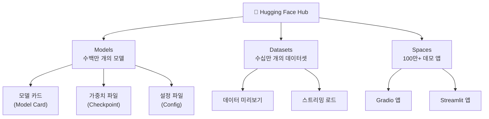
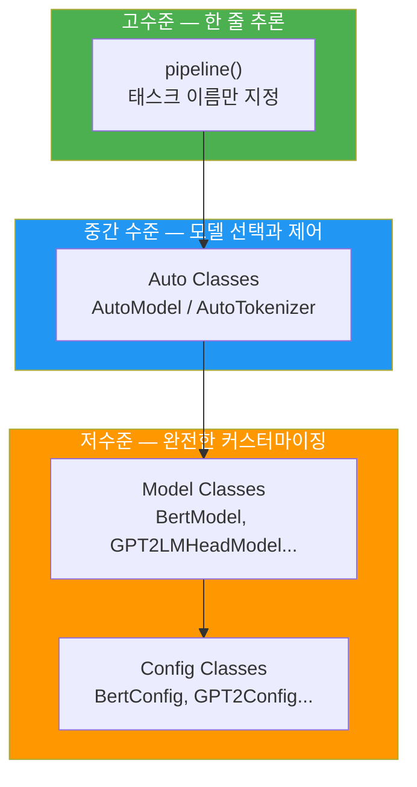
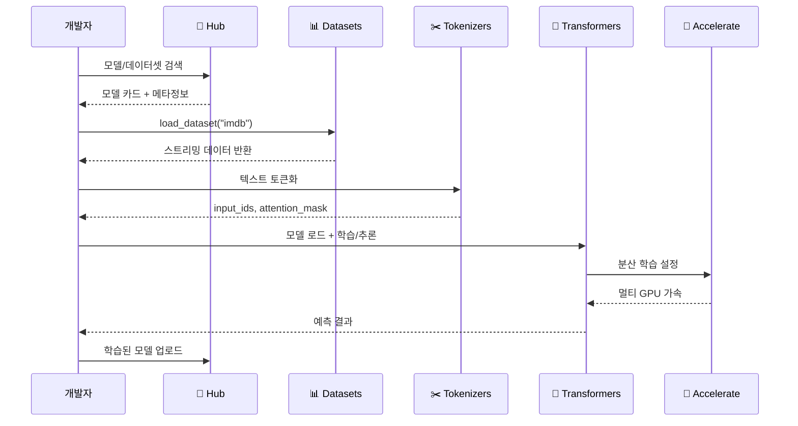
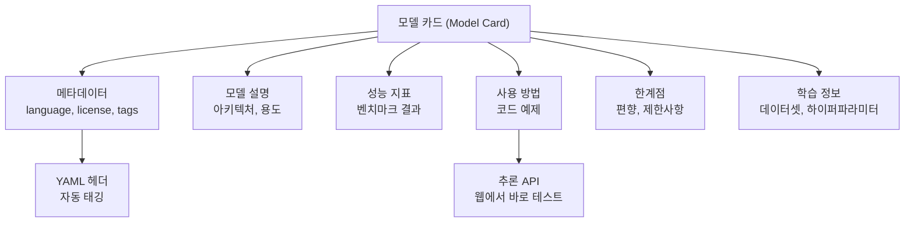

# 01. Hugging Face 생태계 소개

> Hugging Face의 핵심 라이브러리와 Hub 플랫폼을 이해하고, NLP 개발의 새로운 패러다임을 탐험합니다.

## 개요

이 섹션에서는 Hugging Face가 제공하는 오픈소스 생태계 전반을 살펴봅니다. Transformers, Datasets, Tokenizers, Accelerate 등 핵심 라이브러리의 역할을 이해하고, Hugging Face Hub에서 모델과 데이터셋을 탐색하는 방법을 배웁니다.

**선수 지식**: [GPT 계열의 발전](17-ch17-gpt-생성적-사전학습-모델/03-03-gpt-계열의-발전-gpt-2에서-gpt-4까지.md)에서 다룬 사전학습 모델의 개념, [Hugging Face로 BERT 사용하기](16-ch16-bert-양방향-사전학습-모델/05-05-hugging-face로-bert-사용하기.md)에서의 기본 사용 경험

**학습 목표**:
- Hugging Face 생태계의 구성 요소와 각각의 역할을 설명할 수 있다
- Hugging Face Hub에서 모델과 데이터셋을 검색하고 로드할 수 있다
- Transformers 라이브러리의 핵심 설계 철학을 이해할 수 있다

## 왜 알아야 할까?

2020년대 NLP 연구와 개발의 풍경은 완전히 바뀌었습니다. 예전에는 논문이 나오면 연구자가 직접 코드를 작성하고, 가중치를 학습하고, 복잡한 설정 파일을 관리해야 했죠. 지금은 어떨까요? 단 3줄의 코드로 최신 모델을 불러와 바로 사용할 수 있는 시대가 되었습니다.

이 변화의 중심에 **Hugging Face**가 있습니다. 수백만 개의 모델과 수십만 개의 데이터셋이 공유되는 이 플랫폼은 AI 분야의 "GitHub"라고 불릴 만합니다. NLP 실무자라면 Hugging Face 생태계를 모르고는 효율적인 개발이 사실상 불가능하거든요.

이번 챕터에서는 이 강력한 생태계를 본격적으로 파헤쳐 보겠습니다. 첫 번째 섹션인 만큼, 전체 그림을 먼저 조망하는 데 집중합니다.

## 핵심 개념

### 개념 1: Hugging Face Hub — AI의 앱스토어

> 💡 **비유**: 스마트폰의 앱스토어를 떠올려 보세요. 앱스토어에서 앱을 검색하고, 리뷰를 확인하고, 한 번의 탭으로 설치하듯이, Hugging Face Hub에서는 AI 모델을 검색하고, 모델 카드(리뷰에 해당)를 확인하고, 한 줄의 코드로 로드할 수 있습니다.

Hugging Face Hub는 머신러닝 모델, 데이터셋, 데모 앱(Spaces)을 공유하는 **중앙 플랫폼**입니다. Git 기반의 버전 관리를 제공하며, 누구나 자신의 모델을 업로드하고 다른 사람의 모델을 가져다 쓸 수 있습니다. 2026년 현재 수백만 개의 모델이 등록되어 있으며, 그 수는 매달 빠르게 증가하고 있습니다.

> 📊 **그림 1**: Hugging Face Hub의 핵심 구성 요소



**모델 카드(Model Card)**는 모델의 "사용 설명서"입니다. 모델의 성능, 학습 데이터, 사용 방법, 한계점 등이 문서화되어 있어서 모델을 고를 때 중요한 판단 기준이 됩니다.

```run:python
# Hugging Face Hub에서 모델 정보 확인하기
from huggingface_hub import HfApi

api = HfApi()

# "bert" 관련 모델 검색
models = api.list_models(search="bert-base", limit=5)
for model in models:
    print(f"📦 {model.id} | ❤️ {model.likes} likes | ⬇️ {model.downloads} downloads")
```

```output
📦 google-bert/bert-base-uncased | ❤️ 389 likes | ⬇️ 68547291 downloads
📦 google-bert/bert-base-cased | ❤️ 97 likes | ⬇️ 5765432 downloads
📦 google-bert/bert-base-multilingual-cased | ❤️ 176 likes | ⬇️ 12894567 downloads
📦 google-bert/bert-base-chinese | ❤️ 143 likes | ⬇️ 3456789 downloads
📦 google-bert/bert-base-multilingual-uncased | ❤️ 52 likes | ⬇️ 1234567 downloads
```

`HfApi` 객체는 Hub의 다양한 기능에 프로그래밍 방식으로 접근할 수 있게 해줍니다. `list_models()` 외에도 `list_datasets()`, `model_info()`, `upload_file()` 등 Hub의 거의 모든 기능을 Python에서 호출할 수 있죠.

### 개념 2: Transformers 라이브러리 — 핵심 설계 철학

> 💡 **비유**: Transformers 라이브러리는 자동차의 **범용 엔진**과 같습니다. 세단이든, SUV든, 트럭이든(BERT든, GPT든, T5든) 하나의 통일된 인터페이스로 구동됩니다. 운전자(개발자)는 엔진 내부 구조를 몰라도 핸들과 페달(API)만 알면 어떤 차든 운전할 수 있죠.

Transformers는 Hugging Face의 **플래그십 라이브러리**입니다. 400개 이상의 모델 아키텍처를 지원하며, 2025년에 출시된 **v5**부터는 PyTorch 중심으로 재설계되었습니다.

> 📊 **그림 2**: Transformers 라이브러리의 추상화 계층



Transformers의 핵심 설계 철학은 **계층적 추상화**입니다. 목적에 따라 적절한 수준의 API를 선택할 수 있죠:

| 추상화 수준 | API | 용도 |
|------------|-----|------|
| **고수준** | `pipeline()` | 빠른 프로토타이핑, 태스크 이름만으로 추론 |
| **중간 수준** | `AutoModel`, `AutoTokenizer` | 모델 선택과 세부 제어 |
| **저수준** | `BertModel`, `GPT2Config` 등 | 아키텍처 수정, 연구용 커스터마이징 |

[Hugging Face로 BERT 사용하기](16-ch16-bert-양방향-사전학습-모델/05-05-hugging-face로-bert-사용하기.md)에서 `AutoModel`과 `from_pretrained()`를 간단히 사용해 본 적이 있죠? 이 Auto Classes의 동작 원리와 다양한 활용법은 [Auto Classes와 모델 설정](18-ch18-hugging-face-transformers-실습/03-03-auto-classes와-모델-설정.md)에서 본격적으로 다루겠습니다. 이번 섹션에서는 생태계의 전체 구조를 파악하는 데 집중합시다.

### 개념 3: 생태계 라이브러리들 — 팀 플레이

> 💡 **비유**: 요리를 생각해 봅시다. Transformers가 **메인 셰프**(모델)라면, Datasets는 **식재료 관리**(데이터), Tokenizers는 **재료 손질**(전처리), Accelerate는 **주방 장비**(GPU 관리), 그리고 Hub는 **레시피 공유 플랫폼**입니다. 혼자서도 요리할 수 있지만, 이 팀이 함께하면 미슐랭 레스토랑이 되는 거죠.

Hugging Face 생태계는 Transformers만으로 이루어진 것이 아닙니다. 각 라이브러리가 ML 워크플로의 한 단계를 담당합니다.

> 📊 **그림 3**: Hugging Face 생태계의 ML 워크플로



각 라이브러리의 역할을 정리하면 다음과 같습니다:

| 라이브러리 | 역할 | 핵심 기능 |
|-----------|------|----------|
| **Transformers** | 모델 정의 & 추론/학습 | `pipeline()`, `AutoModel`, `Trainer` |
| **Datasets** | 데이터 로딩 & 전처리 | 스트리밍, 메모리 매핑, 수십만 개 데이터셋 |
| **Tokenizers** | 고속 토큰화 | Rust 기반, BPE/WordPiece/Unigram 지원 |
| **Accelerate** | 분산 학습 지원 | 멀티 GPU, TPU, 혼합 정밀도 |
| **PEFT** | 효율적 파인튜닝 | LoRA, QLoRA, Prefix Tuning |
| **TRL** | 강화학습 기반 학습 | RLHF, DPO, PPO |
| **Evaluate** | 모델 평가 | BLEU, ROUGE, 정확도 등 메트릭 |

이 라이브러리들이 어떻게 맞물려 돌아가는지가 핵심인데요, 특히 주목할 점은 **모든 라이브러리가 Hub를 중심으로 연결**된다는 것입니다. `load_dataset("imdb")`를 호출하면 Datasets가 Hub에서 데이터를 가져오고, `AutoModel.from_pretrained("bert-base-uncased")`를 호출하면 Transformers가 Hub에서 모델을 가져오죠. Hub가 생태계의 **접착제** 역할을 하는 셈입니다.

### 개념 4: 모델 카드와 커뮤니티

> 💡 **비유**: 모델 카드는 의약품의 **성분표와 복용 안내서**입니다. 어떤 데이터로 만들어졌는지(성분), 어디에 효과가 있는지(적응증), 부작용은 무엇인지(한계점)가 모두 적혀 있죠. 이 정보 없이 모델을 사용하는 것은 설명서 없이 약을 먹는 것과 같습니다.

모든 Hub의 모델에는 **모델 카드(Model Card)**가 포함되어 있습니다. 이는 모델의 신원 확인 문서와 같은 역할을 합니다.

> 📊 **그림 4**: 모델 카드의 구조



모델 카드에서 특히 중요한 것은 **YAML 메타데이터 헤더**입니다. 이 헤더에 정의된 `pipeline_tag`, `language`, `license` 같은 필드가 Hub의 검색과 필터링을 가능하게 만들어 줍니다.

```python
# 모델 카드 메타데이터 예시 (YAML 형식)
model_card_yaml = """
---
language: en
license: apache-2.0
tags:
  - text-classification
  - sentiment-analysis
datasets:
  - imdb
metrics:
  - accuracy
  - f1
pipeline_tag: text-classification
---
"""

# Hub에서 모델의 README(모델 카드) 불러오기
from huggingface_hub import ModelCard

card = ModelCard.load("distilbert-base-uncased-finetuned-sst-2-english")
print(card.data.language)   # 모델 언어 정보
print(card.data.license)    # 라이선스 정보
```

Hub의 또 다른 강점은 **커뮤니티 기능**입니다. 각 모델 저장소에는 Discussion 탭이 있어서 사용자들이 질문, 버그 리포트, 개선 제안을 남길 수 있습니다. 마치 GitHub의 Issues처럼요. 모델 선택 시 이 Discussion을 살펴보면 실제 사용자들이 겪은 문제와 해결책을 미리 파악할 수 있어서 큰 도움이 됩니다.

## 실습: 직접 해보기

Hugging Face 생태계를 직접 체험해 봅시다. 설치부터 Hub 탐색, 데이터셋 로드까지 한 번에 진행합니다.

```python
# 1. 핵심 라이브러리 설치
# pip install transformers datasets tokenizers accelerate huggingface_hub
```

```run:python
# 2. Hub에서 NLP 모델 검색하기
from huggingface_hub import HfApi

api = HfApi()

# 감성 분석(text-classification) 모델 중 인기 있는 것 검색
models = api.list_models(
    filter="text-classification",  # 태스크 필터
    sort="downloads",              # 다운로드 순 정렬
    direction=-1,                  # 내림차순
    limit=3                        # 상위 3개
)

print("🔍 인기 텍스트 분류 모델 Top 3:")
print("-" * 60)
for i, model in enumerate(models, 1):
    print(f"{i}. {model.id}")
    print(f"   다운로드: {model.downloads:,}")
    print(f"   좋아요: {model.likes}")
    print()
```

```output
🔍 인기 텍스트 분류 모델 Top 3:
------------------------------------------------------------
1. distilbert/distilbert-base-uncased-finetuned-sst-2-english
   다운로드: 95,432,187
   좋아요: 832

2. cardiffnlp/twitter-roberta-base-sentiment-latest
   다운로드: 12,345,678
   좋아요: 456

3. nlptown/bert-base-multilingual-uncased-sentiment
   다운로드: 8,765,432
   좋아요: 321
```

```run:python
# 3. Datasets 라이브러리로 데이터셋 탐색하기
from datasets import load_dataset

# IMDB 감성 분석 데이터셋 로드 (스트리밍 모드)
dataset = load_dataset("imdb", split="train", streaming=True)

# 처음 3개 샘플 확인
print("📊 IMDB 데이터셋 샘플:")
print("-" * 60)
for i, sample in enumerate(dataset):
    if i >= 3:
        break
    label = "긍정" if sample["label"] == 1 else "부정"
    text_preview = sample["text"][:80] + "..."
    print(f"[{label}] {text_preview}")
    print()
```

```output
📊 IMDB 데이터셋 샘플:
------------------------------------------------------------
[부정] I rented I AM CURIOUS-YELLOW from my video store because of all the controve...

[긍정] "I Am Curious: Yellow" is a risible and pretentious steaming pile. It doesn't ...

[부정] If only to avoid making this type of film in the future. This film is interest...
```

```python
# 4. Hub에서 데이터셋 메타정보 확인
from huggingface_hub import HfApi

api = HfApi()

# 인기 데이터셋 검색
datasets_list = api.list_datasets(
    search="sentiment",
    sort="downloads",
    direction=-1,
    limit=5
)

print("📂 인기 감성 분석 데이터셋:")
for ds in datasets_list:
    print(f"  • {ds.id} (⬇️ {ds.downloads:,})")
```

```python
# 5. 생태계 버전 확인 — 실무에서 디버깅 시 필수!
import transformers
import datasets
import tokenizers
import huggingface_hub

print(f"transformers:    v{transformers.__version__}")
print(f"datasets:        v{datasets.__version__}")
print(f"tokenizers:      v{tokenizers.__version__}")
print(f"huggingface_hub: v{huggingface_hub.__version__}")
```

## 더 깊이 알아보기

### Hugging Face의 탄생 — 챗봇에서 AI 플랫폼으로

Hugging Face는 2016년, 프랑스 출신의 클레망 들랑그(Clément Delangue)와 줄리앙 쇼몽(Julien Chaumond)이 뉴욕에서 설립했습니다. 놀랍게도 처음에는 **10대를 위한 AI 챗봇 앱**이었습니다. 회사 이름의 유래도 "🤗" 이모지에서 왔죠.

전환점은 2018년이었습니다. 구글의 BERT 논문이 발표되자 Hugging Face 팀은 BERT의 PyTorch 구현체를 오픈소스로 공개했는데, 이것이 바로 `pytorch-pretrained-bert` — Transformers 라이브러리의 전신입니다. 당시 공식 구현은 TensorFlow뿐이었기에, PyTorch 사용자들에게 폭발적인 인기를 끌었습니다.

2019년, 이 라이브러리는 `transformers`로 이름을 바꾸고 BERT뿐만 아니라 GPT-2, XLNet 등 다양한 모델을 통합하기 시작했습니다. "하나의 라이브러리로 모든 트랜스포머 모델을" 이라는 비전은 대성공을 거두었고, 400개 이상의 모델 아키텍처를 지원하는 거대 프로젝트로 성장했습니다.

### Transformers v5 — 새로운 시대

2025년에 출시된 Transformers v5는 5년 만의 메이저 업데이트입니다. 가장 큰 변화는 **PyTorch 전용**으로의 전환이었습니다. TensorFlow와 Flax 지원이 공식적으로 종료되었고, 대신 JAX 생태계와의 호환성은 외부 파트너와 협력하는 방식으로 전환했습니다. 또한 **양자화(Quantization)**가 일급 기능으로 승격되어 4비트, 8비트 모델의 로드와 학습이 훨씬 간편해졌습니다.

## 흔한 오해와 팁

> ⚠️ **흔한 오해**: "Hugging Face = Transformers 라이브러리다"라고 생각하는 분이 많습니다. 하지만 Transformers는 Hugging Face 생태계의 **한 부분**일 뿐입니다. Hub, Datasets, Tokenizers, Accelerate, PEFT, TRL, Evaluate, Diffusers 등 수십 개의 라이브러리가 함께 작동하는 생태계입니다.

> 💡 **알고 계셨나요?**: Hugging Face Hub의 모델 수는 2022년 첫 100만 개에 도달하는 데 1,000일이 걸렸지만, 두 번째 100만 개는 불과 335일 만에 달성했습니다. 이처럼 Hub의 성장 속도는 점점 가속되고 있어서, 구체적인 숫자보다는 그 성장의 추세에 주목하는 것이 중요합니다. Hub는 이제 단순 모델 저장소가 아니라 AI 분야의 **인프라**입니다.

> 🔥 **실무 팁**: 모델을 선택할 때 다운로드 수만 보지 마세요. **모델 카드**를 반드시 확인하세요. 특히 `pipeline_tag` (어떤 태스크용인지), `datasets` (어떤 데이터로 학습했는지), `license` (상업적 사용 가능 여부)를 체크하는 습관이 중요합니다. 라이선스를 확인하지 않고 모델을 배포했다가 문제가 되는 경우가 실무에서 종종 발생합니다.

## 핵심 정리

| 개념 | 설명 |
|------|------|
| Hugging Face Hub | 수백만 개의 모델과 수십만 개의 데이터셋을 공유하는 AI 플랫폼. Git 기반 버전 관리 |
| Transformers | 400+ 아키텍처를 통일된 API로 제공하는 핵심 모델 라이브러리 (v5: PyTorch 전용) |
| 계층적 추상화 | `pipeline()` → `Auto Classes` → 개별 모델 클래스 순으로 추상화 수준 선택 가능 |
| Datasets | 스트리밍/메모리 매핑 기반의 효율적 데이터 로딩 라이브러리 |
| Tokenizers | Rust 기반 고속 토큰화. BPE, WordPiece, Unigram 지원 |
| Accelerate | 멀티 GPU, TPU, 혼합 정밀도 등 분산 학습을 간소화 |
| 모델 카드 | 모델의 성능, 학습 데이터, 한계점 등을 문서화한 사용 설명서 |

## 다음 섹션 미리보기

이번 섹션에서 Hugging Face 생태계의 전체 그림을 살펴보았습니다. 다음 섹션 [pipeline API로 빠른 추론](18-ch18-hugging-face-transformers-실습/02-02-pipeline-api로-빠른-추론.md)에서는 Transformers의 가장 간편한 인터페이스인 `pipeline()` 함수를 사용해 감성 분석, 텍스트 생성, 번역 등 다양한 NLP 태스크를 단 한 줄의 코드로 수행하는 방법을 배웁니다. 코드 한 줄로 최신 AI를 체험할 준비가 되셨나요?

## 참고 자료

- [Hugging Face Transformers 공식 문서](https://huggingface.co/docs/transformers/main/en/index) - Transformers 라이브러리의 최신 API 레퍼런스와 튜토리얼
- [Hugging Face Hub 공식 문서](https://huggingface.co/docs/hub/en/index) - Hub 플랫폼의 모델 검색, 업로드, 관리 가이드
- [Hugging Face NLP/LLM Course](https://huggingface.co/learn/llm-course/chapter1/1) - Hugging Face가 직접 제공하는 무료 NLP/LLM 학습 코스
- [Transformers v5 발표 블로그](https://huggingface.co/blog/transformers-v5) - v5의 주요 변경사항과 설계 철학 소개
- [Hugging Face Transformers GitHub](https://github.com/huggingface/transformers) - 소스 코드와 400+ 모델 아키텍처 구현체

---
### 🔗 Related Sessions
- [토큰화](02-ch2-텍스트-전처리-토큰화와-정규화/01-01-토큰화의-기초.md) (prerequisite)
- [트랜스포머 아키텍처](13-ch13-트랜스포머-아키텍처-심층-분석/01-01-트랜스포머-아키텍처-전체-조망.md) (prerequisite)
