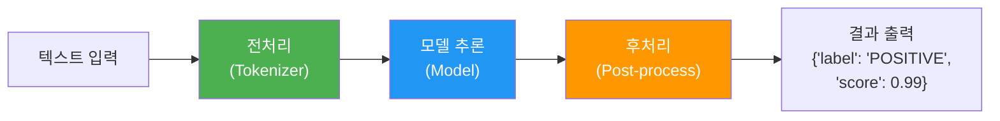
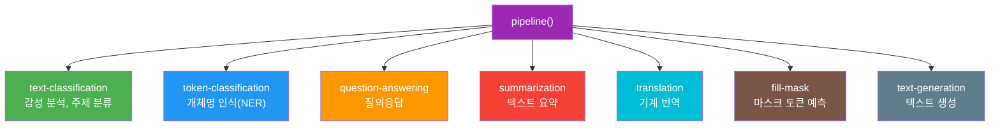
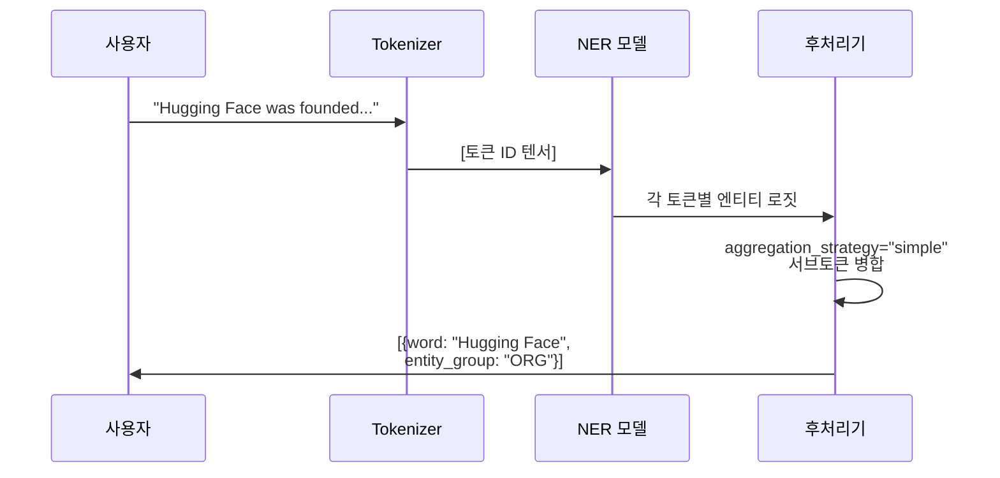
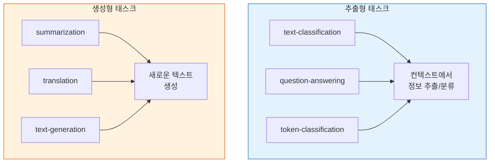
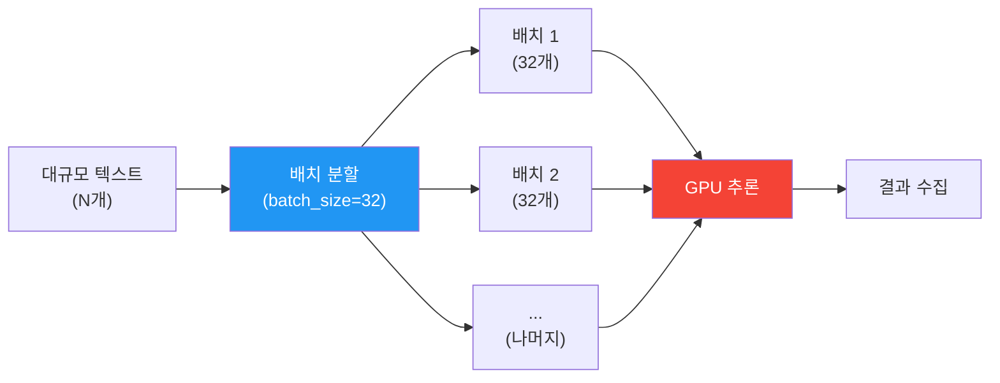

# Pipeline API로 빠른 추론

> Hugging Face의 `pipeline()` 함수 하나로 감성 분석부터 번역까지 — NLP의 스위스 아미 나이프를 마스터합니다.

## 개요

이 섹션에서는 Hugging Face Transformers의 가장 강력한 진입점인 `pipeline()` API를 배웁니다. 한 줄의 코드로 감성 분석, 개체명 인식(NER), 질의응답, 요약, 번역 등 다양한 NLP 태스크를 수행하는 방법을 학습하고, 내부적으로 어떤 일이 벌어지는지까지 이해합니다.

**선수 지식**: [01. Hugging Face 생태계 소개](18-ch18-hugging-face-transformers-실습/01-01-hugging-face-생태계-소개.md)에서 배운 Auto Classes와 `from_pretrained()` 개념
**학습 목표**:
- `pipeline()` 함수의 동작 원리와 내부 3단계 프로세스를 이해할 수 있다
- 주요 NLP 태스크별 파이프라인을 생성하고 추론할 수 있다
- 태스크별로 적합한 모델을 자동/수동으로 선택할 수 있다
- 배치 처리와 디바이스 설정으로 추론 성능을 최적화할 수 있다

## 왜 알아야 할까?

NLP 모델을 사용하려면 보통 토크나이저로 텍스트를 변환하고, 모델에 넣고, 출력을 후처리하는 과정을 거쳐야 합니다. 이전 챕터에서 [트랜스포머 구현](14-ch14-트랜스포머-구현-실습/01-01-셀프-어텐션-직접-구현.md)을 직접 해봤으니, 이 과정이 얼마나 번거로운지 아실 겁니다.

`pipeline()`은 이 모든 과정을 한 줄로 감싸줍니다. 프로토타이핑에서 데모까지, "일단 돌아가는 것"이 필요할 때 가장 빠른 길이죠. 실무에서도 초기 실험이나 기준 성능(baseline)을 빠르게 확인할 때 필수적으로 사용됩니다.

## 핵심 개념

### pipeline()의 3단계 내부 동작

> 💡 **비유**: `pipeline()`은 식당의 풀 코스 서비스와 같습니다. 여러분이 "스테이크 주세요"라고 말하면(태스크 지정), 주방에서 재료 손질(전처리) → 조리(모델 추론) → 플레이팅(후처리)을 거쳐 완성된 요리가 나옵니다. 여러분은 주방 안을 몰라도 맛있는 결과를 받을 수 있죠.

`pipeline()` 함수는 내부적으로 항상 세 단계를 거칩니다:

1. **전처리(Preprocessing)**: 토크나이저가 텍스트를 모델이 이해하는 텐서로 변환
2. **모델 추론(Inference)**: 변환된 입력을 모델에 통과시켜 로짓(logits) 생성
3. **후처리(Postprocessing)**: 로짓을 사람이 읽을 수 있는 결과(라벨, 점수 등)로 변환

> 📊 **그림 1**: pipeline()의 내부 3단계 처리 흐름



이 세 단계를 직접 수행하면 이렇게 됩니다:

```python
from transformers import AutoTokenizer, AutoModelForSequenceClassification
import torch

# 수동으로 3단계를 실행하는 경우
model_name = "distilbert/distilbert-base-uncased-finetuned-sst-2-english"
tokenizer = AutoTokenizer.from_pretrained(model_name)
model = AutoModelForSequenceClassification.from_pretrained(model_name)

# 1단계: 전처리 — 텍스트를 토큰 ID 텐서로 변환
inputs = tokenizer("I love this movie!", return_tensors="pt")

# 2단계: 모델 추론 — 텐서를 모델에 통과시켜 로짓 획득
with torch.no_grad():
    logits = model(**inputs).logits

# 3단계: 후처리 — 로짓에서 라벨과 확률로 변환
predicted_class = logits.argmax().item()
label = model.config.id2label[predicted_class]
score = torch.softmax(logits, dim=-1).max().item()
print(f"결과: {label} (score: {score:.4f})")  # POSITIVE (score: 0.9999)
```

하지만 `pipeline()`을 쓰면 이 모든 과정이 한 줄로 줄어듭니다:

```run:python
from transformers import pipeline

# 한 줄로 끝!
classifier = pipeline("text-classification")
result = classifier("I love this movie!")
print(result)
```

```output
[{'label': 'POSITIVE', 'score': 0.9998656511306763}]
```

### 태스크별 파이프라인 — 감성 분석과 텍스트 분류

> 💡 **비유**: 태스크를 지정하는 건 도구 상자에서 적합한 도구를 고르는 것과 같습니다. "text-classification"이라고 말하면 분류 전용 드라이버가, "ner"이라고 말하면 개체명 인식 전용 렌치가 꺼내지는 거죠.

`pipeline()`의 첫 번째 인자는 **태스크(task)** 문자열입니다. 태스크를 지정하면 Hugging Face가 해당 태스크에 맞는 기본 모델을 자동으로 선택합니다.

> 📊 **그림 2**: pipeline()이 지원하는 주요 NLP 태스크



**감성 분석**은 가장 기본적인 파이프라인입니다. `"sentiment-analysis"`는 `"text-classification"`의 별칭(alias)이에요:

```python
from transformers import pipeline

# sentiment-analysis와 text-classification은 동일
classifier = pipeline("sentiment-analysis")

# 단일 입력
result = classifier("This restaurant has amazing food!")
# [{'label': 'POSITIVE', 'score': 0.9999}]

# 여러 입력을 한 번에
results = classifier([
    "I love this product!",
    "Terrible experience, never again.",
    "It's okay, nothing special."
])
# 각 입력에 대한 결과 리스트 반환
```

특정 모델을 지정하고 싶다면 `model` 파라미터를 사용합니다:

```python
# 특정 모델 지정
classifier = pipeline(
    "text-classification",
    model="nlptown/bert-base-multilingual-uncased-sentiment"  # 1~5 별점 분류
)
result = classifier("이 영화 정말 재미있었어요!")
# [{'label': '5 stars', 'score': 0.73}]
```

### 개체명 인식(NER)

개체명 인식은 텍스트에서 사람, 조직, 장소 등의 엔티티를 찾아내는 태스크입니다. [토큰 분류](19-ch19-파인튜닝과-전이학습/04-04-토큰-분류ner-파인튜닝.md)에서 파인튜닝하는 방법을 더 자세히 배우게 됩니다.

```run:python
from transformers import pipeline

# NER 파이프라인 — "ner"은 "token-classification"의 별칭
# aggregation_strategy="simple"로 서브워드 토큰을 하나의 엔티티로 병합
ner = pipeline("ner", aggregation_strategy="simple")

text = "Hugging Face was founded in 2016 by Clement Delangue in New York City."
results = ner(text)

for entity in results:
    print(f"{entity['word']:20s} → {entity['entity_group']:5s} (score: {entity['score']:.4f})")
```

```output
Hugging Face          → ORG   (score: 0.9957)
Clement Delangue      → PER   (score: 0.9984)
New York City         → LOC   (score: 0.9990)
```

> 📊 **그림 3**: NER 파이프라인의 처리 과정



`aggregation_strategy="simple"`을 설정하면 서브워드 토큰들이 하나의 엔티티로 병합됩니다. 예를 들어 "Hugging"과 "Face"가 별도 토큰으로 인식되더라도 하나의 `ORG` 엔티티로 합쳐지죠. 이 옵션 없이는 서브워드마다 따로 결과가 나와서 직접 병합해야 합니다.

> ⚠️ **흔한 오해**: 과거 버전에서는 `grouped_entities=True`를 사용했지만, 최근 Transformers 버전에서는 **deprecated** 되었습니다. 대신 `aggregation_strategy` 파라미터를 사용하세요. `"simple"` 외에도 `"first"`, `"average"`, `"max"` 등 다양한 병합 전략을 선택할 수 있어서 더 유연합니다.

### 질의응답(Question Answering)

질의응답 파이프라인은 **추출형(extractive)** 방식으로 동작합니다. 주어진 컨텍스트에서 답이 되는 부분을 찾아 추출하는 거예요:

```run:python
from transformers import pipeline

qa = pipeline("question-answering")

context = """
The Transformer architecture was introduced in 2017 by Vaswani et al. 
in the paper "Attention Is All You Need". It replaced recurrent layers 
with self-attention mechanisms, enabling much faster parallel training.
The original model was designed for machine translation tasks.
"""

result = qa(
    question="When was the Transformer introduced?",
    context=context
)
print(f"답변: {result['answer']}")
print(f"점수: {result['score']:.4f}")
print(f"위치: {result['start']}~{result['end']}")
```

```output
답변: 2017
점수: 0.9876
위치: 52~56
```

결과에는 답변 텍스트뿐 아니라 **확신 점수(score)**와 컨텍스트 내 **시작/끝 위치(start, end)**도 포함됩니다. 여러 질문을 같은 컨텍스트에 대해 한 번에 물을 수도 있어요.

### 요약과 번역

요약과 번역은 **생성형(generative)** 파이프라인입니다. 추출이 아니라 새로운 텍스트를 생성한다는 점에서 앞선 태스크들과 다릅니다.

```python
from transformers import pipeline

# 요약 파이프라인
summarizer = pipeline("summarization")

long_text = """
Natural Language Processing (NLP) is a subfield of artificial intelligence 
that focuses on the interaction between computers and humans through natural 
language. The ultimate objective of NLP is to enable computers to understand, 
interpret, and generate human languages in a way that is both meaningful and 
useful. NLP combines computational linguistics—rule-based modeling of human 
language—with statistical, machine learning, and deep learning models.
"""

summary = summarizer(long_text, max_length=50, min_length=20)
print(summary[0]["summary_text"])
# NLP is a subfield of AI that focuses on interaction between 
# computers and humans through natural language...
```

번역은 태스크 이름에 언어 쌍을 명시합니다:

```python
# 번역 파이프라인 — 영어→프랑스어
translator = pipeline("translation_en_to_fr")
result = translator("Hugging Face is creating a tool that democratizes AI.")
print(result[0]["translation_text"])
# Hugging Face crée un outil qui démocratise l'IA.

# 한국어↔영어 번역은 전용 모델 지정 필요
ko_en = pipeline("translation", model="Helsinki-NLP/opus-mt-ko-en")
result = ko_en("자연어 처리는 인공지능의 한 분야입니다.")
print(result[0]["translation_text"])
```

> 📊 **그림 4**: 추출형 vs 생성형 파이프라인 비교



### 배치 처리와 성능 최적화

실제 프로젝트에서는 수천, 수만 건의 텍스트를 처리해야 할 때가 많습니다. 하나씩 추론하면 GPU를 놀리게 되죠. 배치 처리를 활용하면 처리 속도를 크게 높일 수 있습니다.

```python
from transformers import pipeline

# GPU가 있으면 자동 사용 (device=0은 첫 번째 GPU)
classifier = pipeline(
    "text-classification",
    model="distilbert/distilbert-base-uncased-finetuned-sst-2-english",
    device=0  # GPU 사용. CPU만 있으면 device=-1 또는 device="cpu"
)

# 리스트를 전달하면 자동으로 배치 처리
texts = [
    "I absolutely loved this movie!",
    "The food was terrible and the service was slow.",
    "An average experience, nothing memorable.",
    "Best purchase I've ever made!",
]
results = classifier(texts, batch_size=2)  # 2개씩 묶어서 처리

for text, result in zip(texts, results):
    print(f"{result['label']:8s} ({result['score']:.3f}) | {text[:40]}")
```

대규모 데이터셋에는 **제너레이터 패턴**이 메모리 효율적입니다:

```python
from transformers import pipeline

classifier = pipeline("text-classification", device=0)

# 제너레이터로 데이터를 스트리밍 — 전체를 메모리에 올리지 않음
def text_generator(filepath):
    with open(filepath, "r") as f:
        for line in f:
            yield line.strip()

# 내부적으로 DataLoader를 사용하여 배치 처리
for result in classifier(text_generator("reviews.txt"), batch_size=32):
    print(result)
```

> 📊 **그림 5**: 배치 처리 시 데이터 흐름



> ⚠️ **흔한 오해**: "배치 사이즈가 클수록 항상 빠르다"고 생각하기 쉽지만, 그렇지 않습니다. GPU 메모리를 초과하면 OOM(Out of Memory) 에러가 발생하고, 패딩 오버헤드 때문에 오히려 느려질 수 있습니다. 보통 16~64 사이에서 최적 값을 찾습니다.

## 실습: 직접 해보기

다양한 NLP 태스크를 하나의 스크립트로 체험해봅시다. 여러 파이프라인을 생성하고 같은 텍스트에 대해 다각도 분석을 수행합니다:

```python
from transformers import pipeline

# ============================================
# 1. 감성 분석 — 텍스트의 감정 파악
# ============================================
classifier = pipeline("text-classification")

reviews = [
    "This course is incredibly well-structured and easy to follow!",
    "I'm disappointed with the lack of practical examples.",
    "The content is okay but could use more depth."
]

print("=== 감성 분석 ===")
for review, result in zip(reviews, classifier(reviews)):
    print(f"  [{result['label']:8s}] (score: {result['score']:.4f}) {review[:50]}")

# ============================================
# 2. 개체명 인식 — 텍스트에서 엔티티 추출
# ============================================
# aggregation_strategy="simple"로 서브워드 토큰 자동 병합
ner = pipeline("ner", aggregation_strategy="simple")

text = "Google DeepMind, based in London, published the Gemini paper in December 2023."
print("\n=== 개체명 인식 ===")
for entity in ner(text):
    print(f"  {entity['word']:25s} → {entity['entity_group']} ({entity['score']:.4f})")

# ============================================
# 3. 질의응답 — 컨텍스트에서 답 추출
# ============================================
qa = pipeline("question-answering")

context = """
BERT was developed by Google AI Language team and published in 2018. 
It uses a bidirectional transformer encoder and is pre-trained on 
masked language modeling (MLM) and next sentence prediction (NSP) tasks.
BERT-base has 110 million parameters.
"""

questions = [
    "Who developed BERT?",
    "How many parameters does BERT-base have?",
    "What pre-training tasks does BERT use?"
]

print("\n=== 질의응답 ===")
for q in questions:
    answer = qa(question=q, context=context)
    print(f"  Q: {q}")
    print(f"  A: {answer['answer']} (score: {answer['score']:.4f})\n")

# ============================================
# 4. 요약 — 긴 텍스트를 짧게
# ============================================
summarizer = pipeline("summarization")

article = """
Large language models have transformed natural language processing 
by demonstrating that scaling model size and training data leads to 
emergent capabilities. These models, trained on vast amounts of text 
data, can perform a wide range of tasks without task-specific training. 
The development of techniques like RLHF has further improved their 
ability to follow instructions and generate helpful, harmless responses.
Fine-tuning methods such as LoRA have made it possible to adapt these 
large models efficiently on consumer hardware.
"""

print("=== 요약 ===")
summary = summarizer(article, max_length=60, min_length=20)
print(f"  {summary[0]['summary_text']}")

# ============================================
# 5. 빈칸 채우기 — 마스크 토큰 예측
# ============================================
fill_mask = pipeline("fill-mask")

print("\n=== 빈칸 채우기 ===")
results = fill_mask("Natural language processing is a branch of [MASK].")
for r in results[:3]:  # 상위 3개 예측
    print(f"  {r['token_str']:15s} (score: {r['score']:.4f})")
```

> 🔥 **실무 팁**: `pipeline()` 객체를 한 번 생성하면 모델이 메모리에 로드됩니다. 같은 태스크를 반복 수행할 때는 매번 새로 생성하지 말고 **재사용**하세요. 생성 비용(모델 로딩)이 추론 비용보다 훨씬 큽니다.

## 더 깊이 알아보기

### pipeline()의 탄생 — "NLP를 민주화하자"

Hugging Face의 `pipeline()` API는 사실 회사의 핵심 철학인 **"AI의 민주화(Democratizing AI)"**에서 탄생했습니다. 2019년 Transformers 라이브러리 초기 버전에서는 모델을 사용하려면 토크나이저 설정, 모델 로딩, 텐서 변환, 후처리를 모두 직접 해야 했습니다.

Hugging Face의 공동 창업자 Julien Chaumond와 팀은 "NLP를 5줄이 아니라 1줄로 할 수 없을까?"라는 질문에서 출발했습니다. 그 결과가 `pipeline()` API입니다. 이 설계 철학은 scikit-learn의 `.fit().predict()` 패턴에서 영감을 받았는데, 복잡한 내부를 감추면서도 필요할 때는 커스터마이징할 수 있는 구조를 지향합니다.

흥미로운 점은, 처음에는 5개 태스크만 지원했지만, 커뮤니티 기여를 통해 현재는 20개 이상의 태스크를 지원하게 되었다는 거예요. `add_new_pipeline` 가이드를 통해 누구나 새로운 파이프라인을 추가할 수 있는 열린 구조죠.

### 태스크별 기본 모델 매핑

`pipeline()` 에 모델을 명시하지 않으면 어떤 모델이 선택될까요? Hugging Face는 각 태스크마다 **기본 체크포인트(default checkpoint)**를 지정해두고 있습니다. 이 매핑은 라이브러리 버전에 따라 업데이트됩니다:

| 태스크 | 기본 모델 (2025~) |
|--------|-------------------|
| `text-classification` | `distilbert/distilbert-base-uncased-finetuned-sst-2-english` |
| `ner` | `dbmdz/bert-large-cased-finetuned-conll03-english` |
| `question-answering` | `distilbert-base-cased-distilled-squad` |
| `summarization` | `sshleifer/distilbart-cnn-12-6` |
| `translation_en_to_fr` | `Helsinki-NLP/opus-mt-en-fr` |
| `fill-mask` | `distilbert-base-uncased` 또는 `bert-base-uncased` |

기본 모델은 대부분 **영어**에 최적화되어 있으므로, 한국어나 다국어 태스크에는 반드시 적합한 모델을 직접 지정해야 합니다.

## 흔한 오해와 팁

> ⚠️ **흔한 오해**: "`pipeline()`이 느리니까 실무에서는 안 쓴다"고 생각할 수 있습니다. 하지만 `pipeline()`의 오버헤드는 최초 모델 로딩뿐이고, 추론 자체는 내부적으로 `AutoModel`과 동일한 경로를 탑니다. 배치 처리와 GPU 활용까지 하면 프로덕션 프로토타이핑에 충분합니다.

> 💡 **알고 계셨나요?**: `pipeline("text-classification")`과 `pipeline("sentiment-analysis")`는 완전히 동일합니다. 후자는 전자의 별칭(alias)이에요. 마찬가지로 `"ner"`은 `"token-classification"`의 별칭입니다. Hugging Face가 초보자 친화적인 이름을 별도로 제공하는 거죠.

> 🔥 **실무 팁**: 디바이스 설정은 `device` 파라미터로 합니다. `device=0`(첫 번째 GPU), `device="cpu"`, `device="mps"`(Apple Silicon) 등을 지정할 수 있습니다. PyTorch 2.0+에서는 `device="cuda:0"` 형태의 문자열도 지원합니다. 여러 GPU가 있다면 `device_map="auto"`를 사용하면 자동 분산됩니다.

## 핵심 정리

| 개념 | 설명 |
|------|------|
| `pipeline(task)` | 태스크 이름만으로 전처리→추론→후처리 전체를 수행하는 고수준 API |
| 3단계 처리 | Tokenizer(전처리) → Model(추론) → Post-process(후처리) |
| 태스크 별칭 | `"sentiment-analysis"` = `"text-classification"`, `"ner"` = `"token-classification"` |
| `model` 파라미터 | 특정 모델 체크포인트를 지정. 미지정 시 태스크별 기본 모델 자동 선택 |
| `aggregation_strategy` | NER에서 서브워드 토큰 병합 방식 설정 (`"simple"`, `"first"`, `"average"`, `"max"`) |
| `batch_size` | 배치 처리로 GPU 활용률 향상. 16~64가 보통 적정 |
| `device` | `0`(GPU), `"cpu"`, `"mps"` 등 추론 디바이스 설정 |
| 추출형 태스크 | text-classification, question-answering, token-classification |
| 생성형 태스크 | summarization, translation, text-generation |

## 다음 섹션 미리보기

이번 섹션에서 `pipeline()`의 편리함을 충분히 경험했다면, 다음 [03. AutoModel과 AutoTokenizer 심화](18-ch18-hugging-face-transformers-실습/03-03-automodel과-autotokenizer-심화.md)에서는 `pipeline()` 내부에서 실제로 동작하는 `AutoModel`과 `AutoTokenizer`를 직접 다뤄봅니다. 이번 섹션에서 살펴본 **전처리 → 모델 추론 → 후처리** 3단계 흐름을 다시 떠올리면서, 각 단계를 Auto 클래스로 세밀하게 제어하는 방법을 배우게 됩니다. 모델의 `config.json`이 어떤 정보를 담고 있는지, 출력 텐서를 직접 해석하고 커스텀 후처리를 적용하는 법 등 — `pipeline()`만으로는 할 수 없는 정밀한 작업을 다루게 됩니다.

## 참고 자료

- [Hugging Face Pipeline Tutorial](https://huggingface.co/docs/transformers/pipeline_tutorial) - `pipeline()` 사용법의 공식 튜토리얼. 태스크별 예제와 배치 처리 방법을 상세히 다룹니다.
- [Pipelines API Reference](https://huggingface.co/docs/transformers/main_classes/pipelines) - 모든 파이프라인 클래스의 파라미터와 반환값을 정리한 레퍼런스 문서.
- [Hugging Face NLP/LLM Course](https://huggingface.co/learn/llm-course/chapter1/1) - Hugging Face 공식 학습 코스. Pipeline부터 Fine-tuning까지 체계적으로 안내합니다.
- [Hugging Face Models Hub - Tasks](https://huggingface.co/docs/hub/models-tasks) - 지원되는 태스크 목록과 각 태스크별 모델을 탐색할 수 있는 허브 문서.

---
### 🔗 Related Sessions
- [auto classes](18-ch18-hugging-face-transformers-실습/01-01-hugging-face-생태계-소개.md) (prerequisite)
- [from_pretrained()](18-ch18-hugging-face-transformers-실습/01-01-hugging-face-생태계-소개.md) (prerequisite)
- [hugging face hub](18-ch18-hugging-face-transformers-실습/01-01-hugging-face-생태계-소개.md) (prerequisite)


---
### 🔗 Related Sessions
- [auto classes](18-ch18-hugging-face-transformers-실습/01-01-hugging-face-생태계-소개.md) (prerequisite)
- [from_pretrained()](18-ch18-hugging-face-transformers-실습/01-01-hugging-face-생태계-소개.md) (prerequisite)
- [hugging face hub](18-ch18-hugging-face-transformers-실습/01-01-hugging-face-생태계-소개.md) (prerequisite)
