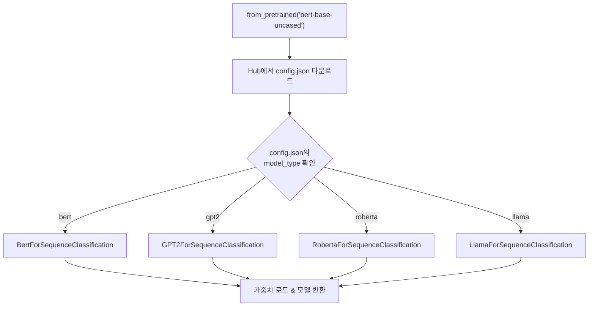
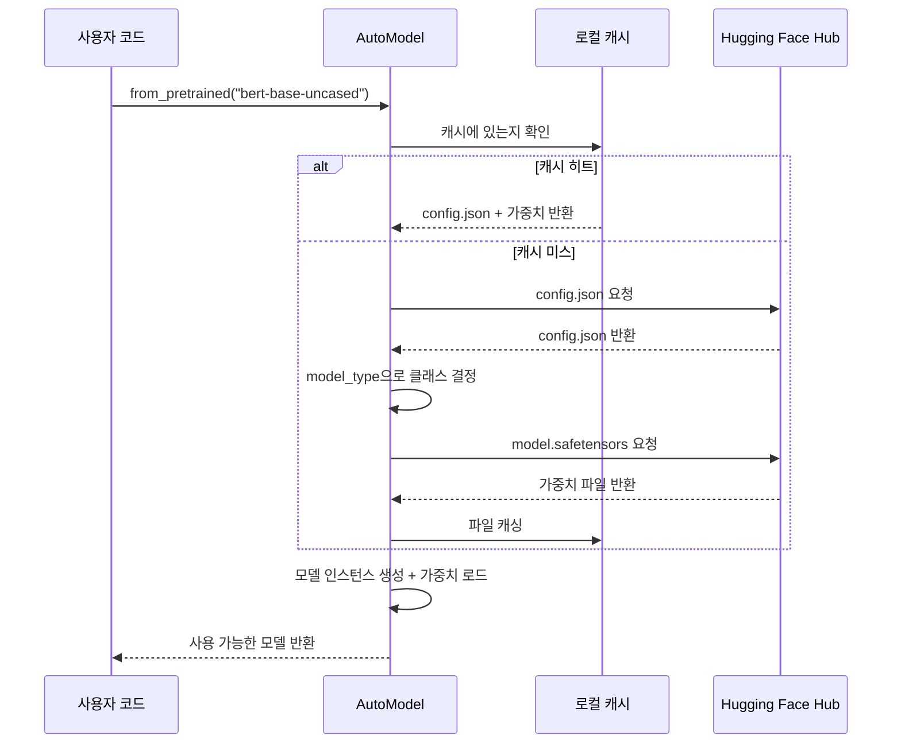
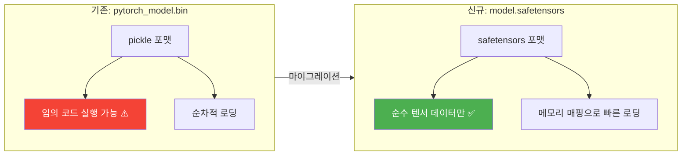
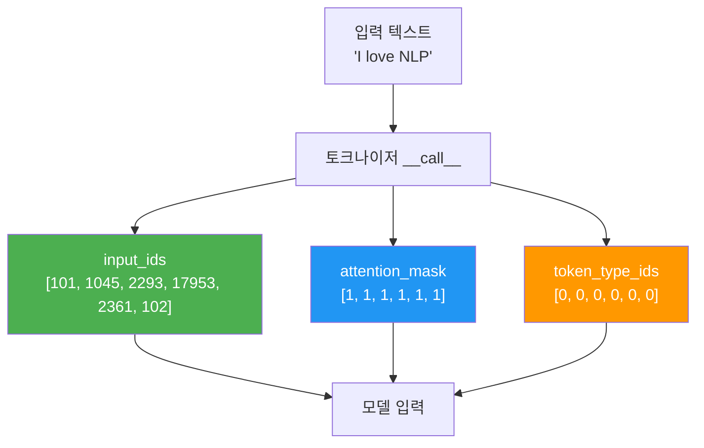
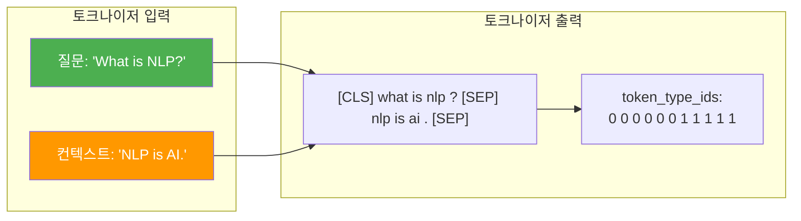
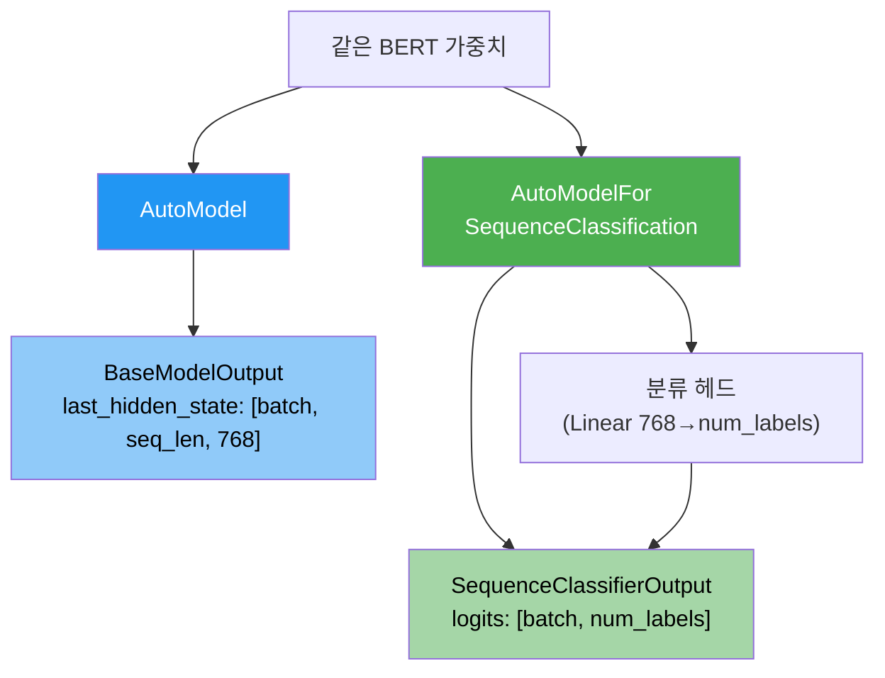

# AutoModel과 AutoTokenizer 심화

> Auto 클래스의 마법 같은 자동 매핑 원리를 파헤치고, 토크나이저 출력을 완벽히 이해합니다

## 개요

이 섹션에서는 [이전 섹션](18-ch18-hugging-face-transformers-실습/02-02-pipeline-api로-빠른-추론.md)에서 다룬 `pipeline()` API의 **내부에서 실제로 동작하는** AutoModel과 AutoTokenizer를 직접 다룹니다. pipeline이 "자동차"라면, 이번에는 "엔진룸을 열어보는" 시간입니다.

**선수 지식**: pipeline() API의 3단계 처리 흐름(전처리→추론→후처리), [BERT 아키텍처](16-ch16-bert-양방향-사전학습-모델/02-02-bert의-아키텍처와-사전학습.md)와 [GPT 아키텍처](17-ch17-gpt-생성적-사전학습-모델/02-02-gpt-아키텍처-상세-분석.md)의 기본 이해

**학습 목표**:
- Auto 클래스가 `config.json`의 `model_type`을 기반으로 올바른 모델을 자동 선택하는 원리를 이해한다
- `from_pretrained()`의 내부 동작 흐름(Hub 검색 → config 다운로드 → 가중치 로드)을 설명할 수 있다
- 토크나이저 출력(`input_ids`, `attention_mask`, `token_type_ids`)의 의미를 정확히 이해하고 직접 조작할 수 있다

## 왜 알아야 할까?

`pipeline()`은 편리하지만, 실무에서는 한계에 부딪히는 순간이 반드시 옵니다. 모델의 중간 출력(hidden states)을 추출하고 싶을 때, 토크나이저의 패딩 전략을 바꿔야 할 때, 여러 입력을 배치로 묶어 GPU 효율을 최적화할 때 — 이런 상황에서는 AutoModel과 AutoTokenizer를 직접 다뤄야 하죠.

특히 [파인튜닝](19-ch19-파인튜닝과-전이학습/01-01-파인튜닝의-원리와-전략.md)으로 넘어가면 토크나이저 출력의 각 필드가 무엇을 의미하는지 정확히 알아야 합니다. `attention_mask`가 뭔지 모르면서 파인튜닝을 시도하는 건, 계기판을 못 읽으면서 비행기를 조종하려는 것과 같습니다.

## 핵심 개념

### 개념 1: Auto 클래스의 자동 모델 매핑

> 💡 **비유**: Auto 클래스는 **만능 리모컨**과 같습니다. TV 리모컨, 에어컨 리모컨, 셋톱박스 리모컨을 따로 들고 있을 필요 없이, 만능 리모컨 하나가 기기를 자동으로 인식해서 올바른 신호를 보내주는 거죠. `AutoModelForSequenceClassification`이라고 말하면, "BERT인지 GPT인지 RoBERTa인지"를 자동으로 파악해서 올바른 클래스를 반환합니다.

Hugging Face의 Auto 클래스는 **모델 이름(또는 경로)만으로** 올바른 아키텍처를 자동 선택합니다. 이 마법의 핵심은 `config.json` 파일에 있는 `model_type` 필드입니다.

> 📊 **그림 1**: Auto 클래스의 모델 자동 매핑 흐름



내부적으로 Transformers 라이브러리는 `MODEL_FOR_SEQUENCE_CLASSIFICATION_MAPPING`과 같은 **매핑 딕셔너리**를 유지합니다. 이 딕셔너리는 `(ConfigClass → ModelClass)` 쌍으로 구성되어 있어서, config의 타입을 보고 어떤 모델 클래스를 인스턴스화할지 결정하죠.

이 매핑이 어떻게 생겼는지 직접 확인해볼 수 있습니다:

```run:python
from transformers import MODEL_FOR_SEQUENCE_CLASSIFICATION_MAPPING

# 매핑 딕셔너리의 일부를 살펴보기
print("=== MODEL_FOR_SEQUENCE_CLASSIFICATION_MAPPING (일부) ===\n")
for config_class, model_class in list(MODEL_FOR_SEQUENCE_CLASSIFICATION_MAPPING.items())[:6]:
    print(f"  {config_class.__name__:30s} → {model_class.__name__}")

print(f"\n총 {len(MODEL_FOR_SEQUENCE_CLASSIFICATION_MAPPING)}개 아키텍처 지원")
```

```output
=== MODEL_FOR_SEQUENCE_CLASSIFICATION_MAPPING (일부) ===

  AlbertConfig                   → AlbertForSequenceClassification
  BartConfig                     → BartForSequenceClassification
  BertConfig                     → BertForSequenceClassification
  BigBirdConfig                  → BigBirdForSequenceClassification
  BloomConfig                    → BloomForSequenceClassification
  CamembertConfig                → CamembertForSequenceClassification

총 75개 아키텍처 지원
```

이런 매핑 딕셔너리가 태스크별로 하나씩 존재합니다. `MODEL_FOR_CAUSAL_LM_MAPPING`, `MODEL_FOR_TOKEN_CLASSIFICATION_MAPPING` 등이 있고, 각 `AutoModelForXxx` 클래스가 해당 매핑을 참조하여 올바른 모델 클래스를 찾아냅니다. 새로운 모델 아키텍처가 추가되면, 이 매핑에 한 줄만 추가하면 Auto 클래스에서 바로 사용할 수 있는 구조인 거죠.

```python
from transformers import AutoConfig

# config.json만 먼저 로드해서 model_type 확인
config = AutoConfig.from_pretrained("google-bert/bert-base-uncased")
print(f"모델 타입: {config.model_type}")       # "bert"
print(f"히든 크기: {config.hidden_size}")       # 768
print(f"레이어 수: {config.num_hidden_layers}") # 12
print(f"어텐션 헤드: {config.num_attention_heads}") # 12
```

**태스크별 Auto 클래스**가 다양하게 준비되어 있습니다:

| Auto 클래스 | 태스크 | 출력 |
|-------------|--------|------|
| `AutoModel` | 기본 (hidden states) | 마지막 은닉 상태 |
| `AutoModelForSequenceClassification` | 문장 분류 | 클래스 로짓 |
| `AutoModelForTokenClassification` | 토큰 분류 (NER) | 토큰별 로짓 |
| `AutoModelForQuestionAnswering` | 질의응답 | start/end 로짓 |
| `AutoModelForCausalLM` | 텍스트 생성 | 다음 토큰 로짓 |
| `AutoModelForMaskedLM` | 마스크 예측 | 마스크 위치 로짓 |

> ⚠️ **흔한 오해**: "AutoModel 하나만 알면 다 되는 거 아닌가요?" — `AutoModel`은 **원시 hidden states**만 반환합니다. 분류를 하려면 `AutoModelForSequenceClassification`처럼 태스크 헤드(classification head)가 붙은 클래스를 사용해야 합니다. 이걸 혼동하면 출력 차원이 완전히 다르기 때문에 에러가 나거나 엉뚱한 결과가 나옵니다.

### 개념 2: from_pretrained()의 내부 동작

> 💡 **비유**: `from_pretrained()`는 **온라인 쇼핑**과 비슷합니다. 상품명(모델 ID)을 검색하면, 상품 설명서(config.json)를 먼저 확인하고, 실제 상품(가중치 파일)을 다운로드한 뒤, 포장을 풀어서(메모리에 로드) 바로 사용할 수 있는 상태로 돌려주는 거죠. 한 번 구매한 상품은 캐시에 저장되어 다음엔 바로 꺼내 씁니다.

`from_pretrained()`는 단순한 로딩 함수가 아닙니다. 꽤 정교한 파이프라인을 내부에서 수행합니다.

> 📊 **그림 2**: from_pretrained()의 내부 동작 흐름



핵심 단계를 좀 더 자세히 살펴보겠습니다:

```python
from transformers import AutoModelForSequenceClassification, AutoTokenizer

# 1단계: Hub에서 config.json 다운로드 → model_type 확인 → 클래스 결정
# 2단계: 가중치 파일(model.safetensors) 다운로드
# 3단계: 모델 인스턴스 생성 + 가중치 로드
model = AutoModelForSequenceClassification.from_pretrained(
    "google-bert/bert-base-uncased",
    num_labels=2,           # 분류 클래스 수 지정
    torch_dtype="auto",     # 자동 dtype 선택
)

# 토크나이저도 같은 방식으로 로드
tokenizer = AutoTokenizer.from_pretrained("google-bert/bert-base-uncased")
```

#### 가중치 파일 포맷: safetensors vs pickle

가중치를 다운로드할 때, Hub에는 두 종류의 파일이 있을 수 있습니다. 기존 PyTorch 모델은 `pytorch_model.bin`이라는 파일에 가중치를 저장했는데, 이 포맷은 Python의 `pickle`을 사용합니다. 문제는 pickle이 **임의의 Python 코드를 실행할 수 있다**는 점이에요. 악의적으로 조작된 `.bin` 파일을 로드하면 시스템에 악성 코드가 실행될 수 있죠.

이 보안 문제를 해결하기 위해 Hugging Face가 개발한 것이 **safetensors** 포맷입니다:

> 📊 **그림 2-1**: safetensors vs pickle 포맷 비교



| 특성 | `pytorch_model.bin` (pickle) | `model.safetensors` |
|------|------|------|
| 보안 | 임의 코드 실행 위험 | 순수 텐서 데이터만 저장, 안전 |
| 로딩 속도 | 기본 | 메모리 매핑으로 2~4배 빠름 |
| 지연 로딩 | 불가 (전체 로드 필수) | 텐서별 선택 로딩 가능 |
| 파일 크기 | 기본 | 거의 동일 (약간 작음) |

`from_pretrained()`는 자동으로 **safetensors 파일을 우선 탐색**합니다. Hub에 `model.safetensors`가 있으면 그것을 사용하고, 없을 때만 `pytorch_model.bin`으로 폴백하죠. 대형 모델의 경우 `model.safetensors.index.json`으로 분할 저장되기도 합니다.

```python
# safetensors를 명시적으로 강제하거나 비활성화할 수도 있음
model = AutoModelForSequenceClassification.from_pretrained(
    "google-bert/bert-base-uncased",
    use_safetensors=True,   # safetensors가 없으면 에러 발생
)
```

**유용한 매개변수들:**

```python
# 특정 리비전(버전) 로드
model = AutoModelForSequenceClassification.from_pretrained(
    "google-bert/bert-base-uncased",
    revision="main",              # 브랜치 또는 커밋 해시
    cache_dir="./my_cache",       # 커스텀 캐시 디렉토리
    torch_dtype="auto",           # float32/float16 자동 선택
    device_map="auto",            # GPU 자동 배치
)
```

> 🔥 **실무 팁**: `device_map="auto"`는 모델을 사용 가능한 GPU에 자동으로 분산 배치합니다. 대형 모델(수십 GB)도 여러 GPU에 나눠 올릴 수 있어서, LLM 시대에 필수적인 옵션이에요.

### 개념 3: 토크나이저 출력 완벽 이해

> 💡 **비유**: 토크나이저의 출력은 **영화 예매 시스템**과 비슷합니다. `input_ids`는 좌석 번호(각 토큰의 고유 ID), `attention_mask`는 실제로 사람이 앉은 좌석 표시(1)와 빈 좌석(0), `token_type_ids`는 1층 관람석(문장 A)인지 2층 관람석(문장 B)인지 구분하는 층 번호입니다.

토크나이저를 호출하면 `BatchEncoding`이라는 딕셔너리 형태의 객체가 반환됩니다. 각 필드의 역할을 정확히 이해해야 합니다.

> 📊 **그림 3**: 토크나이저 출력의 구조



```run:python
from transformers import AutoTokenizer

tokenizer = AutoTokenizer.from_pretrained("google-bert/bert-base-uncased")

# 단일 문장 토크나이징
text = "I love natural language processing"
encoded = tokenizer(text)

print("=== 토크나이저 출력 분석 ===")
print(f"input_ids    : {encoded['input_ids']}")
print(f"attention_mask: {encoded['attention_mask']}")
print(f"token_type_ids: {encoded['token_type_ids']}")

# 토큰 ID를 다시 토큰으로 변환
tokens = tokenizer.convert_ids_to_tokens(encoded['input_ids'])
print(f"\n토큰 목록: {tokens}")
```

```output
=== 토크나이저 출력 분석 ===
input_ids    : [101, 1045, 2293, 3019, 2653, 6364, 102]
attention_mask: [1, 1, 1, 1, 1, 1, 1]
token_type_ids: [0, 0, 0, 0, 0, 0, 0]

토큰 목록: ['[CLS]', 'i', 'love', 'natural', 'language', 'processing', '[SEP]']
```

각 필드의 의미를 하나씩 살펴보겠습니다:

**`input_ids`** — 각 토큰의 어휘 사전 내 고유 인덱스입니다. `[CLS]`(101)와 `[SEP]`(102) 같은 특수 토큰이 자동으로 추가됩니다. 이것이 모델에 입력되는 실제 "숫자"입니다.

**`attention_mask`** — 모델이 어텐션을 계산할 때 **진짜 토큰(1)과 패딩(0)을 구분**하는 마스크입니다. 패딩 토큰에 어텐션이 가면 안 되니까요. 배치 처리할 때 길이가 다른 문장들을 맞추기 위해 패딩을 추가하는데, 그때 이 마스크가 핵심적인 역할을 합니다.

**`token_type_ids`** — **문장 A(0)와 문장 B(1)를 구분**합니다. BERT의 NSP(Next Sentence Prediction) 태스크나 질의응답에서 질문과 컨텍스트를 구분할 때 사용됩니다. GPT 계열 모델은 이 필드를 사용하지 않습니다.

```run:python
from transformers import AutoTokenizer

tokenizer = AutoTokenizer.from_pretrained("google-bert/bert-base-uncased")

# 패딩이 포함된 배치 처리 — attention_mask의 역할이 드러남
sentences = [
    "I love NLP",
    "Natural language processing is amazing and powerful"
]

batch = tokenizer(
    sentences,
    padding=True,       # 짧은 문장에 패딩 추가
    return_tensors="pt" # PyTorch 텐서로 반환
)

print("=== 배치 토크나이징 결과 ===")
for i, sent in enumerate(sentences):
    tokens = tokenizer.convert_ids_to_tokens(batch['input_ids'][i])
    print(f"\n문장 {i+1}: '{sent}'")
    print(f"  토큰     : {tokens}")
    print(f"  input_ids: {batch['input_ids'][i].tolist()}")
    print(f"  att_mask : {batch['attention_mask'][i].tolist()}")
```

```output
=== 배치 토크나이징 결과 ===

문장 1: 'I love NLP'
  토큰     : ['[CLS]', 'i', 'love', 'nl', '##p', '[SEP]', '[PAD]', '[PAD]', '[PAD]']
  input_ids: [101, 1045, 2293, 17953, 2361, 102, 0, 0, 0]
  att_mask : [1, 1, 1, 1, 1, 1, 0, 0, 0]

문장 2: 'Natural language processing is amazing and powerful'
  토큰     : ['[CLS]', 'natural', 'language', 'processing', 'is', 'amazing', 'and', 'powerful', '[SEP]']
  input_ids: [101, 3019, 2653, 6364, 2003, 6429, 1998, 3928, 102]
  att_mask : [1, 1, 1, 1, 1, 1, 1, 1, 1]
```

문장 1에 `[PAD]` 토큰이 추가되고, 해당 위치의 `attention_mask`가 0으로 설정된 것을 확인할 수 있죠? 이렇게 해야 모델이 패딩 토큰을 무시합니다.

### 개념 4: 두 문장 입력과 token_type_ids

질의응답이나 자연어 추론(NLI) 태스크에서는 **두 개의 문장**을 동시에 모델에 입력해야 합니다. 이때 `token_type_ids`가 두 문장을 구분해주는 역할을 합니다.

> 📊 **그림 4**: BERT의 두 문장 입력 구조



```run:python
from transformers import AutoTokenizer

tokenizer = AutoTokenizer.from_pretrained("google-bert/bert-base-uncased")

# 두 문장 입력 (질의응답 스타일)
question = "What is natural language processing?"
context = "NLP is a branch of artificial intelligence."

encoded = tokenizer(question, context)

tokens = tokenizer.convert_ids_to_tokens(encoded['input_ids'])
print("토큰:", tokens)
print("token_type_ids:", encoded['token_type_ids'])
print()

# token_type_ids로 문장 A/B 구분 확인
for token, tid in zip(tokens, encoded['token_type_ids']):
    label = "질문(A)" if tid == 0 else "컨텍스트(B)"
    print(f"  {token:20s} → {label}")
```

```output
토큰: ['[CLS]', 'what', 'is', 'natural', 'language', 'processing', '?', '[SEP]', 'nl', '##p', 'is', 'a', 'branch', 'of', 'artificial', 'intelligence', '.', '[SEP]']
token_type_ids: [0, 0, 0, 0, 0, 0, 0, 0, 1, 1, 1, 1, 1, 1, 1, 1, 1, 1]

  [CLS]                → 질문(A)
  what                 → 질문(A)
  is                   → 질문(A)
  natural              → 질문(A)
  language             → 질문(A)
  processing           → 질문(A)
  ?                    → 질문(A)
  [SEP]                → 질문(A)
  nl                   → 컨텍스트(B)
  ##p                  → 컨텍스트(B)
  is                   → 컨텍스트(B)
  a                    → 컨텍스트(B)
  branch               → 컨텍스트(B)
  of                   → 컨텍스트(B)
  artificial           → 컨텍스트(B)
  intelligence         → 컨텍스트(B)
  .                    → 컨텍스트(B)
  [SEP]                → 컨텍스트(B)
```

### 개념 5: AutoModel vs AutoModelForXxx — 출력 차이

같은 모델이라도 어떤 Auto 클래스로 로드하느냐에 따라 **출력이 완전히 달라집니다**. 이 차이를 이해하는 것이 핵심입니다.

> 📊 **그림 5**: AutoModel과 AutoModelForSequenceClassification의 출력 차이



```python
from transformers import AutoModel, AutoModelForSequenceClassification
import torch

# 동일한 모델 ID, 다른 Auto 클래스
base_model = AutoModel.from_pretrained("google-bert/bert-base-uncased")
cls_model = AutoModelForSequenceClassification.from_pretrained(
    "google-bert/bert-base-uncased", 
    num_labels=2
)

# 가상 입력
dummy_input = torch.randint(0, 1000, (1, 10))  # [batch=1, seq_len=10]

# AutoModel: 원시 hidden states 반환
base_output = base_model(dummy_input)
print(f"AutoModel 출력 shape: {base_output.last_hidden_state.shape}")
# → torch.Size([1, 10, 768])  — 각 토큰의 768차원 벡터

# AutoModelForSequenceClassification: 분류 로짓 반환
cls_output = cls_model(dummy_input)
print(f"Classification 출력 shape: {cls_output.logits.shape}")
# → torch.Size([1, 2])  — 2개 클래스에 대한 로짓
```

## 실습: 직접 해보기

pipeline을 사용하지 않고, AutoModel과 AutoTokenizer만으로 감성 분석을 처음부터 끝까지 수행해봅시다.

```python
import torch
import torch.nn.functional as F
from transformers import AutoTokenizer, AutoModelForSequenceClassification

# ① 모델과 토크나이저 로드
model_name = "nlptown/bert-base-multilingual-uncased-sentiment"
tokenizer = AutoTokenizer.from_pretrained(model_name)
model = AutoModelForSequenceClassification.from_pretrained(model_name)

# ② 모델을 평가 모드로 설정 (드롭아웃 비활성화)
model.eval()

# ③ 분석할 텍스트
reviews = [
    "This movie was absolutely fantastic! I loved every minute of it.",
    "Terrible experience. The food was cold and the service was rude.",
    "It was okay, nothing special but not bad either.",
]

# ④ 토크나이징 (배치 처리)
encoded = tokenizer(
    reviews,
    padding=True,          # 가장 긴 문장 기준으로 패딩
    truncation=True,       # max_length 초과 시 잘라냄
    max_length=128,        # 최대 토큰 수
    return_tensors="pt",   # PyTorch 텐서 반환
)

print("=== 토크나이저 출력 확인 ===")
print(f"input_ids shape    : {encoded['input_ids'].shape}")
print(f"attention_mask shape: {encoded['attention_mask'].shape}")

# ⑤ 모델 추론 (기울기 계산 불필요)
with torch.no_grad():
    outputs = model(**encoded)  # ** 로 딕셔너리 언패킹

# ⑥ 로짓 → 확률 → 예측
logits = outputs.logits                          # [3, 5] — 3개 리뷰 × 5개 별점
probabilities = F.softmax(logits, dim=-1)        # 소프트맥스로 확률 변환
predictions = torch.argmax(probabilities, dim=-1) # 가장 높은 확률의 클래스

# ⑦ 결과 출력
star_labels = ["⭐", "⭐⭐", "⭐⭐⭐", "⭐⭐⭐⭐", "⭐⭐⭐⭐⭐"]
print("\n=== 감성 분석 결과 ===")
for i, review in enumerate(reviews):
    stars = star_labels[predictions[i]]
    confidence = probabilities[i][predictions[i]].item() * 100
    print(f"\n리뷰: '{review[:50]}...'")
    print(f"  예측: {stars} (확신도: {confidence:.1f}%)")
    print(f"  전체 확률: {[f'{p:.3f}' for p in probabilities[i].tolist()]}")
```

이 코드는 pipeline이 내부에서 자동으로 수행하는 것을 우리가 **직접 한 단계씩 제어**한 것입니다. 이렇게 하면 중간 결과를 확인하거나, 전처리/후처리를 커스터마이징할 수 있습니다.

## 더 깊이 알아보기

### Auto 클래스의 탄생 이야기

Transformers 라이브러리 초기 버전(v1.x)에서는 모델마다 정확한 클래스명을 알아야 했습니다. `BertModel`, `GPT2Model`, `RobertaModel`을 직접 임포트해서 사용해야 했죠. 모델이 10개일 때는 괜찮았지만, 수십, 수백 개로 늘어나자 사용자들이 "어떤 모델에 어떤 클래스를 써야 하지?"라는 질문에 시달렸습니다.

2019년 Transformers v2.0에서 `AutoModel` 개념이 도입되면서 이 문제가 해결됐습니다. Thomas Wolf와 Hugging Face 팀은 "사용자가 아키텍처를 몰라도 모델 이름만으로 로드할 수 있어야 한다"는 철학을 세웠고, config 기반 자동 매핑이라는 우아한 해법을 찾았습니다.

지금은 Hub에 200만 개 이상의 모델이 등록되어 있지만, `AutoModel.from_pretrained()`라는 동일한 인터페이스로 모두 접근할 수 있습니다. 이 일관성이야말로 Hugging Face가 NLP/LLM 생태계의 표준이 된 핵심 이유 중 하나입니다.

### safetensors의 탄생 배경

safetensors 포맷의 등장에는 재미있는 배경이 있습니다. 2022년, 보안 연구자들이 PyTorch의 pickle 기반 모델 파일에 **악성 코드를 삽입할 수 있다**는 취약점을 시연했습니다. `torch.load()`를 호출하는 순간 임의의 Python 코드가 실행될 수 있었죠. Hub에 누구나 모델을 올릴 수 있는 오픈 생태계에서 이건 심각한 위협이었습니다.

Hugging Face의 Nicolas Patry가 이 문제를 해결하기 위해 safetensors를 개발했습니다. 핵심 아이디어는 단순합니다 — **텐서의 메타데이터(이름, dtype, shape)와 바이너리 데이터만 저장**하고, 코드 실행이 가능한 어떤 요소도 포함하지 않는 것이죠. 추가 보너스로, 메모리 매핑(memory-mapped I/O)을 지원하여 필요한 텐서만 선택적으로 로드할 수 있어 로딩 속도도 크게 향상됐습니다.

2023년 중반부터 Hugging Face는 safetensors를 기본 포맷으로 채택했고, 새로 업로드되는 대부분의 모델이 safetensors를 사용합니다. `from_pretrained()`가 자동으로 safetensors를 우선 로드하므로, 사용자 입장에서는 별도로 신경 쓸 것이 없습니다.

## 흔한 오해와 팁

> ⚠️ **흔한 오해**: "AutoTokenizer와 AutoModel에 같은 모델 이름을 쓰면 항상 호환된다" — 대부분은 맞지만, 간혹 커뮤니티 모델에서 토크나이저와 모델이 서로 다른 어휘 사전을 사용하는 경우가 있습니다. 항상 같은 `model_name`을 사용하고, 특히 파인튜닝한 모델을 공유할 때는 토크나이저도 함께 저장(`save_pretrained`)해야 합니다.

> 💡 **알고 계셨나요?**: `tokenizer(text)`를 호출하면 내부적으로 `__call__` 메서드가 실행되는데, 이것은 `encode_plus()`를 감싼 래퍼입니다. `tokenizer.encode()`는 `input_ids`만 반환하고, `tokenizer()`는 `attention_mask`, `token_type_ids`까지 모두 포함한 `BatchEncoding` 객체를 반환합니다. 실무에서는 거의 항상 `tokenizer()`를 사용하세요.

> 🔥 **실무 팁**: 토크나이저를 처음 로드할 때 `AutoTokenizer.from_pretrained(model_name)`은 기본적으로 **Fast 토크나이저**(Rust 기반)를 먼저 시도합니다. Fast 버전이 없을 때만 Python 버전으로 폴백하죠. Fast 토크나이저는 배치 처리 시 10~100배 빠르므로 대규모 데이터 처리에서는 이 차이가 큽니다. `tokenizer.is_fast`로 확인할 수 있습니다.

## 핵심 정리

| 개념 | 설명 |
|------|------|
| Auto 클래스 | `config.json`의 `model_type`을 기반으로 올바른 모델 클래스를 자동 선택하는 팩토리 |
| 매핑 딕셔너리 | `MODEL_FOR_*_MAPPING` — ConfigClass→ModelClass 쌍으로 Auto 클래스의 자동 매핑을 구현 |
| `from_pretrained()` | Hub/캐시에서 config → 가중치 순으로 로드하여 모델을 반환하는 핵심 메서드 |
| safetensors | pickle 대체 포맷. 순수 텐서 데이터만 저장하여 보안 안전 + 빠른 로딩 |
| `input_ids` | 각 토큰의 어휘 사전 내 정수 인덱스, 모델의 실제 입력 |
| `attention_mask` | 실제 토큰(1)과 패딩(0)을 구분, 모델이 패딩을 무시하도록 함 |
| `token_type_ids` | 문장 A(0)와 문장 B(1)를 구분, BERT의 NSP/QA에서 사용 |
| `AutoModel` vs `AutoModelForXxx` | 전자는 raw hidden states, 후자는 태스크 헤드 포함 출력 |
| `BatchEncoding` | 토크나이저 출력 객체, 딕셔너리처럼 사용하되 텐서 변환 등 추가 기능 제공 |
| `return_tensors="pt"` | PyTorch 텐서로 반환하여 모델에 바로 입력 가능 |

## 다음 섹션 미리보기

지금까지 모델과 토크나이저를 직접 다루는 방법을 익혔습니다. 다음 섹션 [04. Datasets 라이브러리 활용](18-ch18-hugging-face-transformers-실습/04-04-datasets-라이브러리-활용.md)에서는 Hugging Face의 `datasets` 라이브러리로 대규모 데이터셋을 효율적으로 로드하고, `map()` 함수와 토크나이저를 결합하여 학습용 데이터를 전처리하는 방법을 배웁니다. 오늘 배운 토크나이저 출력(`input_ids`, `attention_mask`)이 데이터셋 전체에 적용되는 실전 파이프라인을 구축하게 됩니다.

## 참고 자료

- [Auto Classes — Hugging Face Transformers 공식 문서](https://huggingface.co/docs/transformers/en/model_doc/auto) - 모든 Auto 클래스의 목록과 매핑 구조를 확인할 수 있는 공식 레퍼런스
- [Load pretrained instances with an AutoClass (튜토리얼)](https://huggingface.co/docs/transformers/main/en/autoclass_tutorial) - AutoModel/AutoTokenizer 사용법을 단계별로 설명하는 공식 가이드
- [Hugging Face Transformers Glossary](https://huggingface.co/docs/transformers/glossary) - `input_ids`, `attention_mask`, `token_type_ids` 등 주요 용어의 공식 정의
- [Tokenizer 클래스 API 문서](https://huggingface.co/docs/transformers/main_classes/tokenizer) - `__call__`, `encode`, `encode_plus` 등 토크나이저 메서드 상세 설명
- [Hugging Face LLM Course — Chapter 2](https://huggingface.co/learn/llm-course/en/chapter2/6) - 토크나이저와 모델을 직접 조합하는 실습 튜토리얼
- [safetensors GitHub 저장소](https://github.com/huggingface/safetensors) - safetensors 포맷의 설계 철학, 벤치마크, 사용법을 확인할 수 있는 공식 저장소

---
### 🔗 Related Sessions
- [from_pretrained()](18-ch18-hugging-face-transformers-실습/01-01-hugging-face-생태계-소개.md) (prerequisite)
- [hugging face hub](18-ch18-hugging-face-transformers-실습/01-01-hugging-face-생태계-소개.md) (prerequisite)


---
### 🔗 Related Sessions
- [from_pretrained()](18-ch18-hugging-face-transformers-실습/01-01-hugging-face-생태계-소개.md) (prerequisite)
- [hugging face hub](18-ch18-hugging-face-transformers-실습/01-01-hugging-face-생태계-소개.md) (prerequisite)
