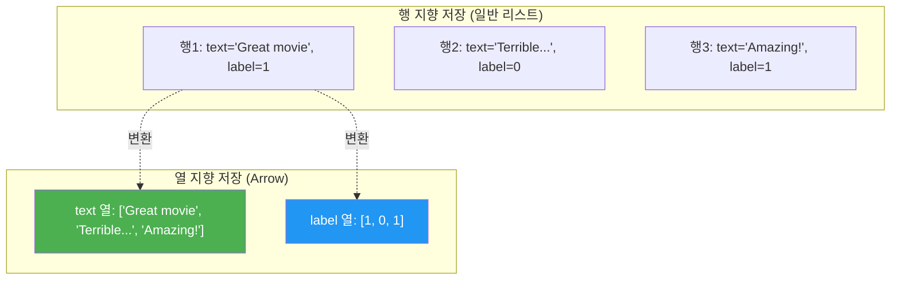
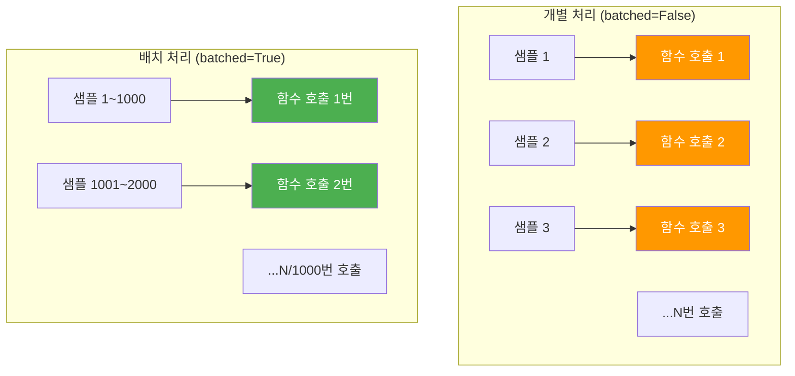
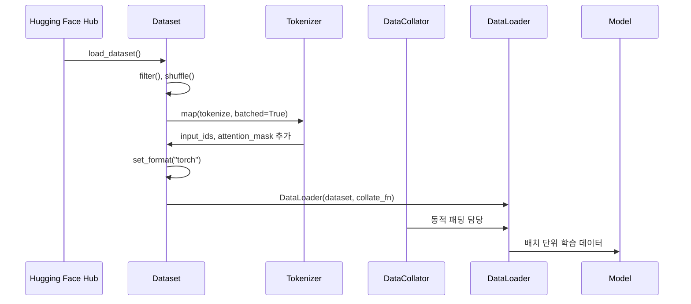
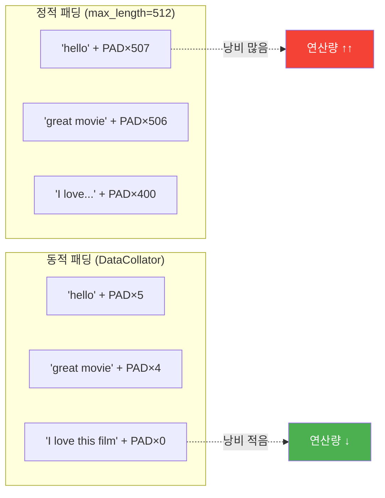

# 04. Datasets 라이브러리 활용

> Hugging Face Datasets 라이브러리로 대규모 데이터를 효율적으로 로드하고, 토크나이저와 연동한 전처리 파이프라인을 구축합니다.

## 개요

이 섹션에서는 Hugging Face의 `datasets` 라이브러리를 사용하여 데이터를 로드하고, 변환하고, 모델 학습에 적합한 형태로 가공하는 전체 과정을 배웁니다. 앞서 [AutoModel과 AutoTokenizer 심화](18-ch18-hugging-face-transformers-실습/03-03-automodel과-autotokenizer-심화.md)에서 토크나이저의 입출력을 직접 다루는 방법을 익혔는데요, 이번에는 그 토크나이저를 수만~수백만 개의 데이터에 **효율적으로** 적용하는 방법을 다룹니다.

**선수 지식**: AutoTokenizer 사용법, `input_ids`와 `attention_mask`의 역할, PyTorch `DataLoader` 기초([학습 루프와 Dataset/DataLoader](07-ch7-pytorch-기초와-신경망-입문/05-05-학습-루프와-datasetdataloader.md))

**학습 목표**:
- `load_dataset()`으로 Hub의 데이터셋을 로드하고 구조를 파악할 수 있다
- `map()`과 `filter()`로 대규모 데이터를 효율적으로 전처리할 수 있다
- 토크나이저와 `map(batched=True)`를 연동한 전처리 파이프라인을 구축할 수 있다
- `DataCollator`와 PyTorch `DataLoader`를 연결하여 학습 준비를 완료할 수 있다

## 왜 알아야 할까?

실전에서 모델을 학습시키려면 데이터셋이 필요합니다. 그런데 NLP 데이터셋은 보통 수만~수백만 건이죠. 이걸 파이썬 리스트로 로드하면? 메모리가 터집니다. CSV로 읽으면? 느립니다. JSON으로? 더 느립니다.

Hugging Face의 `datasets` 라이브러리는 Apache Arrow라는 고성능 열 지향 포맷을 백엔드로 사용합니다. 덕분에 **수십 GB 데이터도 노트북에서** 다룰 수 있고, `map()` 한 줄로 토크나이저를 전체 데이터에 적용할 수 있습니다.

사실 Ch19에서 다룰 파인튜닝에서는 이 `datasets` 라이브러리가 **필수**입니다. `Trainer` API가 Hugging Face `Dataset` 객체를 기본 입력으로 받거든요. 지금 이 파이프라인을 제대로 익혀두면, 파인튜닝은 모델 설정만 바꾸면 되는 수준이 됩니다.

## 핵심 개념

### 개념 1: load_dataset() — 데이터 로딩의 출발점

> 💡 **비유**: `load_dataset()`은 도서관의 **자동 대출 시스템**과 같습니다. 책 이름(데이터셋 이름)만 말하면, 서고에서 꺼내오고(다운로드), 바코드를 찍어 등록하고(캐싱), 열람석에 비치합니다(메모리 매핑). 같은 책을 다시 빌리면? 이미 등록돼 있으니 바로 열람할 수 있죠.

`load_dataset()`은 Hugging Face Hub에서 데이터셋을 다운로드하고, 로컬에 Arrow 포맷으로 캐싱한 뒤, 메모리 매핑 방식으로 접근할 수 있게 해줍니다.

> 📊 **그림 1**: load_dataset()의 데이터 로딩 흐름


기본 사용법을 살펴보겠습니다:

```run:python
from datasets import load_dataset

# IMDB 영화 리뷰 감성 분석 데이터셋 로드
dataset = load_dataset("imdb")

# 데이터셋 구조 확인
print(dataset)
print(f"\n학습 데이터 수: {len(dataset['train']):,}")
print(f"테스트 데이터 수: {len(dataset['test']):,}")

# 첫 번째 샘플 확인
sample = dataset["train"][0]
print(f"\n텍스트 (앞 100자): {sample['text'][:100]}...")
print(f"레이블: {sample['label']} (0=부정, 1=긍정)")
```

```output
DatasetDict({
    train: Dataset({
        features: ['text', 'label'],
        num_rows: 25000
    })
    test: Dataset({
        features: ['text', 'label'],
        num_rows: 25000
    })
})

학습 데이터 수: 25,000
테스트 데이터 수: 25,000

텍스트 (앞 100자): I rented I AM CURIOUS-YELLOW from my video store because of all the controversy that surrounded it wh...
레이블: 0 (0=부정, 1=긍정)
```

반환된 `DatasetDict`는 split별로 `Dataset` 객체를 담고 있습니다. `Dataset`은 파이썬 딕셔너리처럼 인덱싱할 수 있지만, 내부적으로는 Arrow 테이블이라 **1~3 Gbit/s** 속도로 순회할 수 있습니다.

**주요 옵션들**:

```python
# 특정 split만 로드
train_data = load_dataset("imdb", split="train")

# 일부만 로드 (프로토타이핑에 유용)
small = load_dataset("imdb", split="train[:1000]")

# 스트리밍 모드 — 디스크에 저장하지 않고 순회
streamed = load_dataset("imdb", streaming=True)

# 특정 설정(config) 지정
squad = load_dataset("rajpurkar/squad", split="validation")
```

> ⚠️ **흔한 오해**: "`load_dataset()`이 데이터를 전부 RAM에 올린다"고 생각하기 쉽지만, 실제로는 **메모리 매핑(memory-mapped)** 방식입니다. 디스크의 Arrow 파일을 가상 메모리로 매핑하기 때문에, 8GB RAM 노트북에서도 수십 GB 데이터셋을 다룰 수 있습니다.

### 개념 2: Dataset의 구조와 Features

> 💡 **비유**: `Dataset`은 **엑셀 스프레드시트**와 비슷합니다. 각 열(column)은 이름과 데이터 타입이 정해져 있고, 각 행(row)은 하나의 샘플입니다. 다만 일반 스프레드시트와 다른 점은 — 수백만 행이어도 "열 단위"로 저장되어 있어 특정 열만 꺼내 쓸 때 엄청나게 빠르다는 것이죠.

> 📊 **그림 2**: Dataset의 열 지향(columnar) 저장 구조



`Features`는 데이터셋의 스키마를 정의합니다:

```run:python
from datasets import load_dataset

dataset = load_dataset("imdb", split="train")

# Features 확인 — 열 이름과 타입 정보
print("Features:", dataset.features)
print(f"열 이름들: {dataset.column_names}")

# 다양한 접근 방식
print(f"\n인덱싱: {dataset[0]['label']}")           # 단일 샘플
print(f"슬라이싱: {dataset[:3]['label']}")           # 처음 3개의 label
print(f"열 접근: {dataset['label'][:3]}")            # label 열 전체에서 3개
```

```output
Features: {'text': Value(dtype='string', id=None), 'label': ClassLabel(names=['neg', 'pos'], num_classes=2, id=None)}
열 이름들: ['text', 'label']

인덱싱: 0
슬라이싱: [0, 0, 0]
열 접근: [0, 0, 0]
```

`ClassLabel` 타입은 정수와 문자열 레이블 간 자동 변환을 지원합니다. `dataset.features['label'].int2str(0)`이면 `'neg'`를, `str2int('pos')`이면 `1`을 반환하죠.

### 개념 3: map() — 대규모 데이터 변환의 핵심

> 💡 **비유**: `map()`은 컨베이어 벨트 위의 **자동 도장 기계**입니다. 제품(데이터)이 벨트 위를 지나가면, 도장(변환 함수)을 찍어서 내보냅니다. 한 개씩 찍을 수도 있지만, `batched=True`로 하면 한 번에 여러 개를 동시에 찍어서 훨씬 빠릅니다.

`map()`은 데이터셋의 모든 행에 함수를 적용하는 메서드입니다. 가장 중요한 점은 **`batched=True`를 사용하면 토크나이저의 병렬 처리 성능을 최대로** 끌어낼 수 있다는 것입니다.

> 📊 **그림 3**: map()의 개별 처리 vs 배치 처리 비교



**개별 처리 vs 배치 처리**:

```python
from datasets import load_dataset
from transformers import AutoTokenizer

dataset = load_dataset("imdb", split="train")
tokenizer = AutoTokenizer.from_pretrained("bert-base-uncased")

# ❌ 개별 처리 — 느림 (25,000번의 함수 호출)
def tokenize_one(example):
    return tokenizer(example["text"], truncation=True, max_length=512)

tokenized_slow = dataset.map(tokenize_one)

# ✅ 배치 처리 — 빠름 (25번의 함수 호출, batch_size=1000)
def tokenize_batch(examples):
    return tokenizer(examples["text"], truncation=True, max_length=512)

tokenized_fast = dataset.map(tokenize_batch, batched=True, batch_size=1000)
```

`batched=True`일 때 함수에 전달되는 `examples`는 **딕셔너리의 리스트가 아니라, 리스트의 딕셔너리**입니다:

```python
# batched=False → 단일 샘플
{"text": "Great movie!", "label": 1}

# batched=True → 배치 (리스트의 딕셔너리)
{"text": ["Great movie!", "Terrible...", "Amazing!"], "label": [1, 0, 1]}
```

이 구조 덕분에 토크나이저의 Rust 기반 병렬 처리가 한 번에 수백 개 텍스트를 처리할 수 있습니다. 실제로 `batched=True`는 **5~10배 빠른** 전처리를 가능하게 합니다.

**추가 유용한 옵션들**:

```python
# 불필요한 열 제거 (메모리 절약)
tokenized = dataset.map(
    tokenize_batch, 
    batched=True, 
    remove_columns=["text"]  # 원본 텍스트 제거
)

# 멀티프로세싱으로 더 빠르게
tokenized = dataset.map(
    tokenize_batch, 
    batched=True, 
    num_proc=4  # 4개 프로세스 병렬 처리
)
```

### 개념 4: filter(), sort(), shuffle() — 데이터 조작

데이터를 변환하는 것 외에도, 조건에 따라 **필터링**하거나 **셔플**하는 일이 자주 필요합니다.

```python
from datasets import load_dataset

dataset = load_dataset("imdb", split="train")

# 필터링: 특정 길이 이상인 리뷰만 선택
long_reviews = dataset.filter(lambda x: len(x["text"]) > 1000)

# 셔플: 학습 데이터 무작위 섞기 (시드 고정)
shuffled = dataset.shuffle(seed=42)

# 선택: 처음 5000개만 (프로토타이핑용)
subset = dataset.select(range(5000))

# 정렬
sorted_data = dataset.sort("label")

# train/test 분할
split_data = dataset.train_test_split(test_size=0.2, seed=42)
```

> 🔥 **실무 팁**: 프로토타이핑 단계에서는 `dataset.select(range(1000))`으로 작은 부분집합을 먼저 사용하세요. 전처리 로직이 올바른지 확인한 뒤 전체 데이터에 적용하면 시간을 크게 절약할 수 있습니다.

### 개념 5: 토크나이저 연동 파이프라인과 DataCollator

이제 모든 조각을 합쳐서, 데이터 로드부터 PyTorch `DataLoader`까지의 전체 파이프라인을 구축합니다.

> 📊 **그림 4**: 데이터 로드 → 모델 학습까지의 전체 파이프라인



**DataCollator**는 배치를 구성할 때 **동적 패딩(dynamic padding)**을 수행합니다. 전체 데이터를 미리 최대 길이로 패딩하는 대신, 배치 내에서 가장 긴 시퀀스에 맞춰 패딩하므로 연산 낭비가 줄어듭니다.

```python
from transformers import DataCollatorWithPadding

# 동적 패딩을 수행하는 DataCollator
data_collator = DataCollatorWithPadding(tokenizer=tokenizer)
```

> 📊 **그림 5**: 정적 패딩 vs 동적 패딩 비교



## 실습: 직접 해보기

IMDB 데이터셋을 로드하고, BERT 토크나이저로 전처리한 뒤, `DataLoader`까지 연결하는 완전한 파이프라인을 구축해봅시다.

```run:python
from datasets import load_dataset
from transformers import AutoTokenizer, DataCollatorWithPadding
from torch.utils.data import DataLoader

# 1. 데이터 로드
dataset = load_dataset("imdb")
print("원본 데이터셋:", dataset)

# 2. 토크나이저 준비
tokenizer = AutoTokenizer.from_pretrained("bert-base-uncased")

# 3. 토크나이즈 함수 정의 (배치 처리용)
def preprocess(examples):
    return tokenizer(
        examples["text"],
        truncation=True,      # 최대 길이 초과 시 자르기
        max_length=256,        # 실습용으로 256 토큰으로 제한
    )

# 4. 전체 데이터에 토크나이저 적용
tokenized = dataset.map(
    preprocess, 
    batched=True,                     # 배치 처리로 속도 향상
    remove_columns=["text"],          # 원본 텍스트 열 제거 (모델에 불필요)
)
print("\n토크나이즈 후:", tokenized)
print("열 목록:", tokenized["train"].column_names)

# 5. PyTorch 텐서 포맷으로 설정
tokenized.set_format("torch")

# 6. DataCollator (동적 패딩)
data_collator = DataCollatorWithPadding(tokenizer=tokenizer)

# 7. DataLoader 생성
train_loader = DataLoader(
    tokenized["train"],
    batch_size=32,
    shuffle=True,
    collate_fn=data_collator,    # 동적 패딩 함수
)

# 8. 배치 하나 확인
batch = next(iter(train_loader))
print(f"\n배치 키: {list(batch.keys())}")
print(f"input_ids shape: {batch['input_ids'].shape}")
print(f"attention_mask shape: {batch['attention_mask'].shape}")
print(f"labels shape: {batch['labels'].shape}")
```

```output
원본 데이터셋: DatasetDict({
    train: Dataset({
        features: ['text', 'label'],
        num_rows: 25000
    })
    test: Dataset({
        features: ['text', 'label'],
        num_rows: 25000
    })
})

토크나이즈 후: DatasetDict({
    train: Dataset({
        features: ['label', 'input_ids', 'attention_mask'],
        num_rows: 25000
    })
    test: Dataset({
        features: ['label', 'input_ids', 'attention_mask'],
        num_rows: 25000
    })
})
열 목록: ['label', 'input_ids', 'attention_mask']

배치 키: ['input_ids', 'attention_mask', 'labels']
input_ids shape: torch.Size([32, 256])
attention_mask shape: torch.Size([32, 256])
labels shape: torch.Size([32])
```

몇 가지 짚어볼 포인트가 있습니다:

1. **`remove_columns=["text"]`**: 토크나이즈 후 원본 텍스트는 모델에 불필요하므로 제거합니다. 메모리도 절약되죠.
2. **`set_format("torch")`**: 인덱싱 시 자동으로 PyTorch 텐서를 반환하게 설정합니다. Arrow 데이터를 복사하지 않고 변환만 합니다.
3. **`label` → `labels`**: `DataCollatorWithPadding`이 자동으로 `label` 열을 `labels`로 이름을 바꿉니다. Transformers 모델의 `forward()` 인자명과 맞추기 위해서입니다.

이제 이 `train_loader`를 바로 학습 루프에 연결하거나, [Trainer API로 텍스트 분류 파인튜닝](19-ch19-파인튜닝과-전이학습/02-02-trainer-api로-텍스트-분류-파인튜닝.md)에서 배울 `Trainer`에 전달하면 됩니다.

## 더 깊이 알아보기

### Datasets 라이브러리의 탄생 이야기

Hugging Face Datasets 라이브러리의 전신은 `nlp`라는 패키지였습니다. 2020년 5월, TensorFlow Datasets(TFDS)에 대응하여 PyTorch 생태계에서도 표준화된 데이터셋 로딩 도구가 필요하다는 요구에서 시작되었죠.

핵심 결정은 **Apache Arrow를 백엔드로 채택**한 것이었습니다. Arrow는 원래 Apache 재단에서 빅데이터 처리를 위해 만든 열 지향(columnar) 메모리 포맷인데요, "제로 카피(zero-copy)" 읽기가 가능해서 데이터를 메모리에 복사하지 않고도 접근할 수 있습니다. 이 덕분에 일반 파이썬 리스트 대비 **100배 이상 빠른** 데이터 접근이 가능해졌습니다.

2020년 9월, `nlp` 패키지는 `datasets`로 이름이 바뀌면서 Hugging Face 생태계의 정식 데이터 도구로 자리잡았습니다. 지금은 Hub에 50만 개 이상의 데이터셋이 등록되어 있고, 텍스트뿐 아니라 이미지, 오디오, 비디오까지 지원하는 범용 데이터 라이브러리로 성장했습니다.

### 메모리 매핑의 마법

Arrow의 메모리 매핑이 어떻게 동작하는지 조금 더 깊이 들여다보면, 운영체제의 **가상 메모리** 기능을 활용합니다. 디스크에 저장된 Arrow 파일을 프로세스의 가상 주소 공간에 매핑하면, 실제로 해당 부분을 읽을 때만 물리 메모리로 페이지가 로드됩니다. 읽지 않은 부분은 RAM을 차지하지 않죠. 이것이 "8GB RAM에서 20GB 데이터셋"이 가능한 비밀입니다.

## 흔한 오해와 팁

> ⚠️ **흔한 오해**: "`map()`을 호출할 때마다 원본 데이터가 변경된다"고 생각하기 쉽지만, `map()`은 **새로운 Dataset 객체**를 반환합니다. 원본은 그대로 보존되죠. 다만 Arrow 캐시 덕분에 결과가 디스크에 캐싱되어, 같은 `map()`을 다시 호출하면 캐시에서 바로 불러옵니다. 캐시를 끄려면 `load_from_cache_file=False`를 전달하세요.

> 💡 **알고 계셨나요?**: `datasets` 라이브러리의 `map()`은 **fingerprint 시스템**을 사용합니다. 함수 코드, 인자, 입력 데이터의 해시를 조합하여 고유 fingerprint를 생성하고, 이전에 동일한 변환을 수행한 적이 있으면 캐시에서 즉시 로드합니다. 그래서 노트북에서 셀을 다시 실행해도 토크나이징이 처음부터 반복되지 않는 것이죠.

> 🔥 **실무 팁**: 대규모 데이터를 처리할 때는 `streaming=True` 옵션을 고려하세요. `load_dataset("huge_dataset", streaming=True)`로 로드하면 전체를 다운로드하지 않고 필요한 만큼만 순회합니다. 다만 스트리밍 모드에서는 `len()`, 인덱싱(`dataset[0]`), `shuffle()`이 제한되고, `IterableDataset` 타입이 반환된다는 점을 기억하세요.

## 핵심 정리

| 개념 | 설명 |
|------|------|
| `load_dataset()` | Hub에서 데이터셋을 다운로드하고 Arrow 포맷으로 캐싱. 메모리 매핑 방식 |
| `DatasetDict` | split별 `Dataset` 객체를 담는 딕셔너리 (`train`, `test` 등) |
| `Features` | 데이터셋의 스키마. `Value`, `ClassLabel` 등 열 타입 정보 포함 |
| `map(batched=True)` | 배치 단위로 변환 함수 적용. 토크나이저와 조합 시 5~10배 속도 향상 |
| `filter()` | 조건에 맞는 샘플만 선택. 람다 함수로 조건 지정 |
| `remove_columns` | `map()` 호출 시 불필요한 열 제거. 메모리 절약 |
| `set_format("torch")` | 인덱싱 시 PyTorch 텐서 반환. 원본 Arrow 데이터는 유지 |
| `DataCollatorWithPadding` | 배치 구성 시 동적 패딩 수행. 연산 낭비 최소화 |
| `streaming=True` | 전체 다운로드 없이 순회. 초대형 데이터셋에 유용 |

## 다음 섹션 미리보기

다음 섹션 [모델 비교와 벤치마크](18-ch18-hugging-face-transformers-실습/05-05-모델-비교와-벤치마크.md)에서는 이번에 구축한 데이터 파이프라인 위에서 여러 사전학습 모델(BERT, DistilBERT, RoBERTa 등)의 성능을 비교하고, 속도·정확도·메모리 사용량을 벤치마크하는 방법을 배웁니다. 같은 데이터, 같은 전처리를 써도 모델에 따라 결과가 어떻게 달라지는지 직접 확인해볼 거예요.

## 참고 자료

- [Hugging Face Datasets 공식 문서 — Process](https://huggingface.co/docs/datasets/process) - `map()`, `filter()`, `sort()` 등 데이터 처리 메서드의 공식 가이드
- [Datasets 🤝 Arrow](https://huggingface.co/docs/datasets/en/about_arrow) - Arrow 백엔드의 동작 원리와 메모리 매핑 설명
- [Batch mapping 상세 설명](https://huggingface.co/docs/datasets/en/about_map_batch) - `batched=True`의 동작 방식과 성능 최적화 팁
- [Hugging Face Datasets GitHub](https://github.com/huggingface/datasets) - 소스 코드와 최신 릴리스 노트
- [Hugging Face NLP Course — Processing data](https://huggingface.co/docs/datasets/use_dataset) - 토크나이저와 연동한 전처리 튜토리얼
- [Stream 모드 가이드](https://huggingface.co/docs/datasets/en/stream) - 스트리밍 모드의 사용법과 제약 사항

---
### 🔗 Related Sessions
- [input_ids](18-ch18-hugging-face-transformers-실습/03-03-automodel과-autotokenizer-심화.md) (prerequisite)
- [attention_mask](18-ch18-hugging-face-transformers-실습/03-03-automodel과-autotokenizer-심화.md) (prerequisite)


---
### 🔗 Related Sessions
- [input_ids](18-ch18-hugging-face-transformers-실습/03-03-automodel과-autotokenizer-심화.md) (prerequisite)
- [attention_mask](18-ch18-hugging-face-transformers-실습/03-03-automodel과-autotokenizer-심화.md) (prerequisite)
