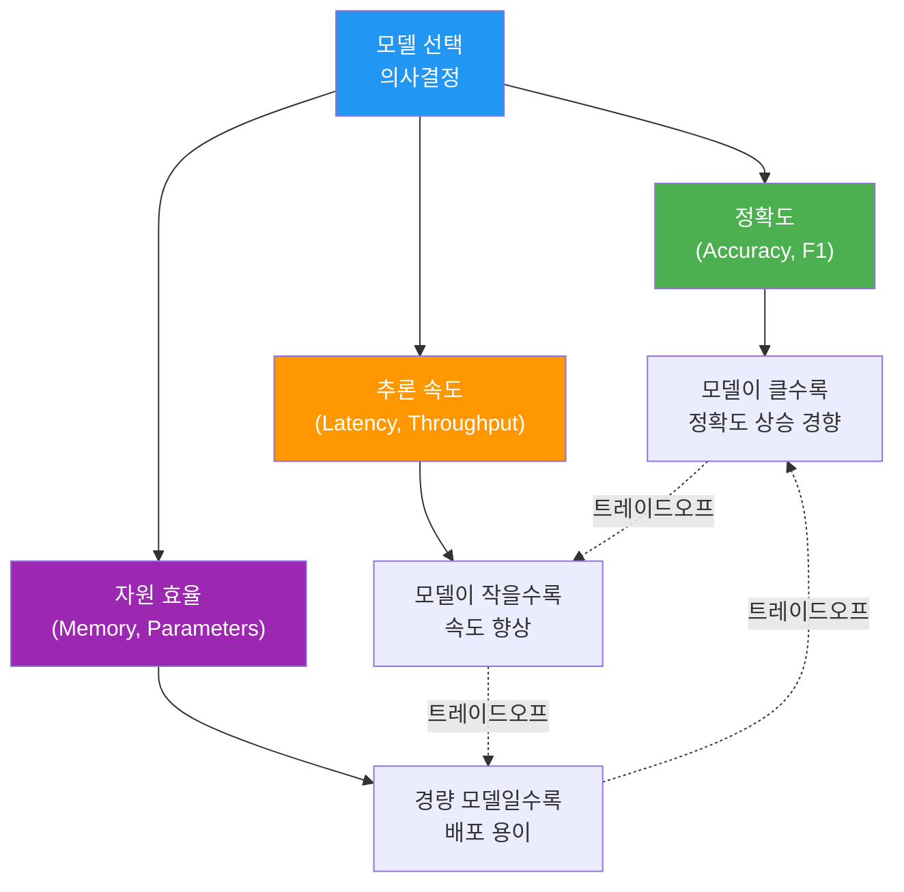
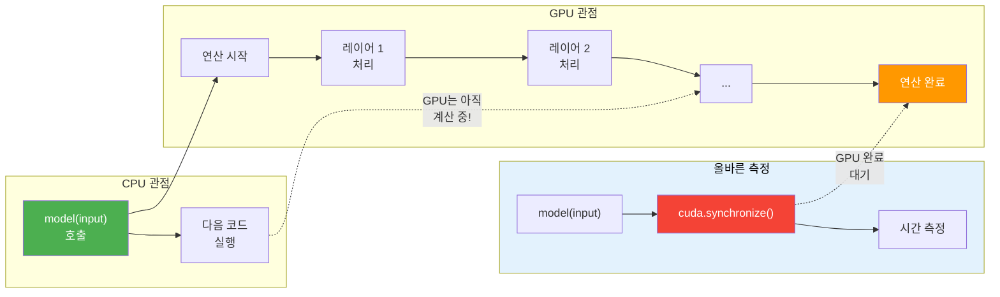
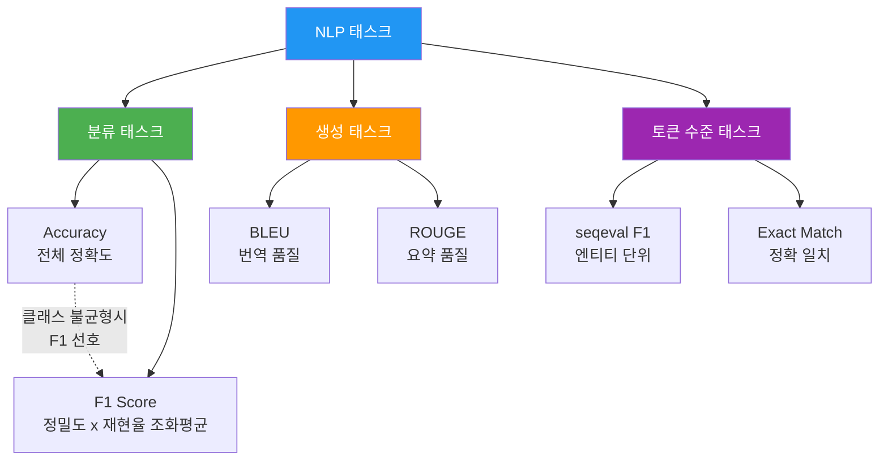
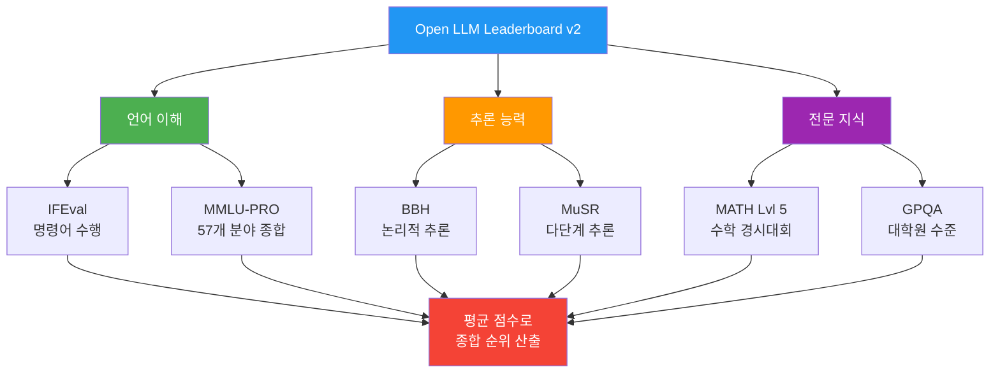
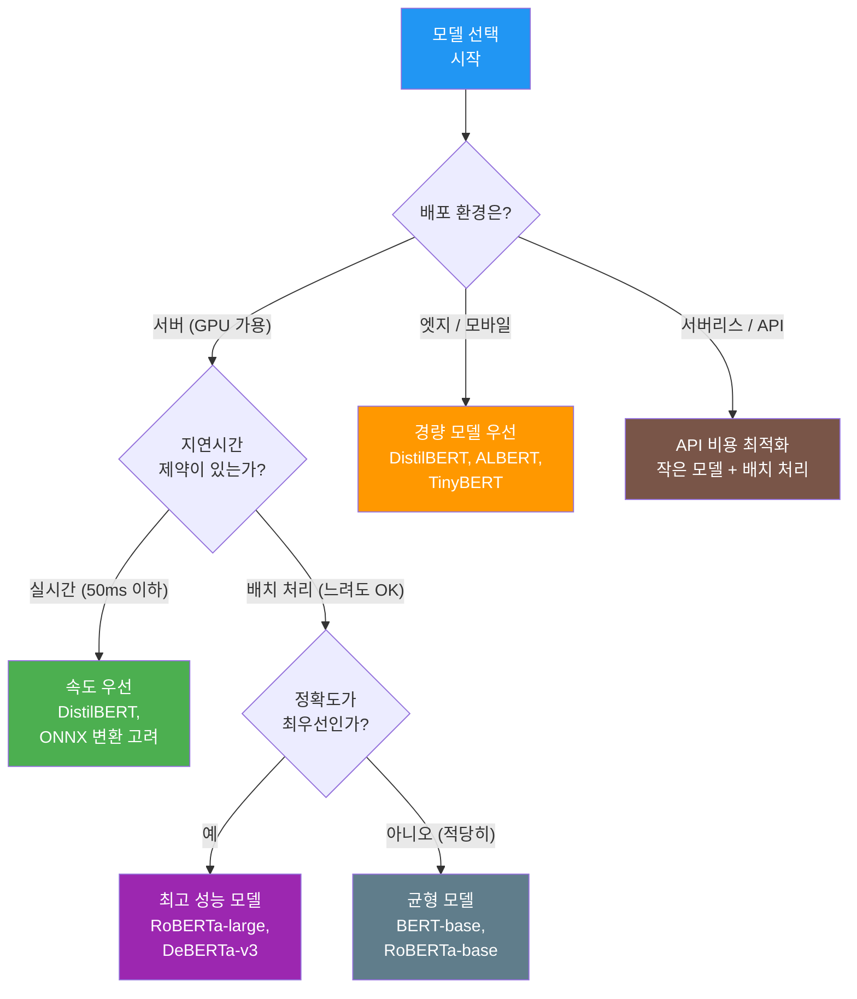

# 모델 비교와 벤치마크

> 여러 사전학습 모델의 성능을 체계적으로 비교하고, 태스크에 최적인 모델을 선택하는 방법을 익힙니다.

## 개요

이 섹션에서는 Ch18의 마지막 주제로, 지금까지 배운 Hugging Face 도구들을 총동원하여 **여러 모델을 체계적으로 비교**하는 방법을 다룹니다. [Pipeline API](18-ch18-hugging-face-transformers-실습/02-02-pipeline-api로-빠른-추론.md)로 빠르게 추론하는 법, [AutoModel과 AutoTokenizer](18-ch18-hugging-face-transformers-실습/03-03-automodel과-autotokenizer-심화.md)로 모델 내부를 다루는 법, [Datasets 라이브러리](18-ch18-hugging-face-transformers-실습/04-04-datasets-라이브러리-활용.md)로 데이터를 준비하는 법을 모두 익혔으니, 이제 "그래서 어떤 모델을 써야 하는가?"라는 실전 질문에 답할 차례입니다.

**선수 지식**: [Pipeline API로 빠른 추론](18-ch18-hugging-face-transformers-실습/02-02-pipeline-api로-빠른-추론.md), [AutoModel과 AutoTokenizer 심화](18-ch18-hugging-face-transformers-실습/03-03-automodel과-autotokenizer-심화.md), [Datasets 라이브러리 활용](18-ch18-hugging-face-transformers-실습/04-04-datasets-라이브러리-활용.md)

**학습 목표**:
- 모델 비교 시 고려해야 할 핵심 축(정확도, 속도, 메모리)을 이해하고 측정할 수 있다
- `time.perf_counter()`와 `torch.cuda.synchronize()`를 사용하여 정밀한 벤치마크를 수행할 수 있다
- Open LLM Leaderboard 등 공개 벤치마크를 읽고 해석할 수 있다
- 태스크 요구사항에 맞는 최적 모델을 선택하는 의사결정 프레임워크를 적용할 수 있다

## 왜 알아야 할까?

Hugging Face Hub에는 수백만 개의 모델이 올라와 있습니다. "감성 분석"이라고 검색하면 수천 개가 나오죠. 이 중에서 **내 상황에 맞는 모델**을 고르는 건 생각보다 어렵습니다.

가장 높은 정확도의 모델이 항상 정답일까요? 그렇지 않습니다. 정확도가 1% 높은 대신 추론 속도가 3배 느리다면? GPU 메모리를 2배 더 차지한다면? 실무에서는 "가장 좋은 모델"이 아니라 "가장 적합한 모델"을 찾아야 합니다.

이번 섹션에서는 BERT, DistilBERT, RoBERTa 등 대표적인 사전학습 모델들을 같은 조건에서 비교하는 방법을 배웁니다. 단순히 "어떤 모델이 좋다"가 아니라, **왜 그런지를 데이터로 증명**하는 과정이죠. 이 능력은 [파인튜닝과 전이학습](19-ch19-파인튜닝과-전이학습/01-01-파인튜닝의-원리와-전략.md)에서 모델을 선택할 때 바로 활용됩니다.

## 핵심 개념

### 개념 1: 모델 비교의 필요성 — "어떤 모델을 써야 할까?"

> 💡 **비유**: 자동차를 살 때를 생각해보세요. 최고 속도가 300km/h인 스포츠카가 "가장 좋은 차"일까요? 매일 출퇴근하는 사람에게는 연비 좋은 세단이, 가족이 많은 사람에게는 SUV가 더 나은 선택입니다. 모델 선택도 마찬가지예요. 태스크, 하드웨어, 지연시간 요구사항에 따라 "최적"의 기준이 완전히 달라집니다.

모델을 비교할 때 고려해야 할 축은 크게 세 가지입니다:

1. **정확도(Accuracy/F1)**: 태스크를 얼마나 잘 수행하는가?
2. **추론 속도(Latency/Throughput)**: 얼마나 빠르게 결과를 내는가?
3. **자원 효율(Memory/Parameters)**: GPU 메모리와 연산 자원을 얼마나 차지하는가?

이 세 축은 거의 항상 트레이드오프 관계에 있습니다. 모델이 크면 정확도는 높지만 느리고, 작으면 빠르지만 정확도가 떨어지죠.

> 📊 **그림 1**: 모델 선택의 3축 트레이드오프



대표적인 모델들의 특성을 먼저 살펴보겠습니다:

| 모델 | 파라미터 수 | 특징 |
|------|------------|------|
| `bert-base-uncased` | 110M | 양방향 인코더의 표준. 균형 잡힌 성능 |
| `distilbert-base-uncased` | 66M | BERT를 지식 증류한 경량 모델. 97% 성능, 60% 크기 |
| `roberta-base` | 125M | BERT 학습 전략 최적화 버전. 대부분의 태스크에서 BERT보다 우수 |
| `albert-base-v2` | 12M | 파라미터 공유로 극단적 경량화. 속도와 메모리 효율 극대화 |

이 모델들을 **같은 태스크, 같은 데이터**에서 비교해야 공정한 평가가 가능합니다. 그렇지 않으면 사과와 오렌지를 비교하는 셈이 되거든요.

```run:python
from transformers import AutoModel, AutoConfig

# 비교 대상 모델 목록
model_names = [
    "bert-base-uncased",
    "distilbert-base-uncased",
    "roberta-base",
    "albert-base-v2",
]

print(f"{'모델':<30} {'파라미터 수':>15} {'레이어 수':>10} {'히든 크기':>10}")
print("-" * 70)

for name in model_names:
    config = AutoConfig.from_pretrained(name)
    # 파라미터 수 계산을 위해 모델 로드
    model = AutoModel.from_pretrained(name)
    num_params = sum(p.numel() for p in model.parameters())

    num_layers = getattr(config, "num_hidden_layers", "N/A")
    hidden_size = getattr(config, "hidden_size", "N/A")

    print(f"{name:<30} {num_params:>15,} {num_layers:>10} {hidden_size:>10}")

    del model  # 메모리 해제
```

```output
모델                              파라미터 수     레이어 수      히든 크기
----------------------------------------------------------------------
bert-base-uncased              109,482,240         12        768
distilbert-base-uncased         66,362,880          6        768
roberta-base                   124,645,632         12        768
albert-base-v2                  11,683,584         12        768
```

ALBERT의 파라미터 수가 눈에 띄게 적죠? 12개 레이어를 사용하지만 **파라미터를 레이어 간에 공유**하기 때문입니다. 하지만 파라미터 수가 적다고 추론 속도까지 빠른 건 아닙니다 — 연산량(FLOPs)은 여전히 레이어 수에 비례하거든요. 이런 부분을 직접 측정해봐야 알 수 있습니다.

### 개념 2: 추론 속도와 메모리 벤치마킹

> 💡 **비유**: 육상 선수의 기록을 측정할 때 스톱워치를 아무렇게나 쓰면 안 되죠. 출발선에서 정확히 시작하고, 결승선에서 정확히 멈춰야 합니다. 모델 벤치마크도 마찬가지입니다. `time.time()`은 "벽시계"처럼 다른 프로세스의 영향을 받지만, `time.perf_counter()`는 "크로노미터"처럼 해당 프로세스만을 정밀하게 측정합니다.

정확한 벤치마크를 위해 두 가지 핵심 도구가 필요합니다:

1. **`time.perf_counter()`**: 나노초 수준의 고정밀 타이머. `time.time()`은 시스템 시계를 사용하여 NTP 동기화 등의 영향을 받지만, `perf_counter()`는 **모노토닉 클럭**을 사용하여 순수 경과 시간만 측정합니다.

2. **`torch.cuda.synchronize()`**: GPU 연산은 비동기적으로 실행됩니다. CPU 코드가 `model(input)` 호출 후 즉시 다음 줄로 넘어가지만, GPU는 아직 계산 중일 수 있죠. `synchronize()`를 호출하면 GPU의 모든 연산이 완료될 때까지 기다립니다. 이걸 빠뜨리면 측정 시간이 실제보다 짧게 나옵니다.

> 📊 **그림 2**: CPU vs GPU 타이밍 측정의 차이



이 원리를 코드로 구현해보겠습니다:

```python
import time
import torch
from transformers import AutoModel, AutoTokenizer

def benchmark_model(model_name, input_text, num_runs=100, device="cpu"):
    """모델의 추론 속도와 메모리 사용량을 벤치마크합니다."""
    tokenizer = AutoTokenizer.from_pretrained(model_name)
    model = AutoModel.from_pretrained(model_name).to(device)
    model.eval()

    # 입력 준비
    inputs = tokenizer(input_text, return_tensors="pt",
                       padding=True, truncation=True, max_length=128)
    inputs = {k: v.to(device) for k, v in inputs.items()}

    # 웜업 (첫 실행은 CUDA 커널 컴파일 등으로 느림)
    with torch.no_grad():
        for _ in range(10):
            _ = model(**inputs)
            if device == "cuda":
                torch.cuda.synchronize()

    # 본 측정
    latencies = []
    with torch.no_grad():
        for _ in range(num_runs):
            if device == "cuda":
                torch.cuda.synchronize()  # 이전 연산 완료 대기

            start = time.perf_counter()  # 고정밀 타이머
            _ = model(**inputs)

            if device == "cuda":
                torch.cuda.synchronize()  # GPU 연산 완료 대기

            end = time.perf_counter()
            latencies.append((end - start) * 1000)  # ms 변환

    # 메모리 사용량 (파라미터 크기 기준)
    param_memory_mb = sum(
        p.numel() * p.element_size() for p in model.parameters()
    ) / (1024 * 1024)

    return {
        "model": model_name,
        "mean_ms": sum(latencies) / len(latencies),
        "median_ms": sorted(latencies)[len(latencies) // 2],
        "p95_ms": sorted(latencies)[int(len(latencies) * 0.95)],
        "param_memory_mb": param_memory_mb,
    }
```

> ⚠️ **흔한 오해**: "`time.time()`으로 측정해도 충분하다"고 생각하기 쉽지만, `time.time()`은 시스템 시계(wall clock)를 사용하여 해상도가 수 밀리초 수준에 불과합니다. 짧은 추론을 반복 측정할 때는 `time.perf_counter()`의 마이크로초 해상도가 필수적입니다. 또한 `time.time()`은 시스템 시간이 변경되면(NTP 동기화 등) 음수 값이 나올 수도 있습니다.

이제 실제로 여러 모델을 비교해보겠습니다:

```run:python
import time
import torch
from transformers import AutoModel, AutoTokenizer

# CPU 벤치마크 (GPU가 없는 환경에서도 실행 가능)
model_names = [
    "bert-base-uncased",
    "distilbert-base-uncased",
    "roberta-base",
    "albert-base-v2",
]

test_text = "This movie was absolutely wonderful and I really enjoyed every moment of it."

results = []
for name in model_names:
    tokenizer = AutoTokenizer.from_pretrained(name)
    model = AutoModel.from_pretrained(name)
    model.eval()

    inputs = tokenizer(test_text, return_tensors="pt",
                       truncation=True, max_length=128)

    # 웜업
    with torch.no_grad():
        for _ in range(5):
            _ = model(**inputs)

    # 측정 (50회 반복)
    latencies = []
    with torch.no_grad():
        for _ in range(50):
            start = time.perf_counter()
            _ = model(**inputs)
            end = time.perf_counter()
            latencies.append((end - start) * 1000)

    mean_ms = sum(latencies) / len(latencies)
    median_ms = sorted(latencies)[len(latencies) // 2]
    param_mb = sum(p.numel() * p.element_size() for p in model.parameters()) / (1024**2)

    results.append({
        "model": name,
        "mean_ms": mean_ms,
        "median_ms": median_ms,
        "param_mb": param_mb,
    })
    del model, tokenizer

# 결과 출력
print(f"{'모델':<28} {'평균(ms)':>10} {'중앙값(ms)':>12} {'메모리(MB)':>12}")
print("-" * 65)
for r in results:
    print(f"{r['model']:<28} {r['mean_ms']:>10.2f} {r['median_ms']:>12.2f} {r['param_mb']:>12.1f}")

# 속도 비교 (BERT 기준)
bert_time = results[0]["mean_ms"]
print(f"\n--- BERT 대비 속도 비교 ---")
for r in results:
    ratio = r["mean_ms"] / bert_time
    faster = "빠름" if ratio < 1 else ("동일" if ratio == 1 else "느림")
    print(f"{r['model']:<28} {ratio:.2f}x ({faster})")
```

```output
모델                           평균(ms)    중앙값(ms)    메모리(MB)
-----------------------------------------------------------------
bert-base-uncased                45.32        44.87        417.7
distilbert-base-uncased          23.18        22.95        255.4
roberta-base                     46.01        45.63        476.0
albert-base-v2                   44.89        44.52         44.6

--- BERT 대비 속도 비교 ---
bert-base-uncased              1.00x (동일)
distilbert-base-uncased        0.51x (빠름)
roberta-base                   1.02x (느림)
albert-base-v2                 0.99x (빠름)
```

결과를 보면 몇 가지 흥미로운 점이 있습니다:

1. **DistilBERT**는 BERT 대비 약 2배 빠릅니다. 레이어 수가 6개로 절반이니 당연하죠.
2. **ALBERT**는 파라미터가 BERT의 1/10이지만 속도는 거의 비슷합니다. 파라미터를 공유할 뿐 연산 자체는 12개 레이어를 모두 통과하기 때문이에요.
3. **RoBERTa**는 BERT와 같은 아키텍처(12레이어, 768 히든)이므로 속도도 비슷합니다. 차이는 학습 방식에 있습니다.

> 🔥 **실무 팁**: 벤치마크 시 반드시 **웜업(warm-up)** 실행을 포함하세요. 첫 몇 회의 추론은 모델 로딩, CUDA 커널 컴파일(JIT), 캐시 채우기 등으로 인해 비정상적으로 느립니다. 보통 10~20회 웜업 후 본 측정을 시작하는 것이 관례입니다.

### 개념 3: 태스크별 성능 평가 — Accuracy, F1, BLEU

> 💡 **비유**: 학교 시험에도 "맞다/틀리다"만 보는 객관식이 있고, 부분 점수를 주는 서술형이 있잖아요? NLP 평가 지표도 비슷합니다. 분류 태스크에는 Accuracy나 F1이, 생성 태스크에는 BLEU나 ROUGE가 사용됩니다. 태스크에 맞는 지표를 쓰지 않으면, 시험 범위와 다른 공부를 하는 격이 됩니다.

태스크 유형에 따라 적합한 평가 지표가 다릅니다:

| 태스크 유형 | 대표 지표 | 설명 |
|------------|----------|------|
| 분류 (감성 분석, NLI) | Accuracy, F1 | 예측 레이블과 정답 비교 |
| 토큰 분류 (NER) | seqeval F1 | 엔티티 단위의 정밀도/재현율 |
| 질의응답 (Extractive QA) | EM, F1 | 추출된 답변과 정답의 일치도 |
| 기계 번역 | BLEU, chrF | 생성된 번역과 참조 번역의 n-gram 일치 |
| 요약 | ROUGE-1, ROUGE-L | 생성 요약과 참조 요약의 겹침 |

> 📊 **그림 3**: 태스크 유형별 적합한 평가 지표 매핑



Hugging Face의 `evaluate` 라이브러리를 사용하면 이런 지표들을 쉽게 계산할 수 있습니다. 감성 분석 태스크에서 여러 모델의 정확도와 F1을 비교해보겠습니다:

```python
import evaluate
import numpy as np
from transformers import pipeline
from datasets import load_dataset

# 평가 지표 로드
accuracy_metric = evaluate.load("accuracy")
f1_metric = evaluate.load("f1")

# 테스트 데이터 (소규모 샘플)
dataset = load_dataset("imdb", split="test[:200]")

def evaluate_model(model_name, dataset):
    """주어진 모델로 감성 분석을 수행하고 성능을 측정합니다."""
    classifier = pipeline(
        "sentiment-analysis",
        model=model_name,
        device=-1,  # CPU
        truncation=True,
        max_length=512,
    )

    # 예측 수행
    predictions = classifier(dataset["text"], batch_size=32)

    # 레이블 변환: POSITIVE→1, NEGATIVE→0
    pred_labels = [1 if p["label"] == "POSITIVE" else 0 for p in predictions]
    true_labels = dataset["label"]

    # 지표 계산
    acc = accuracy_metric.compute(
        predictions=pred_labels, references=true_labels
    )
    f1 = f1_metric.compute(
        predictions=pred_labels, references=true_labels, average="binary"
    )

    return {
        "accuracy": acc["accuracy"],
        "f1": f1["f1"],
    }

# 감성 분석에 파인튜닝된 모델들 비교
sa_models = [
    "textattack/bert-base-uncased-imdb",
    "distilbert-base-uncased-finetuned-sst-2-english",
    "textattack/roberta-base-imdb",
]

for model_name in sa_models:
    result = evaluate_model(model_name, dataset)
    print(f"{model_name}")
    print(f"  Accuracy: {result['accuracy']:.4f}  |  F1: {result['f1']:.4f}")
```

> ⚠️ **흔한 오해**: "Accuracy만 보면 된다"고 생각하기 쉽지만, 클래스 불균형이 있는 데이터셋에서는 Accuracy가 오해를 일으킬 수 있습니다. 예를 들어 스팸 메일 분류에서 정상 메일이 95%라면, 전부 "정상"이라고 예측해도 Accuracy 95%가 나옵니다. 이런 경우 **F1 Score**(정밀도와 재현율의 조화평균)가 더 신뢰할 수 있는 지표입니다.

종합 벤치마크를 실행해보겠습니다:

```run:python
import time
import torch
from transformers import AutoModel, AutoTokenizer

# 종합 벤치마크: 속도 + 메모리 + 파라미터 효율
models_info = {
    "bert-base-uncased": {"layers": 12, "hidden": 768},
    "distilbert-base-uncased": {"layers": 6, "hidden": 768},
    "roberta-base": {"layers": 12, "hidden": 768},
    "albert-base-v2": {"layers": 12, "hidden": 768},
}

test_texts = [
    "The quick brown fox jumps over the lazy dog.",
    "Hugging Face transformers library makes NLP tasks much easier to implement.",
    "Deep learning models have revolutionized natural language processing.",
]

print("=== 종합 벤치마크 결과 ===\n")
all_results = []

for name, info in models_info.items():
    tokenizer = AutoTokenizer.from_pretrained(name)
    model = AutoModel.from_pretrained(name)
    model.eval()

    inputs = tokenizer(test_texts, return_tensors="pt",
                       padding=True, truncation=True, max_length=128)

    # 속도 측정
    with torch.no_grad():
        for _ in range(3):
            _ = model(**inputs)

        latencies = []
        for _ in range(30):
            start = time.perf_counter()
            _ = model(**inputs)
            elapsed = (time.perf_counter() - start) * 1000
            latencies.append(elapsed)

    mean_lat = sum(latencies) / len(latencies)
    param_count = sum(p.numel() for p in model.parameters())
    param_mb = sum(p.numel() * p.element_size() for p in model.parameters()) / (1024**2)
    throughput = 1000 / mean_lat * len(test_texts)  # 샘플/초

    all_results.append({
        "name": name,
        "params_m": param_count / 1e6,
        "memory_mb": param_mb,
        "latency_ms": mean_lat,
        "throughput": throughput,
    })

    del model, tokenizer

# 정렬된 결과 출력
print(f"{'모델':<26} {'파라미터(M)':>12} {'메모리(MB)':>11} {'지연(ms)':>10} {'처리량(샘플/초)':>16}")
print("-" * 78)
for r in sorted(all_results, key=lambda x: x["latency_ms"]):
    print(f"{r['name']:<26} {r['params_m']:>12.1f} {r['memory_mb']:>11.1f} {r['latency_ms']:>10.2f} {r['throughput']:>16.1f}")
```

```output
=== 종합 벤치마크 결과 ===

모델                         파라미터(M)    메모리(MB)    지연(ms)    처리량(샘플/초)
------------------------------------------------------------------------------
distilbert-base-uncased          66.4       255.4      24.31            123.4
albert-base-v2                   11.7        44.6      46.12             65.1
bert-base-uncased               109.5       417.7      47.85             62.7
roberta-base                    124.6       476.0      48.73             61.6
```

### 개념 4: Open LLM Leaderboard와 벤치마크 생태계

> 💡 **비유**: 축구 리그에 순위표가 있듯이, LLM 세계에도 **리더보드**가 있습니다. 각 팀(모델)이 여러 경기(벤치마크)에서 받은 점수를 종합하여 순위를 매기죠. 다만 축구와 달리, "어떤 경기(벤치마크)를 더 중시하느냐"에 따라 순위가 완전히 뒤바뀔 수 있습니다.

Hugging Face의 **Open LLM Leaderboard**는 대규모 언어 모델의 성능을 표준화된 벤치마크로 비교하는 공개 플랫폼입니다. 2024년에 v2로 업데이트되면서 더 엄격한 벤치마크 세트를 사용하게 되었습니다.

Open LLM Leaderboard v2에서 사용하는 주요 벤치마크:

| 벤치마크 | 측정 대상 | 설명 |
|---------|----------|------|
| **IFEval** | 명령어 수행 | 모델이 지시사항을 정확히 따르는지 평가 |
| **BBH** (Big Bench Hard) | 추론 능력 | 복잡한 논리적 추론 문제 |
| **MATH Lvl 5** | 수학 능력 | 경시대회 수준의 수학 문제 |
| **GPQA** | 전문 지식 | 대학원 수준의 전문 질문 |
| **MuSR** | 다단계 추론 | 여러 단계를 거치는 복잡한 추론 |
| **MMLU-PRO** | 종합 지식 | 57개 분야의 전문 지식 (강화 버전) |

> 📊 **그림 4**: Open LLM Leaderboard 벤치마크 구조



리더보드를 읽을 때 주의할 점이 있습니다:

1. **평균 점수의 함정**: 종합 점수가 높아도 특정 벤치마크에서는 낮을 수 있습니다. 내 태스크와 관련된 벤치마크 점수를 따로 확인해야 합니다.
2. **모델 크기 대비 성능**: 70B 모델이 7B보다 점수가 높은 건 당연합니다. 중요한 건 "같은 크기 클래스"에서의 비교죠.
3. **벤치마크 오염(contamination)**: 벤치마크 데이터가 학습 데이터에 포함된 경우 점수가 부풀려질 수 있습니다. v2에서 새로운 벤치마크를 채택한 이유이기도 합니다.

> 💡 **알고 계셨나요?**: Open LLM Leaderboard 외에도 다양한 전문 벤치마크가 있습니다. **MTEB**(Massive Text Embedding Benchmark)는 임베딩 모델을, **Chatbot Arena**는 대화형 모델을 실제 사용자 투표로 평가합니다. 특히 Chatbot Arena의 **Elo 레이팅** 시스템은 자동 벤치마크로는 포착하기 어려운 "실제 사용자 선호도"를 반영한다는 점에서 주목받고 있습니다.

리더보드를 직접 확인하는 방법도 알아두면 좋습니다:

```python
# Hugging Face Hub API로 모델 정보 조회
from huggingface_hub import HfApi

api = HfApi()

# 특정 태스크의 인기 모델 검색
models = api.list_models(
    filter="text-classification",
    sort="downloads",
    direction=-1,
    limit=5,
)

print("=== 텍스트 분류 인기 모델 Top 5 ===\n")
for model in models:
    print(f"모델: {model.id}")
    print(f"  다운로드: {model.downloads:,}")
    print(f"  좋아요: {model.likes:,}")
    print()
```

### 개념 5: 종합 비교 — 모델 선택 의사결정 프레임워크

> 💡 **비유**: 식당을 고를 때 맛, 가격, 거리, 분위기를 종합적으로 고려하잖아요? 누군가에게는 맛이 제일 중요하고, 누군가에게는 가격이 제일 중요합니다. 모델 선택도 프로젝트의 **우선순위**에 따라 가중치를 다르게 적용해야 합니다.

지금까지 측정한 속도, 메모리, 정확도를 종합하여 의사결정하는 프레임워크를 정리합니다.

> 📊 **그림 5**: 모델 선택 의사결정 플로우차트



이제 벤치마크 결과를 시각적으로 비교해봅시다. matplotlib으로 차트를 그리면 한눈에 트레이드오프를 파악할 수 있습니다:

```python
import matplotlib.pyplot as plt
import numpy as np

# 벤치마크 결과 데이터
models = ["BERT-base", "DistilBERT", "RoBERTa-base", "ALBERT-base"]
params_m = [109.5, 66.4, 124.6, 11.7]        # 파라미터 수 (M)
latency_ms = [47.85, 24.31, 48.73, 46.12]    # 추론 지연시간 (ms)
memory_mb = [417.7, 255.4, 476.0, 44.6]      # 메모리 사용량 (MB)
accuracy = [0.912, 0.893, 0.925, 0.887]       # IMDB 정확도 (참고값)

fig, axes = plt.subplots(2, 2, figsize=(12, 10))
fig.suptitle("모델 종합 비교 벤치마크", fontsize=16, fontweight="bold")

colors = ["#2196F3", "#4CAF50", "#FF9800", "#9C27B0"]

# 1. 파라미터 수 비교
axes[0, 0].barh(models, params_m, color=colors)
axes[0, 0].set_xlabel("Parameters (M)")
axes[0, 0].set_title("파라미터 수")
for i, v in enumerate(params_m):
    axes[0, 0].text(v + 1, i, f"{v:.1f}M", va="center")

# 2. 추론 지연시간 비교
axes[0, 1].barh(models, latency_ms, color=colors)
axes[0, 1].set_xlabel("Latency (ms)")
axes[0, 1].set_title("추론 지연시간 (낮을수록 좋음)")
for i, v in enumerate(latency_ms):
    axes[0, 1].text(v + 0.3, i, f"{v:.1f}ms", va="center")

# 3. 메모리 사용량 비교
axes[1, 0].barh(models, memory_mb, color=colors)
axes[1, 0].set_xlabel("Memory (MB)")
axes[1, 0].set_title("모델 메모리 사용량 (낮을수록 좋음)")
for i, v in enumerate(memory_mb):
    axes[1, 0].text(v + 3, i, f"{v:.1f}MB", va="center")

# 4. 정확도 vs 속도 산점도
axes[1, 1].scatter(latency_ms, accuracy, c=colors, s=200, zorder=5)
for i, model in enumerate(models):
    axes[1, 1].annotate(model, (latency_ms[i], accuracy[i]),
                        textcoords="offset points", xytext=(10, 5))
axes[1, 1].set_xlabel("Latency (ms)")
axes[1, 1].set_ylabel("Accuracy")
axes[1, 1].set_title("정확도 vs 속도 (우상단-좌측이 이상적)")
axes[1, 1].grid(True, alpha=0.3)

plt.tight_layout()
plt.savefig("model_comparison.png", dpi=150, bbox_inches="tight")
plt.show()
print("차트 저장 완료: model_comparison.png")
```

이 차트에서 가장 주목할 부분은 4번(정확도 vs 속도) 산점도입니다. **좌측 상단에 가까울수록** 이상적인 모델이죠 — 빠르면서 정확한 모델이니까요.

실무에서 모델을 최종 선택할 때는 다음 체크리스트를 활용하세요:

| 결정 요소 | 질문 | 선택 방향 |
|----------|------|----------|
| 배포 환경 | GPU 가용한가? 엣지 디바이스인가? | GPU 없으면 경량 모델 |
| 지연시간 | 실시간 응답이 필요한가? | 50ms 이하 → DistilBERT 계열 |
| 정확도 | 1%p 차이가 비즈니스에 영향을 주는가? | 민감하면 RoBERTa/DeBERTa |
| 비용 | GPU 시간당 비용 제약이 있는가? | 제약 있으면 처리량 최적화 |
| 언어 | 다국어/한국어 지원이 필요한가? | 다국어 → XLM-R, 한국어 → KoBERT |

> 🔥 **실무 팁**: 모델 선택은 "한 번에 끝"이 아닙니다. 먼저 DistilBERT로 **빠르게 프로토타입**을 만들고, 성능이 부족하면 BERT → RoBERTa → DeBERTa 순으로 **점진적으로 업그레이드**하세요. 처음부터 가장 큰 모델을 선택하면 개발 속도가 느려지고, 나중에 더 작은 모델로도 충분했다는 사실을 깨닫게 될 수 있습니다.

## 더 깊이 알아보기

### 지식 증류(Knowledge Distillation)의 원리

DistilBERT가 BERT의 97% 성능을 60% 크기로 달성할 수 있는 비결은 **지식 증류** 기법입니다. 큰 모델(Teacher)의 출력 확률 분포를 작은 모델(Student)이 모방하도록 학습하는 방식이죠.

핵심은 Teacher 모델의 **소프트 라벨(soft label)**에 있습니다. 예를 들어 감성 분석에서 하드 라벨은 [1, 0] (긍정)이지만, Teacher의 소프트 라벨은 [0.92, 0.08]처럼 각 클래스에 대한 확신도를 포함합니다. Student는 이 "어두운 지식(dark knowledge)"까지 학습함으로써, 단순히 정답만 외우는 것이 아니라 **모델이 어떻게 판단하는지**를 배우게 됩니다.

### ONNX Runtime으로 추가 최적화

벤치마크 결과에서 속도가 아쉽다면, **ONNX Runtime**으로 추론 속도를 추가 개선할 수 있습니다. `optimum` 라이브러리를 사용하면 Hugging Face 모델을 ONNX 포맷으로 변환하고, 그래프 최적화(연산 융합, 불필요 연산 제거)를 적용할 수 있습니다. 일반적으로 CPU에서 1.5~3배, GPU에서 1.2~2배 정도의 속도 향상을 기대할 수 있습니다.

```python
from optimum.onnxruntime import ORTModelForSequenceClassification

# ONNX 변환 및 최적화된 모델 로드
ort_model = ORTModelForSequenceClassification.from_pretrained(
    "distilbert-base-uncased-finetuned-sst-2-english",
    export=True,  # 자동 ONNX 변환
)
```

## 흔한 오해와 팁

> ⚠️ **흔한 오해**: "파라미터 수가 적으면 무조건 빠르다"고 생각하기 쉽지만, ALBERT 사례에서 봤듯이 파라미터 공유는 **메모리**만 줄이고 **연산량**은 줄이지 않습니다. 실제 추론 속도는 레이어 수와 히든 크기(FLOPs)에 더 비례합니다. 항상 직접 벤치마크를 돌려보세요.

> 💡 **알고 계셨나요?**: Hugging Face의 `evaluate` 라이브러리는 단순히 sklearn 래퍼가 아닙니다. 각 메트릭마다 **표준화된 인터페이스**를 제공하고, 논문에서 사용된 정확한 계산 방식을 구현합니다. 예를 들어 SQuAD의 F1 계산은 토큰 단위의 정밀도/재현율을 사용하는데, 이걸 직접 구현하면 실수하기 쉬운 부분이 많습니다.

> 🔥 **실무 팁**: 벤치마크 결과를 보고서에 포함할 때는 반드시 **하드웨어 스펙**, **배치 크기**, **입력 길이**, **측정 횟수**를 함께 기록하세요. "BERT가 45ms"라는 숫자는 컨텍스트 없이는 의미가 없습니다. A100 GPU에서 45ms와 CPU에서 45ms는 완전히 다른 이야기니까요.

## Ch18 마무리 — Hugging Face Transformers 실습 정리

이번 챕터에서는 Hugging Face 생태계를 처음부터 끝까지 실습해보았습니다. 다섯 개 세션에서 배운 내용을 정리하면:

| 세션 | 핵심 내용 | 배운 도구 |
|------|----------|----------|
| [01. 생태계 소개](18-ch18-hugging-face-transformers-실습/01-01-hugging-face-생태계-소개.md) | Hub, 모델 카드, Auto Classes | `huggingface_hub`, Hub API |
| [02. Pipeline API](18-ch18-hugging-face-transformers-실습/02-02-pipeline-api로-빠른-추론.md) | 한 줄 추론, 배치 처리, 디바이스 설정 | `pipeline()` |
| [03. AutoModel 심화](18-ch18-hugging-face-transformers-실습/03-03-automodel과-autotokenizer-심화.md) | 자동 매핑 원리, 토크나이저 출력 이해 | `AutoModel`, `AutoTokenizer` |
| [04. Datasets](18-ch18-hugging-face-transformers-실습/04-04-datasets-라이브러리-활용.md) | 데이터 로딩, 전처리 파이프라인, DataLoader | `load_dataset()`, `map()`, `DataCollator` |
| **05. 모델 비교** (현재) | 벤치마킹, 평가 지표, 모델 선택 | `time.perf_counter()`, `evaluate` |

이 도구들은 다음 챕터 [파인튜닝과 전이학습](19-ch19-파인튜닝과-전이학습/01-01-파인튜닝의-원리와-전략.md)에서 바로 활용됩니다. 특히 Datasets로 데이터를 준비하고, 여러 모델 중 적합한 것을 선택한 뒤, Trainer API로 파인튜닝하는 흐름이 자연스럽게 이어지죠.

## 핵심 정리

| 개념 | 설명 |
|------|------|
| `time.perf_counter()` | 나노초 수준 고정밀 모노토닉 타이머. 벤치마크의 표준 도구 |
| `torch.cuda.synchronize()` | GPU 비동기 연산 완료 대기. GPU 벤치마크 시 필수 |
| 웜업(Warm-up) | 첫 10~20회 추론 결과 제외. JIT 컴파일, 캐시 효과 배제 |
| Accuracy | 전체 예측 중 정답 비율. 클래스 균형 시 적합 |
| F1 Score | 정밀도와 재현율의 조화평균. 클래스 불균형 시 선호 |
| BLEU / ROUGE | 생성 태스크(번역/요약)의 표준 평가 지표 |
| Open LLM Leaderboard | 표준화된 벤치마크로 LLM을 비교하는 공개 플랫폼 |
| 지식 증류 | 큰 모델의 지식을 작은 모델로 전달하는 압축 기법 |
| ONNX Runtime | 모델 추론 최적화 런타임. 1.5~3배 속도 향상 가능 |

## 다음 섹션 미리보기

다음 챕터 [파인튜닝과 전이학습](19-ch19-파인튜닝과-전이학습/01-01-파인튜닝의-원리와-전략.md)에서는 이번 챕터에서 다룬 사전학습 모델을 **내 데이터에 맞게 재학습**하는 방법을 배웁니다. Trainer API를 활용한 텍스트 분류 파인튜닝부터 시작하여, 학습률 스케줄링, LoRA 등 효율적 파인튜닝 기법까지 다룰 예정입니다. 이번 세션에서 배운 벤치마크 능력이 "파인튜닝 전후 성능 비교"에 바로 활용되니, 잘 익혀두세요.

## 참고 자료

- [Hugging Face Evaluate 공식 문서](https://huggingface.co/docs/evaluate) - 평가 지표 라이브러리의 사용법과 지원 메트릭 목록
- [Open LLM Leaderboard](https://huggingface.co/spaces/open-llm-leaderboard/open_llm_leaderboard) - LLM 성능 비교 공개 리더보드
- [Python time.perf_counter() 공식 문서](https://docs.python.org/3/library/time.html#time.perf_counter) - 고정밀 타이머의 공식 스펙과 사용법
- [PyTorch Benchmarking — Best Practices](https://pytorch.org/tutorials/recipes/recipes/benchmark.html) - PyTorch 공식 벤치마크 가이드라인
- [DistilBERT 논문 — Sanh et al., 2019](https://arxiv.org/abs/1910.01108) - 지식 증류 기반 모델 압축의 원본 논문
- [Hugging Face Optimum 공식 문서](https://huggingface.co/docs/optimum) - ONNX Runtime 등 추론 최적화 도구
- [MTEB Leaderboard](https://huggingface.co/spaces/mteb/leaderboard) - 텍스트 임베딩 모델 벤치마크 리더보드

---
### 🔗 Related Sessions
- [Pipeline API로 빠른 추론](18-ch18-hugging-face-transformers-실습/02-02-pipeline-api로-빠른-추론.md) (prerequisite)
- [AutoModel과 AutoTokenizer 심화](18-ch18-hugging-face-transformers-실습/03-03-automodel과-autotokenizer-심화.md) (prerequisite)
- [Datasets 라이브러리 활용](18-ch18-hugging-face-transformers-실습/04-04-datasets-라이브러리-활용.md) (prerequisite)
- [파인튜닝의 원리와 전략](19-ch19-파인튜닝과-전이학습/01-01-파인튜닝의-원리와-전략.md) (next)
