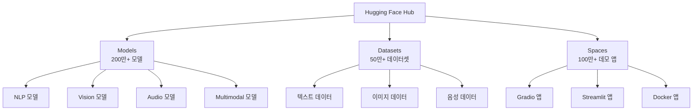
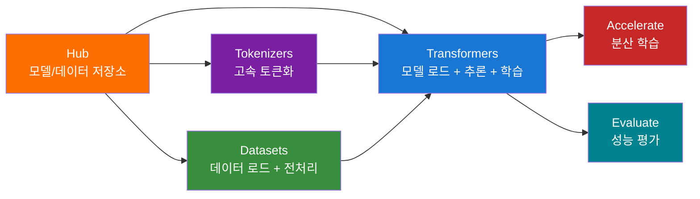
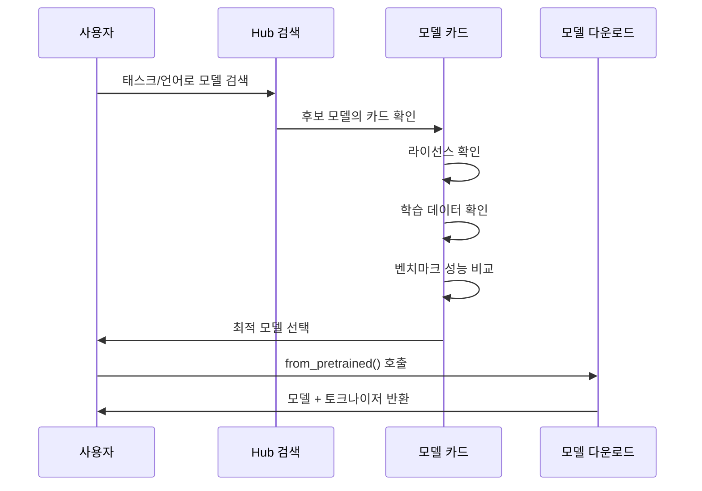
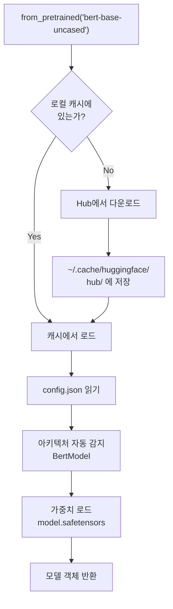
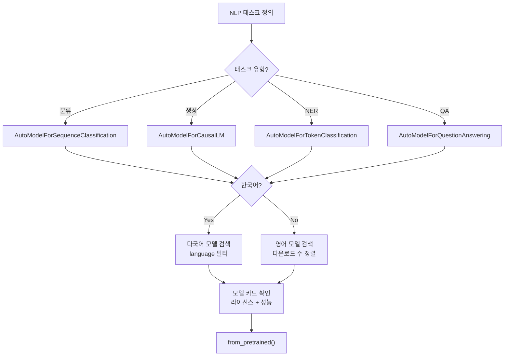

# Hugging Face 생태계 소개

> Hugging Face Hub을 중심으로 Transformers, Datasets, Tokenizers 라이브러리의 역할과 관계를 이해합니다.

## 개요

이 섹션에서는 Hugging Face 생태계의 전체 그림을 살펴봅니다. 앞서 [BERT](16-bert-양방향-사전학습-모델/05-05-hugging-face로-bert-사용하기.md)와 [GPT](17-gpt-생성적-사전학습-모델/03-03-gpt-계열의-발전-gpt-2에서-gpt-4까지.md)를 학습하면서 `transformers` 라이브러리를 잠깐 맛보셨을 텐데요, 이번 챕터에서는 그 뒤에 숨겨진 거대한 생태계를 본격적으로 탐험합니다.

**선수 지식**: BERT와 GPT 아키텍처 기본 개념, Python 패키지 설치 경험
**학습 목표**:
- Hugging Face Hub의 구조와 역할을 이해한다
- Transformers, Datasets, Tokenizers, Accelerate 라이브러리의 역할과 관계를 파악한다
- 모델 카드를 읽고 적합한 모델을 선택할 수 있다
- `HfApi`와 `from_pretrained()`로 Hub의 리소스에 접근할 수 있다

## 왜 알아야 할까?

2026년 현재, Hugging Face Hub에는 **200만 개 이상의 모델**, **50만 개 이상의 데이터셋**, **100만 개 이상의 Spaces 앱**이 등록되어 있습니다. `transformers` 라이브러리는 하루에 **300만 회 이상** 설치되고 있고요. 이제 NLP 프로젝트에서 Hugging Face를 모르고 지나가는 건 사실상 불가능합니다.

모델을 직접 만드는 것도 중요하지만, 이미 수백만 개의 사전학습 모델이 공개되어 있는 상황에서 **적절한 모델을 찾고, 평가하고, 활용하는 능력**이 현대 NLP 엔지니어의 핵심 역량이 되었습니다. Hugging Face 생태계는 바로 그 과정을 체계적으로 지원하는 플랫폼이자 도구 모음입니다.

## 핵심 개념

### 개념 1: Hugging Face Hub — AI 세계의 GitHub

> 💡 **비유**: GitHub가 소스 코드를 공유하는 플랫폼이라면, Hugging Face Hub은 **AI 모델을 공유하는 플랫폼**입니다. GitHub에서 코드를 검색하고, fork하고, PR을 보내듯이, Hub에서는 모델을 검색하고, 다운로드하고, 자신의 모델을 업로드할 수 있죠.

Hugging Face Hub은 ML 커뮤니티의 중심 플랫폼입니다. 크게 세 가지 핵심 저장소 타입으로 구성됩니다:

| 저장소 타입 | 설명 | 규모 (2026) |
|-----------|------|------------|
| **Models** | 사전학습 모델 가중치 + 설정 파일 | 200만+ |
| **Datasets** | 학습/평가용 데이터셋 | 50만+ |
| **Spaces** | Gradio/Streamlit 기반 데모 앱 | 100만+ |

> 📊 **그림 1**: Hugging Face Hub의 3대 저장소



각 모델 저장소는 Git 기반의 버전 관리를 지원합니다. 일반적인 모델 저장소의 구조를 살펴볼까요?

```
bert-base-uncased/
├── config.json          # 모델 아키텍처 설정
├── tokenizer.json       # 토크나이저 설정
├── model.safetensors    # 모델 가중치 (안전한 형식)
├── README.md            # 모델 카드
└── .gitattributes       # Git LFS 설정
```

여기서 `safetensors`라는 파일 형식이 눈에 띕니다. 이전에 PyTorch 모델을 저장할 때 쓰던 pickle 기반의 `.bin` 파일은 보안 취약점이 있었거든요. 악성 코드가 숨어 있을 수 있었죠. **safetensors**는 이 문제를 해결한 안전하고 빠른 텐서 저장 형식입니다.

### 개념 2: 라이브러리 생태계 — 팀워크의 힘

> 💡 **비유**: Hugging Face 생태계를 **주방**에 비유해볼까요? Hub은 거대한 식재료 창고, Transformers는 만능 조리 도구, Datasets는 레시피북, Tokenizers는 고속 칼(재료 손질), Accelerate는 화력 조절 장치입니다. 각각 독립적으로 쓸 수도 있지만, 함께 쓸 때 최고의 요리가 나오죠.

> 📊 **그림 2**: Hugging Face 핵심 라이브러리 관계도



각 라이브러리의 역할을 정리하면:

| 라이브러리 | 역할 | 핵심 기능 |
|-----------|------|----------|
| **transformers** | 모델 로딩, 추론, 학습 | `AutoModel`, `pipeline()`, `Trainer` |
| **datasets** | 데이터셋 로딩, 전처리 | `load_dataset()`, 스트리밍, Arrow 기반 |
| **tokenizers** | 고속 토큰화 | Rust 기반, BPE/WordPiece/Unigram 지원 |
| **accelerate** | 분산 학습 지원 | GPU/TPU/멀티노드 자동 설정 |
| **evaluate** | 모델 평가 | 표준 메트릭 (BLEU, F1 등) |
| **huggingface_hub** | Hub API 클라이언트 | 모델 검색, 다운로드, 업로드 |

`transformers` v5부터는 **PyTorch 전용 백엔드**로 전환되었습니다. 이전에 지원하던 TensorFlow와 Flax 백엔드는 더 이상 핵심 지원 대상이 아니에요. 대신 모듈화된 설계 덕분에 모델 정의, 학습, 추론, 배포 사이의 상호운용성이 크게 향상되었죠.

### 개념 3: 모델 카드 — 모델의 이력서

> 💡 **비유**: 사람을 채용할 때 이력서를 보는 것처럼, 모델을 선택할 때는 **모델 카드(Model Card)**를 봅니다. 어떤 데이터로 학습했는지, 어떤 태스크에 적합한지, 성능은 어떤지, 편향이나 한계는 무엇인지 — 모델에 대해 알아야 할 모든 것이 담겨 있습니다.

모델 카드는 Hub의 각 모델 저장소에 있는 `README.md` 파일입니다. YAML 메타데이터 헤더와 마크다운 본문으로 구성되죠:

```yaml
---
language: en
license: apache-2.0
tags:
  - text-classification
  - sentiment-analysis
datasets:
  - imdb
metrics:
  - accuracy
  - f1
pipeline_tag: text-classification
---
```

좋은 모델 카드는 다음 내용을 포함합니다:

- **Model Description**: 모델 아키텍처와 목적
- **Training Data**: 어떤 데이터로 학습했는지
- **Evaluation Results**: 벤치마크 성능
- **Limitations & Biases**: 알려진 한계와 편향
- **Usage**: 사용 예제 코드

> 📊 **그림 3**: 모델 카드의 구조와 활용 흐름



### 개념 4: Auto 클래스와 from_pretrained() — 마법의 패턴

> 💡 **비유**: 카페에서 "아메리카노 주세요"라고만 하면 바리스타가 원두 선택, 그라인딩, 추출을 알아서 해주잖아요? `from_pretrained("모델명")`도 마찬가지입니다. 모델명만 던지면 아키텍처 감지, 가중치 다운로드, 토크나이저 설정을 자동으로 처리해줍니다.

Hugging Face의 **Auto 클래스**는 모델명(또는 경로)만으로 적절한 모델 클래스를 자동 감지합니다:

```python
from transformers import AutoModel, AutoTokenizer

# 모델명만 지정하면 자동으로 BERT 아키텍처 감지
model = AutoModel.from_pretrained("bert-base-uncased")
tokenizer = AutoTokenizer.from_pretrained("bert-base-uncased")
```

`from_pretrained()`가 호출되면 내부적으로 다음 과정이 일어납니다:

> 📊 **그림 4**: from_pretrained() 내부 동작 흐름



캐시 시스템 덕분에 한 번 다운로드한 모델은 다시 받지 않아도 됩니다. 기본 캐시 경로는 `~/.cache/huggingface/hub/`이고, `HF_HOME` 환경변수로 변경할 수 있어요.

태스크별로 특화된 Auto 클래스도 있습니다:

| Auto 클래스 | 용도 |
|------------|------|
| `AutoModel` | 기본 모델 (hidden states 출력) |
| `AutoModelForSequenceClassification` | 텍스트 분류 |
| `AutoModelForTokenClassification` | 토큰 분류 (NER) |
| `AutoModelForQuestionAnswering` | 질의응답 |
| `AutoModelForCausalLM` | 텍스트 생성 |
| `AutoModelForSeq2SeqLM` | 시퀀스-투-시퀀스 |

## 실습: 직접 해보기

Hub에서 모델을 검색하고, 모델 정보를 조회하고, 실제로 모델을 로드해보겠습니다.

먼저 필요한 패키지를 설치합니다:

```python
# 필요한 패키지 설치
# pip install transformers huggingface_hub datasets
```

### Step 1: HfApi로 Hub 탐색하기

```run:python
from huggingface_hub import HfApi

# HfApi 클라이언트 생성
api = HfApi()

# 감성 분석 모델 검색 (다운로드 수 기준 상위 5개)
models = api.list_models(
    task="text-classification",        # 태스크 필터
    sort="downloads",                   # 다운로드 수 기준 정렬
    direction=-1,                       # 내림차순
    limit=5                             # 상위 5개
)

print("=== 감성 분석 인기 모델 TOP 5 ===")
for i, model in enumerate(models, 1):
    print(f"{i}. {model.id}")
    print(f"   다운로드: {model.downloads:,}")
    print(f"   좋아요: {model.likes:,}")
    print()
```

```output
=== 감성 분석 인기 모델 TOP 5 ===
1. distilbert/distilbert-base-uncased-finetuned-sst-2-english
   다운로드: 45,231,876
   좋아요: 782

2. cardiffnlp/twitter-roberta-base-sentiment-latest
   다운로드: 12,456,321
   좋아요: 456

3. nlptown/bert-base-multilingual-uncased-sentiment
   다운로드: 8,234,567
   좋아요: 389

4. lxyuan/distilbert-base-multilingual-cased-sentiments-student
   다운로드: 5,678,432
   좋아요: 234

5. finiteautomata/bertweet-base-sentiment-analysis
   다운로드: 3,456,789
   좋아요: 198
```

### Step 2: 특정 모델의 상세 정보 조회하기

```run:python
from huggingface_hub import HfApi

api = HfApi()

# 특정 모델의 상세 정보 조회
model_info = api.model_info("bert-base-uncased")

print(f"모델 ID: {model_info.id}")
print(f"작성자: {model_info.author}")
print(f"라이선스: {model_info.card_data.get('license', 'N/A') if model_info.card_data else 'N/A'}")
print(f"다운로드: {model_info.downloads:,}")
print(f"좋아요: {model_info.likes:,}")
print(f"태그: {model_info.tags[:5]}")
print(f"파이프라인 태그: {model_info.pipeline_tag}")
print(f"\n=== 파일 목록 ===")
for sibling in model_info.siblings[:6]:
    print(f"  {sibling.rfilename}")
```

```output
모델 ID: google-bert/bert-base-uncased
작성자: google-bert
라이선스: apache-2.0
다운로드: 68,543,210
좋아요: 1,523
태그: ['pytorch', 'tf', 'jax', 'safetensors', 'bert']
파이프라인 태그: fill-mask

=== 파일 목록 ===
  .gitattributes
  README.md
  config.json
  model.safetensors
  tokenizer.json
  tokenizer_config.json
```

### Step 3: Auto 클래스로 모델 로드하기

```python
from transformers import AutoModel, AutoTokenizer, AutoConfig
import torch

# 1. 설정(config)만 먼저 확인
config = AutoConfig.from_pretrained("bert-base-uncased")
print(f"아키텍처: {config.architectures}")       # ['BertForMaskedLM']
print(f"히든 크기: {config.hidden_size}")          # 768
print(f"어텐션 헤드: {config.num_attention_heads}") # 12
print(f"레이어 수: {config.num_hidden_layers}")     # 12
print(f"어휘 크기: {config.vocab_size}")            # 30522

# 2. 토크나이저 로드
tokenizer = AutoTokenizer.from_pretrained("bert-base-uncased")

# 3. 모델 로드
model = AutoModel.from_pretrained("bert-base-uncased")

# 4. 간단한 추론
text = "Hugging Face is amazing!"
inputs = tokenizer(text, return_tensors="pt")  # PyTorch 텐서로 변환

with torch.no_grad():
    outputs = model(**inputs)

# 출력 shape 확인
print(f"\n입력 토큰: {tokenizer.convert_ids_to_tokens(inputs['input_ids'][0])}")
print(f"출력 shape: {outputs.last_hidden_state.shape}")
# (batch_size=1, sequence_length=7, hidden_size=768)
```

### Step 4: 로컬 캐시 확인하기

```run:python
from huggingface_hub import scan_cache_dir

# 캐시된 모델 정보 확인
cache_info = scan_cache_dir()
print(f"캐시 경로: {cache_info.cache_dir}")
print(f"총 사용 용량: {cache_info.size_on_disk / (1024**2):.1f} MB")
print(f"캐시된 저장소 수: {len(cache_info.repos)}")

for repo in list(cache_info.repos)[:3]:
    print(f"\n  {repo.repo_id}")
    print(f"  크기: {repo.size_on_disk / (1024**2):.1f} MB")
    print(f"  리비전 수: {len(repo.revisions)}")
```

```output
캐시 경로: /home/user/.cache/huggingface/hub
총 사용 용량: 1,847.3 MB
캐시된 저장소 수: 5

  google-bert/bert-base-uncased
  크기: 440.5 MB
  리비전 수: 1

  distilbert/distilbert-base-uncased
  크기: 267.8 MB
  리비전 수: 1

  gpt2
  크기: 548.1 MB
  리비전 수: 1
```

## 더 깊이 알아보기

### 챗봇에서 AI 플랫폼으로 — Hugging Face의 놀라운 피벗

Hugging Face의 탄생 스토리는 IT 업계에서 가장 극적인 **피벗(pivot)** 사례 중 하나입니다.

2016년, 프랑스 출신의 세 명의 공동 창업자 — **Clément Delangue**, **Julien Chaumond**, **Thomas Wolf** — 가 뉴욕에서 회사를 세웠습니다. 원래 목표는 놀랍게도 **10대를 위한 AI 챗봇 앱**이었어요! 허깅 페이스라는 이름도 친근한 챗봇 이미지에서 따온 거죠.

하지만 진짜 전환점은 2018년에 찾아왔습니다. BERT가 공개되면서 NLP 커뮤니티에 혁명이 일어났는데, 당시 사내에서 만들던 NLP 연구 코드를 오픈소스로 공개했더니 예상치 못한 폭발적 반응이 왔습니다. Thomas Wolf는 물리학 박사 학위를 갖고 있었고, 특허 변호사로도 일한 독특한 경력의 소유자였는데, 이 학문적 깊이가 라이브러리 품질에 큰 역할을 했습니다.

결국 Series A 투자를 받을 때, 팀은 과감하게 챗봇 사업을 접고 **오픈소스 ML 플랫폼**으로 방향을 틀었습니다. 그 결과가 지금의 `transformers` 라이브러리이자 Hub 생태계입니다. 하루 300만 설치, 누적 12억 회 이상 다운로드라는 어마어마한 숫자가 그 선택이 옳았음을 증명하죠.

### safetensors — 보안 사고에서 태어난 형식

기존 PyTorch의 모델 저장 방식은 Python의 `pickle` 형식을 사용했습니다. 문제는 pickle 파일 안에 임의의 Python 코드를 숨길 수 있다는 것이었어요. 누군가 악성 모델을 Hub에 올리면, `from_pretrained()`로 다운로드하는 순간 악성 코드가 실행될 수 있었죠.

이 보안 위험을 근본적으로 해결하기 위해 만들어진 것이 `safetensors` 형식입니다. 텐서 데이터만 순수하게 저장하고, 코드 실행 가능성을 원천 차단합니다. 로딩 속도도 pickle보다 빠르고요. 지금은 Hub의 대부분의 모델이 safetensors 형식을 기본으로 사용합니다.

## 흔한 오해와 팁

> ⚠️ **흔한 오해**: "Hugging Face는 BERT와 GPT만 지원하는 NLP 전용 라이브러리다"
> 
> 초창기에는 맞았지만, 지금은 완전히 다릅니다. `transformers` 라이브러리는 텍스트뿐 아니라 **비전(ViT, DETR)**, **오디오(Whisper, Wav2Vec2)**, **멀티모달(CLIP, LLaVA)** 모델까지 폭넓게 지원합니다. 라이브러리 공식 설명도 "state-of-the-art machine learning models in **text, vision, audio, and multimodal**"로 바뀌었어요.

> 💡 **알고 계셨나요?**: `huggingface_hub` 패키지는 GitHub에서 **20만 개 이상의 저장소**와 **PyPI의 3,000개 이상의 패키지**에서 의존성으로 사용됩니다. LangChain, Keras, NVIDIA NeMo 같은 주요 프레임워크들도 내부적으로 이 패키지를 통해 Hub에 접근하고 있죠.

> 🔥 **실무 팁**: 처음 `from_pretrained()`를 호출하면 모델을 다운로드하느라 시간이 걸리지만, 두 번째부터는 로컬 캐시에서 즉시 로드됩니다. 캐시가 디스크를 많이 차지한다면 `huggingface-cli cache` 명령어나 `scan_cache_dir()`로 관리할 수 있습니다. 또한 `TRANSFORMERS_OFFLINE=1` 환경변수를 설정하면 오프라인 모드로 동작하여 실수로 대용량 모델을 다운로드하는 걸 방지할 수 있어요.

> 📊 **그림 5**: 모델 선택 의사결정 흐름



## 핵심 정리

| 개념 | 설명 |
|------|------|
| **Hugging Face Hub** | 모델·데이터셋·Spaces를 호스팅하는 Git 기반 플랫폼 (200만+ 모델) |
| **transformers** | 모델 로딩·추론·학습을 위한 핵심 라이브러리 (v5부터 PyTorch 전용) |
| **datasets** | Arrow 기반의 고속 데이터셋 로딩·전처리 라이브러리 |
| **tokenizers** | Rust 기반 고속 토큰화 라이브러리 (BPE, WordPiece, Unigram) |
| **accelerate** | 코드 변경 최소화로 분산 학습을 지원하는 라이브러리 |
| **모델 카드** | 모델의 용도·성능·한계를 문서화한 README.md |
| **Auto 클래스** | 모델명으로 아키텍처를 자동 감지하는 패턴 (`AutoModel`, `AutoTokenizer`) |
| **from_pretrained()** | Hub에서 모델/토크나이저를 다운로드·캐싱·로드하는 핵심 메서드 |
| **safetensors** | pickle 대비 안전하고 빠른 텐서 저장 형식 |
| **로컬 캐시** | `~/.cache/huggingface/hub/`에 다운로드된 모델을 캐싱 |

## 다음 섹션 미리보기

이번 섹션에서 Hub의 구조와 라이브러리 관계를 살펴보았다면, 다음 [Pipeline API로 빠른 추론](18-hugging-face-transformers-실습/02-02-pipeline-api로-빠른-추론.md)에서는 가장 높은 수준의 추상화인 `pipeline()` 함수를 다룹니다. 감성 분석, NER, 질의응답, 요약, 번역 — 단 2줄의 코드로 다양한 NLP 태스크를 수행하는 마법 같은 API를 체험해보겠습니다.

## 참고 자료

- [Hugging Face Hub 공식 문서](https://huggingface.co/docs/hub/en/index) - Hub의 모든 기능을 다루는 공식 가이드
- [Transformers 공식 문서](https://huggingface.co/docs/transformers/main/en/index) - transformers 라이브러리 API 레퍼런스와 튜토리얼
- [Transformers v5 블로그 포스트](https://huggingface.co/blog/transformers-v5) - v5의 주요 변경사항과 설계 철학
- [huggingface_hub v1.0 블로그](https://huggingface.co/blog/huggingface-hub-v1) - Hub 클라이언트 라이브러리 5년간의 발전사
- [HfApi 클라이언트 문서](https://huggingface.co/docs/huggingface_hub/package_reference/hf_api) - HfApi의 전체 메서드 레퍼런스
- [Safetensors 공식 문서](https://huggingface.co/docs/safetensors/main/en/index) - safetensors 형식의 기술 명세와 사용법
- [모델 카드 가이드](https://huggingface.co/docs/hub/en/model-card-guidebook) - 좋은 모델 카드를 작성하고 읽는 방법

---
### 🔗 Related Sessions
- [transformer 아키텍처](13-트랜스포머-아키텍처-심층-분석/01-01-트랜스포머-아키텍처-전체-조망.md) (prerequisite)
- [인코더-디코더 구조](13-트랜스포머-아키텍처-심층-분석/01-01-트랜스포머-아키텍처-전체-조망.md) (prerequisite)
