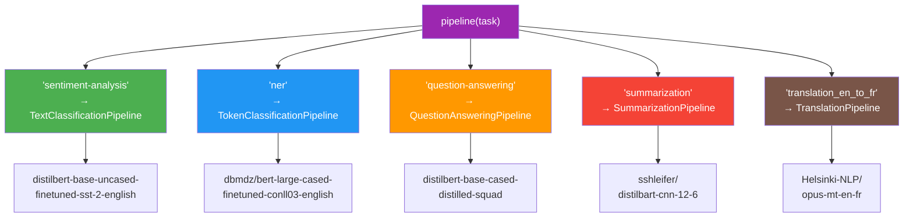
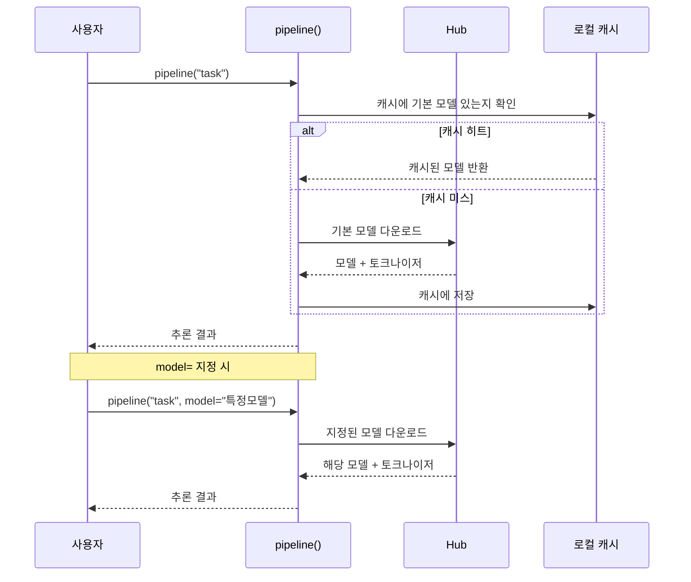
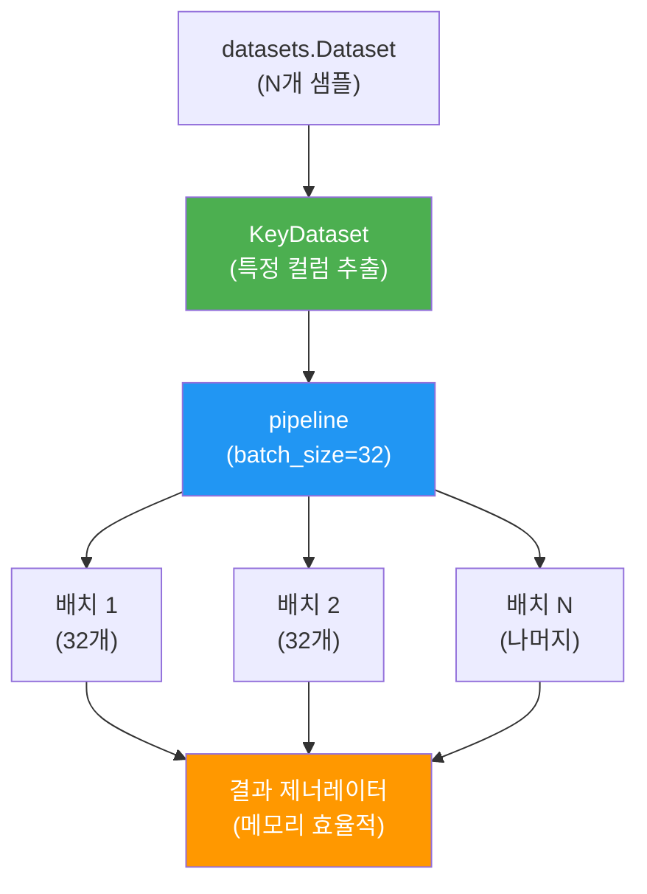
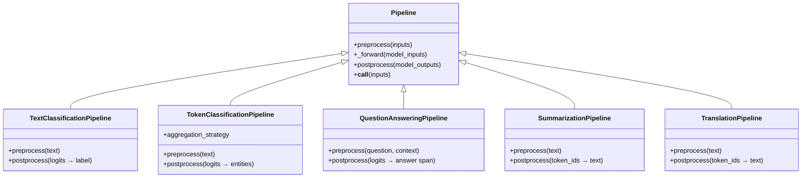

# Pipeline API로 빠른 추론

> Hugging Face의 `pipeline()` 함수 하나로 감성 분석부터 번역까지 — NLP 추론의 진입 장벽을 2줄로 낮추는 방법을 배웁니다.

## 개요

이 섹션에서는 Hugging Face Transformers 라이브러리의 가장 강력한 고수준 API인 `pipeline()`을 학습합니다. 태스크 이름 하나만 지정하면 적절한 모델이 자동으로 선택되고, 전처리부터 후처리까지 한 번에 처리되는 마법 같은 경험을 직접 해보겠습니다.

**선수 지식**: [Hugging Face 생태계 소개](18-hugging-face-transformers-실습/01-01-hugging-face-생태계-소개.md)에서 배운 Hub, Auto 클래스, `from_pretrained` 개념
**학습 목표**:
- `pipeline()` 함수의 내부 동작 원리(전처리 → 모델 추론 → 후처리) 이해
- 감성 분석, NER, 질의응답, 요약, 번역 5가지 태스크를 `pipeline()`으로 수행
- `batch_size`와 `KeyDataset`을 활용한 대규모 배치 추론 구현

## 왜 알아야 할까?

여러분이 앞서 [BERT](16-bert-양방향-사전학습-모델/02-02-bert의-아키텍처와-사전학습.md)와 [GPT](17-gpt-생성적-사전학습-모델/02-02-gpt-아키텍처-상세-분석.md)의 복잡한 아키텍처를 배웠죠? 토크나이저 설정, 텐서 변환, 소프트맥스 후처리... 직접 하려면 수십 줄의 코드가 필요합니다. 하지만 실무에서 "이 리뷰가 긍정인지 부정인지 빨리 확인해봐"라는 요청을 받았다면? `pipeline()` 한 줄이면 됩니다.

Pipeline API는 NLP 엔지니어의 "스위스 아미 나이프"와 같습니다. 프로토타이핑에서 프로덕션까지, 복잡한 모델을 마치 함수 호출하듯 사용할 수 있게 해주거든요. Hugging Face Hub에 올라온 200만 개 이상의 모델을 단 2줄의 코드로 활용할 수 있다는 건, 개발 생산성 면에서 혁명적인 변화입니다.

## 핵심 개념

### 개념 1: pipeline() 함수의 3단계 아키텍처

> 💡 **비유**: `pipeline()`은 고급 레스토랑의 풀코스 서비스와 같습니다. 손님(사용자)은 "스테이크 주세요"라고 말하기만 하면, 셰프(모델)가 재료 손질(전처리) → 요리(추론) → 플레이팅(후처리)을 알아서 해주죠. 주방에서 무슨 일이 벌어지는지 몰라도 맛있는 요리를 받을 수 있습니다.

`pipeline()` 함수는 내부적으로 세 가지 단계를 자동으로 수행합니다:

1. **전처리(Preprocessing)**: 입력 텍스트를 토크나이저로 토큰화하고, 텐서로 변환
2. **모델 추론(Inference)**: 변환된 텐서를 모델에 통과시켜 로짓(logits) 생성
3. **후처리(Postprocessing)**: 로짓을 사람이 읽을 수 있는 레이블과 점수로 변환

> 📊 **그림 1**: pipeline() 함수의 3단계 내부 처리 흐름


가장 기본적인 사용법은 놀라울 정도로 간단합니다:

```python
from transformers import pipeline

# 태스크 이름만 지정하면 끝!
classifier = pipeline("sentiment-analysis")
result = classifier("I love this movie!")
# [{'label': 'POSITIVE', 'score': 0.9998}]
```

`pipeline()` 함수의 핵심 매개변수를 살펴보겠습니다:

```python
pipe = pipeline(
    task="sentiment-analysis",        # 태스크 식별자
    model="nlptown/bert-base-multilingual-uncased-sentiment",  # 특정 모델 지정 (선택)
    device=0,                         # GPU 사용 (0번 GPU), -1이면 CPU
    torch_dtype="auto",               # 자동 dtype 선택
)
```

`model` 매개변수를 생략하면 Hugging Face가 해당 태스크에 가장 적합한 기본 모델을 자동으로 선택합니다. 이것이 바로 [Auto 클래스 패턴](18-hugging-face-transformers-실습/01-01-hugging-face-생태계-소개.md)의 위력이죠.

### 개념 2: 태스크 식별자와 5대 NLP 태스크

> 💡 **비유**: 태스크 식별자는 자판기의 버튼과 같습니다. "커피" 버튼을 누르면 커피가, "주스" 버튼을 누르면 주스가 나오듯, `"sentiment-analysis"`를 넣으면 감성 분석 모델이, `"ner"`을 넣으면 개체명 인식 모델이 자동으로 로드됩니다.

> 📊 **그림 2**: 태스크 식별자별 모델 자동 선택 흐름



각 태스크를 하나씩 실습해보겠습니다.

#### 태스크 1: 감성 분석 (sentiment-analysis)

텍스트의 감정을 분류합니다. 내부적으로는 `TextClassificationPipeline`이 동작하죠.

```run:python
from transformers import pipeline

classifier = pipeline("sentiment-analysis")

# 단일 텍스트
result = classifier("This product exceeded my expectations!")
print(f"레이블: {result[0]['label']}, 확신도: {result[0]['score']:.4f}")

# 여러 텍스트를 리스트로 전달
results = classifier([
    "I absolutely love this!",
    "This is terrible and disappointing.",
    "It's okay, nothing special."
])
for r in results:
    print(f"  {r['label']}: {r['score']:.4f}")
```

```output
레이블: POSITIVE, 확신도: 0.9999
  POSITIVE: 0.9999
  NEGATIVE: 0.9998
  POSITIVE: 0.9088
```

> ⚠️ **흔한 오해**: `"sentiment-analysis"`와 `"text-classification"`은 같은 태스크입니다. 전자는 후자의 별칭(alias)일 뿐이에요. 내부적으로 동일한 `TextClassificationPipeline`이 사용됩니다.

#### 태스크 2: 개체명 인식 (NER)

텍스트에서 사람(PER), 조직(ORG), 장소(LOC) 등의 개체를 식별합니다.

```python
from transformers import pipeline

ner = pipeline("ner", aggregation_strategy="simple")

text = "Elon Musk founded SpaceX in Hawthorne, California."
entities = ner(text)

for entity in entities:
    print(f"  [{entity['entity_group']}] {entity['word']} "
          f"(확신도: {entity['score']:.4f})")
```

여기서 `aggregation_strategy`가 핵심입니다. 토크나이저가 단어를 서브워드로 쪼개기 때문에, "Hawthorne"이 `["Haw", "##thor", "##ne"]`로 분리될 수 있거든요. `aggregation_strategy`는 이 조각들을 다시 하나의 개체로 합쳐줍니다.

| 전략 | 동작 |
|------|------|
| `"none"` | 서브워드 토큰별로 개별 반환 |
| `"simple"` | 연속된 같은 태그의 토큰을 단순 병합 |
| `"first"` | 병합 시 첫 번째 토큰의 점수 사용 |
| `"average"` | 병합 시 모든 토큰 점수의 평균 사용 |
| `"max"` | 병합 시 가장 높은 점수 사용 |

#### 태스크 3: 질의응답 (question-answering)

주어진 문맥(context)에서 질문의 답을 추출합니다. 이것은 **추출적 QA**로, 답변을 생성하는 것이 아니라 문맥에서 해당 스팬(span)을 찾아내는 방식입니다.

```python
from transformers import pipeline

qa = pipeline("question-answering")

result = qa(
    question="What is the capital of France?",
    context="France is a country in Western Europe. "
            "Paris is the capital and most populous city of France."
)
print(f"답변: {result['answer']}")
print(f"확신도: {result['score']:.4f}")
print(f"위치: {result['start']}~{result['end']}")
# 답변: Paris
# 확신도: 0.9836
# 위치: 51~56
```

> 💡 **알고 계셨나요?**: 질의응답 파이프라인의 기본 모델은 SQuAD(Stanford Question Answering Dataset)로 파인튜닝된 DistilBERT입니다. SQuAD는 2016년 스탠포드 대학의 Pranav Rajpurkar 연구팀이 만든 데이터셋으로, 위키피디아 문서 기반의 10만 개 이상의 질문-답변 쌍을 포함하고 있죠.

#### 태스크 4: 요약 (summarization)

긴 텍스트를 핵심만 남겨 짧게 요약합니다.

```python
from transformers import pipeline

summarizer = pipeline("summarization")

article = """
The tower is 324 metres (1,063 ft) tall, about the same height as an 81-storey 
building, and the tallest structure in Paris. Its base is square, measuring 125 
metres (410 ft) on each side. During its construction, the Eiffel Tower surpassed 
the Washington Monument to become the tallest man-made structure in the world, a 
title it held for 41 years until the Chrysler Building in New York City was 
finished in 1930. It was the first structure to reach a height of 300 metres.
"""

summary = summarizer(article, max_length=60, min_length=20)
print(summary[0]['summary_text'])
```

`max_length`와 `min_length`로 요약 길이를 제어할 수 있습니다.

#### 태스크 5: 번역 (translation)

한 언어에서 다른 언어로 텍스트를 번역합니다.

```python
from transformers import pipeline

# 영어 → 프랑스어 번역
translator = pipeline("translation_en_to_fr")

result = translator("How are you today?")
print(result[0]['translation_text'])
# Comment allez-vous aujourd'hui?
```

태스크 식별자에 언어 쌍을 명시하거나(`translation_en_to_fr`), `model` 매개변수로 직접 번역 모델을 지정할 수 있습니다. Helsinki-NLP 팀이 제공하는 OPUS-MT 모델은 수백 개 언어 쌍을 지원합니다.

### 개념 3: 모델 지정과 GPU 활용

> 💡 **비유**: 기본 모델은 편의점 도시락처럼 빠르고 무난합니다. 하지만 특별한 요리가 필요할 때는 전문 레스토랑(특정 모델)을 선택하죠. `model` 매개변수가 바로 "어떤 레스토랑에서 주문할지" 결정하는 것입니다.

```python
from transformers import pipeline

# 다국어 감성 분석 — 한국어도 지원!
classifier = pipeline(
    "sentiment-analysis",
    model="nlptown/bert-base-multilingual-uncased-sentiment",
    device=0  # GPU 사용
)

result = classifier("이 영화는 정말 감동적이었어요!")
print(result)
```

> 📊 **그림 3**: 모델 선택에 따른 pipeline 동작 비교



`device` 매개변수로 연산 장치를 지정할 수 있습니다:
- `device=-1`: CPU (기본값)
- `device=0`: 첫 번째 GPU
- `device="mps"`: Apple Silicon GPU

### 개념 4: 배치 처리와 KeyDataset

> 💡 **비유**: 택배 배송에 비유하면, 한 건씩 배달하는 것(단건 추론)보다 여러 택배를 트럭에 실어 한 번에 배달하는 것(배치 추론)이 훨씬 효율적이죠. `batch_size`는 트럭의 크기, `KeyDataset`은 택배 분류 시스템입니다.

대량의 데이터를 처리할 때는 배치 처리가 필수입니다. `pipeline()`은 `datasets` 라이브러리의 `Dataset` 객체를 직접 받아 배치 추론을 수행할 수 있습니다.

> 📊 **그림 4**: 배치 처리 흐름 — KeyDataset과 pipeline의 협업



```python
from transformers import pipeline
from transformers.pipelines.pt_utils import KeyDataset
from datasets import load_dataset

# IMDB 감성 분석 데이터셋 로드
dataset = load_dataset("imdb", split="test[:100]")  # 처음 100개만

classifier = pipeline("sentiment-analysis", device=-1)

# KeyDataset으로 "text" 컬럼만 추출하여 배치 추론
for result in classifier(KeyDataset(dataset, "text"), batch_size=8):
    print(f"  {result['label']}: {result['score']:.4f}")
```

`KeyDataset`은 `Dataset` 객체에서 특정 컬럼만 추출하는 유틸리티입니다. `pipeline()`에 `Dataset`을 전달하면 **제너레이터**를 반환하기 때문에, 전체 결과를 메모리에 올리지 않고 하나씩 처리할 수 있어 대규모 데이터에도 메모리 부담이 없습니다.

> 🔥 **실무 팁**: `batch_size`는 GPU 메모리와 트레이드오프 관계입니다. 너무 크면 OOM(Out of Memory), 너무 작으면 GPU 활용률이 떨어지죠. GPU 사용 시 32~64부터 시작해서 조절하세요. CPU에서는 배치 처리의 이점이 거의 없으므로 기본값을 유지하는 것이 낫습니다.

## 실습: 직접 해보기

5가지 NLP 태스크를 하나의 스크립트에서 모두 체험해봅시다:

```run:python
from transformers import pipeline

# === 1. 감성 분석 ===
print("=== 감성 분석 ===")
classifier = pipeline("sentiment-analysis")
texts = [
    "This is the best day of my life!",
    "I'm so frustrated with this service."
]
for text, result in zip(texts, classifier(texts)):
    print(f"  '{text[:40]}...' → {result['label']} ({result['score']:.4f})")

# === 2. 개체명 인식 (NER) ===
print("\n=== 개체명 인식 ===")
ner = pipeline("ner", aggregation_strategy="simple")
entities = ner("Steve Jobs co-founded Apple in Cupertino.")
for e in entities:
    print(f"  [{e['entity_group']}] {e['word']} ({e['score']:.4f})")

# === 3. 질의응답 ===
print("\n=== 질의응답 ===")
qa = pipeline("question-answering")
answer = qa(
    question="Who invented the transformer?",
    context="The Transformer architecture was introduced by Vaswani et al. "
            "in the 2017 paper 'Attention Is All You Need'."
)
print(f"  답변: {answer['answer']} (확신도: {answer['score']:.4f})")

# === 4. 요약 ===
print("\n=== 요약 ===")
summarizer = pipeline("summarization")
long_text = (
    "Machine learning is a subset of artificial intelligence that focuses on "
    "building systems that learn from data. Unlike traditional programming where "
    "rules are explicitly coded, machine learning algorithms identify patterns "
    "in data and make decisions with minimal human intervention. Deep learning, "
    "a further subset, uses neural networks with many layers to analyze various "
    "factors of data."
)
summary = summarizer(long_text, max_length=40, min_length=15)
print(f"  요약: {summary[0]['summary_text']}")
```

```output
=== 감성 분석 ===
  'This is the best day of my life!...' → POSITIVE (0.9999)
  'I'm so frustrated with this service...' → NEGATIVE (0.9998)

=== 개체명 인식 ===
  [PER] Steve Jobs (0.9988)
  [ORG] Apple (0.9971)
  [LOC] Cupertino (0.9994)

=== 질의응답 ===
  답변: Vaswani et al. (확신도: 0.6712)

=== 요약 ===
  요약: Machine learning is a subset of artificial intelligence that focuses on building systems that learn from data. Deep learning uses neural networks with many layers.
```

## 더 깊이 알아보기

### Pipeline API의 탄생 이야기

Hugging Face의 `pipeline()` API는 2019년 Transformers 라이브러리 초기 버전에서 등장했습니다. 당시 NLP 분야는 BERT, GPT-2 등 강력한 모델이 쏟아져 나왔지만, 이를 실제로 사용하려면 PyTorch나 TensorFlow에 대한 깊은 이해가 필요했죠.

Hugging Face의 공동 창업자인 Thomas Wolf는 "모든 개발자가 최첨단 NLP를 사용할 수 있어야 한다"는 비전을 갖고 있었습니다. 그래서 `pipeline()`을 설계할 때 파이썬의 철학인 **"간단한 것은 간단하게, 복잡한 것은 가능하게"**를 그대로 적용했죠. 태스크 이름 하나로 동작하는 초간단 인터페이스, 하지만 `model`, `tokenizer`, `device` 등으로 세밀한 제어도 가능한 API가 탄생한 것입니다.

흥미로운 점은, `pipeline()` 이전에는 각 모델마다 사용법이 달랐다는 것입니다. BERT로 분류하려면 BERT 전용 코드를, GPT-2로 생성하려면 GPT-2 전용 코드를 작성해야 했어요. Pipeline은 이를 **통일된 인터페이스**로 묶어, 모델이 바뀌어도 코드를 수정할 필요가 없게 만들었습니다. 이것이 Hugging Face가 NLP 생태계의 중심이 된 핵심 이유 중 하나입니다.

### Pipeline의 내부 상속 구조

모든 태스크별 파이프라인은 `Pipeline` 기본 클래스를 상속합니다. 내부적으로 세 가지 메서드가 핵심이에요:

> 📊 **그림 5**: Pipeline 클래스의 내부 구조와 태스크별 상속



`__call__()` 메서드가 호출되면 `preprocess() → _forward() → postprocess()`가 순서대로 실행됩니다. 이 구조 덕분에 사용자는 `classifier("텍스트")`처럼 함수 호출만 하면 되는 거죠. 다음 섹션 [AutoModel과 AutoTokenizer 심화](18-hugging-face-transformers-실습/03-03-automodel과-autotokenizer-심화.md)에서는 이 세 단계를 직접 수동으로 구현해봅니다.

## 흔한 오해와 팁

> ⚠️ **흔한 오해**: "`pipeline()`은 프로토타입용이고 프로덕션에서는 사용하면 안 된다"고 생각하시나요? 사실 `pipeline()`은 내부적으로 `torch.no_grad()`와 최적화된 배치 처리를 사용하므로 프로덕션에서도 충분히 활용 가능합니다. 물론 최대 성능이 필요하다면 ONNX 변환이나 TorchScript를 고려할 수 있지만, 대부분의 경우 `pipeline()`으로 시작하는 것이 합리적입니다.

> 💡 **알고 계셨나요?**: `pipeline()`에 `device_map="auto"`를 전달하면, 모델 크기에 따라 GPU/CPU 메모리를 자동으로 분산 배치합니다. 대형 모델을 제한된 GPU 환경에서 실행할 때 매우 유용하죠. 이 기능은 Accelerate 라이브러리와 연동됩니다.

> 🔥 **실무 팁**: NER에서 `aggregation_strategy="none"`을 사용하면 서브워드 토큰 단위로 결과가 반환되어 디버깅이 어렵습니다. 실무에서는 `"simple"` 이상을 사용하세요. 다만, 토큰 단위 점수가 필요한 연구 목적이라면 `"none"`이 적합합니다.

## 핵심 정리

| 개념 | 설명 |
|------|------|
| `pipeline(task)` | 태스크 이름만으로 전처리-추론-후처리를 자동 수행하는 고수준 API |
| 태스크 식별자 | `"sentiment-analysis"`, `"ner"`, `"question-answering"`, `"summarization"`, `"translation_xx_to_yy"` 등 |
| `model` 매개변수 | 특정 모델을 지정하여 기본 모델 대신 사용 |
| `aggregation_strategy` | NER에서 서브워드 토큰을 개체 단위로 병합하는 전략 |
| `KeyDataset` | `datasets.Dataset`에서 특정 컬럼만 추출하여 pipeline에 전달하는 유틸리티 |
| `batch_size` | 한 번에 모델에 전달할 샘플 수. GPU 환경에서 처리 속도 향상 |
| 3단계 구조 | `preprocess()` → `_forward()` → `postprocess()`로 구성된 내부 아키텍처 |

## 다음 섹션 미리보기

지금까지 `pipeline()`이라는 "블랙박스"를 사용해 편리하게 추론을 수행했습니다. 하지만 모델의 동작을 세밀하게 제어하고 싶다면 어떻게 해야 할까요? 다음 섹션 [AutoModel과 AutoTokenizer 심화](18-hugging-face-transformers-실습/03-03-automodel과-autotokenizer-심화.md)에서는 pipeline의 내부를 열어, `AutoTokenizer`로 직접 토큰화하고 `AutoModel`로 추론한 뒤 결과를 수동으로 후처리하는 과정을 배웁니다.

## 참고 자료

- [Hugging Face Pipeline Tutorial (공식 문서)](https://huggingface.co/docs/transformers/pipeline_tutorial) - pipeline() 사용법의 공식 가이드, 태스크별 예제와 매개변수 설명 포함
- [Pipelines API Reference (공식 문서)](https://huggingface.co/docs/transformers/main_classes/pipelines) - 모든 태스크별 파이프라인 클래스의 상세 API 레퍼런스
- [Hugging Face Tasks 페이지](https://huggingface.co/tasks) - 지원되는 모든 ML 태스크와 각 태스크별 추천 모델, 데모를 한눈에 볼 수 있는 페이지
- [Getting Started with NLP using Hugging Face Transformers Pipelines (Databricks Blog)](https://www.databricks.com/blog/2023/02/06/getting-started-nlp-using-hugging-face-transformers-pipelines.html) - 실무 관점에서 pipeline 활용 패턴을 정리한 블로그

---
### 🔗 Related Sessions
- [hugging face hub](18-hugging-face-transformers-실습/01-01-hugging-face-생태계-소개.md) (prerequisite)
- [hugging face hub](18-hugging-face-transformers-실습/01-01-hugging-face-생태계-소개.md) (prerequisite)
- [auto 클래스 패턴](18-hugging-face-transformers-실습/01-01-hugging-face-생태계-소개.md) (prerequisite)
- [auto 클래스 패턴](18-hugging-face-transformers-실습/01-01-hugging-face-생태계-소개.md) (prerequisite)
- [from_pretrained](18-hugging-face-transformers-실습/01-01-hugging-face-생태계-소개.md) (prerequisite)
- [from_pretrained](18-hugging-face-transformers-실습/01-01-hugging-face-생태계-소개.md) (prerequisite)
- [로컬 캐시 시스템](18-hugging-face-transformers-실습/01-01-hugging-face-생태계-소개.md) (prerequisite)
