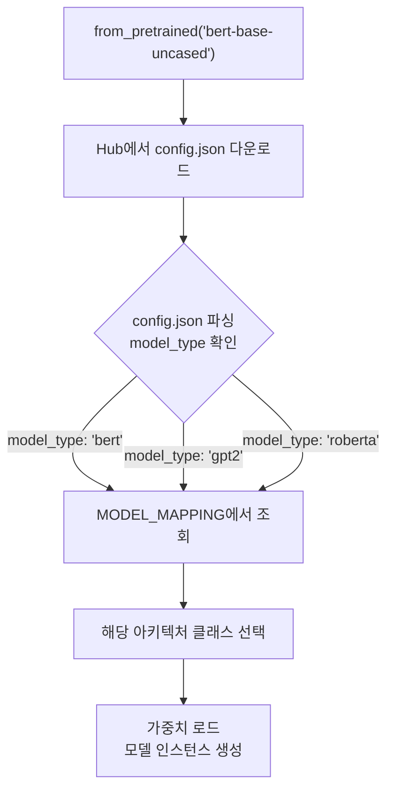
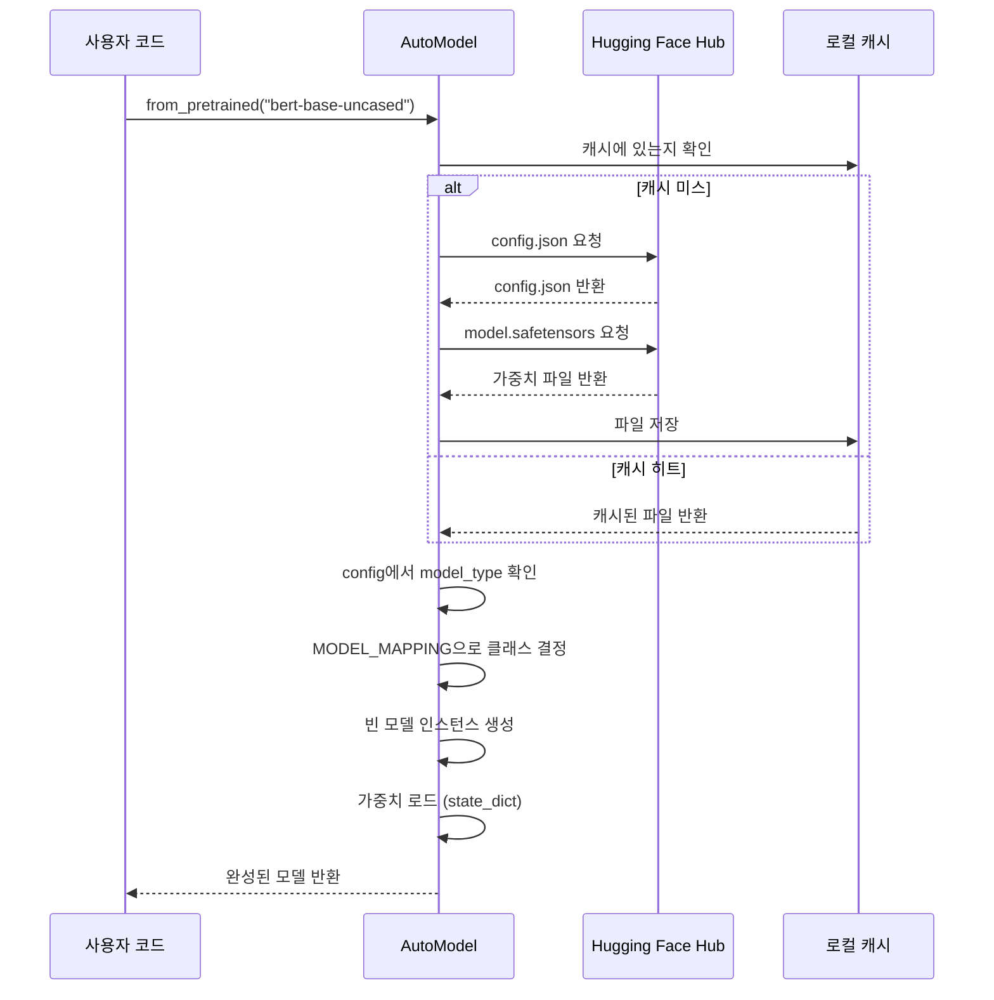
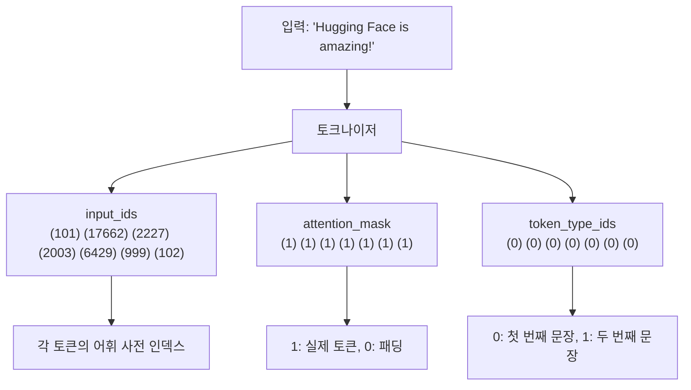

# AutoModel과 AutoTokenizer 심화

> Auto 클래스의 자동 모델 매핑 원리, `from_pretrained()` 내부 동작, 토크나이저 출력 구조를 완벽히 이해합니다

## 개요

이 섹션에서는 [앞서 소개한 Hugging Face 생태계](18-hugging-face-transformers-실습/01-01-hugging-face-생태계-소개.md)의 핵심인 Auto 클래스를 깊이 파헤칩니다. [Pipeline API](18-hugging-face-transformers-실습/02-02-pipeline-api로-빠른-추론.md)가 내부적으로 사용하는 `AutoModel`과 `AutoTokenizer`를 직접 다루면서, 모델과 토크나이저가 어떻게 자동으로 매핑되고 로딩되는지 그 메커니즘을 이해합니다.

**선수 지식**: [Hugging Face 생태계 소개](18-hugging-face-transformers-실습/01-01-hugging-face-생태계-소개.md)에서 배운 Auto 클래스 패턴, `from_pretrained` 개념, [Pipeline API](18-hugging-face-transformers-실습/02-02-pipeline-api로-빠른-추론.md)의 기본 사용법

**학습 목표**:
- `config.json`의 `model_type`이 Auto 클래스의 모델 매핑에 어떻게 사용되는지 이해한다
- `from_pretrained()`의 내부 동작 흐름을 단계별로 설명할 수 있다
- 토크나이저 출력(`input_ids`, `attention_mask`, `token_type_ids`)의 의미와 역할을 정확히 안다
- 수동 전처리 → 추론 → 후처리 파이프라인을 직접 구현할 수 있다

## 왜 알아야 할까?

[Pipeline API](18-hugging-face-transformers-실습/02-02-pipeline-api로-빠른-추론.md)는 2줄이면 추론이 끝나는 마법 같은 도구였죠. 하지만 실무에서는 이런 상황이 생깁니다:

- **커스텀 전처리**가 필요할 때 — 특수한 토큰을 추가하거나, 입력 형식을 바꿔야 할 때
- **모델 출력을 직접 가공**해야 할 때 — logits에서 원하는 방식으로 확률을 계산할 때
- **여러 모델을 비교 실험**할 때 — 동일한 입력으로 다른 아키텍처의 출력을 비교할 때
- **파인튜닝** 준비 — [Ch19](19-파인튜닝과-전이학습/01-01-파인튜닝의-원리와-전략.md)에서 다룰 파인튜닝은 이 저수준 API를 기반으로 합니다

Pipeline은 편의점 도시락이고, AutoModel + AutoTokenizer는 직접 요리하는 것입니다. 편의점 도시락으로 충분한 날도 있지만, 셰프가 되려면 칼 다루는 법을 알아야 하거든요.

## 핵심 개념

### 개념 1: Auto 클래스의 자동 매핑 메커니즘

> 💡 **비유**: Auto 클래스는 **만능 리모컨**과 같습니다. TV 브랜드(삼성, LG, 소니)를 알려주면 자동으로 해당 브랜드에 맞는 신호를 보내죠. `model_type`이 바로 그 "브랜드 코드"입니다.

Hugging Face Hub의 모든 모델에는 `config.json` 파일이 있습니다. 이 파일에 들어있는 `model_type` 필드가 Auto 클래스의 핵심 열쇠입니다.

> 📊 **그림 1**: Auto 클래스의 모델 매핑 흐름



`model_type`에 따라 어떤 구체적 클래스가 선택되는지 살펴보겠습니다:

| `model_type` | AutoModel이 선택하는 클래스 | AutoTokenizer가 선택하는 클래스 |
|---|---|---|
| `"bert"` | `BertModel` | `BertTokenizerFast` |
| `"gpt2"` | `GPT2Model` | `GPT2TokenizerFast` |
| `"roberta"` | `RobertaModel` | `RobertaTokenizerFast` |
| `"t5"` | `T5Model` | `T5TokenizerFast` |
| `"llama"` | `LlamaModel` | `LlamaTokenizerFast` |

```python
from transformers import AutoConfig

# config.json을 다운로드하고 model_type을 확인
config = AutoConfig.from_pretrained("google-bert/bert-base-uncased")
print(config.model_type)   # "bert"
print(type(config))         # <class 'transformers.models.bert.configuration_bert.BertConfig'>

# GPT-2의 경우
config_gpt2 = AutoConfig.from_pretrained("gpt2")
print(config_gpt2.model_type)  # "gpt2"
print(type(config_gpt2))        # <class 'transformers.models.gpt2.configuration_gpt2.GPT2Config'>
```

핵심은 이겁니다 — `AutoModel`은 "어떤 모델이든 같은 코드로 로드한다"는 **추상화 레이어**입니다. 내부적으로는 `MODEL_MAPPING`이라는 거대한 딕셔너리가 `model_type` → 클래스 매핑을 관리하고 있죠.

### 개념 2: 태스크별 AutoModelFor 클래스

> 💡 **비유**: `AutoModel`이 자동차의 **기본 프레임**이라면, `AutoModelForSequenceClassification`은 그 프레임 위에 **택시 미터기**를 달아둔 버전입니다. 같은 엔진(사전학습 가중치)이지만, 목적에 맞는 장치(분류 헤드)가 추가된 거죠.

`AutoModel`은 사전학습된 모델의 **기본 인코더(또는 디코더)**만 로드합니다. 하지만 실제 태스크를 수행하려면 태스크 전용 출력 레이어가 필요합니다.

> 📊 **그림 2**: AutoModel vs AutoModelForSequenceClassification 구조 비교


주요 태스크별 Auto 클래스는 다음과 같습니다:

| 클래스 | 태스크 | 출력 |
|--------|--------|------|
| `AutoModel` | 범용 (임베딩 추출) | hidden states |
| `AutoModelForSequenceClassification` | 텍스트 분류 | logits (클래스별) |
| `AutoModelForTokenClassification` | NER, POS 태깅 | 토큰별 logits |
| `AutoModelForQuestionAnswering` | 질의응답 | start/end logits |
| `AutoModelForCausalLM` | 텍스트 생성 | 다음 토큰 logits |
| `AutoModelForMaskedLM` | 빈칸 채우기 | 마스크 위치 logits |

```python
from transformers import AutoModel, AutoModelForSequenceClassification

# 기본 모델 — 분류 헤드 없음
base_model = AutoModel.from_pretrained("google-bert/bert-base-uncased")

# 분류용 모델 — Linear 분류 헤드 포함
clf_model = AutoModelForSequenceClassification.from_pretrained(
    "google-bert/bert-base-uncased",
    num_labels=3  # 3-클래스 분류
)

# 파라미터 수 비교
base_params = sum(p.numel() for p in base_model.parameters())
clf_params = sum(p.numel() for p in clf_model.parameters())
print(f"기본 모델: {base_params:,} 파라미터")
print(f"분류 모델: {clf_params:,} 파라미터")
print(f"분류 헤드: {clf_params - base_params:,} 파라미터 추가")
```

> ⚠️ **흔한 오해**: "AutoModel로 로드하면 감성 분석이 바로 되나요?" — 아닙니다! `AutoModel`은 hidden states만 출력합니다. 감성 분석을 하려면 `AutoModelForSequenceClassification`을 사용하고, 해당 태스크로 학습된 체크포인트를 로드해야 합니다.

### 개념 3: from_pretrained()의 내부 동작

> 💡 **비유**: `from_pretrained()`는 **이사 서비스**와 비슷합니다. 주소(모델 이름)를 주면, (1) 이사할 짐 목록 확인(config), (2) 짐 운반(가중치 다운로드), (3) 새 집에 배치(모델 인스턴스에 로드)까지 한 번에 해주는 거죠.

`from_pretrained("google-bert/bert-base-uncased")`를 호출하면 내부에서 무슨 일이 벌어질까요?

> 📊 **그림 3**: from_pretrained() 내부 동작 시퀀스



단계별로 정리하면:

1. **캐시 확인** — `~/.cache/huggingface/hub/`에 이미 다운로드된 파일이 있는지 확인
2. **config.json 로드** — 모델 아키텍처 정보(레이어 수, 히든 크기, 어텐션 헤드 수 등)
3. **model_type으로 클래스 결정** — `"bert"` → `BertModel` 매핑
4. **빈 모델 생성** — config 기반으로 올바른 크기의 빈 모델 인스턴스화
5. **가중치 로드** — `model.safetensors` (또는 `pytorch_model.bin`)에서 학습된 가중치를 로드
6. **eval 모드 설정** — 추론용으로 `model.eval()` 호출

```python
from transformers import AutoModel

# torch_dtype="auto"로 config.json에 정의된 최적 타입으로 로드
model = AutoModel.from_pretrained(
    "google-bert/bert-base-uncased",
    torch_dtype="auto"  # config의 torch_dtype 따름
)

# 모델 구조 확인
print(model.config.hidden_size)      # 768
print(model.config.num_hidden_layers) # 12
print(model.config.num_attention_heads) # 12
```

> 🔥 **실무 팁**: `torch_dtype="auto"`를 사용하면 `config.json`에 정의된 최적의 데이터 타입으로 가중치가 로드됩니다. 이를 지정하지 않으면 기본적으로 `torch.float32`로 로드되어 메모리를 불필요하게 많이 차지할 수 있습니다.

### 개념 4: 토크나이저 출력 구조 상세 분석

> 💡 **비유**: 토크나이저의 출력은 **시험 답안지**와 같습니다. `input_ids`는 답안 내용, `attention_mask`는 "여기까지 작성했다"는 표시, `token_type_ids`는 "이건 문제이고, 이건 답이다"라는 구분선입니다.

`AutoTokenizer`로 텍스트를 인코딩하면 `BatchEncoding` 객체가 반환됩니다. 이 객체에 담긴 세 가지 핵심 텐서를 하나씩 살펴보겠습니다.

```run:python
from transformers import AutoTokenizer

tokenizer = AutoTokenizer.from_pretrained("google-bert/bert-base-uncased")

# 단일 문장 토크나이징
text = "Hugging Face is amazing!"
encoded = tokenizer(text)

print("Keys:", list(encoded.keys()))
print("input_ids:", encoded["input_ids"])
print("token_type_ids:", encoded["token_type_ids"])
print("attention_mask:", encoded["attention_mask"])

# 토큰 확인
tokens = tokenizer.convert_ids_to_tokens(encoded["input_ids"])
print("tokens:", tokens)
```

```output
Keys: ['input_ids', 'token_type_ids', 'attention_mask']
input_ids: [101, 17662, 2227, 2003, 6429, 999, 102]
token_type_ids: [0, 0, 0, 0, 0, 0, 0]
attention_mask: [1, 1, 1, 1, 1, 1, 1]
tokens: ['[CLS]', 'hugging', 'face', 'is', 'amazing', '!', '[SEP]']
```

> 📊 **그림 4**: 토크나이저 출력의 세 가지 텐서 구조



각 텐서의 역할을 정리합니다:

**① input_ids** — 토큰의 어휘 사전(vocabulary) 인덱스입니다. `[CLS]`=101, `[SEP]`=102는 BERT의 특수 토큰이며, 나머지는 각 단어/서브워드의 고유 번호입니다.

**② attention_mask** — 모델이 "주목해야 할 토큰"을 표시합니다. 실제 토큰은 `1`, 패딩 토큰은 `0`입니다. 배치 처리에서 서로 다른 길이의 문장을 맞출 때 핵심 역할을 합니다.

**③ token_type_ids** — 문장 쌍 태스크(QA, NLI 등)에서 첫 번째 문장(`0`)과 두 번째 문장(`1`)을 구분합니다. 단일 문장이면 모두 `0`이죠.

패딩과 배치 처리에서 `attention_mask`가 왜 중요한지 보겠습니다:

```run:python
from transformers import AutoTokenizer

tokenizer = AutoTokenizer.from_pretrained("google-bert/bert-base-uncased")

# 길이가 다른 두 문장을 배치로 처리
texts = ["I love NLP!", "Transformers changed the world of natural language processing."]
encoded = tokenizer(texts, padding=True, return_tensors="pt")

print("input_ids shape:", encoded["input_ids"].shape)
print("\n문장 1 input_ids:", encoded["input_ids"][0].tolist())
print("문장 1 attention:", encoded["attention_mask"][0].tolist())
print("\n문장 2 input_ids:", encoded["input_ids"][1].tolist())
print("문장 2 attention:", encoded["attention_mask"][1].tolist())
```

```output
input_ids shape: torch.Size([2, 14])

문장 1 input_ids: [101, 1045, 2293, 17953, 2361, 999, 102, 0, 0, 0, 0, 0, 0, 0]
문장 1 attention: [1, 1, 1, 1, 1, 1, 1, 0, 0, 0, 0, 0, 0, 0]

문장 2 input_ids: [101, 19081, 2904, 1996, 2088, 1997, 3019, 2653, 6364, 1012, 102, 0, 0, 0]
문장 2 attention: [1, 1, 1, 1, 1, 1, 1, 1, 1, 1, 1, 0, 0, 0]
```

문장 1은 7개 토큰, 문장 2는 11개 토큰인데, 배치를 만들려면 같은 길이여야 합니다. 짧은 문장 뒤에 `0`(패딩)이 채워지고, `attention_mask`가 패딩 위치에 `0`을 넣어 모델이 패딩을 무시하게 합니다.

### 개념 5: 수동 전처리-추론-후처리 파이프라인

> 💡 **비유**: Pipeline API가 **자판기**라면, 지금 배우는 건 **카페 바리스타의 수동 추출**입니다. 원두 선택(토크나이징), 추출(모델 추론), 라떼아트(후처리)까지 모든 과정을 직접 통제할 수 있죠.

[Pipeline API](18-hugging-face-transformers-실습/02-02-pipeline-api로-빠른-추론.md)가 내부적으로 수행하는 과정을 단계별로 분해해 봅시다.

> 📊 **그림 5**: 수동 추론 파이프라인의 3단계


```python
import torch
from transformers import AutoTokenizer, AutoModelForSequenceClassification

# 1단계: 토크나이저와 모델 로드
model_name = "distilbert/distilbert-base-uncased-finetuned-sst-2-english"
tokenizer = AutoTokenizer.from_pretrained(model_name)
model = AutoModelForSequenceClassification.from_pretrained(model_name)
model.eval()  # 추론 모드

# 2단계: 전처리 — 텍스트를 텐서로 변환
text = "This movie was absolutely wonderful!"
inputs = tokenizer(text, return_tensors="pt")  # PyTorch 텐서로 변환
# inputs = {"input_ids": tensor(...), "attention_mask": tensor(...)}

# 3단계: 추론 — 모델에 통과
with torch.no_grad():  # 기울기 계산 비활성화 (추론 시 필수)
    outputs = model(**inputs)  # 딕셔너리를 키워드 인자로 언팩

# 4단계: 후처리 — logits에서 예측 추출
logits = outputs.logits  # shape: [1, 2] (배치 1, 클래스 2)
probabilities = torch.softmax(logits, dim=-1)
predicted_class = torch.argmax(probabilities, dim=-1).item()

# 라벨 매핑
label_map = model.config.id2label
print(f"예측: {label_map[predicted_class]}")
print(f"확률: {probabilities[0].tolist()}")
```

여기서 주목할 포인트 3가지:

1. **`return_tensors="pt"`** — 이걸 빼먹으면 Python 리스트가 반환되어 모델에 넣을 수 없습니다
2. **`torch.no_grad()`** — 추론 시에는 기울기를 계산할 필요가 없으므로, 메모리와 속도를 절약합니다
3. **`model(**inputs)`** — `**` 언팩으로 `input_ids=..., attention_mask=...`를 한 번에 전달합니다

## 실습: 직접 해보기

이제 BERT와 DistilBERT 두 모델로 감성 분석을 수동 수행하고, 출력을 비교해 보겠습니다.

```python
import torch
from transformers import AutoTokenizer, AutoModelForSequenceClassification

def manual_inference(model_name: str, texts: list[str]) -> list[dict]:
    """수동 전처리-추론-후처리 파이프라인"""
    # 토크나이저와 모델 로드
    tokenizer = AutoTokenizer.from_pretrained(model_name)
    model = AutoModelForSequenceClassification.from_pretrained(
        model_name, torch_dtype="auto"
    )
    model.eval()

    # 배치 전처리 — padding과 truncation 포함
    inputs = tokenizer(
        texts,
        padding=True,          # 짧은 문장에 패딩 추가
        truncation=True,       # 최대 길이 초과 시 잘라냄
        max_length=512,        # 최대 토큰 수
        return_tensors="pt"    # PyTorch 텐서 반환
    )

    # 추론
    with torch.no_grad():
        outputs = model(**inputs)

    # 후처리
    probabilities = torch.softmax(outputs.logits, dim=-1)
    predictions = torch.argmax(probabilities, dim=-1)

    results = []
    for i, text in enumerate(texts):
        label_id = predictions[i].item()
        results.append({
            "text": text[:50] + "..." if len(text) > 50 else text,
            "label": model.config.id2label[label_id],
            "confidence": probabilities[i][label_id].item(),
            "all_probs": {
                model.config.id2label[j]: round(p.item(), 4)
                for j, p in enumerate(probabilities[i])
            }
        })
    return results

# 테스트 텍스트
test_texts = [
    "This is the best movie I've ever seen!",
    "Terrible experience, waste of time.",
    "The food was okay, nothing special.",
]

# DistilBERT SST-2 모델로 감성 분석
model_name = "distilbert/distilbert-base-uncased-finetuned-sst-2-english"
results = manual_inference(model_name, test_texts)

for r in results:
    print(f"[{r['label']}] ({r['confidence']:.2%}) {r['text']}")
    print(f"  확률 분포: {r['all_probs']}")
    print()
```

다음으로, 토크나이저의 다양한 옵션을 직접 실험해 봅시다:

```python
from transformers import AutoTokenizer

tokenizer = AutoTokenizer.from_pretrained("google-bert/bert-base-uncased")

# 1. 문장 쌍 인코딩 — QA, NLI 태스크에 사용
question = "What is NLP?"
context = "NLP stands for Natural Language Processing."
pair_encoded = tokenizer(question, context, return_tensors="pt")

tokens = tokenizer.convert_ids_to_tokens(pair_encoded["input_ids"][0])
type_ids = pair_encoded["token_type_ids"][0].tolist()

print("=== 문장 쌍 인코딩 ===")
for token, tid in zip(tokens, type_ids):
    segment = "질문" if tid == 0 else "문맥"
    print(f"  {token:15s} → segment {tid} ({segment})")

# 2. truncation 전략 비교
long_text = "This is a very " * 100 + "long sentence."
trunc_result = tokenizer(
    long_text,
    max_length=20,
    truncation=True,
    return_tensors="pt"
)
print(f"\n=== Truncation ===")
print(f"원본 단어 수: ~{len(long_text.split())}")
print(f"토큰화 후: {trunc_result['input_ids'].shape[1]} 토큰 (max_length=20)")

# 3. 특수 토큰 없이 인코딩
no_special = tokenizer("Hello world", add_special_tokens=False)
with_special = tokenizer("Hello world", add_special_tokens=True)
print(f"\n=== 특수 토큰 ===")
print(f"특수 토큰 포함: {tokenizer.convert_ids_to_tokens(with_special['input_ids'])}")
print(f"특수 토큰 제외: {tokenizer.convert_ids_to_tokens(no_special['input_ids'])}")
```

## 더 깊이 알아보기

### Auto 클래스의 탄생 배경

Hugging Face Transformers 라이브러리 초기 버전(2019년경)에는 Auto 클래스가 없었습니다. BERT를 쓰려면 `BertModel`, `BertTokenizer`를, GPT-2를 쓰려면 `GPT2LMHeadModel`, `GPT2Tokenizer`를 직접 import 해야 했죠. 모델이 10개일 때는 괜찮았지만, 점점 새로운 아키텍처가 폭발적으로 늘어나면서 문제가 생겼습니다.

Thomas Wolf(Hugging Face의 공동 창업자이자 CSO)가 이끈 팀은 2019년 말 v2.0에서 Auto 클래스를 도입했습니다. 영감은 프로그래밍의 **팩토리 패턴(Factory Pattern)**에서 왔는데, 클라이언트 코드가 구체적인 클래스를 알 필요 없이 "모델 이름"만 주면 적절한 인스턴스가 생성되는 구조입니다. 이 추상화 덕분에 사용자는 새로운 모델이 나와도 코드를 한 글자도 바꿀 필요가 없게 되었죠.

현재(2025년 기준) Transformers 라이브러리는 **500개 이상의 model_type**을 지원하며, Auto 클래스 없이는 이 규모를 관리하는 것이 사실상 불가능합니다.

### safetensors의 등장

가중치 파일 포맷도 진화했습니다. 초기에는 PyTorch의 `pickle` 기반 `pytorch_model.bin`을 사용했는데, `pickle`은 임의의 Python 코드를 실행할 수 있어 보안 위험이 있었습니다. 2023년부터 Hugging Face는 `safetensors` 포맷을 표준으로 채택했습니다. 이 포맷은 순수 텐서 데이터만 저장하여 보안 문제를 원천 차단하고, 로딩 속도도 크게 향상시켰습니다. `from_pretrained()`는 `safetensors` 파일을 우선적으로 찾고, 없으면 `pytorch_model.bin`을 폴백으로 사용합니다.

## 흔한 오해와 팁

> ⚠️ **흔한 오해**: "`AutoModel`과 `AutoModelForSequenceClassification`은 같은 것 아닌가요?" — 전혀 다릅니다! `AutoModel`은 기본 인코더만 로드하고 (hidden states 출력), `AutoModelForSequenceClassification`은 그 위에 분류 헤드(Linear 레이어)를 추가합니다. 태스크에 맞는 `AutoModelFor*` 클래스를 선택해야 합니다.

> 💡 **알고 계셨나요?**: `from_pretrained()`에 모델 이름 대신 **로컬 디렉토리 경로**를 넣을 수도 있습니다. 오프라인 환경에서 모델을 사용할 때 유용하죠. `model.save_pretrained("./my_model")`로 저장하고 `AutoModel.from_pretrained("./my_model")`로 로드하면 됩니다.

> 🔥 **실무 팁**: 토크나이저 호출 시 `return_tensors="pt"`를 빼먹는 실수가 매우 잦습니다. 이걸 빼먹으면 Python 리스트가 반환되어 `model(**inputs)` 호출 시 에러가 납니다. 또한, `padding=True`와 `truncation=True`는 배치 처리 시 거의 항상 함께 사용하는 "세트 메뉴"입니다.

> 🔥 **실무 팁**: 추론 시 `torch.no_grad()` 컨텍스트 매니저를 반드시 사용하세요. 이걸 빠뜨리면 역전파용 계산 그래프가 메모리에 쌓여서, 큰 모델에서는 CUDA OOM(메모리 부족) 에러의 원인이 됩니다.

## 핵심 정리

| 개념 | 설명 |
|------|------|
| `model_type` | `config.json`에 담긴 아키텍처 식별자. Auto 클래스가 올바른 구체 클래스를 찾는 열쇠 |
| `AutoModel` | 기본 트랜스포머 인코더/디코더만 로드 (hidden states 출력) |
| `AutoModelFor*` | 태스크별 출력 헤드가 추가된 모델 (Classification, CausalLM 등) |
| `from_pretrained()` | config 로드 → 클래스 결정 → 빈 모델 생성 → 가중치 로드의 4단계 |
| `input_ids` | 토큰의 어휘 사전 인덱스. 모델이 이해하는 숫자 표현 |
| `attention_mask` | 실제 토큰(`1`)과 패딩(`0`)을 구분. 패딩을 무시하게 함 |
| `token_type_ids` | 문장 쌍에서 첫 번째(`0`)와 두 번째(`1`) 문장을 구분 |
| `return_tensors="pt"` | 출력을 PyTorch 텐서로 변환. 모델 입력에 필수 |
| `torch_dtype="auto"` | config.json의 최적 데이터 타입으로 로드. 메모리 절약 |

## 다음 섹션 미리보기

다음 [04. Datasets 라이브러리 활용](18-hugging-face-transformers-실습/04-04-datasets-라이브러리-활용.md)에서는 Hugging Face의 `datasets` 라이브러리를 배웁니다. 지금까지 모델과 토크나이저를 다루는 법을 익혔으니, 이제 **데이터**를 효율적으로 로드하고 전처리하는 방법을 살펴봅니다. Arrow 기반의 메모리 효율적 처리, `map()` 함수를 활용한 배치 전처리, 그리고 이번 섹션에서 배운 토크나이저를 데이터셋 전체에 적용하는 패턴까지 다룹니다.

## 참고 자료

- [Auto Classes — Hugging Face Transformers Documentation](https://huggingface.co/docs/transformers/model_doc/auto) - AutoModel, AutoTokenizer 등 모든 Auto 클래스의 공식 API 레퍼런스
- [Load pretrained instances with an AutoClass](https://huggingface.co/docs/transformers/main/en/autoclass_tutorial) - Auto 클래스 사용법을 단계별로 설명하는 공식 튜토리얼
- [Tokenizer — Hugging Face Transformers Documentation](https://huggingface.co/docs/transformers/main_classes/tokenizer) - 토크나이저의 모든 메서드와 파라미터를 정리한 공식 API 문서
- [Configuration — Hugging Face Transformers Documentation](https://huggingface.co/docs/transformers/en/main_classes/configuration) - config.json과 AutoConfig의 동작 원리를 설명하는 공식 문서
- [Quickstart — Hugging Face Transformers](https://huggingface.co/docs/transformers/en/quicktour) - 전체 라이브러리의 빠른 시작 가이드, Auto 클래스 활용 예제 포함

---
### 🔗 Related Sessions
- [auto 클래스 패턴](18-hugging-face-transformers-실습/01-01-hugging-face-생태계-소개.md) (prerequisite)
- [from_pretrained](18-hugging-face-transformers-실습/01-01-hugging-face-생태계-소개.md) (prerequisite)
- [transformer 아키텍처](13-트랜스포머-아키텍처-심층-분석/01-01-트랜스포머-아키텍처-전체-조망.md) (prerequisite)
- [로컬 캐시 시스템](18-hugging-face-transformers-실습/01-01-hugging-face-생태계-소개.md) (prerequisite)
- [pipeline 함수](18-hugging-face-transformers-실습/02-02-pipeline-api로-빠른-추론.md) (prerequisite)
- [태스크 식별자](18-hugging-face-transformers-실습/02-02-pipeline-api로-빠른-추론.md) (prerequisite)
