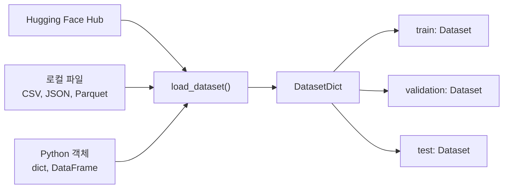
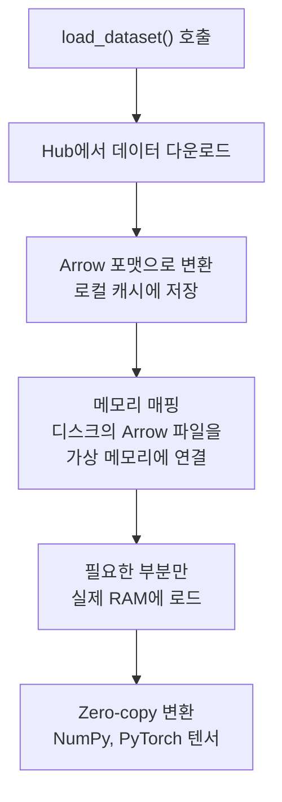
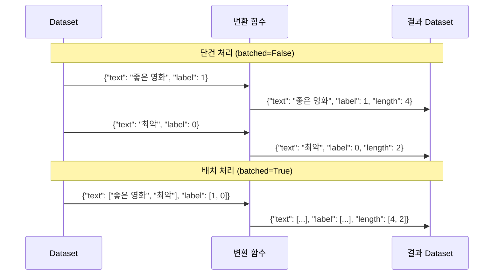
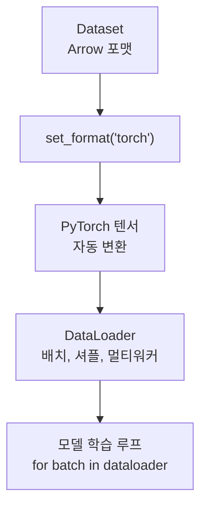

# Datasets 라이브러리 활용

> Hugging Face Datasets로 대규모 데이터를 효율적으로 로드하고, 전처리하고, 학습 파이프라인에 연결하는 방법을 배웁니다.

## 개요

이 섹션에서는 Hugging Face `datasets` 라이브러리의 핵심 기능을 학습합니다. 데이터를 로드하고, 변환하고, 필터링하여 모델 학습에 바로 사용할 수 있는 파이프라인을 구축하는 전 과정을 다룹니다.

**선수 지식**: [AutoModel과 AutoTokenizer 심화](18-hugging-face-transformers-실습/03-03-automodel과-autotokenizer-심화.md)에서 배운 토크나이저 출력 구조(`input_ids`, `attention_mask`)와 `from_pretrained()` 패턴
**학습 목표**:
- `load_dataset()`으로 Hub/로컬/인메모리 데이터를 로드할 수 있다
- `map()`으로 데이터셋 전체에 전처리 함수를 효율적으로 적용할 수 있다
- `filter()`, `shuffle()`, `select()`로 데이터를 조작할 수 있다
- 토크나이저와 연동한 완전한 데이터 파이프라인을 구축할 수 있다

## 왜 알아야 할까?

딥러닝 프로젝트에서 **모델 코드보다 데이터 전처리에 더 많은 시간을 쓴다**는 건 업계의 공공연한 비밀이죠. CSV 파일을 열고, 결측치를 처리하고, 토큰화하고, 텐서로 변환하고... 이 과정을 매번 직접 작성하면 코드가 금세 스파게티가 됩니다.

Hugging Face `datasets` 라이브러리는 이 문제를 근본적으로 해결합니다. Hub에 올라온 수십만 개의 데이터셋을 **한 줄로 로드**하고, Apache Arrow 기반의 메모리 매핑으로 **RAM보다 큰 데이터셋도 노트북에서 다룰 수 있으며**, `map()` 한 번으로 전체 데이터셋에 토크나이저를 적용할 수 있거든요.

[Pipeline API](18-hugging-face-transformers-실습/02-02-pipeline-api로-빠른-추론.md)가 "추론의 편의성"을 제공했다면, Datasets 라이브러리는 **"학습 데이터 준비의 편의성"**을 제공하는 핵심 도구입니다.

## 핵심 개념

### 개념 1: load_dataset() — 데이터 로딩의 만능 열쇠

> 💡 **비유**: `load_dataset()`은 도서관의 **자동 대출 시스템**과 같습니다. "이 책 주세요"라고 제목만 말하면, 사서가 서가에서 찾아오고, 바코드를 찍고, 대출 카드에 기록까지 자동으로 해주죠. 여러분은 책 이름만 알면 됩니다.

`load_dataset()`은 데이터 소스가 어디든 — Hub, 로컬 파일, 심지어 Python 딕셔너리까지 — 동일한 인터페이스로 데이터를 로드합니다.

> 📊 **그림 1**: load_dataset()의 다양한 데이터 소스와 통합 출력



**Hub에서 로드하기** — 가장 기본적인 사용법입니다:

```python
from datasets import load_dataset

# IMDB 영화 리뷰 데이터셋 로드
dataset = load_dataset("imdb")
print(type(dataset))
print(dataset)
```

```output
<class 'datasets.dataset_dict.DatasetDict'>
DatasetDict({
    train: Dataset({
        features: ['text', 'label'],
        num_rows: 25000
    })
    test: Dataset({
        features: ['text', 'label'],
        num_rows: 25000
    })
})
```

반환값은 `DatasetDict`인데요, 이건 split 이름(`train`, `test`)을 키로, `Dataset` 객체를 값으로 가지는 딕셔너리입니다. 특정 split만 로드하려면 `split` 파라미터를 사용합니다:

```python
# train split만 로드
train_data = load_dataset("imdb", split="train")

# 처음 1000개만 로드 (슬라이싱)
small_train = load_dataset("imdb", split="train[:1000]")

# 퍼센트 슬라이싱 — 앞쪽 10%만
subset = load_dataset("imdb", split="train[:10%]")
```

**로컬 파일에서 로드하기** — CSV, JSON, Parquet 등 다양한 포맷을 지원합니다:

```python
# CSV 파일
dataset = load_dataset("csv", data_files="reviews.csv")

# JSON Lines 파일
dataset = load_dataset("json", data_files="data.jsonl")

# 여러 파일을 split으로 매핑
data_files = {"train": "train.csv", "test": "test.csv"}
dataset = load_dataset("csv", data_files=data_files)
```

**인메모리 데이터에서 생성하기** — 프로토타이핑에 매우 유용합니다:

```python
from datasets import Dataset

# Python 딕셔너리에서 생성
my_data = {
    "text": ["좋은 영화입니다", "최악이에요", "그럭저럭"],
    "label": [1, 0, 0]
}
dataset = Dataset.from_dict(my_data)

# Pandas DataFrame에서 생성
import pandas as pd
df = pd.DataFrame(my_data)
dataset = Dataset.from_pandas(df)
```

> ⚠️ **흔한 오해**: `load_dataset()`이 데이터를 전부 RAM에 올린다고 생각하기 쉽지만, 실제로는 **Apache Arrow 메모리 매핑**을 사용합니다. 18GB짜리 Wikipedia 데이터셋을 로드해도 RAM 사용량은 약 50MB에 불과합니다!

### 개념 2: Apache Arrow — 대용량 데이터의 비밀 무기

> 💡 **비유**: 전통적인 데이터 저장 방식이 **종이 사전**(한 페이지씩 넘겨야 함)이라면, Arrow는 **디지털 색인**(원하는 단어로 바로 점프)과 같습니다. 데이터를 열(column) 단위로 저장해서, 특정 필드만 빠르게 조회할 수 있죠.

> 📊 **그림 2**: Arrow 메모리 매핑의 동작 원리



`datasets` 라이브러리가 Arrow를 채택한 핵심 이유는 세 가지입니다:

| 특성 | 설명 | 실용적 의미 |
|------|------|------------|
| **Zero-copy reads** | 직렬화 오버헤드 없이 데이터 읽기 | 대용량 데이터도 즉시 접근 |
| **메모리 매핑** | 디스크 캐시를 가상 메모리로 연결 | RAM보다 큰 데이터셋 사용 가능 |
| **열 기반 저장** | 필요한 컬럼만 빠르게 조회 | 특정 필드 접근이 매우 빠름 |

```python
from datasets import load_dataset

# 데이터셋의 내부 구조 확인
dataset = load_dataset("imdb", split="train")
print(f"Features: {dataset.features}")
print(f"컬럼 목록: {dataset.column_names}")
print(f"데이터셋 크기: {dataset.dataset_size / (1024**2):.1f} MB (디스크)")
print(f"행 수: {dataset.num_rows}")
```

```output
Features: {'text': Value(dtype='string', id=None), 'label': ClassLabel(names=['neg', 'pos'], id=None)}
컬럼 목록: ['text', 'label']
데이터셋 크기: 127.3 MB (디스크)
행 수: 25000
```

`features`를 보면, `text`는 단순 문자열이고 `label`은 `ClassLabel` 타입인데요. `ClassLabel`은 정수 레이블과 문자열 이름 간의 매핑을 자동으로 관리해줍니다. `dataset.features["label"].names`로 `['neg', 'pos']`를 확인할 수 있고, `dataset.features["label"].int2str(1)`로 `'pos'`를 얻을 수 있죠.

캐시 덕분에 같은 데이터셋을 두 번째 로드하면 **거의 즉시** 로드됩니다. 캐시 경로는 기본적으로 `~/.cache/huggingface/datasets/`에 저장되죠.

### 개념 3: map() — 데이터 변환의 핵심 엔진

> 💡 **비유**: `map()`은 공장의 **컨베이어 벨트**입니다. 원재료(원본 데이터)가 벨트 위로 올라가면, 각 작업 단계(변환 함수)를 자동으로 거쳐서 완제품(전처리된 데이터)이 나옵니다. 작업자가 하나하나 옮길 필요 없이, 벨트가 알아서 모든 아이템을 처리하죠.

`map()`은 데이터셋의 모든 행(또는 배치)에 함수를 적용하는 메서드입니다. 토크나이저 적용, 피처 추가, 데이터 변환 등 거의 모든 전처리를 `map()`으로 수행합니다.

> 📊 **그림 3**: map() 함수의 단건 처리 vs 배치 처리 비교



**단건 처리** — 각 행을 하나씩 처리합니다:

```python
# 텍스트 길이 필드 추가
def add_length(example):
    example["length"] = len(example["text"])
    return example

dataset = dataset.map(add_length)
```

**배치 처리** — 여러 행을 한꺼번에 처리합니다. **토크나이저 적용 시 필수**입니다:

```python
from transformers import AutoTokenizer

tokenizer = AutoTokenizer.from_pretrained("bert-base-uncased")

def tokenize_function(examples):
    # examples["text"]는 리스트 — 배치 단위 처리
    return tokenizer(
        examples["text"],
        padding="max_length",
        truncation=True,
        max_length=256
    )

# batched=True로 배치 처리 — 훨씬 빠름!
tokenized = dataset.map(tokenize_function, batched=True)
```

왜 `batched=True`가 중요할까요? 토크나이저의 Rust 백엔드는 배치 입력을 한 번에 처리할 수 있어서, 개별 처리보다 **수십 배 빠릅니다**. 또한 `num_proc`으로 멀티프로세싱도 가능합니다:

```python
# 4개 프로세스로 병렬 토큰화
tokenized = dataset.map(
    tokenize_function,
    batched=True,
    batch_size=1000,
    num_proc=4
)
```

**불필요한 컬럼 제거** — `remove_columns`로 원본 텍스트 등 학습에 불필요한 컬럼을 제거합니다:

```python
tokenized = dataset.map(
    tokenize_function,
    batched=True,
    remove_columns=["text"]  # 원본 텍스트 제거
)
```

> 🔥 **실무 팁**: `map()`의 결과는 자동으로 Arrow 캐시에 저장됩니다. 같은 함수로 같은 데이터셋을 다시 `map()`하면 캐시된 결과를 즉시 반환해요. 다만 함수 내용이 바뀌면 `load_from_cache_file=False`를 명시해야 재실행됩니다.

### 개념 4: filter(), sort(), shuffle() — 데이터 조작 3총사

> 💡 **비유**: 데이터 조작은 **카드 덱 관리**와 같습니다. `filter()`는 특정 조건의 카드만 골라내기, `shuffle()`은 카드 섞기, `sort()`는 카드 정렬하기에 해당하죠.

> 📊 **그림 4**: 데이터 조작 메서드의 체이닝 흐름


```python
from datasets import load_dataset

dataset = load_dataset("imdb", split="train")

# filter(): 조건에 맞는 행만 남기기
long_reviews = dataset.filter(lambda x: len(x["text"]) > 1000)
print(f"긴 리뷰 수: {len(long_reviews)} / {len(dataset)}")

# 긍정 리뷰만 필터링
positive = dataset.filter(lambda x: x["label"] == 1)
print(f"긍정 리뷰 수: {len(positive)}")

# shuffle(): 순서 무작위화 (seed로 재현 가능)
shuffled = dataset.shuffle(seed=42)
print(f"셔플 후 첫 3개 라벨: {shuffled[:3]['label']}")

# select(): 특정 인덱스의 행 선택
subset = dataset.select(range(100))
print(f"선택된 행 수: {len(subset)}")
```

```output
긴 리뷰 수: 18470 / 25000
긍정 리뷰 수: 12500
셔플 후 첫 3개 라벨: [1, 1, 0]
선택된 행 수: 100
```

`sort()`로 정렬하거나, `train_test_split()`으로 직접 분할할 수도 있습니다:

```python
# train_test_split(): 데이터셋을 학습/검증으로 분할
split_dataset = dataset.train_test_split(test_size=0.2, seed=42)
# split_dataset["train"], split_dataset["test"]로 접근

# sort(): 특정 컬럼 기준 정렬
sorted_data = dataset.sort("label")
```

### 개념 5: 포맷 설정과 PyTorch DataLoader 연동

> 💡 **비유**: `set_format()`은 **USB 어댑터**와 같습니다. 같은 데이터(전원)를 PyTorch(USB-C), TensorFlow(Lightning), NumPy(USB-A) 등 각 프레임워크가 원하는 형태로 변환해주죠.

> 📊 **그림 5**: Datasets에서 PyTorch DataLoader까지의 데이터 흐름



```python
from torch.utils.data import DataLoader

# PyTorch 텐서 포맷으로 설정
tokenized.set_format(
    type="torch",
    columns=["input_ids", "attention_mask", "label"]
)

# DataLoader 생성
dataloader = DataLoader(
    tokenized,
    batch_size=16,
    shuffle=True
)

# 학습 루프에서 바로 사용
for batch in dataloader:
    input_ids = batch["input_ids"]       # torch.Tensor
    attention_mask = batch["attention_mask"]  # torch.Tensor
    labels = batch["label"]              # torch.Tensor
    # model(input_ids, attention_mask=attention_mask, labels=labels)
    break  # 예시이므로 1배치만
```

`set_format()`은 **lazy 변환**입니다. Arrow 데이터 자체를 바꾸는 게 아니라, 접근할 때마다 지정된 포맷으로 변환해줍니다. 원본 데이터는 그대로 보존되므로, `reset_format()`으로 언제든 원래대로 돌릴 수 있습니다.

## 실습: 직접 해보기

IMDB 데이터셋을 로드하고, BERT 토크나이저로 전처리한 뒤, PyTorch DataLoader까지 연결하는 **완전한 파이프라인**을 구축해봅시다.

```python
from datasets import load_dataset
from transformers import AutoTokenizer
from torch.utils.data import DataLoader

# ── 1단계: 데이터 로드 ──
dataset = load_dataset("imdb")
print(f"Train: {len(dataset['train'])}, Test: {len(dataset['test'])}")

# ── 2단계: train에서 validation 분리 ──
train_val = dataset["train"].train_test_split(test_size=0.1, seed=42)
train_data = train_val["train"]       # 22,500개
val_data = train_val["test"]          # 2,500개
test_data = dataset["test"]           # 25,000개

# ── 3단계: 토크나이저 로드 ──
tokenizer = AutoTokenizer.from_pretrained("bert-base-uncased")

# ── 4단계: 토큰화 함수 정의 ──
def tokenize_and_encode(examples):
    """배치 단위로 텍스트를 토큰화합니다."""
    encoding = tokenizer(
        examples["text"],
        padding="max_length",    # 고정 길이 패딩
        truncation=True,         # 최대 길이 초과 시 잘라내기
        max_length=256,          # IMDB는 256이면 대부분 커버
        return_tensors=None      # map()에서는 None (리스트 반환)
    )
    return encoding

# ── 5단계: 전체 데이터셋에 토큰화 적용 ──
train_encoded = train_data.map(
    tokenize_and_encode,
    batched=True,              # 배치 처리로 속도 향상
    batch_size=1000,           # 한 번에 1000개씩
    remove_columns=["text"],   # 원본 텍스트 제거 (메모리 절약)
    desc="토큰화 중"           # 진행률 표시
)
val_encoded = val_data.map(
    tokenize_and_encode, batched=True, remove_columns=["text"]
)
test_encoded = test_data.map(
    tokenize_and_encode, batched=True, remove_columns=["text"]
)

# ── 6단계: PyTorch 포맷 설정 ──
columns_to_return = ["input_ids", "attention_mask", "label"]
train_encoded.set_format(type="torch", columns=columns_to_return)
val_encoded.set_format(type="torch", columns=columns_to_return)
test_encoded.set_format(type="torch", columns=columns_to_return)

# ── 7단계: DataLoader 생성 ──
train_loader = DataLoader(train_encoded, batch_size=16, shuffle=True)
val_loader = DataLoader(val_encoded, batch_size=32)
test_loader = DataLoader(test_encoded, batch_size=32)

# ── 검증: 첫 배치 확인 ──
batch = next(iter(train_loader))
print(f"\n=== 첫 배치 확인 ===")
print(f"input_ids shape: {batch['input_ids'].shape}")
print(f"attention_mask shape: {batch['attention_mask'].shape}")
print(f"labels: {batch['label']}")
print(f"\n파이프라인 완성! Train: {len(train_loader)} batches, "
      f"Val: {len(val_loader)} batches, Test: {len(test_loader)} batches")
```

```output
Train: 25000, Test: 25000

=== 첫 배치 확인 ===
input_ids shape: torch.Size([16, 256])
attention_mask shape: torch.Size([16, 256])
labels: tensor([1, 0, 1, 1, 0, 0, 1, 0, 1, 1, 0, 0, 1, 0, 1, 0])

파이프라인 완성! Train: 1407 batches, Val: 79 batches, Test: 782 batches
```

이 7단계 파이프라인이 Hugging Face Datasets를 활용한 표준적인 데이터 준비 워크플로우입니다. `input_ids`와 `attention_mask`가 `[배치크기, 시퀀스길이]` 형태의 PyTorch 텐서로 정확히 나오는 것을 확인할 수 있죠. 다음 챕터 [Trainer API로 텍스트 분류 파인튜닝](19-파인튜닝과-전이학습/02-02-trainer-api로-텍스트-분류-파인튜닝.md)에서는 이 파이프라인을 Trainer API와 결합하여 실제 모델을 학습시킵니다.

## 더 깊이 알아보기

### datasets 라이브러리의 탄생 — nlp에서 datasets로

`datasets` 라이브러리는 처음에는 **`nlp`**라는 이름으로 시작했습니다. 2020년 Hugging Face의 Quentin Lhoest를 중심으로 개발되었는데, 당시 NLP 연구자들이 데이터셋마다 제각각인 로딩 코드를 작성해야 하는 고통을 해결하려는 목적이었죠.

초기 버전은 TensorFlow Datasets(TFDS)에서 영감을 받았지만, 핵심적인 차별점이 있었습니다. 바로 **Apache Arrow 백엔드**의 채택이었죠. Arrow의 메모리 매핑 덕분에 RAM이 8GB인 노트북에서도 수백 GB 데이터셋을 다룰 수 있게 되었습니다.

2020년 말, 라이브러리 이름이 `nlp`에서 `datasets`로 변경되었는데, 이는 NLP를 넘어 컴퓨터 비전, 오디오 등 **멀티모달 데이터**까지 지원 범위를 확장하겠다는 의지의 표현이었습니다. 2021년에는 "Datasets: A Community Library for Natural Language Processing"이라는 제목으로 논문이 발표되었고, 현재 Hub에는 수십만 개의 데이터셋이 커뮤니티에 의해 공유되고 있습니다.

### 왜 Arrow인가? — 데이터 포맷 전쟁의 승자

Apache Arrow 프로젝트는 2016년 Wes McKinney(Pandas 창시자)가 주도하여 시작했습니다. McKinney는 Pandas 개발 과정에서 "모든 시스템이 서로 다른 메모리 포맷을 써서, 데이터를 전달할 때마다 직렬화/역직렬화 비용이 발생한다"는 문제를 절감했죠. Arrow는 이 문제를 **표준 열 기반 메모리 포맷**으로 해결했고, datasets 라이브러리는 이 위에 구축된 가장 성공적인 ML 데이터 도구 중 하나가 되었습니다.

## 흔한 오해와 팁

> ⚠️ **흔한 오해**: "`map()`에서 `return_tensors='pt'`를 쓰면 되겠지?" — 아닙니다! `map()` 안에서는 `return_tensors=None`(기본값)을 사용해야 합니다. Arrow 테이블은 Python 리스트를 저장하며, 텐서 변환은 `set_format("torch")`에서 처리됩니다. `map()` 안에서 텐서를 반환하면 직렬화 오류가 발생합니다.

> 💡 **알고 계셨나요?**: `map()`의 결과는 자동으로 **핑거프린트 기반 캐싱**됩니다. 함수의 소스 코드, 입력 데이터, 파라미터를 해싱하여 동일한 변환이 감지되면 캐시에서 즉시 로드합니다. 같은 노트북 셀을 반복 실행해도 토큰화가 재실행되지 않는 이유가 바로 이것입니다.

> 🔥 **실무 팁**: 대규모 데이터셋에서는 `map()` 전에 `select(range(100))`으로 소규모 서브셋을 만들어 전처리 함수를 테스트하세요. 25만 행에 버그 있는 함수를 적용하면 시간을 크게 낭비합니다. 또한 `num_proc=4` 같은 멀티프로세싱 옵션은 대용량 데이터에서 큰 속도 향상을 줍니다.

## 핵심 정리

| 개념 | 설명 |
|------|------|
| `load_dataset()` | Hub, 로컬 파일, 인메모리 데이터를 통합 인터페이스로 로드 |
| `DatasetDict` | split별 Dataset을 담는 딕셔너리 (train, test 등) |
| Apache Arrow | 메모리 매핑 + zero-copy로 대용량 데이터를 효율적으로 처리 |
| `map(batched=True)` | 배치 단위 데이터 변환 — 토크나이저 적용의 핵심 |
| `remove_columns` | map() 시 불필요한 컬럼 제거하여 메모리 절약 |
| `filter()` | 조건 함수로 행 필터링 |
| `shuffle(seed=N)` | 재현 가능한 무작위 셔플 |
| `set_format("torch")` | Arrow 데이터를 PyTorch 텐서로 lazy 변환 |
| `ClassLabel` | 정수-문자열 레이블 매핑 자동 관리 |
| 캐싱 | map() 결과를 자동 캐싱하여 재실행 시 즉시 로드 |

## 다음 섹션 미리보기

다음 섹션 [모델 비교와 벤치마크](18-hugging-face-transformers-실습/05-05-모델-비교와-벤치마크.md)에서는 이번에 구축한 데이터 파이프라인을 활용하여 여러 사전학습 모델의 성능을 체계적으로 비교하는 방법을 배웁니다. 같은 데이터셋에 대해 BERT, DistilBERT, RoBERTa 등 다양한 모델을 돌려보고, 정확도·속도·메모리 사용량을 벤치마크하는 실전 기법을 다룹니다.

## 참고 자료

- [Hugging Face Datasets 공식 문서 — Loading](https://huggingface.co/docs/datasets/en/loading) - `load_dataset()`의 모든 옵션과 데이터 소스별 사용법을 상세히 다룹니다
- [Datasets 🤝 Arrow](https://huggingface.co/docs/datasets/about_arrow) - Apache Arrow 백엔드의 동작 원리와 메모리 매핑 성능을 설명합니다
- [Hugging Face Datasets GitHub](https://github.com/huggingface/datasets) - 라이브러리 소스 코드, 이슈, 최신 변경사항을 확인할 수 있습니다
- [Datasets: A Community Library for NLP (논문)](https://arxiv.org/abs/2109.02846) - datasets 라이브러리의 설계 철학과 아키텍처를 학술적으로 다룬 2021년 논문입니다

---
### 🔗 Related Sessions
- [auto 클래스 패턴](18-hugging-face-transformers-실습/01-01-hugging-face-생태계-소개.md) (prerequisite)
- [from_pretrained](18-hugging-face-transformers-실습/01-01-hugging-face-생태계-소개.md) (prerequisite)
