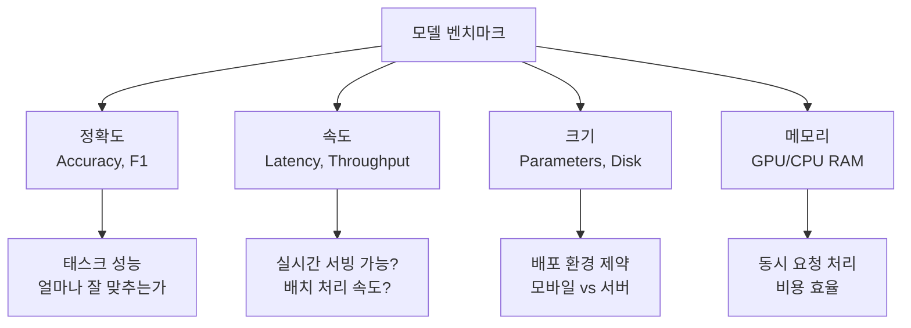
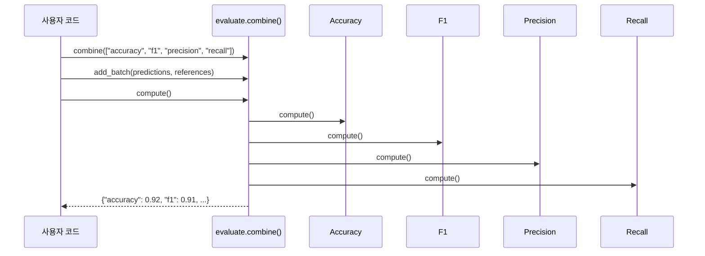
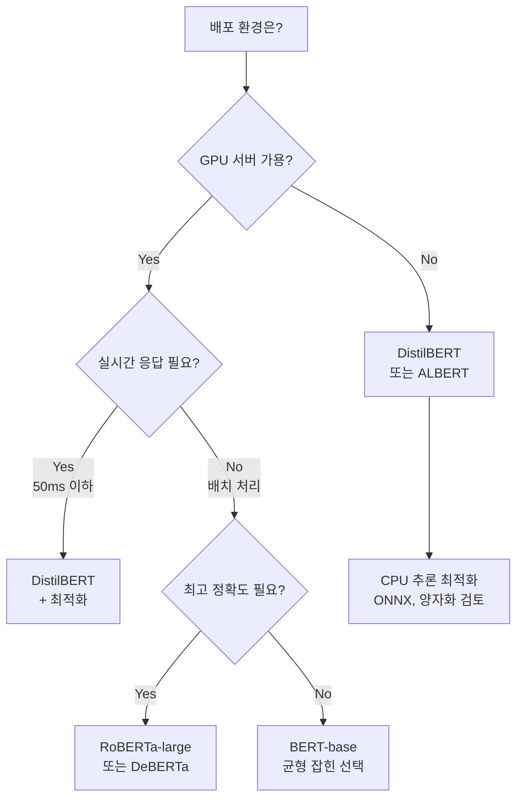

# 모델 비교와 벤치마크

> 동일한 태스크에 여러 사전학습 모델을 적용하고, 정확도·속도·크기를 체계적으로 비교하여 실무 모델 선택 기준을 세웁니다.

## 개요

이 섹션에서는 BERT, DistilBERT, RoBERTa 등 다양한 사전학습 모델을 동일한 감성 분석 태스크에 적용하고, 정확도뿐 아니라 추론 속도, 모델 크기, 메모리 사용량까지 종합적으로 비교하는 방법을 학습합니다.

**선수 지식**: [Datasets 라이브러리 활용](18-hugging-face-transformers-실습/04-04-datasets-라이브러리-활용.md)에서 배운 데이터 파이프라인 구축, [AutoModel과 AutoTokenizer 심화](18-hugging-face-transformers-실습/03-03-automodel과-autotokenizer-심화.md)에서 배운 수동 추론 파이프라인

**학습 목표**:
- `evaluate` 라이브러리로 정확도, F1, 정밀도, 재현율을 한 번에 측정할 수 있다
- 동일 태스크에서 BERT, DistilBERT, RoBERTa의 성능·속도·크기 트레이드오프를 이해한다
- `time.perf_counter()`와 `torch.inference_mode()`를 활용한 추론 벤치마크를 수행할 수 있다
- 실무에서 모델을 선택할 때 고려해야 할 기준을 설명할 수 있다

## 왜 알아야 할까?

Hugging Face Hub에는 100만 개가 넘는 모델이 올라와 있습니다. 감성 분석 하나만 검색해도 수백 개의 모델이 쏟아지죠. "가장 좋은 모델"이 뭔지 어떻게 알 수 있을까요?

정답은 **"가장 좋은 모델은 없다"**입니다. 정확도가 최고인 모델은 느리고, 빠른 모델은 정확도가 낮을 수 있거든요. 모바일 앱에 올릴 모델과 GPU 서버에서 돌릴 모델은 선택 기준 자체가 다릅니다.

이 섹션에서는 **"어떤 모델이 좋은가?"가 아니라 "어떤 기준으로 비교하는가?"**를 배웁니다. 이 능력은 새로운 모델이 등장할 때마다 평생 써먹을 수 있는 핵심 역량입니다.

## 핵심 개념

### 개념 1: 모델 벤치마크의 다차원 평가

> 💡 **비유**: 자동차를 살 때 연비만 보지 않죠. 연비, 마력, 가격, 유지비, 트렁크 크기를 함께 비교합니다. 모델 선택도 마찬가지입니다 — 정확도라는 한 가지 지표만으로는 부족합니다.

모델 벤치마크란 **동일한 조건**에서 여러 모델의 성능을 측정하고 비교하는 과정입니다. 핵심은 "동일한 조건"인데요, 같은 데이터셋, 같은 평가 지표, 같은 하드웨어에서 비교해야 공정한 결과를 얻을 수 있습니다.

> 📊 **그림 1**: 모델 벤치마크의 4가지 평가 축



이 4가지 축은 서로 트레이드오프 관계에 있습니다. 파라미터가 많을수록 정확도는 높아지지만 속도는 느려지고 메모리는 더 필요하죠. 벤치마크의 목표는 이 트레이드오프를 **숫자로 확인**하는 것입니다.

### 개념 2: evaluate 라이브러리로 성능 측정

> 💡 **비유**: 시험 채점표가 있다고 생각해보세요. 맞은 개수(Accuracy), 과목별 정답률(Precision), 틀린 문제 중 맞힌 비율(Recall)을 한 장에 정리하는 것이 `evaluate` 라이브러리가 하는 일입니다.

Hugging Face의 `evaluate` 라이브러리는 300개 이상의 평가 지표를 통일된 인터페이스로 제공합니다. 핵심은 `evaluate.load()`라는 단일 진입점과, 여러 지표를 묶는 `evaluate.combine()`입니다. 이 두 함수만 알면 어떤 NLP 태스크든 표준화된 방식으로 성능을 측정할 수 있죠.

> 📊 **그림 2**: evaluate 라이브러리의 동작 흐름



```python
import evaluate

# 개별 지표 로드
accuracy = evaluate.load("accuracy")
result = accuracy.compute(predictions=[1, 0, 1], references=[1, 0, 0])
# {'accuracy': 0.6667}

# 여러 지표를 한번에 — combine()
metrics = evaluate.combine(["accuracy", "f1", "precision", "recall"])
results = metrics.compute(
    predictions=[1, 0, 1, 1, 0],
    references=[1, 0, 1, 0, 0]
)
# {'accuracy': 0.8, 'f1': 0.8, 'precision': 0.67, 'recall': 1.0}
```

`combine()`을 사용하면 한 번의 `compute()` 호출로 모든 지표를 동시에 계산할 수 있어서, 모델 비교 코드가 훨씬 간결해집니다.

### 개념 3: 추론 속도 측정 — 레이턴시와 처리량

> 💡 **비유**: 레스토랑으로 비유하면, **레이턴시(Latency)**는 주문 후 음식이 나오기까지의 시간이고, **처리량(Throughput)**은 1시간에 몇 테이블의 주문을 처리할 수 있는지입니다. 둘 다 중요하지만 의미가 다릅니다.

추론 속도를 측정할 때는 몇 가지 주의점이 있습니다:

1. **워밍업(Warm-up)**: 첫 몇 번의 추론은 모델 로딩, 커널 컴파일 등의 오버헤드가 있으므로 버립니다
2. **torch.inference_mode()**: 기울기 추적을 비활성화하여 실제 서빙 환경과 동일한 조건을 만듭니다
3. **여러 번 반복**: 평균과 표준편차를 계산하여 안정적인 결과를 얻습니다

> 📊 **그림 3**: 추론 벤치마크 절차


```python
import time
import torch

def measure_latency(model, inputs, n_runs=100, n_warmup=10):
    """모델 추론 레이턴시를 측정하는 함수"""
    model.eval()
    
    # 워밍업 — 초기 오버헤드 제거
    with torch.inference_mode():
        for _ in range(n_warmup):
            model(**inputs)
    
    # 실제 측정
    latencies = []
    with torch.inference_mode():
        for _ in range(n_runs):
            start = time.perf_counter()
            model(**inputs)
            elapsed = time.perf_counter() - start
            latencies.append(elapsed)
    
    avg_ms = sum(latencies) / len(latencies) * 1000  # ms 단위
    throughput = n_runs / sum(latencies)  # 초당 처리량
    return avg_ms, throughput
```

> ⚠️ **흔한 오해**: "GPU가 있으면 항상 CPU보다 빠르다"고 생각하기 쉽지만, 작은 모델에 짧은 텍스트를 처리할 때는 CPU-GPU 데이터 전송 오버헤드 때문에 CPU가 더 빠를 수 있습니다. 배치 크기가 클수록 GPU의 이점이 커집니다.

### 개념 4: 모델 크기와 파라미터 수 비교

모델의 "크기"는 여러 관점에서 측정할 수 있습니다:

| 지표 | 의미 | 측정 방법 |
|------|------|----------|
| 파라미터 수 | 학습 가능한 가중치 개수 | `model.num_parameters()` |
| 디스크 크기 | 저장 시 파일 크기 | `os.path.getsize()` |
| 메모리 사용량 | 추론 시 RAM/VRAM 점유 | `torch.cuda.memory_allocated()` |

```run:python
# 대표 모델들의 파라미터 수 비교
model_info = {
    "bert-base": {"params": 110_000_000, "layers": 12, "hidden": 768},
    "distilbert-base": {"params": 66_000_000, "layers": 6, "hidden": 768},
    "roberta-base": {"params": 125_000_000, "layers": 12, "hidden": 768},
    "albert-base-v2": {"params": 11_800_000, "layers": 12, "hidden": 768},
}

print(f"{'모델':<20} {'파라미터 수':>12} {'BERT 대비':>10}")
print("-" * 45)
for name, info in model_info.items():
    ratio = info["params"] / model_info["bert-base"]["params"] * 100
    params_m = info["params"] / 1_000_000
    print(f"{name:<20} {params_m:>9.1f}M {ratio:>9.1f}%")
```

```output
모델                     파라미터 수    BERT 대비
---------------------------------------------
bert-base                  110.0M     100.0%
distilbert-base             66.0M      60.0%
roberta-base               125.0M     113.6%
albert-base-v2              11.8M      10.7%
```

DistilBERT는 BERT의 60% 크기이면서 97%의 성능을 유지하고, ALBERT는 파라미터 공유 기법으로 10.7%까지 줄였습니다. 반면 RoBERTa는 BERT보다 약간 크지만 더 많은 데이터로 학습하여 높은 성능을 달성합니다.

### 개념 5: 실무 모델 선택 프레임워크

> 💡 **비유**: 여행 가방을 고를 때, 1박 출장이면 기내용 캐리어, 한 달 배낭여행이면 대형 백팩을 고르죠. 모델 선택도 "어디에 쓸 건지"가 가장 중요합니다.

> 📊 **그림 4**: 배포 환경별 모델 선택 의사결정 트리



실무에서의 모델 선택은 단순히 "정확도 순위"가 아니라, 아래 질문에 답하는 과정입니다:

1. **배포 환경**: GPU 서버? 엣지 디바이스? 모바일?
2. **레이턴시 요구**: 실시간(< 50ms)? 배치 처리?
3. **정확도 허용 범위**: 2% 성능 하락을 감수할 수 있는가?
4. **비용 제약**: GPU 비용을 얼마나 쓸 수 있는가?
5. **유지보수**: 커뮤니티 지원이 활발한 모델인가?

## 실습: 직접 해보기

이제 BERT, DistilBERT, RoBERTa 세 모델을 IMDb 감성 분석 태스크에서 체계적으로 비교해봅시다. 이전 섹션에서 배운 `datasets`와 `AutoModel` API를 모두 활용합니다.

```python
import time
import torch
import evaluate
import numpy as np
from datasets import load_dataset
from transformers import (
    AutoTokenizer,
    AutoModelForSequenceClassification,
    pipeline,
)

# ========================================
# 1단계: 데이터 준비
# ========================================

# IMDb 테스트셋에서 200개 샘플링 (빠른 비교를 위해)
dataset = load_dataset("imdb", split="test")
dataset = dataset.shuffle(seed=42).select(range(200))

texts = dataset["text"]
labels = dataset["label"]  # 0: 부정, 1: 긍정

print(f"평가 데이터: {len(texts)}개 샘플")
print(f"레이블 분포: 긍정 {sum(labels)}, 부정 {len(labels) - sum(labels)}")
```

```python
# ========================================
# 2단계: 벤치마크 함수 정의
# ========================================

def benchmark_model(model_name, texts, true_labels, batch_size=16):
    """모델의 정확도, 속도, 크기를 종합 벤치마크하는 함수"""
    
    result = {"model": model_name}
    
    # --- 모델 로드 및 크기 측정 ---
    tokenizer = AutoTokenizer.from_pretrained(model_name)
    model = AutoModelForSequenceClassification.from_pretrained(model_name)
    model.eval()
    
    # 파라미터 수 계산
    num_params = sum(p.numel() for p in model.parameters())
    result["params_M"] = num_params / 1_000_000
    
    # --- 추론 + 속도 측정 ---
    # pipeline으로 예측 (배치 처리)
    clf = pipeline(
        "sentiment-analysis",
        model=model,
        tokenizer=tokenizer,
        batch_size=batch_size,
        truncation=True,
        max_length=512,
    )
    
    # 워밍업
    _ = clf(texts[:5])
    
    # 실제 측정
    start = time.perf_counter()
    predictions_raw = clf(texts)
    total_time = time.perf_counter() - start
    
    # 레이블 변환 (POSITIVE=1, NEGATIVE=0)
    pred_labels = [
        1 if p["label"] == "POSITIVE" else 0 
        for p in predictions_raw
    ]
    
    result["total_time_s"] = total_time
    result["avg_latency_ms"] = (total_time / len(texts)) * 1000
    result["throughput"] = len(texts) / total_time  # 샘플/초
    
    # --- 성능 지표 계산 ---
    metrics = evaluate.combine(["accuracy", "f1", "precision", "recall"])
    scores = metrics.compute(
        predictions=pred_labels,
        references=true_labels,
    )
    result.update(scores)
    
    return result
```

```python
# ========================================
# 3단계: 모델별 벤치마크 실행
# ========================================

# 비교할 모델 목록 (모두 감성 분석용으로 파인튜닝된 모델)
model_list = [
    "distilbert-base-uncased-finetuned-sst-2-english",
    "textattack/bert-base-uncased-SST-2",
    "textattack/roberta-base-SST-2",
]

# 이름 매핑 (출력용)
display_names = {
    "distilbert-base-uncased-finetuned-sst-2-english": "DistilBERT",
    "textattack/bert-base-uncased-SST-2": "BERT-base",
    "textattack/roberta-base-SST-2": "RoBERTa-base",
}

results = []
for model_name in model_list:
    print(f"\n{'='*50}")
    print(f"벤치마크 중: {display_names[model_name]}")
    print(f"{'='*50}")
    
    result = benchmark_model(model_name, texts, labels)
    result["display_name"] = display_names[model_name]
    results.append(result)
    
    print(f"  정확도: {result['accuracy']:.4f}")
    print(f"  F1:     {result['f1']:.4f}")
    print(f"  레이턴시: {result['avg_latency_ms']:.1f} ms/샘플")
    print(f"  파라미터: {result['params_M']:.1f}M")
```

```python
# ========================================
# 4단계: 결과 종합 비교표
# ========================================

print("\n" + "=" * 75)
print("종합 벤치마크 결과")
print("=" * 75)

header = f"{'모델':<15} {'Accuracy':>9} {'F1':>7} {'ms/샘플':>9} {'처리량':>9} {'파라미터':>9}"
print(header)
print("-" * 75)

for r in results:
    line = (
        f"{r['display_name']:<15} "
        f"{r['accuracy']:>9.4f} "
        f"{r['f1']:>7.4f} "
        f"{r['avg_latency_ms']:>8.1f} "
        f"{r['throughput']:>8.1f}/s "
        f"{r['params_M']:>7.1f}M"
    )
    print(line)

# 효율성 점수 계산 (정확도 / 파라미터 비율)
print("\n--- 효율성 분석 ---")
for r in results:
    efficiency = r["accuracy"] / r["params_M"] * 100
    speed_score = r["accuracy"] / r["avg_latency_ms"] * 1000
    print(f"{r['display_name']:<15} "
          f"정확도/크기 효율: {efficiency:.2f}  "
          f"정확도/속도 효율: {speed_score:.2f}")
```

```python
# ========================================
# 5단계: 단일 샘플 레이턴시 정밀 측정
# ========================================

def measure_single_latency(model_name, text, n_runs=50, n_warmup=10):
    """단일 샘플의 추론 레이턴시를 정밀 측정"""
    tokenizer = AutoTokenizer.from_pretrained(model_name)
    model = AutoModelForSequenceClassification.from_pretrained(model_name)
    model.eval()
    
    # 토크나이즈
    inputs = tokenizer(
        text, return_tensors="pt", 
        truncation=True, max_length=512
    )
    
    # 워밍업
    with torch.inference_mode():
        for _ in range(n_warmup):
            model(**inputs)
    
    # 측정
    latencies = []
    with torch.inference_mode():
        for _ in range(n_runs):
            start = time.perf_counter()
            model(**inputs)
            elapsed = (time.perf_counter() - start) * 1000
            latencies.append(elapsed)
    
    return {
        "mean_ms": np.mean(latencies),
        "std_ms": np.std(latencies),
        "p50_ms": np.percentile(latencies, 50),
        "p95_ms": np.percentile(latencies, 95),
    }

# 테스트 문장
sample_text = "This movie was absolutely fantastic! Great acting and storyline."

print("단일 샘플 레이턴시 비교 (CPU, 50회 반복)")
print("-" * 60)
for model_name in model_list:
    name = display_names[model_name]
    stats = measure_single_latency(model_name, sample_text)
    print(f"{name:<15} "
          f"평균: {stats['mean_ms']:6.1f}ms  "
          f"P50: {stats['p50_ms']:6.1f}ms  "
          f"P95: {stats['p95_ms']:6.1f}ms")
```

이 코드에서 핵심 패턴을 정리하면:

1. **`evaluate.combine()`**으로 여러 지표를 한 번에 계산
2. **`torch.inference_mode()`**로 추론 전용 모드 활성화
3. **워밍업 + 반복 측정**으로 안정적인 레이턴시 획득
4. **P50/P95 백분위수**로 실제 서빙 환경의 최악 케이스까지 파악

## 더 깊이 알아보기

### DistilBERT의 탄생 — 지식 증류(Knowledge Distillation)의 실전

2019년, Hugging Face의 Victor Sanh가 이끈 팀이 한 가지 질문을 던졌습니다: "BERT의 지식을 더 작은 모델에 옮길 수 없을까?"

그들은 Geoffrey Hinton이 2015년에 제안한 **지식 증류(Knowledge Distillation)** 기법을 BERT에 적용했습니다. 큰 모델(Teacher)의 출력 확률 분포를 작은 모델(Student)이 모방하도록 학습시키는 방식이죠. 놀라운 결과가 나왔습니다 — 레이어를 절반(12→6)으로 줄이고 파라미터를 40% 줄였는데, BERT 성능의 97%를 유지한 겁니다.

이 연구는 "큰 모델이 항상 좋다"는 통념에 도전하며, **효율적 배포**라는 새로운 연구 방향을 열었습니다. 이후 TinyBERT, MobileBERT 등 더 극단적인 압축 모델들이 등장했고, 오늘날 엣지 디바이스에서 트랜스포머를 실행할 수 있는 기반이 되었습니다.

### GLUE 벤치마크 — NLP 모델의 올림픽

2018년 뉴욕대학의 Sam Bowman 팀이 만든 **GLUE(General Language Understanding Evaluation)** 벤치마크는 NLP 모델 비교의 표준이 되었습니다. 9개의 다양한 태스크(감성 분석, 유사도, 추론 등)를 하나의 점수로 통합하여 모델 간 공정한 비교를 가능하게 했거든요.

BERT가 GLUE 리더보드를 정복하자, 곧바로 **SuperGLUE**가 등장했고, 그마저도 금방 인간 수준을 넘어섰습니다. 이런 벤치마크 경쟁이 오늘날 LLM 발전의 핵심 동력이 되었습니다.

## 흔한 오해와 팁

> ⚠️ **흔한 오해**: "리더보드 1등 모델을 쓰면 된다"고 생각하기 쉽지만, 리더보드 성능은 특정 데이터셋에서의 결과입니다. 여러분의 실제 데이터에서는 순위가 완전히 뒤바뀔 수 있습니다. **반드시 자신의 데이터로 벤치마크하세요.**

> 💡 **알고 계셨나요?**: DistilBERT는 Hugging Face Hub에서 가장 많이 다운로드되는 모델 중 하나입니다. 최고 성능이 아닌데도 말이죠. 실무에서는 "충분히 좋은 성능 + 빠른 속도"가 "최고 성능 + 느린 속도"보다 가치 있는 경우가 훨씬 많습니다.

> 🔥 **실무 팁**: 모델 비교 시 반드시 **동일한 하드웨어**, **동일한 배치 크기**, **동일한 입력 길이**에서 측정하세요. 조건이 다르면 비교 자체가 무의미합니다. 그리고 레이턴시는 평균만 보지 말고, **P95(상위 5% 최악 케이스)** 값을 꼭 확인하세요 — 서비스 SLA는 최악 케이스로 결정됩니다.

## 핵심 정리

| 개념 | 설명 |
|------|------|
| 벤치마크 4축 | 정확도, 속도(레이턴시/처리량), 크기(파라미터 수), 메모리 사용량 |
| `evaluate.combine()` | 여러 평가 지표를 묶어 한 번에 계산하는 유틸리티 |
| 워밍업(Warm-up) | 초기 오버헤드를 제거하기 위해 측정 전 수 회 추론을 실행 |
| `torch.inference_mode()` | 기울기 추적을 비활성화하여 추론 속도를 최적화하는 컨텍스트 매니저 |
| P95 레이턴시 | 95번째 백분위수 레이턴시 — 서비스 SLA 설정 시 핵심 지표 |
| DistilBERT | BERT의 97% 성능, 60% 크기, 60% 속도 향상 — 지식 증류로 탄생 |
| RoBERTa | BERT보다 크지만 최적화된 사전학습으로 높은 정확도 달성 |
| 모델 선택 기준 | 배포 환경, 레이턴시 요구, 정확도 허용 범위, 비용 제약 종합 고려 |

## 챕터 종합: Hugging Face Transformers 완전 정복

이번 챕터 전체를 돌아보면, Hugging Face 생태계를 **탐색 → 사용 → 심화 → 데이터 → 평가**의 5단계로 체계적으로 익혔습니다.

> 📊 **그림 5**: Ch18 학습 여정 요약


각 섹션에서 배운 핵심을 한 줄로 정리하면:

| 섹션 | 핵심 역량 |
|------|----------|
| [Hub 탐색과 모델 선택](18-hugging-face-transformers-실습/01-01-hub-탐색과-모델-선택.md) | Hub에서 태스크·언어·크기별로 적합한 모델을 찾는 방법 |
| [Pipeline API로 빠르게 시작하기](18-hugging-face-transformers-실습/02-02-pipeline-api로-빠르게-시작하기.md) | `pipeline()` 한 줄로 감성 분석, 번역, 요약 등을 실행하는 방법 |
| [AutoModel과 AutoTokenizer 심화](18-hugging-face-transformers-실습/03-03-automodel과-autotokenizer-심화.md) | 토크나이저→모델→후처리의 수동 파이프라인을 구축하는 방법 |
| [Datasets 라이브러리 활용](18-hugging-face-transformers-실습/04-04-datasets-라이브러리-활용.md) | 대규모 데이터를 메모리 효율적으로 로드·전처리하는 방법 |
| **모델 비교와 벤치마크** (현재) | 정확도·속도·크기를 종합 비교하여 최적의 모델을 선택하는 방법 |

이 다섯 가지 역량을 갖추면, Hugging Face 생태계에서 **어떤 NLP 태스크든** "모델 탐색 → 프로토타이핑 → 데이터 준비 → 성능 평가"의 전체 사이클을 독립적으로 수행할 수 있습니다.

## 다음 섹션 미리보기

하지만 벤치마크에서 기존 모델의 성능이 만족스럽지 않다면 어떻게 해야 할까요? 바로 **파인튜닝**이 답입니다. 다음 챕터 [파인튜닝의 원리와 전략](19-파인튜닝과-전이학습/01-01-파인튜닝의-원리와-전략.md)에서는 사전학습 모델을 **자신의 데이터에 맞게 미세 조정**하는 파인튜닝의 세계로 들어갑니다. 이번 챕터에서 배운 `AutoModel`, `Datasets`, `evaluate`가 파인튜닝의 핵심 도구로 다시 등장하니, 여기서 익힌 내용이 곧바로 실전에 연결됩니다.

## 참고 자료

- [Hugging Face Evaluate 라이브러리 Quick Tour](https://huggingface.co/docs/evaluate/a_quick_tour) - evaluate.load()와 combine()의 공식 사용법과 다양한 지표 활용 예제
- [Hugging Face Optimum-Benchmark](https://github.com/huggingface/optimum-benchmark) - Transformers 모델의 레이턴시, 처리량, 메모리 사용량을 체계적으로 벤치마크하는 공식 도구
- [DistilBERT 논문 (Sanh et al., 2019)](https://arxiv.org/abs/1910.01108) - 지식 증류를 BERT에 적용한 원본 논문. 40% 압축으로 97% 성능 유지의 비결
- [Evaluate 라이브러리 GitHub](https://github.com/huggingface/evaluate) - 300+ 평가 지표를 제공하는 라이브러리의 소스 코드와 기여 가이드
- [PyTorch Inference Performance Checklist](https://docs.pytorch.org/serve/performance_checklist.html) - torch.inference_mode(), 워밍업, 배치 최적화 등 추론 성능 최적화 체크리스트

---
### 🔗 Related Sessions
- [auto 클래스 패턴](18-hugging-face-transformers-실습/01-01-hugging-face-생태계-소개.md) (prerequisite)
- [from_pretrained](18-hugging-face-transformers-실습/01-01-hugging-face-생태계-소개.md) (prerequisite)
- [pipeline 함수](18-hugging-face-transformers-실습/02-02-pipeline-api로-빠른-추론.md) (prerequisite)
- [load_dataset](18-hugging-face-transformers-실습/04-04-datasets-라이브러리-활용.md) (prerequisite)
- [map_batched](18-hugging-face-transformers-실습/04-04-datasets-라이브러리-활용.md) (prerequisite)
- [set_format](18-hugging-face-transformers-실습/04-04-datasets-라이브러리-활용.md) (prerequisite)
