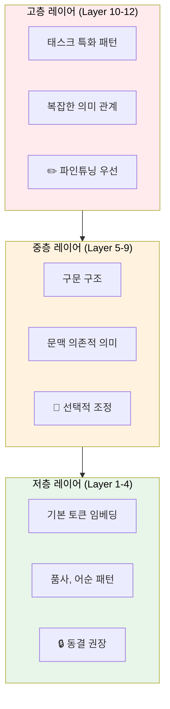
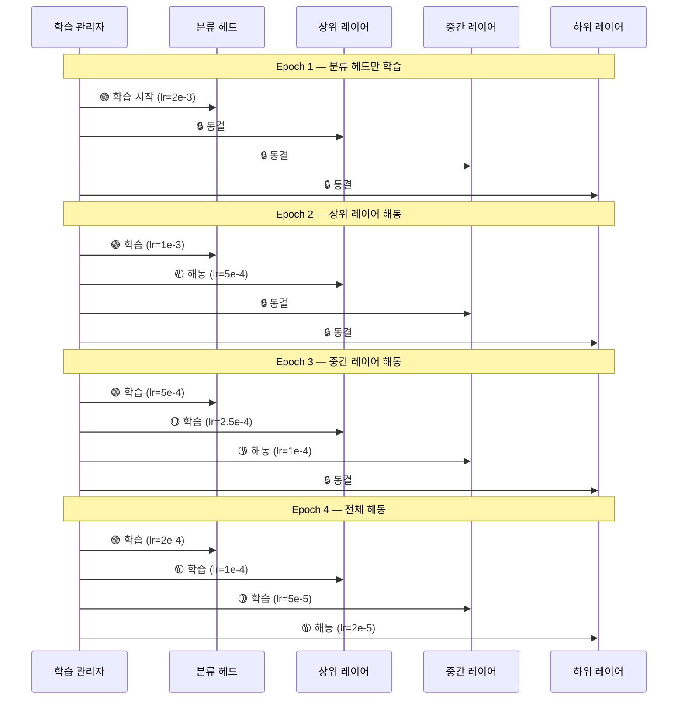
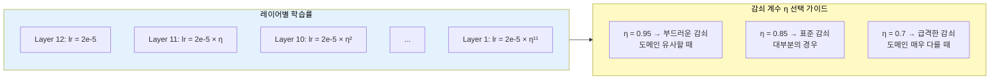
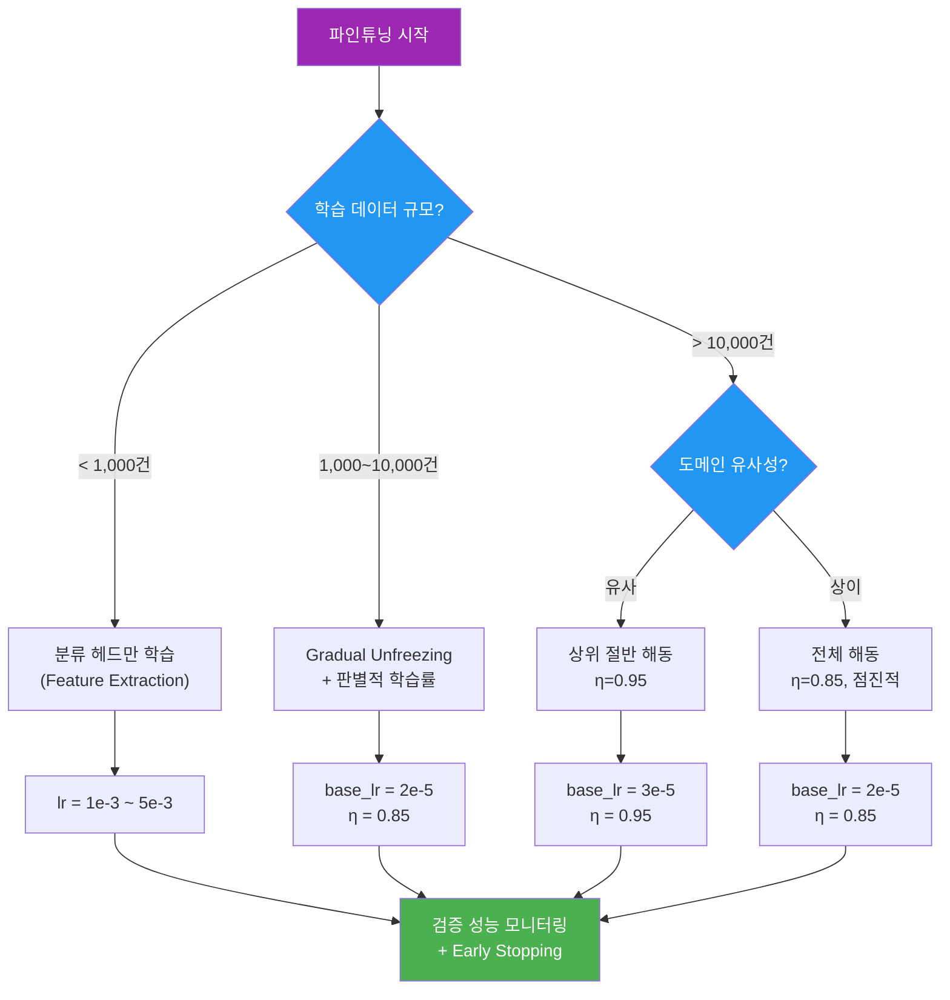

# 파인튜닝의 원리와 전략

> 사전학습된 모델을 실전에서 파인튜닝할 때 필요한 핵심 전략 — Gradual Unfreezing, 판별적 학습률, 레이어 동결 전략을 완전 정복합니다.

## 개요

이 섹션에서는 파인튜닝의 **실전 전략**에 집중합니다. 사전학습과 파인튜닝의 기본 관계, 전이학습의 개념은 [사전학습-파인튜닝 패러다임](16-사전학습과-파인튜닝-패러다임/01-사전학습-파인튜닝-패러다임의-이해.md)에서 이미 다루었으므로, 여기서는 "어떤 레이어를 언제, 얼마나 학습시킬 것인가"라는 실전적 의사결정에 초점을 맞춥니다.

**선수 지식**: 사전학습-파인튜닝 패러다임의 기본 개념(Ch16), 트랜스포머 아키텍처의 레이어 구조
**학습 목표**:
- 레이어별 역할 차이를 이해하고 동결/해동 전략을 수립할 수 있다
- Gradual Unfreezing 기법을 설계하고 구현할 수 있다
- 판별적 학습률(Discriminative Learning Rates)을 적용할 수 있다

## 왜 알아야 할까?

[Ch16](16-사전학습과-파인튜닝-패러다임/01-사전학습-파인튜닝-패러다임의-이해.md)에서 "사전학습 모델을 파인튜닝한다"는 큰 그림을 배웠는데요, 실제로 해보면 금방 이런 질문들이 쏟아집니다:

- "전체를 학습시켜야 할까, 일부만 학습시켜야 할까?"
- "학습률을 얼마로 잡아야 할까?"
- "데이터가 1,000개밖에 없는데 과적합은 어떻게 막지?"

**같은 모델, 같은 데이터**인데도 파인튜닝 전략에 따라 성능이 5~15% 차이 나는 경우가 흔합니다. 전략 없이 `model.train()`만 호출하면, 수백 시간의 사전학습 지식이 한순간에 날아가는 **파국적 망각(Catastrophic Forgetting)**이 발생할 수 있거든요. 이번 섹션에서 배울 세 가지 핵심 전략 — 레이어 동결, 점진적 해동, 판별적 학습률 — 은 이 문제를 체계적으로 해결합니다.

## 핵심 개념

### 개념 1: 레이어별 역할과 동결 전략

파인튜닝 전략을 세우려면 먼저 **레이어마다 무엇을 학습하는지**를 이해해야 합니다. 이것이 모든 전략의 출발점이에요.

> 💡 **비유**: 건물의 층을 생각해보세요. **1층(저층 레이어)**은 주차장, 로비 같은 기본 인프라로 어떤 건물이든 비슷합니다. **중간층**은 사무실, 회의실 등 용도에 따라 달라지기 시작하고, **꼭대기층(고층 레이어)**은 레스토랑인지 전망대인지에 따라 완전히 다르죠. 파인튜닝도 마찬가지로, 저층은 범용적이라 그대로 두고 고층부터 바꾸는 게 효율적입니다.

> 📊 **그림 1**: 트랜스포머 레이어별 학습 특성과 동결 전략



이런 계층적 특성 때문에, 실전에서는 **데이터 양과 도메인 유사성**에 따라 동결 범위를 결정합니다:

| 상황 | 동결 전략 | 근거 |
|------|----------|------|
| 데이터 적고 + 도메인 유사 | 분류 헤드만 학습 | 사전학습 지식 최대 활용 |
| 데이터 적고 + 도메인 상이 | 상위 2~4개 레이어 해동 | 도메인 적응 필요, 과적합 방지 |
| 데이터 충분 + 도메인 유사 | 상위 절반 해동 | 균형 잡힌 성능 |
| 데이터 충분 + 도메인 상이 | 전체 해동 (점진적) | 최대 적응, 단 점진적으로 |

```run:python
from transformers import BertModel

# 레이어별 파라미터 수 확인 — 동결 전략 수립의 기초
model = BertModel.from_pretrained('bert-base-uncased')

# 임베딩 레이어
embed_params = sum(p.numel() for p in model.embeddings.parameters())
print(f"임베딩 레이어: {embed_params:>12,} params  (🔒 보통 동결)")

# 인코더 레이어별
for i, layer in enumerate(model.encoder.layer):
    layer_params = sum(p.numel() for p in layer.parameters())
    zone = "🔒 저층" if i < 4 else "🔧 중층" if i < 9 else "✏️ 고층"
    print(f"Layer {i:2d}:      {layer_params:>12,} params  ({zone})")

# 전체
total = sum(p.numel() for p in model.parameters())
print(f"\n전체 파라미터:  {total:>12,}")
print(f"고층(L9-11)만 해동 시: {sum(sum(p.numel() for p in model.encoder.layer[i].parameters()) for i in range(9,12)):,} ({sum(sum(p.numel() for p in model.encoder.layer[i].parameters()) for i in range(9,12))/total*100:.1f}%)")
```

```output
임베딩 레이어:   23,835,648 params  (🔒 보통 동결)
Layer  0:       7,087,872 params  (🔒 저층)
Layer  1:       7,087,872 params  (🔒 저층)
Layer  2:       7,087,872 params  (🔒 저층)
Layer  3:       7,087,872 params  (🔒 저층)
Layer  4:       7,087,872 params  (🔧 중층)
Layer  5:       7,087,872 params  (🔧 중층)
Layer  6:       7,087,872 params  (🔧 중층)
Layer  7:       7,087,872 params  (🔧 중층)
Layer  8:       7,087,872 params  (🔧 중층)
Layer  9:       7,087,872 params  (✏️ 고층)
Layer 10:       7,087,872 params  (✏️ 고층)
Layer 11:       7,087,872 params  (✏️ 고층)

전체 파라미터:   109,482,240
고층(L9-11)만 해동 시: 21,263,616 (19.4%)
```

전체의 약 19%만 학습해도 태스크 특화 성능을 크게 끌어올릴 수 있습니다. 데이터가 부족한 상황에서 이 전략이 특히 강력하죠.

### 개념 2: 점진적 해동(Gradual Unfreezing)

동결 전략의 다음 단계는 "한꺼번에 해동할 것인가, 단계적으로 해동할 것인가"의 문제입니다. 2018년 Jeremy Howard와 Sebastian Ruder가 ULMFiT 논문에서 체계화한 **점진적 해동(Gradual Unfreezing)**은 후자를 선택합니다.

> 💡 **비유**: 겨울잠에서 깬 곰을 생각해보세요. 갑자기 전력 질주를 하면 몸에 무리가 오죠. 먼저 기지개를 켜고(분류 헤드 학습), 걸어보고(상위 레이어 해동), 뛰어보고(중간 레이어 해동), 마지막에 전력 질주(전체 해동)하는 것이 안전합니다. 모델도 마찬가지예요.

> 📊 **그림 2**: 점진적 해동 과정 — 에폭별 레이어 해동 순서



각 단계에서 학습률이 다른 것이 보이시나요? 이것이 바로 다음에 다룰 **판별적 학습률**과의 결합입니다. 점진적 해동의 핵심 이점은 세 가지예요:

1. **안정성**: 한꺼번에 많은 파라미터를 변경하지 않으므로 학습이 안정적
2. **망각 방지**: 저층의 범용 지식이 불필요하게 훼손되지 않음
3. **빠른 수렴**: 분류 헤드가 먼저 안정된 상태에서 하위 레이어를 조정하므로, 그래디언트 신호가 더 의미있음

### 개념 3: 판별적 학습률(Discriminative Learning Rates)

모든 레이어에 동일한 학습률을 적용하면 문제가 생깁니다. 저층의 범용 지식은 크게 바꿀 필요가 없는데, 높은 학습률로 업데이트하면 **파국적 망각**이 발생하거든요. 판별적 학습률은 이 문제를 **레이어별 맞춤 속도**로 해결합니다.

> 💡 **비유**: 오케스트라 리허설을 떠올려보세요. 지휘자가 "자, 모두 처음부터 다시!"라고 하면 비효율적이죠. 대신 "바이올린은 2소절만 다시, 관악기는 전체 다시, 타악기는 그대로"처럼 **파트별로 다른 연습량**을 지시합니다. 판별적 학습률도 같은 원리예요.

> 📊 **그림 3**: 판별적 학습률의 감쇠 구조



```run:python
# 판별적 학습률 계산 — 감쇠 계수별 비교
base_lr = 2e-5
num_layers = 12

for decay_factor in [0.95, 0.85, 0.7]:
    print(f"\n{'='*50}")
    print(f"감쇠 계수 η = {decay_factor}")
    print(f"{'='*50}")

    for layer in [12, 9, 6, 3, 1]:
        lr = base_lr * (decay_factor ** (num_layers - layer))
        ratio = lr / base_lr * 100
        bar = "█" * int(ratio / 5)
        print(f"  Layer {layer:2d}: lr = {lr:.2e}  ({ratio:5.1f}%)  {bar}")

    bottom_lr = base_lr * (decay_factor ** 11)
    print(f"  → 최상층 대비 최하층 비율: {bottom_lr/base_lr*100:.1f}%")
```

```output
==================================================
감쇠 계수 η = 0.95
==================================================
  Layer 12: lr = 2.00e-05  (100.0%)  ████████████████████
  Layer  9: lr = 1.72e-05  ( 85.7%)  █████████████████
  Layer  6: lr = 1.47e-05  ( 73.5%)  ██████████████
  Layer  3: lr = 1.26e-05  ( 63.0%)  ████████████
  Layer  1: lr = 1.14e-05  ( 57.0%)  ███████████
  → 최상층 대비 최하층 비율: 56.9%

==================================================
감쇠 계수 η = 0.85
==================================================
  Layer 12: lr = 2.00e-05  (100.0%)  ████████████████████
  Layer  9: lr = 1.23e-05  ( 61.4%)  ████████████
  Layer  6: lr = 7.54e-06  ( 37.7%)  ███████
  Layer  3: lr = 4.63e-06  ( 23.1%)  ████
  Layer  1: lr = 3.35e-06  ( 16.7%)  ███
  → 최상층 대비 최하층 비율: 16.7%

==================================================
감쇠 계수 η = 0.7
==================================================
  Layer 12: lr = 2.00e-05  (100.0%)  ████████████████████
  Layer  9: lr = 6.86e-06  ( 34.3%)  ██████
  Layer  6: lr = 2.35e-06  ( 11.8%)  ██
  Layer  3: lr = 8.07e-07  (  4.0%)  
  Layer  1: lr = 3.95e-07  (  2.0%)  
  → 최상층 대비 최하층 비율: 2.0%
```

η=0.85가 대부분의 상황에서 잘 작동하는 기본값입니다. 도메인이 사전학습 데이터와 매우 유사하면 η=0.95로 완만하게, 매우 다르면 η=0.7로 저층 학습을 거의 억제하는 식으로 조절하세요.

### 개념 4: 세 전략의 결합 — 실전 파인튜닝 레시피

지금까지 배운 세 전략은 개별적으로도 쓸 수 있지만, **결합했을 때** 가장 강력합니다. ULMFiT가 제안한 "3단계 파인튜닝 레시피"를 정리하면:

> 📊 **그림 4**: 실전 파인튜닝 의사결정 플로우



> ⚠️ **흔한 오해**: "데이터가 많으면 무조건 전체 파인튜닝이 좋다"
> 데이터가 많아도 도메인이 사전학습 데이터와 유사하면 전체 해동이 오히려 비효율적일 수 있습니다. 의료 텍스트처럼 도메인이 확연히 다를 때만 전체 해동이 유리하고, 일반 뉴스 감성 분석 같은 경우는 상위 레이어만으로 충분한 경우가 많아요.

## 더 깊이 알아보기

### 파국적 망각의 발견과 극복

1989년, Michael McCloskey와 Neal Cohen은 신경망에서 놀라운 현상을 발견했습니다. 새로운 태스크를 학습하면 **이전에 학습한 내용을 갑자기 잊어버리는** 현상이었죠. 이를 **파국적 망각(Catastrophic Forgetting)**이라 명명했습니다.

이 문제는 거의 30년간 신경망의 근본적 한계로 여겨졌는데, 2018년 Jeremy Howard와 Sebastian Ruder가 ULMFiT(Universal Language Model Fine-tuning)을 발표하면서 실용적인 해결책을 제시합니다. 점진적 해동과 판별적 학습률이라는 두 가지 핵심 기법으로, 파인튜닝 시 기존 지식을 보존하면서도 새로운 태스크에 적응할 수 있게 된 것이죠.

> 💡 **알고 계셨나요?**: ULMFiT는 NLP 전이학습 혁명의 시발점이었습니다. 이 논문 직후 BERT(2018.10), GPT-2(2019.2)가 연이어 발표되며 "사전학습 → 파인튜닝" 패러다임이 NLP의 표준이 되었어요. 흥미롭게도 Howard는 이 논문을 발표할 당시 fast.ai의 교육자로 더 유명했는데, "교육용으로 만든 기법이 연구 최전선을 바꿔버린" 드문 사례입니다.

## 실습: 직접 해보기

점진적 해동과 판별적 학습률을 결합한 파인튜닝 스케줄러를 구현해봅시다.

```python
import torch
from torch.optim import AdamW
from transformers import BertForSequenceClassification

class GradualUnfreezeScheduler:
    """점진적 해동 + 판별적 학습률 스케줄러"""

    def __init__(self, model, base_lr=2e-5, decay_factor=0.85, 
                 unfreeze_per_epoch=2):
        self.model = model
        self.base_lr = base_lr
        self.decay_factor = decay_factor
        self.unfreeze_per_epoch = unfreeze_per_epoch  # 에폭당 해동할 레이어 수
        self.current_epoch = 0

        # 레이어 그룹 구성
        self.layer_groups = self._build_layer_groups()

        # 초기 상태: 분류 헤드만 학습 가능
        self._freeze_all()
        self._unfreeze_head()

    def _build_layer_groups(self):
        """모델의 레이어를 그룹으로 분리"""
        groups = []

        # BERT 인코더 레이어 (저층 → 고층)
        for i in range(12):
            groups.append({
                'name': f'encoder.layer.{i}',
                'params': list(
                    self.model.bert.encoder.layer[i].parameters()
                ),
                'lr': self.base_lr * (self.decay_factor ** (11 - i))
            })

        # 임베딩 레이어 (가장 저층)
        groups.insert(0, {
            'name': 'embeddings',
            'params': list(self.model.bert.embeddings.parameters()),
            'lr': self.base_lr * (self.decay_factor ** 12)
        })

        # 분류 헤드 (가장 고층)
        groups.append({
            'name': 'classifier',
            'params': list(self.model.classifier.parameters()),
            'lr': self.base_lr
        })

        return groups

    def _freeze_all(self):
        """모든 파라미터 동결"""
        for param in self.model.parameters():
            param.requires_grad = False

    def _unfreeze_head(self):
        """분류 헤드만 해동"""
        for param in self.model.classifier.parameters():
            param.requires_grad = True

    def step_epoch(self):
        """에폭이 끝날 때 호출 — 다음 레이어 그룹 해동"""
        self.current_epoch += 1

        # 고층부터 해동 (리스트 뒤에서부터)
        total_groups = len(self.layer_groups)
        # 분류 헤드(마지막)는 이미 해동
        unfreeze_up_to = min(
            self.current_epoch * self.unfreeze_per_epoch,
            total_groups - 1  # 분류 헤드 제외
        )

        for i in range(total_groups - 1, 
                       total_groups - 1 - unfreeze_up_to, -1):
            if i >= 0:
                for param in self.layer_groups[i]['params']:
                    param.requires_grad = True

        return self._get_optimizer()

    def _get_optimizer(self):
        """현재 해동된 레이어에 대한 옵티마이저 생성"""
        param_groups = []
        for group in self.layer_groups:
            trainable = [p for p in group['params'] if p.requires_grad]
            if trainable:
                param_groups.append({
                    'params': trainable,
                    'lr': group['lr'],
                    'name': group['name']
                })

        return AdamW(param_groups, weight_decay=0.01)

    def get_status(self):
        """현재 학습 상태 출력"""
        total = sum(p.numel() for p in self.model.parameters())
        trainable = sum(
            p.numel() for p in self.model.parameters() if p.requires_grad
        )
        print(f"\n📊 Epoch {self.current_epoch} 학습 상태:")
        print(f"   전체 파라미터: {total:,}")
        print(f"   학습 가능: {trainable:,} ({trainable/total*100:.1f}%)")
        print(f"   동결됨: {total-trainable:,} ({(total-trainable)/total*100:.1f}%)")

        print("\n   레이어별 상태:")
        for group in self.layer_groups:
            trainable_in_group = sum(
                p.numel() for p in group['params'] if p.requires_grad
            )
            status = "🟢 학습중" if trainable_in_group > 0 else "🔒 동결"
            print(f"   {status} {group['name']:25s} "
                  f"lr={group['lr']:.2e}")


# 사용 예시
model = BertForSequenceClassification.from_pretrained(
    'bert-base-uncased', num_labels=2
)
scheduler = GradualUnfreezeScheduler(
    model, base_lr=2e-5, decay_factor=0.85, unfreeze_per_epoch=3
)

# 에폭별 점진적 해동 시뮬레이션
scheduler.get_status()  # 초기 상태

for epoch in range(1, 5):
    optimizer = scheduler.step_epoch()
    scheduler.get_status()
```

이 코드를 실행하면 에폭이 진행될수록 더 많은 레이어가 해동되면서, 각 레이어에 판별적 학습률이 적용되는 것을 확인할 수 있습니다. 실전에서는 `step_epoch()` 호출 사이에 실제 학습 루프를 넣고, 검증 성능을 모니터링하면서 Early Stopping과 결합하면 됩니다.

## 흔한 오해와 팁

> ⚠️ **흔한 오해**: "파인튜닝은 그냥 학습률을 낮추면 되는 거 아닌가요?"
> 단순히 학습률을 낮추는 것과 판별적 학습률은 다릅니다. 전자는 전체가 느리게 학습하지만, 후자는 **레이어별로 최적의 속도**를 적용합니다. 저층은 거의 변하지 않고, 고층은 적극적으로 변하는 것이죠. 실험적으로 판별적 학습률이 균일 학습률 대비 1~3% 높은 정확도를 보입니다.

> 🔥 **실무 팁**: 파인튜닝의 학습률은 사전학습보다 **10~100배 낮게** 설정하세요. 사전학습에서 1e-3을 사용했다면, 파인튜닝에서는 2e-5 ~ 5e-5가 적당합니다. 너무 높으면 파국적 망각, 너무 낮으면 학습이 안 됩니다. 시작점으로 2e-5를 추천합니다.

> 💡 **알고 계셨나요?**: "Fine-tuning"이라는 용어는 원래 악기 조율(tuning)에서 왔습니다. 피아노 조율사가 이미 대략 맞춰진 음을 **미세하게(fine)** 조정하는 것처럼, 이미 학습된 모델의 가중치를 미세하게 조정한다는 의미예요.

## 핵심 정리

| 개념 | 설명 |
|------|------|
| 레이어별 역할 | 저층=범용 패턴, 고층=태스크 특화 — 동결 전략의 근거 |
| 레이어 동결 | 데이터 양과 도메인 유사성에 따라 동결 범위 결정 |
| Gradual Unfreezing | 고층부터 점진적으로 해동 — 안정성과 망각 방지 |
| 판별적 학습률 | 레이어별 다른 학습률 적용 — 감쇠 계수 η로 조절 |
| 파국적 망각 | 새 태스크 학습 시 기존 지식을 잊는 현상 — 위 전략들로 방지 |
| 실전 레시피 | 데이터 규모 → 동결 범위 → 해동 전략 → 학습률 순으로 결정 |

## 다음 섹션 미리보기

실전 전략을 이해했으니, 다음 섹션에서는 **허깅페이스 트랜스포머 라이브러리**를 활용하여 실제로 모델을 파인튜닝하는 과정을 다룹니다. `Trainer` API를 사용한 감성 분석 모델 구축부터, 커스텀 데이터셋 준비, 하이퍼파라미터 최적화까지 hands-on으로 경험해볼 거예요.

## 참고 자료

- [Universal Language Model Fine-tuning for Text Classification (ULMFiT)](https://arxiv.org/abs/1801.06146) - Howard & Ruder의 원본 논문, Gradual Unfreezing과 판별적 학습률의 기원
- [Hugging Face Fine-tuning 공식 튜토리얼](https://huggingface.co/docs/transformers/training) - Trainer API를 활용한 파인튜닝 실전 가이드
- [The Illustrated BERT](https://jalammar.github.io/illustrated-bert/) - BERT의 사전학습과 파인튜닝을 직관적 시각화로 설명
- [A Survey on Transfer Learning in NLP](https://arxiv.org/abs/2007.04239) - NLP 전이학습 기법의 포괄적 서베이
- [Fine-Tuning Language Models: A Comprehensive Guide (2024)](https://www.datacamp.com/tutorial/fine-tuning-large-language-models) - 최신 파인튜닝 실전 가이드
- [Catastrophic Forgetting in Neural Networks](https://www.pnas.org/doi/10.1073/pnas.1611835114) - 파국적 망각 현상의 신경과학적 분석