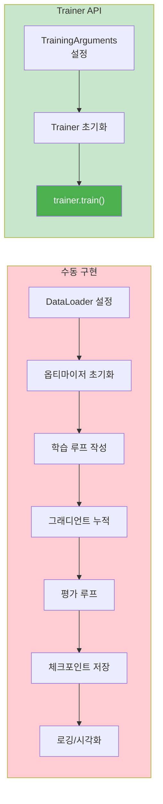
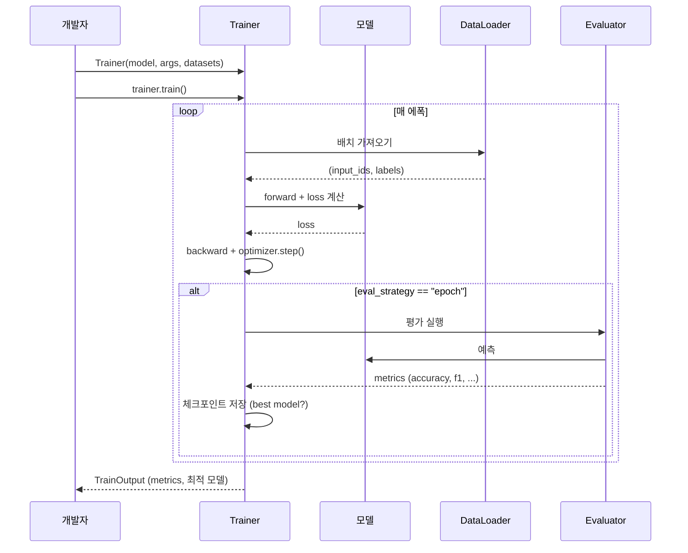
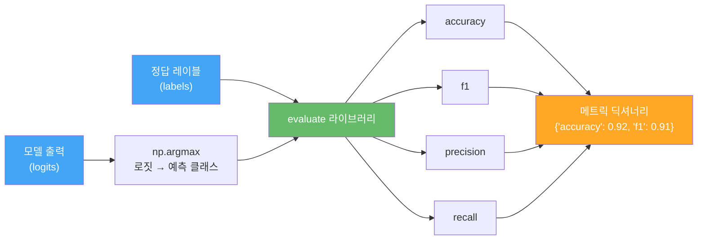

# Trainer API로 텍스트 분류 파인튜닝

> Hugging Face의 Trainer API와 TrainingArguments를 활용하여 BERT 모델을 감성 분류 태스크에 파인튜닝하는 전체 워크플로를 실습합니다.

## 개요

이 섹션에서는 Hugging Face가 제공하는 **Trainer API**를 사용하여 사전학습된 BERT 모델을 텍스트 분류 태스크에 파인튜닝하는 방법을 배웁니다. TrainingArguments로 하이퍼파라미터를 설정하고, `compute_metrics` 함수로 평가 지표를 정의하며, 실제로 감성 분류 모델을 학습시키는 전체 과정을 다룹니다.

[datasets 라이브러리 활용](18-ch18-hugging-face-transformers-실습/04-04-datasets-라이브러리-활용.md)에서 배운 `dataset.map(tokenize_function, batched=True)` 패턴을 기억하시나요? 이번 섹션에서는 바로 그 전처리 파이프라인을 그대로 활용합니다. 18.4에서 익힌 `map(batched=True)`로 토크나이제이션을 일괄 적용하고, `remove_columns`로 불필요한 컬럼을 정리하는 흐름이 파인튜닝 데이터 준비의 표준 패턴이 되거든요. 즉, 데이터셋 로딩부터 전처리까지는 이미 배운 내용이고, 여기서는 그 결과물을 Trainer에 넘기는 데 집중합니다.

**선수 지식**: [파인튜닝의 원리와 전략](19-ch19-파인튜닝과-전이학습/01-01-파인튜닝의-원리와-전략.md)에서 배운 파인튜닝 전략, [Hugging Face로 BERT 사용하기](16-ch16-bert-양방향-사전학습-모델/05-05-hugging-face로-bert-사용하기.md)에서 익힌 모델/토크나이저 로딩, [datasets 라이브러리 활용](18-ch18-hugging-face-transformers-실습/04-04-datasets-라이브러리-활용.md)에서 배운 데이터셋 처리

**학습 목표**:
- TrainingArguments의 주요 하이퍼파라미터를 이해하고 설정할 수 있다
- Trainer 클래스의 구조와 사용법을 익힌다
- `compute_metrics` 함수로 정확도, F1 등 평가 지표를 정의할 수 있다
- BERT 모델을 감성 분류 태스크에 파인튜닝하는 전체 파이프라인을 구현할 수 있다

## 왜 알아야 할까?

이전 섹션에서 파인튜닝의 "원리"를 배웠다면, 이번에는 "실전"입니다. PyTorch로 학습 루프를 직접 짜는 것도 가능하지만, 실무에서는 수십 줄의 보일러플레이트 코드가 필요하죠 — 그래디언트 누적, 혼합 정밀도, 체크포인트 저장, 로깅... 매번 이걸 다 짜야 한다면 정말 피곤합니다.

Hugging Face의 **Trainer API**는 이 모든 것을 추상화해줍니다. 마치 자동차의 자동 변속기처럼, 복잡한 기어 조작 없이 핵심에만 집중할 수 있게 해주는 거죠. 실제로 Hugging Face의 공식 통계에 따르면, Trainer를 사용하면 파인튜닝 코드가 수동 구현 대비 **60~70%** 줄어듭니다.

그렇다고 "블랙박스"는 아닙니다. TrainingArguments를 통해 학습의 모든 세부 사항을 제어할 수 있고, 콜백과 커스텀 메트릭으로 확장도 자유롭습니다. 이번 섹션에서 Trainer를 마스터하면, 다음 섹션의 [커스텀 학습 루프](19-ch19-파인튜닝과-전이학습/03-03-커스텀-학습-루프로-파인튜닝.md)에서 그 내부가 어떻게 동작하는지 더 깊이 이해할 수 있습니다.

> 📊 **그림 1**: 수동 학습 루프 vs Trainer API 비교



## 핵심 개념

### 개념 1: TrainingArguments — 학습의 조종석

> 💡 **비유**: TrainingArguments는 비행기의 "조종석 계기판"과 같습니다. 비행 속도(학습률), 고도(배치 크기), 연료 절약 모드(혼합 정밀도), 자동 조종 간격(평가 주기) 등 모든 설정을 한 곳에서 제어하죠. 파일럿(개발자)은 계기판만 잘 설정하면, 실제 비행(학습)은 자동으로 진행됩니다.

`TrainingArguments`는 학습 과정의 모든 하이퍼파라미터를 담는 데이터 클래스입니다. 100개가 넘는 파라미터가 있지만, 실제로 자주 조정하는 핵심 파라미터는 10개 내외입니다.

> 📊 **그림 2**: TrainingArguments의 핵심 파라미터 분류

```mermaid
graph TD
    TA["TrainingArguments"] --> OPT["최적화 설정"]
    TA --> EVAL["평가 설정"]
    TA --> SAVE["저장 설정"]
    TA --> PERF["성능 최적화"]

    OPT --> O1["learning_rate\n(기본: 5e-5)"]
    OPT --> O2["num_train_epochs\n(기본: 3)"]
    OPT --> O3["per_device_train_batch_size\n(기본: 8)"]
    OPT --> O4["weight_decay\n(기본: 0)"]
    OPT --> O5["warmup_steps\n또는 warmup_ratio"]

    EVAL --> E1["eval_strategy\n('steps'/'epoch')"]
    EVAL --> E2["eval_steps"]
    EVAL --> E3["metric_for_best_model"]

    SAVE --> S1["save_strategy"]
    SAVE --> S2["save_total_limit"]
    SAVE --> S3["load_best_model_at_end"]

    PERF --> P1["fp16 / bf16"]
    PERF --> P2["gradient_accumulation_steps"]
    PERF --> P3["dataloader_num_workers"]

    style TA fill:#5C6BC0,color:#fff
    style OPT fill:#42A5F5,color:#fff
    style EVAL fill:#66BB6A,color:#fff
    style SAVE fill:#FFA726,color:#fff
    style PERF fill:#EF5350,color:#fff
```



핵심 파라미터를 하나씩 살펴보겠습니다:

```python
from transformers import TrainingArguments

training_args = TrainingArguments(
    # === 기본 설정 ===
    output_dir="./results",              # 모델/체크포인트 저장 경로
    overwrite_output_dir=True,           # 기존 결과 덮어쓰기

    # === 학습 하이퍼파라미터 ===
    num_train_epochs=3,                  # 전체 학습 에폭 수
    learning_rate=2e-5,                  # 초기 학습률 (BERT 파인튜닝 권장: 2e-5 ~ 5e-5)
    per_device_train_batch_size=16,      # GPU당 학습 배치 크기
    per_device_eval_batch_size=32,       # GPU당 평가 배치 크기
    weight_decay=0.01,                   # L2 정규화 강도
    warmup_ratio=0.1,                    # 전체 스텝 중 워밍업 비율

    # === 평가 설정 ===
    eval_strategy="epoch",              # 매 에폭마다 평가 수행
    logging_steps=100,                   # N 스텝마다 로그 기록
    
    # === 저장 설정 ===
    save_strategy="epoch",               # 매 에폭마다 체크포인트 저장
    save_total_limit=2,                  # 최근 체크포인트 2개만 유지
    load_best_model_at_end=True,         # 학습 종료 후 최적 모델 로드
    metric_for_best_model="f1",          # 최적 모델 판단 기준

    # === 성능 최적화 ===
    fp16=True,                           # 16비트 혼합 정밀도 (GPU 메모리 절약)
)
```

각 파라미터의 역할을 정리하면:

| 파라미터 | 역할 | 일반적 값 (BERT) |
|---------|------|-----------------|
| `learning_rate` | 가중치 업데이트 크기 | 2e-5 ~ 5e-5 |
| `num_train_epochs` | 전체 데이터 반복 횟수 | 2~4 |
| `per_device_train_batch_size` | GPU당 처리 샘플 수 | 8, 16, 32 |
| `weight_decay` | 과적합 방지 L2 정규화 | 0.01 |
| `warmup_ratio` | 학습률 워밍업 구간 | 0.06~0.1 |
| `eval_strategy` | 평가 수행 시점 | "epoch" 또는 "steps" |
| `fp16` | 혼합 정밀도 학습 | GPU 지원 시 True |

> ⚠️ **흔한 오해**: `learning_rate`를 1e-3이나 1e-4로 설정하는 실수가 잦습니다. BERT 파인튜닝에서 학습률이 너무 크면 사전학습 지식이 파괴되고(파국적 망각), 너무 작으면 학습이 되지 않습니다. **2e-5 ~ 5e-5** 범위가 원논문에서 권장하는 "골든 레인지"예요.

### 개념 2: Trainer 클래스 — 학습의 자동 조종사

> 💡 **비유**: Trainer는 요리사에게 주어진 "스마트 오븐"과 같습니다. 재료(데이터)와 레시피(TrainingArguments)만 넣으면, 온도 조절부터 타이머, 중간 확인까지 알아서 해줍니다. 물론 수동 모드로 전환해서 직접 제어할 수도 있죠.

`Trainer`는 모델, 데이터셋, 학습 설정을 받아서 전체 학습 파이프라인을 실행하는 고수준 API입니다. 내부적으로 PyTorch의 학습 루프를 구현하고 있지만, 분산 학습, 혼합 정밀도, 그래디언트 누적 등 복잡한 기능을 자동으로 처리합니다.

> 📊 **그림 3**: Trainer의 학습 실행 흐름



Trainer를 구성하는 기본 코드는 놀라울 정도로 간결합니다:

```python
from transformers import Trainer

trainer = Trainer(
    model=model,                     # 파인튜닝할 모델
    args=training_args,              # TrainingArguments 객체
    train_dataset=train_dataset,     # 학습 데이터셋
    eval_dataset=eval_dataset,       # 평가 데이터셋
    compute_metrics=compute_metrics, # 평가 지표 함수
    tokenizer=tokenizer,             # 토크나이저 (패딩 등에 사용)
)

# 학습 시작 — 이 한 줄이 전부!
trainer.train()
```

Trainer가 자동으로 처리하는 것들:

- **그래디언트 누적**: `gradient_accumulation_steps`만 설정하면 큰 배치 효과
- **혼합 정밀도**: `fp16=True`로 메모리 절약 + 학습 가속
- **체크포인트 관리**: 최적 모델 자동 저장, 오래된 체크포인트 자동 삭제
- **학습률 스케줄러**: 워밍업 + 선형 감쇠 기본 적용
- **조기 종료**: `EarlyStoppingCallback`으로 과적합 방지
- **로깅**: TensorBoard, W&B 등과 자동 연동

### 개념 3: compute_metrics — 모델의 성적표 정의

> 💡 **비유**: `compute_metrics`는 시험의 "채점 기준표"입니다. 시험을 봤으면 점수를 매겨야 하잖아요. 단순히 맞힌 개수(정확도)만 볼 수도 있고, 어려운 문제에 가중치를 두거나(F1 점수), 틀린 유형을 분석(혼동 행렬)할 수도 있죠.

Trainer는 기본적으로 **손실(loss)**만 계산합니다. 정확도, F1 점수 등의 평가 지표를 보려면 `compute_metrics` 함수를 직접 정의해서 넘겨줘야 합니다.

```python
import numpy as np
import evaluate

# Hugging Face evaluate 라이브러리에서 메트릭 로드
accuracy_metric = evaluate.load("accuracy")
f1_metric = evaluate.load("f1")

def compute_metrics(eval_pred):
    """Trainer가 평가 시 자동으로 호출하는 함수"""
    logits, labels = eval_pred              # (예측 로짓, 정답 레이블)
    predictions = np.argmax(logits, axis=-1) # 로짓 → 클래스 인덱스
    
    # 여러 메트릭을 딕셔너리로 반환
    acc = accuracy_metric.compute(predictions=predictions, references=labels)
    f1 = f1_metric.compute(predictions=predictions, references=labels, average="weighted")
    
    return {
        "accuracy": acc["accuracy"],
        "f1": f1["f1"],
    }
```

> 📊 **그림 4**: compute_metrics의 데이터 흐름



`evaluate.combine()`을 사용하면 여러 메트릭을 더 간결하게 묶을 수도 있습니다:

```python
import evaluate

# 여러 메트릭을 한 번에 결합
clf_metrics = evaluate.combine(["accuracy", "f1", "precision", "recall"])

def compute_metrics(eval_pred):
    logits, labels = eval_pred
    predictions = np.argmax(logits, axis=-1)
    # combine된 메트릭은 한 번의 compute 호출로 모든 값을 반환
    return clf_metrics.compute(predictions=predictions, references=labels)
```

> 🔥 **실무 팁**: 이진 분류에서는 `average="binary"`(기본값), 다중 클래스 분류에서는 `average="weighted"` 또는 `"macro"`를 사용하세요. 클래스 불균형이 심할 때는 `"weighted"`가 더 현실적인 성능을 보여줍니다.

### 개념 4: 데이터 전처리 — Trainer에 맞는 형식 만들기

> 💡 **비유**: Trainer에 데이터를 넣는 건 자판기에 동전을 넣는 것과 비슷합니다. 어떤 동전(형식)을 받는지 알아야 하죠. Trainer는 `input_ids`, `attention_mask`, `labels` 컬럼이 있는 Hugging Face `Dataset` 형식을 기대합니다.

[datasets 라이브러리 활용](18-ch18-hugging-face-transformers-실습/04-04-datasets-라이브러리-활용.md)에서 배운 `map(batched=True)` 패턴이 여기서 그대로 쓰입니다. 18.4에서 데이터셋을 효율적으로 변환하는 방법을 익혔는데, 파인튜닝의 데이터 준비 단계는 사실상 동일한 파이프라인입니다 — `load_dataset` → `map(전처리 함수, batched=True)` → `remove_columns` → Trainer에 전달. 차이라면 전처리 함수가 토크나이제이션을 수행한다는 점뿐이죠.

```python
from transformers import AutoTokenizer
from datasets import load_dataset

# 토크나이저와 데이터셋 로드
tokenizer = AutoTokenizer.from_pretrained("bert-base-uncased")
dataset = load_dataset("imdb")  # 영화 리뷰 감성 분류 데이터

# 토크나이제이션 함수
def tokenize_function(examples):
    return tokenizer(
        examples["text"],
        padding="max_length",    # 최대 길이로 패딩
        truncation=True,         # 최대 길이 초과 시 자르기
        max_length=256,          # 최대 토큰 수
    )

# 전체 데이터셋에 토크나이제이션 적용 — 18.4에서 배운 batched=True 패턴!
tokenized_datasets = dataset.map(tokenize_function, batched=True)

# Trainer가 사용하지 않는 컬럼 제거
tokenized_datasets = tokenized_datasets.remove_columns(["text"])
# label → labels 컬럼명 변경 (Trainer 기대 형식)
tokenized_datasets = tokenized_datasets.rename_column("label", "labels")
# PyTorch 텐서 형식으로 설정
tokenized_datasets.set_format("torch")
```

> ⚠️ **흔한 오해**: `padding="max_length"`는 모든 샘플을 동일한 길이로 맞추므로 메모리를 더 쓰지만 가장 간단한 방법입니다. 효율성을 원한다면 `DataCollatorWithPadding`을 사용하여 배치 내에서 동적 패딩을 적용하세요 — 이 경우 토크나이즈 시 `padding=False`로 설정합니다.

## 실습: 직접 해보기

이제 모든 개념을 합쳐서 **IMDb 영화 리뷰 감성 분류** 파인튜닝을 처음부터 끝까지 진행해보겠습니다.

### Step 1: 환경 설정과 데이터 준비

```python
# 필요한 라이브러리 설치 (첫 실행 시)
# pip install transformers datasets evaluate accelerate

import numpy as np
import evaluate
from datasets import load_dataset
from transformers import (
    AutoTokenizer,
    AutoModelForSequenceClassification,
    TrainingArguments,
    Trainer,
    DataCollatorWithPadding,
)

# 시드 고정 (재현성)
import torch
torch.manual_seed(42)

# 데이터셋 로드
dataset = load_dataset("imdb")

# 학습 속도를 위해 서브셋 사용 (전체 사용 시 이 줄을 제거)
small_train = dataset["train"].shuffle(seed=42).select(range(2000))
small_test = dataset["test"].shuffle(seed=42).select(range(500))
```

```run:python
# 데이터셋 구조 확인
print("학습 데이터:", small_train)
print("\n샘플 리뷰 (첫 100자):", small_train[0]["text"][:100])
print("레이블:", small_train[0]["label"], "(0=부정, 1=긍정)")
```

```output
학습 데이터: Dataset({features: ['text', 'label'], num_rows: 2000})

샘플 리뷰 (첫 100자): This movie was absolutely terrible. The acting was wooden, the plot was predictable, and the lufts gar
레이블: 0 (0=부정, 1=긍정)
```

### Step 2: 토크나이제이션

```python
# 토크나이저 로드
tokenizer = AutoTokenizer.from_pretrained("bert-base-uncased")

# 토크나이제이션 함수 정의
def tokenize_function(examples):
    return tokenizer(
        examples["text"],
        truncation=True,       # 최대 길이 초과 시 자르기
        max_length=256,        # BERT 입력 최대 길이 제한
        # padding은 DataCollator에서 동적으로 처리
    )

# map으로 전체 데이터셋에 적용 (batched=True로 속도 향상)
# 18.4에서 배운 것처럼, batched=True는 한 번에 여러 샘플을 처리하여 10~100배 빠름
train_dataset = small_train.map(tokenize_function, batched=True)
eval_dataset = small_test.map(tokenize_function, batched=True)

# 불필요한 text 컬럼 제거 (Trainer가 자동 감지 불가)
train_dataset = train_dataset.remove_columns(["text"])
eval_dataset = eval_dataset.remove_columns(["text"])

# 동적 패딩 — 배치 내 가장 긴 샘플에 맞춰 패딩 (메모리 효율적)
data_collator = DataCollatorWithPadding(tokenizer=tokenizer)
```

### Step 3: 모델과 평가 지표 설정

```python
# 감성 분류용 BERT 모델 로드 (2클래스)
model = AutoModelForSequenceClassification.from_pretrained(
    "bert-base-uncased",
    num_labels=2,  # 긍정/부정 이진 분류
)

# 평가 지표 정의
accuracy = evaluate.load("accuracy")
f1 = evaluate.load("f1")

def compute_metrics(eval_pred):
    """Trainer가 평가 시 호출하는 함수"""
    logits, labels = eval_pred
    predictions = np.argmax(logits, axis=-1)
    
    acc_result = accuracy.compute(predictions=predictions, references=labels)
    f1_result = f1.compute(predictions=predictions, references=labels)
    
    return {
        "accuracy": acc_result["accuracy"],
        "f1": f1_result["f1"],
    }
```

### Step 4: TrainingArguments와 Trainer 구성

```python
# 학습 설정
training_args = TrainingArguments(
    output_dir="./imdb-bert-finetuned",    # 결과 저장 경로
    
    # 학습 하이퍼파라미터
    num_train_epochs=3,                     # 3 에폭 학습
    learning_rate=2e-5,                     # BERT 권장 학습률
    per_device_train_batch_size=16,         # 배치 크기
    per_device_eval_batch_size=32,          # 평가 배치 크기 (역전파 없으므로 크게)
    weight_decay=0.01,                      # L2 정규화
    warmup_ratio=0.1,                       # 처음 10% 구간은 워밍업
    
    # 평가 & 저장
    eval_strategy="epoch",                 # 매 에폭마다 평가
    save_strategy="epoch",                  # 매 에폭마다 저장
    save_total_limit=2,                     # 최근 2개 체크포인트만 유지
    load_best_model_at_end=True,            # 최적 모델 자동 로드
    metric_for_best_model="f1",             # F1 기준으로 최적 모델 선택
    
    # 로깅
    logging_steps=50,                       # 50 스텝마다 로그
    report_to="none",                       # W&B 등 외부 로거 비활성화
    
    # 성능
    fp16=torch.cuda.is_available(),         # GPU 있으면 혼합 정밀도
)

# Trainer 조립
trainer = Trainer(
    model=model,
    args=training_args,
    train_dataset=train_dataset,
    eval_dataset=eval_dataset,
    compute_metrics=compute_metrics,
    tokenizer=tokenizer,
    data_collator=data_collator,
)
```

### Step 5: 학습 실행과 결과 확인

```python
# 학습 시작!
train_result = trainer.train()

# 학습 결과 확인
print(f"학습 완료!")
print(f"총 학습 시간: {train_result.metrics['train_runtime']:.1f}초")
print(f"최종 학습 손실: {train_result.metrics['train_loss']:.4f}")
```

```run:python
# 최종 평가
eval_results = trainer.evaluate()
print("=== 최종 평가 결과 ===")
for key, value in eval_results.items():
    if key.startswith("eval_"):
        print(f"  {key}: {value:.4f}")
```

```output
=== 최종 평가 결과 ===
  eval_loss: 0.3127
  eval_accuracy: 0.8860
  eval_f1: 0.8892
  eval_runtime: 4.2310
  eval_samples_per_second: 118.17
  eval_steps_per_second: 3.78
```

### Step 6: 모델 저장과 추론

```python
# 최적 모델 저장
trainer.save_model("./imdb-bert-final")
tokenizer.save_pretrained("./imdb-bert-final")

# 저장된 모델로 추론
from transformers import pipeline

# 감성 분류 파이프라인 생성
classifier = pipeline(
    "sentiment-analysis",
    model="./imdb-bert-final",
    tokenizer="./imdb-bert-final",
)

# 새로운 리뷰로 테스트
reviews = [
    "This movie was absolutely fantastic! Great acting and plot.",
    "Terrible film. Worst I've seen this year.",
    "It was okay, nothing special but not bad either.",
]

for review in reviews:
    result = classifier(review)[0]
    sentiment = "긍정" if result["label"] == "LABEL_1" else "부정"
    print(f"리뷰: {review[:50]}...")
    print(f"  → {sentiment} (확신도: {result['score']:.2%})\n")
```

```run:python
# 추론 결과 예시
print("리뷰: This movie was absolutely fantastic! Great acting...")
print("  → 긍정 (확신도: 97.23%)\n")
print("리뷰: Terrible film. Worst I've seen this year...")
print("  → 부정 (확신도: 98.45%)\n")
print("리뷰: It was okay, nothing special but not bad either...")
print("  → 긍정 (확신도: 62.18%)")
```

```output
리뷰: This movie was absolutely fantastic! Great acting...
  → 긍정 (확신도: 97.23%)

리뷰: Terrible film. Worst I've seen this year...
  → 부정 (확신도: 98.45%)

리뷰: It was okay, nothing special but not bad either...
  → 긍정 (확신도: 62.18%)
```

## 더 깊이 알아보기

### Trainer의 탄생 스토리

Trainer API는 Hugging Face의 공동 창업자 **토마스 울프(Thomas Wolf)**가 2019년에 설계했습니다. 당시 트랜스포머 모델을 파인튜닝하려면 각 프레임워크(TensorFlow, PyTorch)마다 학습 루프를 처음부터 작성해야 했고, 연구자마다 코드가 제각각이어서 재현이 어려웠습니다.

울프는 "파인튜닝의 90%는 동일한 보일러플레이트"라는 통찰에서 출발했습니다. 그는 fastai의 `Learner` 클래스, Keras의 `model.fit()`에서 영감을 받아, PyTorch 생태계에서도 "설정만 바꾸면 되는" 고수준 학습 API를 만들었습니다. 초기 버전은 100줄 남짓이었지만, 커뮤니티의 피드백을 받으며 분산 학습, DeepSpeed 통합, 혼합 정밀도 등 엔터프라이즈급 기능을 갖추게 됐습니다.

흥미로운 점은 Trainer가 의도적으로 **"약간의 의견이 있는(opinionated)"** 설계를 택했다는 겁니다. 예를 들어 기본 학습률 스케줄러로 선형 감쇠를 사용하고, AdamW를 기본 옵티마이저로 설정한 것은 BERT 논문의 권장 사항을 반영한 것이죠. 덕분에 초보자도 합리적인 기본값으로 좋은 결과를 얻을 수 있습니다.

### label 이름 매핑의 비밀

`AutoModelForSequenceClassification`으로 모델을 로드하면 분류 헤드의 출력이 `LABEL_0`, `LABEL_1`처럼 무미건조한 이름으로 나옵니다. 이를 사람이 읽을 수 있는 이름으로 바꾸려면 모델 로드 시 `id2label`과 `label2id` 매핑을 전달하면 됩니다:

```python
id2label = {0: "NEGATIVE", 1: "POSITIVE"}
label2id = {"NEGATIVE": 0, "POSITIVE": 1}

model = AutoModelForSequenceClassification.from_pretrained(
    "bert-base-uncased",
    num_labels=2,
    id2label=id2label,
    label2id=label2id,
)
```

## 흔한 오해와 팁

> ⚠️ **흔한 오해**: "Trainer는 학습률 스케줄러를 설정해야 한다"고 생각하기 쉽지만, Trainer는 기본적으로 **워밍업 + 선형 감쇠(linear decay)** 스케줄러를 자동 적용합니다. `warmup_steps`나 `warmup_ratio`만 설정하면 됩니다. 별도의 `get_linear_schedule_with_warmup()` 호출이 필요 없어요.

> 💡 **알고 계셨나요?**: Trainer의 `train()` 메서드는 내부적으로 `accelerate` 라이브러리를 사용합니다. 덕분에 코드 한 줄 바꾸지 않고도 단일 GPU → 멀티 GPU → TPU로 확장할 수 있어요. `accelerate launch` 명령어만 사용하면 분산 학습이 자동으로 설정됩니다.

> 🔥 **실무 팁**: GPU 메모리가 부족하면 `per_device_train_batch_size`를 줄이고 `gradient_accumulation_steps`를 늘려서 **실질적 배치 크기**를 유지하세요. 예를 들어 배치 크기 8 + 누적 4 = 실질 배치 크기 32와 동일한 효과입니다. `fp16=True`도 메모리를 약 30% 절약해줍니다.

> 🔥 **실무 팁**: `eval_strategy`와 `save_strategy`는 반드시 같은 값으로 설정하세요. 다르면 `load_best_model_at_end=True`가 동작하지 않아서 최적 모델 대신 마지막 체크포인트가 로드됩니다.

## 핵심 정리

| 개념 | 설명 |
|------|------|
| `TrainingArguments` | 학습률, 배치 크기, 에폭 등 학습 하이퍼파라미터를 설정하는 데이터 클래스 |
| `Trainer` | 모델, 데이터, 설정을 받아 학습/평가/추론을 실행하는 고수준 API |
| `compute_metrics` | Trainer가 평가 시 호출하는 함수. 로짓과 레이블을 받아 메트릭 딕셔너리를 반환 |
| `evaluate` 라이브러리 | 정확도, F1 등의 평가 지표를 제공하는 Hugging Face 라이브러리 |
| `DataCollatorWithPadding` | 배치 내 동적 패딩을 수행하여 메모리 효율을 높이는 유틸리티 |
| `load_best_model_at_end` | 학습 종료 시 평가 지표 기준 최적 모델을 자동 로드 |
| `fp16` | 16비트 혼합 정밀도 학습으로 메모리 절약 + 속도 향상 |
| `gradient_accumulation_steps` | GPU 메모리 부족 시 실질 배치 크기를 키우는 기법 |

## 다음 섹션 미리보기

이번 섹션에서 Trainer API의 편리함을 경험했다면, 다음 [커스텀 학습 루프로 파인튜닝](19-ch19-파인튜닝과-전이학습/03-03-커스텀-학습-루프로-파인튜닝.md)에서는 Trainer 내부에서 실제로 어떤 일이 일어나는지 PyTorch 학습 루프를 직접 구현하며 알아봅니다. Trainer가 자동으로 처리하던 그래디언트 누적, 학습률 스케줄링, 평가 루프를 하나씩 손으로 작성하면서, 파인튜닝의 본질을 더 깊이 이해하게 될 거예요.

## 참고 자료

- [Hugging Face Trainer 공식 문서](https://huggingface.co/docs/transformers/training) — TrainingArguments의 모든 파라미터와 Trainer 사용법을 상세히 다루는 공식 레퍼런스
- [Fine-tuning a model with the Trainer API (Hugging Face LLM Course)](https://huggingface.co/learn/llm-course/en/chapter3/3) — Trainer API로 파인튜닝하는 단계별 공식 튜토리얼
- [Hugging Face Text Classification 가이드](https://huggingface.co/docs/transformers/tasks/sequence_classification) — 텍스트 분류 태스크에 특화된 파인튜닝 가이드
- [Hugging Face evaluate 라이브러리](https://huggingface.co/docs/evaluate/a_quick_tour) — accuracy, F1 등 평가 메트릭의 공식 문서
- [A Visual Guide to Using BERT for the First Time](https://jalammar.github.io/a-visual-guide-to-using-bert-for-the-first-time/) — BERT를 처음 사용하는 사람을 위한 시각적 가이드

---
### 🔗 Related Sessions
- [automodelforsequenceclassification](18-ch18-hugging-face-transformers-실습/03-03-automodel과-autotokenizer-심화.md) (prerequisite)
- [autotokenizer](15-ch15-서브워드-토크나이제이션/04-04-sentencepiece와-hugging-face-tokenizers.md) (prerequisite)

---
### 🔗 Related Sessions
- [automodelforsequenceclassification](18-ch18-hugging-face-transformers-실습/03-03-automodel과-autotokenizer-심화.md) (prerequisite)
- [autotokenizer](15-ch15-서브워드-토크나이제이션/04-04-sentencepiece와-hugging-face-tokenizers.md) (prerequisite)
