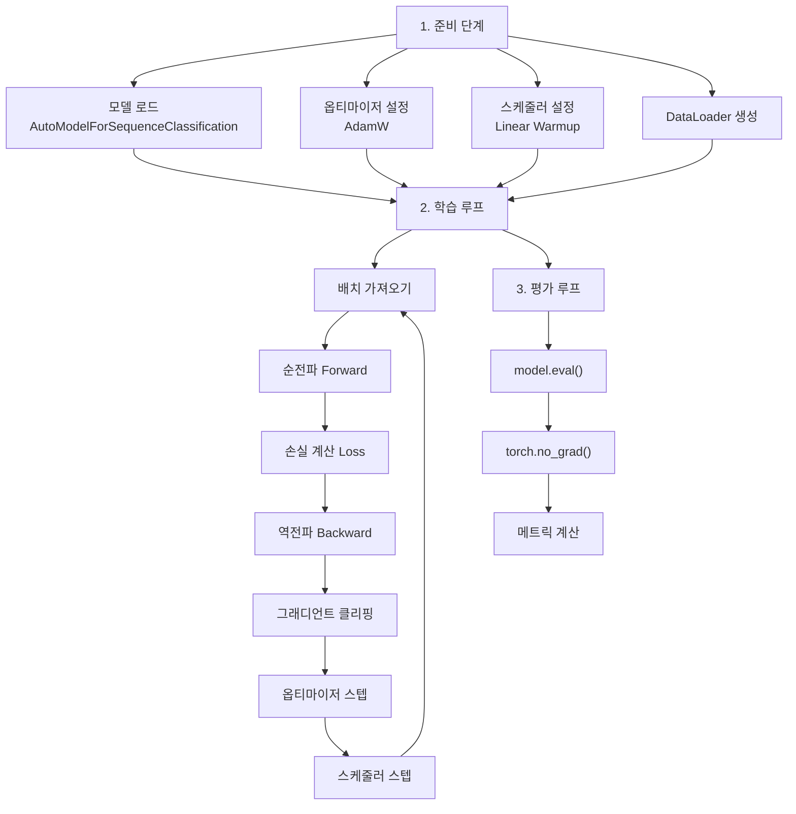
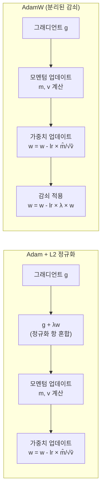
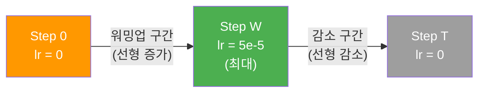
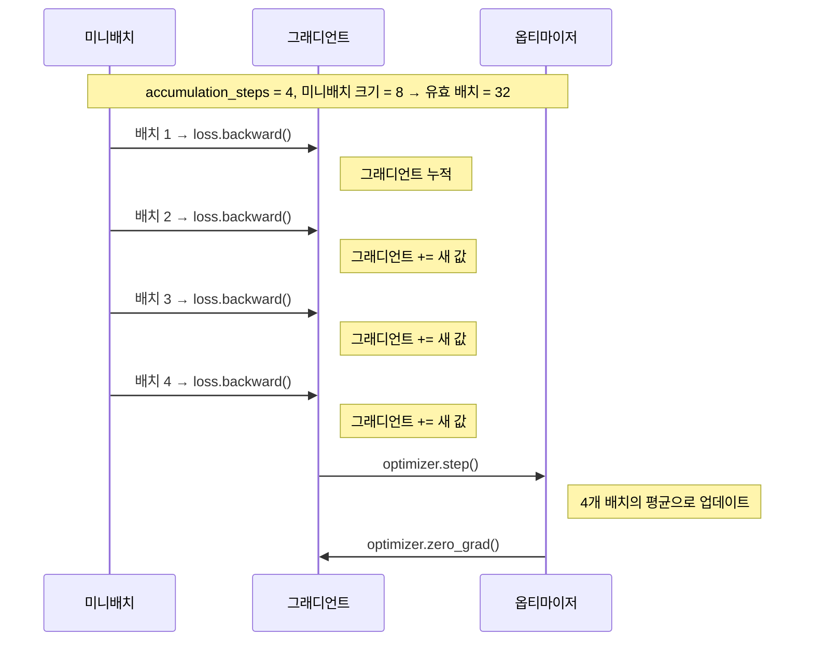

# 03. 커스텀 학습 루프로 파인튜닝

> Trainer 없이 PyTorch로 직접 파인튜닝하며, AdamW 옵티마이저와 선형 학습률 스케줄러, 그래디언트 누적까지 완전히 이해합니다.

## 개요

이 섹션에서는 [이전 섹션](19-ch19-파인튜닝과-전이학습/02-02-trainer-api로-텍스트-분류-파인튜닝.md)에서 배운 Trainer API의 내부를 직접 열어보겠습니다. Trainer가 한 줄로 해주던 일을 PyTorch의 기본 학습 루프로 하나씩 구현하면서, 파인튜닝 과정에서 실제로 무슨 일이 벌어지는지 속속들이 파악하게 됩니다.

**선수 지식**: Trainer API 사용 경험([02. Trainer API로 텍스트 분류 파인튜닝](19-ch19-파인튜닝과-전이학습/02-02-trainer-api로-텍스트-분류-파인튜닝.md)), PyTorch 학습 루프 기초([05. 학습 루프와 Dataset/DataLoader](07-ch7-pytorch-기초와-신경망-입문/05-05-학습-루프와-datasetdataloader.md)), 옵티마이저와 손실 함수([04. 손실 함수와 옵티마이저](07-ch7-pytorch-기초와-신경망-입문/04-04-손실-함수와-옵티마이저.md))

**학습 목표**:
- Trainer 없이 PyTorch만으로 사전학습 모델을 파인튜닝할 수 있다
- AdamW 옵티마이저의 가중치 감쇠 분리 원리를 이해하고 적용할 수 있다
- 선형 학습률 스케줄러(warmup + linear decay)를 구성할 수 있다
- 그래디언트 누적으로 GPU 메모리 제약을 우회할 수 있다

## 왜 알아야 할까?

Trainer API는 정말 편리하죠. `trainer.train()` 한 줄이면 학습이 돌아갑니다. 그런데 **왜 굳이 학습 루프를 직접 짜야 할까요?**

자동차에 비유해볼게요. 오토매틱 차량은 누구나 쉽게 운전할 수 있지만, 레이싱 드라이버라면 수동 변속기를 직접 조작해야 합니다. 코너마다 기어를 세밀하게 바꾸고, 엔진 브레이크를 활용하고, 클러치 타이밍을 조절하는 것처럼 — 커스텀 학습 루프는 **모델 학습의 모든 세부사항을 직접 제어**할 수 있게 해줍니다.

실무에서 커스텀 루프가 필요한 상황은 생각보다 자주 찾아옵니다:

- **복잡한 손실 함수**: 여러 손실을 가중 합산하거나 동적으로 변경해야 할 때
- **특수 학습 전략**: GAN 학습처럼 두 모델을 번갈아 학습하거나, 커리큘럼 러닝을 적용할 때
- **세밀한 디버깅**: 그래디언트 값을 직접 확인하거나, 특정 레이어만 선택적으로 학습할 때
- **연구 목적**: 새로운 최적화 기법이나 학습 기법을 실험할 때

## 핵심 개념

### 개념 1: 커스텀 학습 루프의 전체 구조

> 💡 **비유**: 요리 레시피에 비유해봅시다. Trainer API는 "밀키트"입니다 — 재료가 손질되어 있고 순서대로 넣기만 하면 되죠. 반면 커스텀 학습 루프는 **재료 손질부터 플레이팅까지 직접** 하는 겁니다. 시간은 더 걸리지만, 간을 중간에 보면서 입맛에 맞게 조절할 수 있죠.

커스텀 학습 루프는 크게 **준비 → 반복 → 평가** 세 단계로 나뉩니다. Trainer가 내부적으로 실행하는 것과 동일한 흐름이지만, 각 단계를 우리가 직접 제어합니다.

> 📊 **그림 1**: 커스텀 학습 루프의 전체 흐름



Trainer가 자동으로 해주던 각 단계를 하나씩 코드로 작성하면 됩니다. 핵심은 순서를 정확히 지키는 것이죠:

```python
# 학습 루프의 골격
for epoch in range(num_epochs):
    model.train()
    for batch in train_dataloader:
        outputs = model(**batch)          # 순전파
        loss = outputs.loss               # 손실 계산
        loss.backward()                   # 역전파
        torch.nn.utils.clip_grad_norm_(   # 그래디언트 클리핑
            model.parameters(), max_norm=1.0
        )
        optimizer.step()                  # 가중치 업데이트
        lr_scheduler.step()               # 학습률 업데이트
        optimizer.zero_grad()             # 그래디언트 초기화
```

### 개념 2: AdamW — 가중치 감쇠를 분리한 옵티마이저

> 💡 **비유**: 다이어트를 할 때 "운동으로 칼로리를 태우는 것"과 "음식을 줄이는 것"은 별개의 전략이잖아요? 기존 Adam에서는 이 두 가지가 뒤섞여 있었는데, AdamW는 **운동(그래디언트 업데이트)과 식단 조절(가중치 감쇠)을 깔끔하게 분리**한 겁니다.

기존 Adam 옵티마이저의 L2 정규화는 적응적 학습률과 결합되면서 의도한 대로 작동하지 않는 문제가 있었습니다. 2019년 Loshchilov & Hutter가 발표한 AdamW는 **가중치 감쇠(weight decay)를 그래디언트 업데이트와 분리(decoupled)**하여 이 문제를 해결했습니다.

> 📊 **그림 2**: Adam vs AdamW의 가중치 감쇠 처리 차이



트랜스포머 파인튜닝에서 AdamW를 사용할 때 중요한 점은, **바이어스와 LayerNorm 파라미터에는 가중치 감쇠를 적용하지 않는 것**입니다:

```python
# 가중치 감쇠를 적용할 파라미터와 제외할 파라미터를 분리
no_decay = ["bias", "LayerNorm.weight"]

optimizer_grouped_parameters = [
    {
        "params": [p for n, p in model.named_parameters()
                   if not any(nd in n for nd in no_decay)],
        "weight_decay": 0.01,      # 일반 가중치: 감쇠 적용
    },
    {
        "params": [p for n, p in model.named_parameters()
                   if any(nd in n for nd in no_decay)],
        "weight_decay": 0.0,       # bias, LayerNorm: 감쇠 제외
    },
]

optimizer = torch.optim.AdamW(
    optimizer_grouped_parameters,
    lr=5e-5,            # BERT 파인튜닝 추천 학습률
    eps=1e-8            # 수치 안정성
)
```

왜 bias와 LayerNorm은 제외할까요? bias는 모델의 "기준점"을 잡아주는 역할이고, LayerNorm의 가중치는 정규화 스케일링을 담당하는데, 이들에 감쇠를 적용하면 오히려 학습이 불안정해질 수 있습니다.

### 개념 3: 선형 학습률 스케줄러와 워밍업

> 💡 **비유**: 아침에 일어나자마자 100m 전력 질주를 하면 어떻게 될까요? 부상 위험이 높죠. 준비운동으로 몸을 풀고(warmup), 본 운동 후에는 점차 강도를 낮추면서(cool-down) 마무리해야 합니다. 학습률 스케줄링도 마찬가지입니다.

트랜스포머 파인튜닝에서 가장 많이 쓰이는 스케줄러는 **선형 워밍업 + 선형 감소(linear warmup with linear decay)** 방식입니다:

1. **워밍업 구간**: 학습률을 0에서 목표 값까지 선형으로 증가
2. **감소 구간**: 목표 값에서 0까지 선형으로 감소

> 📊 **그림 3**: 선형 학습률 스케줄링의 워밍업과 감소 구간



Hugging Face transformers는 `get_scheduler` 함수로 다양한 스케줄러를 간편하게 생성할 수 있습니다:

```run:python
# 스케줄러 동작을 시뮬레이션해봅시다
num_training_steps = 1000
num_warmup_steps = 100
max_lr = 5e-5

# 워밍업 구간과 감소 구간의 학습률 계산
for step in [0, 50, 100, 500, 1000]:
    if step < num_warmup_steps:
        lr = max_lr * (step / num_warmup_steps)
    else:
        lr = max_lr * (1 - (step - num_warmup_steps) / 
             (num_training_steps - num_warmup_steps))
    print(f"Step {step:>4d}: lr = {lr:.2e}")
```

```output
Step    0: lr = 0.00e+00
Step   50: lr = 2.50e-05
Step  100: lr = 5.00e-05
Step  500: lr = 2.78e-05
Step 1000: lr = 0.00e+00
```

실제 코드에서는 `get_scheduler`를 사용합니다:

```python
from transformers import get_scheduler

lr_scheduler = get_scheduler(
    name="linear",               # 선형 감소 스케줄러
    optimizer=optimizer,
    num_warmup_steps=100,        # 워밍업 스텝 수
    num_training_steps=1000,     # 전체 학습 스텝 수
)
```

워밍업 스텝 수는 보통 전체 학습 스텝의 **6~10%** 정도로 설정합니다. 너무 짧으면 학습 초반에 불안정하고, 너무 길면 본격적인 학습 시간이 줄어들죠.

### 개념 4: 그래디언트 누적 — 작은 GPU로 큰 배치 효과

> 💡 **비유**: 이사할 때 짐이 많으면 한 번에 다 옮기기 힘들죠? 여러 번 나눠서 옮기고, **모든 짐이 도착한 후에** 짐 정리를 시작하면 됩니다. 그래디언트 누적도 마찬가지 — 작은 배치를 여러 번 처리해서 그래디언트를 쌓아두고, **누적이 끝난 후에 한 번에** 가중치를 업데이트합니다.

GPU 메모리가 제한적이라 배치 크기를 8까지밖에 못 올린다면? 그래디언트 누적을 쓰면 실질적으로 배치 크기 32의 효과를 낼 수 있습니다:

> 📊 **그림 4**: 그래디언트 누적의 작동 원리



핵심은 `loss.backward()`는 그래디언트를 **덮어쓰지 않고 누적**한다는 겁니다. `optimizer.zero_grad()`를 호출하기 전까지 이전 그래디언트 위에 계속 더해지거든요:

```python
gradient_accumulation_steps = 4  # 4번 누적 = 유효 배치 4배

for step, batch in enumerate(train_dataloader):
    outputs = model(**batch)
    loss = outputs.loss / gradient_accumulation_steps  # 누적 횟수로 나누기!
    loss.backward()                                     # 그래디언트 누적
    
    # 누적 횟수에 도달하면 업데이트
    if (step + 1) % gradient_accumulation_steps == 0:
        torch.nn.utils.clip_grad_norm_(model.parameters(), max_norm=1.0)
        optimizer.step()
        lr_scheduler.step()
        optimizer.zero_grad()
```

> ⚠️ **흔한 오해**: "그래디언트 누적은 큰 배치와 완전히 동일하다"고 생각하기 쉽지만, BatchNorm을 사용하는 모델에서는 차이가 생길 수 있습니다. BatchNorm의 통계량은 각 미니배치 단위로 계산되기 때문이죠. 다행히 BERT 같은 트랜스포머는 LayerNorm을 쓰므로 이 문제가 없습니다.

**중요**: 손실을 `gradient_accumulation_steps`로 나누는 걸 잊으면 안 됩니다! 나누지 않으면 그래디언트가 4배 커져서, 학습률을 4배로 올린 것과 같은 효과가 되어 학습이 발산할 수 있습니다.

## 실습: 직접 해보기

이제 모든 개념을 합쳐서, BERT 모델을 IMDb 감성 분류 태스크에 커스텀 학습 루프로 파인튜닝해봅시다. [이전 섹션](19-ch19-파인튜닝과-전이학습/02-02-trainer-api로-텍스트-분류-파인튜닝.md)에서 Trainer로 했던 것과 동일한 태스크를, 이번에는 밑바닥부터 구현합니다.

### 1단계: 데이터 준비

```python
import torch
from torch.utils.data import DataLoader
from transformers import AutoTokenizer, AutoModelForSequenceClassification
from transformers import get_scheduler
from datasets import load_dataset

# 디바이스 설정
device = torch.device("cuda" if torch.cuda.is_available() else "cpu")

# IMDb 데이터셋 로드 (학습용 소규모 서브셋)
dataset = load_dataset("imdb")
small_train = dataset["train"].shuffle(seed=42).select(range(2000))
small_eval = dataset["test"].shuffle(seed=42).select(range(500))

# 토크나이저로 전처리
tokenizer = AutoTokenizer.from_pretrained("bert-base-uncased")

def tokenize_function(examples):
    return tokenizer(
        examples["text"],
        padding="max_length",
        truncation=True,
        max_length=256,           # 메모리 절약을 위해 256으로 제한
    )

# 토큰화 적용 및 PyTorch 텐서 변환
tokenized_train = small_train.map(tokenize_function, batched=True)
tokenized_eval = small_eval.map(tokenize_function, batched=True)

# 불필요한 컬럼 제거, 텐서 포맷으로 변환
tokenized_train = tokenized_train.remove_columns(["text"])
tokenized_eval = tokenized_eval.remove_columns(["text"])
tokenized_train = tokenized_train.rename_column("label", "labels")
tokenized_eval = tokenized_eval.rename_column("label", "labels")
tokenized_train.set_format("torch")
tokenized_eval.set_format("torch")

# DataLoader 생성
train_dataloader = DataLoader(tokenized_train, shuffle=True, batch_size=8)
eval_dataloader = DataLoader(tokenized_eval, batch_size=16)
```

### 2단계: 모델과 옵티마이저 설정

```python
# 모델 로드
model = AutoModelForSequenceClassification.from_pretrained(
    "bert-base-uncased",
    num_labels=2,                # 긍정/부정 이진 분류
)
model.to(device)

# AdamW 옵티마이저 (파라미터 그룹 분리)
no_decay = ["bias", "LayerNorm.weight"]
optimizer_grouped_parameters = [
    {
        "params": [p for n, p in model.named_parameters()
                   if not any(nd in n for nd in no_decay)],
        "weight_decay": 0.01,
    },
    {
        "params": [p for n, p in model.named_parameters()
                   if any(nd in n for nd in no_decay)],
        "weight_decay": 0.0,
    },
]

optimizer = torch.optim.AdamW(optimizer_grouped_parameters, lr=2e-5)

# 학습 설정
num_epochs = 3
gradient_accumulation_steps = 4   # 유효 배치 크기: 8 × 4 = 32
num_training_steps = (len(train_dataloader) // gradient_accumulation_steps) * num_epochs

# 선형 학습률 스케줄러
lr_scheduler = get_scheduler(
    name="linear",
    optimizer=optimizer,
    num_warmup_steps=num_training_steps // 10,  # 전체의 10% 워밍업
    num_training_steps=num_training_steps,
)
```

### 3단계: 학습 루프 구현

```python
from tqdm.auto import tqdm

# 학습 진행 표시줄
progress_bar = tqdm(range(num_training_steps), desc="Training")

model.train()
completed_steps = 0

for epoch in range(num_epochs):
    total_loss = 0
    
    for step, batch in enumerate(train_dataloader):
        # 배치를 디바이스로 이동
        batch = {k: v.to(device) for k, v in batch.items()}
        
        # 순전파
        outputs = model(**batch)
        loss = outputs.loss / gradient_accumulation_steps  # 누적 보정
        total_loss += loss.item()
        
        # 역전파 (그래디언트 누적)
        loss.backward()
        
        # 누적 스텝 도달 시 업데이트
        if (step + 1) % gradient_accumulation_steps == 0:
            # 그래디언트 클리핑 — 폭발 방지
            torch.nn.utils.clip_grad_norm_(model.parameters(), max_norm=1.0)
            
            optimizer.step()          # 가중치 업데이트
            lr_scheduler.step()       # 학습률 갱신
            optimizer.zero_grad()     # 그래디언트 초기화
            
            completed_steps += 1
            progress_bar.update(1)
            
            # 현재 학습률 확인
            current_lr = lr_scheduler.get_last_lr()[0]
            progress_bar.set_postfix(
                loss=f"{loss.item() * gradient_accumulation_steps:.4f}",
                lr=f"{current_lr:.2e}"
            )
    
    avg_loss = total_loss / len(train_dataloader)
    print(f"\nEpoch {epoch + 1}/{num_epochs} — Average Loss: {avg_loss:.4f}")
```

### 4단계: 평가 루프 구현

```run:python
# 평가 루프의 핵심 구조를 보여주는 의사 코드
eval_steps = ["model.eval()", "torch.no_grad()", "배치 순회", "예측 수집", "메트릭 계산"]
for i, step in enumerate(eval_steps, 1):
    print(f"평가 단계 {i}: {step}")
```

```output
평가 단계 1: model.eval()
평가 단계 2: torch.no_grad()
평가 단계 3: 배치 순회
평가 단계 4: 예측 수집
평가 단계 5: 메트릭 계산
```

```python
import evaluate

# 메트릭 로드
metric = evaluate.load("accuracy")

def evaluate_model(model, dataloader):
    """모델 평가 함수"""
    model.eval()                             # 평가 모드 (Dropout, BatchNorm 비활성화)
    
    all_predictions = []
    all_labels = []
    
    with torch.no_grad():                    # 그래디언트 계산 비활성화 (메모리 절약)
        for batch in dataloader:
            batch = {k: v.to(device) for k, v in batch.items()}
            outputs = model(**batch)
            
            # logits에서 예측 클래스 추출
            predictions = torch.argmax(outputs.logits, dim=-1)
            all_predictions.append(predictions.cpu())
            all_labels.append(batch["labels"].cpu())
    
    # 모든 배치의 예측을 합치기
    all_predictions = torch.cat(all_predictions)
    all_labels = torch.cat(all_labels)
    
    # 메트릭 계산
    result = metric.compute(
        predictions=all_predictions,
        references=all_labels
    )
    
    model.train()                            # 다시 학습 모드로
    return result

# 학습 후 평가
result = evaluate_model(model, eval_dataloader)
print(f"Accuracy: {result['accuracy']:.4f}")
```

### 전체 코드 (복사-붙여넣기용)

위의 1~4단계를 하나로 합친 완전한 스크립트입니다:

```python
import torch
from torch.utils.data import DataLoader
from transformers import (
    AutoTokenizer,
    AutoModelForSequenceClassification,
    get_scheduler,
)
from datasets import load_dataset
from tqdm.auto import tqdm
import evaluate

# ─── 설정 ───
BATCH_SIZE = 8
GRAD_ACCUM_STEPS = 4          # 유효 배치: 8 × 4 = 32
NUM_EPOCHS = 3
LEARNING_RATE = 2e-5
MAX_LENGTH = 256
TRAIN_SIZE = 2000
EVAL_SIZE = 500

device = torch.device("cuda" if torch.cuda.is_available() else "cpu")

# ─── 데이터 ───
dataset = load_dataset("imdb")
tokenizer = AutoTokenizer.from_pretrained("bert-base-uncased")

def tokenize(examples):
    return tokenizer(examples["text"], padding="max_length",
                     truncation=True, max_length=MAX_LENGTH)

train_ds = (dataset["train"].shuffle(seed=42).select(range(TRAIN_SIZE))
            .map(tokenize, batched=True).remove_columns(["text"])
            .rename_column("label", "labels"))
eval_ds = (dataset["test"].shuffle(seed=42).select(range(EVAL_SIZE))
           .map(tokenize, batched=True).remove_columns(["text"])
           .rename_column("label", "labels"))
train_ds.set_format("torch")
eval_ds.set_format("torch")

train_loader = DataLoader(train_ds, shuffle=True, batch_size=BATCH_SIZE)
eval_loader = DataLoader(eval_ds, batch_size=BATCH_SIZE * 2)

# ─── 모델 ───
model = AutoModelForSequenceClassification.from_pretrained(
    "bert-base-uncased", num_labels=2
).to(device)

# ─── 옵티마이저 (파라미터 그룹 분리) ───
no_decay = ["bias", "LayerNorm.weight"]
optimizer = torch.optim.AdamW([
    {"params": [p for n, p in model.named_parameters()
                if not any(nd in n for nd in no_decay)],
     "weight_decay": 0.01},
    {"params": [p for n, p in model.named_parameters()
                if any(nd in n for nd in no_decay)],
     "weight_decay": 0.0},
], lr=LEARNING_RATE)

# ─── 스케줄러 ───
num_steps = (len(train_loader) // GRAD_ACCUM_STEPS) * NUM_EPOCHS
lr_scheduler = get_scheduler("linear", optimizer=optimizer,
                             num_warmup_steps=num_steps // 10,
                             num_training_steps=num_steps)

# ─── 학습 ───
metric = evaluate.load("accuracy")
progress = tqdm(range(num_steps), desc="Training")

for epoch in range(NUM_EPOCHS):
    model.train()
    for step, batch in enumerate(train_loader):
        batch = {k: v.to(device) for k, v in batch.items()}
        loss = model(**batch).loss / GRAD_ACCUM_STEPS
        loss.backward()

        if (step + 1) % GRAD_ACCUM_STEPS == 0:
            torch.nn.utils.clip_grad_norm_(model.parameters(), 1.0)
            optimizer.step()
            lr_scheduler.step()
            optimizer.zero_grad()
            progress.update(1)

    # 에폭별 평가
    model.eval()
    with torch.no_grad():
        for batch in eval_loader:
            batch = {k: v.to(device) for k, v in batch.items()}
            preds = torch.argmax(model(**batch).logits, dim=-1)
            metric.add_batch(predictions=preds, references=batch["labels"])
    
    result = metric.compute()
    print(f"Epoch {epoch + 1} — Accuracy: {result['accuracy']:.4f}")
```

## 더 깊이 알아보기

### AdamW의 탄생 — 하나의 논문이 바꾼 트랜스포머 학습법

2019년 Ilya Loshchilov와 Frank Hutter는 "Decoupled Weight Decay Regularization"이라는 논문을 발표했습니다. 이 논문은 놀라운 사실 하나를 밝혀냈죠 — **기존 Adam 옵티마이저에서 L2 정규화를 쓰면, 가중치 감쇠가 제대로 작동하지 않는다는 것**이었습니다.

왜냐하면 Adam은 그래디언트를 적응적으로 스케일링하는데, L2 정규화 항이 이 스케일링에 함께 영향을 받으면서 원래 의도한 정규화 효과가 왜곡되었기 때문입니다. Loshchilov와 Hutter는 가중치 감쇠를 그래디언트 업데이트와 완전히 분리하는 간단하지만 효과적인 해법을 제안했고, 이것이 바로 AdamW입니다.

이 논문 이후 AdamW는 트랜스포머 학습의 사실상 표준(de facto standard) 옵티마이저가 되었습니다. BERT, GPT, T5 등 거의 모든 현대 트랜스포머 모델이 AdamW로 학습됩니다. PyTorch도 1.2 버전부터 `torch.optim.AdamW`를 공식 지원하기 시작했죠.

### 학습률 워밍업의 기원

학습률 워밍업은 사실 트랜스포머의 원조 논문 "Attention Is All You Need"에서 이미 사용된 기법입니다. Vaswani et al.은 다음과 같은 특별한 학습률 스케줄을 제안했습니다:

$$lr = d_{model}^{-0.5} \cdot \min(step^{-0.5}, step \cdot warmup\_steps^{-1.5})$$

- $d_{model}$: 모델 차원
- $step$: 현재 학습 스텝
- $warmup\_steps$: 워밍업 스텝 수 (원 논문에서는 4000)

이 공식은 워밍업 구간에서 선형 증가 후, 스텝 수의 역제곱근에 비례하여 감소하는 독특한 형태를 만들어냅니다. 현재 파인튜닝에서 흔히 쓰는 선형 워밍업 + 선형 감소는 이 원조 스케줄을 단순화한 변형이라 할 수 있습니다.

## 흔한 오해와 팁

> ⚠️ **흔한 오해**: "`optimizer.zero_grad()`는 `loss.backward()` 전에 호출해야 한다"고 외우는 분이 많은데, 그래디언트 누적을 쓸 때는 **업데이트 후에** 호출해야 합니다. 호출 시점을 잘못 잡으면 누적이 의미 없어지거든요. 핵심은 "zero_grad → forward → backward"가 아니라, "backward(여러 번) → step → zero_grad"입니다.

> 💡 **알고 계셨나요?**: Hugging Face의 `get_scheduler`는 `"linear"` 외에도 `"cosine"`, `"cosine_with_restarts"`, `"polynomial"`, `"constant"`, `"constant_with_warmup"` 등 다양한 스케줄러를 지원합니다. 최근 연구에서는 코사인 스케줄러가 선형보다 약간 더 나은 성능을 보이는 경우도 있지만, 파인튜닝에서는 대부분 선형으로 충분합니다.

> 🔥 **실무 팁**: 커스텀 학습 루프를 디버깅할 때는 `torch.autograd.set_detect_anomaly(True)`를 사용하세요. NaN이나 Inf가 발생하는 정확한 위치를 추적할 수 있습니다. 단, 속도가 크게 느려지므로 **디버깅 때만** 켜두세요.

> 🔥 **실무 팁**: 학습 중간에 크래시가 나면 처음부터 다시 해야 할까요? 에폭마다 체크포인트를 저장하면 됩니다:
> ```python
> torch.save({
>     "model": model.state_dict(),
>     "optimizer": optimizer.state_dict(),
>     "scheduler": lr_scheduler.state_dict(),
>     "epoch": epoch,
> }, f"checkpoint_epoch_{epoch}.pt")
> ```

## 핵심 정리

| 개념 | 설명 |
|------|------|
| 커스텀 학습 루프 | forward → loss → backward → clip → step → scheduler → zero_grad 순서 |
| AdamW | 가중치 감쇠를 그래디언트 업데이트와 분리한 옵티마이저. bias/LayerNorm은 감쇠 제외 |
| 선형 스케줄러 | 워밍업(0→max) + 선형 감소(max→0). 워밍업은 전체의 6~10% |
| 그래디언트 누적 | N번 backward 후 1번 step. 유효 배치 = 미니배치 × N. 손실을 N으로 나누기 필수 |
| 그래디언트 클리핑 | `clip_grad_norm_`으로 그래디언트 폭발 방지. `max_norm=1.0`이 일반적 |
| `model.eval()` | 평가 시 Dropout/BatchNorm 비활성화. `torch.no_grad()`와 함께 사용 |
| 파라미터 그룹 | 레이어별로 다른 학습률/감쇠 적용 가능. `optimizer_grouped_parameters` 리스트로 구성 |

## 다음 섹션 미리보기

지금까지 텍스트 분류(시퀀스 단위 레이블)를 파인튜닝했다면, 다음 섹션 [04. 토큰 분류(NER) 파인튜닝](19-ch19-파인튜닝과-전이학습/04-04-토큰-분류ner-파인튜닝.md)에서는 **토큰 단위로 레이블을 붙이는** 개체명 인식(NER) 태스크를 다룹니다. 분류 헤드의 구조가 어떻게 달라지는지, 서브워드 토큰과 레이블 정렬은 어떻게 처리하는지 알아보겠습니다.

## 참고 자료

- [A full training loop — Hugging Face LLM Course](https://huggingface.co/learn/llm-course/en/chapter3/4) - Hugging Face 공식 코스에서 제공하는 커스텀 학습 루프 튜토리얼
- [Optimization (Transformers 공식 문서)](https://huggingface.co/docs/transformers/en/main_classes/optimizer_schedules) - AdamW, 학습률 스케줄러 등 최적화 관련 공식 API 레퍼런스
- [AdamW — PyTorch 공식 문서](https://docs.pytorch.org/docs/stable/generated/torch.optim.AdamW.html) - PyTorch의 AdamW 옵티마이저 공식 문서
- [Decoupled Weight Decay Regularization (Loshchilov & Hutter, 2019)](https://arxiv.org/abs/1711.05101) - AdamW를 제안한 원조 논문
- [Attention Is All You Need (Vaswani et al., 2017)](https://arxiv.org/abs/1706.03762) - 트랜스포머 원조 논문. 학습률 워밍업 스케줄의 기원

---
### 🔗 Related Sessions
- [dataloader](07-ch7-pytorch-기초와-신경망-입문/05-05-학습-루프와-datasetdataloader.md) (prerequisite)
- [automodelforsequenceclassification](18-ch18-hugging-face-transformers-실습/03-03-automodel과-autotokenizer-심화.md) (prerequisite)
- [trainingarguments](19-ch19-파인튜닝과-전이학습/02-02-trainer-api로-텍스트-분류-파인튜닝.md) (prerequisite)


---
### 🔗 Related Sessions
- [dataloader](07-ch7-pytorch-기초와-신경망-입문/05-05-학습-루프와-datasetdataloader.md) (prerequisite)
- [automodelforsequenceclassification](18-ch18-hugging-face-transformers-실습/03-03-automodel과-autotokenizer-심화.md) (prerequisite)
- [trainingarguments](19-ch19-파인튜닝과-전이학습/02-02-trainer-api로-텍스트-분류-파인튜닝.md) (prerequisite)
