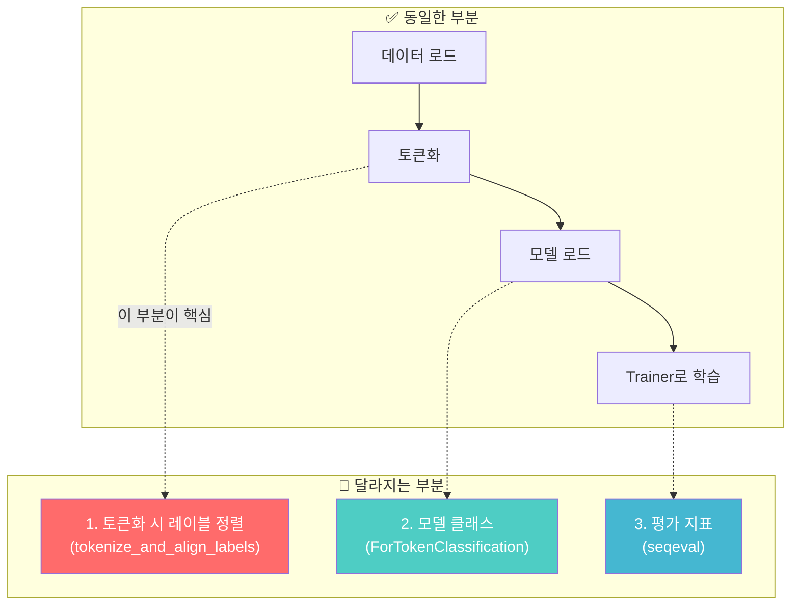
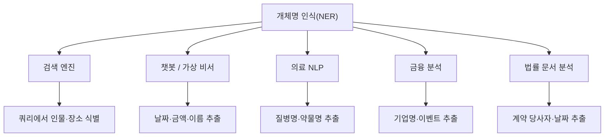
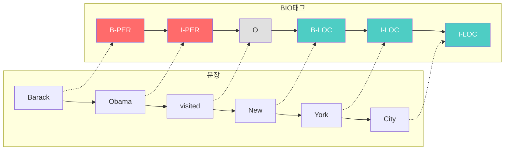
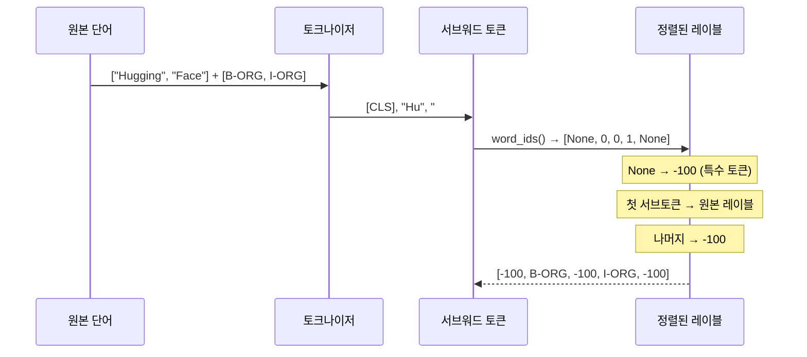
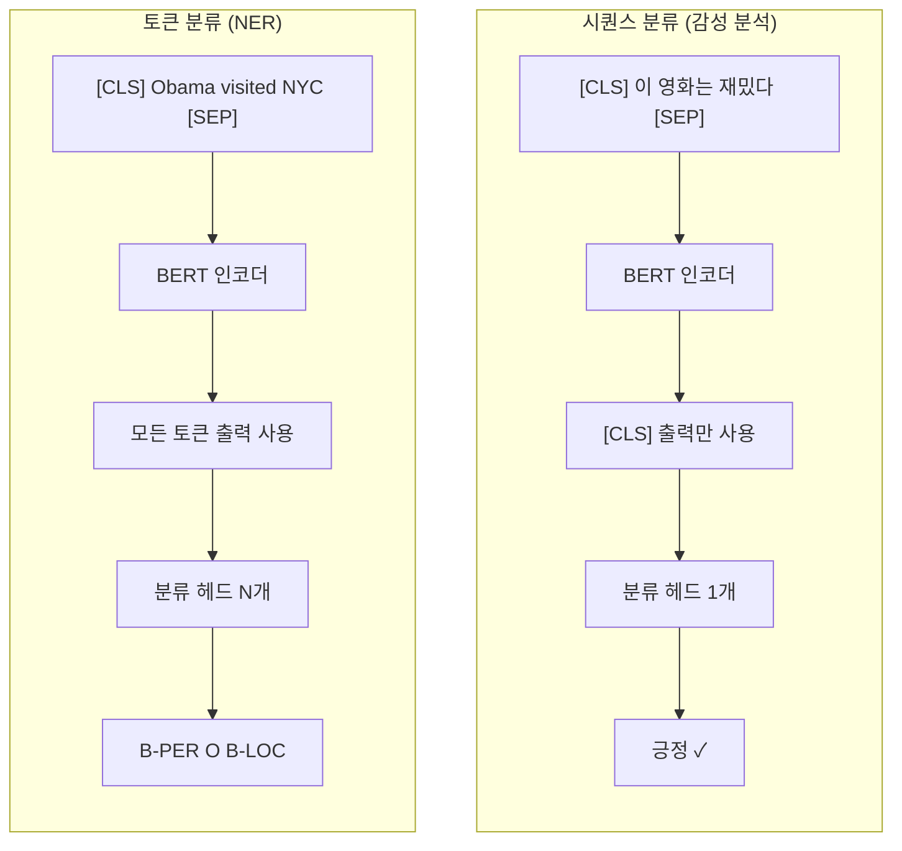
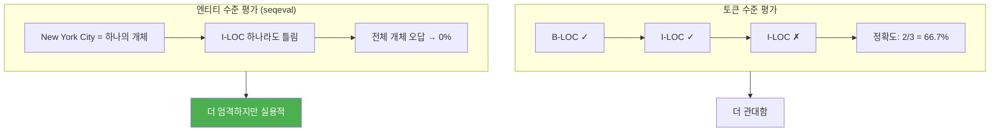

# 토큰 분류(NER) 파인튜닝

> BERT를 활용하여 개체명 인식(Named Entity Recognition) 태스크를 파인튜닝하고, 서브워드-레이블 정렬의 핵심 기법을 마스터합니다.

## 개요

이 섹션에서는 시퀀스 분류를 넘어 **토큰 단위 분류** 태스크인 개체명 인식(NER)을 다룹니다. 문장 전체에 하나의 레이블을 붙이는 감성 분석과 달리, NER은 각 토큰마다 레이블을 예측해야 하기 때문에 데이터 전처리 과정이 훨씬 복잡해지는데요. 특히 서브워드 토크나이제이션으로 인해 원본 단어와 토큰의 개수가 달라지는 **정렬(alignment) 문제**를 해결하는 것이 핵심입니다.

> 💡 이 섹션은 [Trainer API로 텍스트 분류 파인튜닝](19-ch19-파인튜닝과-전이학습/02-02-trainer-api로-텍스트-분류-파인튜닝.md)의 연장선입니다. 앞서 배운 `Trainer`, `TrainingArguments`, `compute_metrics`를 그대로 활용하되, **데이터 전처리 방식만 달라집니다.** 이전 섹션의 [커스텀 학습 루프](19-ch19-파인튜닝과-전이학습/03-03-커스텀-학습-루프로-파인튜닝.md) 경험이 있으면 내부 동작 이해에 도움이 되지만, 이 섹션은 Trainer API 기반으로 진행하므로 **커스텀 루프를 모르셔도 전혀 문제없습니다.**

**선수 지식**:
- [Trainer API로 텍스트 분류 파인튜닝](19-ch19-파인튜닝과-전이학습/02-02-trainer-api로-텍스트-분류-파인튜닝.md)에서 배운 TrainingArguments, Trainer 사용법 **(필수)**
- [서브워드 토크나이제이션](15-ch15-서브워드-토크나이제이션/01-01-서브워드-토크나이제이션의-필요성.md)에서 배운 서브워드 분할 개념 **(필수)**
- [커스텀 학습 루프로 파인튜닝](19-ch19-파인튜닝과-전이학습/03-03-커스텀-학습-루프로-파인튜닝.md) — PyTorch 학습 루프 구조 (선택, 없어도 무방)

**학습 목표**:
- BIO 태깅 체계를 이해하고 개체명 인식 태스크의 구조를 설명할 수 있다
- 서브워드 토큰과 원본 레이블을 정렬하는 `tokenize_and_align_labels` 함수를 구현할 수 있다
- `AutoModelForTokenClassification`으로 BERT NER 모델을 파인튜닝할 수 있다
- seqeval 기반 엔티티 수준 평가 지표를 계산하고 해석할 수 있다

## 왜 알아야 할까?

지금까지 우리는 문장 하나에 "긍정/부정" 같은 레이블 하나를 붙이는 **시퀀스 분류**를 다뤘습니다. 하지만 실제 NLP 애플리케이션에서는 문장 속 **각 단어가 무엇인지** 파악해야 하는 경우가 훨씬 많죠.

예를 들어 볼까요?

> "**삼성전자**가 **서울** **코엑스**에서 **갤럭시 S26**을 발표했다."

이 문장에서 "삼성전자"는 조직(ORG), "서울"과 "코엑스"는 장소(LOC), "갤럭시 S26"은 기타(MISC) 개체입니다. 이처럼 텍스트에서 사람, 장소, 조직 등의 **개체명(Named Entity)**을 자동으로 인식하는 것이 NER이에요.

### 시퀀스 분류에서 토큰 분류로 — 무엇이 달라질까?

이전 섹션에서 Trainer API로 감성 분석 모델을 파인튜닝했던 경험을 떠올려 보세요. 핵심 흐름은 **데이터 로드 → 토큰화 → 모델 로드 → Trainer로 학습** 이었죠. NER도 이 흐름은 완전히 동일합니다! 달라지는 것은 딱 세 가지입니다:

> 📊 **그림 1**: 시퀀스 분류와 토큰 분류의 차이점



특히 **1번 레이블 정렬**이 NER 파인튜닝에서 가장 어려운 부분인데요, 이 섹션에서 차근차근 설명하겠습니다. 나머지는 이전에 배운 Trainer API 지식으로 충분합니다.

NER은 다음과 같은 실무 시나리오에서 핵심적으로 사용됩니다:

- **검색 엔진**: 검색 쿼리에서 인물, 장소, 브랜드를 식별
- **챗봇/가상 비서**: 사용자 발화에서 날짜, 금액, 이름 추출
- **의료 NLP**: 진료 기록에서 질병명, 약물명, 증상 자동 추출
- **금융**: 뉴스에서 기업명, 금액, 이벤트 추출하여 자동 분석

> 📊 **그림 2**: NER 태스크의 실무 활용 분야



## 핵심 개념

### 개념 1: BIO 태깅 체계 — 개체의 시작과 끝을 표현하는 방법

> 💡 **비유**: BIO 태깅은 마치 형광펜으로 책에 밑줄을 치는 것과 같습니다. 형광펜을 처음 대는 지점이 **B**(Beginning), 같은 색으로 이어서 칠하는 부분이 **I**(Inside), 밑줄이 없는 나머지 텍스트는 **O**(Outside)입니다. 바로 옆에 같은 색 밑줄이 새로 시작되면 다시 **B**를 표시해야 구분이 되겠죠.

NER에서 가장 널리 쓰이는 태깅 체계는 **BIO(Beginning-Inside-Outside)** 형식입니다. 각 토큰에 다음 중 하나의 레이블을 부여합니다:

| 태그 | 의미 | 예시 |
|------|------|------|
| `B-XXX` | 개체 XXX의 **시작** 토큰 | `B-PER` = 인물 개체의 첫 토큰 |
| `I-XXX` | 개체 XXX의 **내부** 토큰 | `I-PER` = 인물 개체의 연속 토큰 |
| `O` | 개체에 속하지 **않는** 토큰 | 일반 텍스트 |

CoNLL-2003 데이터셋의 실제 레이블 셋을 살펴보면:

```
O(0), B-PER(1), I-PER(2), B-ORG(3), I-ORG(4), B-LOC(5), I-LOC(6), B-MISC(7), I-MISC(8)
```

구체적인 예시를 보겠습니다:

```run:python
# BIO 태깅 예시
sentence = ["Barack", "Obama", "visited", "New", "York", "City"]
labels  = ["B-PER",  "I-PER",  "O",       "B-LOC", "I-LOC", "I-LOC"]

for token, label in zip(sentence, labels):
    print(f"{token:12s} → {label}")
```

```output
Barack       → B-PER
Obama        → I-PER
visited      → O
New          → B-LOC
York         → I-LOC
City         → I-LOC
```

"Barack Obama"는 하나의 인물 개체로, "Barack"이 시작(B-PER), "Obama"가 내부(I-PER)입니다. "New York City"도 하나의 장소 개체로, "New"가 시작(B-LOC), "York"과 "City"가 내부(I-LOC)이죠.

> 📊 **그림 3**: BIO 태깅 체계의 동작 원리



B 태그가 왜 필요한지 궁금하실 수 있는데요. 만약 두 개의 같은 유형 개체가 연속으로 나오면 어떻게 될까요?

```
"Obama met Trump in Washington"
→ B-PER O B-PER O B-LOC
```

B 태그 없이 I만 쓴다면 "Obama"와 "Trump"를 하나의 개체로 오인할 수 있습니다. B 태그가 **새로운 개체의 경계**를 명확히 구분해 주는 거죠.

### 개념 2: 서브워드-레이블 정렬 — NER 파인튜닝의 핵심 난관

> 💡 **비유**: 원본 문장이 5단어이고 레이블도 5개인데, 토크나이저가 단어를 쪼개서 토큰이 8개가 되었다면? 마치 5명분의 이름표를 8개의 자리에 배분해야 하는 상황이에요. 쪼개진 자리(서브워드)에는 "해당 없음(-100)" 표시를 해서 손실 계산에서 제외시킵니다.

이 부분이 NER과 시퀀스 분류의 **가장 큰 차이점**입니다. [시퀀스 분류](19-ch19-파인튜닝과-전이학습/02-02-trainer-api로-텍스트-분류-파인튜닝.md)에서는 문장 전체에 하나의 레이블만 있으므로 토큰화가 단순했죠. 하지만 NER에서는 **각 토큰마다 레이블이 있기 때문에** 서브워드 토큰화 후 레이블을 정렬해야 합니다.

먼저 간단한 예시로 문제를 이해해 봅시다:

```run:python
# 서브워드 정렬 문제를 직관적으로 이해하기
# (실제 토크나이저 없이 개념만 보여주는 예시)

words =    ["Hugging",  "Face",   "Inc",   "is",  "in",  "New",   "York"]
labels =   ["B-ORG",    "I-ORG",  "I-ORG", "O",   "O",   "B-LOC", "I-LOC"]

# 토크나이저가 "Hugging"을 "Hu" + "##gging"으로 쪼갰다고 가정
tokens =   ["[CLS]", "Hu", "##gging", "Face", "Inc", "is", "in", "New", "York", "[SEP]"]
aligned =  [ -100,  "B-ORG", -100,   "I-ORG","I-ORG","O",  "O","B-LOC","I-LOC", -100]

print("서브워드 토큰과 정렬된 레이블:")
for tok, lab in zip(tokens, aligned):
    marker = "← 무시" if lab == -100 else ""
    print(f"  {tok:12s} → {str(lab):8s} {marker}")
```

```output
서브워드 토큰과 정렬된 레이블:
  [CLS]        → -100     ← 무시
  Hu           → B-ORG   
  ##gging      → -100     ← 무시
  Face         → I-ORG   
  Inc          → I-ORG   
  is           → O       
  in           → O       
  New          → B-LOC   
  York         → I-LOC   
  [SEP]        → -100     ← 무시
```

핵심이 보이시나요? 정렬 규칙은 세 줄로 요약됩니다:

1. **특수 토큰** (`[CLS]`, `[SEP]`, `[PAD]`): 레이블을 **-100**으로 설정 → 손실 함수가 무시
2. **단어의 첫 번째 서브토큰**: 원본 레이블을 **그대로** 부여
3. **단어의 나머지 서브토큰** (`##gging` 등): 레이블을 **-100**으로 설정

> 📊 **그림 4**: 서브워드-레이블 정렬 과정



이 정렬을 구현하는 핵심 함수가 바로 `tokenize_and_align_labels`입니다:

```python
def tokenize_and_align_labels(examples, tokenizer):
    """서브워드 토큰과 NER 레이블을 정렬하는 함수"""
    tokenized_inputs = tokenizer(
        examples["tokens"],
        truncation=True,
        is_split_into_words=True,  # 이미 단어 단위로 분리된 입력
    )

    labels = []
    for i, label in enumerate(examples["ner_tags"]):
        word_ids = tokenized_inputs.word_ids(batch_index=i)
        previous_word_idx = None
        label_ids = []
        for word_idx in word_ids:
            if word_idx is None:
                # 특수 토큰 → -100
                label_ids.append(-100)
            elif word_idx != previous_word_idx:
                # 새 단어의 첫 번째 서브토큰 → 원본 레이블
                label_ids.append(label[word_idx])
            else:
                # 같은 단어의 나머지 서브토큰 → -100
                label_ids.append(-100)
            previous_word_idx = word_idx
        labels.append(label_ids)

    tokenized_inputs["labels"] = labels
    return tokenized_inputs
```

핵심은 `word_ids()` 메서드입니다. 이 메서드는 각 서브워드 토큰이 원본 문장의 **몇 번째 단어**에서 왔는지를 반환합니다. 특수 토큰은 `None`을 반환하고요. `previous_word_idx`와 비교하여 같은 단어의 첫 번째 서브토큰인지 판별하는 거죠.

> ⚠️ **흔한 오해**: "모든 서브토큰에 원본 레이블을 복사하면 되지 않나?"라고 생각할 수 있습니다. 하지만 이렇게 하면 "Hu"→B-ORG, "##gging"→B-ORG가 되어 한 단어가 두 개의 개체로 인식될 수 있습니다. seqeval은 B 태그를 개체의 시작으로 카운트하므로 평가 지표가 왜곡됩니다.

### 개념 3: AutoModelForTokenClassification과 NER 파이프라인

> 💡 **비유**: 시퀀스 분류에서는 문장 전체를 대표하는 `[CLS]` 토큰 하나에 분류 헤드를 올렸다면, 토큰 분류에서는 **모든 토큰 위에** 각각 분류 헤드를 올리는 겁니다. 마치 교실에서 한 명의 반장만 뽑는 게 아니라, 모든 학생에게 역할(학급 임원, 일반 학생 등)을 부여하는 것과 비슷하죠.

Hugging Face Transformers에서 토큰 분류 모델은 `AutoModelForTokenClassification`으로 로드합니다. 이 모델은 BERT의 각 토큰 출력 위에 `nn.Linear(hidden_size, num_labels)` 분류 레이어를 추가한 구조입니다.

[시퀀스 분류](19-ch19-파인튜닝과-전이학습/02-02-trainer-api로-텍스트-분류-파인튜닝.md)에서 `AutoModelForSequenceClassification`을 사용했던 것과 비교해 보세요. **모델 클래스 이름만 바뀔 뿐**, 로드 방식과 사용법은 거의 동일합니다.

> 📊 **그림 5**: 시퀀스 분류 vs 토큰 분류 아키텍처 비교



전체 NER 파인튜닝 파이프라인을 정리하면 다음과 같습니다:

```python
from transformers import (
    AutoTokenizer,
    AutoModelForTokenClassification,
    TrainingArguments,
    Trainer,
    DataCollatorForTokenClassification,
)
from datasets import load_dataset
import evaluate
import numpy as np

# 1. 데이터셋 로드
dataset = load_dataset("conll2003")

# 2. 레이블 정보 추출
label_list = dataset["train"].features["ner_tags"].feature.names
# ['O', 'B-PER', 'I-PER', 'B-ORG', 'I-ORG', 'B-LOC', 'I-LOC', 'B-MISC', 'I-MISC']

id2label = {i: label for i, label in enumerate(label_list)}
label2id = {label: i for i, label in enumerate(label_list)}

# 3. 토크나이저 & 모델 로드
model_name = "bert-base-cased"
tokenizer = AutoTokenizer.from_pretrained(model_name)
model = AutoModelForTokenClassification.from_pretrained(
    model_name,
    num_labels=len(label_list),
    id2label=id2label,
    label2id=label2id,
)
```

여기서 주목할 점은 `bert-base-cased`를 사용한다는 것입니다. NER에서는 대소문자가 중요한 단서가 되거든요. "Apple"(회사)과 "apple"(과일)을 구분해야 하니까요. 그래서 `uncased` 대신 **`cased`** 모델을 쓰는 것이 일반적입니다.

### 개념 4: 엔티티 수준 평가 — seqeval 지표

NER 모델의 성능을 평가할 때는 **토큰 수준**이 아닌 **엔티티 수준**으로 평가해야 합니다. "New York City"를 예로 들면, 세 토큰(B-LOC, I-LOC, I-LOC)을 **모두 정확하게** 맞춰야 하나의 정답으로 인정됩니다. 한 토큰이라도 틀리면 해당 개체 전체가 오답이 되는 거죠.

이전 섹션에서 감성 분석에 `evaluate.load("accuracy")`를 사용했던 것처럼, NER에서는 `evaluate.load("seqeval")`을 사용합니다. **사용 패턴은 동일**하되, 지표의 의미가 다릅니다:

```python
import evaluate

# seqeval 메트릭 로드
seqeval_metric = evaluate.load("seqeval")

def compute_metrics(p):
    """엔티티 수준 NER 평가 지표 계산"""
    predictions, labels = p
    predictions = np.argmax(predictions, axis=2)

    # -100 레이블을 제외하고 문자열 레이블로 변환
    true_predictions = [
        [label_list[p] for (p, l) in zip(prediction, label) if l != -100]
        for prediction, label in zip(predictions, labels)
    ]
    true_labels = [
        [label_list[l] for (p, l) in zip(prediction, label) if l != -100]
        for prediction, label in zip(predictions, labels)
    ]

    results = seqeval_metric.compute(
        predictions=true_predictions,
        references=true_labels,
    )
    return {
        "precision": results["overall_precision"],
        "recall": results["overall_recall"],
        "f1": results["overall_f1"],
        "accuracy": results["overall_accuracy"],
    }
```

> 📊 **그림 6**: 토큰 수준 vs 엔티티 수준 평가 차이



seqeval은 개체 유형별로도 precision, recall, F1을 제공합니다. 예를 들어 "PER은 잘 맞추는데 MISC는 못 맞추는" 패턴을 분석할 수 있어서 모델의 약점을 구체적으로 파악할 수 있죠.

## 실습: 직접 해보기

이제 CoNLL-2003 데이터셋으로 BERT NER 모델을 파인튜닝하는 전체 코드를 작성해 보겠습니다. 이전 섹션에서 Trainer API로 감성 분석 모델을 파인튜닝했던 흐름과 비교하면서 읽어 보세요 — 대부분의 코드가 익숙할 겁니다.

### Step 1: 데이터셋 탐색

```run:python
from datasets import load_dataset

# CoNLL-2003 데이터셋 로드
dataset = load_dataset("conll2003")
print(dataset)
print()

# 첫 번째 예시 확인
example = dataset["train"][0]
print("토큰:", example["tokens"])
print("NER 태그:", example["ner_tags"])

# 레이블 이름 매핑
label_list = dataset["train"].features["ner_tags"].feature.names
print("레이블 목록:", label_list)

# 태그를 문자열로 변환
named_tags = [label_list[tag] for tag in example["ner_tags"]]
for token, tag in zip(example["tokens"], named_tags):
    print(f"  {token:20s} → {tag}")
```

```output
DatasetDict({
    train: Dataset({
        features: ['id', 'tokens', 'pos_tags', 'chunk_tags', 'ner_tags'],
        num_rows: 14041
    })
    validation: Dataset({
        features: ['id', 'tokens', 'pos_tags', 'chunk_tags', 'ner_tags'],
        num_rows: 3250
    })
    test: Dataset({
        features: ['id', 'tokens', 'pos_tags', 'chunk_tags', 'ner_tags'],
        num_rows: 3453
    })
})

토큰: ['EU', 'rejects', 'German', 'call', 'to', 'boycott', 'British', 'lamb', '.']
NER 태그: [3, 0, 7, 0, 0, 0, 7, 0, 0]
레이블 목록: ['O', 'B-PER', 'I-PER', 'B-ORG', 'I-ORG', 'B-LOC', 'I-LOC', 'B-MISC', 'I-MISC']
  EU                   → B-ORG
  rejects              → O
  German               → B-MISC
  call                 → O
  to                   → O
  boycott              → O
  British              → B-MISC
  lamb                 → O
  .                    → O
```

### Step 2: 토큰화 및 레이블 정렬

```python
from transformers import AutoTokenizer

model_name = "bert-base-cased"
tokenizer = AutoTokenizer.from_pretrained(model_name)

def tokenize_and_align_labels(examples):
    """서브워드 토큰과 NER 레이블을 정렬"""
    tokenized_inputs = tokenizer(
        examples["tokens"],
        truncation=True,
        is_split_into_words=True,  # 단어 리스트 입력임을 명시
    )

    labels = []
    for i, label in enumerate(examples["ner_tags"]):
        word_ids = tokenized_inputs.word_ids(batch_index=i)
        previous_word_idx = None
        label_ids = []
        for word_idx in word_ids:
            if word_idx is None:
                label_ids.append(-100)          # 특수 토큰
            elif word_idx != previous_word_idx:
                label_ids.append(label[word_idx])  # 첫 서브토큰
            else:
                label_ids.append(-100)          # 나머지 서브토큰
            previous_word_idx = word_idx
        labels.append(label_ids)

    tokenized_inputs["labels"] = labels
    return tokenized_inputs

# 전체 데이터셋에 적용
tokenized_datasets = dataset.map(
    tokenize_and_align_labels,
    batched=True,
    remove_columns=dataset["train"].column_names,
)

print("토큰화 완료:", tokenized_datasets)
```

### Step 3: 모델 및 학습 설정

```python
from transformers import (
    AutoModelForTokenClassification,
    TrainingArguments,
    Trainer,
    DataCollatorForTokenClassification,
)
import evaluate
import numpy as np

# 레이블 매핑
id2label = {i: label for i, label in enumerate(label_list)}
label2id = {label: i for i, label in enumerate(label_list)}

# 모델 로드 — num_labels로 분류 헤드 크기 지정
model = AutoModelForTokenClassification.from_pretrained(
    model_name,
    num_labels=len(label_list),
    id2label=id2label,
    label2id=label2id,
)

# 데이터 콜레이터 — 토큰 분류 전용 (레이블도 함께 패딩)
data_collator = DataCollatorForTokenClassification(
    tokenizer=tokenizer,
    padding=True,
    label_pad_token_id=-100,  # 패딩 위치의 레이블도 -100
)

# 평가 지표 설정
seqeval = evaluate.load("seqeval")

def compute_metrics(p):
    predictions, labels = p
    predictions = np.argmax(predictions, axis=2)

    true_predictions = [
        [label_list[pred] for (pred, lab) in zip(prediction, label) if lab != -100]
        for prediction, label in zip(predictions, labels)
    ]
    true_labels = [
        [label_list[lab] for (pred, lab) in zip(prediction, label) if lab != -100]
        for prediction, label in zip(predictions, labels)
    ]

    results = seqeval.compute(predictions=true_predictions, references=true_labels)
    return {
        "precision": results["overall_precision"],
        "recall": results["overall_recall"],
        "f1": results["overall_f1"],
        "accuracy": results["overall_accuracy"],
    }
```

### Step 4: 학습 실행

```python
# 학습 인자 설정 — 시퀀스 분류와 거의 동일합니다!
training_args = TrainingArguments(
    output_dir="./ner-bert-conll2003",
    eval_strategy="epoch",        # 매 에폭마다 평가
    save_strategy="epoch",
    learning_rate=2e-5,
    per_device_train_batch_size=16,
    per_device_eval_batch_size=32,
    num_train_epochs=3,
    weight_decay=0.01,
    logging_steps=100,
    load_best_model_at_end=True,  # 최고 성능 모델 자동 로드
    metric_for_best_model="f1",   # F1 기준으로 최고 모델 선택
    fp16=True,                    # 혼합 정밀도 (GPU 필요)
)

# Trainer 생성 — 시퀀스 분류와 동일한 패턴!
trainer = Trainer(
    model=model,
    args=training_args,
    train_dataset=tokenized_datasets["train"],
    eval_dataset=tokenized_datasets["validation"],
    tokenizer=tokenizer,
    data_collator=data_collator,
    compute_metrics=compute_metrics,
)

# 학습 시작
trainer.train()

# 테스트 세트 평가
results = trainer.evaluate(tokenized_datasets["test"])
print(f"\n테스트 F1: {results['eval_f1']:.4f}")
print(f"테스트 Precision: {results['eval_precision']:.4f}")
print(f"테스트 Recall: {results['eval_recall']:.4f}")
```

### Step 5: 학습된 모델로 추론

```run:python
from transformers import pipeline

# 학습된 모델로 NER 파이프라인 생성
ner_pipeline = pipeline(
    "ner",
    model="dslim/bert-base-NER",  # 사전학습된 NER 모델 (데모용)
    aggregation_strategy="simple",  # 서브워드를 단어 단위로 병합
)

# 추론
text = "Elon Musk founded SpaceX in Hawthorne, California."
results = ner_pipeline(text)

for entity in results:
    print(f"  {entity['word']:20s} | {entity['entity_group']:6s} | "
          f"score: {entity['score']:.4f}")
```

```output
  Elon Musk            | PER    | score: 0.9991
  SpaceX               | ORG    | score: 0.9985
  Hawthorne            | LOC    | score: 0.9976
  California           | LOC    | score: 0.9995
```

`aggregation_strategy="simple"`을 지정하면 파이프라인이 서브워드 토큰들을 자동으로 병합하여 단어 단위 결과를 반환합니다. 실제 서비스에서는 이 파이프라인 API로 간편하게 NER을 수행할 수 있죠.

## 더 깊이 알아보기

### CoNLL 공유 태스크와 NER의 역사

NER이라는 태스크가 학계에서 본격적으로 주목받기 시작한 것은 **1995년 MUC-6(Message Understanding Conference)** 대회부터입니다. 미국 DARPA가 후원한 이 대회에서 "Named Entity"라는 용어가 처음 공식적으로 사용되었는데, 당시 참가자들이 "이게 무슨 이름이 좋을까" 토론하다가 한 연구자가 "그냥 Named Entity라고 부르자"고 제안해서 정해졌다는 일화가 있습니다.

이후 2003년, Erik Tjong Kim Sang와 Fien De Meulder가 **CoNLL-2003 공유 태스크**를 조직하면서 NER 연구의 표준 벤치마크가 탄생했습니다. 로이터 뉴스 기사를 기반으로 한 이 데이터셋은 영어와 독일어 두 버전으로 만들어졌고, 20년이 지난 지금도 NER 모델 평가의 사실상 표준(de facto standard)으로 사용되고 있습니다.

재미있는 것은, 2003년 당시 최고 성능은 F1 88.76%였는데, BERT가 등장한 2018년 이후 F1 93% 이상으로 급등했다는 점입니다. 딥러닝과 사전학습 모델이 NER 분야에 가져온 혁신이 얼마나 큰지를 보여주는 수치죠.

### BIO에서 BIOES까지 — 태깅 체계의 진화

BIO 외에도 **BIOES**(B-I-O-E-S) 태깅이 있습니다. E(End)는 개체의 마지막 토큰, S(Single)는 단일 토큰 개체를 표시합니다. 연구에 따르면 BIOES가 BIO보다 약간 더 높은 성능을 보이지만, 레이블 수가 늘어나 데이터 희소성 문제가 생길 수 있어서 CoNLL-2003은 BIO를 표준으로 유지했습니다.

## 흔한 오해와 팁

> ⚠️ **흔한 오해**: "NER은 시퀀스 분류와 비슷하니까 코드도 거의 같을 것이다." Trainer와 TrainingArguments 사용 패턴은 거의 같지만, `tokenize_and_align_labels`, `DataCollatorForTokenClassification`, `seqeval` 등 **토큰 분류 전용 컴포넌트 3가지**가 추가됩니다. 특히 서브워드 정렬 로직을 빠뜨리면 학습은 돌아가지만 성능이 크게 떨어지므로 주의하세요.

> 💡 **알고 계셨나요?**: CoNLL-2003 데이터셋의 원본은 로이터 통신 뉴스 기사에서 가져온 것인데, 저작권 문제로 원본 텍스트 배포가 제한된 적이 있습니다. Hugging Face의 `eriktks/conll2003` 데이터셋은 이 문제를 해결한 공식 버전입니다.

> 🔥 **실무 팁**: NER 파인튜닝 시 `bert-base-uncased`가 아닌 **`bert-base-cased`**를 사용하세요. 대소문자 구분이 고유명사 식별에 매우 중요합니다. 또한 학습률은 시퀀스 분류(2e-5~5e-5)와 비슷하지만, NER은 레이블 불균형(대부분의 토큰이 O)이 심하므로 에폭 수를 3~5로 약간 늘리는 것이 좋습니다.

> 🔥 **실무 팁**: 한국어 NER을 수행할 때는 `klue/bert-base` 모델과 KLUE-NER 데이터셋(`klue`, `ner` 태스크)을 사용하세요. 한국어는 교착어 특성상 형태소 분석 기반 토큰화가 성능에 큰 영향을 미칩니다.

## 핵심 정리

| 개념 | 설명 |
|------|------|
| BIO 태깅 | B(시작), I(내부), O(외부)로 개체 경계를 표시하는 표준 태깅 체계 |
| 서브워드-레이블 정렬 | `word_ids()`로 서브토큰을 원본 단어에 매핑, 첫 서브토큰만 레이블 부여, 나머지는 -100 |
| `is_split_into_words=True` | 토크나이저에 입력이 이미 단어 리스트임을 알려주는 핵심 인자 |
| `AutoModelForTokenClassification` | 모든 토큰 위치에 분류 헤드를 추가한 BERT 변형 |
| `DataCollatorForTokenClassification` | 입력 토큰과 레이블을 함께 동적 패딩하는 전용 콜레이터 |
| seqeval | 엔티티 수준(span-level) precision, recall, F1을 계산하는 평가 라이브러리 |
| `aggregation_strategy="simple"` | 추론 시 서브워드 결과를 단어 단위로 자동 병합하는 파이프라인 옵션 |
| `bert-base-cased` | NER에서 대소문자 구분이 중요하므로 cased 모델 사용 권장 |

## 다음 섹션 미리보기

이번 섹션에서 파인튜닝한 모델을 실제로 **저장하고 다른 사람과 공유하려면** 어떻게 해야 할까요? 다음 섹션 [모델 저장·공유·배포](19-ch19-파인튜닝과-전이학습/05-05-모델-저장-공유-배포.md)에서는 `save_pretrained()`와 `push_to_hub()`를 사용한 모델 저장, Hugging Face Hub에 모델을 업로드하는 방법, 그리고 ONNX 변환을 통한 프로덕션 배포까지 다룹니다. 파인튜닝의 마지막 퍼즐 조각을 맞춰 보겠습니다.

## 참고 자료

- [Token classification — Hugging Face Transformers 공식 문서](https://huggingface.co/docs/transformers/en/tasks/token_classification) - BERT NER 파인튜닝의 전체 워크플로를 단계별로 설명하는 공식 가이드
- [Token classification — Hugging Face NLP Course Ch7](https://huggingface.co/learn/llm-course/en/chapter7/2) - 서브워드 정렬, seqeval 평가까지 포함한 상세 튜토리얼
- [seqeval — 시퀀스 레이블링 평가 프레임워크](https://github.com/chakki-works/seqeval) - NER, POS 태깅 등 시퀀스 레이블링 태스크의 표준 평가 라이브러리
- [CoNLL-2003 데이터셋 — Hugging Face Datasets](https://huggingface.co/datasets/eriktks/conll2003) - NER 벤치마크의 사실상 표준인 CoNLL-2003 데이터셋
- [dslim/bert-base-NER — Hugging Face Model Hub](https://huggingface.co/dslim/bert-base-NER) - CoNLL-2003으로 파인튜닝된 BERT NER 모델, 바로 사용 가능

---
### 🔗 Related Sessions
- [autotokenizer](15-ch15-서브워드-토크나이제이션/04-04-sentencepiece와-hugging-face-tokenizers.md) (prerequisite)
- [trainingarguments](19-ch19-파인튜닝과-전이학습/02-02-trainer-api로-텍스트-분류-파인튜닝.md) (prerequisite)
- [trainer](19-ch19-파인튜닝과-전이학습/02-02-trainer-api로-텍스트-분류-파인튜닝.md) (prerequisite)
- [compute_metrics](19-ch19-파인튜닝과-전이학습/02-02-trainer-api로-텍스트-분류-파인튜닝.md) (prerequisite)
- [evaluate.load](19-ch19-파인튜닝과-전이학습/02-02-trainer-api로-텍스트-분류-파인튜닝.md) (prerequisite)
