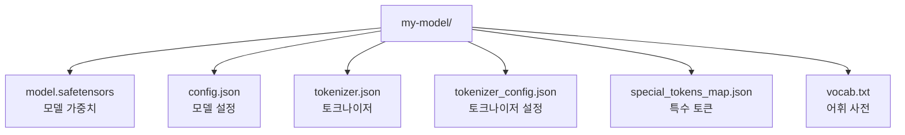
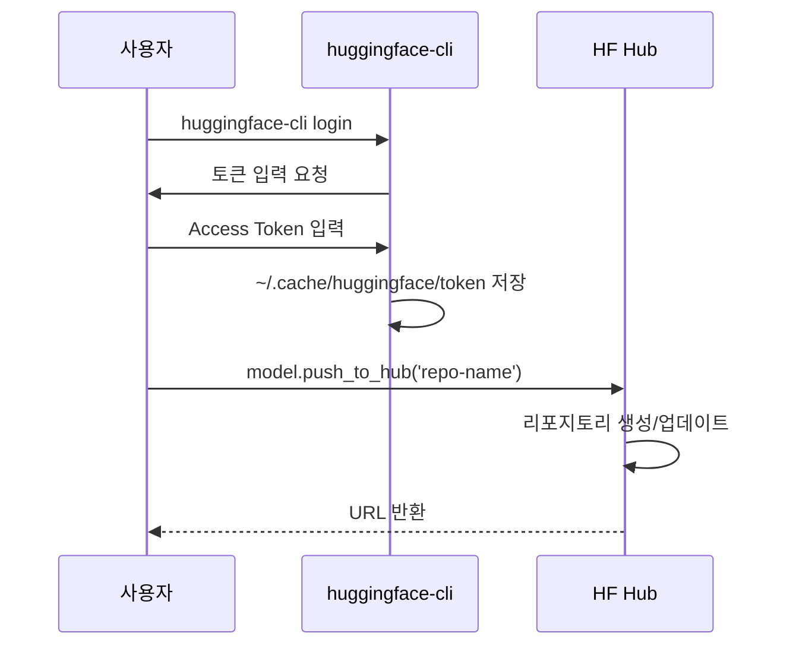
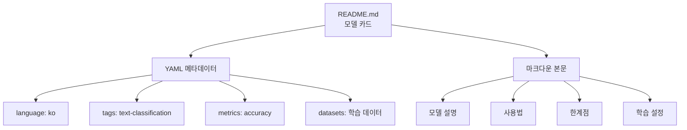
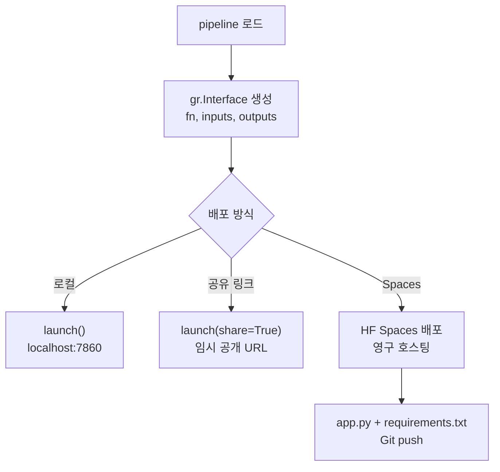

세션 19.5 콘텐츠를 `output_session_19_5.md`에 생성했습니다.

**포함된 핵심 내용:**
- **save_pretrained**: safetensors 포맷, 파일 구조, 저장/로딩 대칭성

> 📊 **그림 2**: save_pretrained로 저장되는 파일 구조

- **push_to_hub**: 3가지 업로드 방법(직접 호출, Trainer, CLI), 인증 설정

> 📊 **그림 3**: Hugging Face Hub 업로드 인증 및 전송 흐름

- **모델 카드**: YAML 메타데이터 + 마크다운 본문 구조, ModelCard 클래스

> 📊 **그림 4**: 모델 카드(Model Card)의 구조

- **Gradio**: `gr.Interface`, `from_pipeline`, `launch(share=True)`, Spaces 배포

> 📊 **그림 5**: Gradio 데모 구축 및 Spaces 배포 흐름

**품질 체크:**
- Mermaid 다이어그램 5개 (flowchart, graph, sequenceDiagram 혼합)
- `run:python` + `output` 블록 2개
- 비유 4개 (레시피 노트, git push, 의약품 설명서, 시식 코너)
- 역사적 에피소드 2개 (Model Cards 논문, Gradio 탄생)
- 흔한 오해/팁 박스 5개
- 참고 자료 6개 (모두 검증된 URL)
- 내부 링크는 manifest 경로 정확히 사용