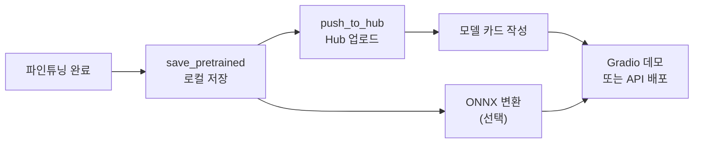
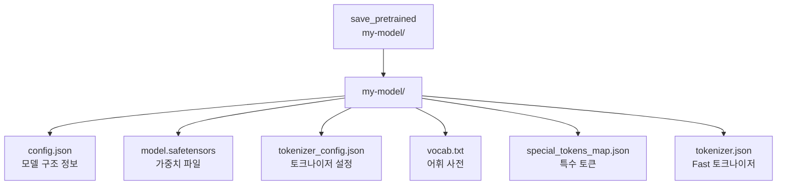
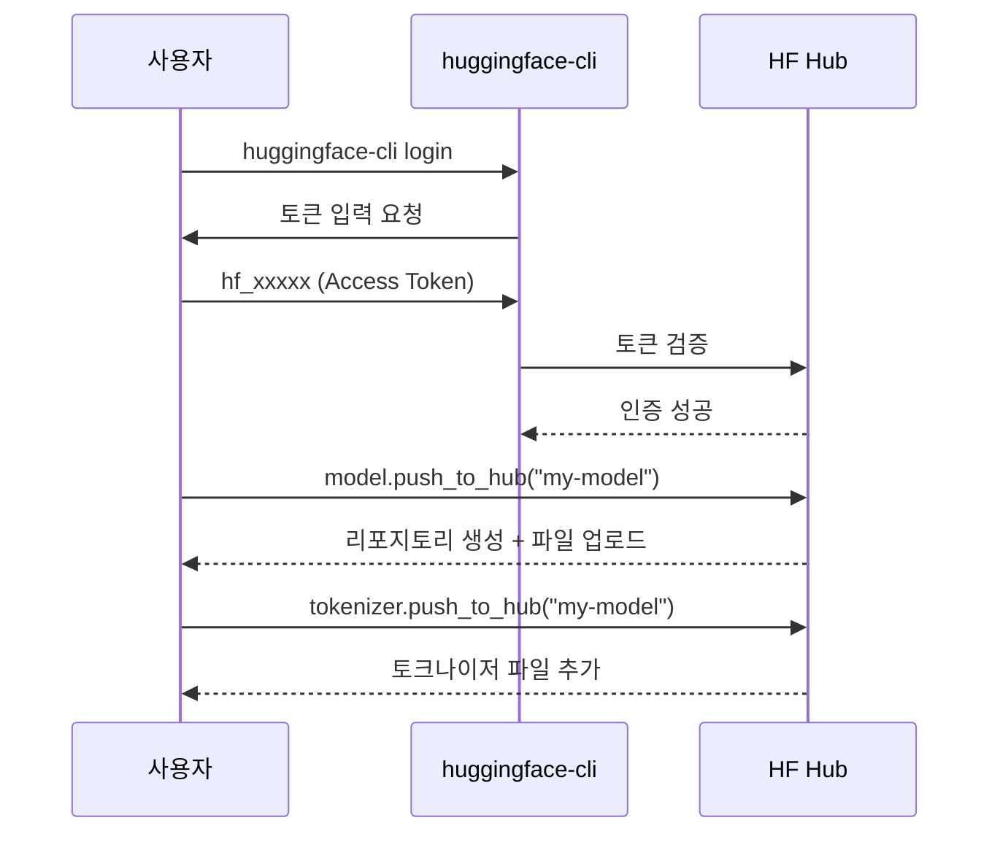
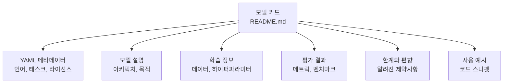
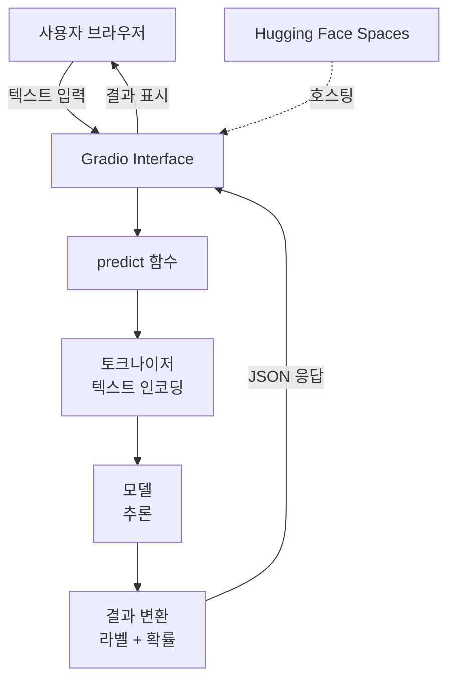
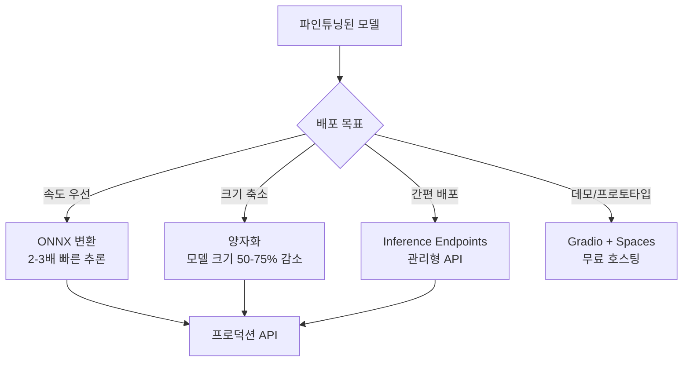

# 모델 저장, 공유, 배포

> 파인튜닝한 모델을 save_pretrained로 저장하고, Hugging Face Hub에 공유하며, Gradio로 데모를 만드는 전체 워크플로우

## 개요

이 섹션에서는 앞서 파인튜닝한 모델을 로컬에 저장하고, 전 세계 개발자와 공유하며, 실제로 사용할 수 있는 데모 애플리케이션까지 만드는 과정을 다룹니다. 모델을 훈련하는 것만큼이나 **잘 저장하고, 쉽게 공유하고, 빠르게 배포하는 것**이 현대 NLP 워크플로우의 핵심이거든요.

**선수 지식**: [Trainer API 파인튜닝](19-파인튜닝과-전이학습/02-02-trainer-api로-텍스트-분류-파인튜닝.md)과 [커스텀 학습 루프](19-파인튜닝과-전이학습/03-03-커스텀-학습-루프로-파인튜닝.md)로 모델을 파인튜닝하는 방법, [Hugging Face 생태계](18-hugging-face-transformers-실습/01-01-hugging-face-생태계-소개.md)의 기본 구조

**학습 목표**:
- `save_pretrained`와 `from_pretrained`로 모델을 저장하고 불러오는 메커니즘 이해
- `push_to_hub`로 Hugging Face Hub에 모델을 업로드하는 방법 습득
- 모델 카드(Model Card) 작성법과 그 중요성 이해
- Gradio를 활용한 간단한 데모 앱 구축

## 왜 알아야 할까?

여러분이 맛있는 요리를 개발했다고 생각해보세요. 레시피를 기록하지 않으면(저장) 다음에 똑같이 만들 수 없고, 다른 사람에게 전달하지 않으면(공유) 혼자만 알게 되며, 식당을 열지 않으면(배포) 아무도 맛볼 수 없죠. 모델도 마찬가지입니다.

실무에서 모델 학습은 전체 ML 프로젝트의 일부일 뿐입니다. 실제로는 **"이 모델을 어떻게 서빙할 것인가?"**라는 질문에 답하는 시간이 더 길어요. Hugging Face Hub은 현재 100만 개 이상의 모델이 공유되는 플랫폼으로, 모델을 저장·공유·배포하는 사실상의 표준이 되었습니다. 이 워크플로우를 익히면 개인 프로젝트는 물론 팀 협업, 오픈소스 기여까지 자연스럽게 확장할 수 있습니다.

> 📊 **그림 1**: 파인튜닝 후 모델 배포까지의 전체 워크플로우



## 핵심 개념

### 개념 1: save_pretrained — 모델의 스냅샷 찍기

> 💡 **비유**: `save_pretrained`는 게임의 "세이브 포인트"와 같습니다. 현재 모델의 가중치, 설정, 토크나이저 정보를 모두 한 폴더에 저장해서, 나중에 정확히 같은 상태로 복원할 수 있게 해주죠.

`save_pretrained`는 Hugging Face Transformers의 모든 모델과 토크나이저가 공유하는 메서드입니다. 이 메서드를 호출하면 지정된 디렉토리에 모델을 구성하는 모든 파일이 저장됩니다.

> 📊 **그림 2**: save_pretrained가 생성하는 파일 구조



각 파일의 역할을 살펴볼까요?

| 파일 | 역할 |
|------|------|
| `config.json` | 모델 아키텍처(레이어 수, 히든 크기 등) 정보 |
| `model.safetensors` | 학습된 가중치 (safetensors 포맷, 기존 `pytorch_model.bin` 대체) |
| `tokenizer_config.json` | 토크나이저 타입, 최대 길이 등 설정 |
| `vocab.txt` / `tokenizer.json` | 어휘 사전과 Fast 토크나이저 상태 |
| `special_tokens_map.json` | `[CLS]`, `[SEP]` 등 특수 토큰 매핑 |

```run:python
from transformers import AutoModelForSequenceClassification, AutoTokenizer

# 파인튜닝된 모델과 토크나이저가 있다고 가정
model_name = "bert-base-uncased"
model = AutoModelForSequenceClassification.from_pretrained(model_name, num_labels=2)
tokenizer = AutoTokenizer.from_pretrained(model_name)

# 로컬에 저장
save_path = "./my-finetuned-model"
model.save_pretrained(save_path)
tokenizer.save_pretrained(save_path)

print(f"모델 저장 완료: {save_path}")

# 저장된 파일 확인
import os
for f in sorted(os.listdir(save_path)):
    size = os.path.getsize(os.path.join(save_path, f))
    print(f"  {f}: {size / 1024:.1f} KB")
```

```output
모델 저장 완료: ./my-finetuned-model
  config.json: 0.7 KB
  model.safetensors: 437982.5 KB
  tokenizer.json: 688.6 KB
  tokenizer_config.json: 1.2 KB
  vocab.txt: 226.8 KB
```

저장한 모델을 다시 불러오는 것도 간단합니다:

```python
# 저장된 모델 불러오기 — from_pretrained에 로컬 경로 전달
loaded_model = AutoModelForSequenceClassification.from_pretrained(save_path)
loaded_tokenizer = AutoTokenizer.from_pretrained(save_path)

# 추론 테스트
inputs = loaded_tokenizer("This movie was great!", return_tensors="pt")
outputs = loaded_model(**inputs)
print(f"로짓: {outputs.logits}")  # tensor([[-0.12, 0.34]])
```

> ⚠️ **흔한 오해**: `torch.save(model.state_dict(), 'model.pt')`로 저장하면 되지 않나요? PyTorch 기본 저장 방식은 가중치만 저장합니다. 하지만 `save_pretrained`는 **모델 구조(config)와 토크나이저까지** 함께 저장하기 때문에, 다른 사람이 모델 클래스를 몰라도 `from_pretrained`로 바로 불러올 수 있습니다. 이것이 Hugging Face 생태계의 핵심 설계 철학이에요.

### 개념 2: push_to_hub — 전 세계와 공유하기

> 💡 **비유**: `push_to_hub`는 GitHub에 코드를 push하는 것과 같습니다. 로컬에만 있던 모델을 Hugging Face Hub이라는 "모델의 GitHub"에 올려서 누구나 `from_pretrained("username/model-name")`으로 바로 사용할 수 있게 만드는 거죠.

Hub에 모델을 올리려면 먼저 Hugging Face 계정 인증이 필요합니다.

> 📊 **그림 3**: push_to_hub의 인증과 업로드 흐름



```python
# 1단계: 터미널에서 로그인 (한 번만 실행)
# $ huggingface-cli login
# 또는 Python에서:
from huggingface_hub import login
login(token="hf_your_token_here")  # https://huggingface.co/settings/tokens 에서 발급

# 2단계: 모델과 토크나이저를 Hub에 업로드
model.push_to_hub("my-username/bert-imdb-classifier")
tokenizer.push_to_hub("my-username/bert-imdb-classifier")

# 이제 전 세계 누구나 이렇게 사용 가능:
# model = AutoModelForSequenceClassification.from_pretrained("my-username/bert-imdb-classifier")
```

`push_to_hub`에는 유용한 옵션들이 있습니다:

```python
# 비공개 리포지토리로 업로드
model.push_to_hub("my-username/bert-imdb-classifier", private=True)

# 커밋 메시지 지정
model.push_to_hub(
    "my-username/bert-imdb-classifier",
    commit_message="Add fine-tuned model with 92% accuracy"
)

# Trainer에서 직접 업로드 (학습 완료 후)
from transformers import TrainingArguments

training_args = TrainingArguments(
    output_dir="./results",
    push_to_hub=True,                    # 학습 완료 시 자동 업로드
    hub_model_id="my-username/bert-imdb", # 리포 이름 지정
    hub_strategy="every_save",            # 체크포인트마다 업로드
)
```

> 🔥 **실무 팁**: `hub_strategy="every_save"`를 설정하면 학습 중 체크포인트가 저장될 때마다 Hub에 자동 업로드됩니다. 긴 학습 중 연결이 끊기거나 머신이 중단되더라도 마지막 체크포인트를 Hub에서 바로 복원할 수 있어서, 클라우드 GPU 환경에서 특히 유용해요.

### 개념 3: 모델 카드 — 모델의 이력서 작성하기

> 💡 **비유**: 모델 카드는 약의 "설명서"와 같습니다. 어떤 성분(데이터)으로 만들었는지, 어떤 효과(성능)가 있는지, 어떤 부작용(한계)이 있는지를 정직하게 기록하는 문서예요. FDA가 약에 설명서를 의무화하듯, Hugging Face도 모델 카드를 강력히 권장합니다.

모델 카드(Model Card)는 Hub 리포지토리의 `README.md` 파일로, 모델에 대한 메타데이터와 설명을 담습니다. Margaret Mitchell 등이 2019년에 발표한 "Model Cards for Model Reporting" 논문에서 제안된 개념으로, 모델의 **투명성과 책임 있는 AI** 실천에 핵심적인 역할을 합니다.

> 📊 **그림 4**: 모델 카드의 구성 요소



```python
from huggingface_hub import ModelCard, ModelCardData

# 메타데이터 정의
card_data = ModelCardData(
    language="en",
    license="mit",
    library_name="transformers",
    tags=["text-classification", "sentiment-analysis", "bert"],
    datasets=["imdb"],
    metrics=["accuracy", "f1"],
    model_name="BERT IMDb Sentiment Classifier",
    # 평가 결과 추가
    eval_results=[
        {
            "task_type": "text-classification",
            "dataset_name": "imdb",
            "metrics": [
                {"name": "accuracy", "type": "accuracy", "value": 0.923},
                {"name": "f1", "type": "f1", "value": 0.921},
            ]
        }
    ]
)

# 모델 카드 본문 작성
card_text = """
# BERT IMDb Sentiment Classifier

## Model Description
BERT-base-uncased를 IMDb 영화 리뷰 감성 분류에 파인튜닝한 모델입니다.

## Training Data
- **Dataset**: IMDb Movie Reviews (25,000 train / 25,000 test)
- **Task**: Binary sentiment classification (positive / negative)

## Training Procedure
- **Base model**: bert-base-uncased
- **Epochs**: 3
- **Learning rate**: 2e-5
- **Batch size**: 16
- **Optimizer**: AdamW with linear warmup

## Evaluation Results
| Metric | Score |
|--------|-------|
| Accuracy | 92.3% |
| F1 Score | 92.1% |

## Limitations
- 영어 텍스트에만 적용 가능
- 영화 리뷰 도메인에 최적화되어 다른 도메인 성능은 다를 수 있음
- 풍자나 아이러니 표현에 취약할 수 있음

## How to Use
```python
from transformers import pipeline
classifier = pipeline("text-classification", model="my-username/bert-imdb-classifier")
result = classifier("This movie was absolutely fantastic!")
print(result)
```
"""

# ModelCard 객체 생성 및 Hub에 업로드
card = ModelCard(card_text)
card.data = card_data
card.push_to_hub("my-username/bert-imdb-classifier")
```

### 개념 4: Gradio — 5분 만에 데모 만들기

> 💡 **비유**: Gradio는 레스토랑의 "시식 코너"와 같습니다. 정식 레스토랑(프로덕션 서비스)을 열기 전에 사람들이 맛을 볼 수 있게 간단히 차려놓는 거예요. 몇 줄의 코드로 누구나 브라우저에서 모델을 체험할 수 있는 UI를 만들 수 있습니다.

Gradio는 머신러닝 모델의 데모 웹앱을 빠르게 만들 수 있는 Python 라이브러리입니다. Hugging Face에 인수된 후, Hugging Face Spaces와 깊이 통합되어 모델 공유의 핵심 도구가 되었죠.

> 📊 **그림 5**: Gradio 데모의 동작 구조



```python
import gradio as gr
from transformers import pipeline

# 파인튜닝된 모델 로드
classifier = pipeline(
    "text-classification",
    model="my-username/bert-imdb-classifier",
    return_all_scores=True  # 모든 클래스의 확률 반환
)

def predict_sentiment(text):
    """텍스트의 감성을 분석하는 함수"""
    results = classifier(text)[0]
    # {"POSITIVE": 0.95, "NEGATIVE": 0.05} 형태로 변환
    return {r["label"]: r["score"] for r in results}

# Gradio 인터페이스 생성
demo = gr.Interface(
    fn=predict_sentiment,           # 추론 함수
    inputs=gr.Textbox(              # 입력 컴포넌트
        label="영화 리뷰를 입력하세요",
        placeholder="This movie was...",
        lines=3
    ),
    outputs=gr.Label(               # 출력 컴포넌트
        label="감성 분석 결과",
        num_top_classes=2
    ),
    title="영화 리뷰 감성 분석기",
    description="BERT를 IMDb 데이터셋으로 파인튜닝한 감성 분류 모델입니다.",
    examples=[                      # 예시 입력
        ["This movie was absolutely fantastic! Great acting and story."],
        ["Terrible film. Waste of time and money."],
        ["It was okay, nothing special but not bad either."],
    ],
    theme=gr.themes.Soft()          # 테마 설정
)

# 로컬에서 실행
demo.launch()  # 기본: http://localhost:7860
```

Gradio 앱을 Hugging Face Spaces에 올리면 무료로 호스팅할 수 있습니다:

```python
# 방법 1: Python에서 직접 배포
demo.launch()  # 로컬 실행
# demo.launch(share=True)  # 임시 공유 링크 생성 (72시간)

# 방법 2: Spaces에 배포 — app.py 파일 생성 후 push
# $ huggingface-cli repo create my-demo --type space --space-sdk gradio
# $ git clone https://huggingface.co/spaces/my-username/my-demo
# $ cp app.py my-demo/ && cd my-demo
# $ git add . && git commit -m "Add demo" && git push
```

Spaces 배포 시 `requirements.txt`도 함께 올려야 합니다:

```
transformers
torch
gradio
```

### 개념 5: 배포 최적화 전략 — 프로덕션을 위한 선택지

> 💡 **비유**: Gradio 데모가 "시식 코너"라면, 프로덕션 배포는 "정식 레스토랑 오픈"입니다. 수백, 수천 명의 손님을 동시에 받으려면 주방 설비(인프라)부터 메뉴 최적화(모델 경량화)까지 신경 써야 하죠.

파인튜닝된 모델을 실제 서비스에 배포할 때는 추론 속도와 비용을 고려해야 합니다. 주요 최적화 전략을 비교해볼까요?

> 📊 **그림 6**: 모델 배포 최적화 전략 비교



```python
# ONNX 변환 — Optimum 라이브러리 활용
from optimum.onnxruntime import ORTModelForSequenceClassification

# PyTorch 모델을 ONNX로 변환
ort_model = ORTModelForSequenceClassification.from_pretrained(
    "my-username/bert-imdb-classifier",
    export=True  # 자동 ONNX 변환
)

# ONNX 모델 저장
ort_model.save_pretrained("./onnx-model")

# ONNX 모델로 추론 — 사용법은 동일!
from transformers import pipeline
onnx_classifier = pipeline(
    "text-classification",
    model=ort_model,
    tokenizer="my-username/bert-imdb-classifier"
)
result = onnx_classifier("This movie was amazing!")
```

```python
# 양자화 — INT8로 모델 크기 줄이기
from optimum.onnxruntime import ORTQuantizer
from optimum.onnxruntime.configuration import AutoQuantizationConfig

# 동적 양자화 설정
quantization_config = AutoQuantizationConfig.avx512_vnni(
    is_static=False,  # 동적 양자화 (캘리브레이션 데이터 불필요)
    per_channel=False
)

# 양자화 실행
quantizer = ORTQuantizer.from_pretrained(ort_model)
quantizer.quantize(
    save_dir="./quantized-model",
    quantization_config=quantization_config
)
# 결과: 모델 크기 ~438MB → ~110MB, 추론 속도 추가 향상
```

주요 배포 방식을 정리하면:

| 방식 | 장점 | 단점 | 적합한 상황 |
|------|------|------|------------|
| Gradio + Spaces | 무료, 빠른 셋업 | 성능 제한, 동시 사용자 제한 | 데모, 프로토타입 |
| Inference Endpoints | 관리형, 오토스케일링 | 유료 | 프로덕션 API |
| ONNX + FastAPI | 빠른 추론, 유연함 | 인프라 직접 관리 | 커스텀 서빙 |
| TGI (Text Generation Inference) | LLM 최적화, 배칭 | 텍스트 생성 모델 전용 | LLM 서빙 |

> 🔥 **실무 팁**: Hugging Face Inference Endpoints를 사용하면 모델을 Hub에 올리는 것만으로 바로 프로덕션급 API를 만들 수 있습니다. GPU 인스턴스 선택, 오토스케일링, 모니터링까지 제공하니, 인프라에 익숙하지 않은 팀에게 특히 유용해요.

## 실습: 직접 해보기

NER 모델을 저장하고, 모델 카드를 작성하고, Gradio 데모까지 만드는 전체 파이프라인을 구축해봅시다. [토큰 분류(NER) 파인튜닝](19-파인튜닝과-전이학습/04-04-토큰-분류ner-파인튜닝.md)에서 학습한 모델을 기반으로 진행합니다.

```python
import os
import json
from transformers import (
    AutoTokenizer,
    AutoModelForTokenClassification,
    pipeline,
)
from huggingface_hub import ModelCard, ModelCardData, HfApi

# ============================================================
# 1단계: 파인튜닝된 NER 모델 저장
# ============================================================

# 모델과 토크나이저 로드 (실제로는 파인튜닝된 모델 사용)
model_name = "dslim/bert-base-NER"  # 예시: 사전 파인튜닝된 NER 모델
tokenizer = AutoTokenizer.from_pretrained(model_name)
model = AutoModelForTokenClassification.from_pretrained(model_name)

# 로컬에 저장
save_dir = "./my-ner-model"
os.makedirs(save_dir, exist_ok=True)

model.save_pretrained(save_dir)
tokenizer.save_pretrained(save_dir)

# 라벨 매핑 정보도 함께 저장 (중요!)
label_map = model.config.id2label
print("저장된 라벨 매핑:")
for idx, label in label_map.items():
    print(f"  {idx}: {label}")

# ============================================================
# 2단계: 저장된 모델 검증
# ============================================================

# 로컬 경로에서 모델 불러오기
loaded_model = AutoModelForTokenClassification.from_pretrained(save_dir)
loaded_tokenizer = AutoTokenizer.from_pretrained(save_dir)

# pipeline으로 추론 테스트
ner_pipeline = pipeline(
    "ner",
    model=loaded_model,
    tokenizer=loaded_tokenizer,
    aggregation_strategy="simple"  # 서브워드 토큰 병합
)

# 테스트 문장으로 검증
test_text = "Hugging Face was founded in New York by Clément Delangue."
results = ner_pipeline(test_text)

print("\nNER 추론 결과:")
for entity in results:
    print(f"  [{entity['entity_group']}] {entity['word']} "
          f"(score: {entity['score']:.3f})")

# ============================================================
# 3단계: 모델 카드 작성
# ============================================================

card_content = """---
language: en
license: mit
tags:
  - token-classification
  - ner
  - bert
datasets:
  - conll2003
metrics:
  - precision
  - recall
  - f1
pipeline_tag: token-classification
---

# BERT NER Model

## Model Description
BERT-base를 CoNLL-2003 데이터셋으로 파인튜닝한 개체명 인식(NER) 모델입니다.

## Supported Entity Types
| Entity | Description |
|--------|-------------|
| PER | 인물 (Person) |
| ORG | 조직 (Organization) |
| LOC | 장소 (Location) |
| MISC | 기타 (Miscellaneous) |

## Training Details
- **Base model**: bert-base-cased
- **Dataset**: CoNLL-2003
- **Epochs**: 5
- **Learning rate**: 3e-5
- **Batch size**: 32

## Usage
```python
from transformers import pipeline
ner = pipeline("ner", model="my-username/bert-ner", aggregation_strategy="simple")
ner("Apple was founded by Steve Jobs in California.")
```

## Limitations
- 영어 텍스트 전용
- CoNLL-2003 도메인(뉴스 기사) 외 텍스트에서 성능 저하 가능
"""

# 모델 카드 파일로 저장
card_path = os.path.join(save_dir, "README.md")
with open(card_path, "w", encoding="utf-8") as f:
    f.write(card_content)
print(f"\n모델 카드 저장: {card_path}")

# ============================================================
# 4단계: Gradio 데모 구축
# ============================================================

import gradio as gr

def predict_ner(text):
    """NER 추론 함수 — Gradio에서 호출"""
    if not text.strip():
        return {"text": "", "entities": []}
    
    results = ner_pipeline(text)
    
    # Gradio HighlightedText 형식으로 변환
    entities = []
    for ent in results:
        entities.append({
            "entity": ent["entity_group"],
            "start": ent["start"],
            "end": ent["end"],
            "score": round(ent["score"], 3)
        })
    
    return {"text": text, "entities": entities}

# Gradio 인터페이스 생성
demo = gr.Interface(
    fn=predict_ner,
    inputs=gr.Textbox(
        label="텍스트를 입력하세요",
        placeholder="Apple was founded by Steve Jobs in California.",
        lines=3
    ),
    outputs=gr.HighlightedText(label="NER 결과"),
    title="Named Entity Recognition Demo",
    description="BERT 기반 개체명 인식 모델입니다. 인물(PER), 조직(ORG), 장소(LOC)를 자동으로 감지합니다.",
    examples=[
        ["Elon Musk founded Tesla and SpaceX in the United States."],
        ["The European Union held a meeting in Brussels yesterday."],
        ["Google announced a new AI model at their Mountain View headquarters."],
    ]
)

# 로컬 실행 (Jupyter에서는 inline으로 표시됨)
# demo.launch()
print("\nGradio 데모 준비 완료! demo.launch()로 실행하세요.")

# ============================================================
# 5단계: Hub에 업로드 (인증 필요)
# ============================================================

# 실제 업로드 코드 (토큰 인증 후 실행)
# api = HfApi()
# api.create_repo("my-username/bert-ner", exist_ok=True)
# api.upload_folder(
#     folder_path=save_dir,
#     repo_id="my-username/bert-ner",
#     commit_message="Upload fine-tuned NER model with model card"
# )
# print("Hub 업로드 완료!")
```

## 더 깊이 알아보기

### 모델 카드의 탄생 — 책임 있는 AI의 시작

2019년, Google의 Margaret Mitchell(현 Hugging Face)과 Timnit Gebru 등은 "Model Cards for Model Reporting"이라는 논문을 발표했습니다. 이 논문은 ML 모델이 사회에 미치는 영향이 커지면서, 모델의 **의도된 용도, 성능 한계, 윤리적 고려사항**을 체계적으로 문서화해야 한다고 주장했어요.

흥미로운 건 이 개념이 전자제품의 "데이터시트(datasheet)"에서 영감을 받았다는 겁니다. 전자부품을 구매할 때 동작 온도 범위, 전압 한계 같은 스펙을 확인하듯, 모델을 사용할 때도 "어떤 데이터로 학습했는지", "어떤 집단에서 성능이 떨어지는지" 같은 정보를 확인해야 한다는 거죠. Hugging Face는 이 개념을 Hub에 직접 통합하여, 모든 모델 리포지토리의 `README.md`가 모델 카드 역할을 하도록 만들었습니다.

### safetensors — PyTorch의 pickle 문제를 해결하다

기존에 PyTorch 모델은 `pytorch_model.bin` 파일로 저장되었는데, 이 파일은 내부적으로 Python의 `pickle` 포맷을 사용합니다. 문제는 pickle이 **임의의 Python 코드를 실행할 수 있다**는 점이에요. 악의적인 사용자가 모델 파일에 악성 코드를 숨길 수 있는 보안 취약점이 있었죠.

Hugging Face의 Nicolas Patry가 개발한 `safetensors` 포맷은 이 문제를 해결했습니다. safetensors는 순수 텐서 데이터만 저장하는 단순한 바이너리 포맷으로, 코드 실행이 불가능하며 로딩 속도도 더 빠릅니다. 2023년부터 Hugging Face의 기본 저장 포맷이 safetensors로 변경되었습니다.

### Gradio의 탄생 — 스탠포드 대학원생의 아이디어

Gradio는 2019년 스탠포드 대학원생 Abubakar Abid가 만들었습니다. 연구실에서 ML 모델을 비개발자에게 시연하려면 매번 웹 프론트엔드를 만들어야 하는 번거로움에서 출발한 프로젝트였어요. "Python 3줄로 데모를 만들 수 있으면 어떨까?"라는 질문에서 시작된 것이죠. 2021년 Hugging Face에 인수된 후, Hugging Face Spaces의 핵심 프레임워크로 자리잡았습니다.

## 흔한 오해와 팁

> ⚠️ **흔한 오해**: `save_pretrained`만 하면 모든 정보가 저장된다? 모델과 토크나이저를 **따로** 저장해야 합니다. `model.save_pretrained()`는 가중치와 config만, `tokenizer.save_pretrained()`는 어휘 사전과 토크나이저 설정만 저장합니다. 둘 다 같은 디렉토리에 저장해야 나중에 `from_pretrained`로 한 번에 불러올 수 있어요.

> 💡 **알고 계셨나요?**: Hugging Face Hub에서 `from_pretrained`로 모델을 처음 다운로드하면 `~/.cache/huggingface/hub/`에 캐시됩니다. 같은 모델을 다시 불러올 때는 네트워크 없이 캐시에서 로드되죠. 이 캐시 시스템 덕분에 오프라인 환경에서도 한 번 다운로드한 모델은 계속 사용할 수 있습니다. [Hugging Face 생태계 소개](18-hugging-face-transformers-실습/01-01-hugging-face-생태계-소개.md)에서 다뤘던 로컬 캐시 시스템이 바로 이것이에요.

> 🔥 **실무 팁**: 프로덕션 배포 시에는 ONNX 변환을 고려하세요. Hugging Face의 `optimum` 라이브러리를 사용하면 간단합니다:
> ```python
> from optimum.onnxruntime import ORTModelForSequenceClassification
> ort_model = ORTModelForSequenceClassification.from_pretrained(model_id, export=True)
> ort_model.save_pretrained("./onnx-model")
> ```
> ONNX 모델은 PyTorch 대비 추론 속도가 2~3배 빨라지고, GPU 없이 CPU에서도 효율적으로 서빙할 수 있습니다.

> 🔥 **실무 팁**: Gradio 데모를 만들 때 `gr.Interface` 대신 `gr.Blocks`를 사용하면 레이아웃을 훨씬 자유롭게 커스텀할 수 있습니다. 여러 모델을 탭으로 비교하거나, 중간 과정을 시각화하는 등 복잡한 데모에는 Blocks가 적합합니다.

> ⚠️ **흔한 오해**: Hub에 올린 모델은 반드시 공개해야 한다? 아닙니다. `private=True` 옵션으로 비공개 리포지토리를 만들 수 있고, Hugging Face Organization을 활용하면 팀 멤버만 접근 가능한 모델 허브를 구축할 수 있습니다. 기업 환경에서도 충분히 활용 가능해요.

## 핵심 정리

| 개념 | 설명 |
|------|------|
| `save_pretrained` | 모델 가중치 + config + 토크나이저를 로컬 디렉토리에 저장 |
| `from_pretrained` | 로컬 경로 또는 Hub 리포에서 모델/토크나이저 복원 |
| `push_to_hub` | 로컬 모델을 Hugging Face Hub에 업로드하여 공유 |
| safetensors | pickle 대체 보안 포맷, 코드 실행 불가, 빠른 로딩 |
| 모델 카드 (Model Card) | 모델의 메타데이터·성능·한계를 기록하는 표준 문서 (README.md) |
| YAML 프론트매터 | 모델 카드 상단의 메타데이터 (language, tags, metrics 등) |
| Gradio | Python 몇 줄로 ML 데모 웹앱을 만드는 라이브러리 |
| Hugging Face Spaces | Gradio/Streamlit 앱을 무료 호스팅하는 플랫폼 |
| `hub_strategy` | Trainer에서 Hub 업로드 시점 제어 (every_save, end 등) |
| Optimum + ONNX | 추론 최적화를 위한 모델 변환 라이브러리 |
| Inference Endpoints | Hugging Face의 관리형 모델 서빙 서비스 |
| 양자화 (Quantization) | INT8 등으로 모델 크기·추론 비용을 줄이는 기법 |

## 다음 섹션 미리보기

축하합니다! Ch19. 파인튜닝과 전이학습의 모든 내용을 마쳤습니다. 사전학습 모델을 특정 태스크에 적응시키는 전략부터 Trainer API, 커스텀 학습 루프, 토큰 분류, 그리고 모델 배포까지 파인튜닝의 전체 라이프사이클을 다뤘습니다.

다음 챕터 [Ch20. LLM의 이해와 활용](20-llm의-이해와-활용/01-01-스케일링-법칙과-창발적-능력.md)에서는 시야를 넓혀 **대규모 언어 모델(LLM)**의 세계로 들어갑니다. 스케일링 법칙이 어떻게 모델의 능력을 폭발적으로 성장시켰는지, 그리고 In-Context Learning, Chain-of-Thought 같은 창발적 능력(Emergent Abilities)이 왜 놀라운 현상인지 살펴볼 거예요.

## 참고 자료

- [Share a model — Hugging Face Transformers 공식 문서](https://huggingface.co/docs/transformers/model_sharing) - `save_pretrained`와 `push_to_hub`의 공식 가이드. 모든 옵션과 예제가 정리되어 있습니다.
- [Model Cards — Hugging Face Hub 공식 문서](https://huggingface.co/docs/hub/en/model-cards) - 모델 카드 작성법, YAML 메타데이터 스펙, 모범 사례를 다룹니다.
- [Gradio Quickstart](https://www.gradio.app/guides/quickstart) - Gradio의 공식 시작 가이드. Interface, Blocks, 컴포넌트 사용법을 빠르게 익힐 수 있습니다.
- [Hugging Face Spaces 공식 문서](https://huggingface.co/docs/hub/spaces) - Spaces에 앱을 배포하는 방법과 설정 옵션을 설명합니다.
- [Optimum ONNX Runtime 가이드](https://huggingface.co/docs/optimum/en/onnxruntime/quickstart) - ONNX 변환과 최적화 추론을 위한 Optimum 라이브러리 사용법.
- [Model Cards for Model Reporting (Mitchell et al., 2019)](https://arxiv.org/abs/1810.03993) - 모델 카드 개념을 제안한 원본 논문. 책임 있는 AI의 기초 문헌입니다.

---
### 🔗 Related Sessions
- [fine_tuning](19-파인튜닝과-전이학습/01-01-파인튜닝의-원리와-전략.md) (prerequisite)
- [hugging face hub](18-hugging-face-transformers-실습/01-01-hugging-face-생태계-소개.md) (prerequisite)
- [from_pretrained](18-hugging-face-transformers-실습/01-01-hugging-face-생태계-소개.md) (prerequisite)
- [trainer_api](19-파인튜닝과-전이학습/02-02-trainer-api로-텍스트-분류-파인튜닝.md) (prerequisite)
- [모델 카드](18-hugging-face-transformers-실습/01-01-hugging-face-생태계-소개.md) (prerequisite)
- [bio_tagging](19-파인튜닝과-전이학습/04-04-토큰-분류ner-파인튜닝.md) (prerequisite)
