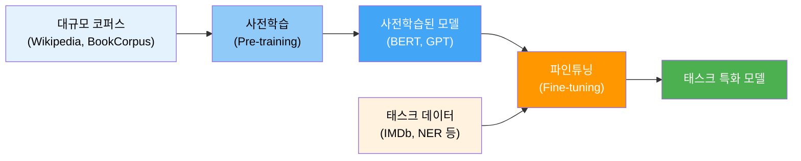
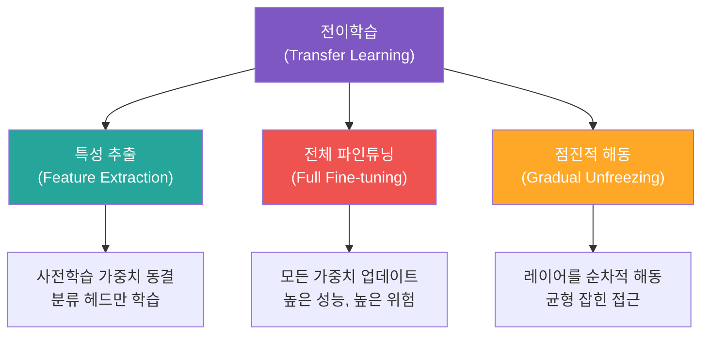
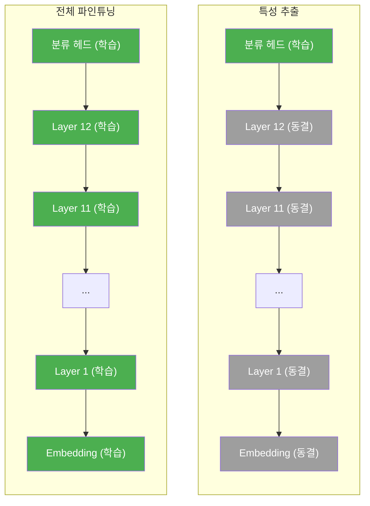
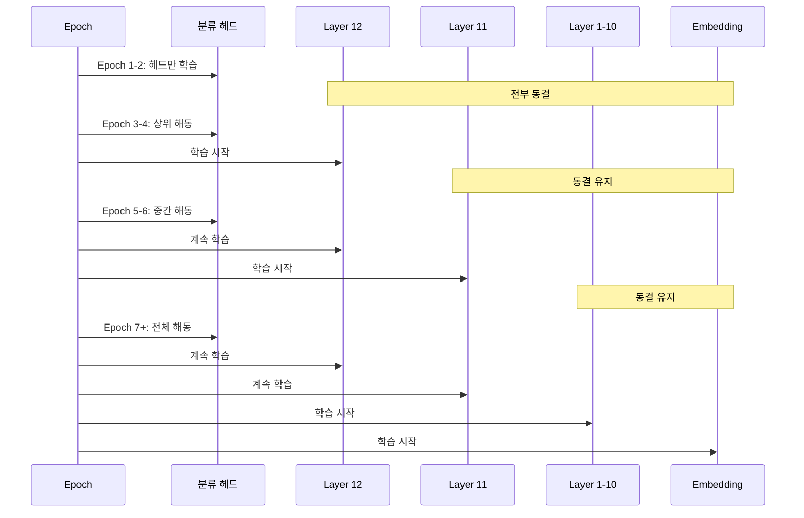
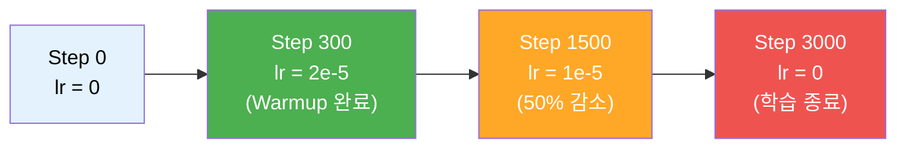

# 파인튜닝의 원리와 전략

> 사전학습된 모델의 지식을 특정 태스크에 맞게 조정하는 파인튜닝의 핵심 원리와 세 가지 전략을 마스터합니다.

## 개요

이 섹션에서는 사전학습(Pre-training) 모델을 특정 다운스트림 태스크에 적응시키는 **파인튜닝(Fine-tuning)**의 원리를 깊이 있게 다룹니다. 왜 처음부터 학습하지 않고 사전학습된 가중치를 활용하는지, 그리고 어떤 전략으로 파인튜닝해야 최적의 성능을 얻을 수 있는지를 코드와 함께 배워보겠습니다.

**선수 지식**:
- [BERT의 아키텍처와 사전학습](16-bert-양방향-사전학습-모델/02-02-bert의-아키텍처와-사전학습.md)에서 다룬 사전학습 개념
- [Hugging Face 생태계](18-hugging-face-transformers-실습/01-01-hugging-face-생태계-소개.md)의 `from_pretrained` 패턴
- [PyTorch 손실 함수와 옵티마이저](07-pytorch-기초와-신경망-입문/04-04-손실-함수와-옵티마이저.md)에 대한 이해

**학습 목표**:
- 전이학습과 파인튜닝의 차이를 명확히 구분할 수 있다
- 전체 파인튜닝, 특성 추출, 점진적 해동 세 가지 전략의 장단점을 이해한다
- 차별적 학습률(Discriminative Learning Rate)을 PyTorch로 구현할 수 있다
- 데이터 크기와 도메인 유사도에 따른 최적 전략을 선택할 수 있다

## 왜 알아야 할까?

여러분이 BERT나 GPT 같은 강력한 사전학습 모델을 가지고 있다고 해보죠. 이 모델은 수십억 개의 토큰으로 언어의 일반적인 패턴을 학습했습니다. 하지만 "이 제품 리뷰가 긍정인가 부정인가?"를 판별하려면, 그 일반 지식을 **우리 태스크에 맞게 미세 조정**해야 합니다.

문제는 이 조정이 생각보다 까다롭다는 거예요. 너무 세게 조정하면 사전학습에서 배운 언어 지식을 **잊어버리고(Catastrophic Forgetting)**, 너무 살살 조정하면 태스크에 **적응하지 못합니다**. 마치 피아노 조율사가 현의 장력을 조절하는 것처럼 — 너무 세게 조이면 끊어지고, 너무 느슨하면 음이 맞지 않죠.

2018년 Howard와 Ruder가 ULMFiT 논문에서 제안한 세 가지 핵심 기법 — 차별적 학습률, 점진적 해동, 경사 삼각형 학습률 — 은 이 문제를 우아하게 해결했고, 오늘날 Hugging Face Trainer API의 기본 설계에도 그 영향이 깊이 남아 있습니다.

> 📊 **그림 1**: 전이학습의 전체 패러다임



## 핵심 개념

### 개념 1: 전이학습 vs 파인튜닝 — 무엇이 다른가?

> 💡 **비유**: 전이학습은 **외국어를 배우는 과정**과 비슷합니다. 한국어를 이미 알고 있으면 일본어를 배울 때 문법 구조나 한자 지식을 "전이"할 수 있죠. 파인튜닝은 그중에서도 "일본어 비즈니스 이메일 쓰기"처럼 **특정 상황에 맞게 기존 실력을 조정**하는 단계입니다.

전이학습(Transfer Learning)은 하나의 태스크에서 학습한 지식을 다른 태스크에 활용하는 **광범위한 패러다임(paradigm)**입니다. 한 도메인에서 습득한 표현력, 패턴 인식 능력, 구조적 지식을 새로운 도메인이나 태스크로 "이전"하는 모든 접근 방식을 포괄하는 개념이죠. 파인튜닝은 그 안에서 사전학습된 모델의 가중치를 새로운 태스크의 데이터로 **추가 학습하여 조정**하는 구체적 기법이에요.

NLP에서 전이학습이 본격적으로 작동하기 시작한 건 2018년이었습니다. 이전까지는 Word2Vec이나 GloVe 같은 정적 임베딩을 전이하는 수준이었는데, ULMFiT, ELMo, 그리고 BERT가 등장하면서 **모델 전체를 전이**하는 패러다임으로 전환됐죠. 이 전환은 NLP 분야 전체의 성능 기준을 크게 끌어올렸고, 오늘날 우리가 사용하는 거의 모든 언어 모델이 이 패러다임 위에 서 있습니다.

> 📊 **그림 2**: 전이학습의 세 가지 접근 방식 비교



두 접근 방식의 핵심 차이를 코드로 살펴보겠습니다:

```python
from transformers import AutoModel

model = AutoModel.from_pretrained("bert-base-uncased")

# 특성 추출(Feature Extraction): 사전학습 가중치 완전 동결
for param in model.parameters():
    param.requires_grad = False  # 기울기 계산 차단 → 가중치 업데이트 없음

# 파인튜닝(Fine-tuning): 모든 가중치를 학습 가능 상태로
for param in model.parameters():
    param.requires_grad = True   # 기울기 계산 활성화 → 가중치 업데이트
```

특성 추출은 사전학습 모델을 **고정된 특성 추출기**로 사용하고, 그 위에 분류 헤드만 학습합니다. 빠르고 안전하지만, 태스크에 최적화된 표현을 학습하지 못하는 한계가 있어요. 반면 전체 파인튜닝은 모든 레이어를 업데이트하므로 높은 성능을 기대할 수 있지만, 사전학습 지식을 잃어버릴 위험이 있습니다.

### 개념 2: 파괴적 망각(Catastrophic Forgetting)

> 💡 **비유**: 파괴적 망각은 마치 **신입 요리사가 새 메뉴만 연습하다가 기존 레시피를 잊어버리는 것**과 같아요. 프렌치 요리를 마스터했는데, 이탈리안 요리만 집중 연습하다 보니 프렌치의 섬세한 소스 기법을 까먹는 거죠.

파괴적 망각(Catastrophic Forgetting)은 신경망이 새로운 태스크를 학습할 때 이전에 학습한 지식을 **급격하게 잊어버리는 현상**입니다. 파인튜닝에서 이는 매우 현실적인 문제인데요, 사전학습 모델이 수십억 토큰에서 배운 언어 이해 능력이 작은 태스크 데이터셋에 의해 **덮어씌워질** 수 있기 때문입니다.

> ⚠️ **흔한 오해**: "데이터를 많이 넣으면 파괴적 망각이 해결된다"고 생각하기 쉽지만, 실제로는 데이터가 많아도 학습률이 너무 높으면 여전히 발생합니다. 2023년 연구에 따르면 **큰 모델이 오히려 더 심하게** 망각하는 경향이 있다고 합니다.

파괴적 망각을 완화하는 핵심 전략들:

| 전략 | 원리 | 효과 |
|------|------|------|
| 낮은 학습률 | 가중치 변화를 최소화 | 가장 기본적인 방어 |
| 점진적 해동 | 레이어를 순차적으로 학습 | ULMFiT 핵심 기법 |
| 차별적 학습률 | 하위 레이어는 적게, 상위 레이어는 많이 | 레이어별 최적화 |
| 정규화 | Weight decay, Dropout 등 | 과적합 방지 |
| Warmup | 학습 초기에 학습률을 점진적으로 증가 | 초기 큰 변화 방지 |

### 개념 3: 전략 1 — 전체 파인튜닝(Full Fine-tuning)

> 💡 **비유**: 전체 파인튜닝은 **집 전체 리모델링**과 같습니다. 기초(사전학습 가중치)는 살리되, 벽지부터 가구 배치까지 모든 것을 새 용도에 맞게 바꾸는 거죠. 비용이 크지만 결과물은 완벽하게 맞춤형입니다.

전체 파인튜닝은 사전학습 모델의 **모든 파라미터**를 업데이트합니다. 가장 높은 성능을 기대할 수 있지만, 세심한 하이퍼파라미터 설정이 필요합니다.

```python
import torch
from transformers import AutoModelForSequenceClassification, AutoTokenizer

# 모델 로드 — 분류 헤드가 자동으로 추가됨
model = AutoModelForSequenceClassification.from_pretrained(
    "bert-base-uncased",
    num_labels=2  # 이진 분류 (긍정/부정)
)

# 전체 파인튜닝: 모든 파라미터가 학습 가능
trainable = sum(p.numel() for p in model.parameters() if p.requires_grad)
total = sum(p.numel() for p in model.parameters())
print(f"학습 가능 파라미터: {trainable:,} / 전체: {total:,}")
print(f"학습 비율: {trainable/total*100:.1f}%")
```

전체 파인튜닝의 핵심 설정:

```python
from torch.optim import AdamW

# 전체 파인튜닝에서의 일반적인 하이퍼파라미터
optimizer = AdamW(
    model.parameters(),
    lr=2e-5,           # 사전학습 때보다 10~100배 작은 학습률
    weight_decay=0.01,  # L2 정규화로 과적합 방지
    eps=1e-8            # 수치 안정성
)
```

> 🔥 **실무 팁**: BERT 계열 모델의 파인튜닝에서 학습률은 보통 `2e-5 ~ 5e-5` 범위가 최적입니다. 이는 사전학습 시 사용하는 `1e-4` 대비 약 5~50배 작은 값이에요. 너무 크면 파괴적 망각이, 너무 작으면 수렴이 느려집니다.

### 개념 4: 전략 2 — 특성 추출(Feature Extraction)

> 💡 **비유**: 특성 추출은 **기성복에 액세서리만 바꾸는 것**과 같습니다. 옷(사전학습 모델) 자체는 그대로 두고, 넥타이나 벨트(분류 헤드)만 바꿔서 다른 룩을 완성하는 거죠. 빠르고 경제적이지만, 완벽한 맞춤은 아닙니다.

특성 추출 방식은 사전학습 모델의 가중치를 **완전히 동결**하고, 새로 추가한 분류 헤드(Linear layer)만 학습합니다.

> 📊 **그림 3**: 특성 추출 vs 전체 파인튜닝의 학습 범위



```python
import torch.nn as nn
from transformers import AutoModel

class FeatureExtractor(nn.Module):
    def __init__(self, model_name="bert-base-uncased", num_labels=2):
        super().__init__()
        self.bert = AutoModel.from_pretrained(model_name)
        
        # 사전학습 가중치 동결 — 핵심!
        for param in self.bert.parameters():
            param.requires_grad = False
        
        # 분류 헤드만 학습
        self.classifier = nn.Sequential(
            nn.Dropout(0.3),
            nn.Linear(self.bert.config.hidden_size, num_labels)
        )
    
    def forward(self, input_ids, attention_mask):
        # 동결된 BERT로 특성 추출 (기울기 계산 불필요)
        with torch.no_grad():
            outputs = self.bert(input_ids=input_ids, attention_mask=attention_mask)
        
        # [CLS] 토큰의 표현 사용
        cls_output = outputs.last_hidden_state[:, 0, :]
        return self.classifier(cls_output)

model = FeatureExtractor()
trainable = sum(p.numel() for p in model.parameters() if p.requires_grad)
total = sum(p.numel() for p in model.parameters())
print(f"학습 가능: {trainable:,} / 전체: {total:,}")
print(f"학습 비율: {trainable/total*100:.2f}%")
```

특성 추출은 **데이터가 매우 적거나**(수백 건 이하), **빠른 프로토타이핑**이 필요할 때, 또는 **사전학습 도메인과 태스크 도메인이 유사**할 때 효과적입니다.

### 개념 5: 전략 3 — 점진적 해동(Gradual Unfreezing)

> 💡 **비유**: 점진적 해동은 **냉동 식품을 해동하는 과정**과 닮았습니다. 한꺼번에 전자레인지에 돌리면 바깥은 익고 안은 얼어있죠. 냉장실에서 천천히 해동하면 균일하게 풀립니다. 레이어도 마찬가지로 — 상위 레이어부터 천천히 풀어주는 게 핵심이에요.

점진적 해동은 ULMFiT에서 제안된 핵심 기법으로, 모든 레이어를 한꺼번에 학습하지 않고 **상위 레이어(태스크에 가까운)부터 순차적으로 해동**합니다. 하위 레이어는 일반적인 언어 특성(구문, 형태소)을 담당하므로 더 오래 동결 상태를 유지하는 거죠.

> 📊 **그림 4**: 점진적 해동의 단계별 진행



이를 PyTorch로 구현하면 다음과 같습니다:

```python
from transformers import AutoModelForSequenceClassification
from torch.optim import AdamW

model = AutoModelForSequenceClassification.from_pretrained(
    "bert-base-uncased", num_labels=2
)

def freeze_all_except_head(model):
    """분류 헤드를 제외한 모든 파라미터 동결"""
    for name, param in model.named_parameters():
        if "classifier" not in name:
            param.requires_grad = False

def unfreeze_layers(model, layer_indices):
    """특정 인코더 레이어를 해동"""
    for name, param in model.named_parameters():
        for idx in layer_indices:
            if f"encoder.layer.{idx}" in name:
                param.requires_grad = True

# 단계 1: 헤드만 학습 (2 에폭)
freeze_all_except_head(model)
optimizer = AdamW(filter(lambda p: p.requires_grad, model.parameters()), lr=1e-3)
# ... 2 에폭 학습 ...

# 단계 2: 상위 레이어 해동 (Layer 10-11)
unfreeze_layers(model, [10, 11])
optimizer = AdamW(filter(lambda p: p.requires_grad, model.parameters()), lr=2e-5)
# ... 2 에폭 학습 ...

# 단계 3: 중간 레이어 해동 (Layer 6-9)
unfreeze_layers(model, [6, 7, 8, 9])
optimizer = AdamW(filter(lambda p: p.requires_grad, model.parameters()), lr=1e-5)
# ... 2 에폭 학습 ...

# 단계 4: 전체 해동
for param in model.parameters():
    param.requires_grad = True
optimizer = AdamW(model.parameters(), lr=5e-6)
# ... 나머지 학습 ...
```

### 개념 6: 차별적 학습률(Discriminative Learning Rate)

> 💡 **비유**: 차별적 학습률은 **아파트 리모델링 비용 배분**과 비슷합니다. 기초 공사(하위 레이어)는 이미 튼튼하니 약간만 손보고, 인테리어(상위 레이어)에 집중 투자하는 거죠. 각 층마다 투자 비율이 다른 겁니다.

차별적 학습률(Discriminative Learning Rate, 또는 Layer-wise Learning Rate Decay)은 각 레이어에 **서로 다른 학습률**을 적용하는 기법입니다. 하위 레이어(일반적 언어 특성)에는 작은 학습률을, 상위 레이어(태스크 특화 특성)에는 큰 학습률을 부여합니다.

```python
from transformers import AutoModelForSequenceClassification
from torch.optim import AdamW

model = AutoModelForSequenceClassification.from_pretrained(
    "bert-base-uncased", num_labels=2
)

def get_discriminative_params(model, base_lr=2e-5, decay_factor=0.95):
    """레이어별로 다른 학습률을 설정하는 파라미터 그룹 생성"""
    param_groups = []
    
    # 1. Embedding 레이어 — 가장 낮은 학습률
    embedding_params = []
    for name, param in model.named_parameters():
        if "embedding" in name:
            embedding_params.append(param)
    
    if embedding_params:
        param_groups.append({
            "params": embedding_params,
            "lr": base_lr * (decay_factor ** 13)  # 가장 깊은 레이어
        })
    
    # 2. 인코더 레이어 — 점진적으로 증가하는 학습률
    for layer_idx in range(12):
        layer_params = []
        for name, param in model.named_parameters():
            if f"encoder.layer.{layer_idx}." in name:
                layer_params.append(param)
        
        if layer_params:
            # 하위 레이어(0)는 작은 lr, 상위 레이어(11)는 큰 lr
            layer_lr = base_lr * (decay_factor ** (12 - layer_idx))
            param_groups.append({
                "params": layer_params,
                "lr": layer_lr
            })
    
    # 3. Pooler + 분류 헤드 — 가장 높은 학습률
    head_params = []
    for name, param in model.named_parameters():
        if "pooler" in name or "classifier" in name:
            head_params.append(param)
    
    if head_params:
        param_groups.append({
            "params": head_params,
            "lr": base_lr  # 기본 학습률 그대로
        })
    
    return param_groups

# 차별적 학습률 적용
param_groups = get_discriminative_params(model, base_lr=2e-5, decay_factor=0.95)
optimizer = AdamW(param_groups, weight_decay=0.01)
```

```run:python
# 각 레이어의 학습률 확인
base_lr = 2e-5
decay_factor = 0.95

print("=== 차별적 학습률 (Decay Factor: 0.95) ===\n")
print(f"{'레이어':<20} {'학습률':<15} {'기본 대비'}")
print("-" * 50)

# Embedding
emb_lr = base_lr * (decay_factor ** 13)
print(f"{'Embedding':<20} {emb_lr:.2e}    {emb_lr/base_lr*100:.1f}%")

# Encoder layers
for i in range(12):
    layer_lr = base_lr * (decay_factor ** (12 - i))
    print(f"{'Encoder Layer ' + str(i):<20} {layer_lr:.2e}    {layer_lr/base_lr*100:.1f}%")

# Head
print(f"{'Classifier Head':<20} {base_lr:.2e}    100.0%")
```

```output
=== 차별적 학습률 (Decay Factor: 0.95) ===

레이어               학습률          기본 대비
--------------------------------------------------
Embedding            1.03e-05    51.3%
Encoder Layer 0      1.08e-05    54.0%
Encoder Layer 1      1.14e-05    56.9%
Encoder Layer 2      1.20e-05    59.9%
Encoder Layer 3      1.26e-05    63.0%
Encoder Layer 4      1.33e-05    66.3%
Encoder Layer 5      1.40e-05    69.8%
Encoder Layer 6      1.47e-05    73.5%
Encoder Layer 7      1.55e-05    77.4%
Encoder Layer 8      1.63e-05    81.4%
Encoder Layer 9      1.72e-05    85.7%
Encoder Layer 10     1.81e-05    90.3%
Encoder Layer 11     1.90e-05    95.0%
Classifier Head      2.00e-05    100.0%
```

### 개념 7: 학습률 스케줄러 — Warmup과 Linear Decay

사전학습 모델을 파인튜닝할 때, 학습률을 일정하게 유지하는 것보다 **웜업 후 선형 감소** 전략이 훨씬 효과적입니다. Hugging Face의 `get_linear_schedule_with_warmup`이 바로 이 역할을 합니다.

```python
from transformers import get_linear_schedule_with_warmup

# 총 학습 스텝 계산
num_epochs = 3
train_dataloader_len = 1000  # 배치 수
num_training_steps = num_epochs * train_dataloader_len  # 3000
num_warmup_steps = int(0.1 * num_training_steps)        # 300 (10% 웜업)

scheduler = get_linear_schedule_with_warmup(
    optimizer,
    num_warmup_steps=num_warmup_steps,    # 0 → base_lr까지 선형 증가
    num_training_steps=num_training_steps  # base_lr → 0까지 선형 감소
)

# 학습 루프에서:
# optimizer.step()
# scheduler.step()  # 매 스텝마다 호출
```

> 📊 **그림 5**: Warmup + Linear Decay 학습률 스케줄



웜업은 왜 필요할까요? 파인튜닝 초기에 분류 헤드의 가중치는 랜덤 초기화 상태입니다. 이 상태에서 큰 학습률로 역전파를 시작하면, **랜덤한 기울기가 사전학습 가중치를 크게 흔들어** 파괴적 망각을 유발합니다. 웜업을 통해 학습률을 점진적으로 올리면 이 초기 불안정을 완화할 수 있습니다.

## 실습: 직접 해보기

세 가지 파인튜닝 전략을 하나의 완전한 코드로 구현해봅시다. 데이터셋 크기와 도메인 유사도에 따라 어떤 전략을 선택해야 하는지를 실험할 수 있는 프레임워크입니다.

```python
import torch
import torch.nn as nn
from transformers import (
    AutoModelForSequenceClassification, 
    AutoTokenizer,
    get_linear_schedule_with_warmup
)
from torch.optim import AdamW


class FineTuningStrategy:
    """파인튜닝 전략 선택 및 실행을 위한 유틸리티 클래스"""
    
    def __init__(self, model_name="bert-base-uncased", num_labels=2):
        self.model_name = model_name
        self.num_labels = num_labels
        self.model = AutoModelForSequenceClassification.from_pretrained(
            model_name, num_labels=num_labels
        )
        self.tokenizer = AutoTokenizer.from_pretrained(model_name)
    
    def apply_strategy(self, strategy="full", base_lr=2e-5, decay_factor=0.95):
        """
        전략 적용
        - "full": 전체 파인튜닝
        - "feature_extraction": 특성 추출 (헤드만 학습)
        - "discriminative": 차별적 학습률
        """
        if strategy == "full":
            return self._full_finetune(base_lr)
        elif strategy == "feature_extraction":
            return self._feature_extraction(base_lr)
        elif strategy == "discriminative":
            return self._discriminative(base_lr, decay_factor)
        else:
            raise ValueError(f"알 수 없는 전략: {strategy}")
    
    def _full_finetune(self, lr):
        """전체 파인튜닝: 모든 파라미터를 동일한 학습률로"""
        for param in self.model.parameters():
            param.requires_grad = True
        
        # weight decay에서 bias와 LayerNorm 제외
        no_decay = ["bias", "LayerNorm.weight"]
        param_groups = [
            {
                "params": [p for n, p in self.model.named_parameters() 
                          if not any(nd in n for nd in no_decay)],
                "weight_decay": 0.01,
                "lr": lr
            },
            {
                "params": [p for n, p in self.model.named_parameters() 
                          if any(nd in n for nd in no_decay)],
                "weight_decay": 0.0,
                "lr": lr
            }
        ]
        return AdamW(param_groups)
    
    def _feature_extraction(self, lr):
        """특성 추출: 분류 헤드만 학습"""
        for name, param in self.model.named_parameters():
            if "classifier" in name:
                param.requires_grad = True
            else:
                param.requires_grad = False
        
        return AdamW(
            filter(lambda p: p.requires_grad, self.model.parameters()),
            lr=lr * 10  # 헤드만 학습하므로 학습률을 높임
        )
    
    def _discriminative(self, base_lr, decay_factor):
        """차별적 학습률: 레이어별로 다른 학습률"""
        for param in self.model.parameters():
            param.requires_grad = True
        
        param_groups = []
        
        # Embedding
        emb_params = [(n, p) for n, p in self.model.named_parameters() 
                      if "embedding" in n]
        if emb_params:
            param_groups.append({
                "params": [p for _, p in emb_params],
                "lr": base_lr * (decay_factor ** 13)
            })
        
        # Encoder layers
        for i in range(12):
            layer_params = [(n, p) for n, p in self.model.named_parameters()
                           if f"encoder.layer.{i}." in n]
            if layer_params:
                param_groups.append({
                    "params": [p for _, p in layer_params],
                    "lr": base_lr * (decay_factor ** (12 - i))
                })
        
        # Head
        head_params = [(n, p) for n, p in self.model.named_parameters()
                       if "pooler" in n or "classifier" in n]
        if head_params:
            param_groups.append({
                "params": [p for _, p in head_params],
                "lr": base_lr
            })
        
        return AdamW(param_groups, weight_decay=0.01)
    
    def get_scheduler(self, optimizer, num_training_steps, warmup_ratio=0.1):
        """Warmup + Linear Decay 스케줄러"""
        num_warmup_steps = int(warmup_ratio * num_training_steps)
        return get_linear_schedule_with_warmup(
            optimizer,
            num_warmup_steps=num_warmup_steps,
            num_training_steps=num_training_steps
        )
    
    def report(self):
        """학습 가능 파라미터 리포트"""
        trainable = sum(p.numel() for p in self.model.parameters() if p.requires_grad)
        total = sum(p.numel() for p in self.model.parameters())
        frozen = total - trainable
        print(f"전체 파라미터:   {total:>12,}")
        print(f"학습 가능:      {trainable:>12,} ({trainable/total*100:.1f}%)")
        print(f"동결:           {frozen:>12,} ({frozen/total*100:.1f}%)")
```

```run:python
# 전략 선택 가이드 출력
print("=" * 60)
print("파인튜닝 전략 선택 가이드")
print("=" * 60)
print()
print("데이터 크기 \\ 도메인 유사도  |  유사    |  다름")
print("-" * 50)
print("많음 (10K+)                 | 전체FT  | 전체FT")
print("보통 (1K-10K)               | 차별LR  | 점진적 해동")
print("적음 (<1K)                  | 특성추출 | 차별LR + 정규화")
print()
print("FT = Fine-tuning, LR = Learning Rate")
print()
print("핵심 원칙:")
print("• 데이터 많고 도메인 유사 → 전체 파인튜닝 (가장 단순)")
print("• 데이터 적고 도메인 유사 → 특성 추출 (과적합 방지)")
print("• 데이터 적고 도메인 다름 → 차별적 학습률 + 강한 정규화")
print("• 불확실할 때 → 차별적 학습률이 가장 안전한 선택")
```

```output
============================================================
파인튜닝 전략 선택 가이드
============================================================

데이터 크기 \ 도메인 유사도  |  유사    |  다름
--------------------------------------------------
많음 (10K+)                 | 전체FT  | 전체FT
보통 (1K-10K)               | 차별LR  | 점진적 해동
적음 (<1K)                  | 특성추출 | 차별LR + 정규화

FT = Fine-tuning, LR = Learning Rate

핵심 원칙:
• 데이터 많고 도메인 유사 → 전체 파인튜닝 (가장 단순)
• 데이터 적고 도메인 유사 → 특성 추출 (과적합 방지)
• 데이터 적고 도메인 다름 → 차별적 학습률 + 강한 정규화
• 불확실할 때 → 차별적 학습률이 가장 안전한 선택
```

## 더 깊이 알아보기

### ULMFiT의 탄생 — "NLP의 ImageNet 모멘트"

2018년, Jeremy Howard와 Sebastian Ruder는 NLP에서 전이학습이 컴퓨터 비전(ImageNet)만큼 강력하게 작동할 수 있음을 보여준 ULMFiT 논문을 발표했습니다. 당시 NLP 커뮤니티에서는 사전학습된 워드 임베딩(Word2Vec, GloVe)을 사용하는 것이 전이학습의 전부였거든요.

Howard는 fast.ai의 창립자이자 Kaggle의 전 회장으로, 딥러닝의 실용적 활용에 열정적인 인물이었습니다. Ruder는 아일랜드 NUI Galway의 박사과정 학생으로, NLP에서 전이학습의 가능성을 연구하던 중이었죠. 이 둘의 만남은 온라인에서 시작됐습니다 — Ruder의 블로그 포스트를 읽은 Howard가 연락을 취한 거예요.

ULMFiT의 핵심 아이디어는 세 단계로 이루어집니다:
1. **일반 도메인 사전학습**: 대규모 코퍼스(Wikitext-103)로 언어 모델 학습
2. **타겟 도메인 적응**: 분류할 도메인의 텍스트로 언어 모델 추가 학습
3. **분류기 파인튜닝**: 점진적 해동 + 차별적 학습률로 분류기 학습

놀라운 건, 단 **100개의 라벨링된 예시**만으로도 10,000개로 처음부터 학습한 모델과 비슷한 성능을 달성했다는 점입니다. 이 논문은 BERT(2018.10)와 GPT(2018.06)에 직접적인 영향을 주었고, Sebastian Ruder는 이 시기를 "NLP's ImageNet Moment"라고 명명했습니다.

### 왜 하위 레이어는 덜 바꿔야 할까?

2019년 Jawahar 등의 연구에 따르면, BERT의 각 레이어는 언어의 서로 다른 수준을 포착합니다:
- **하위 레이어 (1-4)**: 구문 정보 — 품사 태깅, 구문 분석 등 표면적 패턴
- **중간 레이어 (5-8)**: 의미 정보 — 코어퍼런스, 관계 추출 등
- **상위 레이어 (9-12)**: 태스크 특화 — 감성, 의도 등 고수준 의미

하위 레이어의 구문 지식은 대부분의 NLP 태스크에서 보편적으로 유용하므로, 이를 크게 변경하면 오히려 성능이 떨어질 수 있습니다. 이것이 차별적 학습률의 이론적 근거입니다.

## 흔한 오해와 팁

> ⚠️ **흔한 오해**: "파인튜닝은 항상 전체 모델을 학습하는 것이다"라고 생각하기 쉽지만, 실제로는 특성 추출, 점진적 해동, 차별적 학습률, 그리고 최근에는 LoRA/QLoRA 같은 파라미터 효율적 방법까지 다양한 스펙트럼이 존재합니다. 상황에 맞는 전략 선택이 핵심이에요.

> 💡 **알고 계셨나요?**: BERT 원논문에서 권장하는 파인튜닝 하이퍼파라미터는 학습률 2e-5~5e-5, 배치 크기 16~32, 에폭 수 2~4입니다. 이 "마법의 숫자들"은 수백 번의 실험을 통해 경험적으로 찾아낸 것이에요. 그래서 특별한 이유가 없다면 이 범위에서 시작하는 것이 좋습니다.

> 🔥 **실무 팁**: 파인튜닝 시 "epoch 수"보다 "early stopping"이 더 중요합니다. 검증 손실이 2~3 에폭 연속 증가하면 즉시 중단하세요. 대부분의 파인튜닝은 2~4 에폭이면 충분하며, 더 오래 학습하면 과적합만 심해집니다. Hugging Face의 `load_best_model_at_end=True` 옵션을 꼭 활용하세요.

> 🔥 **실무 팁**: `decay_factor`를 0.95로 시작하세요. 이러면 최하위와 최상위 레이어 간 학습률 차이가 약 2배 정도 됩니다. 도메인이 사전학습과 매우 다르면 0.8~0.9로 줄여 차이를 키우고, 유사하면 0.98~1.0으로 올려 차이를 줄이면 됩니다.

## 핵심 정리

| 개념 | 설명 |
|------|------|
| **전이학습** | 한 태스크에서 학습한 지식을 다른 태스크에 활용하는 광범위한 패러다임 |
| **파인튜닝** | 사전학습 가중치를 새로운 태스크 데이터로 추가 학습하여 조정 |
| **특성 추출** | 사전학습 모델을 동결하고 분류 헤드만 학습. 빠르지만 성능 한계 |
| **전체 파인튜닝** | 모든 파라미터를 업데이트. 높은 성능, 파괴적 망각 위험 |
| **점진적 해동** | 상위 레이어부터 순차적으로 해동. ULMFiT 핵심 기법 |
| **차별적 학습률** | 하위 레이어는 작은 lr, 상위 레이어는 큰 lr 적용 |
| **파괴적 망각** | 새 태스크 학습 시 사전학습 지식을 급격히 잊는 현상 |
| **Warmup** | 학습 초기 학습률을 점진적으로 올려 불안정 완화 |
| **decay_factor** | 레이어 간 학습률 감소 비율. 0.95가 일반적 출발점 |

## 다음 섹션 미리보기

이번 섹션에서 파인튜닝의 원리와 세 가지 전략을 이해했다면, 다음 섹션 [Trainer API로 텍스트 분류 파인튜닝](19-파인튜닝과-전이학습/02-02-trainer-api로-텍스트-분류-파인튜닝.md)에서는 이 모든 것을 Hugging Face의 **Trainer API**로 간결하게 구현합니다. `TrainingArguments` 하나로 학습률, 웜업, 배치 크기를 설정하고, `compute_metrics` 콜백으로 실시간 평가를 모니터링하며, `DataCollatorWithPadding`으로 효율적인 배치를 구성하는 방법을 배웁니다.

## 참고 자료

- [Universal Language Model Fine-tuning for Text Classification (ULMFiT)](https://arxiv.org/abs/1801.06146) - Howard & Ruder의 원논문. 점진적 해동, 차별적 학습률, 경사 삼각형 학습률의 근간
- [Hugging Face Transformers — Optimization (학습률 스케줄러)](https://huggingface.co/docs/transformers/en/main_classes/optimizer_schedules) - `get_linear_schedule_with_warmup` 등 스케줄러 공식 문서
- [Layer-Wise Learning Rate in PyTorch (Nikita Kozodoi)](https://www.kozodoi.me/blog/20220329/discriminative-lr) - BERT 레이어별 학습률 구현을 상세히 다룬 실용적 튜토리얼
- [An Empirical Study of Catastrophic Forgetting in LLMs During Continual Fine-tuning](https://arxiv.org/abs/2308.08747) - 대규모 언어 모델에서의 파괴적 망각에 대한 2023년 실증 연구
- [PyTorch AdamW 공식 문서](https://docs.pytorch.org/docs/stable/generated/torch.optim.AdamW.html) - 파라미터 그룹과 weight decay 설정 레퍼런스

---
### 🔗 Related Sessions
- [attention_mechanism](12-어텐션-메커니즘/01-01-어텐션의-직관적-이해.md) (prerequisite)
- [auto 클래스 패턴](18-hugging-face-transformers-실습/01-01-hugging-face-생태계-소개.md) (prerequisite)
- [from_pretrained](18-hugging-face-transformers-실습/01-01-hugging-face-생태계-소개.md) (prerequisite)
- [transformer 아키텍처](13-트랜스포머-아키텍처-심층-분석/01-01-트랜스포머-아키텍처-전체-조망.md) (prerequisite)
