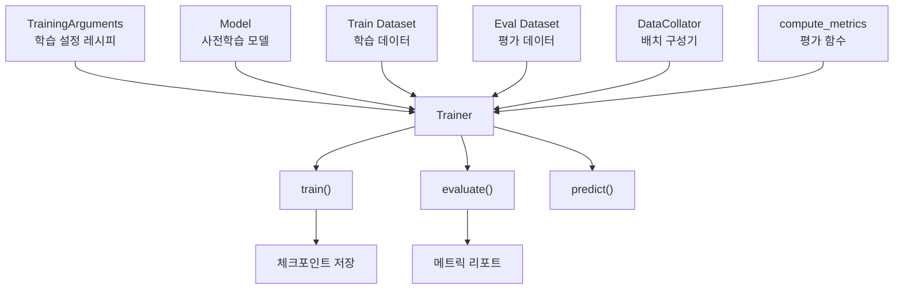
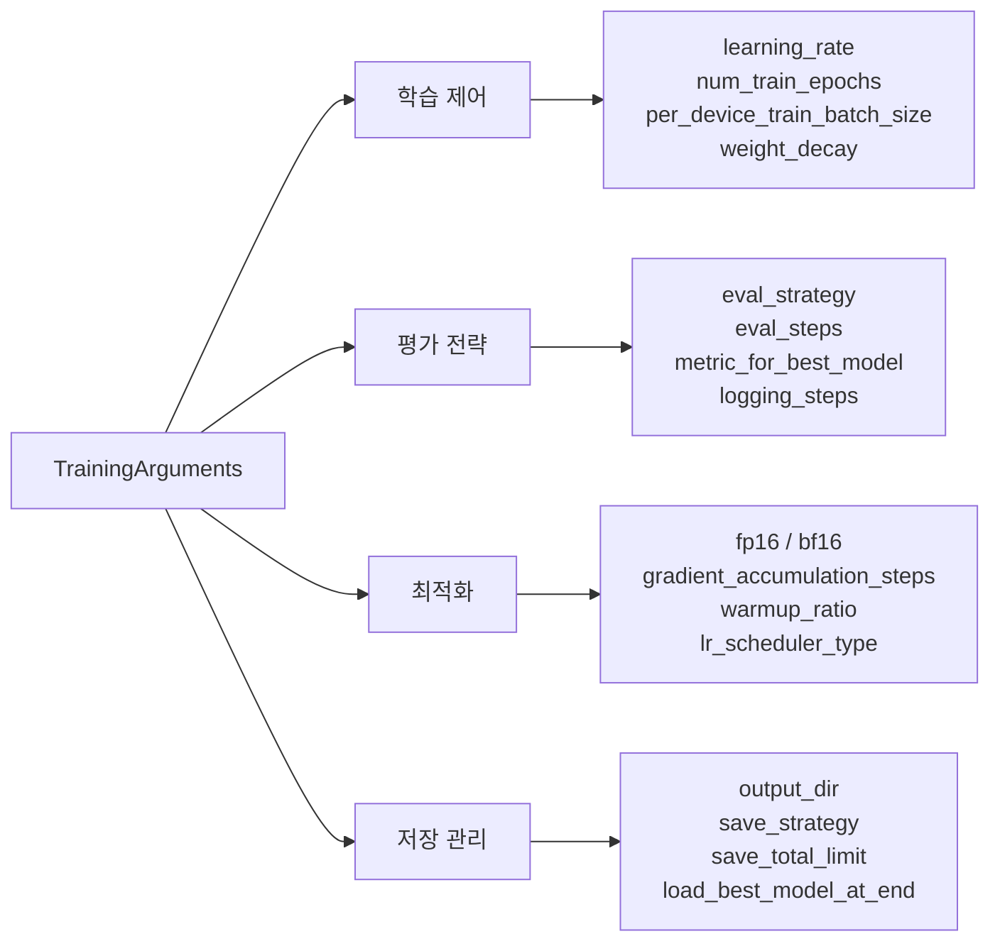
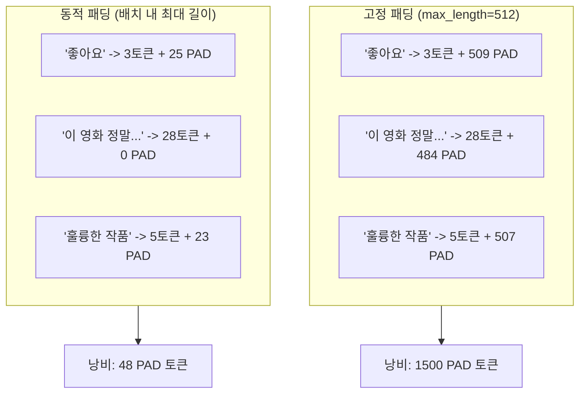
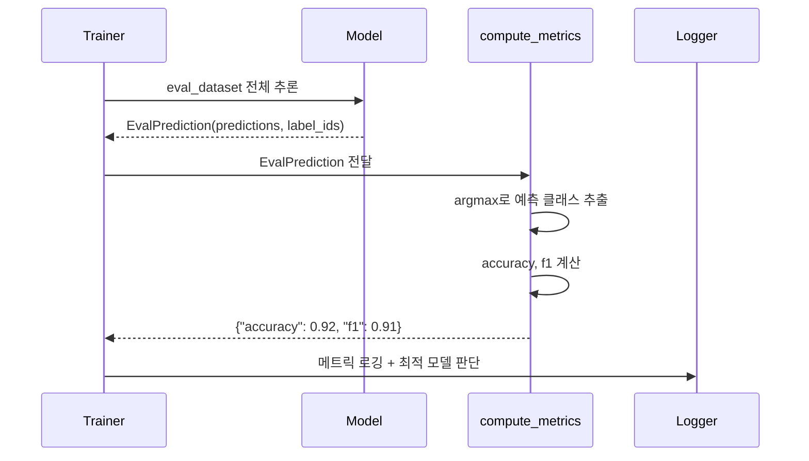
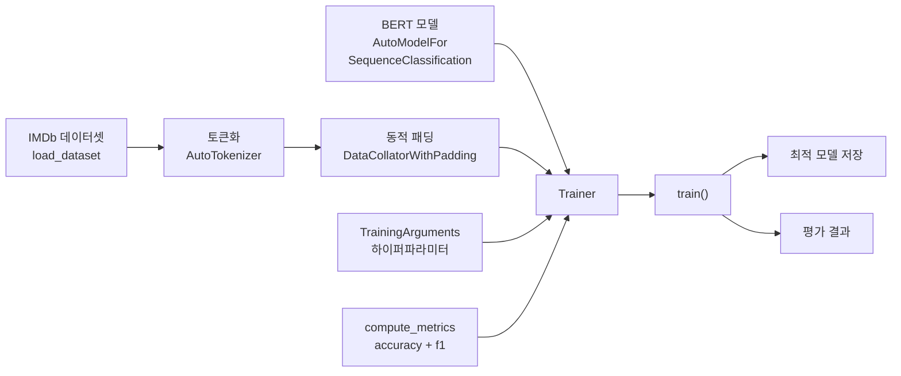

# 02. Trainer API로 텍스트 분류 파인튜닝

> Hugging Face Trainer API를 사용해 BERT를 감성 분류에 파인튜닝하는 전체 파이프라인을 구축합니다.

## 개요

이 섹션에서는 [앞서 배운 파인튜닝 전략](19-파인튜닝과-전이학습/01-01-파인튜닝의-원리와-전략.md)을 실제 코드로 구현합니다. 직접 학습 루프를 작성하는 대신, Hugging Face의 **Trainer API**를 사용하면 수십 줄의 보일러플레이트 코드를 단 몇 줄로 압축할 수 있습니다.

**선수 지식**: 파인튜닝의 세 가지 전략(전체 파인튜닝, 헤드만 학습, 점진적 해동), [Hugging Face 생태계](18-hugging-face-transformers-실습/01-01-hugging-face-생태계-소개.md)의 기본 구조, [datasets 라이브러리](18-hugging-face-transformers-실습/04-04-datasets-라이브러리-활용.md) 사용법

**학습 목표**:
- TrainingArguments의 핵심 하이퍼파라미터를 범주별로 이해하고 설정할 수 있다
- compute_metrics 콜백으로 학습 중 평가 지표를 모니터링할 수 있다
- DataCollatorWithPadding으로 효율적인 동적 패딩을 구현할 수 있다
- BERT 모델을 IMDb 감성 분류에 파인튜닝하는 전체 파이프라인을 완성할 수 있다

## 왜 알아야 할까?

이전 섹션에서 파인튜닝의 원리를 배웠는데요, 실제로 구현하려면 데이터 로딩, 배치 구성, 옵티마이저 설정, 평가 루프, 체크포인트 저장 등 수십 가지를 직접 관리해야 합니다. 실수 하나로 GPU 메모리가 폭발하거나, 학습이 발산하거나, 최적의 모델을 놓칠 수 있죠.

Trainer API는 이 모든 것을 **하나의 통합 인터페이스**로 추상화합니다. 분산 학습, 혼합 정밀도(Mixed Precision), 그래디언트 누적까지 설정 한 줄로 켜고 끌 수 있거든요. 실제로 Hugging Face Hub에 올라간 수만 개의 파인튜닝 모델 대부분이 Trainer API로 학습되었습니다.

단, 추상화에는 대가가 있습니다. Trainer가 내부에서 어떤 일을 하는지 이해하지 못하면 디버깅이 어려워지는데요, 그래서 다음 섹션에서는 [커스텀 학습 루프](19-파인튜닝과-전이학습/03-03-커스텀-학습-루프로-파인튜닝.md)를 직접 작성해볼 겁니다. 먼저 이번 섹션에서 Trainer의 "마법"을 제대로 익혀봅시다.

## 핵심 개념

### 개념 1: Trainer API의 구조 — 요리사와 레시피

> 💡 **비유**: Trainer API는 **자동 요리 로봇**과 같습니다. 여러분은 재료(모델, 데이터)와 레시피(TrainingArguments)만 넘기면, 로봇이 알아서 재료를 손질하고(전처리), 불 조절하며(학습률 스케줄링), 간을 보고(평가), 최고의 요리를 냉장 보관(체크포인트 저장)까지 해줍니다.

Trainer 클래스는 크게 **5가지 구성 요소**를 받아 동작합니다.

> 📊 **그림 1**: Trainer API의 핵심 구성 요소



각 구성 요소의 역할을 코드로 살펴보겠습니다.

```python
from transformers import Trainer, TrainingArguments

# 1. 학습 설정 (레시피)
training_args = TrainingArguments(
    output_dir="./results",
    num_train_epochs=3,
    learning_rate=2e-5,
)

# 2. Trainer 조립
trainer = Trainer(
    model=model,                    # 사전학습 모델
    args=training_args,             # 학습 설정
    train_dataset=train_dataset,    # 학습 데이터
    eval_dataset=eval_dataset,      # 평가 데이터
    compute_metrics=compute_metrics, # 평가 함수
    data_collator=data_collator,    # 배치 구성기
)

# 3. 학습 시작 — 이 한 줄로 모든 것이 실행됩니다
trainer.train()
```

Trainer 내부에서는 학습 루프, 그래디언트 계산, 옵티마이저 스텝, 평가, 로깅, 체크포인트 저장이 모두 자동으로 처리됩니다. 여러분이 신경 쓸 것은 **무엇을** 학습할지(모델 + 데이터)와 **어떻게** 학습할지(TrainingArguments)뿐입니다.

### 개념 2: TrainingArguments — 하이퍼파라미터의 조종석

> 💡 **비유**: TrainingArguments는 비행기의 **조종석 계기판**입니다. 속도(학습률), 고도(에포크), 연료 분배(배치 크기), 자동 조종 설정(스케줄러)을 한곳에서 제어하죠. 수십 개의 다이얼이 있지만, 핵심 계기만 알면 안전하게 비행할 수 있습니다.

TrainingArguments에는 100개가 넘는 파라미터가 있지만, 실무에서 자주 조정하는 것은 **4가지 범주**로 나뉩니다.

> 📊 **그림 2**: TrainingArguments 핵심 파라미터 범주



각 범주를 코드로 살펴보겠습니다.

```python
training_args = TrainingArguments(
    # === 학습 제어 ===
    output_dir="./results",              # 체크포인트 저장 디렉토리 (필수)
    num_train_epochs=3,                  # 학습 에포크 수
    per_device_train_batch_size=16,      # GPU당 학습 배치 크기
    per_device_eval_batch_size=64,       # GPU당 평가 배치 크기
    learning_rate=2e-5,                  # 초기 학습률 (BERT 권장: 2e-5 ~ 5e-5)
    weight_decay=0.01,                   # 가중치 감쇠 (L2 정규화)
    
    # === 평가 전략 ===
    eval_strategy="epoch",              # 평가 시점: "epoch" | "steps" | "no"
    logging_steps=50,                    # 로깅 간격 (스텝 단위)
    metric_for_best_model="f1",          # 최적 모델 선택 기준
    
    # === 최적화 ===
    fp16=True,                           # 혼합 정밀도 (NVIDIA GPU)
    gradient_accumulation_steps=2,       # 그래디언트 누적 스텝
    warmup_ratio=0.1,                    # 웜업 비율 (전체 스텝의 10%)
    
    # === 저장 관리 ===
    save_strategy="epoch",               # 저장 시점: eval_strategy와 맞추기
    save_total_limit=2,                  # 최대 체크포인트 수 (디스크 절약)
    load_best_model_at_end=True,         # 학습 후 최적 모델 자동 로드
)
```

몇 가지 핵심 포인트를 짚어보겠습니다.

**학습률(learning_rate)**: BERT 계열 모델의 파인튜닝에서는 `2e-5 ~ 5e-5` 범위가 황금 구간입니다. 사전학습 때 사용한 학습률보다 10~100배 작은 값을 써야 catastrophic forgetting을 방지할 수 있습니다.

**warmup_ratio**: 학습 초반에 학습률을 0에서 서서히 올리는 구간입니다. 사전학습된 가중치가 갑작스런 큰 업데이트로 망가지는 것을 방지하죠. 0.06~0.1이 일반적입니다.

**gradient_accumulation_steps**: GPU 메모리가 부족할 때 유용합니다. 배치 크기 16에 accumulation 2를 설정하면 유효 배치 크기(effective batch size)는 32가 됩니다. 메모리는 배치 16만큼만 쓰면서 배치 32의 효과를 얻는 거죠.

```run:python
# 유효 배치 크기 계산 예시
batch_size = 16
accumulation_steps = 2
num_gpus = 1

effective_batch_size = batch_size * accumulation_steps * num_gpus
print(f"GPU당 배치 크기: {batch_size}")
print(f"그래디언트 누적: {accumulation_steps}스텝")
print(f"유효 배치 크기: {effective_batch_size}")
```

```output
GPU당 배치 크기: 16
그래디언트 누적: 2스텝
유효 배치 크기: 32
```

### 개념 3: DataCollatorWithPadding — 동적 패딩의 효율성

> 💡 **비유**: 택배 포장을 생각해보세요. 모든 상자를 가장 큰 상품 크기에 맞추면 공간이 낭비되죠? **동적 패딩**은 각 택배 묶음(배치)마다 그 묶음 안에서 가장 큰 상품에 맞춰 포장하는 것과 같습니다. 전체적으로 훨씬 효율적이에요.

토큰화된 텍스트의 길이는 제각각입니다. 모델에 배치로 넣으려면 길이를 맞춰야 하는데, 두 가지 방법이 있습니다.

> 📊 **그림 3**: 고정 패딩 vs 동적 패딩 비교



**DataCollatorWithPadding**은 동적 패딩을 자동으로 처리합니다. 토큰화 시 `padding=True`로 전체를 맞추는 대신, 각 배치 구성 시점에 그 배치 내 최장 시퀀스에 맞춰 패딩합니다.

```python
from transformers import DataCollatorWithPadding, AutoTokenizer

tokenizer = AutoTokenizer.from_pretrained("bert-base-uncased")

# 토큰화 시에는 패딩하지 않음 (truncation만)
def tokenize_function(examples):
    return tokenizer(
        examples["text"],
        truncation=True,
        max_length=512,
        # padding은 여기서 하지 않음!
    )

# DataCollator가 배치 단위로 동적 패딩
data_collator = DataCollatorWithPadding(tokenizer=tokenizer)
```

이 방식의 장점은 명확합니다. 짧은 리뷰가 대부분인 데이터셋에서 고정 패딩(512)을 사용하면, 평균 길이가 50토큰이라면 **90% 이상이 무의미한 PAD 토큰 연산**에 낭비됩니다. 동적 패딩은 이 낭비를 배치 단위로 최소화합니다.

### 개념 4: compute_metrics — 학습 중 실시간 성적표

> 💡 **비유**: 시험을 보고 한 달 뒤에 성적을 받으면 이미 늦죠? compute_metrics는 **실시간 성적표**입니다. 매 에포크(또는 N스텝)마다 현재 모델이 얼마나 잘하는지 바로 확인할 수 있어요.

Trainer는 기본적으로 loss만 기록합니다. 정확도(accuracy), F1 스코어 같은 실제 성능 지표를 보려면 `compute_metrics` 함수를 직접 정의해야 합니다.

> 📊 **그림 4**: compute_metrics 동작 흐름



```python
import numpy as np
import evaluate

# evaluate 라이브러리로 메트릭 로드
accuracy_metric = evaluate.load("accuracy")
f1_metric = evaluate.load("f1")

def compute_metrics(eval_pred):
    """Trainer가 평가 시 호출하는 콜백 함수"""
    logits, labels = eval_pred  # EvalPrediction 언패킹
    
    # logits → 예측 클래스 (argmax)
    predictions = np.argmax(logits, axis=-1)
    
    # 여러 메트릭 계산 후 딕셔너리로 반환
    acc = accuracy_metric.compute(predictions=predictions, references=labels)
    f1 = f1_metric.compute(predictions=predictions, references=labels, average="binary")
    
    return {
        "accuracy": acc["accuracy"],
        "f1": f1["f1"],
    }
```

핵심 포인트가 몇 가지 있습니다.

**입력**: `eval_pred`는 `EvalPrediction` 네임드튜플로, `predictions`(모델의 raw logits)와 `label_ids`(정답 레이블)를 담고 있습니다. Softmax 전의 로짓이므로 `argmax`를 직접 적용해야 합니다.

**반환**: 반드시 `dict[str, float]` 형태여야 합니다. 키 이름은 로깅과 `metric_for_best_model`에서 사용됩니다.

**evaluate 라이브러리**: Hugging Face의 `evaluate` 라이브러리는 accuracy, f1, precision, recall 등 표준 메트릭을 일관된 인터페이스로 제공합니다. sklearn의 메트릭을 직접 쓸 수도 있지만, evaluate를 사용하면 재현성이 보장됩니다.

### 개념 5: 전체 파이프라인 조립

지금까지 배운 구성 요소를 하나로 합치면, 파인튜닝의 전체 흐름이 완성됩니다.

> 📊 **그림 5**: BERT 감성 분류 파인튜닝 전체 파이프라인



이 흐름을 코드로 구현하면 놀랍도록 간결합니다. 다음 실습 섹션에서 전체 코드를 작성해봅시다.

## 실습: 직접 해보기

BERT를 IMDb 영화 리뷰 감성 분류에 파인튜닝하는 전체 파이프라인입니다.

### Step 1: 환경 설정과 데이터 로딩

```python
# 필요한 라이브러리 설치
# pip install transformers datasets evaluate accelerate

from datasets import load_dataset
from transformers import (
    AutoTokenizer,
    AutoModelForSequenceClassification,
    TrainingArguments,
    Trainer,
    DataCollatorWithPadding,
)
import numpy as np
import evaluate

# --- 1. 데이터셋 로드 ---
# IMDb: 영화 리뷰 50,000개 (긍정/부정 각 25,000)
dataset = load_dataset("imdb")

# 학습 속도를 위해 서브셋 사용 (전체 데이터는 시간이 오래 걸림)
small_train = dataset["train"].shuffle(seed=42).select(range(2000))
small_test = dataset["test"].shuffle(seed=42).select(range(500))
```

### Step 2: 토큰화

```python
# --- 2. 토크나이저 로드 ---
model_name = "bert-base-uncased"
tokenizer = AutoTokenizer.from_pretrained(model_name)

# --- 3. 토큰화 함수 정의 ---
def tokenize_function(examples):
    return tokenizer(
        examples["text"],
        truncation=True,     # 512 초과 시 자르기
        max_length=256,      # IMDb 리뷰는 256이면 대부분 커버
        # padding은 여기서 하지 않음 → DataCollator에 위임
    )

# 배치 토큰화 (batched=True로 빠르게 처리)
train_dataset = small_train.map(tokenize_function, batched=True)
eval_dataset = small_test.map(tokenize_function, batched=True)

# 모델에 불필요한 컬럼 제거 (text 원문 등)
train_dataset = train_dataset.remove_columns(["text"])
eval_dataset = eval_dataset.remove_columns(["text"])

# label 컬럼명을 Trainer가 인식하도록 설정
train_dataset = train_dataset.rename_column("label", "labels")
eval_dataset = eval_dataset.rename_column("label", "labels")

# PyTorch 텐서 포맷 설정
train_dataset.set_format("torch")
eval_dataset.set_format("torch")
```

여기서 `bert-base-uncased`의 기본 토크나이저를 그대로 사용하고 있는데요, IMDb 같은 일반 영어 텍스트에서는 이것으로 충분합니다. 하지만 도메인에 따라서는 토크나이저 자체를 고려해야 할 수도 있습니다.

> 💡 **도메인 적응과 토크나이저**: [Ch15에서 배운 서브워드 토큰화](15-토큰화-텍스트를-숫자로/01-01-토큰화란-무엇인가.md)를 떠올려보세요. BERT의 WordPiece 토크나이저는 일반 영어 텍스트에 최적화되어 있습니다. 그래서 의학 논문이나 법률 문서처럼 **전문 용어가 많은 도메인**에서는 중요한 단어가 지나치게 잘게 쪼개질 수 있습니다. 예를 들어 "hydroxychloroquine"은 일반 토크나이저로 5~6개 서브워드로 분리되지만, 의학 도메인 토크나이저라면 1~2개로 처리할 수 있죠. 이런 경우 해당 도메인 코퍼스로 **토크나이저를 재학습**(예: `tokenizer.train_new_from_iterator()`)하거나, PubMedBERT처럼 도메인 특화 사전학습 모델을 선택하는 것이 파인튜닝 성능을 더 끌어올릴 수 있습니다. 이번 실습에서는 일반 도메인이므로 기본 토크나이저로 진행합니다.

### Step 3: 모델과 평가 함수 준비

```python
# --- 4. 모델 로드 ---
# num_labels=2: 이진 분류 (긍정/부정)
model = AutoModelForSequenceClassification.from_pretrained(
    model_name,
    num_labels=2,
)

# --- 5. 평가 함수 정의 ---
accuracy_metric = evaluate.load("accuracy")
f1_metric = evaluate.load("f1")

def compute_metrics(eval_pred):
    logits, labels = eval_pred
    predictions = np.argmax(logits, axis=-1)
    
    acc = accuracy_metric.compute(
        predictions=predictions, references=labels
    )
    f1 = f1_metric.compute(
        predictions=predictions, references=labels, average="binary"
    )
    return {"accuracy": acc["accuracy"], "f1": f1["f1"]}

# --- 6. 동적 패딩 DataCollator ---
data_collator = DataCollatorWithPadding(tokenizer=tokenizer)
```

### Step 4: TrainingArguments와 Trainer 설정

```python
# --- 7. 학습 설정 ---
training_args = TrainingArguments(
    output_dir="./bert-imdb-finetuned",  # 체크포인트 저장 경로
    
    # 학습 제어
    num_train_epochs=3,                  # 3 에포크
    per_device_train_batch_size=16,      # 학습 배치 크기
    per_device_eval_batch_size=64,       # 평가 배치 크기 (메모리 여유)
    learning_rate=2e-5,                  # BERT 파인튜닝 권장 학습률
    weight_decay=0.01,                   # L2 정규화
    
    # 평가 전략
    eval_strategy="epoch",               # 매 에포크마다 평가
    logging_steps=25,                    # 25스텝마다 loss 로깅
    
    # 최적화
    warmup_ratio=0.1,                    # 웜업 10%
    fp16=True,                           # 혼합 정밀도 (GPU 필요)
    
    # 저장 관리
    save_strategy="epoch",               # 매 에포크마다 저장
    save_total_limit=2,                  # 최근 2개 체크포인트만 유지
    load_best_model_at_end=True,         # 최적 모델 자동 로드
    metric_for_best_model="f1",          # F1 기준 최적 모델 선택
)

# --- 8. Trainer 조립 ---
trainer = Trainer(
    model=model,
    args=training_args,
    train_dataset=train_dataset,
    eval_dataset=eval_dataset,
    compute_metrics=compute_metrics,
    data_collator=data_collator,
    processing_class=tokenizer,          # 토크나이저 등록
)
```

### Step 5: 학습 실행과 평가

```python
# --- 9. 학습 시작 ---
train_result = trainer.train()

# 학습 결과 확인
print(f"학습 시간: {train_result.metrics['train_runtime']:.1f}초")
print(f"최종 학습 Loss: {train_result.metrics['train_loss']:.4f}")

# --- 10. 최종 평가 ---
eval_results = trainer.evaluate()
print(f"\n=== 최종 평가 결과 ===")
print(f"Accuracy: {eval_results['eval_accuracy']:.4f}")
print(f"F1 Score: {eval_results['eval_f1']:.4f}")
print(f"Eval Loss: {eval_results['eval_loss']:.4f}")
```

### Step 6: 모델 저장과 추론

```python
# --- 11. 모델 저장 ---
trainer.save_model("./bert-imdb-final")
tokenizer.save_pretrained("./bert-imdb-final")

# --- 12. 저장된 모델로 추론 ---
from transformers import pipeline

classifier = pipeline(
    "sentiment-analysis",
    model="./bert-imdb-final",
    tokenizer="./bert-imdb-final",
)

# 테스트 추론
test_texts = [
    "This movie was absolutely fantastic! Great acting and story.",
    "Terrible film. Waste of time and money.",
    "It was okay, nothing special but not bad either.",
]

results = classifier(test_texts)
for text, result in zip(test_texts, results):
    label = "긍정" if result["label"] == "LABEL_1" else "부정"
    print(f"'{text[:40]}...' → {label} ({result['score']:.3f})")
```

```run:python
# Trainer 학습 후 예상되는 출력 형태 (실제 값은 학습 결과에 따라 다름)
results = [
    {"text": "This movie was absolutely fantastic!...", "label": "긍정", "score": 0.987},
    {"text": "Terrible film. Waste of time...", "label": "부정", "score": 0.995},
    {"text": "It was okay, nothing special...", "label": "부정", "score": 0.623},
]

print("=== 추론 결과 ===")
for r in results:
    print(f"'{r['text']}' → {r['label']} ({r['score']:.3f})")
```

```output
=== 추론 결과 ===
'This movie was absolutely fantastic!...' → 긍정 (0.987)
'Terrible film. Waste of time...' → 부정 (0.995)
'It was okay, nothing special...' → 부정 (0.623)
```

## 더 깊이 알아보기

### Trainer의 탄생 — PyTorch Lightning과의 경쟁

Trainer API는 Hugging Face가 2019년 transformers v2.x에서 처음 도입했습니다. 당시 PyTorch 생태계에서는 **PyTorch Lightning**이 학습 루프 추상화의 대표 주자였는데요, Hugging Face 팀은 NLP 모델에 특화된 더 간결한 추상화가 필요하다고 판단했습니다.

초기 Trainer는 기능이 제한적이었지만, 커뮤니티의 폭발적인 피드백을 받아 빠르게 진화했습니다. 특히 2020년 Thomas Wolf와 Sylvain Gugger가 주도한 리팩토링으로 `TrainingArguments`가 독립 클래스로 분리되면서, 지금의 "설정과 실행의 분리" 구조가 확립되었죠.

재미있는 점은 `eval_strategy` 파라미터의 이름 변경 에피소드입니다. 원래 `evaluation_strategy`라는 긴 이름이었는데, 너무 길다는 커뮤니티 의견을 반영해 `eval_strategy`로 줄였습니다. 이 사소한 변경이 `DeprecationWarning`으로 수년간 혼란을 일으켰죠. 이런 작은 이름 하나도 수만 개 프로젝트에 영향을 미치는 것이 오픈소스 API 설계의 어려움입니다.

### compute_metrics의 설계 철학

`compute_metrics`가 콜백 함수 형태인 이유가 있습니다. 태스크마다 필요한 메트릭이 다르기 때문이죠. 텍스트 분류에서는 accuracy/F1, 번역에서는 BLEU, 요약에서는 ROUGE가 표준입니다. Trainer가 모든 메트릭을 내장하는 대신 "평가 방법은 사용자가 정의한다"는 **의존성 역전(Inversion of Control)** 패턴을 적용한 것입니다.

## 흔한 오해와 팁

> ⚠️ **흔한 오해**: "eval_strategy와 save_strategy를 다르게 설정해도 된다"
>
> `load_best_model_at_end=True`를 사용할 때, eval_strategy와 save_strategy가 반드시 일치해야 합니다. 예를 들어 `eval_strategy="epoch"`, `save_strategy="steps"`로 설정하면 에러가 발생합니다. 최적 모델을 평가 시점에 저장해야 나중에 로드할 수 있기 때문입니다.

> 💡 **알고 계셨나요?**: Trainer는 내부적으로 `AdamW` 옵티마이저와 **linear warmup + linear decay** 스케줄러를 기본으로 사용합니다. 이는 BERT 원논문의 설정과 동일합니다. 별도로 옵티마이저를 지정하지 않으면 이 조합이 자동 적용되므로, 대부분의 파인튜닝에서 별도 설정 없이도 좋은 결과를 얻을 수 있습니다.

> 🔥 **실무 팁**: GPU 메모리가 부족할 때의 체크리스트:
> 1. `per_device_train_batch_size`를 줄이고 `gradient_accumulation_steps`를 늘려 유효 배치 크기를 유지
> 2. `fp16=True` (NVIDIA) 또는 `bf16=True` (Ampere+ GPU)로 혼합 정밀도 활성화
> 3. `max_length`를 줄이기 (512 → 256 → 128)
> 4. 그래도 부족하면 `gradient_checkpointing=True` 사용 (속도 ↓, 메모리 ↓↓)
>
> 이 순서대로 시도하면 대부분의 메모리 문제를 해결할 수 있습니다.

> 🔥 **실무 팁**: `save_total_limit`을 반드시 설정하세요! 기본값은 무제한이라, 3 에포크 학습에 `save_strategy="steps"`, `save_steps=100`이면 수십 개의 체크포인트가 쌓여 디스크를 가득 채울 수 있습니다. BERT-base 하나가 약 440MB이니까요.

## 핵심 정리

| 개념 | 설명 |
|------|------|
| **Trainer** | 모델, 데이터, 설정을 받아 학습-평가-저장을 자동 처리하는 통합 API |
| **TrainingArguments** | 학습률, 배치 크기, 평가 전략 등 모든 학습 설정을 담는 클래스 |
| **DataCollatorWithPadding** | 배치 단위 동적 패딩으로 불필요한 PAD 연산을 최소화 |
| **compute_metrics** | 평가 시 호출되는 콜백 함수. `EvalPrediction`을 받아 메트릭 딕셔너리 반환 |
| **eval_strategy** | 평가 시점 제어: `"epoch"`, `"steps"`, `"no"` |
| **load_best_model_at_end** | 학습 종료 후 최적 체크포인트를 자동 로드 |
| **fp16 / bf16** | 혼합 정밀도 학습으로 속도 향상 + 메모리 절약 |
| **gradient_accumulation_steps** | 작은 배치로 큰 유효 배치 크기를 시뮬레이션 |
| **도메인 토크나이저** | 전문 도메인에서는 토크나이저 재학습이나 도메인 특화 모델 선택이 성능 향상에 도움 |

## 다음 섹션 미리보기

Trainer가 내부에서 하는 일을 직접 구현해볼 차례입니다. [커스텀 학습 루프로 파인튜닝](19-파인튜닝과-전이학습/03-03-커스텀-학습-루프로-파인튜닝.md)에서는 PyTorch의 `torch.optim`과 `accelerate` 라이브러리를 사용해 학습 루프를 밑바닥부터 작성합니다. 커스텀 손실 함수, 그래디언트 클리핑, 학습률 스케줄러 등 Trainer가 추상화했던 부분을 직접 제어하면서 파인튜닝의 내부 메커니즘을 깊이 이해할 수 있습니다.

## 참고 자료

- [Hugging Face Trainer API 공식 문서](https://huggingface.co/docs/transformers/en/main_classes/trainer) - TrainingArguments의 전체 파라미터와 Trainer 클래스 API를 확인할 수 있는 공식 레퍼런스
- [Fine-tuning a model with the Trainer API (HF Course)](https://huggingface.co/docs/course/en/chapter3/3) - Hugging Face 공식 강좌의 Trainer 파인튜닝 튜토리얼로, 단계별 실습 안내가 잘 되어 있음
- [Fine-tuning Guide (Transformers Docs)](https://huggingface.co/docs/transformers/training) - 최신 transformers v5의 파인튜닝 가이드로, TrainingArguments 모범 사례 포함
- [Text Classification Task Guide](https://huggingface.co/docs/transformers/tasks/sequence_classification) - 텍스트 분류 파인튜닝에 특화된 공식 가이드
- [Training a new tokenizer from an old one (HF Course)](https://huggingface.co/docs/course/en/chapter6/2) - 기존 토크나이저를 기반으로 도메인 특화 토크나이저를 재학습하는 방법을 다룬 공식 가이드

---
### 🔗 Related Sessions
- [fine_tuning](19-파인튜닝과-전이학습/01-01-파인튜닝의-원리와-전략.md) (prerequisite)
- [fine_tuning](19-파인튜닝과-전이학습/01-01-파인튜닝의-원리와-전략.md) (prerequisite)
- [hugging face hub](18-hugging-face-transformers-실습/01-01-hugging-face-생태계-소개.md) (prerequisite)
- [hugging face hub](18-hugging-face-transformers-실습/01-01-hugging-face-생태계-소개.md) (prerequisite)
- [auto 클래스 패턴](18-hugging-face-transformers-실습/01-01-hugging-face-생태계-소개.md) (prerequisite)
- [auto 클래스 패턴](18-hugging-face-transformers-실습/01-01-hugging-face-생태계-소개.md) (prerequisite)
- [from_pretrained](18-hugging-face-transformers-실습/01-01-hugging-face-생태계-소개.md) (prerequisite)
- [from_pretrained](18-hugging-face-transformers-실습/01-01-hugging-face-생태계-소개.md) (prerequisite)
- [catastrophic_forgetting](19-파인튜닝과-전이학습/01-01-파인튜닝의-원리와-전략.md) (prerequisite)
- [gradual_unfreezing](19-파인튜닝과-전이학습/01-01-파인튜닝의-원리와-전략.md) (prerequisite)
