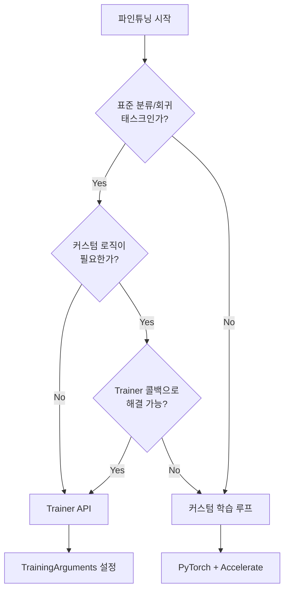
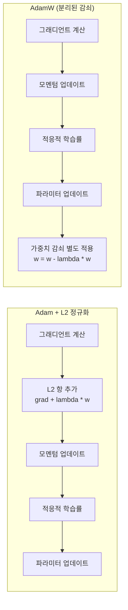
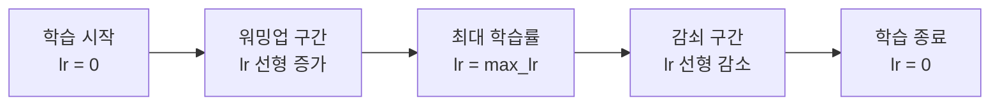
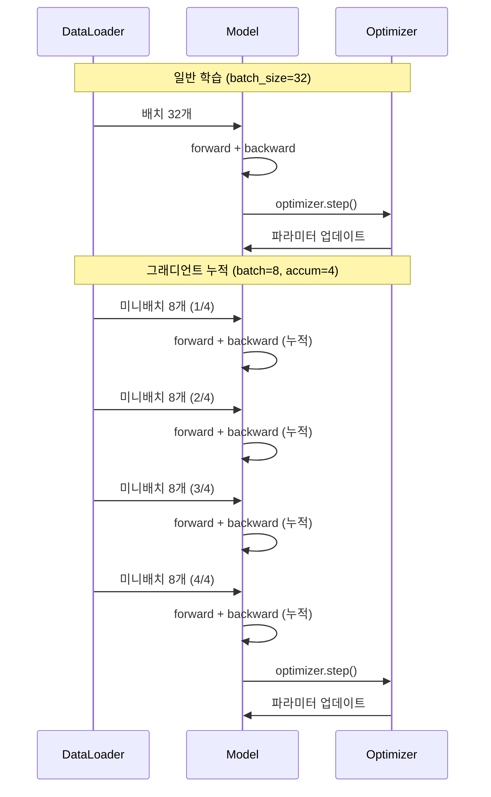
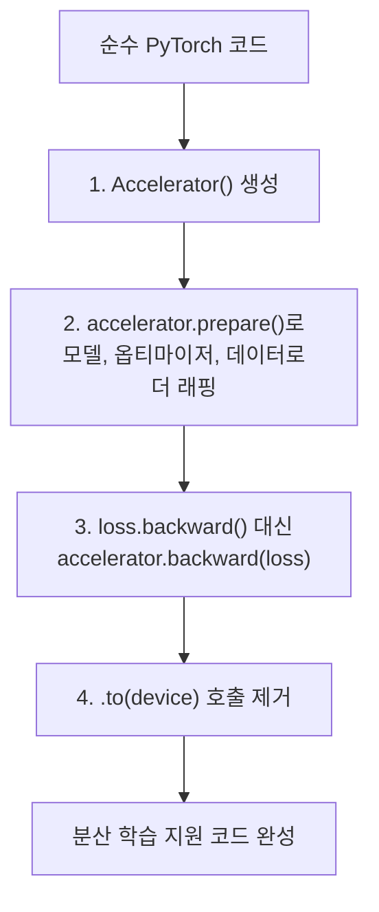

# 커스텀 학습 루프로 파인튜닝

> Trainer 없이 PyTorch로 직접 파인튜닝하며, 학습 과정의 모든 톱니바퀴를 손으로 돌려보는 시간입니다.

## 개요

이 섹션에서는 Hugging Face Trainer API의 내부에서 일어나는 일을 직접 PyTorch 코드로 구현합니다. 옵티마이저 설정부터 학습률 스케줄링, 그래디언트 누적까지 — Trainer가 추상화했던 모든 것을 한 줄씩 이해하고 제어하는 방법을 배웁니다.

**선수 지식**: [Trainer API로 텍스트 분류 파인튜닝](19-파인튜닝과-전이학습/02-02-trainer-api로-텍스트-분류-파인튜닝.md)에서 배운 TrainingArguments와 compute_metrics 개념, [학습 루프와 Dataset/DataLoader](07-pytorch-기초와-신경망-입문/05-05-학습-루프와-datasetdataloader.md)에서 배운 PyTorch 학습 루프 기본 구조

**학습 목표**:
- AdamW 옵티마이저의 원리를 이해하고 파라미터 그룹별로 설정하기
- 선형 학습률 스케줄러와 워밍업의 동작 원리 파악하기
- 그래디언트 누적으로 GPU 메모리 한계를 극복하는 방법 익히기
- Accelerate 라이브러리로 분산 학습에 대비하는 코드 작성법 배우기

## 왜 알아야 할까?

"Trainer가 있는데 왜 굳이 직접 만들어야 하죠?"

좋은 질문입니다. Trainer는 정말 편리하지만, **자동차의 자동 변속기와 수동 변속기**의 차이를 생각해보세요. 자동 변속기로 일상 운전은 충분하지만, 레이싱 드라이버는 수동 변속기로 엔진의 모든 것을 제어하죠. 마찬가지로 커스텀 학습 루프가 필요한 상황이 분명히 존재합니다:

- **커스텀 손실 함수**: 멀티태스크 학습이나 대조 학습처럼 복잡한 손실 조합이 필요할 때
- **그래디언트 조작**: 그래디언트 클리핑, 그래디언트 페널티, 그래디언트 누적 등을 세밀하게 제어할 때
- **비표준 학습 전략**: GAN 학습, 강화학습 기반 파인튜닝(RLHF) 등 Trainer가 지원하지 않는 패턴
- **디버깅**: 학습 중 텐서 값, 그래디언트 분포, 어텐션 가중치 등을 직접 모니터링할 때

실제로 GPT, LLaMA 같은 대규모 모델을 학습시키는 코드베이스 대부분이 커스텀 학습 루프를 사용합니다. Trainer의 편리함을 알면서도 그 속을 들여다볼 수 있어야 진짜 실력이 됩니다.

> 📊 **그림 1**: Trainer vs 커스텀 학습 루프 — 언제 무엇을 쓸까?



## 핵심 개념

### 개념 1: AdamW — 트랜스포머의 단짝 옵티마이저

> 💡 **비유**: 산에서 길을 찾을 때, 나침반(그래디언트 방향)만으로는 부족합니다. 최근에 어디로 갔는지(모멘텀), 지형이 얼마나 험한지(적응적 학습률)를 모두 고려해야 하죠. AdamW는 여기에 "무거운 짐은 좀 내려놓자(가중치 감쇠)"까지 더한 똑똑한 등산가입니다.

AdamW는 2017년 Ilya Loshchilov와 Frank Hutter가 발표한 논문 "Decoupled Weight Decay Regularization"에서 제안한 옵티마이저입니다. 기존 Adam에서 L2 정규화와 가중치 감쇠(weight decay)가 혼재되어 있던 문제를 분리(decoupled)한 것이 핵심입니다.

> 📊 **그림 2**: Adam vs AdamW의 가중치 감쇠 처리 방식



왜 이 분리가 중요할까요? Adam에서는 L2 정규화 항이 적응적 학습률의 영향을 받아 **큰 그래디언트를 가진 파라미터는 정규화가 약해지는 문제**가 있었습니다. AdamW는 가중치 감쇠를 옵티마이저 스텝과 분리하여 모든 파라미터에 균일하게 적용합니다.

수식으로 보면 차이가 명확합니다. Adam + L2에서는 그래디언트에 정규화 항을 더한 뒤 적응적 학습률을 적용하므로:

$$\theta_{t+1} = \theta_t - \frac{\alpha}{\sqrt{\hat{v}_t} + \epsilon} \cdot (\hat{m}_t + \lambda \theta_t)$$

- $\theta_t$: 시점 $t$의 파라미터
- $\alpha$: 학습률
- $\hat{m}_t$, $\hat{v}_t$: 바이어스 보정된 1차/2차 모멘트
- $\lambda$: 정규화 강도

반면 AdamW에서는 가중치 감쇠가 적응적 학습률과 무관하게 별도로 적용됩니다:

$$\theta_{t+1} = \theta_t - \frac{\alpha}{\sqrt{\hat{v}_t} + \epsilon} \cdot \hat{m}_t - \alpha \lambda \theta_t$$

파인튜닝에서 AdamW를 설정할 때 핵심은 **파라미터 그룹 분리**입니다. 바이어스와 LayerNorm 파라미터에는 가중치 감쇠를 적용하지 않는 것이 관례거든요:

```python
from torch.optim import AdamW

# 가중치 감쇠를 적용할 파라미터와 제외할 파라미터를 분리
no_decay = ["bias", "LayerNorm.weight"]

optimizer_grouped_parameters = [
    {
        "params": [p for n, p in model.named_parameters()
                   if not any(nd in n for nd in no_decay)],
        "weight_decay": 0.01,      # 가중치 행렬에만 감쇠 적용
    },
    {
        "params": [p for n, p in model.named_parameters()
                   if any(nd in n for nd in no_decay)],
        "weight_decay": 0.0,       # 바이어스, LayerNorm은 감쇠 제외
    },
]

optimizer = AdamW(optimizer_grouped_parameters, lr=2e-5, eps=1e-8)
```

> ⚠️ **흔한 오해**: "AdamW는 Adam과 완전히 다른 알고리즘이다" — 사실 핵심 메커니즘(모멘텀, 적응적 학습률)은 동일합니다. **오직 가중치 감쇠를 처리하는 위치만 다릅니다.** 가중치 감쇠를 0으로 설정하면 Adam과 AdamW는 수학적으로 완전히 동일합니다.

### 개념 2: 학습률 스케줄러 — 워밍업과 감쇠의 무용

> 💡 **비유**: 마라톤을 생각해보세요. 처음부터 전력질주하면 금방 지칩니다. 처음에는 천천히 몸을 풀고(워밍업), 중반에 최고 속도를 내고, 후반에 점차 속도를 줄이는(감쇠) 것이 최적의 전략이죠. 학습률 스케줄러가 바로 이 역할을 합니다.

트랜스포머 파인튜닝에서 가장 널리 쓰이는 스케줄러는 **선형 감쇠 + 워밍업(Linear Decay with Warmup)**입니다. Hugging Face의 `get_scheduler` 함수로 간편하게 설정할 수 있죠:

> 📊 **그림 3**: 선형 학습률 스케줄러의 동작



```python
from transformers import get_scheduler

num_epochs = 3
num_training_steps = num_epochs * len(train_dataloader)
num_warmup_steps = int(0.1 * num_training_steps)  # 전체의 10%를 워밍업에 사용

lr_scheduler = get_scheduler(
    name="linear",                          # 선형 감쇠 스케줄러
    optimizer=optimizer,
    num_warmup_steps=num_warmup_steps,       # 워밍업 스텝 수
    num_training_steps=num_training_steps,   # 전체 학습 스텝 수
)
```

> 💡 **알고 계셨나요?**: `get_scheduler`는 Hugging Face `transformers`의 최신 통합 API로, 이전에 사용되던 `get_linear_schedule_with_warmup`, `get_cosine_schedule_with_warmup` 등 개별 함수들을 `name` 파라미터 하나로 통합한 것입니다. 예를 들어 `get_scheduler("linear", ...)` 는 `get_linear_schedule_with_warmup(...)` 과 동일하게 동작합니다. 이전 섹션에서 `get_linear_schedule_with_warmup`을 본 적이 있다면, 두 API는 완전히 같은 스케줄러를 반환한다는 점만 알아두세요. 새 코드에서는 `get_scheduler`를 사용하는 것이 권장됩니다.

Hugging Face `transformers`는 다양한 스케줄러를 지원합니다:

| 스케줄러 | `get_scheduler` name | 이전 개별 함수 | 특징 |
|---------|------|------|------|
| 선형 감쇠 | `"linear"` | `get_linear_schedule_with_warmup` | 가장 보편적, Trainer 기본값 |
| 코사인 감쇠 | `"cosine"` | `get_cosine_schedule_with_warmup` | 부드러운 감쇠, 사전학습에 많이 사용 |
| 상수 + 워밍업 | `"constant_with_warmup"` | `get_constant_schedule_with_warmup` | 워밍업 후 학습률 고정 |
| 다항 감쇠 | `"polynomial"` | `get_polynomial_decay_schedule_with_warmup` | BERT 원본 논문에서 사용 |
| 역제곱근 | `"inverse_sqrt"` | `get_inverse_sqrt_schedule` | 트랜스포머 원논문에서 사용 |

워밍업이 왜 필요한지 궁금하신가요? 사전학습된 모델의 파라미터는 이미 잘 정돈된 상태인데, 갑자기 큰 학습률로 업데이트하면 **파라미터 공간이 급격히 흔들리면서** 좋은 초기 표현이 훼손될 수 있습니다. 워밍업은 처음 몇 스텝 동안 작은 학습률로 조심스럽게 시작하여 이런 문제를 방지합니다.

### 개념 3: 그래디언트 누적 — 작은 GPU로도 큰 배치 효과

> 💡 **비유**: 트럭에 짐을 실어야 하는데 한 번에 다 못 싣는다고 해봅시다. 그럼 여러 번에 나눠서 싣고, 다 실렸을 때 한꺼번에 출발하면 되죠? 그래디언트 누적이 바로 이겁니다. 작은 배치의 그래디언트를 여러 번 쌓아두고, 충분히 모이면 한 번에 파라미터를 업데이트합니다.

BERT나 GPT 같은 대형 모델을 파인튜닝할 때, 논문에서 권장하는 배치 크기 32를 GPU 메모리에 올리기 어려운 경우가 많습니다. 그래디언트 누적은 이 문제를 우아하게 해결합니다:

> 📊 **그림 4**: 일반 학습 vs 그래디언트 누적 비교



핵심 포인트는 **손실을 누적 스텝 수로 나누는 것**입니다. 그래야 전체 배치 크기로 한 번에 계산한 것과 동일한 그래디언트 크기를 얻을 수 있죠:

```python
gradient_accumulation_steps = 4  # 4번 누적 → 실효 배치 크기 = 8 * 4 = 32

for step, batch in enumerate(train_dataloader):
    outputs = model(**batch)
    loss = outputs.loss / gradient_accumulation_steps  # 손실 스케일링!
    loss.backward()                                     # 그래디언트 누적

    if (step + 1) % gradient_accumulation_steps == 0:
        torch.nn.utils.clip_grad_norm_(model.parameters(), max_norm=1.0)
        optimizer.step()        # 누적된 그래디언트로 업데이트
        lr_scheduler.step()     # 학습률 조정
        optimizer.zero_grad()   # 그래디언트 초기화
```

> 🔥 **실무 팁**: 그래디언트 누적을 사용할 때 `num_training_steps` 계산에 주의하세요! 실제 옵티마이저 스텝 수는 `len(dataloader) * epochs // gradient_accumulation_steps`입니다. 이걸 틀리면 학습률 스케줄러가 엉뚱한 타이밍에 감쇠를 시작합니다.

그래디언트 누적은 메모리 문제를 완화해주지만, 한 가지 근본적인 한계가 있습니다. **모델의 모든 파라미터에 대한 그래디언트를 여전히 메모리에 유지해야 한다**는 점이죠. BERT-base의 1.1억 개 파라미터 정도는 감당할 수 있지만, LLaMA-7B처럼 70억 개 파라미터를 가진 모델에서는 옵티마이저 상태(AdamW는 파라미터당 모멘텀 2개를 저장)까지 합치면 GPU 메모리가 금방 한계에 도달합니다. 이런 메모리 비용 문제가 바로 **파라미터 효율적 파인튜닝(PEFT)** 기법들의 등장을 이끌었는데요, 전체 파라미터 중 극히 일부만 학습하는 LoRA 같은 방법은 [PEFT와 LoRA](20-peft와-경량-파인튜닝/05-05-lora-low-rank-adaptation.md)에서 자세히 다룹니다.

### 개념 4: Accelerate로 분산 학습 대비하기

> 💡 **비유**: 여행 가방을 쌀 때, "이 가방은 비행기 기내에도, 기차에도, 자동차 트렁크에도 맞게" 만든 범용 가방이 있으면 편하겠죠? Accelerate가 바로 그런 역할입니다. 코드 한 벌로 단일 GPU, 멀티 GPU, TPU 어디서든 돌아가게 만들어줍니다.

Hugging Face의 `accelerate` 라이브러리는 기존 PyTorch 학습 루프에 **최소한의 수정만으로** 분산 학습, 혼합 정밀도, 멀티 디바이스를 지원합니다. 핵심 변경 사항은 딱 3가지:

> 📊 **그림 5**: 순수 PyTorch → Accelerate 전환 과정



```python
from accelerate import Accelerator

accelerator = Accelerator(
    gradient_accumulation_steps=4,  # 그래디언트 누적도 자동 처리!
    mixed_precision="fp16",         # 혼합 정밀도도 한 줄로
)

# prepare()로 모든 학습 객체를 래핑
model, optimizer, train_dataloader, lr_scheduler = accelerator.prepare(
    model, optimizer, train_dataloader, lr_scheduler
)

# 학습 루프 — .to(device) 불필요, backward만 변경
for batch in train_dataloader:
    with accelerator.accumulate(model):  # 그래디언트 누적 자동 관리
        outputs = model(**batch)
        loss = outputs.loss
        accelerator.backward(loss)       # loss.backward() 대신
        optimizer.step()
        lr_scheduler.step()
        optimizer.zero_grad()
```

Accelerate의 `accumulate()` 컨텍스트 매니저는 특히 편리합니다. 이전에 수동으로 구현했던 `if (step + 1) % accumulation_steps == 0` 로직, 손실 스케일링, 그래디언트 동기화를 모두 자동으로 처리해주거든요.

## 실습: 직접 해보기

이제 모든 조각을 합쳐서, BERT를 IMDb 감성 분류에 커스텀 학습 루프로 파인튜닝해봅시다. [이전 섹션](19-파인튜닝과-전이학습/02-02-trainer-api로-텍스트-분류-파인튜닝.md)에서 Trainer로 했던 것과 동일한 태스크를 이번엔 직접 구현합니다.

### Step 1: 데이터 준비

```python
import torch
from datasets import load_dataset
from transformers import AutoTokenizer, DataCollatorWithPadding
from torch.utils.data import DataLoader

# 모델과 토크나이저 로드
checkpoint = "bert-base-uncased"
tokenizer = AutoTokenizer.from_pretrained(checkpoint)

# IMDb 데이터셋 로드 및 토큰화
dataset = load_dataset("imdb")

def tokenize_function(examples):
    return tokenizer(
        examples["text"],
        truncation=True,
        max_length=256,       # 메모리 절약을 위해 256으로 제한
    )

tokenized_dataset = dataset.map(tokenize_function, batched=True)

# Trainer가 자동으로 해주던 전처리를 수동으로 수행
tokenized_dataset = tokenized_dataset.remove_columns(["text"])
tokenized_dataset = tokenized_dataset.rename_column("label", "labels")
tokenized_dataset.set_format("torch")

# 학습 속도를 위해 서브셋 사용 (실제로는 전체 데이터 사용)
train_dataset = tokenized_dataset["train"].select(range(2000))
eval_dataset = tokenized_dataset["test"].select(range(500))

# 동적 패딩을 위한 DataCollator
data_collator = DataCollatorWithPadding(tokenizer=tokenizer)

# DataLoader 생성
train_dataloader = DataLoader(
    train_dataset, shuffle=True, batch_size=8, collate_fn=data_collator
)
eval_dataloader = DataLoader(
    eval_dataset, batch_size=16, collate_fn=data_collator
)
```

### Step 2: 모델과 옵티마이저 설정

```python
from transformers import AutoModelForSequenceClassification, get_scheduler
from torch.optim import AdamW

# 모델 로드
model = AutoModelForSequenceClassification.from_pretrained(
    checkpoint, num_labels=2
)

# 디바이스 설정
device = torch.device("cuda" if torch.cuda.is_available() else "cpu")
model.to(device)

# 파라미터 그룹 분리 (바이어스/LayerNorm은 가중치 감쇠 제외)
no_decay = ["bias", "LayerNorm.weight"]
optimizer_grouped_parameters = [
    {
        "params": [p for n, p in model.named_parameters()
                   if not any(nd in n for nd in no_decay)],
        "weight_decay": 0.01,
    },
    {
        "params": [p for n, p in model.named_parameters()
                   if any(nd in n for nd in no_decay)],
        "weight_decay": 0.0,
    },
]

optimizer = AdamW(optimizer_grouped_parameters, lr=2e-5, eps=1e-8)

# 학습률 스케줄러 설정 — get_scheduler는 통합 API
# get_scheduler("linear", ...) == get_linear_schedule_with_warmup(...)
num_epochs = 3
gradient_accumulation_steps = 4
num_update_steps = (len(train_dataloader) * num_epochs) // gradient_accumulation_steps
num_warmup_steps = int(0.1 * num_update_steps)

lr_scheduler = get_scheduler(
    "linear",
    optimizer=optimizer,
    num_warmup_steps=num_warmup_steps,
    num_training_steps=num_update_steps,
)
```

### Step 3: 커스텀 학습 루프

```run:python
# 학습 루프 구조를 간략히 보여주는 의사 코드
steps = ["forward pass", "loss scaling", "backward", "accumulate check",
         "gradient clip", "optimizer step", "scheduler step", "zero grad"]
print("=== 커스텀 학습 루프 실행 순서 ===")
for i, step in enumerate(steps, 1):
    print(f"  {i}. {step}")
print(f"\n그래디언트 누적: 4스텝마다 업데이트")
print(f"실효 배치 크기: 8 × 4 = 32")
```

```output
=== 커스텀 학습 루프 실행 순서 ===
  1. forward pass
  2. loss scaling
  3. backward
  4. accumulate check
  5. gradient clip
  6. optimizer step
  7. scheduler step
  8. zero grad

그래디언트 누적: 4스텝마다 업데이트
실효 배치 크기: 8 × 4 = 32
```

실제 학습 루프 전체 코드입니다:

```python
from tqdm.auto import tqdm
import evaluate

# 평가 메트릭 로드
metric = evaluate.load("accuracy")

# 학습 루프
progress_bar = tqdm(range(num_update_steps), desc="Training")
global_step = 0

model.train()
for epoch in range(num_epochs):
    total_loss = 0

    for step, batch in enumerate(train_dataloader):
        # 1. 배치를 디바이스로 이동
        batch = {k: v.to(device) for k, v in batch.items()}

        # 2. 순전파
        outputs = model(**batch)
        loss = outputs.loss / gradient_accumulation_steps  # 손실 스케일링

        # 3. 역전파 (그래디언트 누적)
        loss.backward()
        total_loss += loss.item()

        # 4. 누적 스텝에 도달하면 파라미터 업데이트
        if (step + 1) % gradient_accumulation_steps == 0:
            # 그래디언트 클리핑 — 그래디언트 폭발 방지
            torch.nn.utils.clip_grad_norm_(model.parameters(), max_norm=1.0)

            optimizer.step()         # 파라미터 업데이트
            lr_scheduler.step()      # 학습률 조정
            optimizer.zero_grad()    # 그래디언트 초기화

            global_step += 1
            current_lr = lr_scheduler.get_last_lr()[0]
            progress_bar.set_postfix(
                loss=f"{total_loss:.4f}",
                lr=f"{current_lr:.2e}",
                epoch=f"{epoch+1}/{num_epochs}"
            )
            total_loss = 0
            progress_bar.update(1)

    # 에폭 종료 후 평가
    model.eval()
    for batch in eval_dataloader:
        batch = {k: v.to(device) for k, v in batch.items()}
        with torch.no_grad():
            outputs = model(**batch)

        logits = outputs.logits
        predictions = torch.argmax(logits, dim=-1)
        metric.add_batch(predictions=predictions, references=batch["labels"])

    results = metric.compute()
    print(f"\nEpoch {epoch+1} — Accuracy: {results['accuracy']:.4f}")
    model.train()  # 다시 학습 모드로

progress_bar.close()
print("학습 완료!")
```

### Step 4: Accelerate 버전 (보너스)

위의 커스텀 루프를 Accelerate로 전환하면 이렇게 간결해집니다:

```python
from accelerate import Accelerator

accelerator = Accelerator(
    gradient_accumulation_steps=4,
    mixed_precision="fp16",
)

# 모델, 옵티마이저, 데이터로더를 한 번에 준비
model, optimizer, train_dataloader, eval_dataloader, lr_scheduler = (
    accelerator.prepare(
        model, optimizer, train_dataloader, eval_dataloader, lr_scheduler
    )
)

# 학습 루프 — .to(device) 제거, accumulate() 사용
model.train()
for epoch in range(num_epochs):
    for batch in train_dataloader:
        with accelerator.accumulate(model):
            outputs = model(**batch)
            loss = outputs.loss
            accelerator.backward(loss)

            # 클리핑은 unscale 후에 적용 (mixed precision 대응)
            if accelerator.sync_gradients:
                accelerator.clip_grad_norm_(model.parameters(), 1.0)

            optimizer.step()
            lr_scheduler.step()
            optimizer.zero_grad()
```

```run:python
# Accelerate 전환 시 변경되는 코드 라인 수 비교
changes = {
    "추가": ["from accelerate import Accelerator", 
             "accelerator = Accelerator(...)",
             "accelerator.prepare(...)",
             "accelerator.backward(loss)",
             "accelerator.accumulate(model)"],
    "제거": [".to(device) 호출들",
             "loss / accumulation_steps 수동 스케일링",
             "if (step+1) % accum == 0 분기문"]
}
print("=== 순수 PyTorch → Accelerate 전환 ===")
for action, items in changes.items():
    print(f"\n{action}:")
    for item in items:
        print(f"  {'+ ' if action == '추가' else '- '}{item}")
```

```output
=== 순수 PyTorch → Accelerate 전환 ===

추가:
  + from accelerate import Accelerator
  + accelerator = Accelerator(...)
  + accelerator.prepare(...)
  + accelerator.backward(loss)
  + accelerator.accumulate(model)

제거:
  - .to(device) 호출들
  - loss / accumulation_steps 수동 스케일링
  - if (step+1) % accum == 0 분기문
```

## 더 깊이 알아보기

### AdamW의 탄생 이야기

2017년, 독일 프라이부르크 대학교의 Ilya Loshchilov와 Frank Hutter는 흥미로운 사실을 발견합니다. 당시 딥러닝 커뮤니티에서는 Adam 옵티마이저에 L2 정규화를 추가하면 가중치 감쇠와 같다고 널리 믿고 있었거든요. 하지만 이 두 사람은 **Adam에서는 L2 정규화와 가중치 감쇠가 수학적으로 다르다**는 것을 증명했습니다.

SGD에서는 L2 정규화와 가중치 감쇠가 동치이지만, Adam처럼 적응적 학습률을 사용하는 옵티마이저에서는 그래디언트가 큰 파라미터일수록 적응적 학습률이 작아지면서 정규화 효과도 함께 줄어드는 문제가 있었습니다. 이 발견은 ICLR 2019에서 발표되었고, AdamW는 이후 BERT, GPT-2 등 거의 모든 트랜스포머 학습에 기본 옵티마이저로 자리잡았습니다.

놀라운 점은 PyTorch가 `torch.optim.AdamW`를 공식 지원하기 시작한 것이 2019년(v1.2)이라는 겁니다. 그 전에는 Hugging Face가 자체적으로 `AdamW` 구현을 `transformers` 라이브러리에 포함시켜 사용했죠.

### 학습률 워밍업의 기원

학습률 워밍업은 2017년 "Attention Is All You Need" 트랜스포머 원논문에서 처음 등장했습니다. Vaswani 등은 학습 초반 4000스텝 동안 학습률을 선형으로 올린 뒤 역제곱근으로 감쇠하는 스케줄을 사용했는데, 이것이 트랜스포머 학습의 표준이 되었습니다. 워밍업이 왜 효과적인지에 대한 이론적 분석은 2019년 Liu 등의 "On the Variance of the Adaptive Learning Rate and Beyond" (RAdam 논문)에서 깊이 다루어졌습니다. Adam의 분산 추정치가 학습 초반에는 불안정하기 때문에, 워밍업이 이를 보완하는 역할을 한다는 것이죠.

## 흔한 오해와 팁

> ⚠️ **흔한 오해**: "`optimizer.zero_grad()`를 `loss.backward()` 전에 호출해야 한다" — 사실 순서는 상관없지만, **그래디언트 누적을 사용할 때는 반드시 `optimizer.step()` 이후에 호출해야 합니다.** 누적 중간에 호출하면 쌓아둔 그래디언트가 사라집니다! 일반적인 관례는 `optimizer.step()` → `lr_scheduler.step()` → `optimizer.zero_grad()` 순서입니다.

> 💡 **알고 계셨나요?**: PyTorch 2.0부터 `optimizer.zero_grad(set_to_none=True)`가 기본값이 되었습니다. 그래디언트를 0으로 설정하는 대신 `None`으로 설정하는 것인데, 메모리를 절약하고 약간의 성능 향상이 있습니다. 다만 그래디언트가 `None`인 상태에서 연산하면 에러가 발생할 수 있으므로, 커스텀 그래디언트 조작을 할 때는 주의가 필요합니다.

> 🔥 **실무 팁**: 학습이 불안정하거나 loss가 NaN이 되나요? 다음 순서로 디버깅하세요:
> 1. **학습률을 1/10로 줄여보기** (2e-5 → 2e-6)
> 2. **그래디언트 클리핑 값 확인** (`max_norm=1.0`이 일반적)
> 3. **워밍업 스텝 늘리기** (전체의 6~10%)
> 4. **배치 크기 줄이기** (또는 그래디언트 누적 스텝 줄이기)
> 5. **혼합 정밀도(fp16) 끄고 테스트** — fp16에서 오버플로우가 발생할 수 있음

## 핵심 정리

| 개념 | 설명 |
|------|------|
| **AdamW** | 가중치 감쇠를 옵티마이저 스텝과 분리한 Adam 변형. 트랜스포머 파인튜닝의 표준 |
| **파라미터 그룹** | 바이어스/LayerNorm에는 가중치 감쇠를 적용하지 않는 관례 |
| **학습률 워밍업** | 학습 초반에 작은 lr로 시작하여 사전학습 표현 보호 |
| **선형 감쇠** | 워밍업 후 lr을 0까지 선형으로 줄이는 기본 스케줄 |
| **get_scheduler** | `get_linear_schedule_with_warmup` 등 개별 함수를 통합한 최신 API |
| **그래디언트 누적** | 작은 배치의 그래디언트를 쌓아 큰 배치 효과. 손실 스케일링 필수 |
| **그래디언트 클리핑** | `clip_grad_norm_`으로 그래디언트 폭발 방지 (max_norm=1.0) |
| **Accelerate** | 최소한의 코드 변경으로 분산 학습/혼합 정밀도 지원 |
| **PEFT** | 전체 파인튜닝의 메모리 비용을 줄이는 파라미터 효율적 방법 (Ch20) |
| **학습 순서** | forward → loss/accum → backward → clip → step → scheduler → zero_grad |

## 다음 섹션 미리보기

이번 섹션에서 텍스트 분류를 위한 커스텀 학습 루프를 완전히 이해했습니다. 다음 [토큰 분류(NER) 파인튜닝](19-파인튜닝과-전이학습/04-04-토큰-분류ner-파인튜닝.md)에서는 분류 대상이 문장 전체가 아닌 **개별 토큰**으로 바뀝니다. 서브워드 토큰과 원본 단어의 정렬(alignment), 특수 토큰과 패딩에 대한 라벨 처리(-100 마스킹) 등 토큰 수준 태스크만의 독특한 도전 과제를 다룹니다.

## 참고 자료

- [Hugging Face LLM Course — A full training loop](https://huggingface.co/learn/llm-course/en/chapter3/4) - 커스텀 학습 루프의 공식 튜토리얼, Accelerate 통합까지 단계별로 설명
- [Hugging Face Transformers — Optimization](https://huggingface.co/docs/transformers/main_classes/optimizer_schedules) - AdamW, 학습률 스케줄러 전체 API 레퍼런스 (get_scheduler, SchedulerType 등)
- [Decoupled Weight Decay Regularization (Loshchilov & Hutter, 2019)](https://arxiv.org/abs/1711.05101) - AdamW 원논문. L2 정규화와 가중치 감쇠의 차이를 수학적으로 증명
- [Hugging Face Accelerate — Migration Guide](https://huggingface.co/docs/accelerate/en/basic_tutorials/migration) - 기존 PyTorch 코드를 Accelerate로 전환하는 공식 가이드
- [PyTorch AdamW Documentation](https://docs.pytorch.org/docs/stable/generated/torch.optim.AdamW.html) - PyTorch 공식 AdamW 옵티마이저 문서

---
### 🔗 Related Sessions
- [fine_tuning](19-파인튜닝과-전이학습/01-01-파인튜닝의-원리와-전략.md) (prerequisite)
- [from_pretrained](18-hugging-face-transformers-실습/01-01-hugging-face-생태계-소개.md) (prerequisite)
- [trainer_api](19-파인튜닝과-전이학습/02-02-trainer-api로-텍스트-분류-파인튜닝.md) (prerequisite)
- [training_arguments](19-파인튜닝과-전이학습/02-02-trainer-api로-텍스트-분류-파인튜닝.md) (prerequisite)
- [compute_metrics_callback](19-파인튜닝과-전이학습/02-02-trainer-api로-텍스트-분류-파인튜닝.md) (prerequisite)
