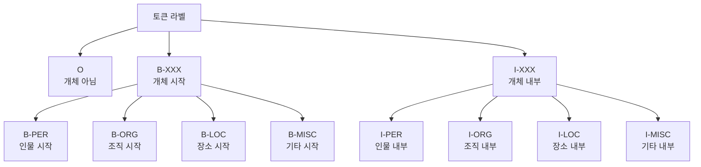
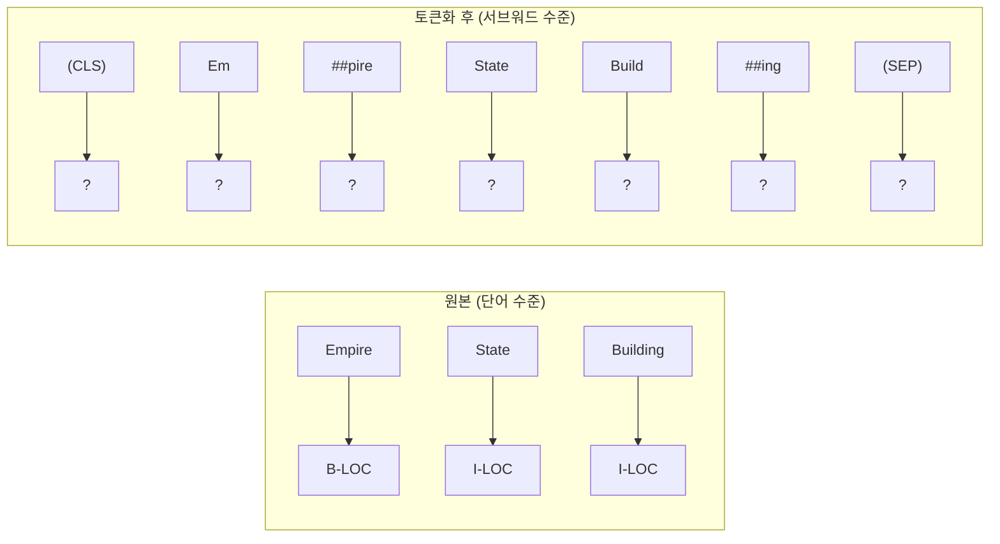
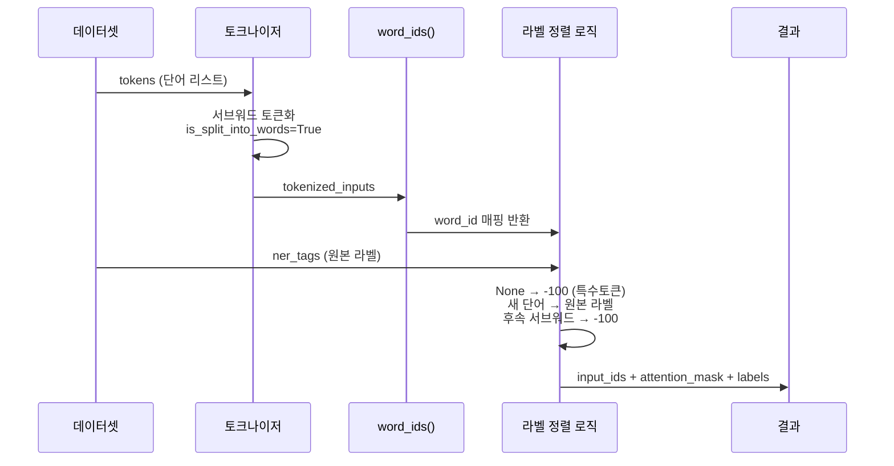
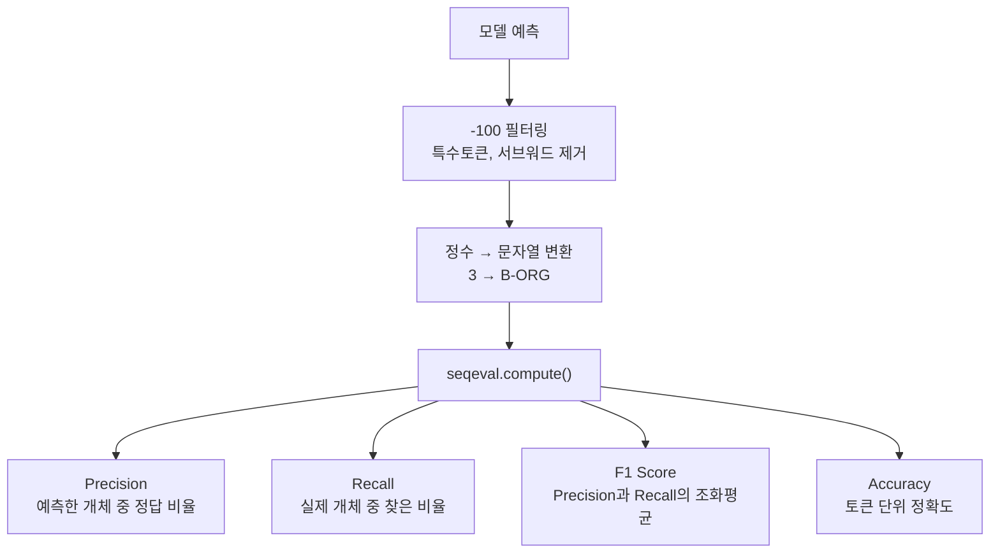
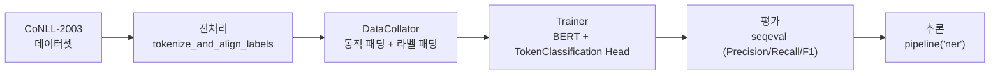

# 토큰 분류(NER) 파인튜닝

> 사전학습 BERT 모델을 개체명 인식(NER) 태스크에 파인튜닝하고, 서브워드-단어 라벨 정렬의 핵심 기법을 마스터합니다.

## 개요

이 섹션에서는 토큰 수준 분류 태스크의 대표 주자인 **개체명 인식(Named Entity Recognition, NER)**을 다룹니다. 앞서 [텍스트 분류 파인튜닝](19-파인튜닝과-전이학습/02-02-trainer-api로-텍스트-분류-파인튜닝.md)에서는 문장 전체에 하나의 라벨을 부여했다면, NER에서는 **각 토큰마다 라벨을 예측**해야 합니다. 여기서 가장 까다로운 문제가 바로 서브워드 토크나이제이션과 단어 수준 라벨 사이의 **불일치(mismatch)**를 해결하는 것인데요, 이 섹션에서 그 핵심 기법을 완전히 정복합니다.

**선수 지식**:
- [파인튜닝의 원리와 전략](19-파인튜닝과-전이학습/01-01-파인튜닝의-원리와-전략.md)에서 배운 전이학습 개념
- [Trainer API로 텍스트 분류 파인튜닝](19-파인튜닝과-전이학습/02-02-trainer-api로-텍스트-분류-파인튜닝.md)의 TrainingArguments와 Trainer 사용법
- [서브워드 토크나이제이션](15-서브워드-토크나이제이션/01-01-서브워드-토크나이제이션의-필요성.md)에서 배운 BPE/WordPiece 원리

**학습 목표**:
- BIO 태깅 체계의 원리를 이해하고 NER 라벨을 해석할 수 있다
- 서브워드 토큰과 단어 수준 라벨을 정렬하는 `tokenize_and_align_labels` 함수를 구현할 수 있다
- `DataCollatorForTokenClassification`과 `seqeval` 메트릭을 활용한 NER 파인튜닝 파이프라인을 구축할 수 있다
- 파인튜닝된 NER 모델로 추론을 수행할 수 있다

## 왜 알아야 할까?

여러분이 뉴스 기사에서 등장하는 기업명, 인물명, 지역명을 자동으로 추출해야 한다고 상상해 보세요. 문장 분류로는 "이 기사에 인물이 언급되었다" 정도만 알 수 있지만, NER을 쓰면 **"어떤 인물이 어디서 언급되었는지"**까지 정확히 짚어낼 수 있습니다.

NER은 현대 NLP의 핵심 빌딩 블록입니다:
- **검색 엔진**: 쿼리에서 인물/장소/조직을 식별하여 검색 품질 향상
- **고객 지원**: 티켓에서 제품명, 오류 코드, 날짜를 자동 추출
- **의료 NLP**: 진료 기록에서 약물명, 질병명, 증상을 추출
- **금융**: 뉴스에서 기업명과 금액을 추출하여 자동 분석
- **RAG 파이프라인**: 문서에서 핵심 엔티티를 추출하여 지식 그래프 구축

텍스트 분류가 "이 문장은 긍정이다"라면, NER은 "이 문장에서 **'삼성전자'**는 조직이고, **'서울'**은 장소이며, **'이재용'**은 인물이다"처럼 **훨씬 세밀한 정보**를 제공하죠.

## 핵심 개념

### 개념 1: BIO 태깅 체계 — NER의 언어

> 💡 **비유**: 형광펜으로 책에 밑줄을 그을 때를 떠올려 보세요. 형광펜을 **처음 내리는 순간**이 B(Beginning), 이미 긋고 있는 **중간 부분**이 I(Inside), 밑줄이 **없는 부분**이 O(Outside)입니다. "삼성전자 주가"에서 "삼성"에 형광펜을 처음 대면 B-ORG, "전자"까지 이어 그으면 I-ORG, "주가"는 밑줄 없으니 O가 됩니다.

BIO 태깅은 NER에서 가장 널리 쓰이는 라벨링 체계입니다. 각 토큰에 세 종류의 접두사 중 하나를 붙입니다:

| 접두사 | 의미 | 예시 |
|--------|------|------|
| **B-** | 개체의 **시작**(Beginning) | "European" → B-ORG |
| **I-** | 개체의 **내부**(Inside) | "Union" → I-ORG |
| **O** | 개체가 **아님**(Outside) | "rejects" → O |

CoNLL-2003 데이터셋의 실제 예시를 보겠습니다:

```run:python
# BIO 태깅 시각화
words = ["EU", "rejects", "German", "call", "to",
         "boycott", "British", "lamb", "."]
labels = ["B-ORG", "O", "B-MISC", "O", "O",
          "O", "B-MISC", "O", "O"]

# 정렬하여 출력
for word, label in zip(words, labels):
    tag_display = f"[{label}]" if label != "O" else "O"
    print(f"{word:12s} → {tag_display}")
```

```output
EU           → [B-ORG]
rejects      → O
German       → [B-MISC]
call         → O
to           → O
boycott      → O
British      → [B-MISC]
lamb         → O
.            → O
```

> 📊 **그림 1**: BIO 태깅 체계의 라벨 구조



B-와 I-가 왜 둘 다 필요할까요? 만약 "New York"과 "Times"가 연속으로 나온다고 해봅시다. B- 없이 I-만 쓰면 "New York Times"가 하나의 개체인지, "New York"과 "Times"가 별개 개체인지 구분할 수 없습니다. B-가 새로운 개체의 **경계선** 역할을 하는 거죠.

```
New    York   Times   Square
B-ORG  I-ORG  I-ORG   B-LOC    ← "New York Times"는 한 조직, "Square"는 별개 장소
```

> 💡 **알고 계셨나요?**: BIO 외에도 BIOES(B-I-O-E-S, E=End, S=Single) 체계가 있습니다. 단일 토큰 개체(S)와 개체의 마지막 토큰(E)을 명시적으로 표시하여 더 정확한 경계 인식이 가능하지만, 라벨 수가 늘어나는 트레이드오프가 있습니다.

### 개념 2: 서브워드-단어 라벨 정렬 — NER의 가장 까다로운 문제

> 💡 **비유**: 여러분이 한글 문서에 이름표를 붙이는데, 문서가 음절 단위로 쪼개져 있다고 상상해 보세요. "삼성전자"라는 한 단어에 "B-ORG"라는 이름표 하나를 붙여야 하는데, 문서에는 "삼", "성", "전", "자"로 4개 조각이 있습니다. 첫 조각 "삼"에만 이름표를 붙이고 나머지는 "무시" 표시를 해야겠죠 — 이것이 바로 서브워드 라벨 정렬의 핵심입니다.

BERT의 WordPiece 토크나이저는 단어를 서브워드로 분할합니다. "playing"은 "play"와 "##ing"으로, "@paulwalk"는 "@", "paul", "##walk"로 쪼개지죠. 문제는 원본 데이터의 NER 라벨은 **단어 단위**인데, 토큰은 **서브워드 단위**라는 것입니다.

> 📊 **그림 2**: 서브워드 토큰화로 인한 라벨 불일치 문제



이 불일치를 해결하는 핵심 도구가 `word_ids()` 메서드입니다. 각 서브워드 토큰이 원본의 **몇 번째 단어**에서 왔는지 알려줍니다:

```run:python
from transformers import AutoTokenizer

tokenizer = AutoTokenizer.from_pretrained("bert-base-cased")

# 이미 단어 단위로 분리된 입력
words = ["EU", "rejects", "German", "call", "to",
         "boycott", "British", "lamb", "."]
tokenized = tokenizer(words, is_split_into_words=True)

# 각 서브워드 토큰 → 원본 단어 인덱스
tokens = tokenizer.convert_ids_to_tokens(tokenized["input_ids"])
word_ids = tokenized.word_ids()

for token, wid in zip(tokens, word_ids):
    print(f"{token:12s} → word_id: {wid}")
```

```output
[CLS]        → word_id: None
EU           → word_id: 0
rejects      → word_id: 1
German       → word_id: 2
call         → word_id: 3
to           → word_id: 4
boycott      → word_id: 5
British      → word_id: 6
la           → word_id: 7
##mb         → word_id: 7
.            → word_id: 8
[SEP]        → word_id: None
```

"lamb"이 "la"와 "##mb"로 분할되었지만, 둘 다 `word_id: 7`을 가리킵니다. 이제 라벨 정렬 규칙을 정리하면:

| 토큰 종류 | word_id | 라벨 | 이유 |
|-----------|---------|------|------|
| `[CLS]`, `[SEP]` | `None` | `-100` | 특수 토큰 — 손실 함수에서 무시 |
| 단어의 **첫 번째** 서브워드 | 새로운 숫자 | 원본 라벨 | 이 토큰이 단어를 대표 |
| 단어의 **나머지** 서브워드 | 이전과 같은 숫자 | `-100` | 중복 계산 방지 |

> ⚠️ **흔한 오해**: `-100`은 "라벨 0번(O 태그)"이 아닙니다! PyTorch의 `CrossEntropyLoss`는 `ignore_index=-100`이 기본값이라, 이 값이 할당된 위치는 **손실 계산에서 완전히 제외**됩니다. 만약 `-100` 대신 `0`(O 태그)을 넣으면, 모델이 모든 서브워드 조각을 "개체 아님"으로 학습해 버려 성능이 크게 떨어집니다.

### 개념 3: tokenize_and_align_labels — 핵심 전처리 함수

> 💡 **비유**: 퍼즐 맞추기를 떠올려 보세요. 원본 단어 라벨이 큰 퍼즐 조각이고, 서브워드 토큰이 작은 퍼즐판의 칸이라면, `tokenize_and_align_labels`는 큰 조각을 작은 칸에 맞추는 **변환 함수**입니다. 첫 칸에만 원래 그림을 붙이고, 나머지 칸은 "해당 없음(-100)"으로 비워두는 거죠.

```python
def tokenize_and_align_labels(examples):
    """서브워드 토큰화 + 라벨 정렬을 한 번에 수행"""
    tokenized_inputs = tokenizer(
        examples["tokens"],
        truncation=True,
        is_split_into_words=True  # 이미 단어 분리된 입력임을 알림
    )

    labels = []
    for i, label in enumerate(examples["ner_tags"]):
        word_ids = tokenized_inputs.word_ids(batch_index=i)
        previous_word_idx = None
        label_ids = []
        for word_idx in word_ids:
            if word_idx is None:
                # [CLS], [SEP] 등 특수 토큰 → 무시
                label_ids.append(-100)
            elif word_idx != previous_word_idx:
                # 새 단어의 첫 번째 서브워드 → 원본 라벨 부여
                label_ids.append(label[word_idx])
            else:
                # 같은 단어의 후속 서브워드 → 무시
                label_ids.append(-100)
            previous_word_idx = word_idx
        labels.append(label_ids)

    tokenized_inputs["labels"] = labels
    return tokenized_inputs
```

> 📊 **그림 3**: tokenize_and_align_labels 함수의 처리 흐름



한 가지 대안적 접근법도 알아두면 좋습니다. Hugging Face Course에서 소개하는 방식은 후속 서브워드에 `-100` 대신 **I-** 라벨을 부여하는 것입니다:

```python
# 대안: 후속 서브워드에도 라벨을 부여하되, B- → I-로 변환
def align_labels_with_tokens_v2(labels, word_ids):
    new_labels = []
    current_word = None
    for word_id in word_ids:
        if word_id != current_word:
            current_word = word_id
            label = -100 if word_id is None else labels[word_id]
            new_labels.append(label)
        elif word_id is None:
            new_labels.append(-100)
        else:
            label = labels[word_id]
            # B-XXX → I-XXX로 변환 (홀수 → 짝수)
            if label % 2 == 1:
                label += 1
            new_labels.append(label)
    return new_labels
```

두 방식의 차이는 미세하지만, **첫 서브워드만 라벨링하는 방식**이 더 일반적이고, Hugging Face 공식 태스크 가이드에서도 이 방식을 기본으로 사용합니다.

### 개념 4: DataCollatorForTokenClassification과 seqeval 메트릭

> 💡 **비유**: 텍스트 분류에서 `DataCollatorWithPadding`이 서로 다른 길이의 문장을 같은 길이로 맞춰줬죠? 토큰 분류에서는 입력뿐 아니라 **라벨도** 패딩해야 합니다. 짧은 문장의 라벨 뒤에 `-100`을 채워서 배치 내 모든 샘플의 라벨 길이를 동일하게 맞추는 게 `DataCollatorForTokenClassification`의 역할입니다.

```python
from transformers import DataCollatorForTokenClassification

# 입력과 라벨을 동시에 패딩 — 라벨의 패딩 값은 -100
data_collator = DataCollatorForTokenClassification(tokenizer=tokenizer)
```

NER 평가에는 일반적인 accuracy 대신 **seqeval** 프레임워크를 사용합니다. 왜냐하면 토큰 단위가 아니라 **엔티티 단위**로 평가해야 하기 때문입니다. "European Union"이라는 엔티티에서 "European"만 맞추고 "Union"을 틀리면, 이 엔티티 전체를 틀린 것으로 처리해야 합니다.

> 📊 **그림 4**: seqeval의 엔티티 단위 평가 방식



```python
import evaluate
import numpy as np

seqeval = evaluate.load("seqeval")

def compute_metrics(p):
    predictions, labels = p
    predictions = np.argmax(predictions, axis=2)

    # -100이 아닌 위치만 추출 → 문자열 라벨로 변환
    true_predictions = [
        [label_list[pred] for (pred, lab) in zip(prediction, label) if lab != -100]
        for prediction, label in zip(predictions, labels)
    ]
    true_labels = [
        [label_list[lab] for (pred, lab) in zip(prediction, label) if lab != -100]
        for prediction, label in zip(predictions, labels)
    ]

    results = seqeval.compute(
        predictions=true_predictions, references=true_labels
    )
    return {
        "precision": results["overall_precision"],
        "recall": results["overall_recall"],
        "f1": results["overall_f1"],
        "accuracy": results["overall_accuracy"],
    }
```

핵심 포인트: `compute_metrics` 안에서 `lab != -100` 조건으로 특수 토큰과 후속 서브워드를 **모두 필터링**합니다. 이렇게 해야 실제 단어에 대한 예측만으로 공정하게 평가할 수 있습니다.

## 실습: 직접 해보기

CoNLL-2003 데이터셋으로 BERT NER 모델을 파인튜닝하는 전체 파이프라인을 구축합니다.

### 1단계: 데이터 로딩과 탐색

```python
from datasets import load_dataset
from transformers import AutoTokenizer

# CoNLL-2003: NER 표준 벤치마크 데이터셋
raw_datasets = load_dataset("conll2003")

# 라벨 목록 추출
label_list = raw_datasets["train"].features["ner_tags"].feature.names
# ['O', 'B-PER', 'I-PER', 'B-ORG', 'I-ORG', 'B-LOC', 'I-LOC', 'B-MISC', 'I-MISC']

# 토크나이저 로드 — cased 모델 사용 (대소문자 구분이 NER에 중요!)
tokenizer = AutoTokenizer.from_pretrained("bert-base-cased")
```

> 🔥 **실무 팁**: NER에서는 반드시 **cased 모델**(대소문자 구분)을 사용하세요. "Apple"(회사)과 "apple"(과일)은 대소문자로 구분되는 경우가 많아, uncased 모델을 쓰면 성능이 크게 떨어집니다.

### 2단계: 전처리 함수 정의와 적용

```python
def tokenize_and_align_labels(examples):
    """배치 단위 서브워드 토큰화 + 라벨 정렬"""
    tokenized_inputs = tokenizer(
        examples["tokens"],
        truncation=True,
        is_split_into_words=True
    )

    labels = []
    for i, label in enumerate(examples["ner_tags"]):
        word_ids = tokenized_inputs.word_ids(batch_index=i)
        previous_word_idx = None
        label_ids = []
        for word_idx in word_ids:
            if word_idx is None:
                label_ids.append(-100)
            elif word_idx != previous_word_idx:
                label_ids.append(label[word_idx])
            else:
                label_ids.append(-100)
            previous_word_idx = word_idx
        labels.append(label_ids)

    tokenized_inputs["labels"] = labels
    return tokenized_inputs

# 전체 데이터셋에 적용 (batched=True로 빠르게)
tokenized_datasets = raw_datasets.map(
    tokenize_and_align_labels,
    batched=True,
    remove_columns=raw_datasets["train"].column_names
)
```

### 3단계: 모델과 평가 메트릭 설정

```python
from transformers import (
    AutoModelForTokenClassification,
    TrainingArguments,
    Trainer,
    DataCollatorForTokenClassification,
)
import evaluate
import numpy as np

# id ↔ label 매핑
id2label = {i: label for i, label in enumerate(label_list)}
label2id = {label: i for i, label in enumerate(label_list)}

# 토큰 분류 모델 로드 (9개 라벨)
model = AutoModelForTokenClassification.from_pretrained(
    "bert-base-cased",
    num_labels=len(label_list),
    id2label=id2label,
    label2id=label2id,
)

# 토큰 분류 전용 Data Collator
data_collator = DataCollatorForTokenClassification(tokenizer=tokenizer)

# seqeval 메트릭
seqeval = evaluate.load("seqeval")

def compute_metrics(p):
    predictions, labels = p
    predictions = np.argmax(predictions, axis=2)

    true_predictions = [
        [label_list[pred] for (pred, lab) in zip(prediction, label) if lab != -100]
        for prediction, label in zip(predictions, labels)
    ]
    true_labels = [
        [label_list[lab] for (pred, lab) in zip(prediction, label) if lab != -100]
        for prediction, label in zip(predictions, labels)
    ]

    results = seqeval.compute(predictions=true_predictions, references=true_labels)
    return {
        "precision": results["overall_precision"],
        "recall": results["overall_recall"],
        "f1": results["overall_f1"],
        "accuracy": results["overall_accuracy"],
    }
```

### 4단계: 학습 실행

```python
training_args = TrainingArguments(
    output_dir="bert-finetuned-ner",
    learning_rate=2e-5,
    per_device_train_batch_size=16,
    per_device_eval_batch_size=16,
    num_train_epochs=3,
    weight_decay=0.01,
    eval_strategy="epoch",
    save_strategy="epoch",
    load_best_model_at_end=True,
    fp16=True,  # GPU 메모리 절약 + 속도 향상
)

trainer = Trainer(
    model=model,
    args=training_args,
    train_dataset=tokenized_datasets["train"],
    eval_dataset=tokenized_datasets["validation"],
    processing_class=tokenizer,
    data_collator=data_collator,
    compute_metrics=compute_metrics,
)

# 학습 시작!
trainer.train()
```

### 5단계: 추론

```python
from transformers import pipeline

# 학습된 모델로 NER 파이프라인 구성
ner_pipeline = pipeline(
    "ner",
    model="bert-finetuned-ner",
    aggregation_strategy="simple"  # 서브워드를 자동으로 합쳐줌
)

text = "Samsung Electronics announced a new factory in Austin, Texas."
results = ner_pipeline(text)

for entity in results:
    print(f"{entity['word']:20s} → {entity['entity_group']} (score: {entity['score']:.3f})")
```

`aggregation_strategy="simple"`을 사용하면 "Sam", "##sung"처럼 분할된 서브워드를 자동으로 합쳐서 "Samsung"으로 보여줍니다. 우리가 `-100`으로 처리했던 서브워드 문제를 추론 시에는 파이프라인이 알아서 해결해 주는 셈이죠.

> 📊 **그림 5**: NER 파인튜닝 전체 파이프라인



## 더 깊이 알아보기

### CoNLL-2003: NER 벤치마크의 탄생

2003년, 벨기에 앤트워프 대학의 Erik Tjong Kim Sang과 Fien De Meulder가 CoNLL(Conference on Computational Natural Language Learning) 공유 태스크로 NER 벤치마크 데이터셋을 발표했습니다. 로이터(Reuters) 뉴스 기사에서 수작업으로 4가지 유형의 개체(인물, 조직, 장소, 기타)를 라벨링한 이 데이터셋은, 20년이 넘은 지금까지도 NER 모델의 **표준 벤치마크**로 사용되고 있습니다.

흥미로운 점은, 2003년 당시 최고 성능은 F1 88.76%였는데, BERT가 등장한 2018년 이후 단숨에 F1 92%를 넘겼고, 현재는 94%에 근접합니다. 규칙 기반(hand-crafted features) → CRF → BiLSTM-CRF → BERT 순으로 발전해 온 NER의 역사가 이 하나의 데이터셋 위에 고스란히 기록되어 있는 셈이죠.

### `-100`의 비밀: PyTorch의 숨은 약속

PyTorch의 `CrossEntropyLoss`에는 `ignore_index`라는 파라미터가 있고, 기본값이 `-100`입니다. 이 값이 라벨로 들어오면 해당 위치의 손실을 0으로 처리합니다. Hugging Face가 이 관례를 채택하면서, 트랜스포머 생태계 전체에서 "-100 = 무시"가 **사실상의 표준(de facto standard)**이 되었습니다. 토큰 분류뿐 아니라 언어 모델링에서 패딩 토큰을 무시할 때도 똑같이 `-100`을 사용하죠.

## 흔한 오해와 팁

> ⚠️ **흔한 오해**: "NER은 단순히 각 토큰을 독립적으로 분류하는 것이다" — 아닙니다! B-PER 다음에 I-ORG가 올 수 없듯, 라벨 간에는 **전이 규칙(transition rule)**이 있습니다. BERT 기반 NER은 최종 레이어에서 softmax만 사용하지만, BiLSTM-CRF 같은 전통적 모델은 CRF(Conditional Random Field) 레이어로 이런 전이 규칙을 명시적으로 모델링했습니다. BERT가 충분히 강력해서 CRF 없이도 좋은 성능을 내지만, 라벨 전이를 이해하는 것은 여전히 중요합니다.

> 💡 **알고 계셨나요?**: `is_split_into_words=True` 플래그가 없으면 토크나이저가 입력을 하나의 긴 문자열로 취급하여, 단어 경계를 무시하고 토큰화합니다. NER 데이터는 이미 단어 단위로 분리되어 있으므로, 이 플래그를 반드시 설정해야 `word_ids()`가 올바르게 동작합니다.

> 🔥 **실무 팁**: 한국어 NER을 할 때는 형태소 분석 결과와 서브워드 토큰의 이중 불일치가 발생합니다. `klue/bert-base` 같은 한국어 사전학습 모델과 KLUE-NER 데이터셋을 사용하면 이 문제를 줄일 수 있고, 라벨 정렬 로직은 동일하게 적용됩니다.

## 핵심 정리

| 개념 | 설명 |
|------|------|
| **BIO 태깅** | B(시작), I(내부), O(외부)로 개체 경계를 표시하는 라벨링 체계 |
| **word_ids()** | 각 서브워드 토큰이 원본의 몇 번째 단어에서 왔는지 매핑 |
| **라벨 -100** | PyTorch CrossEntropyLoss가 무시하는 인덱스. 특수 토큰과 후속 서브워드에 할당 |
| **is_split_into_words** | 이미 단어 분리된 입력을 토크나이저에 알리는 플래그 |
| **DataCollatorForTokenClassification** | 입력과 라벨을 동시에 동적 패딩 (라벨 패딩값 = -100) |
| **seqeval** | 엔티티 단위로 Precision/Recall/F1을 계산하는 NER 평가 프레임워크 |
| **AutoModelForTokenClassification** | 사전학습 모델 + 토큰 분류 헤드를 결합한 Hugging Face 모델 클래스 |
| **aggregation_strategy** | 추론 시 서브워드를 자동 병합하는 파이프라인 옵션 |

## 다음 섹션 미리보기

이번 섹션에서 파인튜닝한 모델을 어떻게 **저장하고, 공유하고, 실제 서비스에 배포**할까요? 다음 섹션 [모델 저장·공유·배포](19-파인튜닝과-전이학습/05-05-모델-저장-공유-배포.md)에서는 `save_pretrained`/`push_to_hub`로 모델을 Hub에 업로드하고, ONNX 변환으로 추론 속도를 최적화하는 방법을 다룹니다. 파인튜닝의 결과물을 세상에 내놓는 마지막 퍼즐 조각이죠.

## 참고 자료

- [Token classification — Hugging Face Docs](https://huggingface.co/docs/transformers/en/tasks/token_classification) - 공식 토큰 분류 태스크 가이드. WNUT 17 데이터셋 기반 전체 코드 포함
- [Token classification — Hugging Face Course Ch7.2](https://huggingface.co/learn/llm-course/en/chapter7/2) - CoNLL-2003 기반 NER 튜토리얼. BIO 태깅과 라벨 정렬을 단계별로 설명
- [seqeval — GitHub](https://github.com/chakki-works/seqeval) - NER/POS/청킹 평가 프레임워크. IOB1, IOB2, IOBES 등 다양한 태깅 체계 지원
- [dslim/bert-base-NER — Hugging Face](https://huggingface.co/dslim/bert-base-NER) - CoNLL-2003으로 학습된 BERT NER 모델. 바로 사용 가능한 사전학습 체크포인트
- [seqeval metric — Hugging Face Evaluate](https://huggingface.co/spaces/evaluate-metric/seqeval) - Hugging Face evaluate 라이브러리에서 seqeval을 사용하는 방법

---
### 🔗 Related Sessions
- [fine_tuning](19-파인튜닝과-전이학습/01-01-파인튜닝의-원리와-전략.md) (prerequisite)
- [auto 클래스 패턴](18-hugging-face-transformers-실습/01-01-hugging-face-생태계-소개.md) (prerequisite)
- [from_pretrained](18-hugging-face-transformers-실습/01-01-hugging-face-생태계-소개.md) (prerequisite)
- [trainer_api](19-파인튜닝과-전이학습/02-02-trainer-api로-텍스트-분류-파인튜닝.md) (prerequisite)
- [training_arguments](19-파인튜닝과-전이학습/02-02-trainer-api로-텍스트-분류-파인튜닝.md) (prerequisite)
- [compute_metrics_callback](19-파인튜닝과-전이학습/02-02-trainer-api로-텍스트-분류-파인튜닝.md) (prerequisite)
- [dynamic_padding](19-파인튜닝과-전이학습/02-02-trainer-api로-텍스트-분류-파인튜닝.md) (prerequisite)
