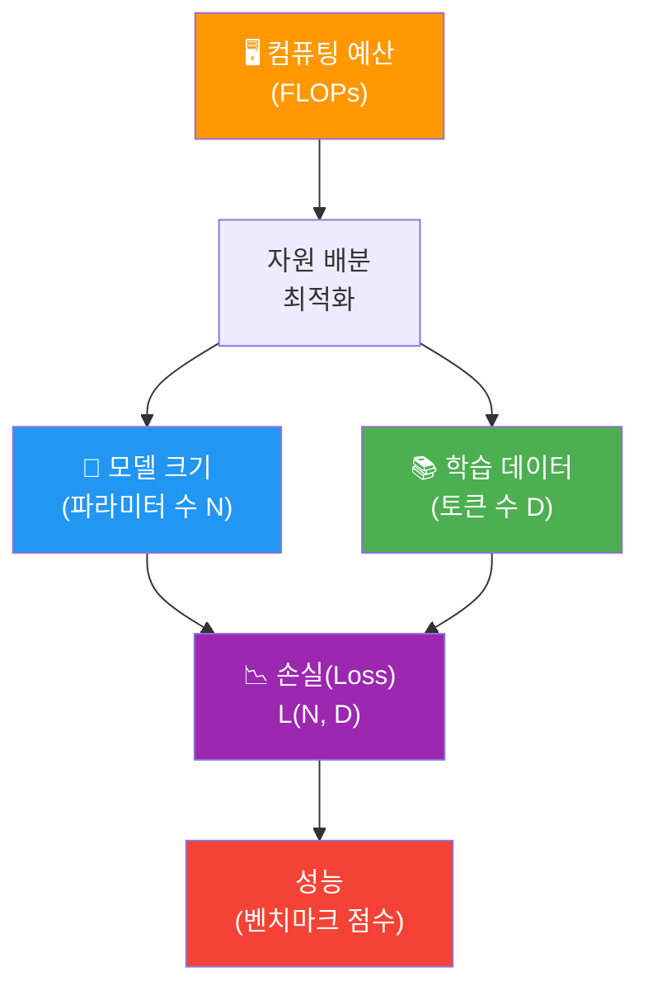
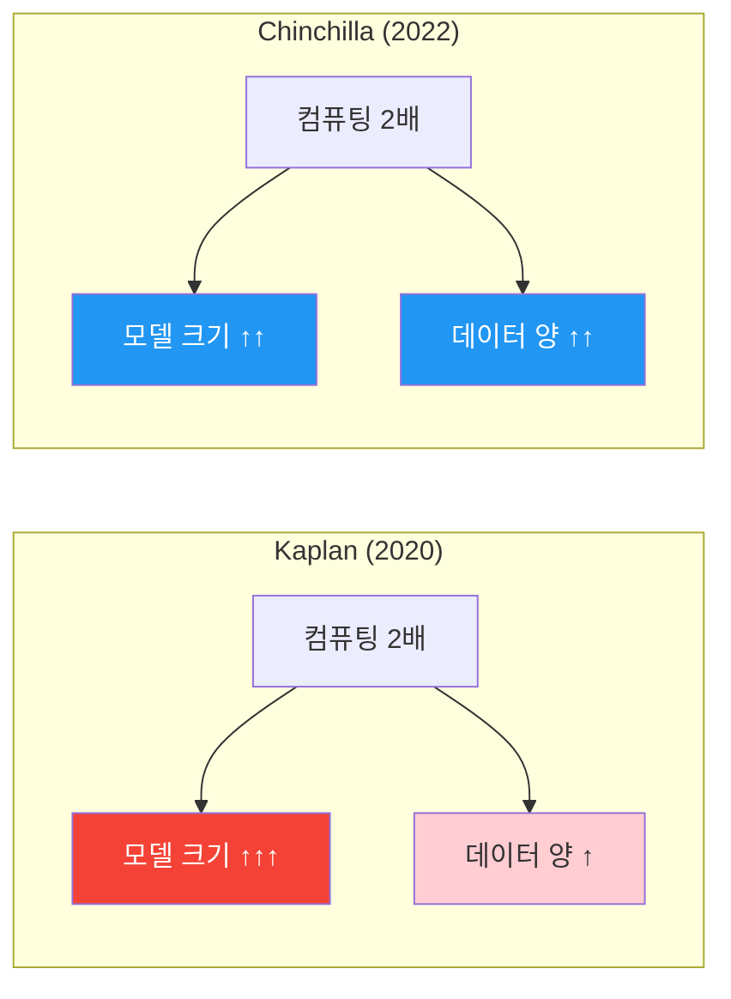
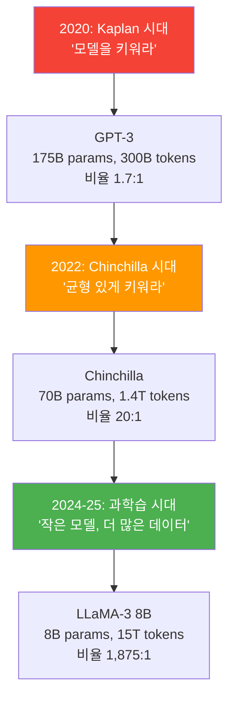
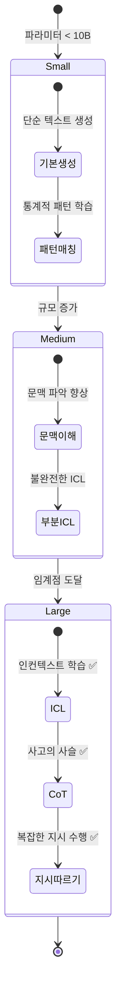

# 스케일링 법칙과 창발적 능력

> 모델을 크게 만들면 정말 더 똑똑해질까? — LLM의 성능을 결정하는 스케일링 법칙과 예상치 못한 능력의 출현을 탐구합니다.

## 개요

이 섹션에서는 대규모 언어 모델(LLM)의 핵심 원리인 **스케일링 법칙**(Scaling Laws)과 **창발적 능력**(Emergent Abilities)을 학습합니다. 모델 크기, 데이터 양, 컴퓨팅 자원이 어떤 관계로 성능에 영향을 미치는지 수학적으로 이해하고, 일정 규모를 넘어서면 갑자기 나타나는 놀라운 능력들을 살펴봅니다.

**선수 지식**: [GPT 계열의 발전: GPT-2에서 GPT-4까지](17-ch17-gpt-생성적-사전학습-모델/03-03-gpt-계열의-발전-gpt-2에서-gpt-4까지.md)에서 다룬 GPT 모델의 확장 과정, [파인튜닝의 원리와 전략](19-ch19-파인튜닝과-전이학습/01-01-파인튜닝의-원리와-전략.md)에서 배운 사전학습-파인튜닝 패러다임

**학습 목표**:
- Kaplan 스케일링 법칙의 멱법칙(Power Law) 관계를 설명할 수 있다
- Chinchilla 법칙의 핵심 통찰과 Kaplan 법칙과의 차이를 비교할 수 있다
- 창발적 능력(In-Context Learning, Chain-of-Thought)의 개념과 조건을 설명할 수 있다
- Python으로 스케일링 법칙을 시뮬레이션하고 시각화할 수 있다

## 왜 알아야 할까?

여러분이 회사에서 "우리도 LLM을 만들어보자"라는 지시를 받았다고 상상해 보세요. 가장 먼저 떠오르는 질문은 이것이겠죠: **"모델을 얼마나 크게 만들어야 하고, 데이터는 얼마나 필요하며, GPU는 몇 대가 필요할까?"**

스케일링 법칙은 바로 이 질문에 답을 주는 나침반입니다. GPT-4의 학습 비용이 1억 달러(약 1,300억 원)를 넘었다는 사실을 알고 계신가요? 이런 막대한 투자를 하기 전에, 스케일링 법칙을 통해 "이 예산으로 어떤 수준의 성능을 기대할 수 있는가"를 **미리 예측**할 수 있습니다.

더 흥미로운 것은 **창발적 능력**입니다. 작은 모델에서는 전혀 불가능했던 능력이 모델 크기가 특정 임계점을 넘으면 갑자기 나타나거든요. 마치 물을 가열하다가 100도에서 갑자기 끓기 시작하는 것처럼요. 이 현상을 이해해야 "어떤 규모의 모델이 우리 태스크에 필요한가"를 판단할 수 있습니다.

## 핵심 개념

### 개념 1: 스케일링 법칙이란 무엇인가

> 💡 **비유**: 스케일링 법칙은 "공부 시간과 시험 점수의 관계"와 비슷합니다. 공부 시간(컴퓨팅)을 2배로 늘린다고 점수(성능)가 2배가 되진 않지만, 일정한 패턴으로 꾸준히 올라가죠. 핵심은 "어떤 과목(모델 크기 vs 데이터)에 시간을 투자하는 게 더 효율적인가"입니다.

스케일링 법칙(Scaling Law)이란, 언어 모델의 성능(보통 Cross-Entropy Loss로 측정)이 **모델 파라미터 수(N)**, **학습 데이터 양(D)**, **컴퓨팅 자원(C)**에 대해 **멱법칙(Power Law)** 관계를 따른다는 경험적 발견입니다.

수식으로 표현하면:

$$L(x) = \left(\frac{x_0}{x}\right)^\alpha + L_\infty$$

- $L$: 모델의 손실(Loss) — 낮을수록 좋음
- $x$: 스케일링 변수(파라미터 수 N, 데이터 D, 또는 컴퓨팅 C)
- $\alpha$: 멱법칙 지수 — 자원 투입 대비 성능 향상 속도
- $L_\infty$: 환원 불가능한 최소 손실(irreducible loss)

이게 의미하는 바는, 자원을 10배 투입해도 손실은 10배 줄어들지 않고, $10^\alpha$만큼만 줄어든다는 것입니다. 수확 체감의 법칙이 작동하지만, 그 패턴이 **놀라울 정도로 예측 가능**하다는 점이 핵심이에요.

> 📊 **그림 1**: 스케일링 법칙의 세 가지 축



스케일링 법칙의 핵심 질문은 결국 이것입니다: **"주어진 컴퓨팅 예산을 모델 크기와 데이터 양에 어떻게 배분해야 최적의 성능을 얻는가?"** 이 질문에 Kaplan과 Chinchilla가 서로 다른 답을 내놓았습니다.

### 개념 2: Kaplan 스케일링 법칙 (2020)

> 💡 **비유**: Kaplan의 접근법은 "큰 그릇에 물을 조금만 담아도 된다"는 철학이에요. 모델이라는 그릇을 크게 만드는 것이 데이터라는 물을 많이 넣는 것보다 효율적이라고 본 거죠.

2020년 1월, OpenAI의 Jared Kaplan 등이 발표한 논문 *"Scaling Laws for Neural Language Models"*는 최초로 체계적인 스케일링 법칙을 제시했습니다. 핵심 발견은 다음과 같습니다:

**Kaplan의 세 가지 법칙:**

$$L(N) \approx \left(\frac{8.8 \times 10^{13}}{N}\right)^{0.076}$$

$$L(D) \approx \left(\frac{5.4 \times 10^{13}}{D}\right)^{0.095}$$

$$L(C) \approx \left(\frac{3.1 \times 10^8}{C}\right)^{0.050}$$

- $N$: 비임베딩 파라미터 수
- $D$: 학습 토큰 수
- $C$: 컴퓨팅 (PetaFLOP-days)

Kaplan의 핵심 결론은 **모델 크기(N)의 지수(0.076)가 데이터(D)의 지수(0.095)보다 작아서, 같은 컴퓨팅을 쓴다면 모델을 키우는 게 더 효율적**이라는 것이었습니다. 이 결론은 GPT-3(175B 파라미터, 300B 토큰)의 설계에 직접 반영되었는데요, 모델은 거대하지만 학습 데이터는 상대적으로 적은 구성이었습니다.

> 📊 **그림 2**: Kaplan vs Chinchilla의 자원 배분 전략 비교



### 개념 3: Chinchilla 스케일링 법칙 (2022)

> 💡 **비유**: Chinchilla의 교훈은 "아무리 좋은 두뇌(큰 모델)를 가져도, 충분히 공부(데이터)하지 않으면 실력이 안 는다"는 것입니다. 천재도 책을 안 읽으면 지식이 부족하듯이요.

2022년, DeepMind의 Jordan Hoffmann 등은 *"Training Compute-Optimal Large Language Models"*에서 Kaplan의 결론을 뒤집는 실험 결과를 발표했습니다. 그들의 핵심 발견:

**Chinchilla 최적 비율**: 파라미터 1개당 약 **20개의 학습 토큰**이 필요하다.

$$N_{opt} \propto C^{0.5}, \quad D_{opt} \propto C^{0.5}$$

즉, 컴퓨팅 예산이 2배가 되면 모델 크기와 데이터 양을 **균등하게** (각각 $\sqrt{2}$배) 늘려야 한다는 것입니다. Kaplan이 "모델 크기에 더 투자하라"고 했다면, Chinchilla는 "50:50으로 가라"고 말한 셈이죠.

이 법칙에 따르면 당시의 대형 모델들은 **심각하게 학습 부족(undertrained)** 상태였습니다:

| 모델 | 파라미터 | 학습 토큰 | 토큰/파라미터 | Chinchilla 기준 |
|------|----------|-----------|-------------|-----------------|
| GPT-3 | 175B | 300B | 1.7 | ❌ 부족 (필요: 3.5T) |
| Gopher | 280B | 300B | 1.1 | ❌ 심각하게 부족 |
| **Chinchilla** | **70B** | **1.4T** | **20** | ✅ 최적 |
| LLaMA-2 | 70B | 2T | 28.6 | ✅ 초과 학습 |

Chinchilla(70B)는 Gopher(280B)보다 **4배 작은** 모델이었지만, 충분한 데이터로 학습한 덕분에 거의 모든 벤치마크에서 Gopher를 이겼습니다. 이 결과는 LLM 연구의 패러다임을 완전히 바꾸었어요.

```run:python
import math

# Chinchilla 최적 비율: 파라미터당 20 토큰
def chinchilla_optimal(compute_budget_flops):
    """주어진 FLOPs 예산에서 최적의 모델 크기와 토큰 수를 계산"""
    # 근사: C ≈ 6 * N * D (FLOPs ≈ 6 * params * tokens)
    # Chinchilla 최적: D = 20 * N
    # C = 6 * N * 20N = 120 * N^2
    # N = sqrt(C / 120)
    N_opt = math.sqrt(compute_budget_flops / 120)
    D_opt = 20 * N_opt
    return N_opt, D_opt

# 다양한 컴퓨팅 예산에서 최적 설정 계산
budgets = {
    "소형 (1e18 FLOPs)": 1e18,
    "중형 (1e21 FLOPs)": 1e21,
    "대형 (1e24 FLOPs)": 1e24,    # GPT-3급
    "초대형 (1e25 FLOPs)": 1e25,  # GPT-4급 추정
}

print("=" * 65)
print(f"{'예산':<22} {'최적 파라미터':>14} {'최적 토큰':>14} {'비율':>6}")
print("=" * 65)

for name, flops in budgets.items():
    n, d = chinchilla_optimal(flops)
    ratio = d / n
    # 사람이 읽기 쉬운 단위로 변환
    def human_readable(x):
        if x >= 1e12:
            return f"{x/1e12:.1f}T"
        elif x >= 1e9:
            return f"{x/1e9:.1f}B"
        elif x >= 1e6:
            return f"{x/1e6:.1f}M"
        else:
            return f"{x:.0f}"
    
    print(f"{name:<22} {human_readable(n):>14} {human_readable(d):>14} {ratio:>5.0f}x")
```

```output
=================================================================
예산                       최적 파라미터        최적 토큰    비율
=================================================================
소형 (1e18 FLOPs)            91.3M          1.8B    20x
중형 (1e21 FLOPs)            2.9B         57.7B    20x
대형 (1e24 FLOPs)           91.3B          1.8T    20x
초대형 (1e25 FLOPs)         288.7B          5.8T    20x
```

> ⚠️ **흔한 오해**: "Chinchilla 법칙에 따르면 70B가 최적의 모델 크기다"라고 생각하기 쉽지만, 70B는 **특정 컴퓨팅 예산**에서의 최적이었을 뿐입니다. 예산이 다르면 최적 크기도 달라져요. 핵심은 "70B"라는 숫자가 아니라 "파라미터당 20토큰"이라는 비율입니다.

### 개념 4: 최근 트렌드 — Chinchilla를 넘어서

실제 산업계에서는 Chinchilla의 20:1 비율을 크게 넘어서는 **과학습(Over-training)** 전략을 사용합니다. 왜 그럴까요?

Chinchilla는 **학습 비용만** 최적화했지, **추론 비용**은 고려하지 않았거든요. 실제로 배포된 모델은 수백만 번의 추론을 수행하기 때문에, 작은 모델을 더 오래 학습시키는 것이 **총 비용** 면에서 훨씬 유리합니다.

| 모델 (2023-2025) | 파라미터 | 학습 토큰 | 토큰/파라미터 비율 |
|-------------------|----------|-----------|-------------------|
| LLaMA-2 70B | 70B | 2T | 28:1 |
| LLaMA-3 8B | 8B | 15T | 1,875:1 |
| Mistral 7B | 7B | ~8T | ~1,143:1 |
| Qwen3-0.6B | 0.6B | 36T | 60,000:1 |

Qwen3-0.6B의 토큰/파라미터 비율이 60,000:1이라는 사실은 놀라운데요, Chinchilla 기준의 3,000배에 달합니다. 2025년 Nature Machine Intelligence에 발표된 "Densing Law"에 따르면, **동일 성능을 달성하는 데 필요한 파라미터 수가 약 3.5개월마다 절반으로 줄어들고** 있습니다.

> 📊 **그림 3**: 스케일링 전략의 진화



### 개념 5: 창발적 능력 (Emergent Abilities)

> 💡 **비유**: 창발적 능력은 마치 "레고 블록 쌓기"와 같습니다. 블록 몇 개로는 그냥 탑만 쌓을 수 있지만, 수천 개가 모이면 갑자기 **성(城)**이나 **자동차**처럼 완전히 새로운 것을 만들 수 있게 되죠. 개별 블록에는 없던 능력이 수량이 임계점을 넘으면 **갑자기** 나타나는 겁니다.

창발적 능력(Emergent Abilities)이란, 작은 모델에서는 전혀 나타나지 않다가 모델 규모가 특정 임계점을 넘으면 **급격하게** 나타나는 능력을 말합니다. 2022년 Google의 Jason Wei 등이 체계적으로 정리했죠.

대표적인 창발적 능력:

**1. 인컨텍스트 학습(In-Context Learning, ICL)**
모델에게 몇 가지 예시를 보여주면, 별도의 학습(파인튜닝) 없이 새로운 태스크를 수행하는 능력입니다. GPT-3(175B)에서 처음 두드러지게 나타났어요.

```
입력: "고양이 → cat, 강아지 → dog, 사과 →"
출력: "apple"
```

**2. 사고의 사슬(Chain-of-Thought, CoT)**
복잡한 추론 문제를 단계별로 풀어나가는 능력입니다. "Let's think step by step"이라는 간단한 프롬프트만으로도 수학 문제 정답률이 크게 향상됩니다.

**3. 지시 따르기(Instruction Following)**
구체적인 지시를 이해하고 따르는 능력입니다. 작은 모델은 지시를 무시하거나 엉뚱한 답을 하지만, 큰 모델은 복잡한 지시도 정확히 수행합니다.

> 📊 **그림 4**: 창발적 능력의 발현 패턴



그런데 2024년 ACL에서 발표된 흥미로운 연구가 있습니다. "창발적 능력은 진짜 새로운 능력이 아니라, 인컨텍스트 학습 능력이 규모에 따라 점진적으로 향상된 결과"라는 주장이에요. 1,000개 이상의 실험을 통해, 인컨텍스트 학습과 지시 따르기를 통제하면 대부분의 창발적 현상이 사라진다는 것을 보여주었습니다.

이 논쟁은 아직 진행 중이지만, 실무적으로 중요한 시사점은 분명합니다: **모델 규모가 클수록 더 복잡한 태스크를 수행할 수 있으며, 그 전환점이 존재한다**는 것이죠.

### 개념 6: LLM 학습 비용의 현실

LLM 학습에 드는 비용을 체감할 수 있도록 실제 수치를 정리해 봅시다.

학습 FLOPs의 근사 공식:

$$C \approx 6 \times N \times D$$

- $C$: 총 FLOPs (부동소수점 연산 횟수)
- $N$: 모델 파라미터 수
- $D$: 학습 토큰 수
- 계수 6: 순전파(2) + 역전파(4)의 곱셈-덧셈 연산

```run:python
def estimate_training_cost(params_billions, tokens_trillions, 
                           gpu_tflops=312, gpu_price_per_hour=2.0,
                           gpu_utilization=0.4):
    """LLM 학습 비용을 추정하는 함수
    
    Args:
        params_billions: 파라미터 수 (단위: 10억)
        tokens_trillions: 학습 토큰 수 (단위: 1조)
        gpu_tflops: GPU의 이론적 TFLOPS (A100=312, H100=990)
        gpu_price_per_hour: GPU 1개 시간당 클라우드 비용 (달러)
        gpu_utilization: GPU 활용률 (보통 30-50%)
    """
    # 총 FLOPs 계산
    total_flops = 6 * (params_billions * 1e9) * (tokens_trillions * 1e12)
    
    # GPU 시간 계산
    effective_tflops = gpu_tflops * gpu_utilization * 1e12  # FLOPS로 변환
    gpu_seconds = total_flops / effective_tflops
    gpu_hours = gpu_seconds / 3600
    
    # 비용 계산
    cost_usd = gpu_hours * gpu_price_per_hour
    
    # 1024 GPU로 학습 시 소요 일수
    days_1024_gpus = gpu_hours / (1024 * 24)
    
    return {
        "total_flops": total_flops,
        "gpu_hours": gpu_hours,
        "cost_usd": cost_usd,
        "days_1024_gpus": days_1024_gpus,
    }

# 주요 모델들의 학습 비용 추정 (A100 기준)
models = [
    ("GPT-3 (175B)", 175, 0.3),
    ("Chinchilla (70B)", 70, 1.4),
    ("LLaMA-2 (70B)", 70, 2.0),
    ("LLaMA-3 (8B)", 8, 15.0),
    ("GPT-4 (추정 1.8T)", 1800, 13.0),
]

print(f"{'모델':<22} {'FLOPs':>12} {'GPU시간(A100)':>14} {'비용(USD)':>12} {'1024GPU 일수':>13}")
print("=" * 75)

for name, params, tokens in models:
    result = estimate_training_cost(params, tokens)
    flops_str = f"{result['total_flops']:.1e}"
    hours_str = f"{result['gpu_hours']:,.0f}"
    cost_str = f"${result['cost_usd']:,.0f}"
    days_str = f"{result['days_1024_gpus']:.1f}일"
    print(f"{name:<22} {flops_str:>12} {hours_str:>14} {cost_str:>12} {days_str:>13}")
```

```output
모델                           FLOPs  GPU시간(A100)       비용(USD)   1024GPU 일수
===========================================================================
GPT-3 (175B)           3.2e+23       2,529,133   $5,058,267         102.9일
Chinchilla (70B)       5.9e+23       4,700,855   $9,401,709         191.1일
LLaMA-2 (70B)          8.4e+23       6,715,506  $13,431,013         273.0일
LLaMA-3 (8B)           7.2e+23       5,769,231  $11,538,462         234.4일
GPT-4 (추정 1.8T)      1.4e+26  1,123,076,923 $2,246,153,846      45,657.1일
```

> 🔥 **실무 팁**: 실제 학습 비용은 이 추정치보다 **2-3배 더 높을** 수 있습니다. 실험 반복, 체크포인팅 오버헤드, 통신 비용, 하드웨어 장애 등을 고려해야 하거든요. 또한 H100은 A100보다 약 3배 빠르지만 가격도 비싸기 때문에, GPU 세대에 따라 비용 구조가 달라집니다.

## 실습: 직접 해보기

스케일링 법칙을 시각적으로 이해하기 위해, Kaplan과 Chinchilla 법칙을 시뮬레이션하고 비교해 봅시다.

```python
import numpy as np
import matplotlib.pyplot as plt
import matplotlib

# 한국어 폰트 설정 (환경에 따라 조정 필요)
matplotlib.rcParams['font.family'] = 'DejaVu Sans'

# --- 1. 멱법칙 시뮬레이션 ---
# Kaplan 논문의 근사 파라미터
def kaplan_loss(N):
    """Kaplan 스케일링: 파라미터 수 N에 대한 손실"""
    return (8.8e13 / N) ** 0.076

def chinchilla_loss(N, D):
    """Chinchilla 스케일링: N과 D에 대한 결합 손실 (근사)"""
    # Hoffmann et al. 의 근사 형태
    A, B = 406.4, 410.7
    alpha, beta = 0.34, 0.28
    E = 1.69  # 환원불가능 손실
    return A / (N ** alpha) + B / (D ** beta) + E

# 파라미터 범위: 1M ~ 1T
N_range = np.logspace(6, 12, 100)  # 1M to 1T

# --- 2. 다양한 컴퓨팅 예산에서 최적 모델 크기 비교 ---
compute_budgets = np.logspace(17, 25, 50)  # FLOPs

# Kaplan 최적: N에 더 많이 투자 (N ∝ C^0.73)
kaplan_optimal_N = (compute_budgets / 6) ** 0.73

# Chinchilla 최적: N과 D에 균등 투자 (N ∝ C^0.5)
chinchilla_optimal_N = np.sqrt(compute_budgets / 120)

fig, axes = plt.subplots(1, 2, figsize=(14, 5))

# 그래프 1: Kaplan Loss vs Parameters
ax1 = axes[0]
losses = kaplan_loss(N_range)
ax1.loglog(N_range, losses, 'b-', linewidth=2, label='L(N) = (8.8e13/N)^0.076')
ax1.set_xlabel('Parameters (N)', fontsize=12)
ax1.set_ylabel('Cross-Entropy Loss', fontsize=12)
ax1.set_title('Kaplan Scaling Law: Loss vs Model Size', fontsize=13)
ax1.legend(fontsize=10)
ax1.grid(True, alpha=0.3)

# 주요 모델 위치 표시
models_plot = {
    'GPT-2\n(1.5B)': 1.5e9,
    'GPT-3\n(175B)': 175e9,
    'Chinchilla\n(70B)': 70e9,
}
for name, n in models_plot.items():
    ax1.plot(n, kaplan_loss(n), 'ro', markersize=8)
    ax1.annotate(name, (n, kaplan_loss(n)), textcoords="offset points",
                xytext=(10, 10), fontsize=9, color='red')

# 그래프 2: 최적 모델 크기 비교
ax2 = axes[1]
ax2.loglog(compute_budgets, kaplan_optimal_N, 'r--', linewidth=2, label='Kaplan: N ~ C^0.73')
ax2.loglog(compute_budgets, chinchilla_optimal_N, 'g-', linewidth=2, label='Chinchilla: N ~ C^0.5')
ax2.set_xlabel('Compute Budget (FLOPs)', fontsize=12)
ax2.set_ylabel('Optimal Model Size (N)', fontsize=12)
ax2.set_title('Optimal Model Size: Kaplan vs Chinchilla', fontsize=13)
ax2.legend(fontsize=10)
ax2.grid(True, alpha=0.3)

# 차이 영역 표시
ax2.fill_between(compute_budgets, kaplan_optimal_N, chinchilla_optimal_N,
                 alpha=0.1, color='orange', label='Difference')

plt.tight_layout()
plt.savefig('scaling_laws_comparison.png', dpi=150, bbox_inches='tight')
plt.show()
print("그래프가 저장되었습니다: scaling_laws_comparison.png")
```

```python
# --- 3. 창발적 능력 시뮬레이션 ---
# 모델 크기별 태스크 정확도 (시뮬레이션)

def emergent_accuracy(params_billions, threshold=50, steepness=0.15):
    """창발적 능력의 시그모이드 전환을 시뮬레이션"""
    # 로그 스케일에서의 시그모이드
    log_params = np.log10(params_billions)
    log_threshold = np.log10(threshold)
    return 1 / (1 + np.exp(-steepness * 100 * (log_params - log_threshold)))

model_sizes = np.logspace(-1, 3, 200)  # 0.1B ~ 1000B

tasks = {
    "In-Context Learning (ICL)": {"threshold": 10, "steepness": 0.12},
    "Chain-of-Thought (CoT)": {"threshold": 60, "steepness": 0.18},
    "Instruction Following": {"threshold": 30, "steepness": 0.15},
    "Multi-step Reasoning": {"threshold": 100, "steepness": 0.20},
}

plt.figure(figsize=(10, 6))
colors = ['#2196F3', '#F44336', '#4CAF50', '#FF9800']

for (task_name, params), color in zip(tasks.items(), colors):
    accuracy = emergent_accuracy(model_sizes, **params)
    plt.semilogx(model_sizes, accuracy * 100, '-', linewidth=2.5, 
                 label=task_name, color=color)
    # 임계점 표시
    plt.axvline(x=params['threshold'], color=color, linestyle=':', alpha=0.3)

plt.xlabel('Model Size (Billion Parameters)', fontsize=12)
plt.ylabel('Task Accuracy (%)', fontsize=12)
plt.title('Emergent Abilities: Performance vs Model Scale', fontsize=14)
plt.legend(fontsize=10, loc='lower right')
plt.grid(True, alpha=0.3)
plt.ylim(-5, 105)

# 영역 구분
plt.axvspan(0.1, 10, alpha=0.05, color='red', label='Small')
plt.axvspan(10, 100, alpha=0.05, color='yellow')
plt.axvspan(100, 1000, alpha=0.05, color='green')

plt.text(1, 95, 'Small\n(<10B)', fontsize=9, ha='center', color='gray')
plt.text(30, 95, 'Medium\n(10-100B)', fontsize=9, ha='center', color='gray')
plt.text(300, 95, 'Large\n(>100B)', fontsize=9, ha='center', color='gray')

plt.tight_layout()
plt.savefig('emergent_abilities.png', dpi=150, bbox_inches='tight')
plt.show()
print("그래프가 저장되었습니다: emergent_abilities.png")
```

```run:python
# --- 4. 간단한 요약 통계 ---
print("=== 스케일링 법칙 핵심 수치 요약 ===\n")

# Chinchilla 최적 계산
examples = [
    ("7B 모델", 7),
    ("13B 모델", 13),
    ("70B 모델", 70),
    ("175B 모델", 175),
    ("500B 모델", 500),
]

print(f"{'모델 크기':<12} {'Chinchilla 최적 토큰':>20} {'필요 FLOPs':>16}")
print("-" * 52)
for name, params_b in examples:
    optimal_tokens = params_b * 20  # 파라미터당 20토큰
    flops = 6 * params_b * 1e9 * optimal_tokens * 1e9
    
    if optimal_tokens >= 1000:
        token_str = f"{optimal_tokens/1000:.1f}T"
    else:
        token_str = f"{optimal_tokens}B"
    
    print(f"{name:<12} {token_str:>20} {flops:.1e}")

print("\n💡 Chinchilla 비율: 파라미터 1개당 약 20개의 학습 토큰")
print("💡 FLOPs 근사: C ≈ 6 × N × D")
```

```output
=== 스케일링 법칙 핵심 수치 요약 ===

모델 크기     Chinchilla 최적 토큰       필요 FLOPs
----------------------------------------------------
7B 모델                       140B        5.9e+21
13B 모델                      260B        2.0e+22
70B 모델                      1.4T        5.9e+23
175B 모델                     3.5T        3.7e+24
500B 모델                    10.0T        3.0e+25

💡 Chinchilla 비율: 파라미터 1개당 약 20개의 학습 토큰
💡 FLOPs 근사: C ≈ 6 × N × D
```

## 더 깊이 알아보기

### 스케일링 법칙의 탄생 — OpenAI의 내부 실험

스케일링 법칙의 발견에는 흥미로운 뒷이야기가 있습니다. 2019년, OpenAI의 연구원 Jared Kaplan은 다양한 크기의 트랜스포머 모델을 학습시키면서 이상한 패턴을 발견했어요. 로그-로그 그래프에서 손실을 그려보니, 모델 크기에 관계없이 **거의 완벽한 직선**이 나타난 겁니다.

이것은 물리학에서 흔히 보이는 **멱법칙**이었습니다. 사실 Kaplan은 물리학 박사 출신이었는데, 자연 현상에서 익숙하게 봐왔던 멱법칙이 신경망에서도 나타난다는 사실에 크게 흥분했다고 합니다. 멱법칙은 지진의 크기-빈도 관계(구텐베르크-리히터 법칙), 도시 인구 분포(지프의 법칙) 등 자연 곳곳에서 발견되는 보편적 패턴이거든요.

### "친칠라"라는 이름의 유래

DeepMind의 Chinchilla 모델은 왜 이 귀여운 설치류의 이름을 따왔을까요? DeepMind는 당시 Gopher(땅다람쥐)라는 대형 모델을 운영하고 있었는데, 이를 뛰어넘는 작지만 효율적인 모델을 만들면서 비슷한 크기의 동물 이름을 붙인 것입니다. 280B짜리 "땅다람쥐"를 70B짜리 "친칠라"가 이겼다는 건, 크기가 아니라 학습 전략이 중요하다는 메시지이기도 했죠.

### 추론 시간 스케일링 — 새로운 프론티어

2024년, OpenAI의 o1 모델과 함께 **추론 시간 컴퓨팅(Test-time Compute)** 스케일링이라는 새로운 패러다임이 등장했습니다. 기존의 스케일링 법칙이 "학습 시간에 더 많은 자원을 투입하면 성능이 올라간다"였다면, 추론 시간 스케일링은 "추론 시에 더 많이 생각하게 하면 성능이 올라간다"는 발견입니다. 이는 인간이 어려운 문제에 더 오래 생각하는 것과 비슷한 원리입니다.

## 흔한 오해와 팁

> ⚠️ **흔한 오해**: "모델이 크면 무조건 좋다" — 아닙니다! Chinchilla 법칙이 보여주듯, 175B 모델이 70B 모델에 지는 일이 실제로 일어납니다. 핵심은 모델 크기와 데이터의 **균형**이에요. 최근에는 오히려 **작은 모델 + 압도적으로 많은 데이터** 전략이 주류가 되고 있습니다.

> 💡 **알고 계셨나요?**: 2017년 원조 트랜스포머의 학습 비용은 약 $900이었습니다. 7년 후 GPT-4의 학습 비용은 1억 달러를 넘긴 것으로 추정됩니다. 약 10만 배가 증가한 셈이죠. 하지만 이 기간 동안 모델의 능력은 "단순 번역"에서 "대학원 시험 합격"으로 질적 전환을 이루었습니다.

> 🔥 **실무 팁**: 스케일링 법칙을 실무에 활용하는 가장 실용적인 방법은 **작은 모델로 실험하고, 대형 모델 성능을 예측하는 것**입니다. 예를 들어 1B, 3B, 7B 모델로 손실 곡선을 그린 뒤, 멱법칙으로 외삽하면 70B 모델의 대략적인 성능을 학습 없이 추정할 수 있습니다. 이 방법으로 수백만 달러의 비용을 아낀 사례가 여럿 있어요.

## 핵심 정리

| 개념 | 설명 |
|------|------|
| **스케일링 법칙** | 모델 성능이 파라미터, 데이터, 컴퓨팅에 대해 멱법칙(Power Law)을 따르는 경험적 법칙 |
| **Kaplan 법칙 (2020)** | 컴퓨팅 예산 증가 시 모델 크기를 더 키우는 것이 효율적 (N ∝ C^0.73) |
| **Chinchilla 법칙 (2022)** | 모델 크기와 데이터를 균등하게 스케일링. 최적 비율: 파라미터당 20토큰 |
| **과학습 트렌드 (2024-)** | 추론 비용 절감을 위해 작은 모델을 Chinchilla 비율 이상으로 학습 |
| **창발적 능력** | 일정 규모 이상에서 급격히 나타나는 능력 (ICL, CoT, Instruction Following) |
| **FLOPs 근사** | C ≈ 6 × N × D (순전파 + 역전파) |
| **Densing Law** | 동일 성능의 필요 파라미터가 ~3.5개월마다 절반으로 감소 (2025) |

## 다음 섹션 미리보기

스케일링 법칙으로 모델의 **학습**을 이해했다면, 다음은 학습된 모델이 텍스트를 **생성**하는 방법을 알아볼 차례입니다. [텍스트 생성과 디코딩 전략](20-ch20-llm의-이해와-활용/02-02-텍스트-생성과-디코딩-전략.md)에서는 그리디 디코딩, 빔 서치, Top-k, Top-p(Nucleus) 샘플링 등 다양한 디코딩 전략을 구현하고 비교합니다. 모델이 "다음 단어를 어떻게 선택하는가"의 비밀을 파헤쳐 봅시다.

## 참고 자료

- [Scaling Laws for Neural Language Models (Kaplan et al., 2020)](https://arxiv.org/abs/2001.08361) - 최초의 체계적 스케일링 법칙 논문. 멱법칙 관계의 발견
- [Training Compute-Optimal Large Language Models (Hoffmann et al., 2022)](https://arxiv.org/abs/2203.15556) - Chinchilla 논문. "파라미터당 20토큰" 법칙의 원전
- [Emergent Abilities in Large Language Models: A Survey (2025)](https://arxiv.org/abs/2503.05788) - 창발적 능력에 대한 최신 서베이. 다양한 관점 종합
- [Are Emergent Abilities in LLMs just In-Context Learning? (ACL 2024)](https://aclanthology.org/2024.acl-long.279/) - 창발적 능력의 본질에 대한 비판적 분석
- [mlabonne/llm-course (GitHub)](https://github.com/mlabonne/llm-course) - LLM 학습 로드맵과 실습 자료 모음
- [Stanford CS 224N: NLP with Deep Learning](https://web.stanford.edu/class/cs224n/) - NLP 전반과 LLM의 이론적 기초
- [Densing Law of LLMs (Nature Machine Intelligence, 2025)](https://www.nature.com/articles/s42256-025-01137-0) - 모델 효율성이 지수적으로 향상되고 있음을 보인 연구