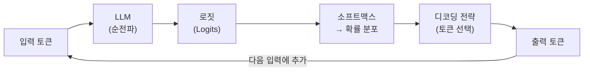
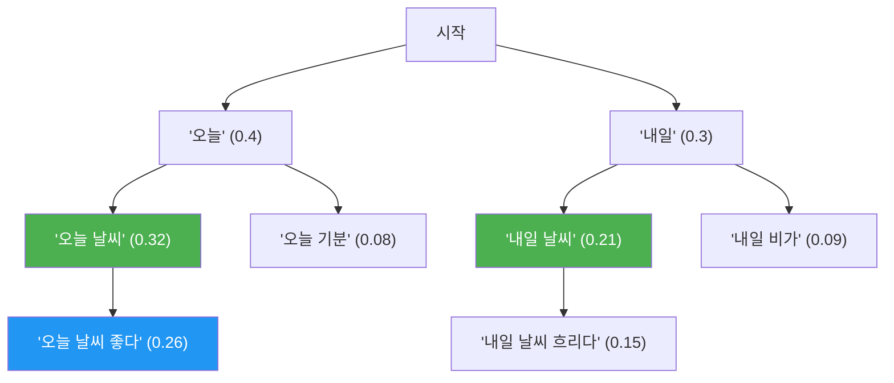
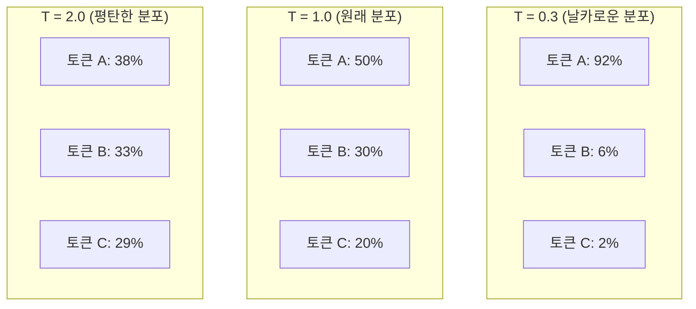
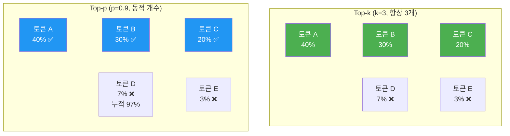
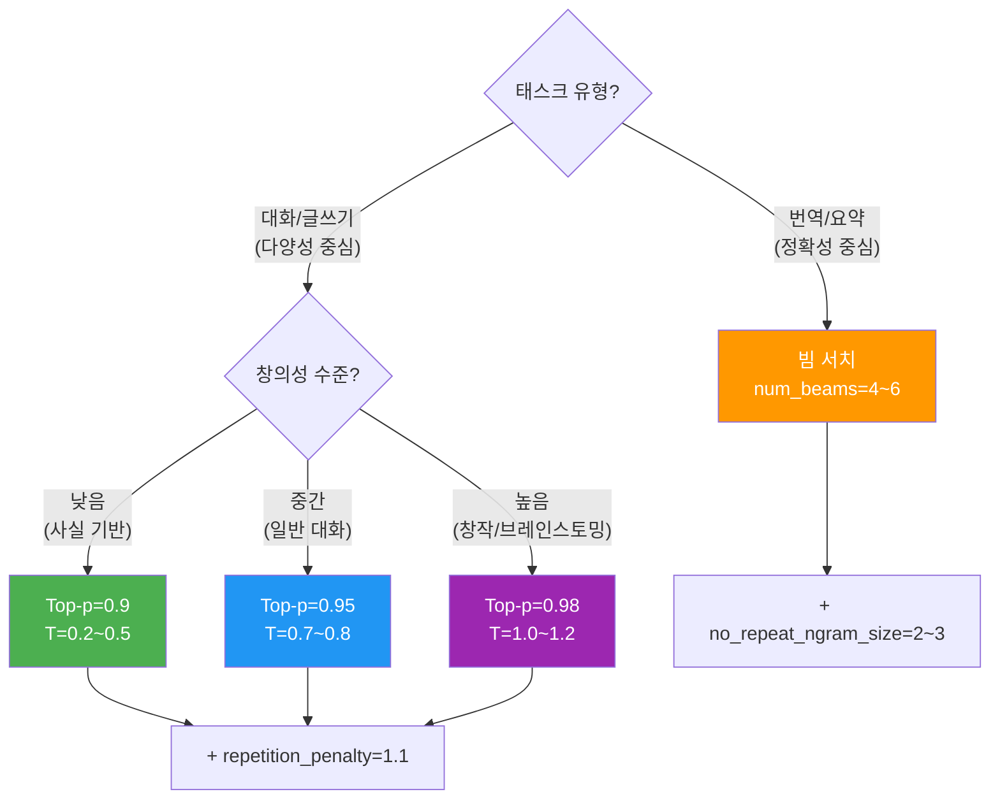

# 텍스트 생성과 디코딩 전략

> LLM이 텍스트를 생성하는 다양한 방법을 이해하고, 그리디 디코딩부터 Nucleus 샘플링까지 직접 구현해봅니다.

## 개요

이 섹션에서는 언어 모델이 학습을 마친 뒤 **실제로 텍스트를 어떻게 한 토큰씩 생성하는지** 그 메커니즘을 파헤칩니다. 같은 모델이라도 디코딩 전략에 따라 판에 박힌 문장이 나올 수도, 창의적이고 다채로운 글이 나올 수도 있거든요.

**선수 지식**: [스케일링 법칙과 창발적 능력](20-ch20-llm의-이해와-활용/01-01-스케일링-법칙과-창발적-능력.md)에서 배운 LLM의 기본 개념, [자기회귀 언어 모델링](17-ch17-gpt-생성적-사전학습-모델/01-01-자기회귀-언어-모델링.md)에서 다룬 다음 토큰 예측 원리

**학습 목표**:
- 그리디 디코딩과 빔 서치의 작동 원리와 한계를 설명할 수 있다
- 온도(Temperature)가 확률 분포를 어떻게 변형하는지 이해한다
- Top-k 샘플링과 Top-p(Nucleus) 샘플링의 차이를 구현으로 비교한다
- Hugging Face `generate()` API를 활용해 다양한 디코딩 전략을 실험한다

## 왜 알아야 할까?

ChatGPT에게 같은 질문을 여러 번 해보면, 매번 조금씩 다른 답변이 나오는 걸 경험해보셨을 겁니다. 반면 코드 생성을 요청하면 꽤 일관된 결과가 나오죠. 이 차이는 모델 자체가 달라서가 아니라, **디코딩 전략과 파라미터 설정이 다르기 때문**입니다.

디코딩 전략은 LLM 애플리케이션의 **사용자 경험을 좌우하는 핵심 요소**입니다. 챗봇의 창의성, 번역의 정확성, 코드 생성의 일관성 — 모두 디코딩 전략 하나로 극적으로 달라집니다. LLM을 활용하는 개발자라면, 이 "마지막 1마일"을 반드시 이해해야 합니다.

## 핵심 개념

### 개념 1: 자기회귀 생성의 기본 원리

> 💡 **비유**: 언어 모델의 텍스트 생성은 **시험에서 빈칸 채우기**와 비슷합니다. "오늘 날씨가 ___" 다음에 올 단어 후보를 확률로 매기고, 그중 하나를 선택하는 거죠. 이걸 한 칸씩 반복하면 문장이 완성됩니다.

자기회귀(autoregressive) 언어 모델은 이전에 생성한 토큰들을 조건으로 다음 토큰의 확률 분포를 계산합니다. 수식으로 표현하면:

$$P(w_1, w_2, ..., w_T) = \prod_{t=1}^{T} P(w_t | w_1, ..., w_{t-1})$$

- $w_t$: 시점 $t$에서 생성할 토큰
- $P(w_t | w_1, ..., w_{t-1})$: 이전 토큰들이 주어졌을 때 다음 토큰의 조건부 확률

모델은 매 시점마다 어휘 사전 전체에 대한 확률 분포(로짓 → 소프트맥스)를 출력하고, **디코딩 전략이 이 분포에서 실제 토큰을 선택**합니다. 어떤 전략을 쓰느냐에 따라 결과가 완전히 달라지죠.

> 📊 **그림 1**: 자기회귀 텍스트 생성 흐름



이 루프가 종료 토큰(EOS)이 나오거나 최대 길이에 도달할 때까지 반복됩니다.

### 개념 2: 그리디 디코딩 (Greedy Decoding)

> 💡 **비유**: 그리디 디코딩은 **매 갈림길에서 가장 넓은 길만 고르는 등산객**과 같습니다. 당장 눈앞의 최선을 선택하지만, 전체적으로 보면 정상까지의 최적 경로를 놓칠 수 있죠.

그리디 디코딩은 가장 단순한 전략입니다. 매 시점에서 확률이 가장 높은 토큰 하나만 선택합니다:

$$w_t = \arg\max_{w} P(w | w_1, ..., w_{t-1})$$

```run:python
import torch
import torch.nn.functional as F

# 어휘 사전: 간단한 예시
vocab = ["오늘", "내일", "날씨", "가", "좋다", "나쁘다", "매우", "<eos>"]

# 모델이 출력한 로짓 (가상)
logits = torch.tensor([0.5, 0.1, 2.3, 1.8, 3.1, 0.2, 1.5, 0.3])

# 소프트맥스로 확률 변환
probs = F.softmax(logits, dim=-1)

# 그리디: 가장 높은 확률의 토큰 선택
greedy_idx = torch.argmax(probs).item()
print(f"확률 분포: {[f'{p:.3f}' for p in probs.tolist()]}")
print(f"그리디 선택: '{vocab[greedy_idx]}' (확률: {probs[greedy_idx]:.3f})")
```

```output
확률 분포: ['0.048', '0.032', '0.291', '0.176', '0.647', '0.036', '0.131', '0.039']
그리디 선택: '좋다' (확률: 0.647)
```

그리디 디코딩은 빠르고 결정적(deterministic)이지만, 치명적인 문제가 있습니다 — **반복(repetition)**. "이것은 좋은 좋은 좋은..." 같은 루프에 빠지기 쉽거든요. 이 현상을 **텍스트 퇴화(text degeneration)**라고 부릅니다.

### 개념 3: 빔 서치 (Beam Search)

> 💡 **비유**: 빔 서치는 **여러 명의 정찰대를 동시에 보내는 것**과 같습니다. 각 정찰대가 다른 경로를 탐색하고, 최종적으로 가장 좋은 경로를 보고한 정찰대의 결과를 채택하죠.

빔 서치는 매 시점에서 상위 $k$개(빔 폭, beam width)의 후보 시퀀스를 유지하면서 탐색합니다. 그리디가 1개의 경로만 보는 것과 달리, 여러 경로를 동시에 추적하므로 더 좋은 전체 시퀀스를 찾을 가능성이 높습니다.

> 📊 **그림 2**: 빔 서치 (beam_width=2) 탐색 과정



빔 서치는 기계 번역이나 요약처럼 **정답에 가까운 출력**이 필요한 태스크에 효과적입니다. 하지만 개방형 텍스트 생성에서는 여전히 반복적이고 지루한 텍스트를 만들어내는 경향이 있죠.

```python
# Hugging Face에서 빔 서치 사용
from transformers import AutoModelForCausalLM, AutoTokenizer

model_name = "gpt2"
tokenizer = AutoTokenizer.from_pretrained(model_name)
model = AutoModelForCausalLM.from_pretrained(model_name)

input_ids = tokenizer.encode("The future of AI", return_tensors="pt")

# 빔 서치: num_beams > 1
output = model.generate(
    input_ids,
    max_new_tokens=50,
    num_beams=5,                    # 빔 폭 = 5
    no_repeat_ngram_size=2,         # 2-gram 반복 방지
    early_stopping=True             # EOS 나오면 조기 종료
)

print(tokenizer.decode(output[0], skip_special_tokens=True))
```

### 개념 4: 온도 (Temperature)

> 💡 **비유**: 온도는 **주사위의 면 수를 조절하는 다이얼**입니다. 온도가 낮으면 6면체 주사위에서 특정 면이 압도적으로 나오고(결정적), 온도가 높으면 모든 면이 비슷한 확률로 나옵니다(무작위).

온도 $T$는 소프트맥스 함수에 적용되어 확률 분포의 **뾰족함(sharpness)**을 조절합니다:

$$P(w_i) = \frac{\exp(z_i / T)}{\sum_j \exp(z_j / T)}$$

- $T = 1.0$: 원래 분포 그대로
- $T < 1.0$: 분포가 뾰족해짐 → 높은 확률 토큰에 집중 (더 결정적)
- $T > 1.0$: 분포가 평탄해짐 → 다양한 토큰 선택 가능 (더 무작위)
- $T → 0$: 그리디 디코딩과 동일

> 📊 **그림 3**: 온도에 따른 확률 분포 변화



```run:python
import torch
import torch.nn.functional as F

logits = torch.tensor([2.0, 1.0, 0.5, 0.1])
tokens = ["좋다", "괜찮다", "보통이다", "나쁘다"]

for temp in [0.3, 0.7, 1.0, 1.5]:
    probs = F.softmax(logits / temp, dim=-1)
    dist_str = " | ".join(f"{t}: {p:.1%}" for t, p in zip(tokens, probs))
    print(f"T={temp}: {dist_str}")
```

```output
T=0.3: 좋다: 91.1% | 괜찮다: 6.5% | 보통이다: 2.0% | 나쁘다: 0.5%
T=0.7: 좋다: 57.2% | 괜찮다: 24.3% | 보통이다: 13.4% | 나쁘다: 5.1%
T=1.0: 좋다: 42.6% | 괜찮다: 24.0% | 보통이다: 17.2% | 나쁘다: 16.2%
T=1.5: 좋다: 32.9% | 괜찮다: 23.8% | 보통이다: 19.8% | 나쁘다: 23.5%
```

### 개념 5: Top-k 샘플링

> 💡 **비유**: Top-k 샘플링은 **레스토랑 메뉴에서 인기 상위 k개만 남기고 나머지를 가리는 것**과 같습니다. 선택지를 줄여서 엉뚱한 주문(말도 안 되는 토큰)을 방지하면서도, 남은 메뉴 중에서는 자유롭게 고를 수 있죠.

Top-k 샘플링은 확률이 가장 높은 상위 $k$개 토큰만 후보로 남기고, 나머지는 확률을 0으로 만든 뒤 재정규화하여 샘플링합니다. Fan et al. (2018)이 처음 제안했습니다.

```python
import torch
import torch.nn.functional as F

def top_k_sampling(logits, k=10, temperature=1.0):
    """Top-k 샘플링 구현"""
    # 온도 적용
    logits = logits / temperature

    # 상위 k개만 남기기
    top_k_logits, top_k_indices = torch.topk(logits, k)

    # 나머지는 -inf로 마스킹
    filtered_logits = torch.full_like(logits, float('-inf'))
    filtered_logits.scatter_(0, top_k_indices, top_k_logits)

    # 확률 변환 후 샘플링
    probs = F.softmax(filtered_logits, dim=-1)
    sampled_idx = torch.multinomial(probs, num_samples=1)
    return sampled_idx.item()
```

문제는 $k$를 **고정값으로 설정**한다는 점입니다. 어떤 시점에서는 확률이 2~3개 토큰에 집중되어 있어서 $k=50$이면 너무 많고, 다른 시점에서는 확률이 넓게 퍼져 있어서 $k=50$이면 너무 적을 수 있습니다. 이 문제를 해결한 것이 바로 Top-p 샘플링입니다.

### 개념 6: Top-p (Nucleus) 샘플링

> 💡 **비유**: Top-p 샘플링은 **예산의 90%를 채울 때까지 장바구니에 물건을 담는 것**과 같습니다. 물건이 비쌀 때는 적게 담고, 쌀 때는 많이 담죠 — 상황에 따라 **장바구니 크기가 자동으로 조절**됩니다.

Top-p(Nucleus) 샘플링은 Holtzman et al. (2020)이 제안한 방법으로, 누적 확률이 $p$ 이상이 되는 최소한의 토큰 집합(nucleus)에서 샘플링합니다.

$$\text{Nucleus}(p) = \min\{V' \subseteq V : \sum_{w \in V'} P(w) \geq p\}$$

핵심은 **후보 수가 동적**이라는 점입니다. 확률 분포가 뾰족하면 소수의 토큰만 선택되고, 평탄하면 더 많은 토큰이 포함됩니다.

> 📊 **그림 4**: Top-k vs Top-p 샘플링 비교



```python
import torch
import torch.nn.functional as F

def top_p_sampling(logits, p=0.9, temperature=1.0):
    """Top-p (Nucleus) 샘플링 구현"""
    # 온도 적용
    logits = logits / temperature
    probs = F.softmax(logits, dim=-1)

    # 확률 내림차순 정렬
    sorted_probs, sorted_indices = torch.sort(probs, descending=True)

    # 누적 확률 계산
    cumulative_probs = torch.cumsum(sorted_probs, dim=-1)

    # 누적 확률이 p를 초과하는 토큰 마스킹
    # (첫 번째 토큰은 항상 포함)
    sorted_mask = cumulative_probs - sorted_probs > p
    sorted_probs[sorted_mask] = 0.0

    # 재정규화
    sorted_probs /= sorted_probs.sum()

    # 샘플링
    sampled_sorted_idx = torch.multinomial(sorted_probs, num_samples=1)
    sampled_idx = sorted_indices[sampled_sorted_idx]
    return sampled_idx.item()
```

### 개념 7: 반복 페널티와 보조 기법

텍스트 퇴화의 가장 흔한 증상은 **반복**입니다. 이를 방지하기 위해 두 가지 메커니즘이 널리 사용됩니다.

**반복 페널티 (repetition_penalty)**: 이미 생성된 토큰의 로짓을 페널티 값으로 나누어 재선택 확률을 낮춥니다. Keskar et al. (2019)이 제안했으며, 보통 1.1~1.3 범위를 사용합니다.

**N-gram 반복 방지 (no_repeat_ngram_size)**: 지정된 크기의 n-gram이 두 번 이상 나오지 못하게 강제합니다. 예를 들어 `no_repeat_ngram_size=3`이면 3단어 조합이 절대 반복되지 않습니다.

> 📊 **그림 5**: 디코딩 전략 선택 가이드



## 실습: 직접 해보기

모든 디코딩 전략을 Hugging Face `generate()` API로 직접 비교해봅시다.

```python
from transformers import AutoModelForCausalLM, AutoTokenizer
import torch

# GPT-2 모델 로드
model_name = "gpt2"
tokenizer = AutoTokenizer.from_pretrained(model_name)
model = AutoModelForCausalLM.from_pretrained(model_name)
model.eval()

# 입력 텍스트
prompt = "Artificial intelligence will"
input_ids = tokenizer.encode(prompt, return_tensors="pt")

# pad_token 설정 (GPT-2는 기본 pad_token이 없음)
tokenizer.pad_token = tokenizer.eos_token

# ===== 1. 그리디 디코딩 =====
greedy_output = model.generate(
    input_ids,
    max_new_tokens=40,
    do_sample=False       # 샘플링 비활성화 = 그리디
)
print("=== 그리디 디코딩 ===")
print(tokenizer.decode(greedy_output[0], skip_special_tokens=True))
print()

# ===== 2. 빔 서치 =====
beam_output = model.generate(
    input_ids,
    max_new_tokens=40,
    num_beams=5,
    no_repeat_ngram_size=2,   # 2-gram 반복 방지
    do_sample=False
)
print("=== 빔 서치 (beam=5) ===")
print(tokenizer.decode(beam_output[0], skip_special_tokens=True))
print()

# ===== 3. Top-k 샘플링 =====
torch.manual_seed(42)
topk_output = model.generate(
    input_ids,
    max_new_tokens=40,
    do_sample=True,
    top_k=50,                 # 상위 50개 토큰에서 샘플링
    temperature=0.8
)
print("=== Top-k 샘플링 (k=50, T=0.8) ===")
print(tokenizer.decode(topk_output[0], skip_special_tokens=True))
print()

# ===== 4. Top-p (Nucleus) 샘플링 =====
torch.manual_seed(42)
topp_output = model.generate(
    input_ids,
    max_new_tokens=40,
    do_sample=True,
    top_p=0.92,               # 누적 확률 92%까지의 토큰에서 샘플링
    top_k=0,                  # top_k 비활성화 (top_p만 사용)
    temperature=0.8
)
print("=== Top-p 샘플링 (p=0.92, T=0.8) ===")
print(tokenizer.decode(topp_output[0], skip_special_tokens=True))
print()

# ===== 5. 조합: Top-k + Top-p + 반복 페널티 =====
torch.manual_seed(42)
combined_output = model.generate(
    input_ids,
    max_new_tokens=40,
    do_sample=True,
    top_k=50,
    top_p=0.95,
    temperature=0.7,
    repetition_penalty=1.2,    # 반복 페널티
    no_repeat_ngram_size=3     # 3-gram 반복 방지
)
print("=== 조합 전략 (k=50, p=0.95, T=0.7, rep=1.2) ===")
print(tokenizer.decode(combined_output[0], skip_special_tokens=True))
```

이제 온도에 따른 생성 다양성을 수치로 비교해봅시다.

```python
from collections import Counter

def measure_diversity(model, tokenizer, input_ids, n_samples=5, **gen_kwargs):
    """같은 프롬프트에서 N번 생성하여 다양성 측정"""
    outputs = []
    for i in range(n_samples):
        torch.manual_seed(i)  # 다른 시드로 생성
        out = model.generate(input_ids, **gen_kwargs)
        text = tokenizer.decode(out[0], skip_special_tokens=True)
        outputs.append(text)

    # 고유 출력 비율로 다양성 측정
    unique_ratio = len(set(outputs)) / len(outputs)

    # 평균 토큰 중복률 계산
    all_tokens = []
    for text in outputs:
        tokens = tokenizer.encode(text)
        all_tokens.extend(tokens)
    token_counts = Counter(all_tokens)
    total = sum(token_counts.values())
    unique = len(token_counts)

    return {
        "unique_outputs": f"{len(set(outputs))}/{n_samples}",
        "unique_ratio": f"{unique_ratio:.0%}",
        "vocab_diversity": f"{unique/total:.2%}"
    }

# 온도별 다양성 비교
print("온도별 생성 다양성 비교:")
print("-" * 50)
for temp in [0.3, 0.7, 1.0, 1.5]:
    result = measure_diversity(
        model, tokenizer, input_ids,
        max_new_tokens=30,
        do_sample=True,
        top_p=0.95,
        temperature=temp
    )
    print(f"T={temp}: 고유 출력={result['unique_outputs']}, "
          f"다양성={result['unique_ratio']}, "
          f"어휘 다양성={result['vocab_diversity']}")
```

## 더 깊이 알아보기

### Nucleus 샘플링의 탄생 — "신경망 텍스트 퇴화의 기이한 사건"

2019년, 워싱턴 대학의 Ari Holtzman과 동료들은 흥미로운 현상을 발견했습니다. GPT-2 같은 강력한 언어 모델이 학습 데이터의 perplexity는 매우 낮은데, 막상 텍스트를 생성하면 끔찍하게 반복적이고 지루한 글을 내놓는다는 것이었죠.

그들은 이 현상을 **"텍스트 퇴화(text degeneration)"**라고 명명하고, 그 원인을 추적했습니다. 핵심 발견은 인간이 쓴 텍스트의 토큰 선택 확률이 모델의 최고 확률 토큰과 자주 불일치한다는 것이었습니다. 인간은 때로 예측 가능한 단어를 쓰고, 때로 의외의 단어를 씁니다 — 그리디 디코딩이 포착할 수 없는 패턴이죠.

이 연구의 제목이 바로 *"The Curious Case of Neural Text Degeneration"* (ICLR 2020)입니다. 이 논문에서 제안된 Nucleus 샘플링(Top-p)은 현재 거의 모든 LLM API의 기본 디코딩 전략으로 자리 잡았습니다. OpenAI, Anthropic, Google 등 주요 AI 기업의 API에서 `top_p` 파라미터를 제공하는 것이 바로 이 논문의 직접적인 영향입니다.

### 빔 서치의 기원

빔 서치는 원래 NLP가 아니라 **음성 인식** 분야에서 1970년대에 개발되었습니다. 음성 신호를 텍스트로 변환할 때 가능한 모든 단어 조합을 탐색하는 것은 불가능하므로, 상위 몇 개의 후보만 유지하는 "빔(beam, 광선)" 전략이 고안된 것이죠. 이 아이디어가 기계 번역, 텍스트 생성 등 NLP 전반으로 퍼져나가면서 수십 년간 디코딩의 표준으로 군림했습니다. 하지만 개방형 생성 시대에 접어들면서 그 자리를 샘플링 기반 방법에 넘겨주게 됩니다.

## 흔한 오해와 팁

> ⚠️ **흔한 오해**: "온도를 높이면 모델이 더 똑똑해진다" — 아닙니다! 온도는 모델의 지식이나 능력을 바꾸지 않습니다. 동일한 확률 분포의 **형태만 변형**할 뿐이죠. 높은 온도는 무작위성을 증가시켜 창의적으로 *보이게* 할 수 있지만, 동시에 문법 오류나 비논리적 내용의 확률도 높아집니다.

> 💡 **알고 계셨나요?**: `top_k`와 `top_p`를 동시에 사용하면 두 필터가 모두 적용됩니다. 즉 Top-k로 먼저 후보를 줄이고, 그 안에서 Top-p를 적용하는 식입니다. Hugging Face의 `generate()` API가 정확히 이렇게 동작하며, 실무에서는 이 조합이 가장 흔하게 사용됩니다.

> 🔥 **실무 팁**: 태스크별 권장 설정값:
> - **코드 생성 / 사실 기반 Q&A**: `temperature=0.2~0.5`, `top_p=0.9`, 낮은 무작위성
> - **창작 / 스토리텔링**: `temperature=0.7~1.0`, `top_p=0.95`, 적절한 다양성
> - **브레인스토밍**: `temperature=1.0~1.2`, `top_p=0.98`, 높은 다양성
> - 반복 문제가 있으면 `repetition_penalty=1.1~1.3` 추가

## 핵심 정리

| 개념 | 설명 | 특징 |
|------|------|------|
| 그리디 디코딩 | 매 시점 최고 확률 토큰 선택 | 빠르지만 반복 위험 |
| 빔 서치 | 상위 k개 시퀀스를 병렬 탐색 | 번역에 적합, 개방형 생성엔 부적합 |
| 온도 (Temperature) | 확률 분포의 뾰족함 조절 | T↓=결정적, T↑=무작위 |
| Top-k 샘플링 | 상위 k개 토큰에서 샘플링 | 고정된 후보 수 |
| Top-p (Nucleus) | 누적 확률 p까지의 토큰에서 샘플링 | 동적 후보 수, 가장 널리 사용 |
| 반복 페널티 | 이미 생성된 토큰의 확률 감소 | 텍스트 퇴화 방지 |
| `generate()` API | Hugging Face의 통합 생성 인터페이스 | 모든 전략을 파라미터로 제어 |

## 다음 섹션 미리보기

디코딩 전략이 모델의 "어떻게 말할지"를 결정한다면, **프롬프트 엔지니어링**은 모델에게 "무엇을 말할지"를 지시하는 기술입니다. [프롬프트 엔지니어링 기초](20-ch20-llm의-이해와-활용/03-03-프롬프트-엔지니어링-기초.md)에서는 제로샷, 퓨샷, Chain-of-Thought 프롬프팅 등 LLM의 능력을 극대화하는 기법을 배워보겠습니다.

## 참고 자료

- [How to generate text: using different decoding methods for language generation with Transformers](https://huggingface.co/blog/how-to-generate) - Hugging Face 공식 블로그, 디코딩 전략의 교과서적 설명
- [Generation strategies - Hugging Face Docs](https://huggingface.co/docs/transformers/en/generation_strategies) - `generate()` API 공식 문서, 최신 파라미터 레퍼런스
- [The Curious Case of Neural Text Degeneration (Holtzman et al., 2020)](https://arxiv.org/abs/1904.09751) - Nucleus 샘플링을 제안한 ICLR 2020 논문
- [Decoding Strategies in Large Language Models](https://huggingface.co/blog/mlabonne/decoding-strategies) - mlabonne의 디코딩 전략 종합 가이드
- [The Illustrated GPT-2](https://jalammar.github.io/illustrated-gpt2/) - GPT-2 아키텍처와 텍스트 생성 과정의 시각적 설명
- [Generation - Hugging Face Docs](https://huggingface.co/docs/transformers/main_classes/text_generation) - GenerationConfig 전체 파라미터 레퍼런스

---
### 🔗 Related Sessions
- [scaling_law](20-ch20-llm의-이해와-활용/01-01-스케일링-법칙과-창발적-능력.md) (prerequisite)
