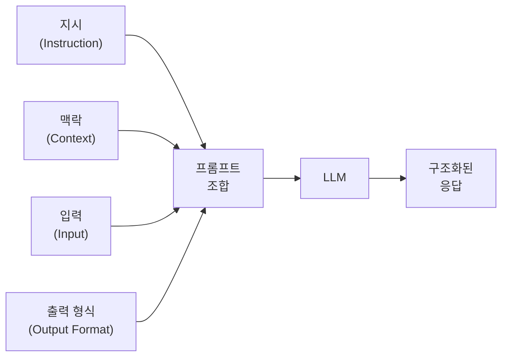
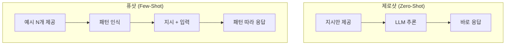
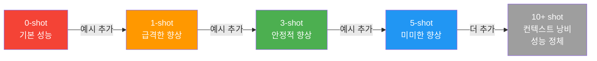
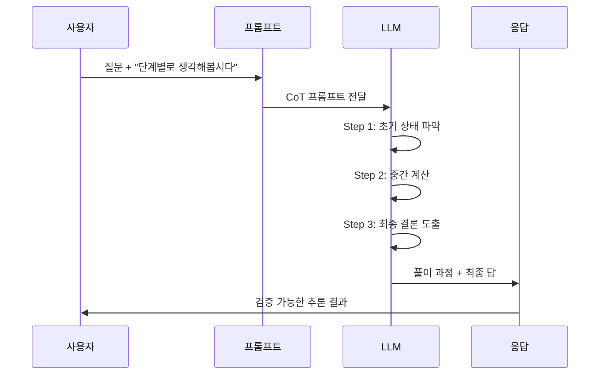
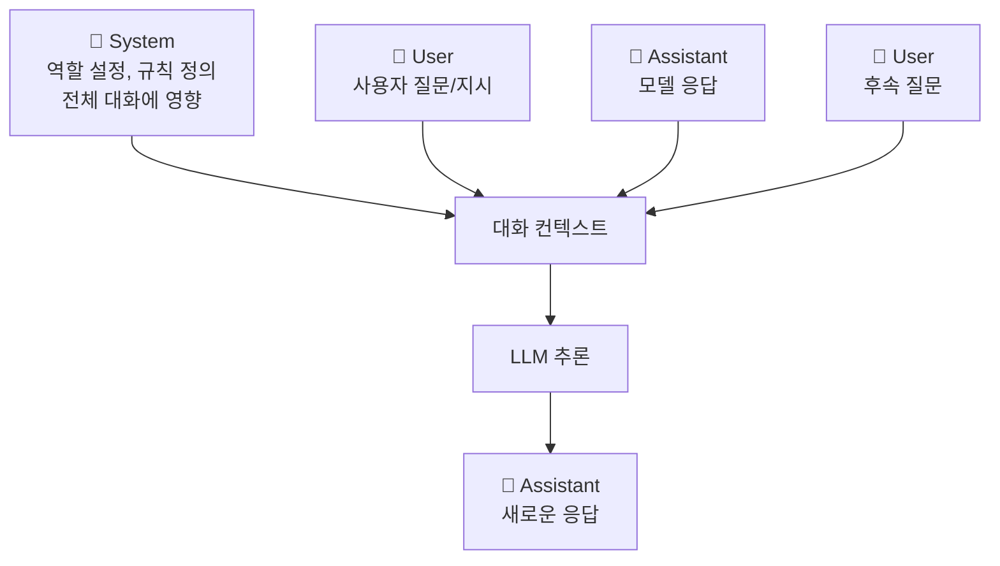

# 프롬프트 엔지니어링 기초

> LLM에게 원하는 답을 이끌어내는 기술 — 제로샷, 퓨샷, Chain-of-Thought 프롬프팅과 프롬프트 설계 전략

## 개요

이 섹션에서는 대규모 언어 모델(LLM)의 성능을 극대화하는 **프롬프트 엔지니어링**의 핵심 기법을 학습합니다. [이전 섹션](20-ch20-llm의-이해와-활용/02-02-텍스트-생성과-디코딩-전략.md)에서 디코딩 전략이 "어떻게 말할지"를 결정했다면, 프롬프트 엔지니어링은 "무엇을 말할지"를 지시하는 기술입니다.

**선수 지식**: 
- [텍스트 생성과 디코딩 전략](20-ch20-llm의-이해와-활용/02-02-텍스트-생성과-디코딩-전략.md)에서 배운 generate() API와 Temperature 개념
- [스케일링 법칙과 창발적 능력](20-ch20-llm의-이해와-활용/01-01-스케일링-법칙과-창발적-능력.md)에서 배운 인컨텍스트 학습(ICL)과 Chain-of-Thought

**학습 목표**:
- 제로샷, 원샷, 퓨샷 프롬프팅의 차이를 이해하고 적절히 선택할 수 있다
- Chain-of-Thought 프롬프팅으로 LLM의 추론 능력을 끌어낼 수 있다
- 시스템 프롬프트와 Chat Template을 활용해 구조화된 프롬프트를 설계할 수 있다
- Hugging Face `apply_chat_template()`을 사용해 프롬프트를 모델에 맞게 포맷할 수 있다

## 왜 알아야 할까?

같은 LLM이라도 프롬프트를 어떻게 작성하느냐에 따라 결과가 완전히 달라집니다. GPT-4나 LLaMA 같은 강력한 모델도 프롬프트가 엉성하면 엉뚱한 답을 내놓거든요. 반대로, 프롬프트 하나만 잘 설계하면 모델을 파인튜닝하지 않고도 놀라운 성능을 끌어낼 수 있습니다.

실제 산업에서 프롬프트 엔지니어링은 **가장 비용 효율적인 LLM 활용법**입니다. 파인튜닝에는 GPU 비용과 데이터가 필요하지만, 프롬프트는 텍스트 몇 줄만 바꾸면 되니까요. ChatGPT, Copilot, Claude 같은 서비스의 내부에도 정교하게 설계된 시스템 프롬프트가 숨어 있습니다. NLP 개발자라면 프롬프트 엔지니어링은 선택이 아닌 필수 기술입니다.

## 핵심 개념

### 개념 1: 프롬프트의 구조와 구성 요소

> 💡 **비유**: 프롬프트는 레스토랑 주문서와 같습니다. "맛있는 거 주세요"라고 하면 셰프가 뭘 만들지 모르지만, "매운맛 레벨 2의 해산물 파스타, 면은 알덴테로, 치즈는 빼주세요"라고 하면 원하는 음식이 정확히 나오죠. LLM에게도 마찬가지입니다 — 구체적이고 구조화된 지시일수록 원하는 결과를 얻을 수 있습니다.

프롬프트는 기본적으로 **네 가지 구성 요소**로 이루어집니다:

| 구성 요소 | 설명 | 예시 |
|-----------|------|------|
| **지시(Instruction)** | 모델이 수행할 태스크 | "다음 텍스트를 요약하세요" |
| **맥락(Context)** | 태스크에 필요한 배경 정보 | "당신은 의료 전문 번역가입니다" |
| **입력(Input)** | 처리할 데이터 | 요약할 원문 텍스트 |
| **출력 형식(Output Format)** | 원하는 응답 형태 | "JSON 형식으로 출력하세요" |

> 📊 **그림 1**: 프롬프트의 4가지 구성 요소와 LLM 처리 흐름



모든 요소가 항상 필요한 건 아닙니다. 간단한 질문에는 지시와 입력만으로 충분하고, 복잡한 태스크에는 네 가지 모두 필요할 수 있죠.

```python
# 프롬프트 구성 요소 예시
prompt_components = {
    "instruction": "다음 영화 리뷰의 감성을 분류하세요.",
    "context": "감성은 '긍정', '부정', '중립' 중 하나입니다.",
    "input": "이 영화는 정말 지루했지만 결말이 반전이라 괜찮았다.",
    "output_format": "JSON 형식: {\"sentiment\": \"...\", \"confidence\": 0.0~1.0}"
}

# 조합된 프롬프트
full_prompt = f"""
{prompt_components['context']}

{prompt_components['instruction']}

리뷰: {prompt_components['input']}

{prompt_components['output_format']}
""".strip()

print(full_prompt)
```

### 개념 2: 제로샷 프롬프팅 (Zero-Shot Prompting)

> 💡 **비유**: 제로샷 프롬프팅은 **예시 없이 지시만 주는 것**입니다. 새로 온 인턴에게 "이 이메일을 스팸인지 아닌지 분류해줘"라고만 말하는 거죠. 인턴이 충분히 똑똑하다면(모델이 충분히 크다면) 이것만으로도 잘 수행합니다.

제로샷은 가장 단순한 프롬프팅 방식으로, 어떤 예시도 제공하지 않고 바로 태스크를 지시합니다. [스케일링 법칙과 창발적 능력](20-ch20-llm의-이해와-활용/01-01-스케일링-법칙과-창발적-능력.md)에서 배운 것처럼, 대규모 모델은 사전학습 과정에서 이미 다양한 태스크를 학습했기 때문에 별도 예시 없이도 지시를 이해할 수 있습니다.

> 📊 **그림 2**: 제로샷 vs 퓨샷 프롬프팅 흐름 비교



```python
from transformers import pipeline

# 감성 분석 파이프라인 (제로샷 분류)
classifier = pipeline(
    "zero-shot-classification",
    model="facebook/bart-large-mnli"
)

# 예시 없이 바로 분류 지시
text = "오늘 새로 산 노트북이 정말 빠르고 화면도 선명해요!"
candidate_labels = ["긍정", "부정", "중립"]

result = classifier(text, candidate_labels)
print(f"텍스트: {text}")
print(f"분류: {result['labels'][0]} (신뢰도: {result['scores'][0]:.3f})")
```

제로샷이 적합한 상황:
- 잘 알려진 표준 태스크 (요약, 번역, 분류)
- 모델이 충분히 대규모일 때
- 빠른 프로토타이핑이 필요할 때

### 개념 3: 퓨샷 프롬프팅 (Few-Shot Prompting)

> 💡 **비유**: 퓨샷은 **"이렇게 해줘"라며 완성된 예시를 보여주는 것**입니다. 새 직원에게 보고서 작성법을 설명할 때, 말로만 하는 것보다 이전에 잘 쓴 보고서 2-3개를 보여주면 훨씬 빨리 배우잖아요? LLM도 마찬가지입니다.

퓨샷 프롬프팅은 몇 개의 입출력 예시를 프롬프트에 포함시켜, 모델이 패턴을 인식하고 따라하도록 유도하는 기법입니다. 이것이 바로 [스케일링 법칙](20-ch20-llm의-이해와-활용/01-01-스케일링-법칙과-창발적-능력.md)에서 배운 **인컨텍스트 학습(In-Context Learning, ICL)**의 실체입니다.

```run:python
# 퓨샷 프롬프트 구성
few_shot_prompt = """다음 문장의 감성을 판단하세요.

문장: 이 레스토랑 음식이 정말 맛있었어요!
감성: 긍정

문장: 배송이 너무 늦게 왔다.
감성: 부정

문장: 그냥 보통이에요.
감성: 중립

문장: 새로 나온 이 게임 그래픽이 미쳤다!
감성:"""

print("=== 퓨샷 프롬프트 구조 ===")
print(few_shot_prompt)
print("\n→ 모델은 예시 패턴을 따라 '긍정'으로 응답할 것입니다")
```

```output
=== 퓨샷 프롬프트 구조 ===
다음 문장의 감성을 판단하세요.

문장: 이 레스토랑 음식이 정말 맛있었어요!
감성: 긍정

문장: 배송이 너무 늦게 왔다.
감성: 부정

문장: 그냥 보통이에요.
감성: 중립

문장: 새로 나온 이 게임 그래픽이 미쳤다!
감성:

→ 모델은 예시 패턴을 따라 '긍정'으로 응답할 것입니다
```

퓨샷 프롬프트 설계의 핵심 원칙:

| 원칙 | 설명 |
|------|------|
| **예시 수** | 2~5개가 적정. 너무 많으면 컨텍스트 낭비 |
| **다양성** | 모든 클래스/유형을 골고루 포함 |
| **일관성** | 예시의 형식이 동일해야 함 |
| **순서** | 어려운 예시보다 전형적인 예시를 먼저 배치 |
| **구분자** | 예시와 실제 입력을 명확히 구분 |

> 📊 **그림 3**: 퓨샷 프롬프팅에서 예시 수에 따른 성능 변화 패턴



### 개념 4: Chain-of-Thought (CoT) 프롬프팅

> 💡 **비유**: CoT는 **"풀이 과정을 보여줘"**라고 요청하는 것입니다. 수학 시험에서 답만 쓰면 실수하기 쉽지만, 풀이 과정을 단계별로 적으면 실수를 줄일 수 있잖아요? LLM도 "단계별로 생각해보세요"라는 말 한 마디로 추론 능력이 극적으로 향상됩니다.

2022년 Google Brain의 Jason Wei 등이 발표한 **Chain-of-Thought Prompting** 논문은 프롬프트 엔지니어링의 판도를 바꿨습니다. 핵심 아이디어는 간단합니다 — 모델에게 중간 추론 과정을 보여주거나, "Let's think step by step"이라는 한 문장을 추가하는 것만으로도 복잡한 추론 태스크의 성능이 크게 개선되었거든요.

CoT에는 두 가지 방식이 있습니다:

**1. Manual CoT (수동)**: 풀이 과정이 포함된 예시를 직접 작성

```python
# Manual CoT 예시
manual_cot_prompt = """질문: 가게에 사과가 23개 있었습니다. 
20개를 추가로 구매하고, 15개를 팔았습니다. 몇 개가 남았나요?

풀이: 처음에 23개가 있었습니다.
20개를 추가하면: 23 + 20 = 43개
15개를 팔면: 43 - 15 = 28개
답: 28개

질문: 주차장에 차가 3대 있었습니다. 
2대가 더 왔습니다. 몇 대가 있나요?

풀이:"""
```

**2. Zero-Shot CoT (자동)**: "단계별로 생각해보세요" 한 마디 추가

```python
# Zero-Shot CoT — 마법의 한 문장
zero_shot_cot = """질문: 회의실에 8명이 있었습니다. 3명이 나가고, 
5명이 새로 들어왔습니다. 이후 2명이 더 나갔습니다. 
몇 명이 남아 있나요?

단계별로 생각해봅시다."""  # ← 이 한 문장이 핵심!
```

> 📊 **그림 4**: Chain-of-Thought 프롬프팅의 추론 흐름



> ⚠️ **흔한 오해**: "CoT는 항상 좋다"라고 생각하기 쉽지만, 간단한 태스크(단순 분류, 번역)에서는 오히려 불필요한 토큰을 생성하여 속도만 느려질 수 있습니다. CoT가 빛을 발하는 건 **산술, 논리 추론, 상식 추론** 같은 다단계 추론이 필요한 태스크입니다. 또한 최근의 추론 특화 모델(o-series, Extended Thinking 모드)은 이미 내부적으로 CoT를 수행하므로, 외부 CoT 프롬프팅이 오히려 방해가 될 수 있습니다.

### 개념 5: 시스템 프롬프트와 Chat Template

> 💡 **비유**: 시스템 프롬프트는 **배우에게 주는 역할 대본**입니다. "당신은 친절한 고객 상담원입니다"라고 하면 모델의 전체 대화 톤이 바뀌죠. 사용자 메시지는 배우에게 던지는 질문이고, 시스템 프롬프트는 그 배우의 캐릭터 설정인 셈입니다.

현대 LLM은 대부분 **Chat 형식**으로 동작합니다. 메시지는 `system`, `user`, `assistant` 세 가지 역할로 구분되며, 각 역할이 서로 다른 기능을 합니다:

> 📊 **그림 5**: Chat 기반 프롬프트의 메시지 구조



Hugging Face의 `apply_chat_template()`은 이 메시지 구조를 각 모델에 맞는 특수 토큰 형식으로 변환해줍니다. 모델마다 포맷이 다르기 때문에 이 함수가 매우 중요합니다:

```python
from transformers import AutoTokenizer

# 모델별로 다른 Chat Template 형식 비교
model_names = {
    "LLaMA 3": "meta-llama/Llama-3.2-1B-Instruct",
    "Mistral": "mistralai/Mistral-7B-Instruct-v0.3",
}

messages = [
    {"role": "system", "content": "당신은 Python 전문 튜터입니다."},
    {"role": "user", "content": "리스트 컴프리헨션이 뭔가요?"},
]

# 각 모델의 chat template 형식 확인
for name, model_id in model_names.items():
    tokenizer = AutoTokenizer.from_pretrained(model_id)
    formatted = tokenizer.apply_chat_template(
        messages, 
        tokenize=False,           # 토큰화하지 않고 문자열 반환
        add_generation_prompt=True # 모델 응답 시작 토큰 추가
    )
    print(f"=== {name} ===")
    print(formatted[:200])  # 앞부분만 출력
    print()
```

Chat Template 없이 직접 포맷을 만들면 모델마다 코드를 바꿔야 하지만, `apply_chat_template()`을 쓰면 **어떤 모델이든 동일한 코드로** 올바른 포맷을 얻을 수 있습니다.

### 개념 6: 프롬프트 최적화 전략

효과적인 프롬프트를 만드는 데는 몇 가지 검증된 전략이 있습니다:

**1. 구체적이고 명확하게 (Be Specific)**

```python
# ❌ 모호한 프롬프트
bad_prompt = "이 텍스트에 대해 알려줘"

# ✅ 구체적인 프롬프트 
good_prompt = """다음 뉴스 기사를 분석하여 아래 형식으로 응답하세요:

1. 핵심 주제 (한 문장)
2. 감성 (긍정/부정/중립)
3. 키워드 (최대 5개)

기사: {article_text}"""
```

**2. 구분자로 구조화 (Use Delimiters)**

```python
# 구분자를 활용한 구조화 프롬프트
structured_prompt = """### 지시사항
아래 텍스트를 한국어로 번역하세요.
전문 용어는 영어를 괄호 안에 병기하세요.

### 입력 텍스트
```
The transformer architecture uses self-attention mechanisms 
to process sequential data in parallel.
```

### 출력 형식
번역된 텍스트만 출력하세요."""
```

**3. 역할 부여 (Role Assignment)**

```python
# 역할을 부여하면 전문성이 높아짐
role_prompt = {
    "system": """당신은 10년 경력의 시니어 Python 개발자입니다. 
코드 리뷰 시 다음 기준으로 평가합니다:
- PEP 8 준수 여부
- 보안 취약점
- 성능 최적화 가능성
문제를 발견하면 수정된 코드를 함께 제시하세요.""",
    "user": "다음 코드를 리뷰해주세요: ..."
}
```

## 실습: 직접 해보기

다양한 프롬프팅 기법을 하나의 파이프라인으로 구현하고, 결과를 비교해봅시다.

```python
from transformers import AutoTokenizer, AutoModelForCausalLM
import torch

# --- 1. 모델 로드 ---
model_name = "microsoft/DialoGPT-medium"  # 가벼운 대화 모델
tokenizer = AutoTokenizer.from_pretrained(model_name)
model = AutoModelForCausalLM.from_pretrained(model_name)

# 패딩 토큰 설정
if tokenizer.pad_token is None:
    tokenizer.pad_token = tokenizer.eos_token

device = torch.device("cuda" if torch.cuda.is_available() else "cpu")
model = model.to(device)

# --- 2. 프롬프트 템플릿 클래스 ---
class PromptTemplate:
    """재사용 가능한 프롬프트 템플릿"""
    
    def __init__(self, template: str, input_variables: list[str]):
        self.template = template
        self.input_variables = input_variables
    
    def format(self, **kwargs) -> str:
        """변수를 채워 최종 프롬프트 생성"""
        # 필수 변수 확인
        missing = set(self.input_variables) - set(kwargs.keys())
        if missing:
            raise ValueError(f"누락된 변수: {missing}")
        return self.template.format(**kwargs)

# --- 3. 다양한 프롬프팅 기법 비교 ---

# 제로샷 프롬프트
zero_shot = PromptTemplate(
    template="다음 문장의 감성을 '긍정' 또는 '부정'으로 분류하세요.\n\n문장: {text}\n감성:",
    input_variables=["text"]
)

# 퓨샷 프롬프트
few_shot = PromptTemplate(
    template="""다음 문장의 감성을 '긍정' 또는 '부정'으로 분류하세요.

문장: 이 제품 정말 좋아요! 강력 추천합니다.
감성: 긍정

문장: 배송이 일주일이나 걸렸다. 다시는 안 산다.
감성: 부정

문장: 가격 대비 성능이 훌륭합니다.
감성: 긍정

문장: {text}
감성:""",
    input_variables=["text"]
)

# CoT 프롬프트
cot = PromptTemplate(
    template="""다음 문장의 감성을 분석하세요. 단계별로 생각해봅시다.

문장: {text}

분석:
1단계 - 핵심 표현 추출:
2단계 - 각 표현의 감성 판단:
3단계 - 종합 판단:
최종 감성:""",
    input_variables=["text"]
)

# --- 4. 프롬프트 비교 실행 ---
test_text = "화면은 예쁜데 배터리가 너무 빨리 닳아요"

prompts = {
    "제로샷": zero_shot.format(text=test_text),
    "퓨샷": few_shot.format(text=test_text),
    "CoT": cot.format(text=test_text),
}

print("=" * 60)
print(f"입력 텍스트: {test_text}")
print("=" * 60)

for name, prompt in prompts.items():
    # 토큰화
    inputs = tokenizer.encode(prompt, return_tensors="pt").to(device)
    
    # 생성
    with torch.no_grad():
        outputs = model.generate(
            inputs,
            max_new_tokens=50,       # 응답 길이 제한
            temperature=0.7,
            do_sample=True,
            pad_token_id=tokenizer.eos_token_id
        )
    
    # 생성된 부분만 추출
    generated = outputs[0][inputs.shape[-1]:]
    response = tokenizer.decode(generated, skip_special_tokens=True)
    
    print(f"\n--- {name} ---")
    print(f"프롬프트 토큰 수: {inputs.shape[-1]}")
    print(f"응답: {response[:100]}")  # 앞 100자만 출력
```

다음은 **Chat Template을 활용한 구조화된 프롬프트** 실습입니다:

```python
from transformers import AutoTokenizer

# --- Chat Template 활용 실습 ---
tokenizer = AutoTokenizer.from_pretrained(
    "meta-llama/Llama-3.2-1B-Instruct"
)

# 시스템 프롬프트 + 퓨샷 예시를 Chat 형식으로 구성
messages = [
    # 시스템 프롬프트: 역할과 규칙 설정
    {
        "role": "system",
        "content": (
            "당신은 한국어 감성 분석 전문가입니다. "
            "주어진 텍스트의 감성을 '긍정', '부정', '중립' 중 하나로 분류하고, "
            "핵심 근거를 한 문장으로 설명하세요."
        )
    },
    # 퓨샷 예시 1
    {"role": "user", "content": "분석: 이 카페 분위기가 정말 좋아요!"},
    {"role": "assistant", "content": "감성: 긍정\n근거: '정말 좋아요'라는 강한 긍정 표현이 사용되었습니다."},
    # 퓨샷 예시 2
    {"role": "user", "content": "분석: 서비스가 너무 느려서 짜증났다."},
    {"role": "assistant", "content": "감성: 부정\n근거: '짜증났다'라는 부정 감정 표현이 명확합니다."},
    # 실제 입력
    {"role": "user", "content": "분석: 가격은 비싸지만 품질은 확실히 좋다."},
]

# Chat Template 적용
formatted = tokenizer.apply_chat_template(
    messages,
    tokenize=False,
    add_generation_prompt=True
)

print("=== 포맷된 프롬프트 ===")
print(formatted)
```

```run:python
# --- 프롬프트 템플릿 유틸리티 ---
# 실무에서 쓸 수 있는 간단한 프롬프트 매니저

class PromptManager:
    """프롬프트 템플릿 관리자"""
    
    def __init__(self):
        self.templates = {}
    
    def register(self, name: str, template: str, 
                 input_vars: list[str]):
        """템플릿 등록"""
        self.templates[name] = {
            "template": template,
            "input_variables": input_vars
        }
    
    def render(self, name: str, **kwargs) -> str:
        """템플릿 렌더링"""
        t = self.templates[name]
        return t["template"].format(**kwargs)
    
    def list_templates(self) -> list[str]:
        """등록된 템플릿 목록"""
        return list(self.templates.keys())

# 사용 예시
pm = PromptManager()

pm.register(
    "summarize",
    "다음 텍스트를 {length} 이내로 요약하세요:\n\n{text}\n\n요약:",
    ["text", "length"]
)

pm.register(
    "translate",
    "다음 {source_lang} 텍스트를 {target_lang}로 번역하세요:\n\n{text}\n\n번역:",
    ["text", "source_lang", "target_lang"]
)

# 렌더링
result = pm.render(
    "summarize",
    text="트랜스포머는 셀프 어텐션 메커니즘을 기반으로 한 딥러닝 아키텍처입니다.",
    length="한 문장"
)
print(result)
print(f"\n등록된 템플릿: {pm.list_templates()}")
```

```output
다음 텍스트를 한 문장 이내로 요약하세요:

트랜스포머는 셀프 어텐션 메커니즘을 기반으로 한 딥러닝 아키텍처입니다.

요약:

등록된 템플릿: ['summarize', 'translate']
```

## 더 깊이 알아보기

### "Let's think step by step"의 탄생

2022년, Google Brain의 Takeshi Kojima 등은 "Large Language Models are Zero-Shot Reasoners"라는 논문에서 놀라운 발견을 보고했습니다. 단지 **"Let's think step by step"**이라는 한 문장을 프롬프트 끝에 추가하는 것만으로 산술 추론 태스크(MultiArith)의 정확도가 17.7%에서 78.7%로 급등한 겁니다. 이 발견이 특별한 이유는, 복잡한 파인튜닝이나 예시 설계 없이 **프롬프트 한 줄의 힘**만으로 이런 극적인 성능 향상이 가능하다는 것을 보여줬기 때문입니다.

같은 해, Jason Wei 등의 "Chain-of-Thought Prompting Elicits Reasoning in Large Language Models" 논문은 퓨샷 예시에 추론 과정을 포함시키는 **Manual CoT**를 제안했습니다. 흥미롭게도 CoT의 효과는 모델이 충분히 클 때(대략 100B 파라미터 이상)만 나타나는 **창발적 능력**이었습니다. 작은 모델에서는 오히려 성능이 떨어지는 경우도 있었죠.

### 프롬프트 엔지니어링의 이름 논쟁

"프롬프트 엔지니어링"이라는 이름 자체에 대한 논쟁도 있습니다. 일부 연구자들은 이것이 진짜 "엔지니어링"이 아니라 단순한 시행착오(trial-and-error)라고 비판합니다. 반면 OpenAI의 Andrej Karpathy는 "프롬프트가 새로운 프로그래밍이다(Prompt is the new programming)"라고 선언하며, 자연어로 컴퓨터를 제어하는 새로운 패러다임이라고 강조했습니다. 최근에는 "프롬프트 엔지니어링"을 넘어 **"컨텍스트 엔지니어링(Context Engineering)"**이라는 더 넓은 용어로 확장되는 추세입니다.

## 흔한 오해와 팁

> ⚠️ **흔한 오해**: "프롬프트가 길수록 좋다"라고 생각하는 분들이 많습니다. 하지만 불필요하게 긴 프롬프트는 오히려 모델을 혼란스럽게 만들고, 핵심 지시를 희석시킵니다. 컨텍스트 윈도우도 유한하므로, **간결하되 구체적인** 프롬프트가 가장 효과적입니다.

> 💡 **알고 계셨나요?**: GPT-4의 시스템 프롬프트는 수천 토큰에 달하는 매우 정교한 문서입니다. ChatGPT의 기본 시스템 프롬프트에는 날짜 정보, 도구 사용 규칙, 안전성 가이드라인, 출력 형식 규칙 등이 모두 포함되어 있습니다. 프롬프트 하나가 서비스의 품질을 결정하는 셈이죠.

> 🔥 **실무 팁**: 프롬프트를 개발할 때는 반드시 **버전 관리**를 하세요. 프롬프트도 코드와 마찬가지로 반복적으로 개선해야 하는데, 어떤 버전이 잘 작동했는지 기록하지 않으면 이전의 좋은 결과를 재현할 수 없습니다. Git에 프롬프트 파일을 커밋하거나, 최소한 날짜와 성능을 기록한 로그를 남기세요.

> 🔥 **실무 팁**: 출력 형식을 지정할 때는 **JSON**을 적극 활용하세요. "감성 분석 결과를 알려주세요"보다 `{"sentiment": "positive", "confidence": 0.95}` 형식으로 출력하라고 지시하면, 후속 파이프라인에서 파싱이 훨씬 쉬워집니다.

## 핵심 정리

| 개념 | 설명 |
|------|------|
| **제로샷 프롬프팅** | 예시 없이 지시만으로 태스크 수행. 간단한 태스크에 적합 |
| **퓨샷 프롬프팅** | 2~5개 예시를 포함하여 패턴을 인식시킴. 출력 형식 통제에 효과적 |
| **Chain-of-Thought** | "단계별로 생각해봅시다"로 다단계 추론 능력 활성화 |
| **시스템 프롬프트** | 모델의 역할과 전체 행동 규칙을 정의하는 메타 지시 |
| **Chat Template** | `apply_chat_template()`로 모델별 포맷을 자동 변환 |
| **프롬프트 최적화** | 구체성, 구분자, 역할 부여, 출력 형식 지정 등의 전략 |

## 다음 섹션 미리보기

프롬프트 엔지니어링이 모델의 **입력**을 최적화하는 기술이었다면, 다음 섹션 [RLHF와 정렬(Alignment)](20-ch20-llm의-이해와-활용/04-04-rlhf와-정렬alignment.md)에서는 모델 자체를 인간의 의도에 맞게 **학습**시키는 방법을 다룹니다. 인간 피드백을 통한 강화학습(RLHF)이 어떻게 ChatGPT 같은 "유용하고 안전한" AI를 만들어냈는지 알아보겠습니다.

## 참고 자료

- [Prompt Engineering Guide (DAIR.ai)](https://www.promptingguide.ai/) - 프롬프트 엔지니어링의 모든 기법을 체계적으로 정리한 오픈소스 가이드
- [OpenAI Prompt Engineering Guide](https://platform.openai.com/docs/guides/prompt-engineering) - OpenAI 공식 프롬프트 엔지니어링 베스트 프랙티스
- [Hugging Face Chat Templates 문서](https://huggingface.co/docs/transformers/chat_templating) - `apply_chat_template()` 사용법과 커스텀 템플릿 작성 가이드
- [Chain-of-Thought Prompting (promptingguide.ai)](https://www.promptingguide.ai/techniques/cot) - CoT 프롬프팅의 다양한 변형과 사례 정리
- [Few-Shot Prompting (promptingguide.ai)](https://www.promptingguide.ai/techniques/fewshot) - 퓨샷 프롬프팅의 설계 원칙과 한계
- [mlabonne/llm-course (GitHub)](https://github.com/mlabonne/llm-course) - LLM 실습 중심 오픈소스 코스, 프롬프트 엔지니어링 포함

---
### 🔗 Related Sessions
- [scaling_law](20-ch20-llm의-이해와-활용/01-01-스케일링-법칙과-창발적-능력.md) (prerequisite)
- [temperature_scaling](20-ch20-llm의-이해와-활용/02-02-텍스트-생성과-디코딩-전략.md) (prerequisite)
- [in_context_learning](20-ch20-llm의-이해와-활용/01-01-스케일링-법칙과-창발적-능력.md) (prerequisite)
- [chain_of_thought](20-ch20-llm의-이해와-활용/01-01-스케일링-법칙과-창발적-능력.md) (prerequisite)
- [emergent_abilities](20-ch20-llm의-이해와-활용/01-01-스케일링-법칙과-창발적-능력.md) (prerequisite)


---
### 🔗 Related Sessions
- [scaling_law](20-ch20-llm의-이해와-활용/01-01-스케일링-법칙과-창발적-능력.md) (prerequisite)
- [temperature_scaling](20-ch20-llm의-이해와-활용/02-02-텍스트-생성과-디코딩-전략.md) (prerequisite)
- [in_context_learning](20-ch20-llm의-이해와-활용/01-01-스케일링-법칙과-창발적-능력.md) (prerequisite)
- [chain_of_thought](20-ch20-llm의-이해와-활용/01-01-스케일링-법칙과-창발적-능력.md) (prerequisite)
- [emergent_abilities](20-ch20-llm의-이해와-활용/01-01-스케일링-법칙과-창발적-능력.md) (prerequisite)
