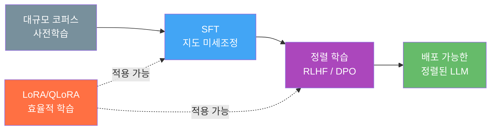
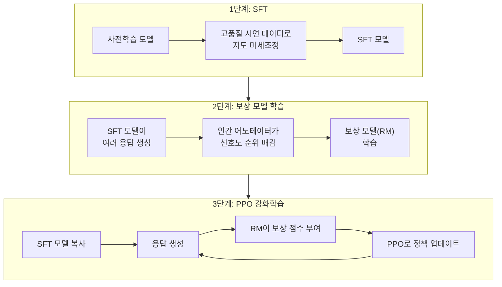
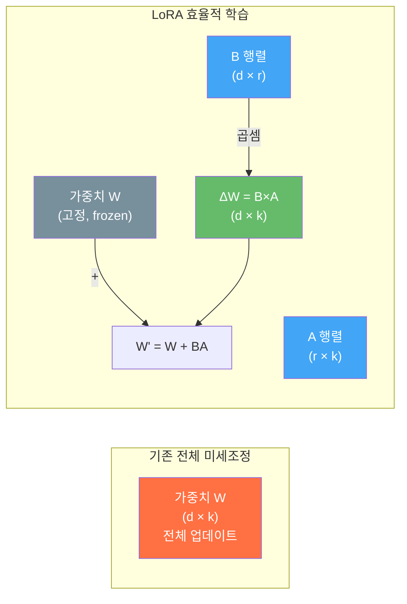
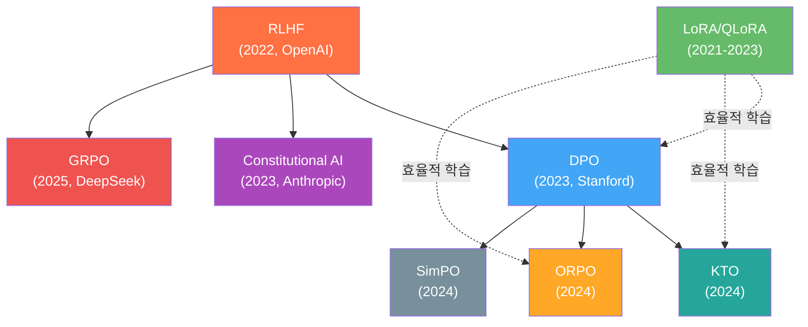

# RLHF와 정렬(Alignment)

> 인간의 선호도를 학습하여 LLM을 안전하고 유용하게 만드는 정렬 기술의 모든 것

## 개요

이 섹션에서는 사전학습된 LLM을 인간의 의도에 맞게 "정렬(Alignment)"하는 핵심 기술을 다룹니다. RLHF(Reinforcement Learning from Human Feedback)의 3단계 파이프라인부터, 보상 모델 없이 직접 최적화하는 DPO, 그리고 LoRA/QLoRA를 활용한 효율적 정렬 학습까지 살펴봅니다.

**선수 지식**: LLM의 사전학습과 파인튜닝 개념, 손실 함수의 기본 이해
**학습 목표**:
- RLHF의 3단계(SFT → 보상 모델 → PPO) 파이프라인을 이해한다
- DPO가 RLHF를 어떻게 단순화하는지 수학적으로 파악한다
- LoRA/QLoRA를 활용한 파라미터 효율적 정렬 학습(PEFT)을 이해한다
- Constitutional AI, KTO, GRPO 등 최신 정렬 기법의 흐름을 조망한다

## 왜 알아야 할까?

GPT-4든 Claude든, 사전학습만 거친 LLM은 사실 **꽤 위험한 존재**입니다. 사용자가 "폭탄 만드는 법"을 물으면 성실하게 답하고, 질문과 관계없는 엉뚱한 텍스트를 이어쓰기도 하죠. 사전학습은 "다음 토큰 예측"만 학습했기 때문에, **인간이 원하는 방식으로 응답하는 법**은 별도로 가르쳐야 합니다.

이것이 바로 정렬(Alignment)입니다. ChatGPT가 세상에 나올 수 있었던 결정적 기술이 RLHF였고, 이후 DPO가 등장하면서 정렬의 진입 장벽이 크게 낮아졌습니다. 최근에는 LoRA/QLoRA 같은 PEFT 기법 덕분에 **단일 GPU에서도 정렬 학습이 가능**해져, 스타트업과 개인 연구자도 자체 정렬 모델을 만드는 시대가 열렸습니다.

> 📊 **그림 1**: LLM 학습의 전체 파이프라인 — 사전학습에서 정렬까지



## 핵심 개념

### 개념 1: RLHF — 인간 피드백을 통한 강화학습

> 💡 **비유**: RLHF는 요리 대회 같습니다. 셰프(LLM)가 요리(응답)를 만들면, 심사위원(보상 모델)이 점수를 매기고, 셰프는 더 높은 점수를 받는 방향으로 실력을 갈고닦습니다. 처음에 심사위원의 기준 자체를 인간 미식가(어노테이터)에게 배우는 것이 핵심이죠.

RLHF는 OpenAI가 2022년 **InstructGPT** 논문에서 체계화한 3단계 프로세스입니다. 그 전까지 "대화형 AI"는 꿈에 가까웠는데, 이 기법 하나가 GPT-3를 ChatGPT로 탈바꿈시켰습니다.

> 📊 **그림 2**: RLHF 3단계 파이프라인



#### InstructGPT 탄생 스토리

2021년, OpenAI 연구팀은 GPT-3가 놀라운 능력을 갖고 있지만 "쓸 수 없는" 모델이라는 걸 절감했습니다. 사용자가 "이메일을 써줘"라고 하면 "이메일을 써줘"라는 텍스트 뒤에 이상한 문장을 이어쓰곤 했거든요. 팀은 약 40명의 어노테이터를 고용해 13,000개의 시연 데이터와 33,000개의 비교 데이터를 수집했고, 이를 통해 1.3B 파라미터 InstructGPT가 175B GPT-3보다 인간 평가에서 더 선호되는 결과를 만들어냈습니다. **작은 모델 + 정렬이 큰 모델 + 정렬 없음을 이긴 최초의 대규모 실증**이었죠.

#### 보상 모델의 수학

보상 모델은 인간의 선호도를 학습합니다. 두 응답 $y_w$(선호)와 $y_l$(비선호)에 대해 **Bradley-Terry 모델**을 기반으로 학습합니다:

$$\mathcal{L}_{RM} = -\log \sigma\big(r_\theta(x, y_w) - r_\theta(x, y_l)\big)$$

- $r_\theta$: 파라미터 $\theta$를 가진 보상 모델
- $x$: 프롬프트 (입력)
- $y_w$, $y_l$: 선호/비선호 응답 쌍
- $\sigma$: 시그모이드 함수

이 손실은 선호 응답의 보상 점수가 비선호 응답보다 높아지도록 학습합니다.

#### PPO 최적화

학습된 보상 모델을 사용해 PPO(Proximal Policy Optimization)로 언어 모델을 최적화합니다:

$$\mathcal{L}_{PPO} = \mathbb{E}\Big[r_\phi(x, y) - \beta \cdot D_{KL}\big(\pi_\theta(y|x) \| \pi_{\text{ref}}(y|x)\big)\Big]$$

- $\pi_\theta$: 학습 중인 정책(LLM)
- $\pi_{\text{ref}}$: 원본 SFT 모델 (참조 정책)
- $\beta$: KL 페널티 계수 — 원래 모델에서 너무 벗어나지 않도록 제어

> 📊 **그림 3**: PPO 강화학습의 상호작용 흐름

```mermaid
sequenceDiagram
    participant User as 프롬프트
    participant Policy as 정책 모델 (πθ)
    participant RM as 보상 모델
    participant Ref as 참조 모델 (πref)
    participant Opt as PPO 옵티마이저

    User->>Policy: 프롬프트 x 입력
    Policy->>Policy: 응답 y 생성
    Policy->>RM: (x, y) 전달
    RM->>Opt: 보상 점수 r(x,y)
    Policy->>Ref: y의 확률 비교
    Ref->>Opt: KL 발산 계산
    Opt->>Policy: 그래디언트 업데이트
```

```run:python
import math

# 보상 모델 시뮬레이션: Bradley-Terry 선호도 학습
def reward_score(response_quality):
    """응답 품질(0~1)을 보상 점수로 변환"""
    return 2.0 * response_quality - 1.0  # [-1, 1] 범위

def bradley_terry_loss(r_preferred, r_rejected):
    """보상 모델 손실 함수"""
    return -math.log(1 / (1 + math.exp(-(r_preferred - r_rejected))))

# 선호도 쌍 시뮬레이션
pairs = [
    {"prompt": "수도가 어디야?", "preferred": 0.9, "rejected": 0.3},
    {"prompt": "코드 짜줘",     "preferred": 0.85, "rejected": 0.4},
    {"prompt": "농담해줘",      "preferred": 0.7, "rejected": 0.5},
]

print("=== 보상 모델 학습 시뮬레이션 ===")
for pair in pairs:
    r_w = reward_score(pair["preferred"])   # 선호 응답 보상
    r_l = reward_score(pair["rejected"])    # 비선호 응답 보상
    loss = bradley_terry_loss(r_w, r_l)     # BT 손실
    print(f"프롬프트: {pair['prompt']}")
    print(f"  보상 차이: {r_w - r_l:.2f}, 손실: {loss:.4f}")
```

```output
=== 보상 모델 학습 시뮬레이션 ===
프롬프트: 수도가 어디야?
  보상 차이: 1.20, 손실: 0.2632
프롬프트: 코드 짜줘
  보상 차이: 0.90, 손실: 0.3412
프롬프트: 농담해줘
  보상 차이: 0.40, 손실: 0.5133
```

> ⚠️ **흔한 오해**: "RLHF는 인간이 직접 실시간으로 피드백한다"고 생각하기 쉽지만, 실제로 인간의 역할은 **보상 모델 학습용 선호도 데이터를 만드는 것**까지입니다. PPO 학습 과정에서는 학습된 보상 모델이 자동으로 점수를 매깁니다.

### 개념 2: DPO — 보상 모델 없는 직접 최적화

> 💡 **비유**: RLHF가 심사위원(보상 모델)을 먼저 양성한 뒤 요리 대회를 여는 거라면, DPO는 심사위원 없이 **"이 요리가 저 요리보다 낫다"는 비교 데이터만으로 셰프가 직접 배우는** 방식입니다. 중간 단계를 없앴으니 훨씬 간단하죠.

2023년 스탠포드 대학의 Rafael Rafailov 등이 발표한 DPO(Direct Preference Optimization)는 정렬 분야의 판도를 바꿨습니다. 핵심 인사이트는 놀라울 정도로 우아합니다:

> 💡 **알고 계셨나요?**: DPO 논문의 부제는 **"Your Language Model is Secretly a Reward Model"**입니다. 보상 모델을 별도로 학습할 필요 없이, 언어 모델 자체의 로그 확률이 이미 암묵적 보상 함수 역할을 한다는 수학적 증명이었죠. 이 논문은 2024년 ICML에서 Outstanding Paper Award를 수상했습니다.

#### DPO 손실 함수

$$\mathcal{L}_{DPO} = -\mathbb{E}\left[\log\sigma\left(\beta\left(\log\frac{\pi_\theta(y_w|x)}{\pi_{\text{ref}}(y_w|x)} - \log\frac{\pi_\theta(y_l|x)}{\pi_{\text{ref}}(y_l|x)}\right)\right)\right]$$

이게 의미하는 바는:
- 선호 응답 $y_w$의 확률은 **높이고**
- 비선호 응답 $y_l$의 확률은 **낮추되**
- 참조 모델에서 너무 벗어나지 않도록 **비율**로 조절

> 📊 **그림 4**: RLHF vs DPO 파이프라인 비교


```run:python
import math

def dpo_loss(log_pi_w, log_pi_l, log_ref_w, log_ref_l, beta=0.1):
    """DPO 손실 함수 구현"""
    # 선호 응답의 로그 비율
    log_ratio_w = log_pi_w - log_ref_w
    # 비선호 응답의 로그 비율  
    log_ratio_l = log_pi_l - log_ref_l
    # DPO 손실
    logit = beta * (log_ratio_w - log_ratio_l)
    loss = -math.log(1 / (1 + math.exp(-logit)))
    return loss

# 시뮬레이션: 학습 전후 비교
print("=== DPO 손실 함수 시뮬레이션 ===\n")

# 학습 초기: 정책 = 참조 모델 (로그 확률 동일)
loss_init = dpo_loss(
    log_pi_w=-2.0, log_pi_l=-2.5,  # 정책 모델
    log_ref_w=-2.0, log_ref_l=-2.5, # 참조 모델 (동일)
    beta=0.1
)
print(f"학습 초기 (정책=참조): 손실 = {loss_init:.4f}")

# 학습 후: 선호 응답 확률 ↑, 비선호 확률 ↓
loss_trained = dpo_loss(
    log_pi_w=-1.2, log_pi_l=-3.5,   # 정책: 선호↑, 비선호↓
    log_ref_w=-2.0, log_ref_l=-2.5,  # 참조는 고정
    beta=0.1
)
print(f"학습 후 (정렬 완료): 손실 = {loss_trained:.4f}")
print(f"\n손실 감소: {loss_init - loss_trained:.4f} (정렬이 진행됨)")
```

```output
=== DPO 손실 함수 시뮬레이션 ===

학습 초기 (정책=참조): 손실 = 0.6931
학습 후 (정렬 완료): 손실 = 0.4510

손실 감소: 0.2422 (정렬이 진행됨)
```

### 개념 3: LoRA/QLoRA — 효율적 정렬 학습의 핵심

> 💡 **비유**: 70억 개 파라미터를 가진 LLM을 정렬 학습시키는 것은 마치 **대형 오케스트라 전체를 재교육하는 것**과 같습니다. LoRA는 "전체 단원 대신 **핵심 파트 리더 몇 명만** 코칭하면 오케스트라 전체 사운드가 바뀐다"는 발상입니다. QLoRA는 여기에 더해 악보를 **압축 인쇄(양자화)**해서 연습실(GPU 메모리)도 아끼는 기법이죠.

RLHF와 DPO 모두 LLM 전체를 미세조정해야 하기 때문에, 70B 이상 모델에서는 엄청난 GPU 자원이 필요합니다. **LoRA(Low-Rank Adaptation)**와 **QLoRA(Quantized LoRA)**는 이 문제를 근본적으로 해결하는 PEFT(Parameter-Efficient Fine-Tuning) 기법입니다.

#### LoRA의 핵심 아이디어

기존 가중치 행렬 $W \in \mathbb{R}^{d \times k}$를 직접 수정하는 대신, **저랭크(low-rank) 행렬 두 개**의 곱으로 업데이트를 표현합니다:

$$W' = W + \Delta W = W + BA$$

- $B \in \mathbb{R}^{d \times r}$, $A \in \mathbb{R}^{r \times k}$ (여기서 $r \ll \min(d, k)$)
- 원래 $d \times k$개 파라미터 대신 $(d + k) \times r$개만 학습
- 예: $d = k = 4096$, $r = 16$이면 학습 파라미터가 **0.1%** 수준

> 📊 **그림 5**: LoRA의 저랭크 분해 구조



#### QLoRA: 양자화로 메모리를 더 줄이다

QLoRA는 워싱턴 대학의 Tim Dettmers가 2023년에 발표한 기법으로, LoRA에 세 가지 혁신을 더했습니다:

1. **4-bit NormalFloat (NF4) 양자화**: 기본 모델을 4비트로 양자화하여 메모리 75% 절감
2. **이중 양자화(Double Quantization)**: 양자화 상수 자체도 양자화
3. **페이지드 옵티마이저**: GPU 메모리 부족 시 CPU로 자동 오프로드

| 기법 | 7B 모델 메모리 | 70B 모델 메모리 | 학습 파라미터 비율 |
|------|---------------|----------------|-------------------|
| 전체 미세조정 | ~28 GB | ~280 GB | 100% |
| LoRA (r=16) | ~16 GB | ~160 GB | ~0.1% |
| QLoRA (4-bit + r=16) | **~6 GB** | **~48 GB** | ~0.1% |

> 🔥 **실무 팁**: QLoRA 덕분에 **단일 A100 80GB GPU로 70B 모델의 DPO 정렬이 가능**해졌습니다. 심지어 RTX 4090(24GB)으로도 7B~13B 모델의 정렬 학습을 돌릴 수 있어요. 이것이 오픈소스 LLM 정렬의 민주화를 이끈 핵심 기술입니다.

#### PEFT + DPO: 실무 조합 패턴

실제로 오픈소스 커뮤니티에서 가장 많이 쓰는 조합은 **QLoRA + DPO**입니다. HuggingFace의 TRL 라이브러리가 이 조합을 네이티브로 지원합니다:

```python
from transformers import AutoModelForCausalLM, BitsAndBytesConfig
from peft import LoraConfig, get_peft_model
from trl import DPOConfig, DPOTrainer

# 1. 4-bit 양자화 설정 (QLoRA)
bnb_config = BitsAndBytesConfig(
    load_in_4bit=True,                    # 4비트 양자화 활성화
    bnb_4bit_quant_type="nf4",            # NormalFloat4 타입
    bnb_4bit_compute_dtype="bfloat16",    # 연산은 bfloat16
    bnb_4bit_use_double_quant=True,       # 이중 양자화
)

# 2. 양자화된 모델 로드
model = AutoModelForCausalLM.from_pretrained(
    "meta-llama/Llama-3.1-8B-Instruct",
    quantization_config=bnb_config,
    device_map="auto",
)

# 3. LoRA 어댑터 설정
peft_config = LoraConfig(
    r=16,                          # 랭크: 클수록 표현력↑, 메모리↑
    lora_alpha=32,                 # 스케일링 계수 (보통 r의 2배)
    lora_dropout=0.05,             # 과적합 방지
    target_modules=["q_proj", "k_proj", "v_proj", "o_proj"],  # 어텐션 레이어
    task_type="CAUSAL_LM",
)

# 4. DPO 학습 설정
training_args = DPOConfig(
    output_dir="./aligned-model",
    num_train_epochs=1,            # 정렬은 보통 1-3 에포크
    per_device_train_batch_size=4,
    learning_rate=5e-5,
    beta=0.1,                      # DPO β: 작을수록 공격적 정렬
    max_length=1024,
)

# 5. DPOTrainer가 LoRA를 자동 적용
trainer = DPOTrainer(
    model=model,
    args=training_args,
    train_dataset=preference_dataset,  # 선호도 데이터셋
    peft_config=peft_config,           # LoRA 설정 전달
)

trainer.train()
```

> 💡 **알고 계셨나요?**: LoRA의 탄생에는 흥미로운 배경이 있습니다. Microsoft Research의 Edward Hu는 2021년, GPT-3 175B를 미세조정하는 데 필요한 비용에 좌절하며 "과연 모든 파라미터를 바꿔야 할까?"라는 질문을 던졌습니다. 사전학습된 모델의 가중치 변화가 실제로는 **저랭크 구조**를 가진다는 것을 발견한 것이 LoRA의 시작이었죠. 이 아이디어로 학습 파라미터를 10,000배 줄이면서도 전체 미세조정과 거의 동일한 성능을 달성했습니다.

### 개념 4: 최신 정렬 기법의 진화

RLHF와 DPO 이후에도 정렬 기법은 빠르게 진화하고 있습니다. 각 기법은 이전 방법의 한계를 보완하며 등장했습니다.

> 📊 **그림 6**: 정렬 기법의 계보와 진화



| 기법 | 핵심 아이디어 | 장점 |
|------|-------------|------|
| **Constitutional AI** | AI가 자체 원칙으로 자가 비판·수정 | 인간 어노테이션 최소화 |
| **KTO** | 쌍(pair) 없이 개별 "좋다/나쁘다" 신호로 학습 | 데이터 수집 용이 |
| **ORPO** | SFT와 정렬을 단일 손실로 통합 | 참조 모델 불필요, 학습 단순화 |
| **SimPO** | 길이 정규화 + 참조 모델 제거 | 더 간단하고 강력한 정렬 |
| **GRPO** | 그룹 내 상대 보상으로 PPO 대체 | DeepSeek-R1의 핵심 기술 |

> 🔥 **실무 팁**: 2025년 기준 실무에서 가장 많이 쓰이는 조합은 **QLoRA + DPO** 또는 **QLoRA + ORPO**입니다. ORPO는 SFT 단계를 별도로 거칠 필요 없이 한 번에 정렬까지 가능하므로, 리소스가 제한된 환경에서 특히 유용합니다.

## 실습: TRL로 DPO 정렬 파이프라인 구성하기

실제 DPO 정렬 학습의 핵심 단계를 TRL(Transformer Reinforcement Learning) 라이브러리로 살펴봅니다.

```python
# 선호도 데이터셋 준비 — DPO/ORPO의 필수 입력 형식
from datasets import Dataset

# 선호도 데이터: 같은 프롬프트에 대한 선호/비선호 응답 쌍
preference_data = {
    "prompt": [
        "Python에서 리스트를 정렬하는 방법은?",
        "머신러닝이 뭔가요?",
    ],
    "chosen": [  # 선호 응답 (더 도움되고 정확한 응답)
        "sorted() 함수나 .sort() 메서드를 사용합니다. "
        "sorted()는 새 리스트를 반환하고, .sort()는 원본을 수정합니다.",
        "머신러닝은 데이터에서 패턴을 학습하여 예측하는 AI 기술입니다. "
        "스팸 필터, 추천 시스템 등 일상에서 널리 활용됩니다.",
    ],
    "rejected": [  # 비선호 응답 (부정확하거나 불친절한 응답)
        "그냥 sort 쓰면 됩니다.",
        "ML은 기계학습입니다. 알고리즘을 씁니다.",
    ],
}

dataset = Dataset.from_dict(preference_data)
print(f"선호도 데이터셋: {len(dataset)}개 샘플")
print(f"컬럼: {dataset.column_names}")
# 출력:
# 선호도 데이터셋: 2개 샘플
# 컬럼: ['prompt', 'chosen', 'rejected']
```

```run:python
# QLoRA + DPO 학습의 메모리 절감 효과 계산
def calc_memory(params_b, bits=16, lora_r=0, lora_targets=0, d_model=0):
    """모델 메모리 사용량 추정 (GB)"""
    base_memory = params_b * 1e9 * bits / 8 / 1e9  # 모델 가중치
    if lora_r > 0 and lora_targets > 0:
        # LoRA 추가 파라미터: 각 타겟 모듈에 (d×r + r×d) 파라미터
        lora_params = lora_targets * 2 * d_model * lora_r
        lora_memory = lora_params * 2 / 1e9  # fp16
        return base_memory, lora_memory
    return base_memory, 0

models = [
    {"name": "Llama-3.1-8B",  "params": 8,  "d": 4096},
    {"name": "Llama-3.1-70B", "params": 70, "d": 8192},
]

print("=== 정렬 학습 메모리 비교 ===\n")
print(f"{'모델':<20} {'전체 FT (16-bit)':<18} {'LoRA (16-bit)':<18} {'QLoRA (4-bit)':<18}")
print("-" * 74)

for m in models:
    # 전체 미세조정 (16-bit)
    full_mem, _ = calc_memory(m["params"], bits=16)
    # LoRA (16-bit 모델 + LoRA 어댑터)
    lora_base, lora_add = calc_memory(m["params"], bits=16, 
                                       lora_r=16, lora_targets=4, 
                                       d_model=m["d"])
    # QLoRA (4-bit 모델 + LoRA 어댑터)
    qlora_base, qlora_add = calc_memory(m["params"], bits=4,
                                         lora_r=16, lora_targets=4,
                                         d_model=m["d"])
    
    print(f"{m['name']:<20} {full_mem:>10.1f} GB      "
          f"{lora_base + lora_add:>10.1f} GB      "
          f"{qlora_base + qlora_add:>10.1f} GB")
```

```output
=== 정렬 학습 메모리 비교 ===

모델                 전체 FT (16-bit)  LoRA (16-bit)     QLoRA (4-bit)     
--------------------------------------------------------------------------
Llama-3.1-8B               16.0 GB            16.0 GB             4.0 GB
Llama-3.1-70B             140.0 GB           140.0 GB            35.0 GB
```

## 더 깊이 알아보기

### RLHF에서 GRPO로: DeepSeek의 혁신

2025년 초 화제가 된 DeepSeek-R1은 **GRPO(Group Relative Policy Optimization)**라는 새로운 정렬 기법을 사용했습니다. PPO는 각 응답에 대해 별도의 보상 모델이 절대 점수를 매기지만, GRPO는 **같은 프롬프트에서 생성된 여러 응답을 그룹으로 묶고, 그룹 내 상대적 순위**로 보상을 계산합니다. 별도 보상 모델 없이도 강화학습이 가능해진 것이죠. 이 기법은 특히 수학·코딩 같은 **검증 가능한 보상(verifiable reward)**이 있는 도메인에서 강력한 성능을 보여줍니다.

### LoRA의 변형들

LoRA 이후로도 다양한 변형이 등장했습니다:
- **DoRA (Weight-Decomposed LoRA)**: 가중치를 크기(magnitude)와 방향(direction)으로 분해하여 학습 — 같은 랭크에서 더 좋은 성능
- **rsLoRA**: 랭크에 따른 스케일링 보정으로 높은 랭크에서의 안정성 개선
- **LoRA+**: A 행렬과 B 행렬에 서로 다른 학습률을 적용하여 수렴 속도 2배 향상

## 흔한 오해와 팁

> ⚠️ **흔한 오해**: "DPO가 항상 RLHF보다 좋다"고 생각하기 쉽지만, 대규모 모델(100B+)에서는 RLHF/PPO가 여전히 더 나은 정렬 품질을 보이는 경우가 있습니다. DPO는 **효율성과 간편함**에서 우위이고, RLHF는 **세밀한 제어**에서 여전히 강점이 있습니다.

> 💡 **알고 계셨나요?**: LoRA의 랭크(r)를 얼마로 설정할지는 실무에서 가장 흔한 질문입니다. 경험적으로 **r=8~64** 범위가 가장 효과적이며, 정렬 학습(DPO/RLHF)에서는 SFT보다 약간 높은 랭크(r=32~64)를 사용하는 것이 일반적입니다. 랭크가 너무 낮으면 선호도 신호를 충분히 반영하지 못하고, 너무 높으면 과적합 위험이 있습니다.

> 🔥 **실무 팁**: QLoRA + DPO 조합을 쓸 때, `beta` 파라미터 조정이 가장 중요합니다. `beta=0.1`이 기본값이지만, 데이터 품질이 높으면 `beta=0.05`로 낮춰 더 공격적인 정렬을, 데이터에 노이즈가 많으면 `beta=0.3~0.5`로 높여 보수적 정렬을 시도하세요.

## 핵심 정리

| 개념 | 설명 |
|------|------|
| RLHF | SFT → 보상 모델 → PPO의 3단계로 인간 선호에 맞춰 LLM 정렬 |
| 보상 모델 | 인간 선호도 데이터로 학습, Bradley-Terry 모델 기반 |
| DPO | 보상 모델 없이 선호도 데이터만으로 직접 정책 최적화 |
| LoRA | 저랭크 행렬 분해로 0.1% 파라미터만 학습하는 PEFT 기법 |
| QLoRA | 4-bit 양자화 + LoRA — 단일 GPU로 대형 모델 정렬 가능 |
| Constitutional AI | AI 자체 원칙으로 자가 비판·수정하여 정렬 |
| GRPO | 그룹 내 상대 순위 기반 강화학습 — DeepSeek-R1의 핵심 기술 |
| KTO/ORPO/SimPO | 데이터 효율성, 학습 간소화를 추구하는 차세대 정렬 기법들 |

## 다음 섹션 미리보기

정렬된 모델을 실제로 배포하고 활용하는 단계로 넘어갑니다. 다음 섹션에서는 LLM을 프로덕션 환경에서 효율적으로 서빙하는 방법 — 양자화 추론, vLLM, 프롬프트 엔지니어링 실전 전략 — 을 살펴봅니다.

## 참고 자료

- [Training language models to follow instructions with human feedback (InstructGPT)](https://arxiv.org/abs/2203.02155) - RLHF의 기초를 세운 OpenAI 논문
- [Direct Preference Optimization: Your Language Model is Secretly a Reward Model](https://arxiv.org/abs/2305.18290) - DPO 원 논문, ICML 2024 Outstanding Paper
- [LoRA: Low-Rank Adaptation of Large Language Models](https://arxiv.org/abs/2106.09685) - LoRA 원 논문, PEFT의 시작
- [QLoRA: Efficient Finetuning of Quantized LLMs](https://arxiv.org/abs/2305.14314) - 단일 GPU 미세조정을 가능케 한 QLoRA 논문
- [TRL - Transformer Reinforcement Learning](https://huggingface.co/docs/trl) - HuggingFace의 정렬 학습 라이브러리 공식 문서
- [DeepSeek-R1 Technical Report](https://arxiv.org/abs/2501.12948) - GRPO를 활용한 추론 특화 정렬
- [ORPO: Monolithic Preference Optimization without Reference Model](https://arxiv.org/abs/2403.07691) - SFT+정렬 통합 기법