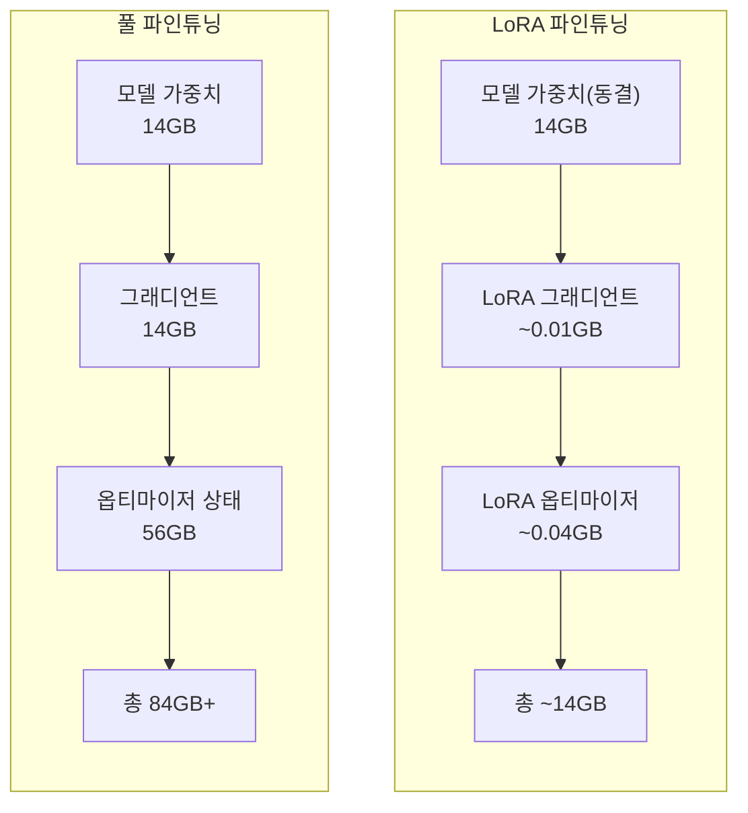
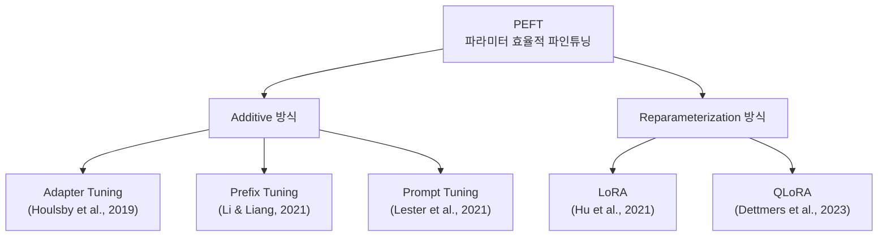
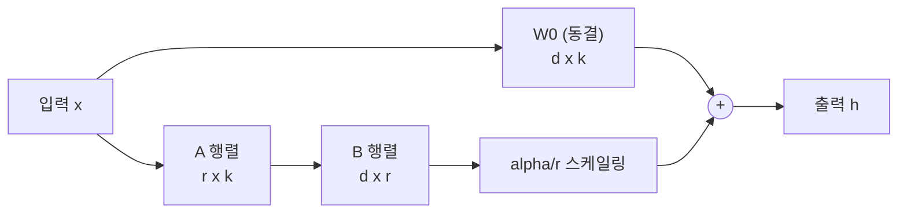
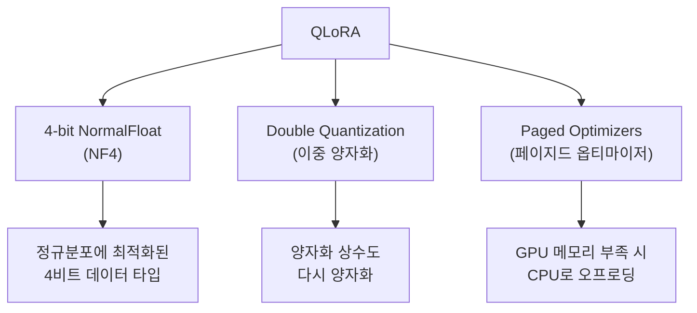
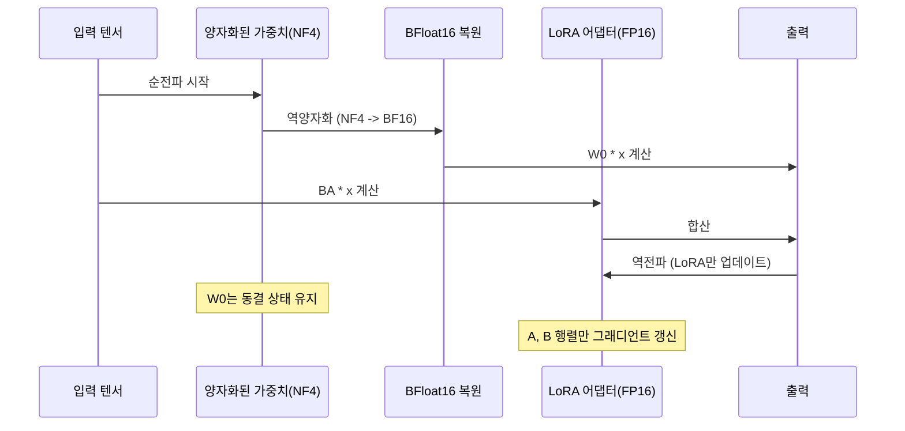
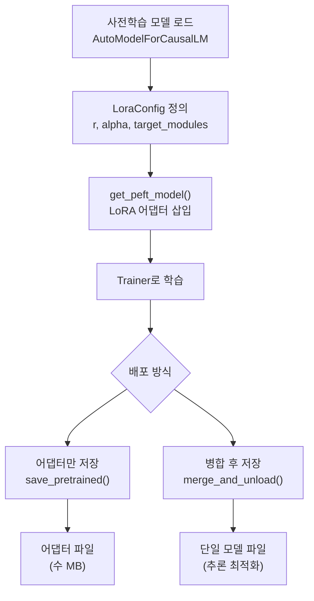

# 효율적 파인튜닝: LoRA와 QLoRA

> 수십억 파라미터의 거대 모델을 단일 GPU에서 파인튜닝하는 파라미터 효율적 기법의 원리와 실습

## 개요

이 섹션에서는 대규모 언어 모델(LLM)을 효율적으로 파인튜닝하는 핵심 기법인 **LoRA**(Low-Rank Adaptation)와 **QLoRA**(Quantized LoRA)를 학습합니다. 전체 파라미터를 업데이트하는 풀 파인튜닝의 한계를 이해하고, 저랭크 분해라는 수학적 아이디어가 어떻게 GPU 메모리를 극적으로 절감하는지 살펴봅니다.

**선수 지식**: [파인튜닝의 원리와 전략](19-파인튜닝과-전이학습/01-01-파인튜닝의-원리와-전략.md)에서 배운 풀 파인튜닝과 점진적 해동(Gradual Unfreezing) 개념, [RLHF와 정렬](20-llm의-이해와-활용/04-04-rlhf와-정렬alignment.md)에서 다룬 SFT 단계의 이해

**학습 목표**:
- 풀 파인튜닝의 메모리 병목을 이해하고 PEFT의 필요성을 설명할 수 있다
- 다양한 PEFT 접근법(Adapter, Prefix Tuning, Prompt Tuning, LoRA)의 차이를 비교할 수 있다
- LoRA의 저랭크 분해 원리($\Delta W = BA$)를 수식과 코드로 이해한다
- QLoRA의 4비트 양자화(NF4)와 이중 양자화 기법을 설명할 수 있다
- Hugging Face PEFT 라이브러리로 실제 모델을 LoRA/QLoRA 파인튜닝할 수 있다

## 왜 알아야 할까?

GPT-3는 1,750억 개의 파라미터를 가지고 있습니다. 이 모델을 풀 파인튜닝하려면 모델 가중치(FP16 기준 350GB)에 더해 옵티마이저 상태(Adam은 파라미터의 2배)와 그래디언트까지 — 총 **1TB 이상의 GPU 메모리**가 필요하죠. A100 80GB GPU가 최소 12장 이상 필요한 셈입니다.

그런데 2021년, Microsoft Research의 Edward Hu 팀이 놀라운 발견을 합니다. "사전학습된 모델의 가중치 변화량은 사실 **저차원 공간에 집중**되어 있다"는 것이었죠. 이 통찰에서 탄생한 LoRA는 학습 파라미터를 **10,000분의 1**로 줄이면서도 풀 파인튜닝에 필적하는 성능을 달성했습니다.

2023년에는 Tim Dettmers 팀이 여기에 4비트 양자화를 결합한 QLoRA를 발표하며, **650억 파라미터 모델을 단일 48GB GPU에서 파인튜닝**하는 것이 가능해졌습니다. 오늘날 오픈소스 LLM 파인튜닝의 사실상 표준이 된 이 기법들을 자세히 살펴보겠습니다.

## 핵심 개념

### 개념 1: 풀 파인튜닝의 메모리 병목

> 💡 **비유**: 100층 빌딩 전체를 리모델링하려면 각 층마다 설계도(그래디언트), 자재 창고(옵티마이저 상태), 작업 공간(활성화 메모리)이 필요합니다. 그런데 실제로 바꿔야 할 곳은 각 층의 인테리어 벽지 정도인데, 빌딩 전체 공사 허가를 받고 모든 층에 자재를 쌓아두는 셈이죠.

풀 파인튜닝에서 GPU 메모리를 소비하는 요소를 정리해보면:

| 구성 요소 | FP16 기준 메모리 | 7B 모델 예시 |
|-----------|----------------|-------------|
| 모델 가중치 | 2바이트 × 파라미터 수 | ~14GB |
| 그래디언트 | 2바이트 × 파라미터 수 | ~14GB |
| 옵티마이저(Adam) | 8바이트 × 파라미터 수 | ~56GB |
| 활성화 메모리 | 가변 | ~수 GB |
| **합계** | | **~84GB+** |

7B 모델 하나만 해도 A100 80GB로는 빠듯합니다. 13B, 70B 모델은 말할 것도 없죠.

> 📊 **그림 1**: 풀 파인튜닝 vs PEFT의 메모리 비교



PEFT(Parameter-Efficient Fine-Tuning)는 이 문제를 해결하기 위한 접근법입니다. 전체 파라미터 대신 **극소수의 파라미터만 학습**하면서도 풀 파인튜닝에 근접한 성능을 얻는 것이 목표죠.

### PEFT 접근법의 전체 지형

LoRA를 깊이 들어가기 전에, PEFT라는 넓은 범주에 어떤 방법들이 있는지 먼저 조감해봅시다. 각 방법은 "어디에 학습 가능한 파라미터를 추가하느냐"에 따라 구분됩니다.

> 📊 **그림 2**: PEFT 접근법의 분류



| 방법 | 핵심 아이디어 | 학습 파라미터 위치 | 추론 지연 | 장단점 |
|------|-------------|------------------|----------|--------|
| **Adapter Tuning** | 각 Transformer 레이어 사이에 작은 병목(bottleneck) 모듈 삽입 | 레이어 사이 삽입된 FC 레이어 | 있음 (추가 레이어 통과) | 안정적이나 추론 시 오버헤드 |
| **Prefix Tuning** | 각 레이어의 Key/Value에 학습 가능한 가상 토큰(prefix) 추가 | 각 레이어의 KV 앞에 붙는 벡터 | 약간 있음 | 생성 태스크에 효과적, 최적화 불안정할 수 있음 |
| **Prompt Tuning** | 입력 임베딩 앞에 학습 가능한 소프트 프롬프트 추가 | 입력 임베딩 레이어만 | 거의 없음 | 가장 간단하나 소규모 모델에서 성능 저하 |
| **LoRA** | 가중치 변화량을 저랭크 행렬 곱으로 분해 | 기존 가중치에 병렬 추가 | **없음** (병합 가능) | 추론 오버헤드 0, 높은 성능, 현재 가장 널리 사용 |
| **QLoRA** | LoRA + 4비트 양자화 | LoRA와 동일 + 양자화된 베이스 | **없음** | 극한의 메모리 절감, 소비자 GPU에서도 가능 |

Adapter Tuning(2019)이 PEFT의 문을 열었고, Prefix Tuning과 Prompt Tuning이 다양한 접근법을 탐색했지만, LoRA가 **추론 시 추가 지연이 전혀 없다**는 결정적 장점으로 현재 가장 널리 쓰이는 표준이 되었습니다. 이제 LoRA의 핵심 원리를 자세히 살펴보겠습니다.

### 개념 2: LoRA — 저랭크 분해의 마법

> 💡 **비유**: 고해상도 사진을 전송할 때, 원본(100MB)을 통째로 보내는 대신 JPEG 압축(1MB)으로 보내도 사람 눈에는 거의 같아 보이죠? LoRA도 마찬가지입니다. 가중치의 "변화량"이 본래 저차원 구조를 가지고 있기 때문에, 압축된 형태로 학습해도 정보 손실이 거의 없는 겁니다.

LoRA의 핵심 아이디어는 간단합니다. 사전학습된 가중치 행렬 $W_0 \in \mathbb{R}^{d \times k}$를 동결하고, 가중치 변화량 $\Delta W$를 **두 개의 작은 행렬의 곱**으로 표현합니다:

$$\Delta W = BA$$

여기서:
- $B \in \mathbb{R}^{d \times r}$ — 출력 차원 × 랭크
- $A \in \mathbb{R}^{r \times k}$ — 랭크 × 입력 차원
- $r \ll \min(d, k)$ — 랭크 (보통 4~64)

최종 출력은 다음과 같습니다:

$$h = W_0 x + \Delta W x = W_0 x + BAx$$

학습 시에는 $B$와 $A$만 업데이트하고, 추론 시에는 $W_0 + BA$를 미리 합쳐서 **추가 지연 없이** 사용할 수 있습니다. 이것이 앞서 살펴본 Adapter Tuning과의 결정적 차이입니다 — Adapter는 추론 시에도 추가 레이어를 통과해야 하지만, LoRA는 가중치를 병합하면 원래 모델과 동일한 구조가 됩니다.

> 📊 **그림 3**: LoRA의 저랭크 분해 구조



파라미터 절감 효과를 계산해볼까요? $d = k = 4096$ (일반적인 LLM 차원)이고 $r = 8$이라면:

```run:python
d, k = 4096, 4096  # 일반적인 LLM 히든 차원
r = 8              # LoRA 랭크

# 원래 가중치 행렬의 파라미터 수
original_params = d * k

# LoRA 파라미터 수 (A + B)
lora_params = d * r + r * k

# 비율 계산
ratio = lora_params / original_params * 100

print(f"원본 파라미터: {original_params:,}")
print(f"LoRA 파라미터: {lora_params:,}")
print(f"비율: {ratio:.2f}%")
print(f"절감률: {100 - ratio:.2f}%")
```

```output
원본 파라미터: 16,777,216
LoRA 파라미터: 65,536
비율: 0.39%
절감률: 99.61%
```

하나의 가중치 행렬에서만 **99.6%의 파라미터를 절감**할 수 있습니다! LoRA는 보통 Transformer의 어텐션 레이어에 있는 Query($W_q$), Value($W_v$) 행렬에 적용하며, 필요에 따라 Key($W_k$)와 Output($W_o$), 심지어 FFN 레이어까지 확장할 수 있습니다.

**스케일링 팩터**: LoRA는 학습된 변화량에 $\alpha / r$을 곱합니다. 여기서 `lora_alpha`는 하이퍼파라미터이고, $r$은 랭크입니다. 이 스케일링은 랭크를 바꿔도 학습률을 재조정할 필요 없게 해주는 역할을 합니다.

**초기화**: $A$는 Kaiming 균등 분포로, $B$는 영행렬(zero matrix)로 초기화됩니다. 따라서 학습 시작 시 $\Delta W = BA = 0$이 되어, 모델이 사전학습된 상태에서 출발합니다.

### 개념 3: QLoRA — 양자화로 한 단계 더

> 💡 **비유**: LoRA가 "리모델링할 부분만 골라서 공사하는 것"이었다면, QLoRA는 거기에 더해 "빌딩 도면을 초고해상도 대신 압축 포맷으로 저장하는 것"입니다. 원본 도면(FP16)을 4비트로 압축해서 보관하고, 실제 공사(역전파)할 때만 잠깐 해동해서 사용하죠.

QLoRA는 2023년 Tim Dettmers 팀이 NeurIPS에 발표한 기법으로, LoRA에 세 가지 혁신을 더합니다:

> 📊 **그림 4**: QLoRA의 3가지 핵심 기술



**1) 4-bit NormalFloat (NF4)**

신경망의 가중치는 대체로 정규분포를 따릅니다. NF4는 이 사실을 활용해, 정규분포의 분위수(quantile)에 맞춰 4비트 값을 배치합니다. 정보 이론적으로 정규분포 데이터에 대해 **최적의 4비트 양자화**를 달성하죠.

**2) Double Quantization (이중 양자화)**

양자화에는 "양자화 상수"(스케일/제로포인트)가 필요한데, 이것도 메모리를 차지합니다. QLoRA는 이 양자화 상수를 **한 번 더 양자화**하여 파라미터당 평균 0.37비트를 추가로 절약합니다.

**3) Paged Optimizers**

미니배치 크기가 큰 경우 GPU 메모리가 일시적으로 급증할 수 있는데, NVIDIA 통합 메모리(Unified Memory)를 활용해 옵티마이저 상태를 CPU RAM으로 자동 오프로딩합니다.

> 📊 **그림 5**: QLoRA 학습의 순전파/역전파 흐름



메모리 절감 효과를 비교해봅시다:

| 방식 | 7B 모델 메모리 | 65B 모델 메모리 |
|------|--------------|----------------|
| 풀 파인튜닝 (FP16) | ~84GB | ~780GB+ |
| LoRA (FP16 base) | ~14GB | ~130GB |
| QLoRA (4-bit base) | **~6GB** | **~33GB** |

QLoRA 덕분에 65B 모델을 **단일 A100 48GB GPU**에서 파인튜닝할 수 있게 되었고, 7B 모델은 RTX 3090이나 4090 같은 소비자용 GPU에서도 가능해졌습니다.

### 개념 4: Hugging Face PEFT 라이브러리

> 💡 **비유**: LoRA를 직접 구현하는 건 자동차 엔진을 직접 조립하는 것과 같습니다. 원리를 이해하면 좋지만, 실제 운전은 완성된 차로 하는 게 효율적이죠. Hugging Face PEFT 라이브러리는 LoRA를 포함한 다양한 PEFT 방법을 **3줄 코드**로 적용할 수 있게 해주는 프레임워크입니다.

PEFT 라이브러리의 핵심 API는 다음과 같습니다:

```python
from peft import LoraConfig, get_peft_model

# 1단계: LoRA 설정 정의
config = LoraConfig(
    r=16,                          # 랭크 (보통 8~64)
    lora_alpha=32,                 # 스케일링 팩터
    target_modules=["q_proj", "v_proj"],  # 적용 대상 모듈
    lora_dropout=0.05,             # 드롭아웃
    bias="none",                   # 바이어스 학습 여부
    task_type="CAUSAL_LM"          # 태스크 유형
)

# 2단계: 기존 모델을 LoRA 모델로 감싸기
peft_model = get_peft_model(base_model, config)

# 3단계: 학습 가능 파라미터 확인
peft_model.print_trainable_parameters()
```

> 📊 **그림 6**: PEFT 라이브러리의 LoRA 적용 흐름



QLoRA를 사용하려면 `BitsAndBytesConfig`로 4비트 양자화를 설정합니다:

```python
from transformers import BitsAndBytesConfig
import torch

# QLoRA용 4비트 양자화 설정
bnb_config = BitsAndBytesConfig(
    load_in_4bit=True,                     # 4비트 로딩
    bnb_4bit_quant_type="nf4",             # NF4 양자화
    bnb_4bit_compute_dtype=torch.bfloat16, # 연산은 BF16
    bnb_4bit_use_double_quant=True         # 이중 양자화
)

# 양자화된 모델 로드
model = AutoModelForCausalLM.from_pretrained(
    "meta-llama/Llama-2-7b-hf",
    quantization_config=bnb_config,
    device_map="auto"
)

# LoRA 적용 (위와 동일)
peft_model = get_peft_model(model, lora_config)
```

**주요 `LoraConfig` 파라미터 가이드**:

| 파라미터 | 설명 | 권장값 |
|---------|------|--------|
| `r` | 랭크 — 클수록 표현력 증가, 메모리 소모 증가 | 8~64 |
| `lora_alpha` | 스케일링 팩터 — 보통 `r`의 1~2배 | 16~64 |
| `target_modules` | LoRA 적용 대상 레이어 | `["q_proj", "v_proj"]` 또는 `"all-linear"` |
| `lora_dropout` | LoRA 레이어 드롭아웃 | 0.05~0.1 |
| `bias` | 바이어스 학습 — `"none"`, `"all"`, `"lora_only"` | `"none"` |
| `task_type` | 태스크 유형 (CAUSAL_LM, SEQ_CLS 등) | 태스크에 맞게 |
| `use_rslora` | Rank-Stabilized LoRA ($\alpha/\sqrt{r}$) | 높은 랭크일 때 `True` |

## 실습: 직접 해보기

GPT-2 모델에 LoRA를 적용하여 텍스트 감성 분류를 파인튜닝하는 전체 코드입니다.

```python
# 필요한 라이브러리 설치
# pip install peft transformers datasets accelerate bitsandbytes

import torch
from datasets import load_dataset
from transformers import (
    AutoTokenizer,
    AutoModelForSequenceClassification,
    TrainingArguments,
    Trainer,
    DataCollatorWithPadding,
)
from peft import LoraConfig, get_peft_model, TaskType

# ─────────────────────────────────
# 1. 데이터 준비: IMDb 감성 분류
# ─────────────────────────────────
dataset = load_dataset("imdb")

# 토크나이저 로드
model_name = "gpt2"
tokenizer = AutoTokenizer.from_pretrained(model_name)
tokenizer.pad_token = tokenizer.eos_token  # GPT-2는 패드 토큰이 없으므로

# 토큰화 함수
def tokenize_fn(examples):
    return tokenizer(
        examples["text"],
        truncation=True,
        max_length=512,
        padding=False,
    )

# 데이터셋 토큰화
tokenized = dataset.map(tokenize_fn, batched=True, remove_columns=["text"])

# 학습 데이터 일부만 사용 (빠른 실습)
train_dataset = tokenized["train"].shuffle(seed=42).select(range(2000))
eval_dataset = tokenized["test"].shuffle(seed=42).select(range(500))

# ─────────────────────────────────
# 2. 모델 로드 + LoRA 설정
# ─────────────────────────────────
model = AutoModelForSequenceClassification.from_pretrained(
    model_name,
    num_labels=2,
    torch_dtype=torch.float16,
)
model.config.pad_token_id = tokenizer.pad_token_id

# LoRA 설정
lora_config = LoraConfig(
    r=16,                              # 랭크: 16
    lora_alpha=32,                     # 스케일링: 32 (= 2 * r)
    target_modules=["c_attn", "c_proj"],  # GPT-2의 어텐션 모듈
    lora_dropout=0.05,                 # 드롭아웃
    bias="none",                       # 바이어스는 학습하지 않음
    task_type=TaskType.SEQ_CLS,        # 시퀀스 분류
    modules_to_save=["score"],         # 분류 헤드는 풀 학습
)

# LoRA 적용
model = get_peft_model(model, lora_config)
model.print_trainable_parameters()
# 예상 출력: trainable params: ~0.3M || all params: ~124M || trainable%: ~0.24%

# ─────────────────────────────────
# 3. 학습 설정 및 실행
# ─────────────────────────────────
data_collator = DataCollatorWithPadding(tokenizer=tokenizer)

training_args = TrainingArguments(
    output_dir="./gpt2-lora-imdb",
    num_train_epochs=3,
    per_device_train_batch_size=8,
    per_device_eval_batch_size=16,
    learning_rate=2e-4,              # LoRA는 높은 학습률 사용 가능
    weight_decay=0.01,
    eval_strategy="epoch",
    save_strategy="epoch",
    logging_steps=50,
    fp16=True,
    load_best_model_at_end=True,
    report_to="none",
)

trainer = Trainer(
    model=model,
    args=training_args,
    train_dataset=train_dataset,
    eval_dataset=eval_dataset,
    data_collator=data_collator,
)

# 학습 시작
trainer.train()

# ─────────────────────────────────
# 4. 어댑터 저장 및 추론
# ─────────────────────────────────
# LoRA 어댑터만 저장 (수 MB에 불과)
model.save_pretrained("./gpt2-lora-adapter")

# 추론 시: 어댑터를 병합하여 단일 모델로
merged_model = model.merge_and_unload()
# merged_model은 일반 모델처럼 사용 가능
```

LoRA 어댑터의 크기를 확인해봅시다:

```run:python
import os

# LoRA 어댑터 파일 크기 예시 (시뮬레이션)
d_model = 768          # GPT-2 히든 차원
n_layers = 12          # GPT-2 레이어 수
r = 16                 # LoRA 랭크
modules_per_layer = 2  # c_attn, c_proj

# LoRA 파라미터 수 계산
# c_attn: 768 -> 2304 (qkv), c_proj: 768 -> 768
lora_params_attn = (d_model * r + r * 3 * d_model) * n_layers  # c_attn
lora_params_proj = (d_model * r + r * d_model) * n_layers      # c_proj
total_lora_params = lora_params_attn + lora_params_proj

# FP16 기준 파일 크기
adapter_size_mb = total_lora_params * 2 / (1024 * 1024)

# 원본 모델 크기
original_params = 124_000_000  # GPT-2 (~124M)
original_size_mb = original_params * 2 / (1024 * 1024)

print(f"LoRA 파라미터: {total_lora_params:,}")
print(f"어댑터 크기: {adapter_size_mb:.1f} MB")
print(f"원본 모델 크기: {original_size_mb:.1f} MB")
print(f"크기 비율: {adapter_size_mb / original_size_mb * 100:.2f}%")
```

```output
LoRA 파라미터: 1,179,648
어댑터 크기: 2.3 MB
원본 모델 크기: 236.5 MB
크기 비율: 0.95%
```

어댑터 파일이 **단 2.3MB**입니다. 하나의 기반 모델 위에 수십, 수백 개의 경량 어댑터를 올려 다양한 태스크에 활용할 수 있다는 뜻이죠.

**QLoRA 실습 코드** (4비트 양자화 + LoRA):

```python
# QLoRA: 4비트 양자화 모델 + LoRA
from transformers import AutoModelForCausalLM, BitsAndBytesConfig
from peft import LoraConfig, get_peft_model, prepare_model_for_kbit_training
import torch

# 4비트 양자화 설정
bnb_config = BitsAndBytesConfig(
    load_in_4bit=True,                        # 4비트 양자화 활성화
    bnb_4bit_quant_type="nf4",                # NormalFloat 4비트
    bnb_4bit_compute_dtype=torch.bfloat16,    # 연산은 BF16으로
    bnb_4bit_use_double_quant=True,           # 이중 양자화
)

# 양자화된 모델 로드
model = AutoModelForCausalLM.from_pretrained(
    "mistralai/Mistral-7B-v0.1",
    quantization_config=bnb_config,
    device_map="auto",
    torch_dtype=torch.bfloat16,
)

# kbit 학습을 위한 모델 준비
# (그래디언트 체크포인팅 + 입력 타입 캐스팅)
model = prepare_model_for_kbit_training(model)

# LoRA 설정
lora_config = LoraConfig(
    r=64,                                  # QLoRA는 높은 랭크 사용 가능
    lora_alpha=16,
    target_modules=[
        "q_proj", "k_proj", "v_proj",     # 어텐션 전체
        "o_proj",                          # 출력 프로젝션
        "gate_proj", "up_proj", "down_proj"  # FFN 레이어까지
    ],
    lora_dropout=0.1,
    bias="none",
    task_type="CAUSAL_LM",
)

# LoRA 적용
model = get_peft_model(model, lora_config)
model.print_trainable_parameters()
# QLoRA: 4비트 베이스 + LoRA -> 단일 GPU에서 7B 모델 학습 가능!
```

## 더 깊이 알아보기

### LoRA의 탄생 — "과잉 매개변수화"의 비밀

LoRA의 이론적 배경에는 흥미로운 수학적 관찰이 있습니다. Aghajanyan et al.(2020)은 사전학습된 모델이 가진 **내재적 차원(intrinsic dimensionality)**이 매우 낮다는 것을 발견했습니다. 1,750억 파라미터의 GPT-3도 특정 태스크에 적응할 때 실제로 필요한 자유도는 수백~수천 차원에 불과하다는 것이죠.

Edward Hu는 Microsoft Research에서 GPT-3를 다양한 태스크에 파인튜닝하는 작업을 하면서 이 논문에 영감을 받았습니다. "가중치 변화량이 저차원이라면, 애초에 저차원 공간에서 학습하면 되지 않을까?" 이 단순한 질문이 LoRA의 시작이었습니다. 2021년 발표 당시에는 NLP 커뮤니티에서 주목받는 정도였지만, 2023년 LLM 시대가 열리면서 LoRA는 **사실상의 표준 파인튜닝 방법**으로 자리잡았습니다.

### QLoRA와 Guanaco — "단일 GPU의 기적"

Tim Dettmers는 양자화(quantization) 분야의 전문가로, `bitsandbytes` 라이브러리의 저자이기도 합니다. QLoRA를 개발하면서 그의 팀은 Guanaco라는 모델 패밀리를 함께 공개했는데, 이 모델은 단일 GPU에서 24시간 학습만으로 Vicuna 벤치마크에서 ChatGPT 성능의 **99.3%**를 달성했습니다. 이 결과는 "대규모 GPU 클러스터 없이도 경쟁력 있는 LLM을 만들 수 있다"는 강력한 메시지를 전달했고, 오픈소스 LLM 커뮤니티의 폭발적 성장을 이끌었습니다.

### PEFT의 계보 — Adapter에서 LoRA까지

PEFT의 역사를 거슬러 올라가면, 2019년 Google의 Neil Houlsby 팀이 발표한 **Adapter Tuning**이 시초입니다. 각 Transformer 레이어 사이에 작은 병목(bottleneck) 네트워크를 삽입하는 이 방법은, "전체를 다 학습하지 않아도 된다"는 패러다임 전환을 이끌었죠. 이후 2021년에는 **Prefix Tuning**(Li & Liang)이 각 레이어의 Key/Value 앞에 학습 가능한 가상 토큰을 추가하는 방식을, **Prompt Tuning**(Lester et al.)이 입력 임베딩에만 소프트 프롬프트를 추가하는 더 간결한 방식을 제안했습니다. 이런 다양한 시도들 속에서 LoRA가 "추론 시 오버헤드 제로"라는 결정적 장점으로 최종 승자가 된 셈입니다.

### 수학적 직관: 왜 저랭크가 작동하는가?

가중치 변화량 $\Delta W$의 랭크가 낮은 이유에 대한 직관적 설명이 있습니다. 사전학습된 모델은 이미 일반적인 언어 이해 능력을 갖추고 있으므로, 특정 태스크에 적응할 때는 "기존 지식을 약간 재조합"하는 수준의 변화만 필요합니다. 이런 재조합은 고차원 공간 전체가 아니라, 태스크와 관련된 **저차원 부분공간**에서 일어나는 것이죠.

실제로 Hu et al.의 논문에서 GPT-3의 $\Delta W$를 특이값 분해(SVD)하면, 상위 소수의 특이값에 에너지가 집중되어 있음을 확인할 수 있습니다.

## 흔한 오해와 팁

> ⚠️ **흔한 오해**: "LoRA는 성능이 풀 파인튜닝보다 항상 떨어진다" — 실제로 Hu et al.의 실험에서 LoRA는 GPT-3 175B에서 풀 파인튜닝과 동등하거나 더 나은 성능을 보였습니다. 랭크 $r$을 적절히 설정하면 대부분의 태스크에서 풀 파인튜닝을 대체할 수 있습니다. 다만, 사전학습 데이터와 매우 다른 도메인(예: 영어 모델로 코드 생성)에서는 더 높은 랭크가 필요할 수 있습니다.

> 💡 **알고 계셨나요?**: LoRA 어댑터는 서로 **교환 가능**합니다. 하나의 기반 모델 위에 수백 개의 태스크별 어댑터를 만들고, 추론 시 원하는 어댑터만 로드하면 됩니다. PEFT 라이브러리의 `add_weighted_adapter()`를 사용하면 여러 어댑터를 가중 평균으로 합칠 수도 있어, 다중 태스크 모델을 쉽게 만들 수 있습니다.

> 🔥 **실무 팁**: `target_modules`를 어텐션 레이어만(`q_proj`, `v_proj`)으로 설정하면 가장 효율적이지만, 최근 연구와 실무에서는 `"all-linear"`로 **모든 선형 레이어에 LoRA를 적용**하는 것이 성능이 더 좋다는 보고가 많습니다. 특히 QLoRA에서는 메모리 여유가 있으므로 적극적으로 활용해보세요. 랭크(`r`)는 8~16에서 시작해서 성능을 보고 올리는 전략이 효과적입니다.

## 핵심 정리

| 개념 | 설명 |
|------|------|
| PEFT | 전체 파라미터 대신 소수만 학습하는 효율적 파인튜닝 패러다임 |
| PEFT 접근법들 | Adapter Tuning, Prefix Tuning, Prompt Tuning, LoRA 등 — 학습 파라미터 삽입 위치가 다름 |
| LoRA | $\Delta W = BA$ — 가중치 변화량을 저랭크 행렬 곱으로 표현하여 파라미터 99%+ 절감, 추론 오버헤드 0 |
| 랭크 ($r$) | 저랭크 행렬의 차원. 클수록 표현력 증가, 메모리 소모 증가 (보통 8~64) |
| `lora_alpha` | 스케일링 팩터. $\alpha/r$로 변화량 크기 조절 |
| QLoRA | 4비트 NF4 양자화 + 이중 양자화 + 페이지드 옵티마이저로 메모리를 추가 절감 |
| NF4 | 정규분포에 최적화된 4비트 데이터 타입 |
| `merge_and_unload()` | 학습된 LoRA를 기반 모델에 병합하여 추론 지연 없이 배포 |
| `prepare_model_for_kbit_training()` | QLoRA 학습 전 모델 준비 (그래디언트 체크포인팅 등) |

## 다음 섹션 미리보기

지금까지 Ch1~Ch20을 통해 자연어 처리의 기초부터 LLM의 핵심 기법까지 체계적으로 학습해왔습니다. 다음 [NLP 종합 프로젝트](20-llm의-이해와-활용/06-06-nlp-종합-프로젝트.md)에서는 이 모든 지식을 종합하여 실전 프로젝트를 수행합니다. 데이터 수집부터 모델 선택, LoRA 파인튜닝, 평가, 배포까지 — 완전한 NLP 파이프라인을 직접 구축해봅니다.

## 참고 자료

- [LoRA: Low-Rank Adaptation of Large Language Models (Hu et al., 2021)](https://arxiv.org/abs/2106.09685) - LoRA 원 논문. 저랭크 분해 아이디어와 GPT-3 실험 결과를 담고 있습니다
- [QLoRA: Efficient Finetuning of Quantized LLMs (Dettmers et al., 2023)](https://arxiv.org/abs/2305.14314) - NF4, 이중 양자화, 페이지드 옵티마이저의 세 가지 혁신을 소개한 NeurIPS 2023 논문
- [Parameter-Efficient Transfer Learning for NLP (Houlsby et al., 2019)](https://arxiv.org/abs/1902.00751) - Adapter Tuning 원 논문. PEFT 패러다임의 시초
- [Prefix-Tuning: Optimizing Continuous Prompts (Li & Liang, 2021)](https://arxiv.org/abs/2101.00190) - Prefix Tuning 원 논문. 가상 토큰으로 모델을 제어하는 접근법
- [Hugging Face PEFT — LoRA Conceptual Guide](https://huggingface.co/docs/peft/main/en/conceptual_guides/lora) - PEFT 라이브러리의 공식 LoRA 문서. LoraConfig 파라미터와 병합/언로드 API를 상세히 설명
- [Hugging Face PEFT — LoRA-based Methods](https://huggingface.co/docs/peft/en/task_guides/lora_based_methods) - LoRA, LoHa, LoKr, AdaLoRA 등 다양한 저랭크 방법의 실습 가이드
- [Hugging Face PEFT GitHub](https://github.com/huggingface/peft) - PEFT 라이브러리 소스 코드와 예제 노트북 모음
- [How to fine-tune open LLMs in 2025 with Hugging Face](https://www.philschmid.de/fine-tune-llms-in-2025) - QLoRA를 활용한 최신 파인튜닝 실전 가이드

---
### 🔗 Related Sessions
- [fine_tuning](19-파인튜닝과-전이학습/01-01-파인튜닝의-원리와-전략.md) (prerequisite)
- [attention_mechanism](12-어텐션-메커니즘/01-01-어텐션의-직관적-이해.md) (prerequisite)
- [transformer 아키텍처](13-트랜스포머-아키텍처-심층-분석/01-01-트랜스포머-아키텍처-전체-조망.md) (prerequisite)
- [gradual_unfreezing](19-파인튜닝과-전이학습/01-01-파인튜닝의-원리와-전략.md) (prerequisite)
- [rlhf_pipeline](17-gpt-생성적-사전학습-모델/03-03-gpt-계열의-발전-gpt-2에서-gpt-4까지.md) (prerequisite)
