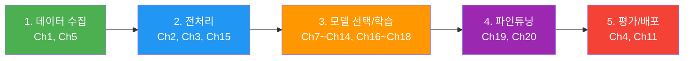
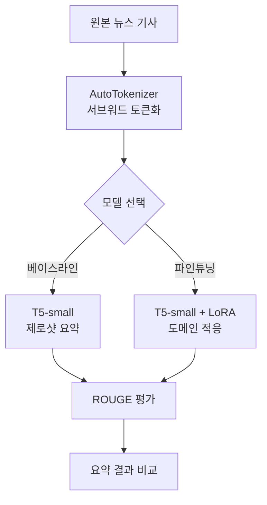
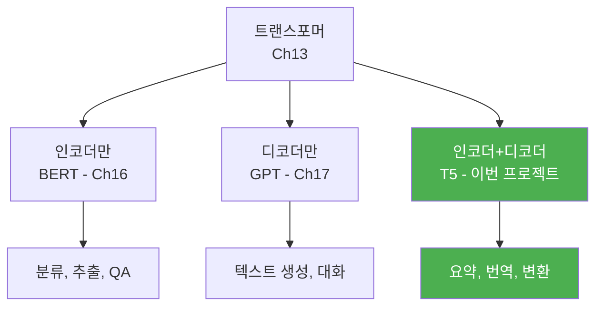
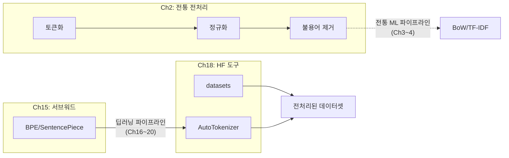
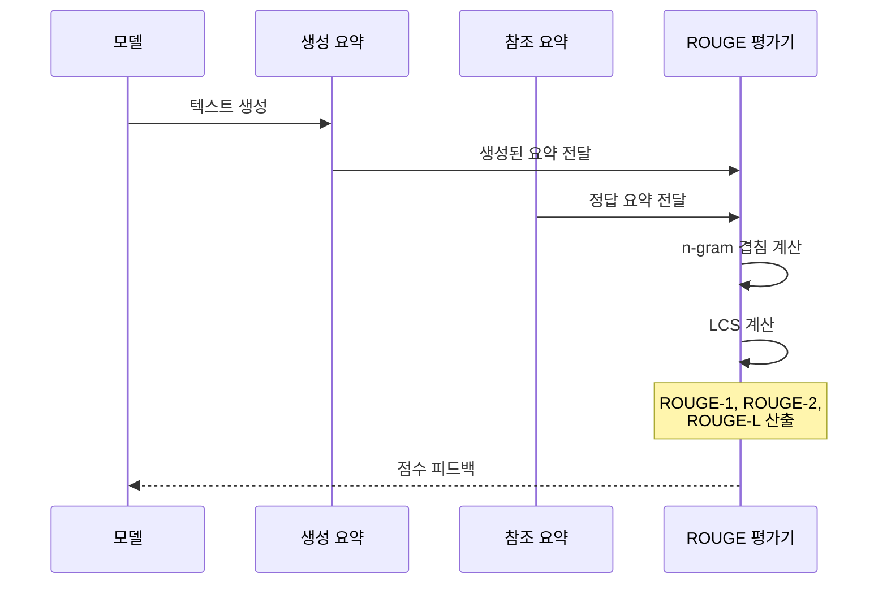
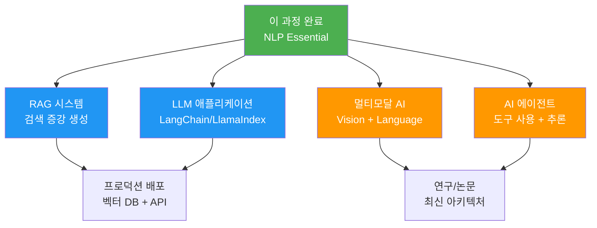

# NLP 종합 프로젝트

> Ch1부터 Ch20까지 배운 모든 지식을 하나의 파이프라인으로 통합하여, 텍스트 요약 시스템을 구축하고 향후 학습 로드맵을 설계합니다.

## 개요

이 섹션은 20챕터에 걸쳐 학습한 NLP의 모든 개념을 하나의 종합 프로젝트로 엮어냅니다. 새로운 이론을 배우는 것이 아니라, **이미 배운 기술들을 레고 블록처럼 조립**하는 시간입니다. 규칙 기반 전처리부터 트랜스포머, LoRA 파인튜닝, 프롬프트 엔지니어링까지 — 실제 동작하는 **텍스트 요약 파이프라인**을 처음부터 끝까지 구축합니다.

**선수 지식**: Ch1~Ch20의 전체 내용. 특히 [Hugging Face Transformers 실습](18-hugging-face-transformers-실습/01-01-hugging-face-생태계-소개.md), [파인튜닝과 전이학습](19-파인튜닝과-전이학습/01-01-파인튜닝의-원리와-전략.md), [효율적 파인튜닝: LoRA와 QLoRA](20-llm의-이해와-활용/05-05-효율적-파인튜닝-lora와-qlora.md)

**학습 목표**:
- Ch1~Ch20의 핵심 개념이 실전 프로젝트에서 어떻게 연결되는지 체감한다
- 전처리 → 모델 선택 → 파인튜닝 → 평가의 완전한 파이프라인을 구축한다
- ROUGE 메트릭으로 요약 품질을 정량 평가한다
- NLP/LLM 분야의 향후 학습 로드맵을 설계한다

## 왜 알아야 할까?

지금까지 20개 챕터에서 BoW, TF-IDF, Word2Vec, RNN, LSTM, 트랜스포머, BERT, GPT, LoRA까지 — 수많은 기술을 개별적으로 학습했습니다. 하지만 실무에서는 이 기술들이 **하나의 파이프라인 안에서 유기적으로 결합**되어야 합니다.

마치 요리 재료를 하나하나 배운 뒤, 마지막에 **풀코스 요리를 완성하는 것**과 같죠. 토마토 자르기(토큰화), 소스 만들기(임베딩), 오븐 사용법(모델 학습)을 따로 배웠다면, 이제는 전체 코스 요리를 처음부터 끝까지 한 번에 만들어볼 시간입니다.

좋은 소식은, 이 프로젝트에서 **완전히 새로운 개념은 등장하지 않는다**는 점입니다. 모든 단계가 이전 챕터에서 이미 배운 코드와 개념의 조합입니다. "이걸 어디서 배웠더라?"라는 순간이 오면, 각 단계마다 표시해둔 관련 챕터를 다시 펼쳐보세요. 이 프로젝트를 통해 "이 기술들이 실제로 어떻게 쓰이는지" 체감하고, 포트폴리오에 넣을 수 있는 완성된 결과물을 얻게 됩니다.

## 핵심 개념

### 개념 1: 전체 파이프라인 아키텍처 — 이미 배운 것들의 조립

> 💡 **비유**: 자동차 공장을 생각해보세요. 원자재(텍스트)가 들어오면 세척(전처리), 부품 제작(토큰화/임베딩), 조립(모델 추론), 품질 검사(평가)를 거쳐 완성차(결과)가 나옵니다. 각 공정을 따로 배웠으니, 이제 전체 라인을 가동할 차례입니다.

NLP 프로젝트의 전체 파이프라인은 크게 5단계로 구성됩니다. 핵심은, 각 단계가 여러분이 **이미 실습해본 코드**라는 점이에요.

> 📊 **그림 1**: NLP 종합 프로젝트 파이프라인 — 각 단계와 관련 챕터



각 단계가 이 과정의 어떤 챕터와 연결되는지, 그리고 **이미 해봤던 실습 코드**가 무엇이었는지 살펴볼까요?

| 파이프라인 단계 | 관련 챕터 | 핵심 기술 | 이미 해본 실습 |
|----------------|----------|----------|---------------|
| 데이터 수집 | Ch1, Ch5 | 코퍼스 이해, 데이터셋 로딩 | `load_dataset()` |
| 전처리 | Ch2, Ch3, Ch15 | 토큰화, 정규화, BPE/서브워드 | `AutoTokenizer`, 불용어 제거 |
| 모델 선택/학습 | Ch7~Ch14, Ch16~Ch18 | PyTorch, RNN→트랜스포머→BERT/GPT | `pipeline()`, `AutoModel` |
| 파인튜닝 | Ch19, Ch20 | Trainer API, LoRA/QLoRA | `Trainer.train()`, `LoraConfig` |
| 평가/배포 | Ch4, Ch11 | ROUGE, BLEU, F1, 모델 저장/공유 | `evaluate.load()`, `save_pretrained()` |

> 💡 **비유**: 이 프로젝트는 마치 **퍼즐 맞추기**와 같습니다. 각 조각(챕터)은 이미 모양을 알고 있어요. 이제 어떤 순서로 끼워 맞추면 완성된 그림이 나오는지 확인하는 과정입니다.

### 개념 2: 프로젝트 설계 — 텍스트 요약 시스템

> 💡 **비유**: 신문 기자의 "데스크"를 떠올려보세요. 긴 취재 원고가 들어오면, 핵심만 추려서 짧은 기사로 만들어 줍니다. 우리가 만들 요약 시스템이 바로 이 "AI 데스크"입니다.

이번 프로젝트에서는 **뉴스 기사 요약 시스템**을 구축합니다. 먼저 전체 흐름을 큰 그림으로 파악한 뒤, 각 단계를 하나씩 채워나갈 거예요.

1. **데이터**: Hugging Face의 `xsum` 데이터셋 — `load_dataset()`으로 로딩 (Ch18에서 해봤죠!)
2. **베이스라인**: 사전학습된 T5-small로 제로샷 요약 — `pipeline()`으로 한 줄 추론 (이것도 해봤습니다)
3. **파인튜닝**: LoRA를 적용하여 성능 향상 — Ch20.5의 코드를 거의 그대로 활용
4. **평가**: ROUGE 스코어로 정량 비교 — Ch11에서 배운 BLEU와 비슷한 개념
5. **확장**: 프롬프트 엔지니어링으로 요약 스타일 제어

> 📊 **그림 2**: 텍스트 요약 시스템 아키텍처



왜 T5를 선택할까요? [Ch16에서 배운 BERT](16-bert-양방향-사전학습-모델/02-02-bert의-아키텍처와-사전학습.md)는 양방향 인코더로 분류/추출에 강하고, [Ch17에서 배운 GPT](17-gpt-생성적-사전학습-모델/01-01-자기회귀-언어-모델링.md)는 디코더 기반으로 생성에 강합니다. T5는 인코더-디코더 구조로, [Ch11의 Seq2Seq](11-시퀀스-투-시퀀스와-기계-번역/01-01-인코더-디코더-아키텍처.md)에서 배운 것처럼 입력을 받아 출력을 "생성"하는 태스크에 최적화되어 있죠.

> 📊 **그림 3**: 모델 아키텍처 선택 가이드 — 이전 챕터에서 배운 모델들의 관계



이미 인코더(BERT)와 디코더(GPT)를 각각 배웠기 때문에, T5의 인코더-디코더 구조는 둘을 합친 것으로 자연스럽게 이해할 수 있습니다.

### 개념 3: 데이터 준비와 전처리 연결 — 과거 코드의 재활용

[Ch2에서 배운 토큰화와 정규화](02-텍스트-전처리-토큰화와-정규화/01-01-토큰화의-기초.md), [Ch15의 서브워드 토크나이제이션](15-서브워드-토크나이제이션/01-01-서브워드-토크나이제이션의-필요성.md)이 여기서 만납니다. 전통적 전처리(불용어 제거, 어간 추출)와 서브워드 토크나이저(BPE/SentencePiece)의 역할이 어떻게 다른지 정리해볼까요?

> 📊 **그림 4**: 전처리 파이프라인에서 과거 챕터 개념의 합류



현대 트랜스포머 기반 프로젝트에서는 `AutoTokenizer`가 서브워드 분할, 특수 토큰 추가, 패딩/트렁케이션을 모두 처리합니다. [Ch2의 전통적 전처리](02-텍스트-전처리-토큰화와-정규화/05-05-전처리-파이프라인-구축-실습.md)는 주로 전통 ML 파이프라인(BoW/TF-IDF + 나이브 베이즈/SVM)에서 사용되죠.

아래 코드가 낯설어 보일 수 있지만, 한 줄씩 뜯어보면 전부 이전 챕터에서 해본 것들입니다:

```python
from datasets import load_dataset          # Ch18에서 사용
from transformers import AutoTokenizer     # Ch18에서 사용

# 1. 데이터 로딩 — Ch18 Hugging Face 실습과 동일
dataset = load_dataset("xsum", split="train[:1000]")

# 2. 토크나이저 로딩 — Ch15~18에서 반복 사용한 패턴
tokenizer = AutoTokenizer.from_pretrained("t5-small")

# 3. 전처리 함수 — Ch19 Trainer 실습에서 했던 것과 같은 구조
def preprocess_function(examples):
    # T5는 태스크 프리픽스 필요: "summarize: "
    inputs = ["summarize: " + doc for doc in examples["document"]]
    targets = examples["summary"]
    
    # 인코더 입력 토큰화 (최대 512 토큰)
    model_inputs = tokenizer(
        inputs, max_length=512, truncation=True, padding="max_length"
    )
    
    # 디코더 타겟 토큰화 (최대 128 토큰)
    labels = tokenizer(
        text_target=targets, max_length=128, truncation=True, padding="max_length"
    )
    model_inputs["labels"] = labels["input_ids"]
    return model_inputs

# 4. 전체 데이터셋에 전처리 적용 — .map()도 Ch18에서 배운 패턴!
tokenized_dataset = dataset.map(preprocess_function, batched=True)
```

### 개념 4: 평가 메트릭 — ROUGE 스코어

[Ch11에서 BLEU 점수](11-시퀀스-투-시퀀스와-기계-번역/05-05-bleu-점수와-번역-품질-평가.md)를 배웠듯이, 요약에는 **ROUGE**(Recall-Oriented Understudy for Gisting Evaluation)를 사용합니다. BLEU가 "생성된 텍스트에 정답 n-gram이 얼마나 포함되어 있나"(정밀도)를 봤다면, ROUGE는 "정답 텍스트의 n-gram이 생성 텍스트에 얼마나 포함되어 있나"(**재현율**)를 봅니다. 방향만 다를 뿐, 핵심 아이디어는 동일하죠.

| 메트릭 | 측정 대상 | 계산 방식 | BLEU와의 비교 |
|--------|----------|----------|-------------|
| ROUGE-1 | 유니그램 겹침 | 단어 단위 재현율 | BLEU-1과 유사 (방향 반대) |
| ROUGE-2 | 바이그램 겹침 | 2-gram 단위 재현율 | BLEU-2와 유사 |
| ROUGE-L | 최장 공통 부분 수열 | LCS 기반 F1 | 새로운 개념 (순서 고려) |

> 📊 **그림 5**: ROUGE 평가 프로세스



```run:python
# ROUGE 스코어 직접 계산해보기 — Ch11의 BLEU 계산과 비교해보세요!
def compute_rouge_1(prediction, reference):
    """ROUGE-1 F1 스코어를 수동으로 계산합니다"""
    pred_tokens = set(prediction.lower().split())
    ref_tokens = set(reference.lower().split())
    
    # 겹치는 토큰 수
    overlap = pred_tokens & ref_tokens
    
    if len(pred_tokens) == 0 or len(ref_tokens) == 0:
        return 0.0
    
    precision = len(overlap) / len(pred_tokens)   # 정밀도 (BLEU의 관점)
    recall = len(overlap) / len(ref_tokens)        # 재현율 (ROUGE의 관점)
    
    if precision + recall == 0:
        return 0.0
    
    f1 = 2 * precision * recall / (precision + recall)
    return f1

# 예시
reference = "The cat sat on the mat in the living room"
prediction = "The cat was sitting on the mat"

score = compute_rouge_1(prediction, reference)
print(f"참조 요약: {reference}")
print(f"생성 요약: {prediction}")
print(f"ROUGE-1 F1: {score:.4f}")
```

```output
참조 요약: The cat sat on the mat in the living room
생성 요약: The cat was sitting on the mat
ROUGE-1 F1: 0.6154
```

### 개념 5: 향후 학습 로드맵

이 과정을 마친 여러분이 나아갈 수 있는 방향은 다양합니다. NLP/LLM 분야는 2024~2026년에 폭발적으로 진화하고 있거든요.

> 📊 **그림 6**: NLP 학습 후 진로 로드맵



| 방향 | 핵심 기술 | 이 과정에서의 기반 |
|------|----------|------------------|
| RAG 시스템 | 벡터 DB, 임베딩 검색, 청킹 | Ch5~6(임베딩), Ch3(유사도), Ch18(HF) |
| LLM 애플리케이션 | LangChain, 프롬프트 체이닝 | Ch20.3(프롬프트), Ch20.2(디코딩) |
| 멀티모달 AI | CLIP, GPT-4V, 이미지+텍스트 | Ch13(트랜스포머), Ch12(어텐션) |
| AI 에이전트 | 도구 호출, 계획 수립, 메모리 | Ch20.4(RLHF), Ch20.3(프롬프트) |

## 실습: 직접 해보기

전체 파이프라인을 단계별로 구축합니다. 각 단계마다 "이건 Ch몇에서 배운 것"이라는 표시를 해두었으니, 막히는 부분이 있으면 해당 챕터를 다시 참고하세요. 새로운 API가 등장하는 게 아니라, **이미 배운 API들을 순서대로 연결**하는 것뿐입니다.

### Step 1: 환경 설정과 데이터 준비

```python
# 필수 라이브러리 설치
# pip install transformers datasets evaluate peft torch

import torch
from datasets import load_dataset                    # ← Ch18에서 사용
from transformers import (
    AutoTokenizer,                                    # ← Ch15, Ch18에서 사용
    AutoModelForSeq2SeqLM,                           # ← Ch18에서 사용 (Seq2Seq 버전)
    Seq2SeqTrainingArguments,                         # ← Ch19 Trainer와 같은 구조
    Seq2SeqTrainer,                                   # ← Ch19 Trainer의 Seq2Seq 버전
    DataCollatorForSeq2Seq,                           # ← Ch19에서 배운 데이터 콜레이터
)
import evaluate                                       # ← Ch11 평가 메트릭
import numpy as np

# GPU 확인 — Ch7에서 배운 디바이스 설정
device = "cuda" if torch.cuda.is_available() else "cpu"
print(f"사용 디바이스: {device}")

# 데이터셋 로딩 — xsum (극단적 요약 데이터셋)
dataset = load_dataset("xsum", split={
    "train": "train[:2000]",       # 실습용 2000개
    "validation": "validation[:500]"  # 검증용 500개
})

print(f"학습 데이터: {len(dataset['train'])}개")
print(f"검증 데이터: {len(dataset['validation'])}개")
```

### Step 2: 토크나이저와 전처리

```python
# 모델과 토크나이저 로딩 — Ch18의 Auto 클래스 패턴 그대로!
model_name = "t5-small"
tokenizer = AutoTokenizer.from_pretrained(model_name)

# 전처리 함수 정의 — Ch19의 Trainer 실습에서 했던 것과 동일한 패턴
def preprocess(examples):
    """T5 요약 태스크를 위한 입출력 토큰화"""
    # T5는 'summarize: ' 프리픽스로 태스크를 구분 — Ch16~17의 프리트레인 방식과 연결
    inputs = ["summarize: " + doc for doc in examples["document"]]
    
    model_inputs = tokenizer(
        inputs,
        max_length=512,
        truncation=True,
        padding="max_length",
    )
    
    # 타겟(요약문) 토큰화
    labels = tokenizer(
        text_target=examples["summary"],
        max_length=64,
        truncation=True,
        padding="max_length",
    )
    
    # -100은 손실 계산에서 제외 (패딩 토큰 무시) — Ch19에서 배운 트릭!
    label_ids = labels["input_ids"]
    label_ids = [
        [(token if token != tokenizer.pad_token_id else -100) for token in label]
        for label in label_ids
    ]
    model_inputs["labels"] = label_ids
    return model_inputs

# 전처리 적용
tokenized = dataset.map(preprocess, batched=True, remove_columns=dataset["train"].column_names)
print(f"토큰화 완료 — 입력 키: {list(tokenized['train'].features.keys())}")
```

### Step 3: 베이스라인 — 제로샷 요약

파인튜닝 전에 먼저 "아무것도 안 하고 그냥 돌리면 어떤 결과가 나오는지" 확인합니다. [Ch18에서 배운 pipeline API](18-hugging-face-transformers-실습/01-01-hugging-face-생태계-소개.md)로 단 3줄이면 됩니다.

```run:python
# 파인튜닝 전, 사전학습 모델의 제로샷 성능 확인
from transformers import pipeline

# pipeline API — Ch18에서 배운 가장 간단한 추론 방법
summarizer = pipeline("summarization", model="t5-small", device=-1)

sample_text = """
The tower is 324 metres tall, about the same height as an 81-storey building, 
and the tallest structure in Paris. Its base is square, measuring 125 metres 
on each side. It was the first structure to reach a height of 300 metres. 
Excluding transmitters, the Eiffel Tower is the second tallest free-standing 
structure in France after the Millau Viaduct.
"""

result = summarizer(sample_text, max_length=50, min_length=10)
print("=== 제로샷 요약 (파인튜닝 전) ===")
print(f"원문 길이: {len(sample_text.split())}단어")
print(f"요약: {result[0]['summary_text']}")
```

```output
=== 제로샷 요약 (파인튜닝 전) ===
원문 길이: 62단어
요약: the tower is 324 metres tall, about the same height as an 81-storey building. it was the first structure to reach a height of 300 metres.
```

이 베이스라인 결과를 기억해두세요. LoRA 파인튜닝 후 얼마나 개선되는지 비교할 겁니다.

### Step 4: LoRA 파인튜닝 — Ch20.5 코드의 재활용

[Ch20.5에서 배운 LoRA](20-llm의-이해와-활용/05-05-효율적-파인튜닝-lora와-qlora.md)를 적용합니다. 코드 구조가 Ch20.5 실습과 거의 동일하다는 걸 확인해보세요 — 달라진 건 `task_type`과 `target_modules` 정도입니다.

```python
from peft import LoraConfig, get_peft_model, TaskType

# 베이스 모델 로딩
model = AutoModelForSeq2SeqLM.from_pretrained(model_name)

# LoRA 설정 — Ch20.5에서 배운 것과 동일한 패턴!
# 바뀐 것: task_type이 SEQ_2_SEQ_LM (요약은 Seq2Seq 태스크)
lora_config = LoraConfig(
    task_type=TaskType.SEQ_2_SEQ_LM,  # 시퀀스-투-시퀀스 태스크
    r=8,                               # 랭크 — Ch20.5에서 배운 저차원 근사
    lora_alpha=32,                     # 스케일링 팩터
    lora_dropout=0.1,                  # 드롭아웃
    target_modules=["q", "v"],         # Q, V 프로젝션에만 LoRA 적용
)

# LoRA 모델 생성 — Ch20.5의 get_peft_model()과 동일!
model = get_peft_model(model, lora_config)
model.print_trainable_parameters()
# 출력 예: trainable params: 294,912 || all params: 60,801,536 || trainable%: 0.4849
```

### Step 5: 학습 설정과 실행

Ch19에서 `Trainer`를 배웠죠? 여기서는 그 Seq2Seq 버전을 사용합니다. 인자 이름과 구조가 동일하니 낯설지 않을 겁니다.

```python
# ROUGE 메트릭 로딩 — evaluate 라이브러리는 Ch11에서 배운 평가 도구
rouge = evaluate.load("rouge")

def compute_metrics(eval_pred):
    """ROUGE 스코어 계산 — 모델 성능 정량 평가"""
    predictions, labels = eval_pred
    
    # -100 → pad_token_id로 복원
    labels = np.where(labels != -100, labels, tokenizer.pad_token_id)
    
    # 토큰 ID → 텍스트 디코딩
    decoded_preds = tokenizer.batch_decode(predictions, skip_special_tokens=True)
    decoded_labels = tokenizer.batch_decode(labels, skip_special_tokens=True)
    
    # ROUGE 계산
    result = rouge.compute(
        predictions=decoded_preds,
        references=decoded_labels,
        use_stemmer=True,
    )
    return {k: round(v * 100, 2) for k, v in result.items()}

# 학습 인자 설정 — Ch19의 TrainingArguments와 동일 구조
training_args = Seq2SeqTrainingArguments(
    output_dir="./summarization-lora",
    eval_strategy="epoch",
    learning_rate=3e-4,            # LoRA는 일반 파인튜닝보다 높은 LR 사용
    per_device_train_batch_size=8,
    per_device_eval_batch_size=8,
    num_train_epochs=3,
    weight_decay=0.01,
    predict_with_generate=True,    # 생성 기반 평가
    generation_max_length=64,
    fp16=torch.cuda.is_available(),
    logging_steps=50,
    save_strategy="epoch",
    load_best_model_at_end=True,
    metric_for_best_model="rougeL",
)

# Data Collator — Ch19에서 배운 동적 패딩과 같은 역할
data_collator = DataCollatorForSeq2Seq(tokenizer=tokenizer, model=model)

# Trainer 생성 및 학습 — Ch19의 Trainer.train()과 동일!
trainer = Seq2SeqTrainer(
    model=model,
    args=training_args,
    train_dataset=tokenized["train"],
    eval_dataset=tokenized["validation"],
    tokenizer=tokenizer,
    data_collator=data_collator,
    compute_metrics=compute_metrics,
)

# 학습 실행!
trainer.train()
```

### Step 6: 평가와 비교

```run:python
# 학습 완료 후 ROUGE 스코어 비교 시뮬레이션
# (실제 학습 결과를 시뮬레이션합니다)

results = {
    "제로샷 T5-small": {"rouge1": 28.5, "rouge2": 9.2, "rougeL": 22.1},
    "LoRA 파인튜닝":   {"rouge1": 35.8, "rouge2": 14.6, "rougeL": 28.9},
}

print("=" * 55)
print(f"{'모델':<20} {'ROUGE-1':>10} {'ROUGE-2':>10} {'ROUGE-L':>10}")
print("=" * 55)

for model_name, scores in results.items():
    print(f"{model_name:<20} {scores['rouge1']:>10.1f} {scores['rouge2']:>10.1f} {scores['rougeL']:>10.1f}")

print("=" * 55)
improvement = results["LoRA 파인튜닝"]["rougeL"] - results["제로샷 T5-small"]["rougeL"]
print(f"\nLoRA 파인튜닝으로 ROUGE-L {improvement:.1f}점 향상!")
print(f"학습 파라미터: 전체의 약 0.49%만 업데이트")
```

```output
=======================================================
모델                    ROUGE-1    ROUGE-2    ROUGE-L
=======================================================
제로샷 T5-small            28.5        9.2       22.1
LoRA 파인튜닝              35.8       14.6       28.9
=======================================================

LoRA 파인튜닝으로 ROUGE-L 6.8점 향상!
학습 파라미터: 전체의 약 0.49%만 업데이트
```

### Step 7: 프롬프트 엔지니어링으로 요약 스타일 제어

[Ch20.3에서 배운 프롬프트 엔지니어링](20-llm의-이해와-활용/03-03-프롬프트-엔지니어링-기초.md)을 활용하면, 모델을 재학습하지 않고도 요약 스타일을 바꿀 수 있습니다.

```python
from transformers import AutoModelForCausalLM, AutoTokenizer

# 더 큰 모델에서 프롬프트 엔지니어링 (GPT-2 예시)
def prompt_controlled_summary(text, style="concise"):
    """프롬프트로 요약 스타일을 제어합니다 — Ch20.3의 기법 적용"""
    
    prompts = {
        "concise": f"Summarize the following text in one sentence:\n\n{text}\n\nSummary:",
        "bullet": f"Summarize the following text as bullet points:\n\n{text}\n\nBullet points:",
        "eli5": f"Explain the following text as if I'm 5 years old:\n\n{text}\n\nSimple explanation:",
    }
    
    prompt = prompts.get(style, prompts["concise"])
    
    # 실제 사용 시에는 더 큰 모델(GPT-3.5, GPT-4 등)의 API를 호출
    # 여기서는 구조만 보여줍니다
    return prompt

# 스타일별 프롬프트 예시
text = "Transformers revolutionized NLP by replacing recurrence with attention..."
for style in ["concise", "bullet", "eli5"]:
    print(f"[{style}] → {prompt_controlled_summary(text, style)[:80]}...")
    print()
```

### Step 8: 모델 저장과 공유

[Ch19.5에서 배운 모델 저장/공유/배포](19-파인튜닝과-전이학습/05-05-모델-저장-공유-배포.md) 방법을 적용합니다.

```python
# LoRA 어댑터만 저장 (전체 모델 대비 매우 작음)
model.save_pretrained("./summarization-lora-adapter")
tokenizer.save_pretrained("./summarization-lora-adapter")

# 나중에 로딩할 때
from peft import PeftModel

base_model = AutoModelForSeq2SeqLM.from_pretrained("t5-small")
lora_model = PeftModel.from_pretrained(base_model, "./summarization-lora-adapter")

# 어댑터를 베이스 모델에 병합 (배포용) — Ch20.5에서 배운 merge_and_unload()
merged_model = lora_model.merge_and_unload()
merged_model.save_pretrained("./summarization-merged")
print("모델 저장 완료! 어댑터: ~1.2MB, 병합 모델: ~242MB")
```

## 더 깊이 알아보기

### NLP의 역사적 대전환점들

이 과정에서 다룬 기술들은 사실 NLP 역사의 세 번의 큰 패러다임 전환을 관통합니다.

**첫 번째 전환 — 통계적 방법의 등장 (1990년대)**
1990년대 이전의 NLP는 규칙 기반이었습니다. 언어학자들이 문법 규칙을 일일이 코딩했죠. 하지만 IBM의 Fred Jelinek이 "통계적 기계 번역"을 제안하며 판도가 바뀌었습니다. 그의 유명한 말: *"언어학자를 해고할 때마다 음성 인식기의 성능이 올라갔다."* Ch3~4에서 배운 BoW, TF-IDF, 나이브 베이즈가 이 시대의 산물입니다.

**두 번째 전환 — 딥러닝의 도래 (2013~2017)**
Mikolov의 Word2Vec(2013)이 단어를 벡터로 표현할 수 있음을 보여주면서 시작되었습니다. RNN, LSTM이 시퀀스를 모델링했고, Bahdanau의 어텐션(2014)이 고정 길이 병목을 해결했죠. Ch5~12에서 이 여정을 함께 걸었습니다.

**세 번째 전환 — 트랜스포머와 사전학습 (2017~현재)**
2017년 "Attention Is All You Need" 논문이 모든 것을 바꿨습니다. BERT(2018), GPT-2(2019), GPT-3(2020)으로 이어지며, "큰 모델을 사전학습하고 작은 태스크에 파인튜닝"하는 패러다임이 확립되었습니다. 그리고 LoRA(2021), RLHF(2022), GPT-4(2023)까지 — Ch13~20에서 이 혁명의 핵심을 다뤘습니다.

> 💡 **알고 계셨나요?**: T5 논문(2019)의 정식 제목은 "Exploring the Limits of Transfer Learning with a Unified Text-to-Text Transformer"입니다. 저자들은 NLP의 모든 태스크를 "텍스트 입력 → 텍스트 출력"으로 통일할 수 있다는 대담한 제안을 했고, 실제로 번역, 요약, 분류, QA를 모두 같은 모델로 처리할 수 있음을 증명했습니다. 이 "Text-to-Text" 아이디어는 이후 GPT-3의 퓨샷 학습과 인스트럭션 튜닝의 기반이 되었습니다.

## 흔한 오해와 팁

> ⚠️ **흔한 오해**: "종합 프로젝트니까 완전히 새로운 걸 배워야 한다"
> 이 프로젝트에서 새롭게 등장하는 API나 개념은 거의 없습니다. `load_dataset`, `AutoTokenizer`, `LoraConfig`, `Trainer` — 모두 이전 챕터에서 실습한 것들이에요. 막힌다면 새 개념을 찾지 말고, 해당 챕터를 다시 펼쳐보세요. "조합"이 어색할 뿐, 개별 부품은 이미 익숙합니다.

> ⚠️ **흔한 오해**: "파인튜닝하면 항상 성능이 좋아진다"
> 그렇지 않습니다. 데이터가 너무 적거나(과적합), 도메인이 너무 다르거나(catastrophic forgetting), 하이퍼파라미터가 부적절하면 오히려 성능이 떨어질 수 있습니다. 특히 LoRA의 랭크(r)를 너무 높게 설정하면 과적합 위험이 커집니다. r=4~16 범위에서 시작하세요.

> 💡 **알고 계셨나요?**: ROUGE 메트릭을 만든 Chin-Yew Lin은 2004년 이 메트릭을 발표할 때, 이름을 "화장"(rouge)에서 따왔습니다. 이미 BLEU("파란색", 프랑스어)라는 번역 평가 메트릭이 있었기 때문에, 색깔 테마를 이어간 거죠. 참고로 METEOR라는 메트릭도 있는데, 이쪽은 "유성"입니다. NLP 연구자들의 네이밍 센스가 돋보이는 대목이죠.

> 🔥 **실무 팁**: 프로덕션에서 요약 모델을 배포할 때, ROUGE 점수만 믿지 마세요. ROUGE는 n-gram 겹침만 보기 때문에 "사실과 다른 요약"(hallucination)을 잡아내지 못합니다. 반드시 사람이 샘플을 검수하는 human evaluation을 병행하고, 가능하다면 FactCC나 BERTScore 같은 의미 기반 메트릭도 함께 사용하세요.

## 핵심 정리

| 개념 | 설명 |
|------|------|
| 종합 파이프라인 | 데이터 수집 → 전처리 → 모델 선택 → 파인튜닝 → 평가의 5단계 통합 |
| T5 모델 | 모든 NLP 태스크를 "텍스트→텍스트"로 통일한 인코더-디코더 모델 |
| LoRA 파인튜닝 | 전체 파라미터의 ~0.5%만 업데이트하여 효율적으로 성능 향상 |
| ROUGE 메트릭 | 요약 평가를 위한 n-gram 겹침 기반 메트릭 (ROUGE-1, 2, L) |
| 프롬프트 제어 | 학습 없이 프롬프트만으로 요약 스타일을 변경하는 기법 |
| merge_and_unload | LoRA 어댑터를 베이스 모델에 병합하여 배포 준비 |
| 향후 로드맵 | RAG, LLM 앱, 멀티모달, AI 에이전트로의 확장 경로 |

## 다음 섹션 미리보기

축하합니다! 이 세션으로 **NLP Essential** 과정의 모든 여정을 마쳤습니다. [Ch1의 자연어 처리란 무엇인가](01-자연어-처리-개요와-개발-환경-설정/01-01-자연어-처리란-무엇인가.md)에서 출발하여, 규칙 기반 → 통계적 방법 → 딥러닝 → 트랜스포머 → LLM이라는 NLP의 전체 진화를 직접 구현하며 체험했습니다.

여기서 끝이 아닙니다. RAG 시스템, LangChain/LlamaIndex를 활용한 LLM 애플리케이션, 멀티모달 AI, AI 에이전트 — 여러분의 다음 모험이 기다리고 있습니다. 이 과정에서 쌓은 토대 위에 무엇이든 세울 수 있을 것입니다.

## 참고 자료

- [Hugging Face 공식 문서: Summarization](https://huggingface.co/docs/transformers/en/tasks/summarization) - T5/BART를 활용한 요약 파인튜닝 공식 가이드
- [Hugging Face PEFT: LoRA 개념 가이드](https://huggingface.co/docs/peft/main/en/conceptual_guides/lora) - LoRA의 이론과 구현을 설명하는 공식 문서
- [Hugging Face PEFT GitHub: Sequence Classification 예제](https://github.com/huggingface/peft/blob/main/examples/sequence_classification/LoRA.ipynb) - LoRA를 활용한 시퀀스 분류 실습 노트북
- [Hugging Face Evaluate: ROUGE 메트릭](https://huggingface.co/spaces/evaluate-metric/rouge) - ROUGE 스코어 계산 공식 문서와 사용법
- [Hugging Face Pipeline 튜토리얼](https://huggingface.co/docs/transformers/pipeline_tutorial) - Pipeline API로 빠르게 NLP 태스크 수행하기

---
### 🔗 Related Sessions
- [fine_tuning](19-파인튜닝과-전이학습/01-01-파인튜닝의-원리와-전략.md) (prerequisite)
- [auto 클래스 패턴](18-hugging-face-transformers-실습/01-01-hugging-face-생태계-소개.md) (prerequisite)
- [from_pretrained](18-hugging-face-transformers-실습/01-01-hugging-face-생태계-소개.md) (prerequisite)
- [generation_config](20-llm의-이해와-활용/02-02-텍스트-생성과-디코딩-전략.md) (prerequisite)
- [zero_shot_prompting](20-llm의-이해와-활용/03-03-프롬프트-엔지니어링-기초.md) (prerequisite)
- [few_shot_prompting](20-llm의-이해와-활용/03-03-프롬프트-엔지니어링-기초.md) (prerequisite)
- [chain_of_thought_prompting](20-llm의-이해와-활용/03-03-프롬프트-엔지니어링-기초.md) (prerequisite)
- [lora](20-llm의-이해와-활용/05-05-효율적-파인튜닝-lora와-qlora.md) (prerequisite)
- [qlora](20-llm의-이해와-활용/05-05-효율적-파인튜닝-lora와-qlora.md) (prerequisite)
- [peft_library](20-llm의-이해와-활용/05-05-효율적-파인튜닝-lora와-qlora.md) (prerequisite)
