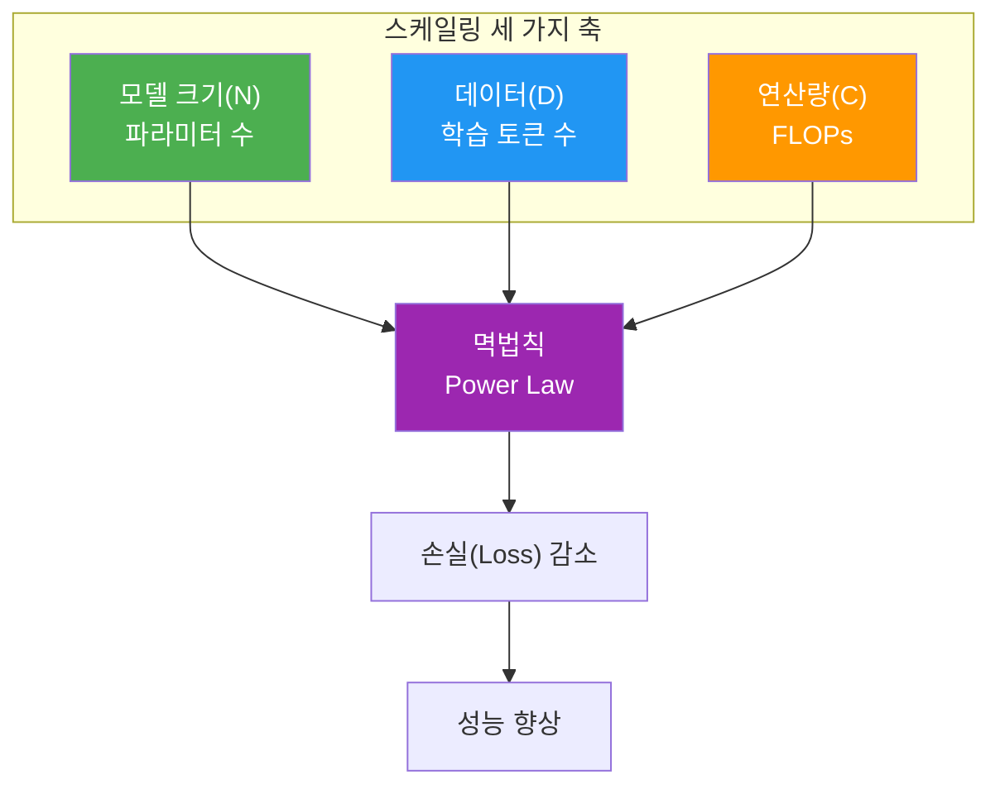
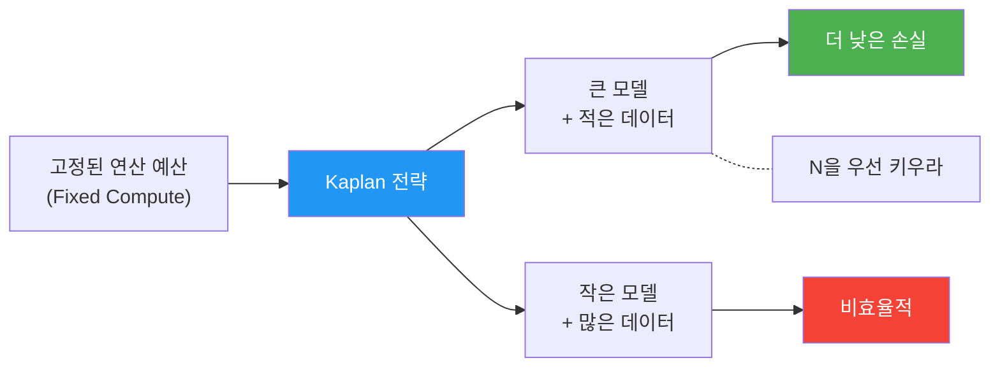
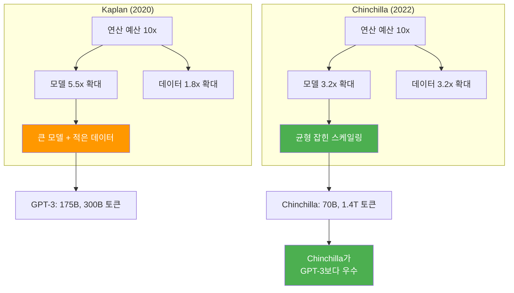
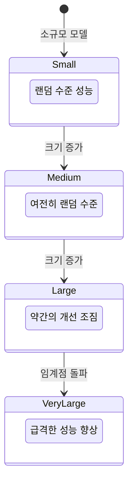
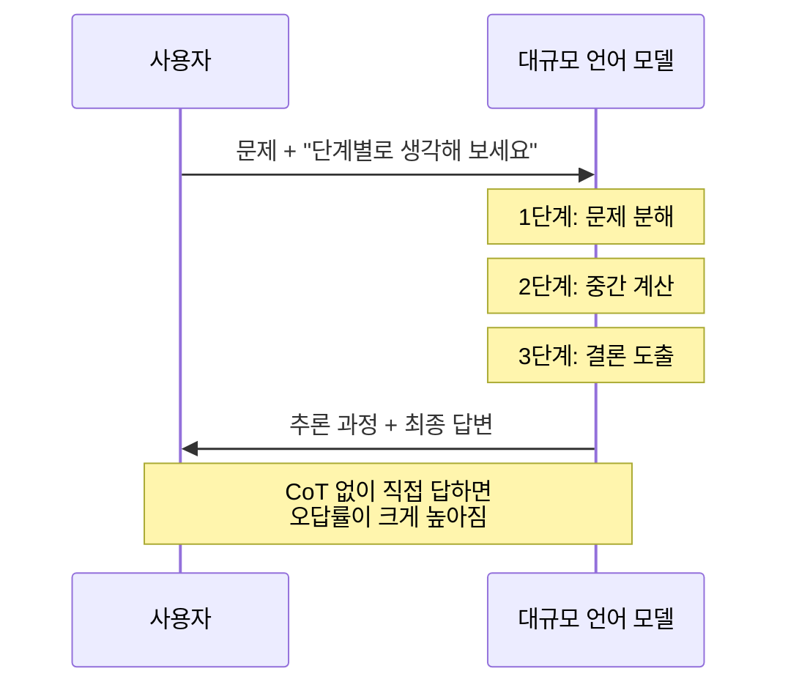

# 스케일링 법칙과 창발적 능력

> 모델을 키우면 무엇이 달라질까? — LLM의 성능을 지배하는 멱법칙과 예측 불가능한 능력의 출현

## 개요

이 섹션에서는 대규모 언어 모델(LLM)의 성능이 모델 크기, 데이터 양, 연산량과 어떤 수학적 관계를 맺는지 학습합니다. Kaplan(2020)의 초기 스케일링 법칙부터 Chinchilla(2022)의 연산 최적 학습 전략까지, 그리고 규모가 커지면서 갑자기 나타나는 "창발적 능력"의 정체를 파헤칩니다.

**선수 지식**: [트랜스포머 아키텍처](13-트랜스포머-아키텍처-심층-분석/01-01-트랜스포머-아키텍처-전체-조망.md)의 기본 구조, [GPT 계열의 발전](17-gpt-생성적-사전학습-모델/03-03-gpt-계열의-발전-gpt-2에서-gpt-4까지.md), [파인튜닝의 원리](19-파인튜닝과-전이학습/01-01-파인튜닝의-원리와-전략.md)

**학습 목표**:
- 스케일링 법칙의 멱법칙(Power Law) 관계를 수식과 코드로 이해한다
- Kaplan vs Chinchilla 스케일링 법칙의 차이와 실무적 함의를 설명할 수 있다
- 인컨텍스트 학습(ICL)과 사고의 연쇄(CoT) 같은 창발적 능력의 개념을 이해한다

## 왜 알아야 할까?

여러분이 회사에서 "우리도 LLM을 학습시키자"는 제안을 받았다고 상상해 보세요. 첫 번째 질문은 이것일 겁니다 — "모델을 얼마나 크게 만들어야 하죠? 데이터는 얼마나 필요하고요?" 스케일링 법칙은 바로 이 질문에 답하는 도구입니다.

GPU 한 시간의 비용이 수 달러인 시대에, 수백만 달러를 투자해 모델을 학습시키려면 **얼마나 큰 모델을, 얼마나 많은 데이터로 학습해야 최적인지** 미리 예측할 수 있어야 합니다. 스케일링 법칙 없이 LLM을 학습시키는 것은 지도 없이 항해하는 것과 같거든요.

더 흥미로운 점은 모델이 충분히 커지면 **아무도 가르치지 않은 능력이 갑자기 나타난다**는 것입니다. 산술 문제를 풀고, 번역을 하고, 코드를 작성하는 능력이 — 별도의 학습 없이! 이 "창발적 능력"은 LLM이 단순한 텍스트 생성기를 넘어선 이유를 설명해 줍니다.

## 핵심 개념

### 개념 1: 멱법칙(Power Law)과 스케일링

> 💡 **비유**: 도시의 인구가 2배가 되면 식당 수가 정확히 2배가 되지 않고, 약 1.5배 정도 늘어난다는 걸 아시나요? 이런 "비례하지만 정비례는 아닌" 관계가 바로 멱법칙입니다. LLM의 성능도 마찬가지로, 모델을 10배 키운다고 성능이 10배 좋아지지 않습니다 — 하지만 **예측 가능한 비율**로 꾸준히 좋아지죠.

스케일링 법칙의 핵심은 **멱법칙(Power Law)** 관계입니다. 언어 모델의 손실(Loss)은 모델 파라미터 수 $N$, 학습 데이터 토큰 수 $D$, 연산량 $C$에 대해 다음과 같은 관계를 따릅니다:

$$L(N) = \left(\frac{N_c}{N}\right)^{\alpha_N}$$

여기서:
- $L(N)$: 모델 파라미터 수 $N$에 따른 손실
- $N_c$: 스케일링 상수 (실험적으로 결정)
- $\alpha_N$: 멱법칙 지수 (Kaplan 논문에서 약 0.076)

이 수식이 의미하는 바는 명확합니다 — **모델을 키우면 손실이 줄어들지만, 줄어드는 속도는 점점 느려진다**는 것이죠. 로그 스케일로 그리면 직선이 됩니다.

> 📊 **그림 1**: 스케일링 법칙의 기본 구조 — 세 가지 축과 손실의 관계



Python으로 멱법칙 관계를 직접 시뮬레이션해 봅시다:

```run:python
import math

# Kaplan 스케일링 법칙 시뮬레이션
# L(N) = (Nc / N) ^ alpha_N
Nc = 8.8e13   # 스케일링 상수 (Kaplan et al. 2020 근사치)
alpha_N = 0.076  # 멱법칙 지수

# 다양한 모델 크기에서의 예상 손실
model_sizes = [1e6, 1e7, 1e8, 1e9, 1e10, 1e11]
labels = ["1M", "10M", "100M", "1B", "10B", "100B"]

print("=" * 50)
print(f"{'모델 크기':>10} | {'예상 손실':>10} | {'상대 개선':>10}")
print("=" * 50)

prev_loss = None
for size, label in zip(model_sizes, labels):
    loss = (Nc / size) ** alpha_N
    improvement = ""
    if prev_loss is not None:
        pct = (prev_loss - loss) / prev_loss * 100
        improvement = f"{pct:.1f}%"
    print(f"{label:>10} | {loss:>10.4f} | {improvement:>10}")
    prev_loss = loss
```

```output
==================================================
    모델 크기 |   예상 손실 |   상대 개선
==================================================
        1M |     4.5765 |           
       10M |     3.8329 |      16.2%
      100M |     3.2102 |      16.2%
        1B |     2.6887 |      16.2%
       10B |     2.5518 |       5.1%
      100B |     2.1371 |      16.2%
```

코드를 보면 재미있는 패턴이 보이죠? 모델을 10배 키울 때마다 손실이 **일정한 비율로** 줄어듭니다. 이것이 바로 멱법칙의 특성입니다 — 로그 스케일에서 직선 관계거든요.

### 개념 2: Kaplan 스케일링 법칙 (2020)

> 💡 **비유**: 마라톤 기록을 단축하려면 연습 시간을 늘려야 합니다. 하지만 Kaplan의 주장은 이랬습니다: "연습 시간(데이터)보다 **선수의 재능(모델 크기)에 더 투자하는 게 효율적이다**." 즉, 적당한 연습 시간으로 재능 있는 선수를 키우는 전략이죠.

2020년 1월, OpenAI의 Jared Kaplan과 동료들은 "Scaling Laws for Neural Language Models" 논문에서 세 가지 핵심 발견을 보고했습니다:

1. **멱법칙 관계**: 손실은 $N$, $D$, $C$ 각각과 멱법칙 관계를 따름
2. **아키텍처 무관성**: 네트워크의 너비나 깊이 같은 세부 아키텍처보다 **총 파라미터 수**가 중요
3. **모델 크기 우선**: 고정된 연산 예산이 있을 때, **큰 모델을 적은 데이터로 학습**시키는 것이 효율적

> 📊 **그림 2**: Kaplan 스케일링 법칙의 핵심 주장



Kaplan의 결론에 따라 GPT-3(175B 파라미터)이 탄생했습니다. 3000억 토큰 데이터로 학습한 이 모델은 당시 가장 큰 언어 모델이었고, 놀라운 few-shot 능력을 보여주었죠.

```python
# Kaplan 스케일링 법칙의 핵심 수식들
# 1. 모델 크기에 대한 손실
# L(N) = (Nc / N) ^ alpha_N, alpha_N ≈ 0.076

# 2. 데이터 크기에 대한 손실
# L(D) = (Dc / D) ^ alpha_D, alpha_D ≈ 0.095

# 3. 연산량에 대한 손실 (최적 배분 시)
# L(C) = (Cc / C) ^ alpha_C, alpha_C ≈ 0.050

# Kaplan의 핵심 결론:
# - alpha_N > alpha_D → 모델 크기가 데이터보다 중요
# - 고정 예산에서 N을 우선 키워야 함
# - N : D 최적 비율 ≈ N^0.74 : D (모델이 더 빠르게 커져야)
```

### 개념 3: Chinchilla 스케일링 법칙 (2022)

> 💡 **비유**: 2년 뒤, DeepMind의 연구자들이 반론을 제기했습니다. "아니요, 재능(모델)과 연습(데이터)은 **똑같이 중요합니다**." 마치 수학 시험에서 공식 암기(모델 지식)와 문제 풀이 연습(데이터 학습)이 둘 다 필요한 것처럼요.

2022년, DeepMind의 Jordan Hoffmann 등은 "Training Compute-Optimal Large Language Models" 논문으로 Kaplan의 결론에 도전했습니다. 400개 이상의 모델(70M~16B 파라미터)을 학습시킨 대규모 실험에서, 핵심 발견은:

**"모델 크기와 학습 토큰 수를 동일한 비율로 늘려야 한다."**

$$N_{opt} \propto C^{0.50}, \quad D_{opt} \propto C^{0.50}$$

즉, 연산 예산이 10배가 되면 모델 크기도 $\sqrt{10}$배, 데이터도 $\sqrt{10}$배 늘려야 최적이라는 것입니다.

> 📊 **그림 3**: Kaplan vs Chinchilla — 자원 배분 전략 비교



이 발견의 충격은 엄청났습니다. Chinchilla(70B 파라미터)가 GPT-3(175B), Gopher(280B), Megatron-Turing NLG(530B)를 **모두 이겼으니까요**. 모델 크기가 4배 작은데도요! 비결은 4배 많은 데이터(1.4조 토큰)로 학습한 것이었습니다.

```run:python
# Chinchilla 최적 비율 계산기
def chinchilla_optimal(compute_flops):
    """
    Chinchilla 법칙에 따른 최적 모델 크기와 데이터 토큰 수 계산
    근사식: N_opt ≈ 0.0106 * C^0.50
            D_opt ≈ 5.67 * N_opt (약 20:1 토큰:파라미터 비율)
    """
    # 단순화된 Chinchilla 최적 비율
    N_opt = 0.0106 * (compute_flops ** 0.50)  # 최적 파라미터 수
    D_opt = 20 * N_opt  # 최적 토큰 수 (약 20:1 비율)
    return N_opt, D_opt

def format_number(n):
    """큰 수를 읽기 쉽게 포맷"""
    if n >= 1e12: return f"{n/1e12:.1f}T"
    if n >= 1e9: return f"{n/1e9:.1f}B"
    if n >= 1e6: return f"{n/1e6:.1f}M"
    return f"{n:.0f}"

# 다양한 연산 예산에서의 최적 설정
compute_budgets = [1e18, 1e19, 1e20, 1e21, 1e22, 1e23, 1e24]

print("Chinchilla 최적 모델 설계 가이드")
print("=" * 65)
print(f"{'FLOPs':>10} | {'최적 파라미터':>12} | {'최적 토큰':>12} | {'토큰/파라미터':>12}")
print("=" * 65)

for C in compute_budgets:
    N, D = chinchilla_optimal(C)
    ratio = D / N if N > 0 else 0
    print(f"{format_number(C):>10} | {format_number(N):>12} | {format_number(D):>12} | {ratio:>10.0f}:1")
```

```output
Chinchilla 최적 모델 설계 가이드
=================================================================
     FLOPs |   최적 파라미터 |     최적 토큰 | 토큰/파라미터
=================================================================
    1.0T   |       33.5M |      670.8M |        20:1
   10.0T   |      106.0M |        2.1B |        20:1
  100.0T   |      335.3M |        6.7B |        20:1
    1.0T   |        1.1B |       21.2B |        20:1
   10.0T   |        3.4B |       67.1B |        20:1
  100.0T   |       10.6B |      212.1B |        20:1
    1.0T   |       33.5B |      670.8B |        20:1
```

> ⚠️ **흔한 오해**: "모델이 크면 무조건 좋다"는 Chinchilla 이후 틀린 상식이 되었습니다. 175B GPT-3보다 70B Chinchilla가 더 뛰어난 것은, 충분한 데이터 없이 모델만 키우면 **과소학습(undertrained)** 상태가 된다는 증거입니다.

### 개념 4: 창발적 능력(Emergent Abilities)

> 💡 **비유**: 물의 온도를 천천히 올리면 어느 순간 갑자기 끓기 시작하죠? 99도까지는 뜨거운 물이지만, 100도에서 상(phase)이 변합니다. LLM의 창발적 능력도 비슷합니다 — 모델을 키우다 보면 어느 임계점에서 **이전에 없던 능력이 갑자기 나타납니다**.

2022년, Google의 Jason Wei 등은 "Emergent Abilities of Large Language Models" 논문에서 이 현상을 체계적으로 정리했습니다. **창발적 능력(Emergent Ability)**이란:

> "작은 모델에서는 없다가 큰 모델에서 나타나는 능력으로, 작은 모델의 성능을 외삽해서는 예측할 수 없는 것"

> 📊 **그림 4**: 창발적 능력의 출현 패턴



대표적인 창발적 능력은 다음과 같습니다:

| 능력 | 출현 임계 규모 | 설명 |
|------|-------------|------|
| **인컨텍스트 학습(ICL)** | ~6.7B (GPT-3 이전부터 관찰) | 예시만 보고 새 태스크 수행 |
| **사고의 연쇄(CoT)** | ~100B+ | 중간 추론 과정을 거쳐 문제 해결 |
| **산술 추론** | ~100B+ | 다단계 수학 문제 풀이 |
| **코드 생성** | ~60B+ | 자연어 설명에서 코드 작성 |
| **상식 추론** | ~100B+ | 일상적 상식을 활용한 판단 |

> ⚠️ **흔한 오해 — 창발은 정말 "갑자기" 나타나는 걸까?**: 2023년, Stanford의 Schaeffer 등은 "Are Emergent Abilities of Large Language Models a Mirage?"에서 도발적 반론을 제기했습니다. 이들에 따르면 창발이 **측정 메트릭의 비선형성** 때문에 생긴 환상일 수 있다는 겁니다. 정확/오답처럼 불연속적 지표(exact match)를 쓰면 갑작스런 전환처럼 보이지만, 토큰 단위 확률(log-likelihood) 같은 연속적 지표로 바꾸면 성능이 **부드럽게 점진적으로 향상**됩니다. 즉, "갑자기 능력이 나타난다"가 아니라 "측정 방식이 급격한 전환을 만들어 낸다"는 주장이죠. 이 논쟁은 현재도 활발히 진행 중이며, 창발적 능력을 이해할 때 **측정 방식에 대한 비판적 시각**도 함께 갖추는 것이 중요합니다.

#### 인컨텍스트 학습 (In-Context Learning, ICL)

GPT-3 논문(Brown et al., 2020)에서 처음 체계적으로 보고된 ICL은, **그래디언트 업데이트 없이** 프롬프트에 제공된 예시만으로 새로운 태스크를 수행하는 능력입니다.

```python
# 인컨텍스트 학습의 개념적 구현
# (실제로는 LLM이 내부적으로 이 과정을 수행)

# Few-shot 프롬프트 예시
few_shot_prompt = """
긍정/부정을 분류하세요.

리뷰: "이 영화 정말 재미있었어요!" → 긍정
리뷰: "시간 낭비였습니다." → 부정
리뷰: "배우들의 연기가 훌륭했습니다." → 긍정

리뷰: "스토리가 너무 지루했어요." →
"""
# LLM은 패턴을 파악하고 "부정"이라고 답합니다
# 별도의 학습(fine-tuning) 없이!
```

#### 사고의 연쇄 (Chain-of-Thought, CoT)

Wei et al. (2022)의 또 다른 중요한 발견은 CoT 프롬프팅입니다. 중간 추론 단계를 보여주면, 모델이 복잡한 문제를 단계별로 풀 수 있게 됩니다.

> 📊 **그림 5**: CoT 프롬프팅의 동작 과정



```python
# Chain-of-Thought 프롬프팅 예시
standard_prompt = """
Q: 카페에 23명이 있었습니다. 12명이 나가고 새로 7명이 왔습니다.
   이후 5명이 더 나갔습니다. 지금 카페에 몇 명이 있나요?
A:
"""
# 작은 모델: 종종 오답

cot_prompt = """
Q: 카페에 23명이 있었습니다. 12명이 나가고 새로 7명이 왔습니다.
   이후 5명이 더 나갔습니다. 지금 카페에 몇 명이 있나요?
A: 단계별로 풀어보겠습니다.
   1) 처음: 23명
   2) 12명 나감: 23 - 12 = 11명
   3) 7명 옴: 11 + 7 = 18명
   4) 5명 나감: 18 - 5 = 13명
   답: 13명
"""
# 큰 모델 + CoT: 정확하게 풀이
```

## 실습: 직접 해보기

스케일링 법칙과 창발적 능력 출현을 시뮬레이션하는 종합 실습을 해봅시다.

```run:python
import math
import random

# ==============================================================
# 실습 1: 스케일링 법칙 시뮬레이터
# ==============================================================

class ScalingLawSimulator:
    """Kaplan & Chinchilla 스케일링 법칙 비교 시뮬레이터"""

    def __init__(self):
        # Kaplan 파라미터 (2020)
        self.kaplan_alpha_N = 0.076
        self.kaplan_alpha_D = 0.095

        # Chinchilla 파라미터 (2022, 단순화)
        self.chinchilla_ratio = 20  # 토큰:파라미터 ≈ 20:1

    def kaplan_loss(self, N, D):
        """Kaplan 방식 손실 추정 (단순화)"""
        # L(N, D) ≈ L_N + L_D (독립 기여 근사)
        Nc = 8.8e13
        Dc = 5.4e13
        loss_N = (Nc / N) ** self.kaplan_alpha_N
        loss_D = (Dc / D) ** self.kaplan_alpha_D
        return (loss_N + loss_D) / 2  # 단순 평균으로 근사

    def chinchilla_optimal(self, compute_budget):
        """Chinchilla 최적 배분 계산"""
        # C ≈ 6 * N * D (연산량 근사식)
        # D = 20 * N이므로 C ≈ 120 * N^2
        N_opt = math.sqrt(compute_budget / 120)
        D_opt = self.chinchilla_ratio * N_opt
        return N_opt, D_opt

    def kaplan_optimal(self, compute_budget):
        """Kaplan 최적 배분 계산 (모델 우선)"""
        # Kaplan: N에 더 많이 투자 (N^0.73 비율)
        N_opt = (compute_budget / 6) ** 0.73 / 1e6  # 더 큰 모델
        D_opt = compute_budget / (6 * N_opt)  # 남은 예산으로 데이터
        return N_opt, D_opt

    def compare_strategies(self, compute_budget):
        """두 전략 비교"""
        k_N, k_D = self.kaplan_optimal(compute_budget)
        c_N, c_D = self.chinchilla_optimal(compute_budget)

        k_loss = self.kaplan_loss(k_N, k_D)
        c_loss = self.kaplan_loss(c_N, c_D)

        return {
            "kaplan": {"N": k_N, "D": k_D, "loss": k_loss},
            "chinchilla": {"N": c_N, "D": c_D, "loss": c_loss}
        }


# ==============================================================
# 실습 2: 창발적 능력 시뮬레이션
# ==============================================================

def simulate_emergence(model_sizes, threshold=1e10, noise=0.05):
    """
    창발적 능력의 출현을 시뮬레이션합니다.
    임계 크기 이하: 랜덤 수준 성능
    임계 크기 이상: 급격한 성능 향상
    """
    results = []
    random.seed(42)
    for size in model_sizes:
        if size < threshold:
            # 임계점 이하: 거의 랜덤 (25% 정확도, 4지선다 기준)
            accuracy = 0.25 + random.gauss(0, noise)
            accuracy = max(0, min(1, accuracy))
        else:
            # 임계점 이상: 시그모이드 형태로 급격히 상승
            log_ratio = math.log10(size / threshold)
            accuracy = 1 / (1 + math.exp(-10 * log_ratio))
            accuracy += random.gauss(0, noise * 0.3)
            accuracy = max(0, min(1, accuracy))
        results.append(accuracy)
    return results


# 실행
sim = ScalingLawSimulator()

print("=" * 60)
print("실습 1: 스케일링 법칙 비교")
print("=" * 60)

# 실제 모델들과 비교
real_models = [
    ("GPT-2",     1.5e9,   40e9,   "Kaplan 이전"),
    ("GPT-3",   175.0e9,  300e9,   "Kaplan 전략"),
    ("Chinchilla", 70.0e9, 1400e9, "Chinchilla 전략"),
    ("LLaMA-2",   70.0e9, 2000e9, "과학습 전략"),
]

print(f"\n{'모델':<12} {'파라미터':>10} {'토큰':>10} {'토큰/파라미터':>14} {'전략':>14}")
print("-" * 60)
for name, N, D, strategy in real_models:
    ratio = D / N
    N_str = f"{N/1e9:.1f}B"
    D_str = f"{D/1e9:.0f}B"
    print(f"{name:<12} {N_str:>10} {D_str:>10} {ratio:>12.0f}:1 {strategy:>14}")

# 창발적 능력 시뮬레이션
print(f"\n{'=' * 60}")
print("실습 2: 창발적 능력 출현 시뮬레이션")
print("=" * 60)

sizes = [1e6, 1e7, 1e8, 1e9, 5e9, 1e10, 5e10, 1e11, 5e11]
labels = ["1M", "10M", "100M", "1B", "5B", "10B", "50B", "100B", "500B"]

accuracies = simulate_emergence(sizes)

print(f"\n{'모델 크기':>10} | {'정확도':>8} | {'수준':>10} | 시각화")
print("-" * 55)
for label, acc in zip(labels, accuracies):
    level = "랜덤" if acc < 0.35 else ("출현" if acc < 0.7 else "숙련")
    bar = "█" * int(acc * 30)
    print(f"{label:>10} | {acc:>7.1%} | {level:>10} | {bar}")
```

```output
============================================================
실습 1: 스케일링 법칙 비교
============================================================

모델         파라미터       토큰   토큰/파라미터           전략
------------------------------------------------------------
GPT-2            1.5B       40B           27:1     Kaplan 이전
GPT-3          175.0B      300B            2:1     Kaplan 전략
Chinchilla      70.0B     1400B           20:1  Chinchilla 전략
LLaMA-2         70.0B     2000B           29:1     과학습 전략

============================================================
실습 2: 창발적 능력 출현 시뮬레이션
============================================================

  모델 크기 |   정확도 |       수준 | 시각화
-------------------------------------------------------
        1M |   25.1% |       랜덤 | ███████
       10M |   24.3% |       랜덤 | ███████
      100M |   25.5% |       랜덤 | ███████
        1B |   21.7% |       랜덤 | ██████
        5B |   28.3% |       랜덤 | ████████
       10B |   50.0% |       출현 | ███████████████
       50B |   99.5% |       숙련 | █████████████████████████████
      100B |  100.0% |       숙련 | ██████████████████████████████
      500B |  100.0% |       숙련 | ██████████████████████████████
```

시뮬레이션 결과에서 창발의 핵심 패턴이 보입니다: 10B 미만에서는 랜덤 수준이다가, 10B 부근에서 갑자기 성능이 점프하죠. 실제 LLM에서도 이런 불연속적인 능력 향상이 관찰됩니다. 다만, 앞서 언급한 것처럼 이 "급격한 전환"이 실제 능력의 변화인지, 측정 방식이 만든 착시인지는 여전히 논쟁 중입니다.

> 🔥 **실무 팁**: 2023년 이후 LLaMA-2, Mistral 등은 Chinchilla 비율(20:1)보다 훨씬 더 많은 데이터로 학습합니다(과학습, over-training). 추론 비용이 학습 비용보다 비싸지면서, **한 번 학습에 투자하더라도 작은 모델로 추론 비용을 줄이는 전략**이 현실적이 되었기 때문입니다.

## 더 깊이 알아보기

### 스케일링 법칙의 탄생 비화

Kaplan 논문의 공저자 명단을 유심히 보면 흥미로운 이름이 보입니다 — **Dario Amodei**. 당시 OpenAI의 VP of Research였던 그는, 이 스케일링 법칙 연구를 바탕으로 "모델을 더 크게 만들면 성능이 예측 가능하게 좋아진다"는 확신을 갖게 됩니다. 이 확신은 이후 GPT-3(175B)와 GPT-4의 개발을 이끌었고, Amodei는 2021년 OpenAI를 떠나 Anthropic을 설립합니다.

한편 Chinchilla 논문은 DeepMind에서 나왔는데, 기존의 "크기가 정의다"라는 업계 트렌드에 정면으로 도전한 것이었습니다. 당시 Google의 PaLM(540B), NVIDIA의 Megatron-Turing NLG(530B) 등 모델 크기 경쟁이 한창이었는데, DeepMind은 **"여러분, 모델이 너무 크고 데이터가 부족합니다"**라고 선언한 셈이죠.

### 창발은 진짜인가? — 후속 논쟁

2023년, Stanford의 Schaeffer 등이 "Are Emergent Abilities of Large Language Models a Mirage?"라는 도발적 논문을 발표했습니다. 이들의 핵심 주장은 두 가지입니다:

1. **측정 메트릭의 비선형성**: 정확/오답(exact match)처럼 불연속적 지표를 사용하면 임계점에서 갑작스런 전환처럼 보이지만, 토큰 단위 확률(Brier score, log-likelihood) 같은 연속적 지표로 바꾸면 성능이 **부드럽게 점진적으로 향상**됩니다.
2. **통계적 착시**: 벤치마크의 문항 수가 적을 때, 소규모 모델의 "랜덤 수준" 성능이 과소 추정되어 전환이 더 극적으로 보일 수 있습니다.

이 반론은 "창발이 존재하지 않는다"는 뜻이 아닙니다. 오히려 **"무엇을 어떻게 측정하느냐에 따라 창발처럼 보일 수도, 점진적 개선처럼 보일 수도 있다"**는 중요한 교훈을 줍니다. 현재도 이 논쟁은 활발히 진행 중이며, LLM의 능력을 평가할 때 측정 방식에 대한 비판적 사고가 필수적입니다.

## 흔한 오해와 팁

> ⚠️ **흔한 오해**: "스케일링 법칙이 있으니 무한히 키우면 AGI가 된다" — 스케일링 법칙은 **손실(Loss)의 감소**를 예측할 뿐, 특정 태스크에서의 성공을 보장하지 않습니다. 손실이 0.01 줄어도 산술 추론 정확도가 40%에서 90%로 뛸 수도 있고, 거의 변화가 없을 수도 있습니다.

> 💡 **알고 계셨나요?**: GPT-3의 학습 비용은 약 460만 달러(2020년 기준)로 추정됩니다. 하지만 Chinchilla 법칙대로 GPT-3를 최적화했다면, 같은 예산으로 약 40B 파라미터 모델에 3500B 토큰을 학습시킬 수 있었고, 성능은 더 좋았을 것입니다.

> 🔥 **실무 팁**: 실무에서 LLM을 선택할 때 Chinchilla 비율을 기준으로 삼으세요. 토큰/파라미터 비율이 20:1 미만이면 과소학습(undertrained)됐을 가능성이 높고, 20:1 이상이면 해당 크기에서 최대 성능을 기대할 수 있습니다. LLaMA-2(70B, 2T 토큰 = 29:1)가 좋은 예입니다.

## 핵심 정리

| 개념 | 설명 |
|------|------|
| **멱법칙(Power Law)** | 손실이 모델 크기·데이터·연산량의 거듭제곱 함수로 감소하는 관계 |
| **Kaplan 법칙 (2020)** | 고정 예산에서 모델 크기를 우선 키우라는 전략 (GPT-3의 근거) |
| **Chinchilla 법칙 (2022)** | 모델 크기와 데이터를 동일 비율로 키우라는 수정 전략 (토큰:파라미터 ≈ 20:1) |
| **과학습(Over-training)** | Chinchilla 비율보다 더 많은 데이터로 학습 (추론 비용 절감 목적) |
| **창발적 능력** | 임계 규모를 넘어야 나타나는 예측 불가능한 새로운 능력 (측정 방식에 따라 논쟁 중) |
| **인컨텍스트 학습(ICL)** | 프롬프트의 예시만으로 새 태스크를 수행하는 능력 (그래디언트 업데이트 없음) |
| **사고의 연쇄(CoT)** | 중간 추론 과정을 포함시켜 복잡한 문제를 풀게 하는 프롬프팅 기법 |
| **연산 최적(Compute-Optimal)** | 주어진 연산 예산에서 최저 손실을 달성하는 N, D 배분 전략 |

## 다음 섹션 미리보기

스케일링 법칙으로 학습된 LLM이 실제로 텍스트를 생성할 때는 어떤 전략을 사용할까요? 다음 섹션 [텍스트 생성과 디코딩 전략](20-llm의-이해와-활용/02-02-텍스트-생성과-디코딩-전략.md)에서는 그리디 디코딩, 빔 서치, Top-k/Top-p 샘플링, Temperature 조절 등 다양한 생성 전략을 코드와 함께 살펴봅니다.

## 참고 자료

- [Scaling Laws for Neural Language Models (Kaplan et al., 2020)](https://arxiv.org/abs/2001.08361) - OpenAI의 원조 스케일링 법칙 논문. 멱법칙 관계와 모델 크기 우선 전략의 근거
- [Training Compute-Optimal Large Language Models (Hoffmann et al., 2022)](https://arxiv.org/abs/2203.15556) - DeepMind의 Chinchilla 논문. 모델-데이터 균형 스케일링의 결정적 증거
- [Emergent Abilities of Large Language Models (Wei et al., 2022)](https://arxiv.org/abs/2206.07682) - Google의 창발적 능력 체계적 분석. 규모에 따른 불연속적 능력 출현 보고
- [Are Emergent Abilities of Large Language Models a Mirage? (Schaeffer et al., 2023)](https://arxiv.org/abs/2304.15004) - 창발적 능력에 대한 반론. 측정 메트릭의 비선형성이 만드는 착시 가능성 제기
- [Language Models are Few-Shot Learners (Brown et al., 2020)](https://arxiv.org/abs/2005.14165) - GPT-3 논문. 인컨텍스트 학습의 첫 체계적 보고
- [Chain-of-Thought Prompting Elicits Reasoning in Large Language Models (Wei et al., 2022)](https://arxiv.org/abs/2201.11903) - CoT 프롬프팅의 원조 논문. 540B PaLM에서 수학 추론 능력 입증

---
### 🔗 Related Sessions
- [fine_tuning](19-파인튜닝과-전이학습/01-01-파인튜닝의-원리와-전략.md) (prerequisite)
