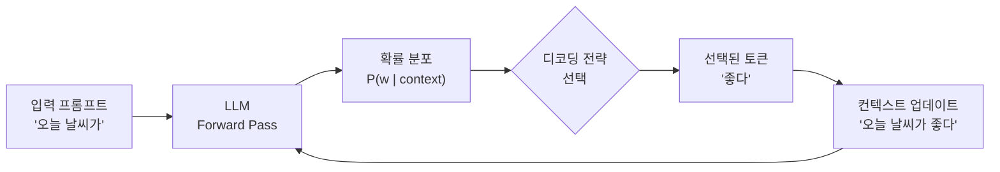
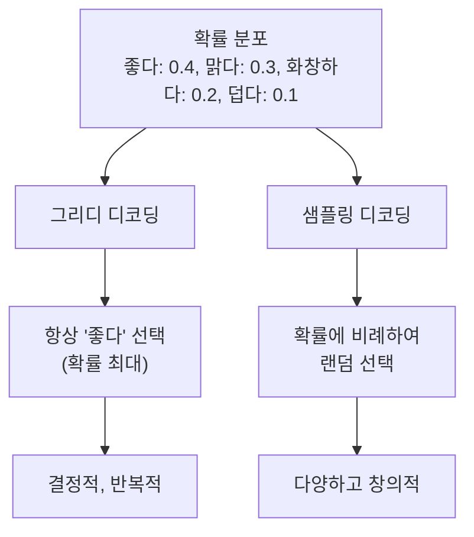
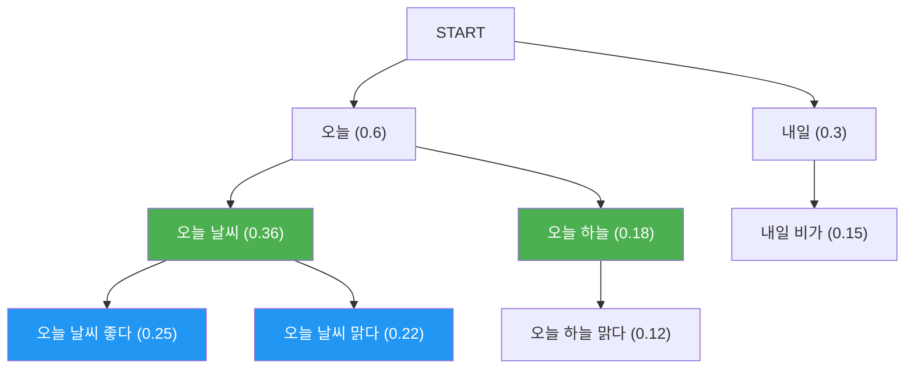
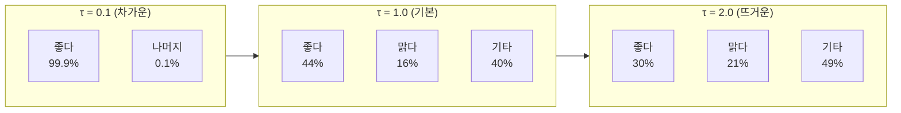
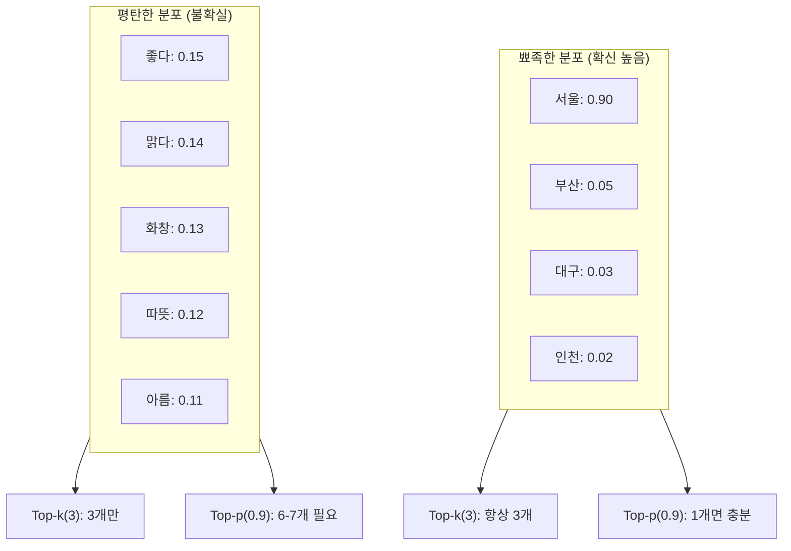

# 텍스트 생성과 디코딩 전략

> LLM이 텍스트를 한 토큰씩 만들어내는 원리와, 다양한 디코딩 전략으로 생성 품질을 제어하는 방법을 배웁니다.

## 개요

이 섹션에서는 대규모 언어 모델(LLM)이 텍스트를 생성하는 핵심 메커니즘인 **자기회귀 디코딩(Autoregressive Decoding)**을 이해하고, 생성 품질과 다양성을 제어하는 다양한 전략을 학습합니다.

**선수 지식**: [스케일링 법칙과 창발적 능력](20-llm의-이해와-활용/01-01-스케일링-법칙과-창발적-능력.md)에서 배운 LLM의 기본 개념, [자기회귀 언어 모델링](17-gpt-생성적-사전학습-모델/01-01-자기회귀-언어-모델링.md)에서 배운 GPT의 생성 원리, [PyTorch 텐서와 연산](07-pytorch-기초와-신경망-입문/01-01-pytorch-텐서와-연산.md)의 기초

**학습 목표**:
- 자기회귀 디코딩의 원리와 확률 분포 기반 토큰 선택 과정을 이해한다
- 그리디 디코딩, 빔 서치, Top-k, Top-p(Nucleus) 샘플링의 차이를 비교한다
- Temperature와 반복 페널티로 생성 결과를 제어하는 방법을 익힌다
- Hugging Face `generate()` API로 다양한 전략을 실험한다

## 왜 알아야 할까?

ChatGPT에게 같은 질문을 두 번 해보면, 매번 조금씩 다른 답변이 돌아옵니다. 왜 그럴까요? 반대로, 코드를 생성할 때는 "정확하게 하나의 정답"을 원하기도 하죠. 이 차이를 만드는 것이 바로 **디코딩 전략**입니다.

LLM은 다음 토큰의 확률 분포만 출력할 뿐, "어떤 토큰을 실제로 선택할지"는 디코딩 전략이 결정합니다. 같은 모델이라도 전략에 따라 딱딱한 기계 번역 같은 출력부터 창의적인 소설까지 완전히 다른 결과가 나올 수 있거든요. 이 섹션에서 배우는 내용은 모든 LLM 기반 애플리케이션의 출력 품질을 직접 좌우하는 핵심 지식입니다.

## 핵심 개념

### 개념 1: 자기회귀 디코딩의 원리

> 💡 **비유**: 자기회귀 디코딩은 **릴레이 소설 쓰기**와 같습니다. 앞 사람이 쓴 문장을 읽고, 다음 한 단어를 이어 쓰고, 다시 전체를 읽고, 또 한 단어를 쓰는 과정을 반복하는 거죠. LLM도 정확히 이렇게 작동합니다 — 지금까지 생성된 모든 토큰을 보고, 다음 **하나의 토큰**만 예측합니다.

자기회귀 모델은 시퀀스의 결합 확률을 조건부 확률의 곱으로 분해합니다:

$$P(w_1, w_2, \ldots, w_T) = \prod_{t=1}^{T} P(w_t | w_1, w_2, \ldots, w_{t-1})$$

- $w_t$: 시점 $t$에서 생성되는 토큰
- $P(w_t | w_1, \ldots, w_{t-1})$: 이전 모든 토큰이 주어졌을 때 다음 토큰의 확률

모델은 매 시점마다 전체 어휘(vocabulary)에 대한 확률 분포를 출력하는데, 이 분포에서 "어떤 토큰을 실제로 고를 것인가"가 디코딩 전략의 핵심입니다.

> 📊 **그림 1**: 자기회귀 디코딩의 단계별 흐름



이 루프는 **종료 토큰(EOS)**이 생성되거나 최대 길이에 도달할 때까지 반복됩니다. 핵심은 "C → D" 단계, 즉 확률 분포에서 토큰을 선택하는 방식이 전체 생성 품질을 결정한다는 점이에요.

### 개념 2: 그리디 디코딩(Greedy Decoding)

> 💡 **비유**: 그리디 디코딩은 **시험에서 가장 자신 있는 답만 고르는 학생**과 같습니다. 매번 확률이 가장 높은 토큰 하나만 선택하죠. 빠르고 확실하지만, 때로는 "안전한 답"만 반복하는 함정에 빠집니다.

그리디 디코딩은 가장 단순한 전략으로, 매 시점에서 확률이 최대인 토큰을 선택합니다:

$$w_t = \arg\max_{w} P(w | w_1, \ldots, w_{t-1})$$

```python
import torch
import torch.nn.functional as F

# 모델이 출력한 로짓 (어휘 크기 = 5라고 가정)
logits = torch.tensor([2.0, 1.5, 0.3, -0.5, 3.1])

# 확률 분포로 변환
probs = F.softmax(logits, dim=-1)

# 그리디: 가장 높은 확률의 토큰 선택
greedy_token = torch.argmax(probs)
print(f"선택된 토큰 인덱스: {greedy_token.item()}")  # 4 (3.1이 가장 큼)
```

그리디 디코딩의 치명적 문제는 **반복(repetition)**입니다. "나는 학생이다. 나는 학생이다. 나는 학생이다..."처럼 같은 패턴이 무한 반복되는 현상이 자주 발생하거든요. 또한 매 시점에서 국소 최적(local optimum)만 추구하기 때문에, 전체 시퀀스 관점에서는 최적이 아닌 경로를 선택할 수 있습니다. 예를 들어, 지금 두 번째로 확률이 높은 토큰을 골랐더라면 이후 훨씬 자연스러운 문장이 되었을 수도 있는데, 그리디는 그런 가능성을 탐색하지 않습니다.

> 📊 **그림 2**: 그리디 vs 샘플링 기반 디코딩 비교



### 개념 3: 빔 서치(Beam Search)

> 💡 **비유**: 빔 서치는 **체스에서 여러 수를 동시에 고려하는 것**과 같습니다. 그리디가 "지금 가장 좋은 한 수"만 보는 반면, 빔 서치는 상위 N개의 후보를 동시에 추적하며 가장 좋은 전체 시퀀스를 찾습니다.

빔 서치는 매 시점에서 상위 $k$개(빔 크기)의 후보 시퀀스를 유지합니다. 각 후보를 확장하여 다음 토큰의 모든 가능성을 탐색한 뒤, 다시 상위 $k$개만 남깁니다.

> 📊 **그림 3**: 빔 서치 탐색 과정 (빔 크기 = 2)



빔 서치는 기계 번역처럼 **정확성이 중요한 태스크**에서 효과적이지만, 자유로운 텍스트 생성에서는 여전히 반복 문제가 있고 "지루한" 출력을 만드는 경향이 있습니다.

```python
# Hugging Face에서 빔 서치 사용
from transformers import AutoModelForCausalLM, AutoTokenizer

tokenizer = AutoTokenizer.from_pretrained("gpt2")
model = AutoModelForCausalLM.from_pretrained("gpt2")

inputs = tokenizer("The future of AI is", return_tensors="pt")

# 빔 서치: num_beams > 1
output = model.generate(
    **inputs,
    max_new_tokens=50,
    num_beams=5,               # 빔 크기
    no_repeat_ngram_size=2,    # 2-gram 반복 방지
    early_stopping=True
)
print(tokenizer.decode(output[0], skip_special_tokens=True))
```

### 개념 4: Temperature 스케일링

> 💡 **비유**: Temperature는 **음식의 매운맛 조절**과 같습니다. 온도가 낮으면(0에 가까우면) 가장 확률 높은 토큰에 극도로 집중하고(순한맛 = 안전한 선택), 온도가 높으면 확률 분포가 균등해져서 의외의 토큰도 자주 등장합니다(매운맛 = 모험적 선택).

Temperature $\tau$는 softmax 이전의 로짓을 스케일링합니다:

$$P(w_i) = \frac{\exp(z_i / \tau)}{\sum_j \exp(z_j / \tau)}$$

- $\tau \to 0$: 분포가 극단적으로 뾰족해짐 → 그리디와 동일
- $\tau = 1$: 원래 분포 그대로
- $\tau > 1$: 분포가 평탄해짐 → 더 다양한 생성

```run:python
import torch
import torch.nn.functional as F

logits = torch.tensor([2.0, 1.0, 0.5, 0.3, 0.1])
vocab = ["좋다", "맑다", "화창하다", "따뜻하다", "흐리다"]

for temp in [0.1, 0.5, 1.0, 2.0]:
    probs = F.softmax(logits / temp, dim=-1)
    result = ", ".join(f"{w}: {p:.3f}" for w, p in zip(vocab, probs))
    print(f"τ={temp:<3} → {result}")
```

```output
τ=0.1 → 좋다: 1.000, 맑다: 0.000, 화창하다: 0.000, 따뜻하다: 0.000, 흐리다: 0.000
τ=0.5 → 좋다: 0.876, 맑다: 0.088, 화창하다: 0.024, 따뜻하다: 0.009, 흐리다: 0.003
τ=1.0 → 좋다: 0.443, 맑다: 0.163, 화창하다: 0.099, 따뜻하다: 0.081, 흐리다: 0.066
τ=2.0 → 좋다: 0.297, 맑다: 0.213, 화창하다: 0.177, 따뜻하다: 0.163, 흐리다: 0.150
```

> 📊 **그림 4**: Temperature에 따른 확률 분포 변화



### 개념 5: Top-k 샘플링

> 💡 **비유**: Top-k 샘플링은 **뷔페에서 상위 k개 메뉴만 골라놓고 그 중에서 고르는 것**입니다. 전체 메뉴(어휘)가 5만 개라도, 상위 50개만 후보로 남기면 말도 안 되는 단어가 선택될 위험이 크게 줄어들죠.

Top-k 샘플링은 확률 상위 $k$개 토큰만 남기고 나머지는 확률을 0으로 설정한 뒤, 남은 토큰들 사이에서 확률에 비례하여 샘플링합니다. 2018년 Fan 등이 "Hierarchical Neural Story Generation" 논문에서 제안했습니다.

```python
import torch
import torch.nn.functional as F

def top_k_sampling(logits, k=10, temperature=1.0):
    """Top-k 샘플링 구현"""
    # Temperature 적용
    scaled_logits = logits / temperature

    # 상위 k개만 남기기
    top_k_values, top_k_indices = torch.topk(scaled_logits, k)

    # 상위 k개로 확률 분포 생성
    probs = F.softmax(top_k_values, dim=-1)

    # 확률에 비례하여 샘플링
    sampled_idx = torch.multinomial(probs, num_samples=1)

    # 원래 어휘 인덱스로 매핑
    return top_k_indices[sampled_idx]
```

Top-k의 문제점은 $k$가 **고정값**이라는 점입니다. 확률이 한 토큰에 집중된 경우(예: "서울의 수도는 _")에도 50개를 후보로 남기면 불필요하게 노이즈가 들어가고, 반대로 분포가 균등한 경우에는 50개로도 부족할 수 있거든요.

### 개념 6: Top-p(Nucleus) 샘플링

> 💡 **비유**: Top-p 샘플링은 **예산제 뷔페**와 같습니다. Top-k가 "딱 k개 메뉴"로 제한하는 반면, Top-p는 "누적 확률이 p%에 도달할 때까지" 메뉴를 추가합니다. 확률이 집중되면 후보가 적고, 분포가 평탄하면 후보가 많아져서 **상황에 맞게 자동 조절**되는 거죠.

Nucleus 샘플링은 2019년 Holtzman 등이 "The Curious Case of Neural Text Degeneration"에서 제안했습니다. 토큰을 확률 내림차순으로 정렬한 뒤, 누적 확률이 $p$를 초과하는 최소 집합(nucleus)에서 샘플링합니다.

> 📊 **그림 5**: Top-k vs Top-p 비교 — 분포 형태에 따른 차이



```run:python
import torch
import torch.nn.functional as F

def top_p_sampling(logits, p=0.9, temperature=1.0):
    """Top-p (Nucleus) 샘플링 구현"""
    # Temperature 적용
    scaled_logits = logits / temperature
    probs = F.softmax(scaled_logits, dim=-1)

    # 확률 내림차순 정렬
    sorted_probs, sorted_indices = torch.sort(probs, descending=True)

    # 누적 확률 계산
    cumulative_probs = torch.cumsum(sorted_probs, dim=-1)

    # 누적 확률이 p를 초과하는 지점 이후를 마스킹
    mask = cumulative_probs - sorted_probs > p
    sorted_probs[mask] = 0.0

    # 재정규화
    sorted_probs /= sorted_probs.sum()

    # 샘플링
    sampled_idx = torch.multinomial(sorted_probs, num_samples=1)
    return sorted_indices[sampled_idx]

# 두 가지 분포에서 비교
peaked = torch.tensor([5.0, 1.0, 0.5, 0.1, 0.05])  # 뾰족한 분포
flat = torch.tensor([1.0, 0.95, 0.9, 0.85, 0.8])    # 평탄한 분포

for name, logits in [("뾰족한 분포", peaked), ("평탄한 분포", flat)]:
    probs = F.softmax(logits, dim=-1)
    cumsum = torch.cumsum(torch.sort(probs, descending=True).values, dim=-1)
    nucleus_size = (cumsum <= 0.9).sum().item() + 1
    print(f"{name}: nucleus 크기 = {nucleus_size}개")
```

```output
뾰족한 분포: nucleus 크기 = 1개
평탄한 분포: nucleus 크기 = 4개
```

### 개념 7: 반복 페널티(Repetition Penalty)

반복 문제는 디코딩 전략과 무관하게 발생할 수 있습니다. 반복 페널티는 이미 생성된 토큰의 로짓에 페널티를 부여하여 반복을 억제합니다.

$$
\hat{z}_i = \begin{cases}
z_i / \theta & \text{if } z_i > 0 \text{ and } w_i \in \text{generated} \\
z_i \times \theta & \text{if } z_i < 0 \text{ and } w_i \in \text{generated} \\
z_i & \text{otherwise}
\end{cases}
$$

여기서 $\theta > 1$이 반복 페널티 강도입니다. 양수 로짓은 나누어 줄이고, 음수 로짓은 곱하여 더 줄이는 방식으로, 이미 나온 토큰의 선택 확률을 낮춥니다.

Hugging Face에서는 `repetition_penalty`와 `no_repeat_ngram_size` 두 가지 방법을 제공합니다:

```python
# 반복 페널티 사용
output = model.generate(
    **inputs,
    max_new_tokens=100,
    do_sample=True,
    temperature=0.8,
    top_p=0.9,
    repetition_penalty=1.2,      # 1.0 = 페널티 없음, 1.2 = 적당한 페널티
    no_repeat_ngram_size=3,      # 3-gram 반복 완전 차단
)
```

## 실습: 직접 해보기

다양한 디코딩 전략을 Hugging Face `generate()` API로 실험하는 완전한 코드입니다.

```python
import torch
from transformers import AutoModelForCausalLM, AutoTokenizer, GenerationConfig

# ── 1. 모델 로드 ──
model_name = "gpt2"
tokenizer = AutoTokenizer.from_pretrained(model_name)
model = AutoModelForCausalLM.from_pretrained(model_name)

# 패딩 토큰 설정 (GPT-2는 기본 패딩 토큰이 없음)
tokenizer.pad_token = tokenizer.eos_token
model.config.pad_token_id = tokenizer.eos_token_id

prompt = "The most important thing about artificial intelligence is"
inputs = tokenizer(prompt, return_tensors="pt")

# ── 2. 다양한 디코딩 전략 비교 ──
strategies = {
    "그리디": GenerationConfig(
        max_new_tokens=60,
        do_sample=False,          # 결정적 선택
    ),
    "빔 서치 (k=5)": GenerationConfig(
        max_new_tokens=60,
        num_beams=5,
        no_repeat_ngram_size=2,
        early_stopping=True,
    ),
    "Top-k (k=50)": GenerationConfig(
        max_new_tokens=60,
        do_sample=True,
        top_k=50,
        temperature=0.8,
    ),
    "Top-p (p=0.92)": GenerationConfig(
        max_new_tokens=60,
        do_sample=True,
        top_p=0.92,
        temperature=0.8,
    ),
    "Top-k + Top-p 조합": GenerationConfig(
        max_new_tokens=60,
        do_sample=True,
        top_k=50,
        top_p=0.92,
        temperature=0.7,
        repetition_penalty=1.2,
    ),
}

# ── 3. 각 전략으로 생성 ──
for name, config in strategies.items():
    config.pad_token_id = tokenizer.eos_token_id
    output = model.generate(**inputs, generation_config=config)
    text = tokenizer.decode(output[0], skip_special_tokens=True)
    print(f"\n{'='*60}")
    print(f"[{name}]")
    print(f"{'='*60}")
    print(text)
```

```run:python
# Temperature 효과를 직관적으로 확인하는 간단 실험
import torch
import torch.nn.functional as F

# 가상의 로짓 (5개 토큰 어휘)
logits = torch.tensor([3.0, 2.0, 1.0, 0.5, 0.1])
tokens = ["intelligence", "learning", "systems", "research", "technology"]

print("Temperature에 따른 확률 분포 변화:")
print("-" * 55)
for t in [0.3, 0.7, 1.0, 1.5]:
    probs = F.softmax(logits / t, dim=-1)
    dist = "  ".join(f"{tok[:6]:>6}:{p:.2f}" for tok, p in zip(tokens, probs))
    print(f"  τ={t:.1f}  {dist}")
```

```output
Temperature에 따른 확률 분포 변화:
-------------------------------------------------------
  τ=0.3  intell:0.96  learn:0.03  syste:0.00  resea:0.00  techn:0.00
  τ=0.7  intell:0.63  learn:0.23  syste:0.08  resea:0.05  techn:0.03
  τ=1.0  intell:0.44  learn:0.24  syste:0.13  resea:0.09  techn:0.07
  τ=1.5  intell:0.32  learn:0.23  syste:0.16  resea:0.13  techn:0.11
```

## 더 깊이 알아보기

### "Neural Text Degeneration" — 왜 확률 높은 텍스트가 오히려 이상할까?

2019년, Ari Holtzman 등은 흥미로운 현상을 발견했습니다. 인간이 쓴 텍스트의 확률을 측정해보면, 매 시점에서 가장 확률 높은 토큰을 고르지 **않는다**는 것이었습니다. 오히려 인간의 글은 때때로 "의외의" 단어를 선택하면서 자연스러움을 만들어냈죠.

이 관찰에서 탄생한 것이 **Nucleus(Top-p) 샘플링**입니다. 논문 제목 "The Curious Case of Neural Text Degeneration"에서 "degeneration(퇴화)"은 높은 확률의 텍스트가 반복적이고 지루해지는 현상을 가리킵니다. 역설적이게도, **가장 가능성 높은 시퀀스가 가장 자연스러운 시퀀스가 아니라**는 통찰이 현대 LLM 텍스트 생성의 기반이 되었습니다.

### 빔 서치의 기원

빔 서치는 NLP에서 시작된 것이 아닙니다. 원래 1970년대 **음성 인식** 분야에서 개발된 알고리즘이에요. 음성 신호를 텍스트로 변환할 때 가능한 모든 경로를 탐색하면 계산량이 폭발하니까, "유망한 경로 k개만 추적하자"는 아이디어로 탄생했습니다. 이후 기계 번역에서 대중화되었고, 지금도 번역 모델에서는 빔 서치가 표준으로 쓰입니다.

## 흔한 오해와 팁

> ⚠️ **흔한 오해**: "Temperature를 0으로 설정하면 가장 좋은 결과가 나온다." — Temperature 0은 그리디 디코딩과 같아서, 항상 같은 출력을 생성하고 반복에 빠지기 쉽습니다. 태스크에 따라 적절한 값이 다릅니다. 코드 생성은 0.2~0.4, 창작은 0.7~1.0, 일반 대화는 0.5~0.8 정도가 적절합니다.

> 💡 **알고 계셨나요?**: Top-k와 Top-p는 **동시에 사용**할 수 있습니다. Hugging Face에서 `top_k=50, top_p=0.9`를 함께 설정하면, 먼저 Top-k로 50개로 줄인 뒤, 그 안에서 다시 Top-p로 nucleus를 추립니다. GPT-4, Claude 등 최신 LLM API들도 이 조합 방식을 기본으로 제공합니다.

> 🔥 **실무 팁**: `GenerationConfig`를 사용하면 생성 파라미터를 모델과 분리하여 관리할 수 있습니다. 같은 모델로 용도별(요약용, 창작용, 코딩용) 설정을 만들어두고 교체하는 패턴이 실무에서 매우 유용합니다.

## 핵심 정리

| 개념 | 설명 | 적합한 태스크 |
|------|------|---------------|
| 그리디 디코딩 | 매번 확률 최대 토큰 선택 | 간단한 완성, 디버깅 |
| 빔 서치 | 상위 k개 시퀀스 동시 탐색 | 번역, 요약 등 정확성 중요 태스크 |
| Temperature | 확률 분포의 뾰족함/평탄함 조절 | 모든 샘플링 전략과 조합 |
| Top-k 샘플링 | 상위 k개 토큰에서만 샘플링 | 일반적 텍스트 생성 |
| Top-p(Nucleus) | 누적 확률 p까지의 토큰에서 샘플링 | 창작, 대화 등 다양성 필요 태스크 |
| 반복 페널티 | 이미 생성된 토큰의 확률 낮춤 | 긴 텍스트 생성 시 반복 방지 |
| `GenerationConfig` | HF의 생성 파라미터 통합 관리 클래스 | 모든 HF 기반 생성 |

## 다음 섹션 미리보기

디코딩 전략이 "모델의 출력을 어떻게 제어하느냐"였다면, 다음 섹션 [프롬프트 엔지니어링 기초](20-llm의-이해와-활용/03-03-프롬프트-엔지니어링-기초.md)에서는 "모델의 입력을 어떻게 설계하느냐"를 다룹니다. Zero-shot, Few-shot, Chain-of-Thought 등 LLM에게 효과적으로 질문하는 기법을 배우게 됩니다.

## 참고 자료

- [How to generate text: using different decoding methods for language generation with Transformers](https://huggingface.co/blog/how-to-generate) - Patrick von Platen의 디코딩 전략 종합 가이드 (Hugging Face 공식 블로그)
- [Hugging Face Generation Strategies 문서](https://huggingface.co/docs/transformers/generation_strategies) - generate() API의 공식 사용법과 전략별 예제
- [The Curious Case of Neural Text Degeneration (Holtzman et al., 2019)](https://arxiv.org/abs/1904.09751) - Top-p(Nucleus) 샘플링 원논문, 텍스트 퇴화 현상 분석
- [Hierarchical Neural Story Generation (Fan et al., 2018)](https://arxiv.org/abs/1805.04833) - Top-k 샘플링을 처음 제안한 논문
- [Hugging Face GenerationConfig API Reference](https://huggingface.co/docs/transformers/main_classes/text_generation) - GenerationConfig 클래스의 전체 파라미터 레퍼런스

---
### 🔗 Related Sessions
- [transformer 아키텍처](13-트랜스포머-아키텍처-심층-분석/01-01-트랜스포머-아키텍처-전체-조망.md) (prerequisite)
- [transformer 아키텍처](13-트랜스포머-아키텍처-심층-분석/01-01-트랜스포머-아키텍처-전체-조망.md) (prerequisite)
- [scaling_laws](20-llm의-이해와-활용/01-01-스케일링-법칙과-창발적-능력.md) (prerequisite)
- [scaling_laws](20-llm의-이해와-활용/01-01-스케일링-법칙과-창발적-능력.md) (prerequisite)
- [emergent_abilities](20-llm의-이해와-활용/01-01-스케일링-법칙과-창발적-능력.md) (prerequisite)
- [emergent_abilities](20-llm의-이해와-활용/01-01-스케일링-법칙과-창발적-능력.md) (prerequisite)
