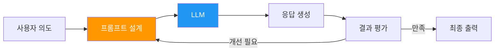
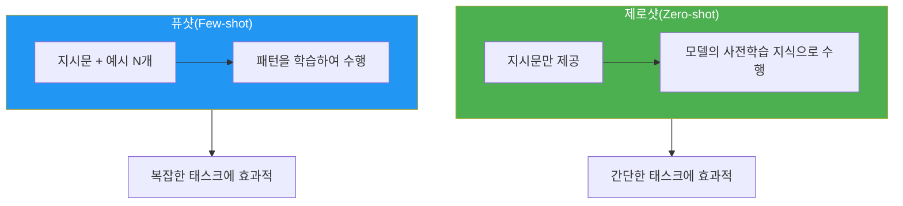
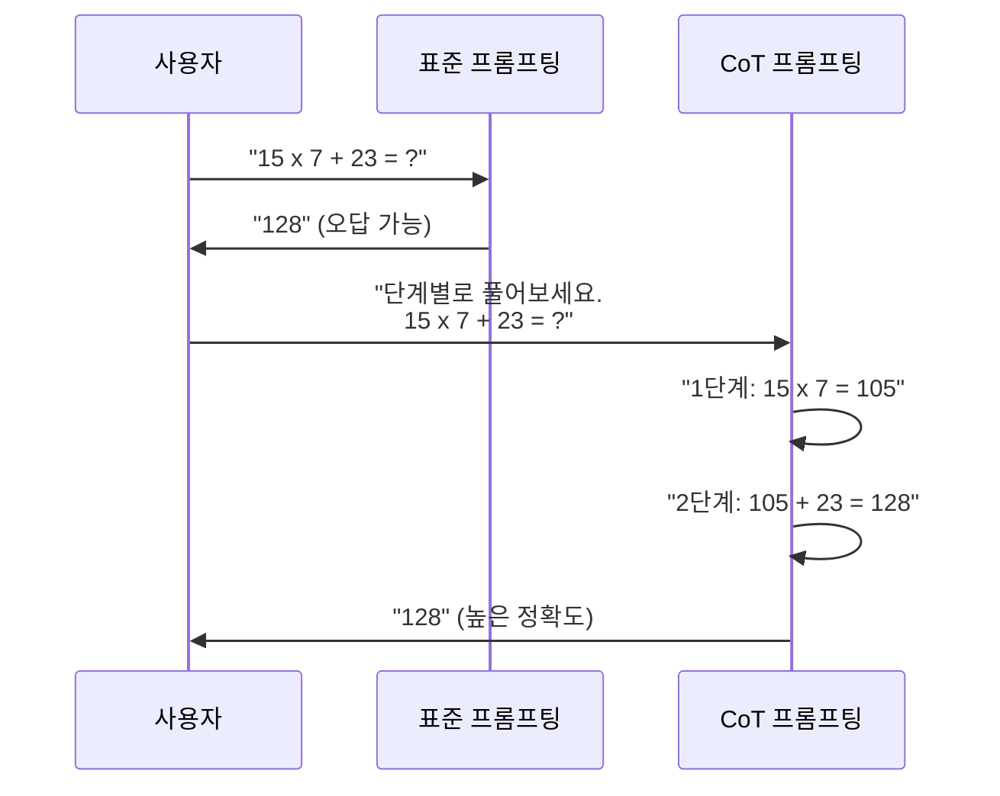
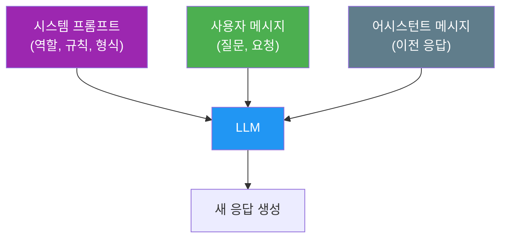
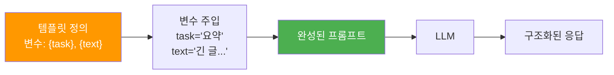

# 프롬프트 엔지니어링 기초

> LLM에게 효과적으로 질문하는 기술 — 제로샷, 퓨샷, 체인 오브 소트부터 프롬프트 템플릿 설계까지

## 개요

이 섹션에서는 대규모 언어 모델(LLM)과 효과적으로 소통하는 핵심 기술인 **프롬프트 엔지니어링**(Prompt Engineering)을 학습합니다. 앞서 [스케일링 법칙과 창발적 능력](20-llm의-이해와-활용/01-01-스케일링-법칙과-창발적-능력.md)에서 배운 인컨텍스트 학습(ICL)과 사고의 연쇄(CoT)가 실제로 어떻게 구현되는지, 그리고 [텍스트 생성과 디코딩 전략](20-llm의-이해와-활용/02-02-텍스트-생성과-디코딩-전략.md)에서 다룬 생성 파라미터와 프롬프트가 어떻게 결합되는지를 실습합니다.

**선수 지식**: [인컨텍스트 학습(ICL)과 사고의 연쇄(CoT) 개념](20-llm의-이해와-활용/01-01-스케일링-법칙과-창발적-능력.md), Hugging Face `generate()` API 사용법
**학습 목표**:
- 제로샷(Zero-shot)과 퓨샷(Few-shot) 프롬프팅의 차이를 이해하고 적절히 활용한다
- 체인 오브 소트(Chain-of-Thought) 프롬프팅으로 복잡한 추론 문제를 풀 수 있다
- 시스템 프롬프트와 프롬프트 템플릿을 설계하여 일관된 출력을 유도한다
- 프롬프트 최적화 전략을 적용하여 LLM의 응답 품질을 개선할 수 있다

## 왜 알아야 할까?

여러분이 아무리 뛰어난 LLM을 가지고 있어도, **질문을 잘못 던지면 엉뚱한 답**이 돌아옵니다. 마치 천재 셰프에게 "맛있는 거 만들어 주세요"라고 하면 기대와 전혀 다른 요리가 나올 수 있는 것처럼요. "한국인 입맛에 맞는 매콤한 파스타, 2인분, 30분 이내에"라고 구체적으로 주문해야 원하는 결과를 얻죠.

프롬프트 엔지니어링은 바로 이 **"주문서 작성법"**입니다. 2022년 ChatGPT 출시 이후, 프롬프트 엔지니어링은 단순한 팁 모음에서 **체계적인 엔지니어링 분야**로 발전했습니다. 실제로 많은 기업에서 "프롬프트 엔지니어"라는 직종을 채용하고 있으며, 프롬프트 하나 차이로 모델의 정확도가 수십 퍼센트 달라지기도 합니다.

> 📊 **그림 1**: 프롬프트 엔지니어링의 위치 — 모델과 사용자 사이의 인터페이스



특히 이번 섹션에서 배울 기법들은 모델을 재학습하지 않고도(**추가 비용 없이**) 성능을 극적으로 끌어올리는 방법이기에, 실무에서 가장 먼저 시도해볼 최적화 수단이 됩니다.

## 핵심 개념

### 개념 1: 제로샷 프롬프팅(Zero-shot Prompting)

> 💡 **비유**: 신입 사원에게 "이 보고서를 요약해 줘"라고만 말하는 것과 같습니다. 별도의 예시 없이, 모델이 사전학습에서 배운 지식만으로 작업을 수행하는 방식이에요. 똒똑한 신입이라면 꽤 잘 해내겠지만, 원하는 형식이나 스타일이 있다면 추가 가이드가 필요하겠죠?

제로샷 프롬프팅은 **예시 없이 지시만으로** 모델에게 작업을 요청하는 가장 기본적인 프롬프팅 방식입니다. LLM이 사전학습 과정에서 방대한 텍스트를 학습했기 때문에, 많은 태스크에서 예시 없이도 적절한 응답을 생성할 수 있습니다.

> 📊 **그림 2**: 제로샷 vs 퓨샷 프롬프팅 비교



```python
# 제로샷 프롬프팅 예시
from transformers import pipeline

# 감성 분석 — 예시 없이 직접 요청
classifier = pipeline("text-generation", model="gpt2")

# 제로샷 프롬프트: 지시만 포함
zero_shot_prompt = """다음 리뷰의 감성을 '긍정' 또는 '부정'으로 분류하세요.

리뷰: 이 영화는 정말 지루하고 시간 낭비였습니다.
감성:"""

# 더 나은 제로샷 프롬프트: 역할 + 구체적 지시
better_zero_shot = """당신은 감성 분석 전문가입니다.
아래 리뷰를 읽고 '긍정' 또는 '부정' 중 하나만 답하세요.

리뷰: 이 영화는 정말 지루하고 시간 낭비였습니다.
감성:"""
```

제로샷의 핵심 포인트는 **프롬프트의 명확성**입니다. 예시가 없으므로 지시문에서 원하는 형식, 역할, 제약 조건을 최대한 구체적으로 명시해야 합니다.

### 개념 2: 퓨샷 프롬프팅(Few-shot Prompting)

> 💡 **비유**: 새 알바에게 "이렇게, 이렇게 하면 돼"라고 완성된 예시 몇 개를 보여주는 것과 같습니다. 예시를 보면 "아, 이런 패턴으로 하면 되는구나!"라고 바로 감이 오죠. LLM도 마찬가지입니다.

퓨샷 프롬프팅은 **소수의 입출력 예시**(보통 2~8개)를 프롬프트에 포함시켜, 모델이 패턴을 학습하도록 유도하는 기법입니다. 이것이 바로 [스케일링 법칙과 창발적 능력](20-llm의-이해와-활용/01-01-스케일링-법칙과-창발적-능력.md)에서 배운 **인컨텍스트 학습(ICL)**의 대표적 구현입니다.

```run:python
# 퓨샷 프롬프팅 — 예시를 통한 패턴 학습
few_shot_prompt = """다음 리뷰의 감성을 분류하세요.

리뷰: 배송이 빠르고 품질도 좋아요!
감성: 긍정

리뷰: 사이즈가 안 맞고 색상도 달라요.
감성: 부정

리뷰: 가격 대비 괜찮은 편이에요.
감성: 긍정

리뷰: 포장이 엉망이고 제품에 흠집이 있었습니다.
감성:"""

# 퓨샷 예시의 구조 분석
examples = [
    {"input": "배송이 빠르고 품질도 좋아요!", "output": "긍정"},
    {"input": "사이즈가 안 맞고 색상도 달라요.", "output": "부정"},
    {"input": "가격 대비 괜찮은 편이에요.", "output": "긍정"},
]

print(f"퓨샷 예시 수: {len(examples)}개")
print(f"예시 패턴: '리뷰: {{텍스트}}\\n감성: {{라벨}}'")
print(f"라벨 종류: {set(e['output'] for e in examples)}")
```

```output
퓨샷 예시 수: 3개
예시 패턴: '리뷰: {텍스트}\n감성: {라벨}'
라벨 종류: {'긍정', '부정'}
```

퓨샷 프롬프팅에서 중요한 설계 원칙들이 있습니다:

| 원칙 | 설명 | 예시 |
|------|------|------|
| **다양성** | 각 클래스/유형의 예시를 균형 있게 포함 | 긍정 2개 + 부정 2개 |
| **대표성** | 실제 입력과 유사한 예시 선택 | 리뷰 길이, 어투가 비슷한 것 |
| **순서** | 예시 순서가 결과에 영향 | 랜덤 배치 또는 교차 배치 |
| **개수** | 보통 3~8개가 적정 | 너무 많으면 컨텍스트 낭비 |

> ⚠️ **흔한 오해**: "퓨샷 예시가 많을수록 무조건 좋다"고 생각하기 쉽지만, 실제로는 예시가 너무 많으면 오히려 성능이 떨어질 수 있습니다. LLM의 컨텍스트 윈도우를 예시가 차지하면 실제 작업에 할당할 토큰이 줄어들거든요. 3~5개의 고품질 예시가 10개의 평범한 예시보다 효과적인 경우가 많습니다.

### 개념 3: 체인 오브 소트 프롬프팅(Chain-of-Thought Prompting)

> 💡 **비유**: 수학 시험에서 "답만 쓰세요"보다 "풀이 과정을 쓰세요"라고 하면 학생들이 더 정확한 답을 내놓는 것처럼, LLM에게도 "중간 추론 과정을 보여달라"고 요청하면 훨씬 정확한 결과를 얻을 수 있습니다.

체인 오브 소트(CoT) 프롬프팅은 2022년 Wei et al.의 논문에서 제안된 기법으로, **중간 추론 단계를 명시적으로 생성**하도록 유도하여 복잡한 문제에서 정확도를 크게 높입니다. [스케일링 법칙과 창발적 능력](20-llm의-이해와-활용/01-01-스케일링-법칙과-창발적-능력.md)에서 살펴본 **사고의 연쇄(CoT)**가 바로 이 기법의 이론적 배경입니다.

> 📊 **그림 3**: 일반 프롬프팅 vs 체인 오브 소트 프롬프팅



CoT 프롬프팅은 두 가지 방식으로 적용할 수 있습니다:

**1. 퓨샷 CoT**: 추론 과정이 포함된 예시를 제공

```python
# 퓨샷 CoT — 추론 과정을 예시에 포함
few_shot_cot = """Q: 식당에 23명이 있었습니다. 점심에 14명이 더 왔고, 
저녁에 9명이 나갔습니다. 지금 몇 명이 있나요?

A: 단계별로 생각해 봅시다.
1단계: 처음에 23명이 있었습니다.
2단계: 14명이 더 왔으므로 23 + 14 = 37명입니다.
3단계: 9명이 나갔으므로 37 - 9 = 28명입니다.
답: 28명

Q: 주차장에 자동차가 12대 있었습니다. 오전에 5대가 떠나고,
오후에 8대가 새로 왔습니다. 지금 자동차는 몇 대인가요?

A: 단계별로 생각해 봅시다."""
```

**2. 제로샷 CoT**: 유명한 마법의 문장 "**Let's think step by step**"

```run:python
# 제로샷 CoT — 한 줄의 마법
standard_prompt = "Q: 사과 5개에서 2개를 먹고, 3개를 더 샀습니다. 몇 개? A:"
cot_prompt = "Q: 사과 5개에서 2개를 먹고, 3개를 더 샀습니다. 몇 개?\nA: 단계별로 생각해 봅시다."

print("=== 표준 프롬프트 ===")
print(standard_prompt)
print("\n=== CoT 프롬프트 ===")
print(cot_prompt)
print("\n[CoT 기대 응답]")
print("1단계: 처음에 사과가 5개 있습니다.")
print("2단계: 2개를 먹었으므로 5 - 2 = 3개입니다.")
print("3단계: 3개를 더 샀으므로 3 + 3 = 6개입니다.")
print("답: 6개")
```

```output
=== 표준 프롬프트 ===
Q: 사과 5개에서 2개를 먹고, 3개를 더 샀습니다. 몇 개? A:

=== CoT 프롬프트 ===
Q: 사과 5개에서 2개를 먹고, 3개를 더 샀습니다. 몇 개?
A: 단계별로 생각해 봅시다.

[CoT 기대 응답]
1단계: 처음에 사과가 5개 있습니다.
2단계: 2개를 먹었으므로 5 - 2 = 3개입니다.
3단계: 3개를 더 샀으므로 3 + 3 = 6개입니다.
답: 6개
```

Kojima et al. (2022)의 연구에 따르면, 단순히 "Let's think step by step"이라는 한 문장을 추가하는 것만으로 MultiArith 데이터셋의 정확도가 17.7%에서 78.7%로 급상승했습니다. 예시 한 개 없이, 문장 한 줄의 위력이 이 정도입니다.

> 💡 **알고 계셨나요?**: "Let's think step by step"이라는 유명한 문구는 Kojima et al.이 수십 가지 유도 문구를 실험한 끝에 찾아낸 최적의 문장입니다. "Think about it logically", "Let's solve this problem by splitting it into steps" 등 다양한 변형 중에서 이 문장이 가장 좋은 성능을 보였습니다. 최적의 프롬프트를 찾는 것도 일종의 실험 과학인 셈이죠.

### 개념 4: 시스템 프롬프트와 역할 부여

> 💡 **비유**: 연극 무대에서 배우에게 "당신은 셜록 홈즈입니다"라고 역할을 부여하면, 그 배우의 모든 대사와 행동이 달라지죠. LLM에게 시스템 프롬프트로 역할을 부여하는 것도 같은 원리입니다.

최신 채팅 모델(ChatGPT, Claude 등)은 **시스템 프롬프트(System Prompt)**를 통해 모델의 전반적인 행동 방식을 설정할 수 있습니다. 시스템 프롬프트는 대화 전체에 걸쳐 유지되는 "기본 지침"입니다.

> 📊 **그림 4**: 채팅 모델의 메시지 구조



```python
# 시스템 프롬프트를 활용한 채팅 구성
from transformers import AutoTokenizer, AutoModelForCausalLM

# 시스템 프롬프트 설계 — 역할 + 규칙 + 형식
system_prompt = """당신은 Python 코드 리뷰 전문가입니다.

## 규칙
1. 코드의 잠재적 버그를 우선적으로 지적하세요.
2. 성능 개선 제안은 구체적인 대안 코드와 함께 제시하세요.
3. 긍정적 피드백도 포함하되, 비율은 개선점:칭찬 = 7:3으로 유지하세요.

## 응답 형식
- **버그/이슈**: (심각도: 높음/중간/낮음)
- **개선 제안**: 
- **잘한 점**: 
"""

# 채팅 형식의 메시지 리스트
messages = [
    {"role": "system", "content": system_prompt},
    {"role": "user", "content": """다음 코드를 리뷰해 주세요:

def get_user_data(user_id):
    data = requests.get(f"http://api.example.com/users/{user_id}")
    return data.json()
"""},
]

# Hugging Face의 chat template 적용
tokenizer = AutoTokenizer.from_pretrained("meta-llama/Llama-2-7b-chat-hf")
formatted = tokenizer.apply_chat_template(messages, tokenize=False)
print(formatted[:200])  # 포맷된 프롬프트 미리보기
```

시스템 프롬프트 설계의 핵심 요소:

| 요소 | 설명 | 예시 |
|------|------|------|
| **역할(Role)** | 모델의 페르소나 정의 | "당신은 시니어 데이터 사이언티스트입니다" |
| **규칙(Rules)** | 반드시 따라야 할 제약 조건 | "한국어로만 답하세요", "200자 이내" |
| **형식(Format)** | 출력의 구조 지정 | "JSON으로 응답", "마크다운 테이블 사용" |
| **예시(Example)** | 기대하는 응답의 샘플 | 입출력 쌍 1~2개 |

### 개념 5: 프롬프트 템플릿 설계

> 💡 **비유**: 편지지의 양식과 같습니다. 빈칸만 채우면 일관된 형식의 편지가 완성되는 것처럼, 프롬프트 템플릿은 변수 부분만 바꾸면 일관된 품질의 프롬프트를 생성합니다.

프롬프트 템플릿은 **재사용 가능한 프롬프트 구조**로, 동적으로 변하는 부분을 변수로 치환하여 일관된 형식을 유지합니다.

> 📊 **그림 5**: 프롬프트 템플릿의 구성과 활용 흐름



```run:python
# 프롬프트 템플릿 시스템 직접 구현
class PromptTemplate:
    """재사용 가능한 프롬프트 템플릿"""
    
    def __init__(self, template: str, input_variables: list):
        self.template = template
        self.input_variables = input_variables
    
    def format(self, **kwargs) -> str:
        # 필수 변수 확인
        missing = set(self.input_variables) - set(kwargs.keys())
        if missing:
            raise ValueError(f"누락된 변수: {missing}")
        return self.template.format(**kwargs)

# 감성 분석 템플릿
sentiment_template = PromptTemplate(
    template="""당신은 {domain} 분야의 감성 분석 전문가입니다.

다음 텍스트의 감성을 분석하고, 아래 형식으로 답하세요:
- 감성: (긍정/부정/중립)
- 확신도: (높음/중간/낮음)
- 근거: (한 줄 설명)

텍스트: {text}

분석 결과:""",
    input_variables=["domain", "text"]
)

# 템플릿 사용
result = sentiment_template.format(
    domain="전자상거래",
    text="배송은 빨랐지만 포장이 좀 아쉬웠어요."
)
print(result)
```

```output
당신은 전자상거래 분야의 감성 분석 전문가입니다.

다음 텍스트의 감성을 분석하고, 아래 형식으로 답하세요:
- 감성: (긍정/부정/중립)
- 확신도: (높음/중간/낮음)
- 근거: (한 줄 설명)

텍스트: 배송은 빨랐지만 포장이 좀 아쉬웠어요.

분석 결과:
```

더 복잡한 시나리오에서는 퓨샷 예시를 동적으로 주입하는 템플릿도 설계할 수 있습니다:

```python
# 퓨샷 예시를 동적으로 주입하는 고급 템플릿
class FewShotTemplate:
    """동적 예시 주입이 가능한 퓨샷 템플릿"""
    
    def __init__(self, prefix: str, example_template: str, 
                 suffix: str, examples: list):
        self.prefix = prefix
        self.example_template = example_template
        self.suffix = suffix
        self.examples = examples
    
    def format(self, **kwargs) -> str:
        # 예시들을 포맷팅
        formatted_examples = "\n\n".join(
            self.example_template.format(**ex) 
            for ex in self.examples
        )
        # 전체 프롬프트 조립
        prompt = f"{self.prefix}\n\n{formatted_examples}\n\n{self.suffix}"
        return prompt.format(**kwargs)

# NER(개체명 인식) 퓨샷 템플릿
ner_template = FewShotTemplate(
    prefix="다음 문장에서 인물(PER), 기관(ORG), 장소(LOC)를 추출하세요.",
    example_template="문장: {sentence}\n결과: {entities}",
    suffix="문장: {input}\n결과:",
    examples=[
        {
            "sentence": "이순신 장군은 한산도에서 일본군을 물리쳤다.",
            "entities": "PER: 이순신 | LOC: 한산도"
        },
        {
            "sentence": "구글은 마운틴뷰 본사에서 신제품을 발표했다.",
            "entities": "ORG: 구글 | LOC: 마운틴뷰"
        },
    ]
)

result = ner_template.format(input="삼성전자 이재용 회장이 서울에서 기자회견을 열었다.")
print(result)
```

## 실습: 직접 해보기

이번 실습에서는 다양한 프롬프팅 기법을 비교하고, 실제로 프롬프트 품질에 따라 결과가 어떻게 달라지는지 확인해 봅시다.

```python
# ============================================
# 프롬프트 엔지니어링 종합 실습
# ============================================
# 필요 라이브러리: pip install transformers torch

from transformers import pipeline, AutoTokenizer, AutoModelForCausalLM
import torch

# --- 1단계: 프롬프트 전략 비교 프레임워크 ---

class PromptExperiment:
    """다양한 프롬프팅 전략을 체계적으로 비교하는 클래스"""
    
    def __init__(self, model_name="gpt2"):
        self.generator = pipeline(
            "text-generation",
            model=model_name,
            max_new_tokens=150,     # 생성할 최대 토큰 수
            temperature=0.7,        # 창의성 조절
            do_sample=True,
            pad_token_id=50256      # GPT-2의 eos_token_id
        )
        self.results = []
    
    def run(self, name: str, prompt: str):
        """프롬프트를 실행하고 결과를 저장"""
        output = self.generator(prompt)[0]["generated_text"]
        # 프롬프트 이후 생성된 부분만 추출
        generated = output[len(prompt):]
        self.results.append({
            "strategy": name,
            "prompt_length": len(prompt),
            "output_length": len(generated),
            "output": generated[:200]  # 처음 200자만 저장
        })
        return generated
    
    def compare(self):
        """결과 비교 리포트 출력"""
        print("=" * 60)
        print(f"{'전략':<20} {'프롬프트 길이':>12} {'출력 길이':>10}")
        print("-" * 60)
        for r in self.results:
            print(f"{r['strategy']:<20} {r['prompt_length']:>12} "
                  f"{r['output_length']:>10}")
        print("=" * 60)


# --- 2단계: 다양한 전략 실험 ---

exp = PromptExperiment()

# 전략 1: 단순 제로샷
exp.run("zero-shot-basic", 
    "Translate to Korean: Hello, how are you?\nTranslation:")

# 전략 2: 역할 부여 제로샷
exp.run("zero-shot-role",
    "You are a professional Korean translator.\n"
    "Translate to natural Korean: Hello, how are you?\nTranslation:")

# 전략 3: 퓨샷
exp.run("few-shot",
    """Translate English to Korean:
English: Good morning!
Korean: 좋은 아침이에요!

English: Thank you very much.
Korean: 정말 감사합니다.

English: Hello, how are you?
Korean:""")

# 전략 4: 퓨샷 + 형식 지정
exp.run("few-shot-formatted",
    """You are a Korean translator. Provide both formal and informal versions.

English: Good morning!
Formal: 좋은 아침입니다.
Informal: 좋은 아침!

English: Thank you very much.
Formal: 대단히 감사합니다.
Informal: 정말 고마워요.

English: Hello, how are you?
Formal:""")

# 결과 비교
exp.compare()


# --- 3단계: CoT 프롬프팅 실전 ---

# 복잡한 추론 문제에 CoT 적용
math_problem = """수학 문제를 단계별로 풀어보세요.

Q: 빵집에 크루아상이 45개 있었습니다. 
   오전에 전체의 1/3을 팔았고, 
   오후에 남은 것의 절반을 팔았습니다.
   폐점 시 남은 크루아상은 몇 개인가요?

A: 단계별로 풀어봅시다.
1단계: 처음 크루아상 수 = 45개
2단계: 오전 판매량 = 45 × (1/3) = 15개
3단계: 오전 후 남은 수 = 45 - 15 = 30개
4단계: 오후 판매량 = 30 × (1/2) = 15개
5단계: 최종 남은 수 = 30 - 15 = 15개
답: 15개

Q: 도서관에 책이 120권 있었습니다.
   월요일에 전체의 1/4을 대출했고,
   화요일에 남은 것의 1/3을 대출했습니다.
   수요일에 10권이 반납되었습니다.
   현재 도서관에 있는 책은 몇 권인가요?

A: 단계별로 풀어봅시다."""

print("\n[CoT 프롬프트]")
print(math_problem)
print("\n[기대 응답]")
print("1단계: 처음 책 수 = 120권")
print("2단계: 월요일 대출 = 120 × (1/4) = 30권")
print("3단계: 월요일 후 남은 수 = 120 - 30 = 90권")
print("4단계: 화요일 대출 = 90 × (1/3) = 30권")
print("5단계: 화요일 후 남은 수 = 90 - 30 = 60권")
print("6단계: 수요일 반납 후 = 60 + 10 = 70권")
print("답: 70권")


# --- 4단계: 프롬프트 최적화 체크리스트 ---

optimization_checklist = {
    "명확성": "모호한 표현 없이 구체적으로 지시했는가?",
    "구조화": "입력/출력 형식을 명시했는가?",
    "역할 부여": "적절한 페르소나를 설정했는가?",
    "예시 포함": "대표적인 입출력 예시를 제공했는가?",
    "제약 조건": "길이, 형식, 언어 등 제약을 명시했는가?",
    "단계 분해": "복잡한 태스크를 단계로 나눴는가?",
    "출력 형식": "JSON, 마크다운 등 원하는 형식을 지정했는가?",
}

print("\n📋 프롬프트 최적화 체크리스트")
print("=" * 50)
for key, value in optimization_checklist.items():
    print(f"☐ {key}: {value}")
```

## 더 깊이 알아보기

### 프롬프트 엔지니어링의 탄생 — 우연에서 과학으로

프롬프트 엔지니어링이라는 분야의 탄생에는 흥미로운 역사가 있습니다. 2020년, GPT-3 논문 "Language Models are Few-Shot Learners"(Brown et al.)에서 연구자들은 놀라운 발견을 합니다. 1750억 파라미터의 거대한 모델이 **별도의 파인튜닝 없이, 프롬프트에 몇 개의 예시를 넣어주는 것만으로** 다양한 NLP 태스크를 수행할 수 있었던 것입니다. 이것이 "퓨샷 학습"의 실질적 시작이었습니다.

그 후 2022년, Google Brain의 Jason Wei와 동료들은 "Chain-of-Thought Prompting Elicits Reasoning in Large Language Models" 논문을 발표합니다. 이 논문은 프롬프트에 **추론 과정**을 포함시키는 것만으로 산술, 상식, 기호 추론 문제에서 모델의 성능이 비약적으로 향상됨을 보여주었습니다. 흥미롭게도, 이 효과는 약 1000억 파라미터 이상의 대형 모델에서만 나타나는 **창발적 현상**이었습니다.

같은 해 Kojima et al.은 "Large Language Models are Zero-Shot Reasoners"에서 더 놀라운 발견을 합니다. 예시 없이 **"Let's think step by step"이라는 한 문장만 추가**해도 CoT 효과를 얻을 수 있다는 것이었죠. 이 발견은 프롬프트의 단 한 줄이 모델의 행동을 근본적으로 바꿀 수 있음을 보여준 상징적 사건이었습니다.

### 자기 일관성(Self-Consistency)과 그 너머

CoT의 후속 연구인 **자기 일관성(Self-Consistency)** 기법(Wang et al., 2022)도 주목할 만합니다. 동일한 CoT 프롬프트로 여러 번 샘플링한 후, **다수결(majority vote)**로 최종 답을 결정하는 방식인데요. Temperature를 높여 다양한 추론 경로를 탐색하면, 단일 CoT보다 훨씬 높은 정확도를 달성합니다. 이는 [텍스트 생성과 디코딩 전략](20-llm의-이해와-활용/02-02-텍스트-생성과-디코딩-전략.md)에서 배운 Temperature 파라미터와 직접 연결되는 개념입니다.

## 흔한 오해와 팁

> ⚠️ **흔한 오해**: "프롬프트 엔지니어링은 영어로만 해야 효과적이다"라고 생각하는 분이 많습니다. 초기 모델에서는 영어 데이터의 비중이 압도적이라 그런 경향이 있었지만, 최신 다국어 LLM(Llama 3, Gemma 2 등)은 한국어 프롬프트에서도 뛰어난 성능을 보여줍니다. 다만 태스크에 따라 영어와 한국어의 성능 차이가 있을 수 있으므로, 중요한 프로젝트에서는 **두 언어 모두 테스트**하는 것이 좋습니다.

> 💡 **알고 계셨나요?**: OpenAI의 공식 프롬프트 엔지니어링 가이드에서는 6가지 핵심 전략을 제시합니다 — (1) 명확한 지시 작성, (2) 참조 텍스트 제공, (3) 복잡한 태스크 분할, (4) 모델에게 "생각할 시간" 주기, (5) 외부 도구 활용, (6) 체계적 테스트. 특히 4번은 CoT의 핵심 원리와 정확히 일치합니다.

> 🔥 **실무 팁**: 프롬프트를 작성할 때 **구분자(delimiter)**를 적극 활용하세요. 삼중 백틱(\`\`\`), XML 태그(`<input>...</input>`), 또는 `###` 같은 구분자로 지시문, 입력, 예시를 명확히 분리하면, 모델이 프롬프트의 각 부분을 정확히 파싱하여 더 좋은 결과를 생성합니다. 특히 사용자 입력이 포함되는 경우, 구분자로 분리하면 **프롬프트 인젝션(Prompt Injection)** 공격도 방어하는 효과가 있습니다.

## 핵심 정리

| 개념 | 설명 |
|------|------|
| **제로샷 프롬프팅** | 예시 없이 지시문만으로 태스크를 수행. 간단한 작업에 적합 |
| **퓨샷 프롬프팅** | 2~8개의 입출력 예시를 제공하여 패턴을 학습시킴. 복잡한 분류/생성에 효과적 |
| **체인 오브 소트(CoT)** | "단계별로 생각하세요"로 중간 추론 과정을 유도. 산술/논리 문제에서 정확도 대폭 향상 |
| **제로샷 CoT** | "Let's think step by step" 한 줄로 CoT 효과 달성. Kojima et al. (2022) |
| **시스템 프롬프트** | 역할, 규칙, 형식을 정의하여 모델의 전반적 행동 설정 |
| **프롬프트 템플릿** | 변수 치환으로 재사용 가능한 프롬프트 구조. 일관성과 유지보수에 유리 |
| **구분자 활용** | 삼중 백틱, XML 태그 등으로 프롬프트 구성 요소를 명확히 분리 |
| **자기 일관성** | CoT를 여러 번 샘플링 후 다수결. 단일 CoT보다 높은 정확도 |

## 다음 섹션 미리보기

다음 섹션 [RLHF와 정렬(Alignment)](20-llm의-이해와-활용/04-04-rlhf와-정렬alignment.md)에서는 LLM이 프롬프트를 잘 따르게 만드는 **학습 과정** 자체에 대해 알아봅니다. 프롬프트 엔지니어링이 "사용 시점"의 최적화라면, RLHF는 "학습 시점"에서 모델을 인간의 의도에 맞게 정렬(align)하는 기술입니다. 이 두 가지가 결합되어야 비로소 우리가 경험하는 ChatGPT 수준의 자연스러운 대화가 가능해지는 거죠.

## 참고 자료

- [Chain-of-Thought Prompting Elicits Reasoning in Large Language Models (Wei et al., 2022)](https://arxiv.org/abs/2201.11903) - CoT 프롬프팅의 원본 논문. 복잡한 추론에서 중간 단계를 유도하는 기법의 시초
- [Large Language Models are Zero-Shot Reasoners (Kojima et al., 2022)](https://arxiv.org/abs/2205.11916) - "Let's think step by step"의 마법을 발견한 제로샷 CoT 논문
- [Prompt Engineering Guide](https://www.promptingguide.ai/) - 프롬프팅 기법을 체계적으로 정리한 커뮤니티 가이드. 최신 기법까지 지속 업데이트
- [OpenAI Prompt Engineering Guide](https://platform.openai.com/docs/guides/prompt-engineering) - OpenAI 공식 프롬프트 엔지니어링 가이드. 6가지 핵심 전략과 실전 예시 제공
- [Few-Shot Prompting — Prompt Engineering Guide](https://www.promptingguide.ai/techniques/fewshot) - 퓨샷 프롬프팅의 세부 기법과 주의사항 정리

---
### 🔗 Related Sessions
- [emergent_abilities](20-llm의-이해와-활용/01-01-스케일링-법칙과-창발적-능력.md) (prerequisite)
- [in_context_learning](20-llm의-이해와-활용/01-01-스케일링-법칙과-창발적-능력.md) (prerequisite)
- [chain_of_thought](20-llm의-이해와-활용/01-01-스케일링-법칙과-창발적-능력.md) (prerequisite)
- [temperature](20-llm의-이해와-활용/02-02-텍스트-생성과-디코딩-전략.md) (prerequisite)
- [top_k_sampling](20-llm의-이해와-활용/02-02-텍스트-생성과-디코딩-전략.md) (prerequisite)
- [top_p_nucleus_sampling](20-llm의-이해와-활용/02-02-텍스트-생성과-디코딩-전략.md) (prerequisite)
- [generation_config](20-llm의-이해와-활용/02-02-텍스트-생성과-디코딩-전략.md) (prerequisite)
