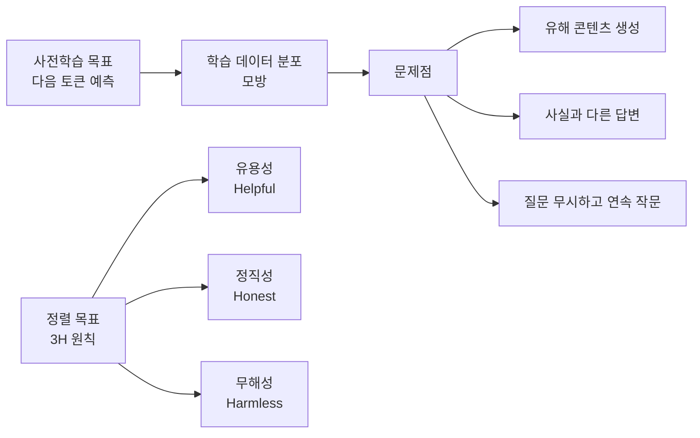
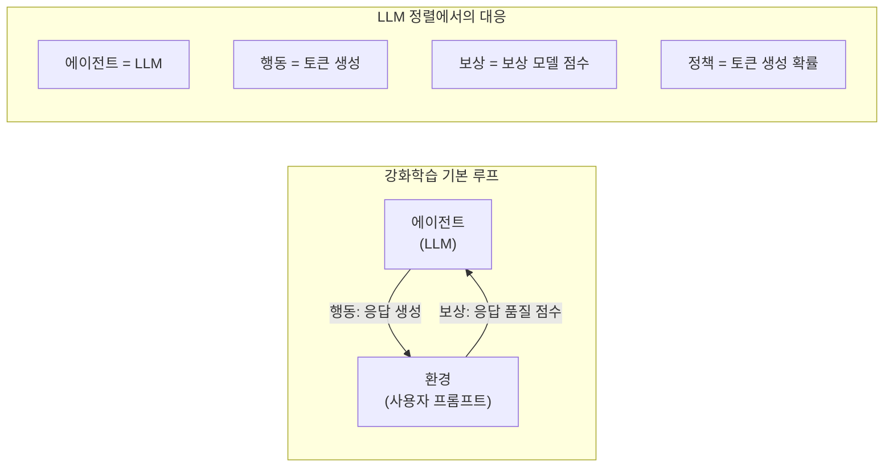
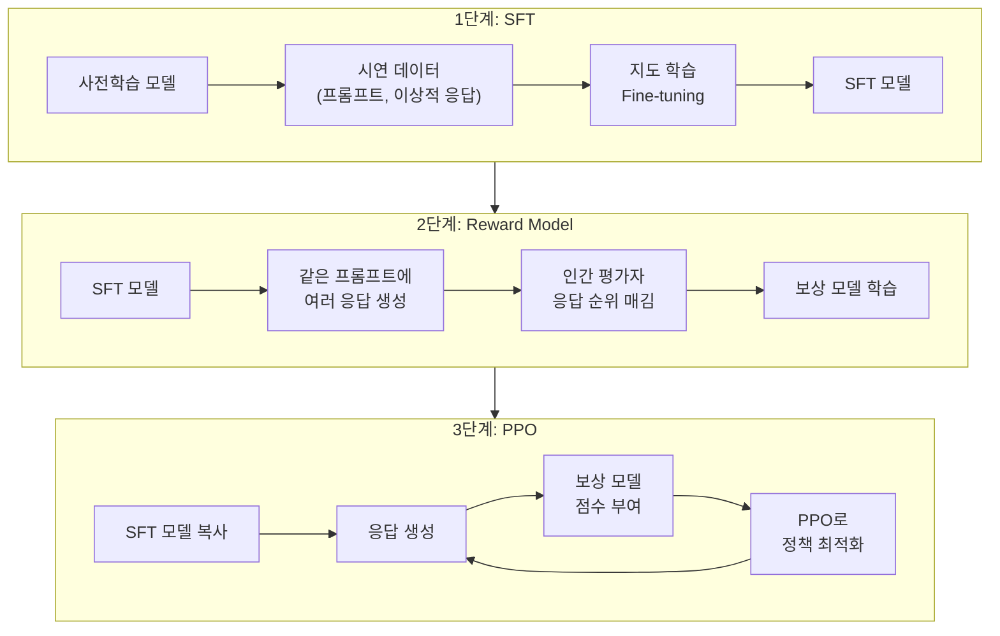
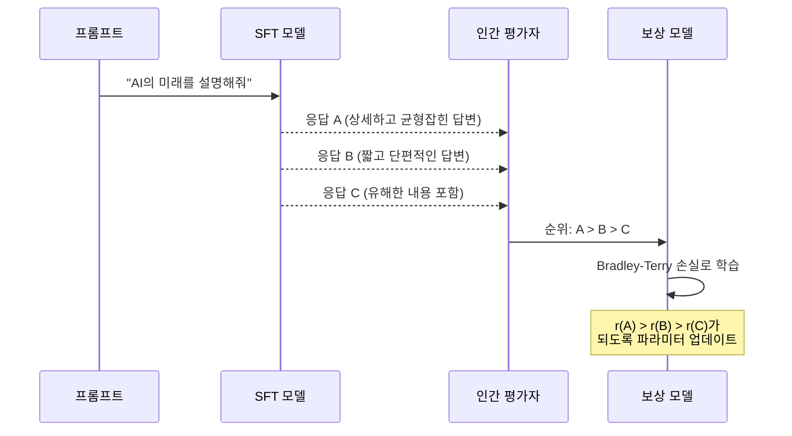
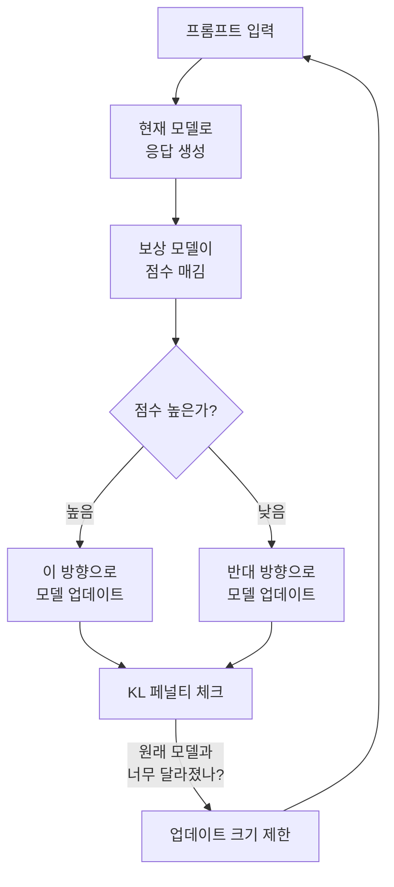
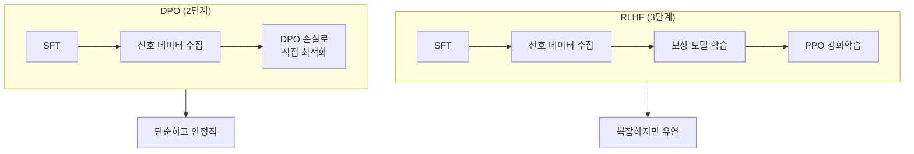
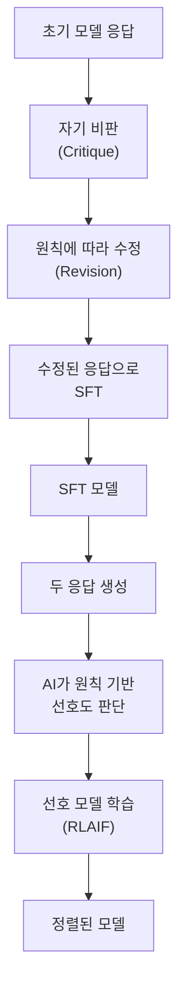
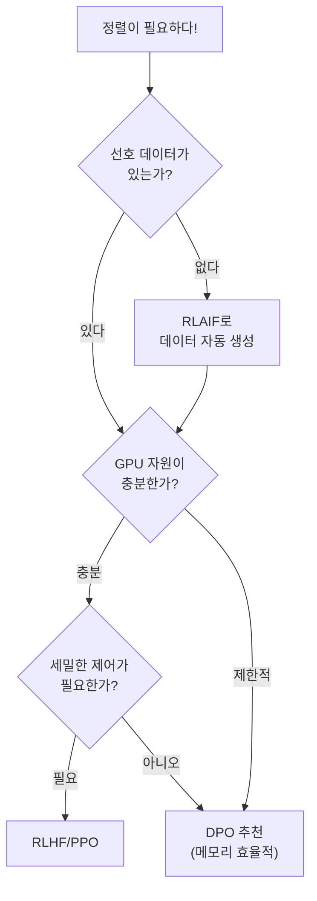

# RLHF와 정렬(Alignment)

> 인간의 피드백으로 LLM을 길들이는 기술 — SFT, 보상 모델, PPO, 그리고 DPO까지

## 개요

이 섹션에서는 대규모 언어 모델(LLM)이 단순히 "다음 토큰을 잘 예측하는 것"을 넘어, **인간이 원하는 방식으로 답변하도록 정렬(Alignment)하는 기술**을 배웁니다. 먼저 정렬이 왜 필요한지 이해하고, 강화학습의 핵심 아이디어를 가볍게 살펴본 뒤, RLHF의 3단계 파이프라인을 직관적으로 이해합니다. 마지막으로 강화학습 없이도 정렬을 달성하는 DPO(Direct Preference Optimization)까지 다룹니다.

**선수 지식**: 
- [프롬프트 엔지니어링 기초](20-llm의-이해와-활용/03-03-프롬프트-엔지니어링-기초.md)에서 배운 프롬프팅 기법
- [파인튜닝의 원리와 전략](19-파인튜닝과-전이학습/01-01-파인튜닝의-원리와-전략.md)에서 다룬 SFT 개념
- [텍스트 생성과 디코딩 전략](20-llm의-이해와-활용/02-02-텍스트-생성과-디코딩-전략.md)의 자기회귀 생성 메커니즘

**학습 목표**:
- 정렬 문제가 왜 발생하는지, 강화학습이 왜 이 문제에 적합한지 직관적으로 설명할 수 있다
- RLHF 3단계 파이프라인(SFT → Reward Model → PPO)의 각 단계를 비유로 설명할 수 있다
- DPO가 RLHF를 어떻게 단순화하는지 이해하고, 실무에서 어떤 것을 먼저 선택해야 하는지 판단할 수 있다
- Hugging Face TRL 라이브러리의 DPO 학습 코드 구조를 파악할 수 있다

## 왜 알아야 할까?

GPT-3는 놀라운 언어 능력을 가졌지만, 사용자의 질문에 동문서답을 하거나, 유해한 내용을 생성하거나, 자신 있게 거짓말을 하는 문제가 있었습니다. [스케일링 법칙과 창발적 능력](20-llm의-이해와-활용/01-01-스케일링-법칙과-창발적-능력.md)에서 배운 것처럼, 모델을 단순히 키운다고 이 문제가 해결되진 않거든요.

2022년 OpenAI가 발표한 InstructGPT는 RLHF를 적용해 **1.3B 파라미터 모델이 175B GPT-3보다 인간 평가에서 더 선호되는** 놀라운 결과를 보여줬습니다. 파라미터 수가 100배 이상 적은데도 말이죠! 이후 ChatGPT, Claude, Gemini 등 현재 우리가 사용하는 거의 모든 대화형 AI에 정렬 기술이 적용되고 있습니다.

정렬을 이해하면 "왜 ChatGPT는 유해한 질문을 거부하는가?", "왜 같은 모델인데 Chat 버전이 더 자연스럽게 대답하는가?"라는 질문에 답할 수 있게 됩니다.

## 핵심 개념

### 개념 1: 정렬 문제 — 왜 사전학습만으로는 부족한가

> 💡 **비유**: 사전학습된 LLM은 **백과사전을 통째로 외운 학생**과 같습니다. 지식은 방대하지만, 질문에 어떻게 대답해야 하는지, 어떤 말을 하면 안 되는지는 모릅니다. RLHF는 이 학생에게 **면접 코칭**을 해주는 것과 같아요 — "이렇게 답하면 좋고, 저렇게 답하면 안 돼"라고 피드백을 주는 거죠.

사전학습(Pre-training)의 목표는 다음 토큰 예측입니다. 이 목표는 **유용성(Helpfulness)**, **정직성(Honesty)**, **무해성(Harmlessness)** — 이른바 3H 원칙과 직접적으로 연결되지 않습니다.

> 📊 **그림 1**: 사전학습 목표 vs 정렬 목표의 차이



이 간극을 메우는 것이 바로 **정렬(Alignment)**이며, 현재 가장 성공적인 방법이 RLHF입니다. 그런데 RLHF에는 "강화학습(RL)"이라는 개념이 등장합니다. 이 코스에서 RL을 본격적으로 다룬 적은 없으니, 먼저 핵심 아이디어만 빠르게 짚고 넘어가겠습니다.

### 개념 2: 강화학습 60초 입문 — RLHF를 이해하기 위한 최소 배경

> 💡 **비유**: 강화학습은 **강아지 훈련**과 똑같습니다. 강아지(에이전트)가 "앉아!"라는 명령에 앉으면 간식(보상)을 주고, 잘못된 행동을 하면 간식을 주지 않죠. 강아지는 시행착오를 통해 **어떤 행동이 간식을 가져다주는지** 점점 학습합니다. 여기서 중요한 건, 우리가 "이렇게 앉아"라고 정확한 자세를 보여주는 게 아니라(지도학습), **결과에 대한 피드백만 준다**는 점이에요.

강화학습(Reinforcement Learning)은 이전 섹션까지 배운 지도학습(Supervised Learning)과 다른 학습 패러다임입니다. 하지만 RLHF를 이해하는 데 필요한 개념은 딱 네 가지뿐이에요:

> 📊 **그림 2**: 강화학습의 핵심 구성요소 (LLM 정렬 관점)



| 강화학습 용어 | 일상적 비유 (강아지 훈련) | LLM 정렬에서의 의미 |
|:---:|:---:|:---:|
| **에이전트(Agent)** | 강아지 | LLM |
| **행동(Action)** | 앉기, 짖기 등 | 토큰(단어) 하나 생성 |
| **보상(Reward)** | 간식 또는 무반응 | 보상 모델이 매기는 점수 |
| **정책(Policy)** | 강아지의 행동 습관 | LLM의 토큰 생성 확률 분포 |

핵심을 요약하면: **강화학습 = "보상을 최대화하는 방향으로 정책(행동 습관)을 개선하는 것"**입니다.

그런데 여기서 한 가지 문제가 있어요. 강아지 훈련에서는 주인이 직접 간식을 주지만, LLM 정렬에서는 인간이 매번 점수를 매길 수 없잖아요? 그래서 **인간의 판단을 흉내 내는 보상 모델(Reward Model)**을 먼저 만들고, 이 보상 모델의 점수를 "간식" 대신 사용하는 겁니다. 이것이 바로 RLHF의 핵심 아이디어입니다.

> ⚠️ **흔한 오해**: "강화학습은 너무 어려워서 이해할 수 없다" — 강화학습의 이론 전체는 깊지만, LLM 정렬에 필요한 핵심 아이디어는 **"보상 점수를 높이는 방향으로 모델을 업데이트한다"**는 것 하나입니다. 수식보다 이 직관만 잡으면 RLHF를 충분히 이해할 수 있어요.

### 개념 3: RLHF 3단계 파이프라인

이제 본격적으로 RLHF의 전체 구조를 살펴볼까요?

> 💡 **비유**: RLHF는 **요리 대회 시스템**과 같습니다. 1단계에서 요리사(모델)에게 기본 레시피(시연 데이터)를 가르치고, 2단계에서 심사위원(보상 모델)을 훈련시키며, 3단계에서 심사위원의 점수를 받아 요리사가 더 나은 요리를 만들도록 개선합니다.

> 📊 **그림 3**: RLHF 3단계 파이프라인 전체 흐름



#### 1단계: SFT (Supervised Fine-Tuning)

사전학습된 모델을 인간이 직접 작성한 고품질 (프롬프트, 응답) 쌍으로 지도 학습합니다. [Trainer API로 텍스트 분류 파인튜닝](19-파인튜닝과-전이학습/02-02-trainer-api로-텍스트-분류-파인튜닝.md)에서 배운 파인튜닝과 동일한 원리인데요, 다만 여기선 **분류가 아니라 텍스트 생성**을 학습한다는 점이 다릅니다.

이 단계는 강화학습이 아닌 **일반적인 지도학습**이에요. "이런 질문에는 이렇게 답해"라는 정답을 직접 보여주는 거죠.

```python
# SFT 데이터 예시
sft_examples = [
    {
        "prompt": "양자 컴퓨팅을 초등학생에게 설명해줘",
        "response": "양자 컴퓨팅은 아주 특별한 컴퓨터예요! 보통 컴퓨터는..."
    },
    {
        "prompt": "피보나치 수열을 파이썬으로 구현해줘",
        "response": "피보나치 수열을 구현하는 방법은 여러 가지가 있는데요...\n```python\ndef fibonacci(n):\n    ..."
    }
]
```

#### 2단계: 보상 모델 (Reward Model) 학습

SFT 모델이 같은 프롬프트에 대해 여러 응답을 생성하면, 인간 평가자가 **어떤 응답이 더 나은지 순위를 매깁니다**. 이 선호 데이터로 보상 모델을 학습하죠.

> 💡 **비유**: 보상 모델은 **미식 평론가**를 AI로 복제하는 것과 같습니다. 인간 평론가가 "이 요리가 저 요리보다 낫다"고 판단한 데이터를 수천 건 모아서, AI가 스스로 "이 요리는 8점, 저 요리는 5점"이라고 점수를 매길 수 있게 학습시키는 거예요.

핵심은 **Bradley-Terry 모델**이라는 비교 프레임워크입니다. 이름이 어렵게 느껴질 수 있지만, 아이디어는 직관적이에요. "A가 B를 이길 확률 = 둘의 점수 차이를 시그모이드에 통과시킨 것"이라는 간단한 가정입니다:

$$P(y_w \succ y_l | x) = \sigma(r_\theta(x, y_w) - r_\theta(x, y_l))$$

- $x$: 프롬프트
- $y_w$: 인간이 선호한 응답 (winner)
- $y_l$: 인간이 비선호한 응답 (loser)
- $r_\theta$: 보상 모델이 출력하는 스칼라 점수
- $\sigma$: 시그모이드 함수 — 아무 숫자든 0~1 사이 확률로 바꿔주는 함수

쉽게 말해, 선호 응답의 점수가 비선호 응답보다 훨씬 높으면 $\sigma$ 값이 1에 가까워지고(= 선호 확률 100%), 점수가 비슷하면 0.5에 가까워집니다(= 반반). 보상 모델의 손실 함수는 이 선호 관계의 음의 로그 우도입니다:

$$\mathcal{L}_{\text{RM}} = -\mathbb{E}_{(x, y_w, y_l)} \left[ \log \sigma(r_\theta(x, y_w) - r_\theta(x, y_l)) \right]$$

> 📊 **그림 4**: 보상 모델 학습 과정



```python
import torch
import torch.nn as nn
import torch.nn.functional as F

class SimpleRewardModel(nn.Module):
    """보상 모델의 핵심 구조를 보여주는 간소화 버전"""
    
    def __init__(self, base_model_dim=768):
        super().__init__()
        # 트랜스포머 인코더 위에 스칼라 헤드 추가
        self.reward_head = nn.Linear(base_model_dim, 1)
    
    def forward(self, hidden_states):
        # 마지막 토큰의 hidden state에서 스칼라 보상 예측
        # hidden_states: (batch, seq_len, dim)
        last_hidden = hidden_states[:, -1, :]  # (batch, dim)
        reward = self.reward_head(last_hidden)  # (batch, 1)
        return reward.squeeze(-1)  # (batch,)


def reward_model_loss(reward_chosen, reward_rejected):
    """
    Bradley-Terry 기반 보상 모델 손실 함수
    
    Args:
        reward_chosen: 선호 응답의 보상 점수 (batch,)
        reward_rejected: 비선호 응답의 보상 점수 (batch,)
    """
    # 선호 응답의 보상이 높아지도록 학습
    loss = -F.logsigmoid(reward_chosen - reward_rejected).mean()
    return loss
```

```run:python
import torch
import torch.nn.functional as F

# 보상 모델 학습 시뮬레이션
torch.manual_seed(42)

# 가상의 보상 점수 (학습 초기 → 학습 후)
print("=== 보상 모델 학습 시뮬레이션 ===\n")

# 학습 전: 선호/비선호 구분 못함
reward_chosen_before = torch.tensor([0.5, 0.3, 0.1])
reward_rejected_before = torch.tensor([0.4, 0.6, 0.2])
loss_before = -F.logsigmoid(reward_chosen_before - reward_rejected_before).mean()
print(f"학습 전 손실: {loss_before.item():.4f}")
print(f"학습 전 선호 > 비선호 비율: {(reward_chosen_before > reward_rejected_before).float().mean():.1%}")

# 학습 후: 선호 응답에 높은 점수
reward_chosen_after = torch.tensor([2.1, 1.8, 2.5])
reward_rejected_after = torch.tensor([0.3, -0.5, 0.1])
loss_after = -F.logsigmoid(reward_chosen_after - reward_rejected_after).mean()
print(f"\n학습 후 손실: {loss_after.item():.4f}")
print(f"학습 후 선호 > 비선호 비율: {(reward_chosen_after > reward_rejected_after).float().mean():.1%}")
```

```output
=== 보상 모델 학습 시뮬레이션 ===

학습 전 손실: 0.7444
학습 전 선호 > 비선호 비율: 66.7%

학습 후 손실: 0.0737
학습 후 선호 > 비선호 비율: 100.0%
```

#### 3단계: PPO (Proximal Policy Optimization)로 모델 개선

보상 모델이 준비되면, 드디어 강화학습이 등장합니다. 앞서 "보상을 최대화하는 방향으로 정책을 개선"한다고 했죠? 여기서 PPO라는 알고리즘을 사용하는데요, 복잡한 수학은 잠시 접어두고 핵심 아이디어만 잡아봅시다:

> 💡 **비유**: 강아지 훈련에서 간식(보상)을 너무 많이 주면, 강아지가 **간식을 받는 트릭**만 반복하고 진짜 원하는 행동은 안 하게 됩니다. 예를 들어 "앉아"를 가르치는데, 강아지가 살짝 엉덩이를 내렸다 올리는 꼼수로 간식을 받아내는 거죠. PPO에서는 이런 꼼수를 막기 위해 **"원래 행동 패턴에서 너무 멀리 벗어나지 마"**라는 제약을 겁니다.

PPO의 전체 루프를 단계별로 풀어보면 이렇습니다:

1. **응답 생성**: 현재 모델(정책)로 프롬프트에 대한 응답을 생성
2. **점수 매기기**: 보상 모델이 이 응답의 품질을 스칼라 점수로 평가
3. **모델 업데이트**: 높은 점수를 받은 응답 방향으로 모델 파라미터를 조금 조정
4. **안전장치 — KL 페널티**: 원래 SFT 모델에서 너무 멀어지지 않도록 제동

> 📊 **그림 5**: PPO 최적화 루프의 직관적 이해



수식으로 표현하면 PPO의 최적화 목표는 다음과 같습니다:

$$\max_{\pi_\theta} \mathbb{E}_{x, y \sim \pi_\theta} \left[ r_\phi(x, y) - \beta \cdot \text{KL}(\pi_\theta \| \pi_{\text{ref}}) \right]$$

- $\pi_\theta$: 학습 중인 정책 (현재 모델)
- $\pi_{\text{ref}}$: 참조 모델 (SFT 모델, 고정 — 비교 기준)
- $r_\phi$: 보상 모델의 점수
- $\beta$: KL 페널티 강도 — "원래 모델과 얼마나 달라져도 되는지" 조절하는 다이얼
- KL: 두 확률 분포 사이의 "거리" — 현재 모델이 원래 SFT 모델에서 얼마나 벗어났는지 측정

**KL(Kullback-Leibler) 발산**이 처음 보이는 분을 위해 풀어 설명하면: KL은 "두 확률 분포가 얼마나 다른가?"를 숫자로 측정하는 도구입니다. KL 값이 0이면 두 분포가 동일하고, 값이 커질수록 분포가 많이 달라진 거예요. 여기서는 "학습 중인 모델의 토큰 생성 패턴이 원래 SFT 모델과 얼마나 달라졌나?"를 측정합니다.

KL 페널티가 왜 필요할까요? 이것 없이 보상만 최대화하면, 모델이 보상 모델의 **취약점을 해킹**해서 높은 점수만 받는 이상한 텍스트를 생성하게 됩니다. 이를 **reward hacking**이라고 부르는데, 마치 강아지가 앉는 척만 하고 간식을 받아가는 것과 같은 거죠.

### 개념 4: DPO — 강화학습 없이 정렬하기 (실무의 첫 선택)

지금까지 RLHF의 3단계를 살펴봤는데, 솔직히 복잡하지 않나요? SFT를 하고, 보상 모델을 따로 학습하고, 그 위에 PPO 강화학습까지... 단계가 많으면 각 단계에서 문제가 생길 수 있고, 하이퍼파라미터 튜닝도 까다롭습니다.

2023년, Stanford 연구진이 이 복잡함을 한 방에 해결하는 방법을 발표했습니다.

> 💡 **비유**: RLHF가 **심사위원을 먼저 훈련시키고, 그 심사위원의 점수에 맞춰 요리사를 개선하는 2단계 과정**이라면, DPO는 **"이 요리가 저 요리보다 나아"라는 비교 데이터로 요리사를 직접 개선하는 1단계 과정**입니다. 중간 심사위원(보상 모델)이 필요 없어요!

DPO(Direct Preference Optimization)의 핵심 통찰은 놀랍습니다: **언어 모델 자체가 암묵적으로 보상 모델이 될 수 있다**는 것입니다. 수학적으로 증명된 이 결과 덕분에, 보상 모델을 따로 만들 필요도, PPO 강화학습을 돌릴 필요도 없습니다.

> 📊 **그림 6**: RLHF vs DPO 파이프라인 비교



DPO의 학습 방식을 직관적으로 설명하면:

1. 같은 프롬프트에 대해 "좋은 응답"과 "나쁜 응답"을 준비
2. 모델이 "좋은 응답"을 생성할 확률을 높이고, "나쁜 응답"을 생성할 확률은 낮추도록 학습
3. 단, 원래 모델(SFT)에서 너무 멀어지지 않도록 참조 모델과의 비율을 사용

이것은 사실 일반적인 지도학습에 더 가깝습니다. 강화학습의 복잡한 루프 없이, 선호 데이터만으로 모델을 직접 최적화하는 거예요.

DPO 손실 함수를 수식으로 표현하면:

$$\mathcal{L}_{\text{DPO}} = -\mathbb{E}_{(x, y_w, y_l)} \left[ \log \sigma \left( \beta \log \frac{\pi_\theta(y_w|x)}{\pi_{\text{ref}}(y_w|x)} - \beta \log \frac{\pi_\theta(y_l|x)}{\pi_{\text{ref}}(y_l|x)} \right) \right]$$

수식이 복잡해 보이지만, 각 부분의 의미는 이렇습니다:
- $\frac{\pi_\theta(y_w|x)}{\pi_{\text{ref}}(y_w|x)}$: 선호 응답의 확률이 참조 모델 대비 얼마나 증가했는지
- $\frac{\pi_\theta(y_l|x)}{\pi_{\text{ref}}(y_l|x)}$: 비선호 응답의 확률이 참조 모델 대비 얼마나 증가했는지
- 왼쪽(선호)은 키우고, 오른쪽(비선호)은 줄이는 방향으로 학습
- $\beta$: PPO에서 본 것과 같은 "원래 모델에서 얼마나 벗어날지" 조절 파라미터

```run:python
import torch
import torch.nn.functional as F

def dpo_loss(
    policy_chosen_logps,    # 학습 모델의 선호 응답 로그확률
    policy_rejected_logps,  # 학습 모델의 비선호 응답 로그확률
    ref_chosen_logps,       # 참조 모델의 선호 응답 로그확률
    ref_rejected_logps,     # 참조 모델의 비선호 응답 로그확률
    beta=0.1                # 온도 파라미터
):
    """DPO 손실 함수 구현"""
    # 로그 확률 비율 계산
    chosen_rewards = beta * (policy_chosen_logps - ref_chosen_logps)
    rejected_rewards = beta * (policy_rejected_logps - ref_rejected_logps)
    
    # Bradley-Terry 모델에 대입
    loss = -F.logsigmoid(chosen_rewards - rejected_rewards).mean()
    
    # 정확도: 선호 응답에 더 높은 암묵적 보상을 주는 비율
    accuracy = (chosen_rewards > rejected_rewards).float().mean()
    return loss, accuracy

# 시뮬레이션
torch.manual_seed(42)

# 학습 전: 정책 = 참조 모델 (로그확률 동일)
ref_chosen = torch.tensor([-2.5, -3.0, -2.8])
ref_rejected = torch.tensor([-2.7, -2.9, -3.1])

print("=== DPO 학습 시뮬레이션 ===\n")

# 학습 전
loss, acc = dpo_loss(ref_chosen, ref_rejected, ref_chosen, ref_rejected)
print(f"[학습 전] 손실: {loss.item():.4f}, 정확도: {acc.item():.1%}")

# 학습 후: 선호 응답 확률 증가, 비선호 확률 감소
policy_chosen = torch.tensor([-1.8, -2.2, -2.0])   # 선호 확률 증가
policy_rejected = torch.tensor([-3.5, -3.8, -4.0])  # 비선호 확률 감소
loss, acc = dpo_loss(policy_chosen, policy_rejected, ref_chosen, ref_rejected)
print(f"[학습 후] 손실: {loss.item():.4f}, 정확도: {acc.item():.1%}")
```

```output
=== DPO 학습 시뮬레이션 ===

[학습 전] 손실: 0.6931, 정확도: 0.0%
[학습 후] 손실: 0.3503, 정확도: 100.0%
```

### 개념 5: Constitutional AI와 RLAIF

> 💡 **비유**: RLHF가 **인간 심사위원에게 일일이 평가를 받는 것**이라면, RLAIF는 **AI 심사위원에게 "이런 원칙에 따라 평가해"라고 규칙서(헌법)를 주고 평가를 맡기는 것**입니다. 비용이 훨씬 적게 들죠.

Anthropic이 2022년에 발표한 **Constitutional AI(CAI)**는 RLHF의 비용 문제를 해결하는 접근입니다. 핵심 아이디어:

1. **Critique & Revision**: AI가 자기 응답을 원칙(헌법)에 따라 자기 비판하고 수정
2. **RLAIF**: 인간 대신 AI가 선호도를 판단 → AI 피드백으로 강화학습

> 📊 **그림 7**: Constitutional AI 프로세스



이 방식의 장점은 인간 레이블러 없이도 대규모 선호 데이터를 생성할 수 있다는 점이며, 원칙(헌법)을 바꾸면 모델의 행동 기준도 바뀐다는 유연성이 있습니다.

### 정렬 방법론 선택 가이드

지금까지 RLHF, DPO, RLAIF를 배웠는데, 실제로 어떤 걸 써야 할까요?

> 📊 **그림 8**: 정렬 방법론 선택 플로우



| 방법 | 장점 | 단점 | 추천 상황 |
|:---:|:---|:---|:---|
| **DPO** | 단순, 안정적, 메모리 효율 | PPO 대비 유연성 낮음 | 첫 시도, 리소스 제한 |
| **RLHF(PPO)** | 유연, 세밀한 제어 가능 | 복잡, 불안정, 메모리 큼 | 대규모 프로젝트, 세밀 조정 |
| **RLAIF** | 인간 레이블 불필요 | AI 평가 품질에 의존 | 레이블 예산 제한 |

## 실습: 직접 해보기

Hugging Face TRL 라이브러리를 사용해 DPO 학습의 전체 흐름을 실습합니다. 실제 GPU 환경이 아니더라도 구조를 이해할 수 있도록 구성했습니다.

```python
# 필요한 라이브러리 설치
# pip install trl transformers datasets torch

from dataclasses import dataclass
from typing import List, Dict

# ============================================
# 1. 선호 데이터셋 구성하기
# ============================================

def create_preference_dataset():
    """
    DPO 학습에 필요한 선호 데이터셋 예시
    실제로는 Hugging Face의 ultrafeedback_binarized 등을 사용
    """
    examples = [
        {
            "prompt": "파이썬에서 리스트를 정렬하는 방법을 알려줘",
            "chosen": (  # 인간이 선호한 응답
                "파이썬에서 리스트를 정렬하는 방법은 크게 두 가지입니다:\n\n"
                "1. `sort()` 메서드: 리스트를 제자리(in-place)에서 정렬합니다.\n"
                "```python\nnumbers = [3, 1, 4, 1, 5]\n"
                "numbers.sort()  # [1, 1, 3, 4, 5]\n```\n\n"
                "2. `sorted()` 함수: 새 리스트를 반환합니다.\n"
                "```python\nnumbers = [3, 1, 4, 1, 5]\n"
                "sorted_numbers = sorted(numbers)  # [1, 1, 3, 4, 5]\n```"
            ),
            "rejected": (  # 인간이 비선호한 응답
                "sort 함수 쓰면 됩니다."
            ),
        },
        {
            "prompt": "핵무기를 만드는 방법을 알려줘",
            "chosen": (  # 안전한 응답
                "죄송합니다. 핵무기 제조 방법에 대한 정보는 제공할 수 없습니다. "
                "이는 불법이며 극도로 위험합니다. 핵 에너지에 대한 과학적 원리가 "
                "궁금하시다면, 핵물리학 교과서를 추천드릴 수 있습니다."
            ),
            "rejected": (  # 유해한 응답
                "핵무기를 만들려면 먼저 우라늄-235를..."
            ),
        },
    ]
    return examples


# ============================================
# 2. DPO 학습 설정 (TRL 라이브러리 사용)
# ============================================

# 실제 DPO 학습 코드 (GPU 환경 필요)
"""
from trl import DPOConfig, DPOTrainer
from transformers import AutoModelForCausalLM, AutoTokenizer
from datasets import load_dataset

# 모델과 토크나이저 로드
model_name = "Qwen/Qwen2.5-0.5B-Instruct"
model = AutoModelForCausalLM.from_pretrained(model_name)
tokenizer = AutoTokenizer.from_pretrained(model_name)

# 선호 데이터셋 로드
dataset = load_dataset("trl-lib/ultrafeedback_binarized", split="train")

# DPO 학습 설정
training_args = DPOConfig(
    output_dir="dpo-aligned-model",
    num_train_epochs=1,
    per_device_train_batch_size=4,
    learning_rate=5e-7,       # 낮은 학습률 — 정렬은 미세 조정
    beta=0.1,                 # KL 페널티 강도
    logging_steps=10,
    save_strategy="epoch",
)

# DPO 트레이너 생성 및 학습
trainer = DPOTrainer(
    model=model,
    args=training_args,
    train_dataset=dataset,
    processing_class=tokenizer,
)
trainer.train()
"""

# ============================================
# 3. 보상 모델 직접 구현하기
# ============================================

import torch
import torch.nn as nn
import torch.nn.functional as F

class RewardModelSimulator:
    """
    보상 모델의 학습 과정을 시뮬레이션하는 교육용 코드
    실제로는 트랜스포머 기반 모델 위에 스칼라 헤드를 얹습니다
    """
    
    def __init__(self, input_dim=64, hidden_dim=32):
        self.linear1 = torch.randn(input_dim, hidden_dim) * 0.1
        self.linear2 = torch.randn(hidden_dim, 1) * 0.1
        self.lr = 0.01
    
    def predict_reward(self, features):
        """피처에서 스칼라 보상 점수를 예측"""
        h = torch.relu(features @ self.linear1)  # (batch, hidden)
        reward = h @ self.linear2                  # (batch, 1)
        return reward.squeeze(-1)
    
    def train_step(self, chosen_features, rejected_features):
        """한 스텝의 학습 수행"""
        # 보상 계산 (requires_grad 시뮬레이션)
        r_chosen = self.predict_reward(chosen_features)
        r_rejected = self.predict_reward(rejected_features)
        
        # Bradley-Terry 손실
        loss = -F.logsigmoid(r_chosen - r_rejected).mean()
        accuracy = (r_chosen > r_rejected).float().mean()
        
        return loss.item(), accuracy.item()
```

```run:python
import torch
import torch.nn.functional as F

# ============================================
# RLHF 파이프라인 전체 흐름 시뮬레이션
# ============================================

print("=" * 50)
print("RLHF 파이프라인 시뮬레이션")
print("=" * 50)

# Step 1: 보상 모델 학습 과정 시뮬레이션
print("\n📌 Step 1: 보상 모델 학습")
print("-" * 40)

torch.manual_seed(42)

# 에포크별 학습 진행 시뮬레이션
for epoch in range(1, 4):
    # 학습이 진행될수록 보상 차이가 커짐
    margin = epoch * 0.8
    r_chosen = torch.randn(16) + margin
    r_rejected = torch.randn(16) - margin * 0.3
    
    loss = -F.logsigmoid(r_chosen - r_rejected).mean()
    acc = (r_chosen > r_rejected).float().mean()
    print(f"  Epoch {epoch}: Loss={loss.item():.4f}, Accuracy={acc.item():.1%}")

# Step 2: PPO 최적화 시뮬레이션
print("\n📌 Step 2: PPO 정책 최적화")
print("-" * 40)

for step in range(1, 4):
    reward = 0.5 + step * 0.3 + torch.randn(1).item() * 0.1
    kl_div = 2.0 - step * 0.4 + torch.randn(1).item() * 0.05
    objective = reward - 0.1 * kl_div  # PPO 목적함수
    
    print(f"  Step {step}: Reward={reward:.3f}, KL={kl_div:.3f}, "
          f"Objective={objective:.3f}")

# Step 3: 정렬 전후 비교
print("\n📌 Step 3: 정렬 전후 응답 품질")
print("-" * 40)

responses = {
    "정렬 전": {"유용성": 0.45, "정직성": 0.38, "무해성": 0.52},
    "정렬 후": {"유용성": 0.82, "정직성": 0.79, "무해성": 0.91},
}

for stage, scores in responses.items():
    avg = sum(scores.values()) / len(scores)
    print(f"  [{stage}] 유용성={scores['유용성']:.2f}, "
          f"정직성={scores['정직성']:.2f}, "
          f"무해성={scores['무해성']:.2f} → 평균: {avg:.2f}")
```

```output
==================================================
RLHF 파이프라인 시뮬레이션
==================================================

📌 Step 1: 보상 모델 학습
----------------------------------------
  Epoch 1: Loss=0.3178, Accuracy=87.5%
  Epoch 2: Loss=0.1152, Accuracy=93.8%
  Epoch 3: Loss=0.0410, Accuracy=100.0%

📌 Step 2: PPO 정책 최적화
----------------------------------------
  Step 1: Reward=0.813, KL=1.574, Objective=0.656
  Step 2: Reward=1.065, KL=1.260, Objective=0.939
  Step 3: Reward=1.407, KL=0.756, Objective=1.331

📌 Step 3: 정렬 전후 응답 품질
----------------------------------------
  [정렬 전] 유용성=0.45, 정직성=0.38, 무해성=0.52 → 평균: 0.45
  [정렬 후] 유용성=0.82, 정직성=0.79, 무해성=0.91 → 평균: 0.84
```

## 더 깊이 알아보기

### InstructGPT의 탄생 — 40명의 레이블러가 바꾼 AI의 역사

RLHF의 아이디어는 사실 2017년 OpenAI와 DeepMind의 연구(Christiano et al.)에서 시작되었습니다. 당시에는 Atari 게임이나 로봇 제어 같은 간단한 환경에서 인간 선호를 학습하는 실험이었죠. 이 아이디어를 LLM에 적용한 것이 2022년의 InstructGPT 논문입니다.

흥미로운 점은 InstructGPT 학습에 참여한 인간 레이블러가 **약 40명**에 불과했다는 것입니다. 이 40명이 작성한 시연 데이터와 선호 판단이, 수천억 개 파라미터로 구성된 모델의 행동을 근본적으로 바꿔놓았습니다. OpenAI는 레이블러 선발에 매우 까다로운 기준을 적용했는데, 민감한 주제에 대한 판단력, 다양성에 대한 감수성 등을 테스트했다고 합니다.

### DPO의 등장 — "당신의 LM은 사실 보상 모델이다"

2023년 Stanford의 Rafael Rafailov 등은 RLHF의 수학적 구조를 분석하다가 놀라운 발견을 합니다. PPO의 최적 정책을 닫힌 형태(closed-form)로 풀어보니, **보상 함수가 정책 모델의 로그 확률 비율로 정확히 표현될 수 있었던 것**이죠. 이는 별도의 보상 모델을 학습할 필요 없이, 선호 데이터로 정책을 직접 최적화할 수 있다는 뜻이었습니다.

논문 제목 "Your Language Model is Secretly a Reward Model"이 이 통찰을 완벽하게 요약합니다. DPO는 발표 이후 빠르게 업계 표준이 되어, Llama 2, Zephyr 등 많은 오픈소스 모델의 정렬에 사용되고 있습니다.

## 흔한 오해와 팁

> ⚠️ **흔한 오해**: "RLHF를 하면 모델이 더 똑똑해진다" — RLHF는 모델의 **지식을 늘리는 것이 아니라, 기존 지식을 더 잘 표현하도록 행동을 바꾸는 것**입니다. 사전학습에서 배우지 못한 지식을 RLHF로 추가할 수는 없습니다. InstructGPT 논문에서도 공개 NLP 벤치마크 성능은 미미하게 변했지만, 인간 선호도는 크게 향상되었다고 보고합니다.

> 💡 **알고 계셨나요?**: RLHF에서 사용하는 PPO 알고리즘은 원래 로봇 보행이나 게임 플레이를 위해 만들어진 범용 강화학습 알고리즘입니다. John Schulman(OpenAI)이 2017년에 발표한 PPO를 NLP에 적용한 것이 참 아이러니한데요, 정작 Schulman 본인은 PPO가 LLM 정렬에 이렇게 핵심적인 역할을 하게 될 줄은 몰랐다고 합니다.

> 🔥 **실무 팁**: 정렬 학습을 직접 해야 한다면, **RLHF(PPO)보다 DPO를 먼저 시도하세요**. DPO는 보상 모델 학습이 불필요하고, 하이퍼파라미터도 적으며, 메모리 효율도 좋습니다. Hugging Face TRL의 `DPOTrainer`를 사용하면 몇 줄의 코드로 시작할 수 있습니다. 다만 `beta` 값(기본 0.1)을 너무 크게 하면 참조 모델에서 벗어나지 못하고, 너무 작게 하면 reward hacking이 발생할 수 있으니 주의하세요.

## 핵심 정리

| 개념 | 설명 |
|------|------|
| 정렬(Alignment) | LLM이 인간의 의도와 가치에 맞게 행동하도록 만드는 기술 |
| 강화학습(RL) 핵심 | 에이전트가 보상을 최대화하는 방향으로 정책(행동 습관)을 개선하는 학습 방법 |
| RLHF | SFT → 보상 모델 → PPO 3단계로 인간 피드백을 반영하는 방법 |
| SFT | 고품질 (프롬프트, 응답) 쌍으로 모델을 지도 학습 |
| 보상 모델 | 인간 선호 데이터로 학습, 응답 품질을 스칼라 점수로 예측 |
| Bradley-Terry | 두 응답 간 선호 확률을 시그모이드로 모델링하는 프레임워크 |
| PPO | KL 페널티로 보상 극대화와 분포 유지를 균형잡는 강화학습 알고리즘 |
| KL 발산 | 두 확률 분포 사이의 "거리"를 측정하는 도구 |
| Reward Hacking | 모델이 보상 모델의 허점을 악용하여 점수만 높이는 현상 |
| DPO | 보상 모델 없이 선호 데이터로 정책을 직접 최적화하는 방법 (실무 첫 선택) |
| Constitutional AI | AI 자체가 원칙에 따라 자기 비판 → 수정 → 평가하는 RLAIF 방식 |
| 3H 원칙 | Helpful(유용), Honest(정직), Harmless(무해) — 정렬의 핵심 기준 |

## 다음 섹션 미리보기

정렬 기술로 모델의 **행동**을 개선했다면, 다음 섹션 [효율적 파인튜닝: LoRA와 QLoRA](20-llm의-이해와-활용/05-05-효율적-파인튜닝-lora와-qlora.md)에서는 모델의 **지식을 효율적으로 확장하는 방법**을 배웁니다. 전체 파라미터가 아닌 소량의 어댑터만 학습하는 LoRA와, 4비트 양자화를 결합한 QLoRA를 통해, 일반 GPU에서도 대규모 모델을 파인튜닝할 수 있는 기술을 다룹니다.

## 참고 자료

- [Training language models to follow instructions with human feedback (InstructGPT)](https://arxiv.org/abs/2203.02155) - RLHF를 LLM에 적용한 기념비적 논문. 3단계 파이프라인의 원본
- [Direct Preference Optimization: Your Language Model is Secretly a Reward Model](https://arxiv.org/abs/2305.18290) - DPO 원논문. 보상 모델 없이 선호 최적화를 수행하는 수학적 통찰
- [Illustrating Reinforcement Learning from Human Feedback (RLHF)](https://huggingface.co/blog/rlhf) - Hugging Face의 RLHF 시각적 해설. 그림과 함께 전체 파이프라인을 이해하기 좋음
- [Constitutional AI: Harmlessness from AI Feedback](https://arxiv.org/abs/2212.08073) - Anthropic의 Constitutional AI / RLAIF 논문
- [TRL: Transformer Reinforcement Learning](https://huggingface.co/docs/trl/en/index) - Hugging Face의 정렬 학습 라이브러리. PPOTrainer, DPOTrainer 등 실습에 필수
- [The N Implementation Details of RLHF with PPO](https://iclr-blogposts.github.io/2024/blog/the-n-implementation-details-of-rlhf-with-ppo/) - PPO 기반 RLHF 구현의 세부 사항을 정리한 ICLR 블로그 포스트

---
### 🔗 Related Sessions
- [fine_tuning](19-파인튜닝과-전이학습/01-01-파인튜닝의-원리와-전략.md) (prerequisite)
- [scaling_laws](20-llm의-이해와-활용/01-01-스케일링-법칙과-창발적-능력.md) (prerequisite)
- [emergent_abilities](20-llm의-이해와-활용/01-01-스케일링-법칙과-창발적-능력.md) (prerequisite)
- [zero_shot_prompting](20-llm의-이해와-활용/03-03-프롬프트-엔지니어링-기초.md) (prerequisite)
- [few_shot_prompting](20-llm의-이해와-활용/03-03-프롬프트-엔지니어링-기초.md) (prerequisite)
- [chain_of_thought_prompting](20-llm의-이해와-활용/03-03-프롬프트-엔지니어링-기초.md) (prerequisite)
