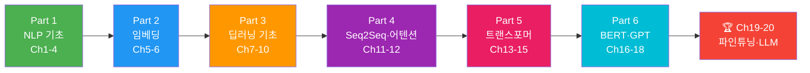

# 2026: LLM Essential 완전 정복

> 자연어 처리의 기초부터 트랜스포머, BERT, GPT까지 — **20챕터 102섹션** 튜토리얼

## 학습 로드맵

> **NLP 기초 → 임베딩 → RNN → 어텐션 → 트랜스포머 → BERT/GPT → LLM 활용**까지 자연스러운 흐름으로 학습합니다.

---

## Part 1: NLP 기초 (Ch1-4, 입문)

**Ch1. 자연어 처리 개요와 개발 환경 설정**
- [01. 자연어 처리란 무엇인가](01-ch1-자연어-처리-개요와-개발-환경-설정/01-01-자연어-처리란-무엇인가.md) · [02. NLP의 발전사](01-ch1-자연어-처리-개요와-개발-환경-설정/02-02-nlp의-발전사-규칙-기반에서-llm까지.md) · [03. Python NLP 개발 환경 구축](01-ch1-자연어-처리-개요와-개발-환경-설정/03-03-python-nlp-개발-환경-구축.md) · [04. spaCy와 NLTK 첫 걸음](01-ch1-자연어-처리-개요와-개발-환경-설정/04-04-spacy와-nltk-첫-걸음.md) · [05. NLP 데이터셋과 코퍼스 이해](01-ch1-자연어-처리-개요와-개발-환경-설정/05-05-nlp-데이터셋과-코퍼스-이해.md)

**Ch2. 텍스트 전처리: 토큰화와 정규화**
- [01. 토큰화의 기초](02-ch2-텍스트-전처리-토큰화와-정규화/01-01-토큰화의-기초.md) · [02. 텍스트 정규화와 클리닝](02-ch2-텍스트-전처리-토큰화와-정규화/02-02-텍스트-정규화와-클리닝.md) · [03. 불용어 처리](02-ch2-텍스트-전처리-토큰화와-정규화/03-03-불용어-처리.md) · [04. 어간 추출과 표제어 추출](02-ch2-텍스트-전처리-토큰화와-정규화/04-04-어간-추출과-표제어-추출.md) · [05. 전처리 파이프라인 구축 실습](02-ch2-텍스트-전처리-토큰화와-정규화/05-05-전처리-파이프라인-구축-실습.md)

**Ch3. 텍스트 표현: BoW와 TF-IDF**
- [01. Bag of Words 모델](03-ch3-텍스트-표현-bow와-tf-idf/01-01-bag-of-words-모델.md) · [02. N-gram과 CountVectorizer](03-ch3-텍스트-표현-bow와-tf-idf/02-02-n-gram과-countvectorizer.md) · [03. TF-IDF의 이론](03-ch3-텍스트-표현-bow와-tf-idf/03-03-tf-idf의-이론.md) · [04. TfidfVectorizer 실습](03-ch3-텍스트-표현-bow와-tf-idf/04-04-tfidfvectorizer-실습.md) · [05. 문서 유사도와 검색](03-ch3-텍스트-표현-bow와-tf-idf/05-05-문서-유사도와-검색.md)

**Ch4. 전통적 텍스트 분류**
- [01. Naive Bayes 텍스트 분류](04-ch4-전통적-텍스트-분류/01-01-naive-bayes-텍스트-분류.md) · [02. SVM과 로지스틱 회귀](04-ch4-전통적-텍스트-분류/02-02-svm과-로지스틱-회귀-텍스트-분류.md) · [03. 모델 평가와 성능 지표](04-ch4-전통적-텍스트-분류/03-03-모델-평가와-성능-지표.md) · [04. scikit-learn Pipeline 구축](04-ch4-전통적-텍스트-분류/04-04-scikit-learn-pipeline-구축.md) · [05. 뉴스 기사 분류 프로젝트](04-ch4-전통적-텍스트-분류/05-05-뉴스-기사-분류-프로젝트.md)

## Part 2: 워드 임베딩 (Ch5-6, 초급)

**Ch5. 워드 임베딩: Word2Vec**
- [01. 분포 가설과 밀집 벡터 표현](05-ch5-워드-임베딩-word2vec/01-01-분포-가설과-밀집-벡터-표현.md) · [02. Word2Vec: CBOW와 Skip-gram](05-ch5-워드-임베딩-word2vec/02-02-word2vec-cbow와-skip-gram.md) · [03. Gensim으로 Word2Vec 학습하기](05-ch5-워드-임베딩-word2vec/03-03-gensim으로-word2vec-학습하기.md) · [04. 임베딩 활용: 유사도와 유추](05-ch5-워드-임베딩-word2vec/04-04-임베딩-활용-유사도와-유추.md) · [05. 임베딩 시각화와 품질 평가](05-ch5-워드-임베딩-word2vec/05-05-임베딩-시각화와-품질-평가.md)

**Ch6. 워드 임베딩 심화: GloVe와 FastText**
- [01. GloVe: 전역 벡터 표현](06-ch6-워드-임베딩-심화-glove와-fasttext/01-01-glove-전역-벡터-표현.md) · [02. FastText: 서브워드 임베딩](06-ch6-워드-임베딩-심화-glove와-fasttext/02-02-fasttext-서브워드-임베딩.md) · [03. 사전학습 임베딩 활용](06-ch6-워드-임베딩-심화-glove와-fasttext/03-03-사전학습-임베딩-활용.md) · [04. 임베딩 기반 텍스트 분류](06-ch6-워드-임베딩-심화-glove와-fasttext/04-04-임베딩-기반-텍스트-분류.md) · [05. 임베딩 방법 종합 비교](06-ch6-워드-임베딩-심화-glove와-fasttext/05-05-임베딩-방법-종합-비교.md)

## Part 3: 딥러닝과 시퀀스 모델 (Ch7-10, 중급)

**Ch7. PyTorch 기초와 신경망 입문**
- [01. PyTorch 텐서와 연산](07-ch7-pytorch-기초와-신경망-입문/01-01-pytorch-텐서와-연산.md) · [02. 자동 미분과 경사 하강법](07-ch7-pytorch-기초와-신경망-입문/02-02-자동-미분과-경사-하강법.md) · [03. nn.Module로 신경망 정의하기](07-ch7-pytorch-기초와-신경망-입문/03-03-nnmodule로-신경망-정의하기.md) · [04. 손실 함수와 옵티마이저](07-ch7-pytorch-기초와-신경망-입문/04-04-손실-함수와-옵티마이저.md) · [05. 학습 루프와 Dataset/DataLoader](07-ch7-pytorch-기초와-신경망-입문/05-05-학습-루프와-datasetdataloader.md)

**Ch8. 순환 신경망(RNN) 기초**
- [01. 시퀀스 데이터와 RNN의 필요성](08-ch8-순환-신경망rnn-기초/01-01-시퀀스-데이터와-rnn의-필요성.md) · [02. RNN의 구조와 순전파](08-ch8-순환-신경망rnn-기초/02-02-rnn의-구조와-순전파.md) · [03. BPTT와 기울기 문제](08-ch8-순환-신경망rnn-기초/03-03-bptt와-기울기-문제.md) · [04. PyTorch로 RNN 구현하기](08-ch8-순환-신경망rnn-기초/04-04-pytorch로-rnn-구현하기.md) · [05. 문자 수준 이름 분류 실습](08-ch8-순환-신경망rnn-기초/05-05-문자-수준-이름-분류-실습.md)

**Ch9. LSTM과 GRU**
- [01. LSTM: 장단기 메모리 네트워크](09-ch9-lstm과-gru/01-01-lstm-장단기-메모리-네트워크.md) · [02. GRU: 게이트 순환 유닛](09-ch9-lstm과-gru/02-02-gru-게이트-순환-유닛.md) · [03. PyTorch LSTM/GRU 구현](09-ch9-lstm과-gru/03-03-pytorch-lstmgru-구현.md) · [04. 임베딩 레이어와 패딩 처리](09-ch9-lstm과-gru/04-04-임베딩-레이어와-패딩-처리.md) · [05. LSTM 기반 텍스트 생성](09-ch9-lstm과-gru/05-05-lstm-기반-텍스트-생성.md)

**Ch10. RNN 기반 텍스트 분류와 감성 분석**
- [01. RNN 텍스트 분류 아키텍처](10-ch10-rnn-기반-텍스트-분류와-감성-분석/01-01-rnn-텍스트-분류-아키텍처.md) · [02. 데이터 전처리와 어휘 사전 구축](10-ch10-rnn-기반-텍스트-분류와-감성-분석/02-02-데이터-전처리와-어휘-사전-구축.md) · [03. 감성 분석 모델 학습](10-ch10-rnn-기반-텍스트-분류와-감성-분석/03-03-감성-분석-모델-학습.md) · [04. 정규화와 성능 최적화](10-ch10-rnn-기반-텍스트-분류와-감성-분석/04-04-정규화와-성능-최적화.md) · [05. 모델 평가와 오류 분석](10-ch10-rnn-기반-텍스트-분류와-감성-분석/05-05-모델-평가와-오류-분석.md)

## Part 4: Seq2Seq과 어텐션 (Ch11-12, 중급)

**Ch11. 시퀀스-투-시퀀스와 기계 번역**
- [01. 인코더-디코더 아키텍처](11-시퀀스-투-시퀀스와-기계-번역/01-01-인코더-디코더-아키텍처.md) · [02. 번역 데이터 전처리](11-시퀀스-투-시퀀스와-기계-번역/02-02-번역-데이터-전처리.md) · [03. Seq2Seq 모델 구현](11-시퀀스-투-시퀀스와-기계-번역/03-03-seq2seq-모델-구현.md) · [04. 번역 모델 학습과 추론](11-시퀀스-투-시퀀스와-기계-번역/04-04-번역-모델-학습과-추론.md) · [05. BLEU 점수와 번역 품질 평가](11-시퀀스-투-시퀀스와-기계-번역/05-05-bleu-점수와-번역-품질-평가.md)

**Ch12. 어텐션 메커니즘**
- [01. 어텐션의 직관적 이해](12-어텐션-메커니즘/01-01-어텐션의-직관적-이해.md) · [02. Bahdanau와 Luong 어텐션](12-어텐션-메커니즘/02-02-bahdanau와-luong-어텐션.md) · [03. 어텐션 Seq2Seq 구현](12-어텐션-메커니즘/03-03-어텐션-seq2seq-구현.md) · [04. 어텐션 가중치 시각화](12-어텐션-메커니즘/04-04-어텐션-가중치-시각화.md) · [05. 셀프 어텐션으로의 확장](12-어텐션-메커니즘/05-05-셀프-어텐션으로의-확장.md)

## Part 5: 트랜스포머 (Ch13-15, 중고급)

**Ch13. 트랜스포머 아키텍처 심층 분석**
- [01. 트랜스포머 아키텍처 전체 조망](13-트랜스포머-아키텍처-심층-분석/01-01-트랜스포머-아키텍처-전체-조망.md) · [02. 스케일드 닷-프로덕트 어텐션](13-트랜스포머-아키텍처-심층-분석/02-02-스케일드-닷-프로덕트-어텐션.md) · [03. 멀티헤드 어텐션](13-트랜스포머-아키텍처-심층-분석/03-03-멀티헤드-어텐션.md) · [04. 위치 인코딩](13-트랜스포머-아키텍처-심층-분석/04-04-위치-인코딩.md) · [05. 피드포워드 네트워크와 정규화](13-트랜스포머-아키텍처-심층-분석/05-05-피드포워드-네트워크와-정규화.md) · [06. 인코더와 디코더의 상호작용](13-트랜스포머-아키텍처-심층-분석/06-06-인코더와-디코더의-상호작용.md)

**Ch14. 트랜스포머 구현 실습**
- [01. 셀프 어텐션 직접 구현](14-트랜스포머-구현-실습/01-01-셀프-어텐션-직접-구현.md) · [02. 멀티헤드 어텐션 구현](14-트랜스포머-구현-실습/02-02-멀티헤드-어텐션-구현.md) · [03. 인코더 블록 구현](14-트랜스포머-구현-실습/03-03-인코더-블록-구현.md) · [04. 디코더 블록과 전체 모델 조립](14-트랜스포머-구현-실습/04-04-디코더-블록과-전체-모델-조립.md) · [05. 미니 번역 태스크로 검증](14-트랜스포머-구현-실습/05-05-미니-번역-태스크로-검증.md)

**Ch15. 서브워드 토크나이제이션**
- [01. 서브워드 토크나이제이션의 필요성](15-서브워드-토크나이제이션/01-01-서브워드-토크나이제이션의-필요성.md) · [02. BPE 알고리즘](15-서브워드-토크나이제이션/02-02-bpebyte-pair-encoding-알고리즘.md) · [03. WordPiece와 Unigram](15-서브워드-토크나이제이션/03-03-wordpiece와-unigram.md) · [04. SentencePiece와 HF Tokenizers](15-서브워드-토크나이제이션/04-04-sentencepiece와-hugging-face-tokenizers.md) · [05. minbpe로 BPE 직접 구현하기](15-서브워드-토크나이제이션/05-05-minbpe로-bpe-직접-구현하기.md)

## Part 6: 사전학습 모델 (Ch16-18, 고급)

**Ch16. BERT: 양방향 사전학습 모델**
- [01. 사전학습과 파인튜닝 패러다임](16-ch16-bert-양방향-사전학습-모델/01-01-사전학습과-파인튜닝-패러다임.md) · [02. BERT의 아키텍처와 사전학습](16-ch16-bert-양방향-사전학습-모델/02-02-bert의-아키텍처와-사전학습.md) · [03. BERT 변형 모델들](16-ch16-bert-양방향-사전학습-모델/03-03-bert-변형-모델들.md) · [04. BERT 다운스트림 태스크](16-ch16-bert-양방향-사전학습-모델/04-04-bert-다운스트림-태스크.md) · [05. Hugging Face로 BERT 사용하기](16-ch16-bert-양방향-사전학습-모델/05-05-hugging-face로-bert-사용하기.md)

**Ch17. GPT: 생성적 사전학습 모델**
- [01. 자기회귀 언어 모델링](17-gpt-생성적-사전학습-모델/01-01-자기회귀-언어-모델링.md) · [02. GPT 아키텍처 상세 분석](17-gpt-생성적-사전학습-모델/02-02-gpt-아키텍처-상세-분석.md) · [03. GPT 계열의 발전](17-gpt-생성적-사전학습-모델/03-03-gpt-계열의-발전-gpt-2에서-gpt-4까지.md) · [04. nanoGPT 코드 분석](17-gpt-생성적-사전학습-모델/04-04-nanogpt-코드-분석.md) · [05. 미니 GPT 학습 실습](17-gpt-생성적-사전학습-모델/05-05-미니-gpt-학습-실습.md)

**Ch18. Hugging Face Transformers 실습**
- [01. Hugging Face 생태계 소개](18-hugging-face-transformers-실습/01-01-hugging-face-생태계-소개.md) · [02. Pipeline API로 빠른 추론](18-hugging-face-transformers-실습/02-02-pipeline-api로-빠른-추론.md) · [03. AutoModel과 AutoTokenizer 심화](18-hugging-face-transformers-실습/03-03-automodel과-autotokenizer-심화.md) · [04. Datasets 라이브러리 활용](18-hugging-face-transformers-실습/04-04-datasets-라이브러리-활용.md) · [05. 모델 비교와 벤치마크](18-hugging-face-transformers-실습/05-05-모델-비교와-벤치마크.md)

## Part 7: 파인튜닝과 LLM 활용 (Ch19-20, 고급)

**Ch19. 파인튜닝과 전이학습**
- [01. 파인튜닝의 원리와 전략](19-파인튜닝과-전이학습/01-01-파인튜닝의-원리와-전략.md) · [02. Trainer API로 텍스트 분류 파인튜닝](19-파인튜닝과-전이학습/02-02-trainer-api로-텍스트-분류-파인튜닝.md) · [03. 커스텀 학습 루프로 파인튜닝](19-파인튜닝과-전이학습/03-03-커스텀-학습-루프로-파인튜닝.md) · [04. 토큰 분류(NER) 파인튜닝](19-파인튜닝과-전이학습/04-04-토큰-분류ner-파인튜닝.md) · [05. 모델 저장, 공유, 배포](19-파인튜닝과-전이학습/05-05-모델-저장-공유-배포.md)

**Ch20. LLM의 이해와 활용**
- [01. 스케일링 법칙과 창발적 능력](20-llm의-이해와-활용/01-01-스케일링-법칙과-창발적-능력.md) · [02. 텍스트 생성과 디코딩 전략](20-llm의-이해와-활용/02-02-텍스트-생성과-디코딩-전략.md) · [03. 프롬프트 엔지니어링 기초](20-llm의-이해와-활용/03-03-프롬프트-엔지니어링-기초.md) · [04. RLHF와 정렬](20-llm의-이해와-활용/04-04-rlhf와-정렬alignment.md) · [05. 효율적 파인튜닝: LoRA와 QLoRA](20-llm의-이해와-활용/05-05-효율적-파인튜닝-lora와-qlora.md) · [06. NLP 종합 프로젝트](20-llm의-이해와-활용/06-06-nlp-종합-프로젝트.md)

---

**기술 스택**: Python · PyTorch · spaCy · NLTK · Gensim · scikit-learn · Hugging Face Transformers · Datasets

## 라이선스

GPL-3.0
